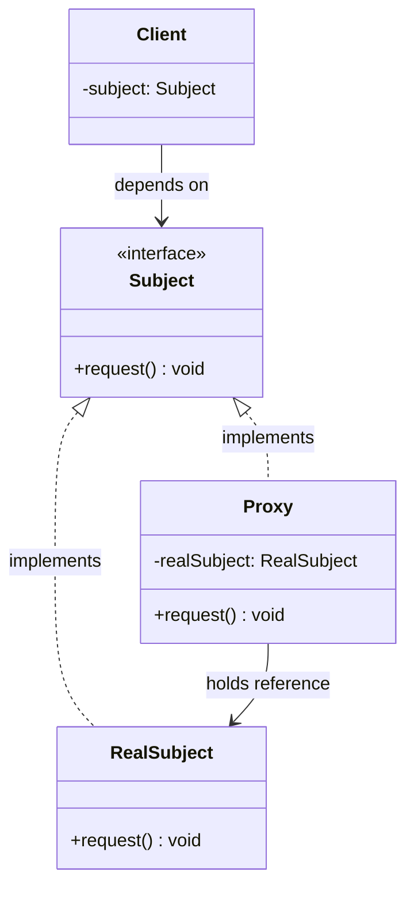
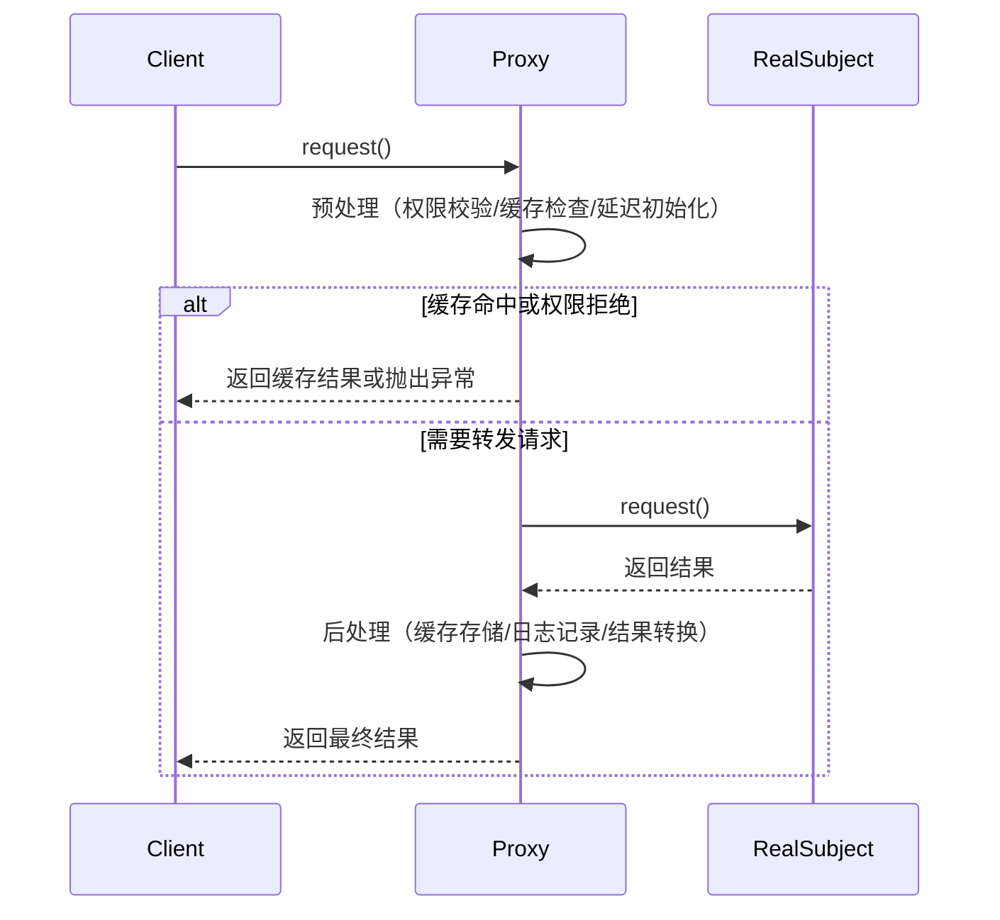
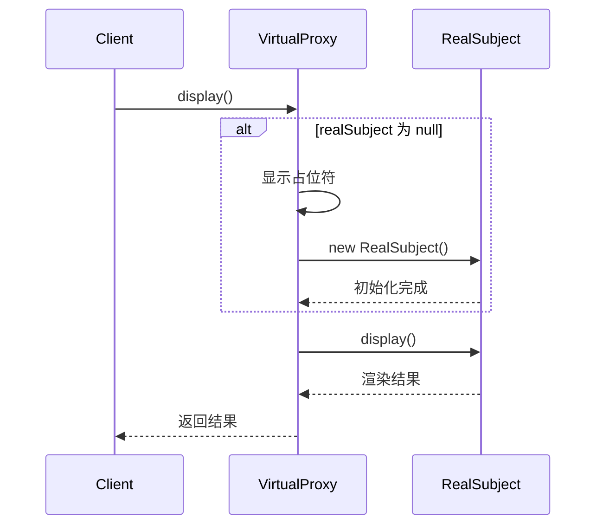

# 代理模式

## 1. 定义与意图

> 为其他对象提供一种代理以控制对这个对象的访问。-- GoF

代理模式（Proxy Pattern）是一种结构型设计模式，它通过引入代理对象来间接访问真实对象，从而在不修改真实对象的前提下，对访问进行控制、延迟或增强。

核心思想：客户端不直接与真实对象交互，而是通过代理对象进行间接通信。代理对象在请求到达真实对象前后，可以插入额外的逻辑，如权限校验、延迟初始化、结果缓存、日志记录等。

---

## 2. UML类图



---

## 3. 核心角色与职责

| 角色 | 职责 |
|------|------|
| Subject | 定义 RealSubject 和 Proxy 的共用接口，保证代理与真实对象对外透明 |
| RealSubject | 定义真实对象，包含实际业务逻辑 |
| Proxy | 持有 RealSubject 的引用，控制对其访问，可附加预处理与后处理逻辑 |
| Client | 通过 Subject 接口与 Proxy 交互，无需感知真实对象的存在 |

### 代理类型总览

| 代理类型 | 核心目的 | 典型场景 |
|----------|----------|----------|
| 虚拟代理 | 延迟创建开销大的对象 | 图片懒加载、重量级服务延迟初始化 |
| 保护代理 | 控制访问权限 | 权限校验、敏感数据保护 |
| 缓存代理 | 缓存结果避免重复计算 | 接口缓存、计算结果缓存 |
| 智能引用 | 访问时执行额外操作 | 引用计数、日志记录 |
| 远程代理 | 代表远程对象 | RPC 调用、Web Service |

---

## 4. 应用场景

### 4.1 通用场景

#### 延迟加载

#### 访问控制

#### 缓存

---

### 4.2 前端框架实战

#### Vue 3 reactive -- Proxy 实现响应式

#### 图片懒加载 -- 虚拟代理在 Img 标签上的应用

#### API 缓存代理 -- 拦截 fetch 请求，缓存响应结果

#### 表单验证代理 -- Proxy 拦截 setter 做实时校验

---

## 5. Mermaid流程图

### 代理模式请求处理流程



### 虚拟代理延迟加载流程



---

## 6. 优缺点分析

| 优点 | 缺点 |
|------|------|
| 控制访问：可在不修改真实对象的前提下控制对其访问 | 增加间接层：引入代理对象增加了系统复杂度 |
| 延迟初始化：虚拟代理可推迟开销大的对象创建时机 | 响应可能延迟：代理的预处理逻辑可能增加请求延迟 |
| 符合 OCP：对扩展开放、对修改关闭，无需改动真实对象 | 代理与真实对象接口一致但类型不同：TypeScript 中 Proxy 返回的类型与 target 不完全等价 |
| 职责分离：代理专注于控制逻辑，真实对象专注于业务逻辑 | 调试困难：代理层可能使调用栈和断点变得复杂 |
| 缓存与优化：缓存代理可显著提升重复访问性能 | 性能开销：ES6 Proxy 比直接属性访问慢约 3-10 倍 |

---

## 7. 相关模式对比

| 对比维度 | 代理 | 装饰器 | 适配器 |
|----------|------|-------|-------|
| 意图 | 控制访问 | 增强功能 | 接口转换 |
| 接口 | 与真实对象一致 | 与组件一致 | 转换为目标接口 |
| 创建者 | 代理方 | 客户端 | 客户端 |
| 对象关系 | 一对一，代理代表真实对象 | 可多层装饰 | 连接不兼容接口 |
| 透明性 | 对客户端透明 | 对客户端透明 | 客户端感知适配器 |
| 典型场景 | 权限控制、延迟加载、缓存 | 日志、性能监控、重试 | 旧接口适配新接口 |

### 代码对比

---

## 8. 总结

代理模式是结构型设计模式中应用最广泛的模式之一，其核心价值在于**通过间接层控制对象访问**，从而实现关注点分离。

**核心要点回顾：**

1. **三种经典代理**：虚拟代理（延迟加载）、保护代理（权限控制）、缓存代理（结果缓存）各有明确的适用场景，选择时应根据实际需求对号入座。

2. **ES6 Proxy 是代理模式的现代实现**：`new Proxy(target, handler)` 提供了 13 种拦截操作，配合 `Reflect` API 可确保默认行为正确执行，是 TypeScript/JavaScript 中实现代理模式的首选方式。

3. **Vue 3 响应式是代理模式的经典应用**：`reactive()` 本质上就是通过 Proxy 拦截 get/set/deleteProperty 实现依赖追踪与变更触发，理解代理模式是理解现代框架响应式原理的基础。

4. **泛型代理工厂与可撤销代理**：`createProxy<T>()` 提供了类型安全的通用代理创建能力，`Proxy.revocable()` 则为资源生命周期管理提供了安全机制。

5. **与装饰器模式的区别**：代理强调**控制访问**，装饰器强调**增强功能**。代理由代理方创建，客户端无感知；装饰器由客户端动态组合，可多层叠加。

6. **性能考量**：ES6 Proxy 比直接属性访问慢约 3-10 倍，在性能敏感路径上应谨慎使用。可通过缓存高频属性、限制代理嵌套深度、使用 `WeakMap` 避免内存泄漏等方式优化。

**实践建议**：优先使用 ES6 Proxy + Reflect 实现代理逻辑；保持代理透明性，不破坏原始语义；使用 `Proxy.revocable()` 管理代理生命周期；在深层嵌套对象代理时设置深度上限防止无限递归；为代理添加调试信息以便排查问题。

---

## TypeScript 实现

### 基础实现

#### 4.1.1 虚拟代理 -- 图片懒加载

```typescript
// 抽象主题接口
interface Image {
  display(): void;
}

// 真实主题：真实图片
class RealImage implements Image {
  constructor(private readonly filename: string) {
    this.loadFromDisk();
  }

  private loadFromDisk(): void {
    console.log(`[RealImage] 从磁盘加载: ${this.filename}`);
  }

  display(): void {
    console.log(`[RealImage] 显示图片: ${this.filename}`);
  }
}

// 虚拟代理：延迟加载真实图片
class VirtualImageProxy implements Image {
  private realImage: RealImage | null = null;

  constructor(private readonly filename: string) {}

  display(): void {
    if (!this.realImage) {
      console.log(`[VirtualProxy] 占位符显示: ${this.filename}`);
      this.realImage = new RealImage(this.filename); // 首次才加载
    }
    this.realImage.display();
  }
}

// 使用
const image: Image = new VirtualImageProxy('large-photo.png');
image.display();
// [VirtualProxy] 占位符显示: large-photo.png
// [RealImage] 从磁盘加载: large-photo.png
// [RealImage] 显示图片: large-photo.png
image.display(); // 第二次不再加载
// [RealImage] 显示图片: large-photo.png
```

#### 4.1.2 保护代理 -- 权限校验

```typescript
type UserRole = 'admin' | 'editor' | 'viewer';

interface DocumentService {
  read(docId: string): string;
  write(docId: string, content: string): void;
  delete(docId: string): void;
}

class RealDocumentService implements DocumentService {
  read(docId: string): string {
    return `文档内容: ${docId}`;
  }
  write(docId: string, content: string): void {
    console.log(`写入文档 ${docId}: ${content}`);
  }
  delete(docId: string): void {
    console.log(`删除文档 ${docId}`);
  }
}

// 保护代理：按角色校验权限
class DocumentServiceProxy implements DocumentService {
  private permissions: Record<UserRole, Array<keyof DocumentService>> = {
    admin: ['read', 'write', 'delete'],
    editor: ['read', 'write'],
    viewer: ['read'],
  };

  constructor(
    private readonly target: DocumentService,
    private readonly role: UserRole
  ) {}

  private check(method: keyof DocumentService): void {
    if (!this.permissions[this.role].includes(method)) {
      throw new Error('权限不足: ' + method);
    }
  }

  read(docId: string): string { this.check('read'); return this.target.read(docId); }
  write(docId: string, content: string): void { this.check('write'); this.target.write(docId, content); }
  delete(docId: string): void { this.check('delete'); this.target.delete(docId); }
}

// 使用
const service: DocumentService = new DocumentServiceProxy(
  new RealDocumentService(),
  'editor'
);
service.read('doc-1');   // 正常
service.write('doc-1', 'new content'); // 正常
// service.delete('doc-1'); // Error: 权限不足
```

#### 4.1.3 缓存代理 -- 计算结果缓存

```typescript
interface Calculator {
  compute(n: number): number;
}

class RealCalculator implements Calculator {
  compute(n: number): number {
    console.log(`[RealCalculator] 执行计算: fib(${n})`);
    if (n <= 1) return n;
    // 递归仅用于演示，实际应使用迭代
    return this.compute(n - 1) + this.compute(n - 2);
  }
}

// 迭代版计算器
class IterativeCalculator implements Calculator {
  compute(n: number): number {
    let a = 0, b = 1;
    for (let i = 0; i < n; i++) [a, b] = [b, a + b];
    return a;
  }
}

// 缓存代理：缓存计算结果
class CacheCalculatorProxy implements Calculator {
  private cache = new Map<number, number>();

  constructor(private readonly target: Calculator) {}

  compute(n: number): number {
    if (this.cache.has(n)) {
      console.log(`[CacheProxy] 命中缓存: fib(${n}) = ${this.cache.get(n)}`);
      return this.cache.get(n)!;
    }
    const result = this.target.compute(n);
    this.cache.set(n, result);
    return result;
  }
}

const calc: Calculator = new CacheCalculatorProxy(new IterativeCalculator());
console.log(calc.compute(10)); // 计算
console.log(calc.compute(10)); // 缓存命中
```

---

### 现代 TypeScript 实现

#### 4.2.1 ES6 Proxy + Reflect 基础

```typescript
interface UserData {
  name: string;
  age: number;
  email: string;
}

const user: UserData = {
  name: 'Alice',
  age: 25,
  email: 'alice@example.com',
};

// 创建 Proxy
const userProxy = new Proxy(user, {
  get(target, prop) {
    console.log(`[Proxy GET] ${String(prop)}`);
    return Reflect.get(target, prop);
  },
  set(target, prop, value) {
    console.log(`[Proxy SET] ${String(prop)} = ${value}`);
    return Reflect.set(target, prop, value);
  },
  has(target, prop) {
    console.log(`[Proxy HAS] ${String(prop)}`);
    return Reflect.has(target, prop);
  },
});

userProxy.name;          // [Proxy GET] name
userProxy.age = 26;      // [Proxy SET] age = 26
'name' in userProxy;     // [Proxy HAS] name
```

#### 4.2.2 泛型代理工厂

```typescript
interface ProxyHandlers<T extends object> {
  beforeGet?(target: T, prop: string | symbol): void;
  afterGet?(target: T, prop: string | symbol, result: unknown): void;
  beforeSet?(target: T, prop: string | symbol, value: unknown): boolean;
  afterSet?(target: T, prop: string | symbol, value: unknown, success: boolean): void;
}

function createProxy<T extends object>(
  target: T,
  handlers: ProxyHandlers<T>
): T {
  return new Proxy<T>(target, {
    get(target, prop, receiver) {
      handlers.beforeGet?.(target, prop);
      const result = Reflect.get(target, prop, receiver);
      handlers.afterGet?.(target, prop, result);
      return result;
    },
    set(target, prop, value, receiver) {
      const allowed = handlers.beforeSet?.(target, prop, value) ?? true;
      if (!allowed) return false;
      const success = Reflect.set(target, prop, value, receiver);
      handlers.afterSet?.(target, prop, value, success);
      return success;
    }
  });
}

// ==================== 使用 ====================
const config = createProxy(
  { theme: 'dark', locale: 'zh-CN' },
  {
    beforeSet(target, prop, value) {
      console.log(`[ConfigProxy] 即将修改 ${String(prop)}: ${String(value)}`);
      return true;
    },
    afterSet(_, prop, value) {
      console.log(`[ConfigProxy] ${String(prop)} 已更新为 ${String(value)}`);
    },
  }
);

config.theme = 'light';
// [ConfigProxy] 即将修改 theme: light
// [ConfigProxy] theme 已更新为 light
```

#### 4.2.3 可撤销代理

```typescript
interface SensitiveResource {
  data: string;
  read(): string;
}

function createRevocableResource(initialData: string): {
  proxy: SensitiveResource;
  revoke: () => void;
} {
  const target: SensitiveResource = {
    data: initialData,
    read(): string {
      return initialData; // 不经 this.data，避免命中 get 拦截
    }
  };

  const { proxy, revoke } = Proxy.revocable(target, {
    get(t, prop) {
      if (prop === 'data') throw new Error('禁止直接访问 data 属性');
      return Reflect.get(t, prop);
    }
  });

  return { proxy: proxy as SensitiveResource, revoke };
}

const { proxy: resource, revoke } = createRevocableResource('secret-value');
console.log(resource.read()); // secret-value
// resource.data;              // Error: 禁止直接访问

revoke(); // 撤销代理
// resource.read();            // TypeError: Cannot perform 'get' on a proxy that has been revoked
```

#### 4.2.4 Proxy 的 13 种拦截操作及 TypeScript 类型

```typescript
// ProxyHandler<T> 完整类型定义（13 种拦截操作）
interface FullProxyHandler<T extends object> {
  // 1. 拦截属性读取
  get?(target: T, property: string | symbol, receiver: unknown): unknown;

  // 2. 拦截属性设置
  set?(target: T, property: string | symbol, value: unknown, receiver: unknown): boolean;

  // 3. 拦截属性删除
  deleteProperty?(target: T, property: string | symbol): boolean;

  // 4. 拦截 in 操作符
  has?(target: T, property: string | symbol): boolean;

  // 5. 拦截 Object.getOwnPropertyDescriptor
  getOwnPropertyDescriptor?(target: T, property: string | symbol): PropertyDescriptor | undefined;

  // 6. 拦截 Object.defineProperty
  defineProperty?(target: T, property: string | symbol, descriptor: PropertyDescriptor): boolean;

  // 7. 拦截 Object.getPrototypeOf
  getPrototypeOf?(target: T): object | null;

  // 8. 拦截 Object.setPrototypeOf
  setPrototypeOf?(target: T, proto: object | null): boolean;

  // 9. 拦截函数调用
  apply?(target: T, thisArg: unknown, argArray: unknown[]): unknown;

  // 10. 拦截 new 操作
  construct?(target: T, argArray: unknown[], newTarget: Function): object;

  // 11. 拦截 Object.getOwnPropertyNames / keys
  ownKeys?(target: T): ArrayLike<string | symbol>;

  // 12. 拦截 Object.preventExtensions
  preventExtensions?(target: T): boolean;

  // 13. 拦截 Object.isExtensible
  isExtensible?(target: T): boolean;
}

// ==================== 私有属性保护代理 ====================
function createPrivateProxy<T extends object>(target: T): T {
  return new Proxy(target, {
    get(obj, prop) {
      if (typeof prop === 'string' && prop.startsWith('_')) {
        throw new Error('无法访问私有属性');
      }
      return Reflect.get(obj, prop);
    },
    set(obj, prop, value) {
      if (typeof prop === 'string' && prop.startsWith('_')) {
        throw new Error('无法修改私有属性');
      }
      return Reflect.set(obj, prop, value);
    },
    ownKeys(obj) {
      return Reflect.ownKeys(obj).filter((k) => !(typeof k === 'string' && k.startsWith('_')));
    },
  });
}

// 使用
const obj = createPrivateProxy({
  name: 'Alice',
  _password: 'secret123',
});
console.log(obj.name);       // Alice
// console.log(obj._password); // Error: 无法访问私有属性
```

---

```typescript
interface HeavyService {
  processData(input: string): string;
  getStatus(): string;
}

class ExpensiveService implements HeavyService {
  constructor() {
    console.log('[ExpensiveService] 初始化开销大的资源...');
  }

  processData(input: string): string {
    return `处理结果: ${input.toUpperCase()}`;
  }
  getStatus(): string {
    return 'ready';
  }
}

// 虚拟代理：延迟初始化重型服务
class LazyServiceProxy implements HeavyService {
  private realService: ExpensiveService | null = null;

  private getRealService(): ExpensiveService {
    if (!this.realService) {
      this.realService = new ExpensiveService(); // 首次访问才初始化
    }
    return this.realService;
  }

  processData(input: string): string {
    return this.getRealService().processData(input);
  }
  getStatus(): string {
    if (!this.realService) return 'lazy-initialized（未初始化）';
    return this.realService.getStatus();
  }
}

const lazyService: HeavyService = new LazyServiceProxy();
console.log(lazyService.getStatus()); // lazy-initialized（未初始化）
console.log(lazyService.processData('hello')); // 触发初始化
```

```typescript
type Permission = 'read' | 'write' | 'delete' | 'execute';

interface SecureResource {
  perform(action: string, ...args: unknown[]): unknown;
}

class AccessControlProxy implements SecureResource {
  constructor(
    private readonly target: SecureResource,
    private readonly userPermissions: Set<Permission>
  ) {}

  perform(action: string, ...args: unknown[]): unknown {
    const required = this.mapPermission(action);
    if (!this.userPermissions.has(required)) {
      throw new Error(`权限不足: 需要 ${required} 权限`);
    }
    return this.target.perform(action, ...args);
  }

  private mapPermission(action: string): Permission {
    const mapping: Record<string, Permission> = {
      read: 'read',
      write: 'write',
      remove: 'delete',
      run: 'execute',
    };
    return mapping[action] ?? 'execute';
  }
}
```

```typescript
interface AsyncDataService {
  fetch(key: string): Promise<string>;
}

class RemoteDataService implements AsyncDataService {
  async fetch(key: string): Promise<string> {
    console.log(`[Remote] 请求远程数据: ${key}`);
    // 模拟网络延迟
    await new Promise((resolve) => setTimeout(resolve, 100));
    return `data-for-${key}`;
  }
}

// 缓存代理：带 TTL 的异步缓存
class CacheProxy implements AsyncDataService {
  private cache = new Map<string, { value: string; expiresAt: number }>();

  constructor(
    private readonly target: AsyncDataService,
    private readonly ttl: number
  ) {}

  async fetch(key: string): Promise<string> {
    const hit = this.cache.get(key);
    if (hit && Date.now() < hit.expiresAt) {
      console.log(`[CacheProxy] 命中缓存: ${key}`);
      return hit.value;
    }
    const value = await this.target.fetch(key);
    this.cache.set(key, { value, expiresAt: Date.now() + this.ttl });
    return value;
  }
}

const dataService: AsyncDataService = new CacheProxy(new RemoteDataService(), 30_000);
await dataService.fetch('user-1'); // 远程请求
await dataService.fetch('user-1'); // 缓存命中
```

```typescript
// Vue 3 reactive() 本质就是 Proxy 代理
// 拦截 get/set/deleteProperty 实现响应式追踪与触发

type EffectFn = () => void;

let activeEffect: EffectFn | null = null;

function effect(fn: EffectFn): EffectFn {
  const execute: EffectFn = () => {
    activeEffect = execute;
    fn();
    activeEffect = null;
  };
  execute();
  return execute;
}

// 依赖收集与触发（简化版响应式）
const depsMap = new WeakMap<object, Map<string, Set<EffectFn>>>();

function track(target: object, key: string): void {
  if (!activeEffect) return;
  let deps = depsMap.get(target);
  if (!deps) depsMap.set(target, (deps = new Map()));
  let dep = deps.get(key);
  if (!dep) deps.set(key, (dep = new Set()));
  dep.add(activeEffect);
}

function trigger(target: object, key: string): void {
  depsMap.get(target)?.get(key)?.forEach((fn) => fn());
}

function reactive<T extends object>(target: T): T {
  return new Proxy(target, {
    get(obj, prop) {
      track(obj, String(prop));
      return Reflect.get(obj, prop);
    },
    set(obj, prop, value) {
      const result = Reflect.set(obj, prop, value);
      trigger(obj, String(prop));
      return result;
    },
    deleteProperty(obj, prop) {
      const result = Reflect.deleteProperty(obj, prop);
      trigger(obj, String(prop));
      return result;
    }
  });
}

// 使用
const state = reactive({ count: 0, name: 'Alice' });
effect(() => {
  console.log(`[effect] count = ${state.count}`);
});
// [effect] count = 0

state.count++; // [effect] count = 1
state.name = 'Bob'; // 不触发 count 的 effect
```

```typescript
interface ImageLoader {
  setSrc(src: string): void;
  getSrc(): string;
  isLoaded(): boolean;
}

class LazyImageLoader implements ImageLoader {
  private loaded = false;
  private currentSrc = '';
  private readonly placeholder: string;

  constructor(placeholderSrc: string = '/placeholder.png') {
    this.placeholder = placeholderSrc;
  }

  setSrc(src: string): void {
    this.currentSrc = src;
    if (this.loaded) return;
    // 虚拟代理：先用占位图，待真实图片就绪再替换
    const img = new Image();
    img.onload = () => { this.loaded = true; this.currentSrc = src; };
    img.src = src;
  }
  getSrc(): string {
    return this.loaded ? this.currentSrc : this.placeholder;
  }
  isLoaded(): boolean { return this.loaded; }
}

// 基于 IntersectionObserver 的图片懒加载代理
class LazyImageManager {
  private observer: IntersectionObserver;
  private loaderMap = new Map<HTMLElement, ImageLoader>();

  constructor() {
    this.observer = new IntersectionObserver((entries) => {
      entries.forEach((entry) => {
        if (entry.isIntersecting) {
          const loader = this.loaderMap.get(entry.target as HTMLElement);
          const dataSrc = (entry.target as HTMLElement).dataset.src;
          if (loader && dataSrc) loader.setSrc(dataSrc);
        }
      });
    });
  }

  observe(el: HTMLElement, loader: ImageLoader): void {
    this.loaderMap.set(el, loader);
    this.observer.observe(el);
  }

  disconnect(): void {
    this.observer.disconnect();
    this.loaderMap.clear();
  }
}
```

```typescript
interface CacheConfig {
  ttl: number;
  maxSize: number;
}

class ApiCacheProxy {
  private readonly cache = new Map<string, { response: unknown; timestamp: number }>();
  private readonly config: CacheConfig;

  constructor(config: Partial<CacheConfig> = {}) {
    this.config = {
      ttl: config.ttl ?? 60_000,
      maxSize: config.maxSize ?? 100,
    };
  }

  async fetch<T>(url: string): Promise<T> {
    const cached = this.cache.get(url);
    if (cached && Date.now() - cached.timestamp < this.config.ttl) {
      console.log(`[ApiCacheProxy] 命中缓存: ${url}`);
      return cached.response as T;
    }
    const response = await fetch(url).then((r) => r.json());
    this.cache.set(url, { response, timestamp: Date.now() });
    this.evictIfNeeded();
    return response as T;
  }

  clear(): void { this.cache.clear(); }

  // 超出容量时清理最旧条目
  private evictIfNeeded(): void {
    if (this.cache.size <= this.config.maxSize) return;
    const oldestKey = [...this.cache.entries()].sort(
      (a, b) => a[1].timestamp - b[1].timestamp
    )[0][0];
    this.cache.delete(oldestKey);
  }
}

// 使用
const apiCache = new ApiCacheProxy({ ttl: 30_000, maxSize: 50 });
interface UserDTO { id: number; name: string; }
const user = await apiCache.fetch<UserDTO>('/api/users/1');
```

```typescript
interface ValidationRule {
  type?: string;
  required?: boolean;
  min?: number;
  max?: number;
  minLength?: number;
  maxLength?: number;
  pattern?: RegExp;
  validator?: (value: unknown) => boolean;
  message?: string;
}

// 校验函数：根据规则校验单个值
function validateField(value: unknown, rules: ValidationRule[]): string | null {
  for (const rule of rules) {
    if (rule.required && (value === '' || value == null)) return rule.message ?? '该字段必填';
    if (rule.min !== undefined && typeof value === 'number' && value < rule.min) return rule.message ?? `不能小于 ${rule.min}`;
    if (rule.max !== undefined && typeof value === 'number' && value > rule.max) return rule.message ?? `不能大于 ${rule.max}`;
    if (rule.minLength !== undefined && typeof value === 'string' && value.length < rule.minLength) return rule.message ?? `长度不能少于 ${rule.minLength}`;
    if (rule.pattern && typeof value === 'string' && !rule.pattern.test(value)) return rule.message ?? '格式不正确';
    if (rule.validator && !rule.validator(value)) return rule.message ?? '校验未通过';
  }
  return null;
}

// 表单验证代理：setter 时实时校验
function createValidationProxy<T extends object>(
  data: T,
  rules: Partial<Record<keyof T, ValidationRule[]>>
): { data: T; errors: Record<string, string | null> } {
  const errors: Record<string, string | null> = {};
  const proxy = new Proxy(data, {
    set(target, prop, value) {
      const propRules = rules[prop as keyof T];
      if (propRules) {
        const error = validateField(value, propRules);
        errors[String(prop)] = error;
        if (error) console.warn(`[验证失败] ${String(prop)}: ${error}`);
        else console.log(`[验证通过] ${String(prop)}`);
      }
      return Reflect.set(target, prop, value);
    }
  });
  return { data: proxy, errors };
}

// 使用
const form = createValidationProxy(
  { username: '', age: 0, email: '' },
  {
    username: [{ required: true, minLength: 3, message: '用户名至少3个字符' }],
    age: [{ required: true, min: 1, max: 150, message: '年龄需在 1-150 之间' }],
    email: [{ pattern: /^[^\s@]+@[^\s@]+\.[^\s@]+$/, message: '邮箱格式不正确' }],
  }
);

form.data.username = 'A';   // 验证失败
form.data.username = 'Alice'; // 验证通过
form.data.age = 200;        // 验证失败
form.data.email = 'invalid'; // 验证失败
```

```typescript
// 代理模式 -- 控制访问
const userServiceProxy = new Proxy(userService, {
  get(target, prop) {
    if (prop === 'deleteUser' && currentUser.role !== 'admin') {
      throw new Error('权限不足');
    }
    return Reflect.get(target, prop);
  },
});

// 装饰器模式 -- 增强功能
function withLogging<T extends object>(target: T): T {
  return new Proxy(target, {
    get(obj, prop) {
      const value = Reflect.get(obj, prop);
      if (typeof value === 'function') {
        return (...args: unknown[]) => {
          console.log(`[LOG] 调用 ${String(prop)}`);
          return value.apply(obj, args);
        };
      }
      return value;
    }
  });
}

// 适配器模式 -- 接口转换
interface OldDataFormat { pk: number; label: string; }
interface NewDataFormat { id: string; name: string; }

class DataAdapter {
  private transform(old: OldDataFormat): NewDataFormat {
    return { id: String(old.pk), name: old.label };
  }
}
```

---

## Java 实现

### 静态代理

```java
// 抽象主题
interface Image {
    void display();
}

// 真实主题
class RealImage implements Image {
    private final String fileName;

    public RealImage(String fileName) {
        this.fileName = fileName;
        loadFromDisk();
    }

    private void loadFromDisk() {
        System.out.println("从磁盘加载: " + fileName);
    }

    @Override
    public void display() {
        System.out.println("显示: " + fileName);
    }
}

// 代理：延迟加载 + 访问控制
class ProxyImage implements Image {
    private RealImage realImage;
    private final String fileName;

    public ProxyImage(String fileName) {
        this.fileName = fileName;
    }

    @Override
    public void display() {
        // 惰性创建真实对象，控制访问时机
        if (realImage == null) {
            realImage = new RealImage(fileName);
        }
        realImage.display();
    }
}

// 使用
public class Client {
    public static void main(String[] args) {
        Image image = new ProxyImage("photo.jpg");
        image.display();  // 首次调用才加载
        image.display();  // 已缓存，直接显示
    }
}
```

### 动态代理（JDK 动态代理）

```java
import java.lang.reflect.InvocationHandler;
import java.lang.reflect.Method;
import java.lang.reflect.Proxy;

// 动态代理处理器：统一添加日志
class LogHandler implements InvocationHandler {
    private final Object target;

    public LogHandler(Object target) {
        this.target = target;
    }

    @Override
    public Object invoke(Object proxy, Method method, Object[] args) throws Throwable {
        System.out.println("[日志] 调用 " + method.getName());
        return method.invoke(target, args);
    }

    @SuppressWarnings("unchecked")
    public static <T> T create(Class<T> interfaceType, T target) {
        return (T) Proxy.newProxyInstance(
                interfaceType.getClassLoader(),
                new Class<?>[]{interfaceType},
                new LogHandler(target));
    }
}

// 使用
public class Client2 {
    public static void main(String[] args) {
        Image real = new RealImage("a.jpg");
        Image proxy = LogHandler.create(Image.class, real); // 动态生成代理
        proxy.display();
    }
}
```

> 代理模式分为静态代理（编译期定义）与动态代理（运行时生成）。Java 动态代理有 JDK Proxy（基于接口）与 CGLIB（基于类继承）两种。Spring AOP 的核心就是动态代理。

## Python 实现

### 代理模式

```python
# 抽象主题（Python 用鸭子类型）
class Image:
    def display(self):
        raise NotImplementedError

class RealImage(Image):
    def __init__(self, file_name: str):
        self.file_name = file_name
        self._load_from_disk()

    def _load_from_disk(self):
        print(f"从磁盘加载: {self.file_name}")

    def display(self):
        print(f"显示: {self.file_name}")

# 代理：延迟加载
class ProxyImage(Image):
    def __init__(self, file_name: str):
        self.file_name = file_name
        self._real_image = None

    def display(self):
        if self._real_image is None:
            self._real_image = RealImage(self.file_name)
        self._real_image.display()

# 使用
image = ProxyImage("photo.jpg")
image.display()  # 首次才加载
image.display()  # 缓存
```

### 代理模式（Python `__getattr__` 动态代理）

```python
class LoggingProxy:
    """动态代理：拦截所有属性访问并记录日志"""
    def __init__(self, target):
        object.__setattr__(self, "_target", target)

    def __getattr__(self, name):
        target = object.__getattribute__(self, "_target")
        attr = getattr(target, name)
        if callable(attr):
            def wrapper(*args, **kwargs):
                print(f"[日志] 调用 {name}")
                return attr(*args, **kwargs)
            return wrapper
        return attr

real = RealImage("b.jpg")
proxy = LoggingProxy(real)
proxy.display()
```

> Python 通过 `__getattr__` 实现动态代理非常简洁，可统一拦截方法调用（日志、鉴权、延迟加载）。`unittest.mock.Mock` 就是动态代理的典型应用。

