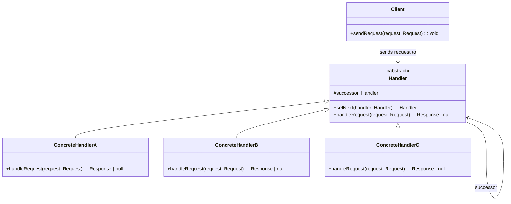
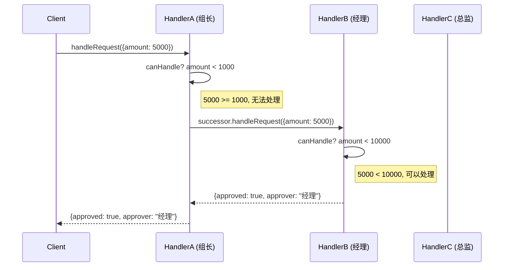
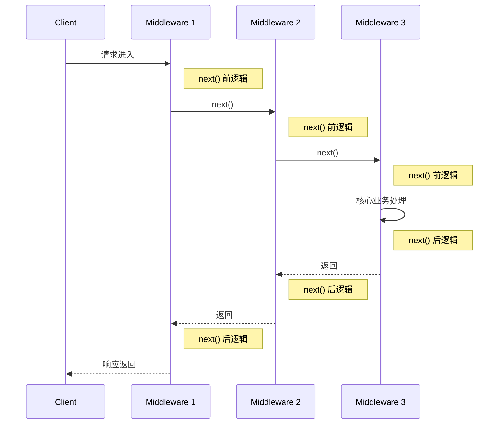

# 职责链模式

> 使多个对象都有机会处理请求，从而避免请求的发送者和接收者之间的耦合关系。将这些对象连成一条链，并沿着这条链传递请求，直到有一个对象处理它为止。-- GoF

## 1. 定义与意图

职责链模式（Chain of Responsibility Pattern）是一种行为型设计模式，其核心思想是：

- **解耦发送者与接收者**：请求的发送者不需要知道哪个对象最终会处理该请求
- **链式传递**：将多个处理者组成一条链，请求沿链传递，直到被处理
- **动态组合**：可以在运行时动态地增删处理者或调整链的顺序

### 两种变体

```
+-------------------------------------------------------------+
|                    职责链模式变体                            |
+-------------------------------------------------------------+
|                                                             |
|  纯职责链：只有一个处理者最终处理请求                        |
|  ------------------------------                              |
|  Handler A --> Handler B --> Handler C                       |
|                      |                                      |
|                  在此处处理，链条终止                        |
|                                                             |
|  不纯职责链：多个处理者均可参与处理                          |
|  ------------------------------                              |
|  Handler A --> Handler B --> Handler C                       |
|      |            |            |                             |
|  处理一部分   处理一部分   处理一部分                        |
|                                                             |
+-------------------------------------------------------------+
```

---

## 2. UML类图



### 结构详解

```
+-------------------------------------------------------------+
|                    职责链模式结构                            |
+-------------------------------------------------------------+
|                                                             |
|   Client                                                    |
|     |                                                       |
|     | request                                               |
|     v                                                       |
|   +----------+    +----------+    +----------+              |
|   | Handler  |--->| Handler  |--->| Handler  |              |
|   |    A     |    |    B     |    |    C     |              |
|   +----------+    +----------+    +----------+              |
|        |               |               |                    |
|        | canHandle?    | canHandle?    | canHandle?         |
|        |-- yes: process|-- yes: process|-- yes: process     |
|        |-- no: next    |-- no: next    |-- no: return null  |
|                                                             |
|   关键机制：                                                |
|   * 每个处理者持有后继者引用 (successor)                    |
|   * 处理者自行决定处理或转发                                |
|   * 链尾无后继者时返回默认结果                              |
|                                                             |
+-------------------------------------------------------------+
```

---

## 3. 核心角色与职责

| 角色 | 职责 |
|------|------|
| **Handler** | 定义处理请求接口，维护后继者链 (successor)，提供默认转发行为 |
| **ConcreteHandler** | 处理自己负责的请求，若无法处理则转发给后继者 |
| **Client** | 向链头发起请求，无需知道链的具体构成 |

### 角色协作流程

```
+-------------------------------------------------------------+
|                    角色协作流程                              |
+-------------------------------------------------------------+
|                                                             |
|   1. Client 创建请求对象                                    |
|              |                                              |
|   2. Client 调用链头 Handler 的 handleRequest()             |
|              |                                              |
|   3. HandlerA 判断能否处理                                  |
|              |                                              |
|        +-----+-----+                                        |
|        |           |                                        |
|     能处理     不能处理                                     |
|        |           |                                        |
|   返回结果   调用 successor.handleRequest()                  |
|                    |                                        |
|   4. HandlerB 判断能否处理 ... (同上)                       |
|                    |                                        |
|   5. 链尾无后继者，返回 null 或默认值                       |
|                                                             |
+-------------------------------------------------------------+
```

---

## 4. 应用场景

### 4.1 通用场景

#### 4.1.1 审批流程

#### 4.1.2 异常处理

#### 4.1.3 事件冒泡

### 4.2 前端框架实战

#### 4.2.1 Express/Koa 中间件

Express/Koa 的 `app.use()` 本质就是职责链模式。Koa 的洋葱模型尤为典型：

#### 4.2.2 React 事件冒泡

React 的 SyntheticEvent 从子组件向父组件传播，本质上就是职责链：

#### 4.2.3 表单验证链

必填 -> 格式 -> 长度 -> 自定义规则，任一失败即停止：

#### 4.2.4 Node.js Stream

Node.js 的 Transform 链式处理本质上是职责链模式：

---

## 5. Mermaid流程图

### 请求在链上传递的流程



### 洋葱模型执行流程



---

## 6. 优缺点分析

| 优点 | 缺点 |
|------|------|
| **解耦发送者和接收者**：发送者无需知道哪个对象处理请求 | **不保证请求被处理**：若链尾无处理者，请求将被忽略 |
| **动态调整链**：运行时可增删处理者或调整顺序 | **调试困难**：链过长时，难以追踪请求在哪一步被处理 |
| **符合开闭原则 (OCP)**：新增处理者无需修改已有代码 | **性能略受影响**：每个请求需遍历链，长链存在额外开销 |
| **符合单一职责原则 (SRP)**：每个处理者只负责自己的逻辑 | **可能产生循环引用**：不当的链配置可能导致无限循环 |
| **灵活组合**：可按需组合不同处理者形成不同链 | **请求处理顺序敏感**：处理者顺序影响最终结果 |

### 适用性判断

```
+-------------------------------------------------------------+
|                    适用性判断                                |
+-------------------------------------------------------------+
|                                                             |
|  适合使用职责链：                                           |
|  * 多个对象可处理同一请求，运行时确定处理者                 |
|  * 需要动态配置处理者集合和顺序                             |
|  * 发送者不应硬编码接收者                                   |
|  * 处理逻辑需要分层、分阶段执行                             |
|                                                             |
|  不适合使用职责链：                                         |
|  * 只有一个确定的接收者                                     |
|  * 处理逻辑固定不变                                         |
|  * 性能极端敏感，不允许遍历开销                             |
|  * 处理者数量过多（建议 < 10）                              |
|                                                             |
+-------------------------------------------------------------+
```

---

## 7. 相关模式对比

### 职责链 vs 状态模式

| 对比维度 | 职责链 | 状态 |
|----------|-------|------|
| **请求处理** | 多个处理器可能处理，沿链传递 | 当前状态处理，状态切换 |
| **对象关系** | 链式（水平传递） | 状态切换（垂直转换） |
| **处理结果** | 不确定哪个处理者处理 | 确定由当前状态处理 |
| **动态性** | 动态调整链的组成 | 动态切换当前状态 |
| **典型场景** | 审批流程、中间件、事件冒泡 | 订单状态、播放器状态 |

### 职责链 vs 策略模式

| 对比维度 | 职责链 | 策略 |
|----------|-------|------|
| **选择方式** | 运行时沿链自动确定 | 客户端显式选择 |
| **执行数量** | 可能多个处理者参与 | 只执行一个策略 |
| **控制权** | 处理者自行决定是否处理 | 客户端决定使用哪个策略 |
| **关系** | 处理者之间有后继者关系 | 策略之间相互独立 |

### 职责链 vs 装饰器模式

| 对比维度 | 职责链 | 装饰器 |
|----------|-------|--------|
| **意图** | 请求沿链传递，直到有人处理 | 动态增强对象功能 |
| **执行方式** | 可能多个处理者参与或中断 | 所有装饰器逐层执行 |
| **处理者职责** | 决定是否处理或转发 | 在委托前后增强 |
| **结构** | 链表式后继引用 | 包裹式嵌套 |
| **日志系统** | 格式化 -> 过滤 -> 输出 | 可扩展的处理流程 |
| **错误处理** | 按类型分派错误处理器 | 统一的错误处理策略 |
| **数据流** | Node.js Stream Transform 链 | 链式数据加工 |

### 关键要点

```
+-------------------------------------------------------------+
|                    职责链模式要点                            |
+-------------------------------------------------------------+
|                                                             |
|  核心思想                                                   |
|  * 请求沿链条传递，处理者可处理或转发                       |
|  * 发送者与接收者完全解耦                                   |
|  * 链的组成和顺序可动态调整                                 |
|                                                             |
|  实现方式                                                   |
|  * 对象引用链：每个处理者持有后继者引用                     |
|  * 数组迭代链：处理者存入数组，按序执行                     |
|  * 函数式组合：(req, next) => response                      |
|                                                             |
|  最佳实践                                                   |
|  * 控制链条长度（建议 < 10 个处理者）                       |
|  * 始终提供默认处理者，避免请求无处理                       |
|  * 添加日志追踪，便于调试长链                               |
|  * 防止循环引用，设置最大深度限制                           |
|  * 高频处理者优先，优化性能                                 |
|                                                             |
|  前端框架中的体现                                           |
|  * Express/Koa 中间件：洋葱模型职责链                      |
|  * React 事件系统：SyntheticEvent 冒泡链                    |
|  * Axios 拦截器：请求/响应拦截链                            |
|  * Redux 中间件：action 处理链                              |
|  * Node.js Stream：Transform 链式处理                      |
|                                                             |
+-------------------------------------------------------------+
```

### 参考资料

- [Chain of Responsibility - Refactoring Guru](https://refactoring.guru/design-patterns/chain-of-responsibility)
- [Chain of Responsibility - Wikipedia](https://en.wikipedia.org/wiki/Chain-of-responsibility_pattern)
- [Express Middleware](https://expressjs.com/en/guide/writing-middleware.html)
- [Koa - Next, Next, Next](https://koajs.com/)
- [Redux Middleware](https://redux.js.org/understanding/history-and-design/middleware)
- [Axios Interceptors](https://axios-http.com/docs/interceptors)
- [GoF - Design Patterns](https://book.douban.com/subject/1052241/)

---

## 8. 总结

> 职责链模式在前端开发中无处不在：Express/Koa 的中间件系统、React 的事件冒泡机制、Axios 的请求/响应拦截器、表单的多层验证规则，都是职责链的典型应用。理解并善用此模式，能够构建出高度解耦、灵活可扩展的请求处理架构。注意控制链条长度、提供默认处理者、添加日志追踪，是生产环境中使用此模式的关键实践。

---

## TypeScript 实现

### 基础实现

审批流程：金额 < 1000 组长审批 -> < 10000 经理审批 -> >= 10000 总监审批

```typescript
// ---- 请求与响应类型 ----

interface ApprovalRequest {
  amount: number;
  purpose: string;
  applicant: string;
}

interface ApprovalResponse {
  approved: boolean;
  approver: string;
  message: string;
}

// ---- 抽象处理者 ----
abstract class Approver {
  protected next: Approver | null = null;
  setNext(next: Approver): Approver { this.next = next; return next; }

  handleRequest(request: ApprovalRequest): ApprovalResponse {
    if (this.canApprove(request.amount)) {
      return this.approve(request);
    }
    if (this.next) {
      return this.next.handleRequest(request);
    }
    return { approved: false, approver: '系统', message: '无权限审批，已驳回' };
  }

  protected abstract canApprove(amount: number): boolean;
  protected abstract approve(request: ApprovalRequest): ApprovalResponse;
}

// ---- 具体处理者 ----
class TeamLeader extends Approver {
  protected canApprove(amount: number): boolean { return amount < 1000; }
  protected approve(request: ApprovalRequest): ApprovalResponse {
    return { approved: true, approver: '组长', message: `组长已批准 ${request.applicant} 的申请：${request.purpose}，金额 ${request.amount} 元` };
  }
}

class Manager extends Approver {
  protected canApprove(amount: number): boolean { return amount < 10000; }
  protected approve(request: ApprovalRequest): ApprovalResponse {
    return { approved: true, approver: '经理', message: `经理已批准 ${request.applicant} 的申请：${request.purpose}，金额 ${request.amount} 元` };
  }
}

class Director extends Approver {
  protected canApprove(amount: number): boolean { return amount >= 10000; }
  protected approve(request: ApprovalRequest): ApprovalResponse {
    return { approved: true, approver: '总监', message: `总监已批准 ${request.applicant} 的申请：${request.purpose}，金额 ${request.amount} 元` };
  }
}

// ---- 客户端 ----
function approvalClient() {
  const teamLeader = new TeamLeader();
  const manager = new Manager();
  const director = new Director();
  teamLeader.setNext(manager).setNext(director);

  const req1: ApprovalRequest = { amount: 500, purpose: '购买办公用品', applicant: '张三' };
  const req2: ApprovalRequest = { amount: 5000, purpose: '团队建设活动', applicant: '李四' };
  const req3: ApprovalRequest = { amount: 50000, purpose: '服务器采购', applicant: '王五' };

  const result = teamLeader.handleRequest(req1);
  console.log(result.message);
  console.log(teamLeader.handleRequest(req2).message);
  console.log(teamLeader.handleRequest(req3).message);
}
approvalClient();
// 组长已批准 张三 的申请：购买办公用品，金额 500 元
// 经理已批准 李四 的申请：团队建设活动，金额 5000 元
// 总监已批准 王五 的申请：服务器采购，金额 50000 元
```

### 现代 TypeScript 实现

#### 4.2.1 泛型职责链

```typescript
/**
 * 泛型职责链
 * 支持任意类型的请求和响应，提供完整的类型安全
 */

abstract class ChainHandler<TRequest, TResponse> {
  protected successor: ChainHandler<TRequest, TResponse> | null = null;

  setNext(handler: ChainHandler<TRequest, TResponse>): ChainHandler<TRequest, TResponse> {
    this.successor = handler;
    return handler;
  }

  handle(request: TRequest): TResponse {
    if (this.canHandle(request)) {
      return this.process(request);
    }
    if (this.successor) {
      return this.successor.handle(request);
    }
    throw new Error('链中没有处理者能处理该请求');
  }

  protected abstract canHandle(request: TRequest): boolean;
  protected abstract process(request: TRequest): TResponse;
}

// ==================== 具体处理者 ====================
interface LogRequest { level: 'debug' | 'info' | 'error'; message: string; }

class DebugHandler extends ChainHandler<LogRequest, string> {
  protected canHandle(req: LogRequest): boolean { return req.level === 'debug'; }
  protected process(req: LogRequest): string { return `[DEBUG] ${req.message}`; }
}

class InfoHandler extends ChainHandler<LogRequest, string> {
  protected canHandle(req: LogRequest): boolean { return req.level === 'info'; }
  protected process(req: LogRequest): string { return `[INFO] ${req.message}`; }
}

class ErrorHandler2 extends ChainHandler<LogRequest, string> {
  protected canHandle(req: LogRequest): boolean { return req.level === 'error'; }
  protected process(req: LogRequest): string { return `[ERROR] ${req.message}`; }
}

// 使用
const logChain = new DebugHandler();
logChain.setNext(new InfoHandler()).setNext(new ErrorHandler2());
console.log(logChain.handle({ level: 'error', message: 'DB down' })); // [ERROR] DB down
```

#### 4.2.2 异步中间件链

```typescript
/**
 * 异步中间件链
 * 支持 Promise 的 next() 调用，类似 Koa 洋葱模型
 */

interface MiddlewareContext {
  request: { method: string; path: string; headers: Record<string, string> };
  response: { status?: number; body?: unknown };
  state: Map<string, unknown>;
  aborted: boolean;
}

// 中间件类型：洋葱模型，调用 next() 进入下一层
type AsyncMiddleware = (ctx: MiddlewareContext, next: () => Promise<void>) => Promise<void>;

// 异步中间件链
class AsyncMiddlewareChain {
  private middlewares: AsyncMiddleware[] = [];

  use(middleware: AsyncMiddleware): this {
    this.middlewares.push(middleware);
    return this;
  }

  async execute(ctx: MiddlewareContext): Promise<void> {
    const compose = (index: number): Promise<void> => {
      if (ctx.aborted) return Promise.resolve();
      const middleware = this.middlewares[index];
      if (!middleware) return Promise.resolve();
      return middleware(ctx, () => compose(index + 1));
    };
    await compose(0);
  }
}

// ==================== 使用 ====================
const chain = new AsyncMiddlewareChain();
chain
  .use(async (ctx, next) => {
    console.log('1. 认证中间件 - before');
    await next();
    console.log('1. 认证中间件 - after');
  })
  .use(async (ctx, next) => {
    console.log('2. 日志中间件 - before');
    await next();
    console.log('2. 日志中间件 - after');
  })
  .use(async (ctx) => {
    console.log('3. 业务处理');
    ctx.response = { status: 200 };
  });

const result = await chain.execute({
  request: { method: 'GET', path: '/api/users', headers: { authorization: 'Bearer xxx' } },
  response: {},
  state: new Map(),
  aborted: false
});
```

#### 4.2.3 函数式职责链

```typescript
/**
 * 函数式职责链
 * 处理者签名为 (req, next) => response
 * 更轻量、更灵活，无需继承体系
 */

type ChainMiddleware<T, R> = (
  request: T,
  next: (request: T) => R | Promise<R>
) => R | Promise<R>;

class FunctionalChain<T, R> {
  private middlewares: ChainMiddleware<T, R>[] = [];

  use(middleware: ChainMiddleware<T, R>): this {
    this.middlewares.push(middleware);
    return this;
  }

  async execute(request: T): Promise<R> {
    const compose = (index: number, req: T): R | Promise<R> => {
      if (index >= this.middlewares.length) {
        throw new Error('链已结束，但没有处理者返回最终结果');
      }
      const middleware = this.middlewares[index];
      return middleware(req, (nextReq) => compose(index + 1, nextReq));
    };
    return compose(0, request);
  }
}

// ==================== 使用：数据转换链 ====================
interface TransformRequest {
  data: { name: string };
  errors: string[];
}
interface TransformResponse {
  data: { name: string; createdAt: string };
  errors: string[];
}

const transformChain = new FunctionalChain<TransformRequest, TransformResponse>();
transformChain
  .use((req, next) => {
    const trimmed = req.data.name.trim();
    if (!trimmed) req.errors.push('名称不能为空');
    return next({ data: { name: trimmed }, errors: req.errors });
  })
  .use(async (req) => {
    // 终结处理者：直接返回最终结果
    const withDate = { name: req.data.name, createdAt: new Date().toISOString() };
    return { data: withDate, errors: req.errors };
  });

const transformed = await transformChain.execute({
  data: { name: '  Alice  ' },
  errors: []
});
// { data: { name: 'Alice', createdAt: '2026-05-28T...' }, errors: [] }
```

#### 4.2.4 类型安全的中间件组合

```typescript
/**
 * 类型安全的中间件组合
 * 利用 TypeScript 类型系统确保中间件链的类型一致性
 */

// 中间件接口
interface IMiddleware<TInput, TOutput> {
  readonly name: string;
  process(input: TInput, next: (input: TInput) => Promise<TOutput>): Promise<TOutput>;
}

// 中间件组合器
class MiddlewareComposer<TInput, TOutput> {
  private middlewares: Array<IMiddleware<TInput, TOutput>> = [];

  use(middleware: IMiddleware<TInput, TOutput>): this {
    this.middlewares.push(middleware);
    return this;
  }

  async run(input: TInput, terminal: (input: TInput) => Promise<TOutput>): Promise<TOutput> {
    const compose = (index: number): Promise<TOutput> => {
      const middleware = this.middlewares[index];
      if (!middleware) return terminal(input);
      return middleware.process(input, () => compose(index + 1));
    };
    return compose(0);
  }
}

// ==================== 具体中间件 ====================
const authMiddleware: IMiddleware<HttpInput, ApiOutput> = {
  name: 'auth',
  async process(input, next) {
    const token = input.headers.authorization;
    if (!token) throw new Error('未认证');
    console.log('[auth] 校验通过');
    return next(input);
  },
};

const cacheMiddleware: IMiddleware<HttpInput, ApiOutput> = {
  name: 'cache',
  async process(input, next) {
    console.log('[cache] 检查缓存...');
    return next(input);
  },
};

interface HttpInput { url: string; method: string; headers: Record<string, string>; }
interface ApiOutput { status: number; data: unknown; }

const composer = new MiddlewareComposer<HttpInput, ApiOutput>();
composer.use(authMiddleware).use(cacheMiddleware);

const terminalHandler = async (input: HttpInput): Promise<ApiOutput> => {
  return { status: 200, data: { url: input.url } };
};

const output = await composer.run(
  { url: '/api/data', method: 'GET', headers: { authorization: 'Bearer xxx' } },
  terminalHandler
);
```

---

```typescript
// 多级审批：组长 -> 经理 -> 总监 -> CEO
// 每级根据金额阈值决定是否处理或上交

interface ApprovalReq {
  amount: number;
  description: string;
  applicant: string;
}

interface ApprovalRes {
  approved: boolean;
  approver: string;
  reason: string;
}

// 函数式处理者
type ApprovalHandlerFn = (req: ApprovalReq) => ApprovalRes | null;

// 构建审批链
function buildApprovalChain(): (req: ApprovalReq) => ApprovalRes {
  const handlers: ApprovalHandlerFn[] = [
    (req) => req.amount < 1000 ? { approved: true, approver: '组长', reason: `组长审批通过：${req.description}` } : null,
    (req) => req.amount < 10000 ? { approved: true, approver: '经理', reason: `经理审批通过：${req.description}` } : null,
    (req) => req.amount < 100000 ? { approved: true, approver: '总监', reason: `总监审批通过：${req.description}` } : null,
    () => ({ approved: false, approver: 'CEO', reason: '金额过大，已驳回' }),
  ];
  return (req: ApprovalReq) => {
    for (const handler of handlers) {
      const result = handler(req);
      if (result) return result;
    }
    return { approved: false, approver: '系统', reason: '审批失败' };
  };
}

const chain = buildApprovalChain();

console.log(chain({ amount: 800, description: '办公用品', applicant: '张三' }));
// { approved: true, approver: '组长', reason: '组长审批通过：办公用品' }

console.log(chain({ amount: 50000, description: '设备采购', applicant: '李四' }));
// { approved: true, approver: '总监', reason: '总监审批通过：设备采购' }
```

```typescript
// 异常处理链：按错误类型分派到不同的处理器

type ErrorHandler = (error: Error) => { handled: boolean; action?: string } | null;

class ErrorHandlerChain {
  private handlers: ErrorHandler[] = [];

  use(handler: ErrorHandler): this {
    this.handlers.push(handler);
    return this;
  }

  handle(error: Error): { handled: boolean; action?: string } | null {
    for (const handler of this.handlers) {
      const result = handler(error);
      if (result) return result;
    }
    return null;
  }
}

// ==================== 使用 ====================
class NetworkError extends Error { constructor(msg: string) { super(msg); this.name = 'NetworkError'; } }
class ValidationError extends Error { constructor(msg: string) { super(msg); this.name = 'ValidationError'; } }

const errorChain = new ErrorHandlerChain();
errorChain
  .use((err) => {
    if (err instanceof NetworkError) {
      return { handled: true, action: 'show-retry-dialog' };
    }
    return null;
  })
  .use((err) => {
    if (err instanceof ValidationError) {
      return { handled: true, action: 'highlight-fields' };
    }
    return null;
  })
  .use((err) => {
    // 兜底处理
    return { handled: true, action: 'show-generic-error' };
  });
```

```typescript
// 模拟 DOM 事件冒泡：从子元素向父元素传播

interface EventNode {
  name: string;
  parent: EventNode | null;
  handlers: ((event: SimEvent) => void)[];
}

interface SimEvent {
  type: string;
  target: EventNode;
  currentTarget: EventNode;
  stopped: boolean;
}

// 事件节点：沿 parent 链向上传播（冒泡）
class DomNode implements EventNode {
  name: string;
  parent: EventNode | null;
  handlers: ((event: SimEvent) => void)[] = [];

  constructor(name: string, parent: EventNode | null = null) {
    this.name = name;
    this.parent = parent;
  }

  addEventListener(handler: (event: SimEvent) => void): void {
    this.handlers.push(handler);
  }

  emit(event: SimEvent): void {
    let current: EventNode | null = this;
    while (current && !event.stopped) {
      event.currentTarget = current;
      current.handlers.forEach((handler) => handler(event));
      if (event.stopped) break;
      current = current.parent; // 沿父链向上（职责链）
    }
  }
}

// 使用：构建 DOM 树
const body = new DomNode('body');
const div = new DomNode('div', body);
const btn = new DomNode('button', div);

btn.addEventListener((e) => {
  console.log(`button 处理 ${e.type}`);
  // e.stopped = true; // 阻止冒泡
});
div.addEventListener((e) => console.log(`div 处理 ${e.type}`));
body.addEventListener((e) => console.log(`body 处理 ${e.type}`));

btn.emit({ type: 'click', target: btn, currentTarget: btn, stopped: false });
// button 处理 click -> div 处理 click -> body 处理 click
```

```typescript
/**
 * Koa 洋葱模型原理分析
 *
 * 请求进入时从外层向内层执行 next() 前的逻辑，
 * 响应返回时从内层向外层执行 next() 后的逻辑。
 *
 *   Middleware 1  -->  Middleware 2  -->  Middleware 3  -->  Response
 *       |                   |                   |
 *   next() 前逻辑     next() 前逻辑     next() 前逻辑
 *       |                   |                   |
 *   next() 后逻辑     next() 后逻辑     next() 后逻辑
 *       |                   |                   |
 */

// 洋葱模型实现
interface KoaContext { request: { method: string; path: string }; response: unknown; }
type KoaMiddleware = (ctx: KoaContext, next: () => Promise<void>) => Promise<void>;

class KoaCompose {
  constructor(private middlewares: KoaMiddleware[]) {}
  async execute(ctx: KoaContext): Promise<void> {
    const compose = (index: number): Promise<void> => {
      const middleware = this.middlewares[index];
      if (!middleware) return Promise.resolve();
      return middleware(ctx, () => compose(index + 1));
    };
    await compose(0);
  }
}

// ==================== 中间件 ====================
const mw1: KoaMiddleware = async (ctx, next) => {
  console.log('1. 日志中间件 - before');
  await next();
  console.log('1. 日志中间件 - after');
};
const mw2: KoaMiddleware = async (ctx, next) => {
  console.log('2. 权限中间件 - before');
  await next();
  console.log('2. 权限中间件 - after');
};
const mw3: KoaMiddleware = async (ctx, next) => {
  console.log('3. 核心业务处理');
  ctx.response = { status: 200, data: 'ok' };
  await next();
};
const mw4: KoaMiddleware = async (_ctx, next) => {
  console.log('4. 响应包装 - before');
  await next();
  console.log('4. 响应包装 - after');
};

// 执行顺序：1.before -> 2.before -> 3 -> 4.before -> 4.after -> 2.after -> 1.after （洋葱模型）
```

```typescript
/**
 * React SyntheticEvent 冒泡原理
 *
 * React 17+ 事件委托到 root 节点而非 document，
 * 合成事件对象在组件树中冒泡传播。
 */

interface ReactSyntheticEvent {
  type: string;
  target: FiberNode;
  currentTarget: FiberNode;
  propagationStopped: boolean;
  defaultPrevented: boolean;
}

// Fiber 节点：含 child/return（父）指针
interface FiberNode {
  key: string;
  return: FiberNode | null;
  handlers?: Record<string, (e: ReactSyntheticEvent) => void>;
}

// 事件系统：沿 return 链冒泡（职责链）
class ReactEventSystem {
  dispatchEvent(event: ReactSyntheticEvent, rootFiber: FiberNode): void {
    let current: FiberNode | null = rootFiber;
    while (current && !event.propagationStopped) {
      event.currentTarget = current;
      current.handlers?.[event.type]?.(event);
      current = current.return; // 沿父链冒泡
    }
  }
}

// ==================== 使用 ====================
const parentFiber: FiberNode = { key: 'parent', return: null, handlers: { click: () => console.log('父组件处理点击') } };
const childFiber: FiberNode = { key: 'child', return: parentFiber, handlers: { click: () => console.log('子组件处理点击') } };

const eventSystem = new ReactEventSystem();
eventSystem.dispatchEvent(
  { type: 'click', target: childFiber, currentTarget: childFiber, propagationStopped: false, defaultPrevented: false },
  childFiber
);
// 子组件处理点击 -> 父组件处理点击
```

```typescript
/**
 * 表单验证链
 * 验证规则按顺序执行，任一失败即停止并返回错误
 */

interface ValidationResult {
  valid: boolean;
  error?: string;
}

type Validator = (value: string) => ValidationResult;

// 验证规则集合
const Rules = {
  required: (msg = '不能为空'): Validator => (value) => value.trim() ? { valid: true } : { valid: false, error: `[required] ${msg}` },
  minLength: (n: number, msg?: string): Validator => (value) => value.length >= n ? { valid: true } : { valid: false, error: `[minLength] ${msg ?? `长度不能小于${n}`}` },
  maxLength: (n: number, msg?: string): Validator => (value) => value.length <= n ? { valid: true } : { valid: false, error: `[maxLength] ${msg ?? `长度不能大于${n}`}` },
  pattern: (re: RegExp, msg: string): Validator => (value) => re.test(value) ? { valid: true } : { valid: false, error: `[pattern] ${msg}` },
};

// 表单验证器：规则链依次执行
class FormValidator {
  private chain: Array<{ name: string; validate: Validator }> = [];

  add(name: string, validate: Validator): this {
    this.chain.push({ name, validate });
    return this;
  }

  validate(value: string): ValidationResult {
    for (const { name, validate } of this.chain) {
      const result = validate(value);
      if (!result.valid) {
        return { valid: false, error: result.error ?? `[${name}] 校验失败` };
      }
    }
    return { valid: true };
  }
}

// ==================== 使用：密码验证 ====================
const passwordValidator = new FormValidator();
passwordValidator
  .add('required', Rules.required('密码不能为空'))
  .add('minLength', Rules.minLength(8))
  .add('maxLength', Rules.maxLength(32))
  .add('uppercase', Rules.pattern(/[A-Z]/, '必须包含大写字母'))
  .add('number', Rules.pattern(/\d/, '必须包含数字'));

console.log(passwordValidator.validate('abc'));       // { valid: false, error: '[minLength] 长度不能小于8' }
console.log(passwordValidator.validate('Abcdefgh1')); // { valid: true }
```

```typescript
/**
 * Node.js Stream Transform 链
 *
 * readable.pipe(transform1).pipe(transform2).pipe(writable)
 *
 * 数据流经每个 Transform，每个阶段都可以修改数据
 * 这是职责链的不纯变体：每个处理者都参与处理
 */

import { Transform, TransformCallback, PassThrough } from 'stream';

// 过滤 Transform：只保留合法行
const filterTransform = new Transform({
  transform(chunk, _enc, cb) {
    const lines = chunk.toString().split('\n');
    const valid = lines.filter((l) => l.trim().startsWith('{'));
    cb(null, valid.join('\n') + '\n');
  },
});

// 映射 Transform：字段转换
const mapTransform = new Transform({
  transform(chunk, _enc, cb) {
    try {
      const rows = chunk.toString().trim().split('\n').map((line) => JSON.parse(line));
      const mapped = rows.map((r) => ({ id: String(r.id), value: r.value }));
      cb(null, JSON.stringify(mapped));
    } catch (err) {
      cb(err as Error);
    }
  },
});

// JSON 格式化 Transform
const jsonFormatTransform = new Transform({
  transform(chunk, _enc, cb) {
    cb(null, JSON.stringify(JSON.parse(chunk.toString()), null, 2));
  },
});

// 串联各 Transform（职责链）
const pipeline = new PassThrough();
pipeline.pipe(filterTransform).pipe(mapTransform).pipe(jsonFormatTransform);

/*
 * 数据流向：
 *   source --> filter --> map --> jsonFormat --> destination
 *
 * 每个阶段都是职责链中的一个处理者
 */
```

```typescript
// 职责链：请求沿链传递，不确定谁处理
abstract class ChainHandler {
  protected successor: ChainHandler | null = null;
  abstract handle(request: unknown): unknown;
}

// 状态模式：当前状态确定处理逻辑
abstract class State {
  abstract handle(context: unknown): void;
}

class StateContext {
  private state: State;
  setState(state: State): void { this.state = state; }
  request(): void { this.state.handle(this); }
}
```

---

## Java 实现

### 职责链模式（请求沿链传递）

```java
// 处理者抽象：持有下一个处理者
abstract class Logger {
    public static final int INFO = 1;
    public static final int DEBUG = 2;
    public static final int ERROR = 3;

    protected int level;
    protected Logger nextLogger;

    public void setNext(Logger nextLogger) {
        this.nextLogger = nextLogger;
    }

    public void log(int level, String message) {
        if (this.level <= level) {   // 本节点能处理则处理
            write(message);
        }
        if (nextLogger != null) {    // 否则或处理后继续传递
            nextLogger.log(level, message);
        }
    }

    protected abstract void write(String message);
}

// 具体处理者
class ConsoleLogger extends Logger {
    public ConsoleLogger(int level) { this.level = level; }
    protected void write(String message) { System.out.println("[控制台] " + message); }
}

class FileLogger extends Logger {
    public FileLogger(int level) { this.level = level; }
    protected void write(String message) { System.out.println("[文件] " + message); }
}

// 使用：组装职责链
public class Client {
    public static void main(String[] args) {
        Logger console = new ConsoleLogger(Logger.INFO);
        Logger file = new FileLogger(Logger.ERROR);

        console.setNext(file);  // 控制台 -> 文件

        console.log(Logger.INFO, "普通信息");   // 控制台处理
        console.log(Logger.ERROR, "错误信息");   // 控制台 + 文件都处理
    }
}
```

> 职责链模式让多个对象都有机会处理请求，解耦发送者与接收者。Java 中 Servlet Filter（过滤器链）、Spring 拦截器、Netty 的 Pipeline（ChannelHandler 链）都是经典实现。

## Python 实现

### 职责链模式

```python
from abc import ABC, abstractmethod
from enum import IntEnum

class LogLevel(IntEnum):
    INFO = 1
    DEBUG = 2
    ERROR = 3

class Logger(ABC):
    def __init__(self, level: LogLevel):
        self.level = level
        self.next_logger = None

    def set_next(self, logger: "Logger") -> "Logger":
        self.next_logger = logger
        return logger  # 支持链式组装

    def log(self, level: LogLevel, message: str):
        if self.level <= level:
            self.write(message)
        if self.next_logger is not None:
            self.next_logger.log(level, message)

    @abstractmethod
    def write(self, message: str):
        pass

class ConsoleLogger(Logger):
    def write(self, message: str):
        print(f"[控制台] {message}")

class FileLogger(Logger):
    def write(self, message: str):
        print(f"[文件] {message}")

# 使用：链式组装
console = ConsoleLogger(LogLevel.INFO)
file = FileLogger(LogLevel.ERROR)
console.set_next(file)

console.log(LogLevel.INFO, "普通信息")
console.log(LogLevel.ERROR, "错误信息")
```

> Python 中职责链常用于中间件、事件处理管道。Django/Flask 的中间件、日志的 Handler 链都体现了职责链思想。

