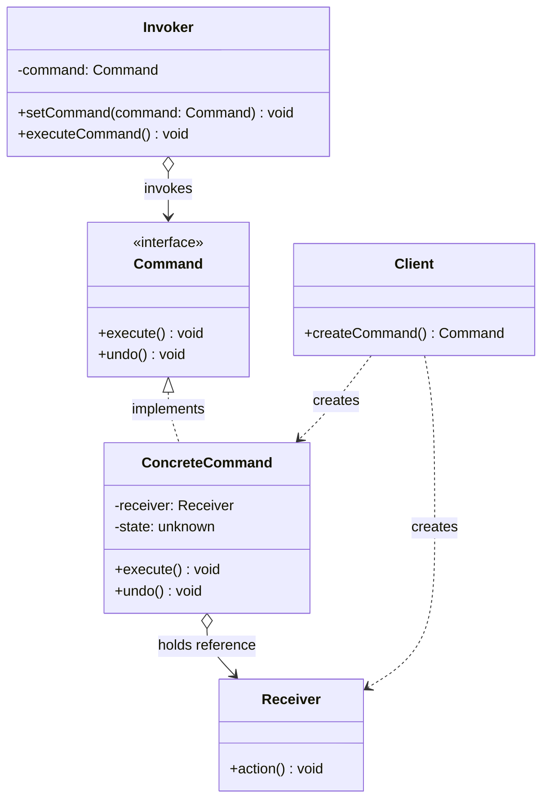
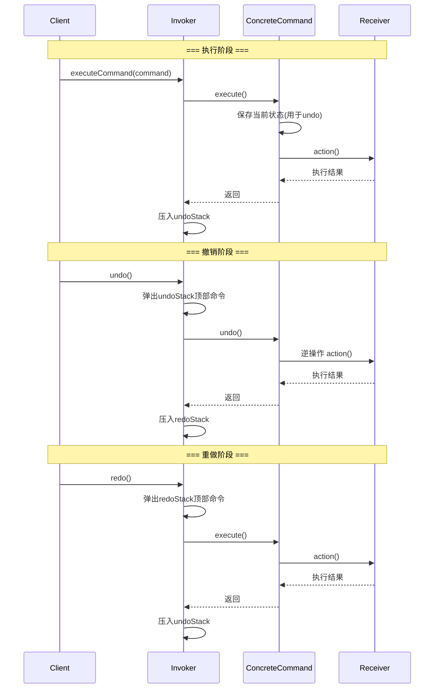

# 命令模式

## 1. 定义与意图

> 将一个请求封装为一个对象，从而使你可用不同的请求对客户进行参数化；对请求排队或记录请求日志，以及支持可撤销的操作。——GoF

命令模式的核心思想是将"请求"本身从调用者中剥离出来，使其成为一个独立的、可传递的对象。这种封装带来了三项关键能力：

- **参数化请求**：调用者无需关心请求的细节，只需持有命令对象并调用其执行方法
- **请求排队与日志**：命令对象可以被序列化、存储到队列或写入日志，实现延迟执行与审计追踪
- **可撤销操作**：每个命令不仅知道如何执行，还知道如何回退，从而实现 undo/redo 机制

在前端工程中，命令模式几乎无处不在：Redux 的 `dispatch(action)` 本质上就是命令模式、富文本编辑器的操作栈、拖拽交互的撤销回退、Git 的 commit/rollback——它们都遵循"将操作封装为对象"这一范式。

---

## 2. UML 类图



---

## 3. 核心角色与职责

| 角色 | 职责 | 典型映射 |
|------|------|----------|
| Command | 声明执行接口（execute / undo） | Redux Action Type |
| ConcreteCommand | 绑定 Receiver，持久化操作状态，实现 execute 与 undo | Redux Action Object |
| Receiver | 执行实际业务逻辑，是命令的最终执行者 | Redux Reducer |
| Invoker | 持有命令对象，决定何时执行、是否入栈 | Redux dispatch / Middleware |
| Client | 创建 ConcreteCommand 并装配 Receiver | 组件中调用 dispatch |

角色间的协作流程：Client 创建 ConcreteCommand 并注入 Receiver，将命令交给 Invoker；Invoker 在适当时机调用 `execute()`，由 ConcreteCommand 委托 Receiver 完成实际工作。需要撤销时，Invoker 从历史栈中弹出命令并调用 `undo()`。

---

## 4. 应用场景

### 4.1 通用场景

| 场景 | 说明 | 关键收益 |
|------|------|----------|
| 撤销/重做 | 文本编辑器、绘图工具的操作栈 | 每个命令自带 undo 语义，历史管理简单可靠 |
| 任务队列 | 打印队列、消息队列、部署编排 | 命令对象可序列化、可排队、可取消 |
| 宏操作 | 批量文件重命名、批量数据迁移 | 宏命令保证原子性，全部执行或全部回退 |
| 操作日志与审计 | 金融交易记录、用户行为追踪 | 命令对象天然携带操作细节，便于序列化存储 |
| 进度恢复 | 应用崩溃后恢复到之前的操作状态 | 命令日志可重放，重建任意时刻的状态 |

### 4.2 前端框架实战

#### Redux dispatch —— 命令模式的经典实现

Redux 是命令模式在前端最广泛的应用。每一个 `action` 就是一个命令对象，`reducer` 是接收者，`dispatch` 是调用者。

值得注意的是，标准 Redux 的 action 是"单向命令"——没有 undo 语义。但通过中间件或 undo/redo 增强器（如 `redux-undo`），可以为 reducer 自动生成反向操作，这正是命令模式完整实现的体现。

#### 富文本编辑器 —— Quill / ProseMirror 操作栈

Quill 的 Delta 模型和 ProseMirror 的 Step 机制本质上都是命令模式。每个操作（插入、删除、格式化）被封装为一个可逆的命令对象，存入操作栈以支持 undo/redo。

#### 拖拽命令 —— 可撤销的 DOM 操作

将拖拽操作封装为命令对象，使得用户可以通过快捷键撤销拖拽，将元素恢复到原始位置。

#### Git 操作 —— commit 与 rollback

Git 的 commit/rollback 本质上就是命令模式：每次 commit 封装一次变更集，rollback 则是执行 undo 操作。

---

## 5. Mermaid 流程图

### 命令执行与撤销流程



---

## 6. 优缺点分析

| 优点 | 缺点 |
|------|------|
| **解耦调用者与接收者**：Invoker 无需知道 Receiver 的存在与实现细节 | **类数量膨胀**：每个操作需要一个 Command 类，简单系统可能过度设计 |
| **支持撤销/重做**：命令自带 undo 语义，历史栈管理直观 | **简单操作复杂化**：一次性操作无需封装为命令对象 |
| **支持队列与调度**：命令对象可序列化，适合异步队列、优先级调度 | **命令对象生命周期管理**：长时间运行的历史栈可能引起内存泄漏 |
| **支持宏命令与组合**：多个命令可组合为原子操作 | **状态一致性**：宏命令部分执行失败时的回滚策略较复杂 |
| **支持日志与审计**：命令天然携带操作细节，便于序列化存储 | **性能开销**：每步操作需要创建对象、保存状态，高频场景需权衡 |
| **支持进度恢复**：通过重放命令日志可重建任意时刻的状态 | **命令与状态的耦合**：undo 依赖命令执行时的快照，状态变化后可能失效 |

---

## 7. 相关模式对比

### 命令模式 vs 策略模式

| 对比维度 | 命令模式 | 策略模式 |
|----------|----------|----------|
| 核心意图 | 封装"请求"为对象 | 封装"算法"为可互换策略 |
| 调用者关注点 | "做什么"——不关心谁执行、如何执行 | "怎么做"——选择不同的算法实现 |
| 可撤销 | 天然支持（undo 方法） | 不支持——策略执行后无回退语义 |
| 生命周期 | 命令可存储、排队、延迟执行 | 策略即时执行，无需持久化 |
| 对象数量 | 可积累大量历史命令对象 | 通常只持有当前策略 |
| 典型场景 | 编辑器操作栈、任务队列 | 排序算法选择、支付方式切换 |

### 命令模式 vs 观察者模式

| 对比维度 | 命令模式 | 观察者模式 |
|----------|----------|------------|
| 通信方向 | 调用者 -> 接收者（单向委托） | 主题 -> 多个观察者（广播通知） |
| 接收者数量 | 一个命令对应一个接收者 | 一个事件对应多个观察者 |
| 执行时机 | 可延迟、可排队 | 通常是即时通知 |
| 可撤销 | 支持 | 不支持 |

### 命令模式与备忘录模式的协作

命令模式负责记录"做了什么"，备忘录模式负责保存"之前是什么"。在复杂状态管理中，两者经常配合使用：命令对象在 execute 时创建备忘录保存快照，undo 时从备忘录恢复状态。这种方式比在命令内部保存状态差异更安全，尤其当状态结构复杂时。

---

## 8. 总结

命令模式将"请求"从调用者中解耦，封装为独立对象，赋予其三个维度的能力：**参数化**（调用者无需了解执行细节）、**可持久化**（命令可排队、可日志、可延迟执行）、**可逆转**（每个命令自带 undo 语义）。这使它成为实现撤销/重做、任务队列、宏操作和审计日志的首选模式。

在前端工程中，命令模式的身影几乎无处不在：Redux 的 `dispatch(action)` 将状态变更封装为可追踪的命令对象、富文本编辑器的操作栈将每次编辑封装为可逆步骤、拖拽交互通过命令模式支持 Ctrl+Z 回退——这些场景的共性是：**操作不仅是执行，还需要被记录、被撤销、被重放**。

现代 TypeScript 的泛型与函数式风格为命令模式注入了新的表达力：泛型命令 `Command<TState>` 将命令设计为纯函数式的状态转换器，与 React/Redux 的单向数据流天然契合；宏命令通过命令组合实现原子性的批量操作；异步命令队列则将模式扩展到并发调度的领域。

使用命令模式时需要注意：简单的一次性操作不应过度封装为命令对象；长期运行的历史栈需要设置容量上限以防止内存泄漏；宏命令部分失败时的回滚策略需要仔细设计——建议采用"全部执行或全部回退"的事务语义，或者使用备忘录模式保存完整快照以简化回滚逻辑。

---

## TypeScript 实现

### 基础实现：文本编辑器

以文本编辑器为场景，实现插入（InsertCommand）与删除（DeleteCommand），并支持撤销与重做。

```typescript
// ==================== 命令接口 ====================

interface Command {
  execute(): void;
  undo(): void;
  /** 命令描述，用于日志与调试 */
  describe(): string;
}

// ==================== 接收者：文本缓冲区 ====================

class TextBuffer {
  private content = "";

  getContent(): string { return this.content; }
  setContent(content: string): void { this.content = content; }

  insert(position: number, text: string): void {
    this.content = this.content.slice(0, position) + text + this.content.slice(position);
  }
  delete(position: number, length: number): string {
    const removed = this.content.slice(position, position + length);
    this.content = this.content.slice(0, position) + this.content.slice(position + length);
    return removed;
  }
}

// ==================== 具体命令 ====================
class InsertCommand implements Command {
  private applied = false;
  constructor(
    private readonly buffer: TextBuffer,
    private readonly position: number,
    private readonly text: string
  ) {}
  execute(): void {
    if (!this.applied) { this.buffer.insert(this.position, this.text); this.applied = true; }
  }
  undo(): void {
    if (this.applied) { this.buffer.delete(this.position, this.text.length); this.applied = false; }
  }
  describe(): string { return `Insert "${this.text}" at position ${this.position}`; }
}

class DeleteCommand implements Command {
  private removed = "";
  private applied = false;
  constructor(
    private readonly buffer: TextBuffer,
    private readonly position: number,
    private readonly length: number
  ) {}
  execute(): void {
    if (!this.applied) { this.removed = this.buffer.delete(this.position, this.length); this.applied = true; }
  }
  undo(): void {
    if (this.applied) { this.buffer.insert(this.position, this.removed); this.applied = false; }
  }
  describe(): string { return `Delete ${this.length} chars at position ${this.position}`; }
}

// ==================== 调用者：编辑器 ====================
class Editor {
  private history: Command[] = [];
  private redo: Command[] = [];

  constructor(private readonly buffer: TextBuffer) {}

  execute(command: Command): void {
    command.execute();
    console.log(`[EXEC] ${command.describe()}`);
    this.history.push(command);
    this.redo.length = 0;
  }
  undo(): void {
    const cmd = this.history.pop();
    if (!cmd) return;
    cmd.undo();
    console.log(`[UNDO] ${cmd.describe()}`);
    this.redo.push(cmd);
  }
  redoAction(): void {
    const cmd = this.redo.pop();
    if (!cmd) return;
    cmd.execute();
    console.log(`[REDO] ${cmd.describe()}`);
    this.history.push(cmd);
  }
  getContent(): string { return this.buffer.getContent(); }
}

// ==================== 使用 ====================
const buffer = new TextBuffer();
buffer.setContent("Hello, World");
const editor = new Editor(buffer);
editor.execute(new DeleteCommand(buffer, 5, 7));
// [EXEC] Delete 7 chars at position 5
console.log(editor.getContent()); // "Hello"

editor.undo();
// [UNDO] Delete 7 chars at position 5
console.log(editor.getContent()); // "Hello, World"
```

---

### 现代 TypeScript 实现

#### 4.2.1 泛型命令接口

利用 TypeScript 泛型，将命令设计为纯函数式的状态转换器：输入当前状态，输出新状态。这种设计天然支持不可变数据流，与 React/Redux 的单向数据流完美契合。

```typescript
// ==================== 泛型命令定义 ====================

interface Command<TState> {
  readonly type: string;
  execute(state: TState): TState;
  undo(state: TState): TState;
  describe(): string;
}

// ==================== 命令历史管理器 ====================

class CommandHistory<TState> {
  private undoStack: Command<TState>[] = [];
  private redoStack: Command<TState>[] = [];

  execute(state: TState, command: Command<TState>): TState {
    const newState = command.execute(state);
    this.undoStack.push(command);
    this.redoStack.length = 0;
    return newState;
  }

  undo(state: TState): TState {
    const command = this.undoStack.pop();
    if (!command) return state;
    this.redoStack.push(command);
    return command.undo(state);
  }

  redo(state: TState): TState {
    const command = this.redoStack.pop();
    if (!command) return state;
    this.undoStack.push(command);
    return command.execute(state);
  }

  canUndo(): boolean { return this.undoStack.length > 0; }
  canRedo(): boolean { return this.redoStack.length > 0; }
  size(): number { return this.undoStack.length; }

  clear(): void {
    this.undoStack.length = 0;
    this.redoStack.length = 0;
  }
}
```

#### 4.2.2 宏命令（命令组合）

宏命令将多个子命令组合为一个原子操作——要么全部执行，要么全部回退。这在批量编辑、事务操作等场景中极为常见。

```typescript
// ==================== 宏命令实现 ====================

class MacroCommand<TState> implements Command<TState> {
  readonly type = 'MACRO';
  private readonly subCommands: Command<TState>[];

  constructor(
    subCommands: Command<TState>[],
    private readonly macroName: string = 'UnnamedMacro',
  ) {
    if (subCommands.length === 0) {
      throw new Error('MacroCommand requires at least one sub-command');
    }
    this.subCommands = subCommands;
  }

  execute(state: TState): TState {
    return this.subCommands.reduce((s, cmd) => cmd.execute(s), state);
  }
  undo(state: TState): TState {
    // 逆序撤销
    return [...this.subCommands].reverse().reduce((s, cmd) => cmd.undo(s), state);
  }
  describe(): string {
    return `MACRO[${this.macroName}](${this.subCommands.map((c) => c.describe()).join(' + ')})`;
  }
}

// ==================== 使用：画布批量操作 ====================
interface CanvasState {
  rects: Array<{ id: string; x: number; y: number; color: string }>;
}

const moveRectCommand = (id: string, dx: number, dy: number): Command<CanvasState> => ({
  type: 'MOVE_RECT',
  execute(state) {
    return { rects: state.rects.map((r) => r.id === id ? { ...r, x: r.x + dx, y: r.y + dy } : r) };
  },
  undo(state) {
    return { rects: state.rects.map((r) => r.id === id ? { ...r, x: r.x - dx, y: r.y - dy } : r) };
  },
  describe() { return `Move rect ${id} by (${dx},${dy})`; }
});

const colorRectCommand = (id: string, color: string): Command<CanvasState> => ({
  type: 'COLOR_RECT',
  execute(state) {
    return { rects: state.rects.map((r) => r.id === id ? { ...r, color } : r) };
  },
  undo(state) {
    return state; // 简化：不记录旧颜色
  },
  describe() { return `Color rect ${id} as ${color}`; }
});

const initialState: CanvasState = { rects: [{ id: 'rect-1', x: 10, y: 20, color: '#ff0000' }] };
const macroCmd = new MacroCommand<CanvasState>(
  [moveRectCommand('rect-1', 50, 30), colorRectCommand('rect-1', '#00ff00')],
  'MoveAndColor'
);

const history = new CommandHistory<CanvasState>();
const newState = history.execute(initialState, macroCmd);
// rect-1: { x: 60, y: 50, color: '#00ff00' }

const undoneState = history.undo(newState);
// rect-1: { x: 10, y: 20, color: '#00ff00' } -- 位置已撤销；颜色保持 #00ff00（colorRect 的 undo 为简化实现，未记录旧色）
```

#### 4.2.3 命令队列调度

异步命令队列支持优先级排序、并发控制与执行日志。适用于需要按序执行异步操作的场景，如网络请求编排、文件上传队列等。

```typescript
// ==================== 异步命令接口 ====================

interface AsyncCommand<TState> {
  readonly type: string;
  readonly priority: number; // 数值越大优先级越高
  execute(state: TState): Promise<TState>;
  undo(state: TState): Promise<TState>;
  describe(): string;
}

// ==================== 优先级命令队列 ====================
class PriorityCommandQueue<TState> {
  private pending: AsyncCommand<TState>[] = [];
  private running = 0;
  private stats = { completed: 0, failed: 0, cancelled: 0 };

  enqueue(command: AsyncCommand<TState>): void {
    this.pending.push(command);
    this.pending.sort((a, b) => b.priority - a.priority); // 高优先级在前
  }

  async drain(initialState: TState): Promise<TState> {
    let state = initialState;
    while (this.pending.length > 0) {
      const command = this.pending.shift()!;
      try {
        state = await command.execute(state);
        this.stats.completed++;
      } catch (err) {
        this.stats.failed++;
        console.error(`命令失败: ${command.describe()}`, err);
      }
    }
    return state;
  }

  getQueueStats() {
    return { pending: this.pending.length, running: this.running, ...this.stats };
  }
}

// ==================== 使用：部署编排 ====================
interface DeployState {
  services: Map<string, string>; // service -> version
  order: string[];
}

class DeployServiceCommand implements AsyncCommand<DeployState> {
  readonly type = 'DEPLOY';
  constructor(
    private readonly service: string,
    private readonly version: string,
    readonly priority: number
  ) {}
  async execute(state: DeployState): Promise<DeployState> {
    await new Promise((r) => setTimeout(r, 10));
    const services = new Map(state.services).set(this.service, this.version);
    return { services, order: [...state.order, this.service] };
  }
  async undo(state: DeployState): Promise<DeployState> { return state; }
  describe(): string { return `部署 ${this.service}@${this.version}`; }
}

const deployQueue = new PriorityCommandQueue<DeployState>();
deployQueue.enqueue(new DeployServiceCommand('api-gateway', '1.5.0', 5));
deployQueue.enqueue(new DeployServiceCommand('frontend-app', '3.1.0', 1));
deployQueue.enqueue(new DeployServiceCommand('user-service', '2.0.0', 10));
deployQueue.enqueue(new DeployServiceCommand('order-service', '2.8.0', 8));

// 执行顺序按优先级：user-service(10) -> order-service(8) -> api-gateway(5) -> frontend-app(1)
const deployState: DeployState = { services: new Map(), order: [] };
const finalState = await deployQueue.drain(deployState);
console.log(deployQueue.getQueueStats());
// { pending: 0, running: 0, completed: 4, failed: 0, cancelled: 0 }
```

---

```typescript
import { createStore } from 'redux';

// Redux action 就是命令对象的变体
interface AddTodoAction {
  readonly type: 'ADD_TODO';
  readonly payload: { id: string; text: string };
}

interface ToggleTodoAction {
  readonly type: 'TOGGLE_TODO';
  readonly payload: { id: string };
}

type TodoAction = AddTodoAction | ToggleTodoAction;

interface TodoItem { id: string; text: string; completed: boolean; }
type TodoState = TodoItem[];

// reducer 是接收者 —— 根据命令(action)产生新状态
function todoReducer(state: TodoState = [], action: TodoAction): TodoState {
  switch (action.type) {
    case 'ADD_TODO':
      return [...state, { id: action.payload.id, text: action.payload.text, completed: false }];
    case 'TOGGLE_TODO':
      return state.map((todo) =>
        todo.id === action.payload.id ? { ...todo, completed: !todo.completed } : todo
      );
    default:
      return state;
  }
}

// dispatch 是 Invoker —— 将命令传递给接收者
const store = createStore(todoReducer);
store.dispatch({ type: 'ADD_TODO', payload: { id: '1', text: 'Learn Command Pattern' } });
```

```typescript
// ProseMirror Step 的简化模型
interface EditorStep {
  readonly stepType: string;
  readonly from: number;
  readonly to: number;
  readonly slice?: unknown;
  /** 应用此步骤，返回新文档和反向映射 */
  apply(doc: ProseMirrorDoc): StepResult;
  /** 生成反向步骤 */
  invert(doc: ProseMirrorDoc): EditorStep;
  /** 合并连续的相同类型步骤以压缩历史 */
  merge(other: EditorStep): EditorStep | null;
}

// 简化文档模型
interface ProseMirrorDoc { content: string; }
interface StepResult { doc: ProseMirrorDoc; }

// 操作栈（编辑器历史）
class EditorHistory {
  private stack: EditorStep[] = [];
  private undone: EditorStep[][] = [];

  addStep(step: EditorStep): void {
    // 尝试与顶部步骤合并以压缩历史
    const top = this.stack[this.stack.length - 1];
    const merged = top ? top.merge(step) : null;
    if (merged) this.stack[this.stack.length - 1] = merged;
    else this.stack.push(step);
    this.undone.length = 0;
  }

  undo(currentDoc: ProseMirrorDoc): ProseMirrorDoc {
    const step = this.stack.pop();
    if (!step) return currentDoc;
    const invertedSteps: EditorStep[] = [];
    let doc = currentDoc;
    // 逆序应用反向步骤
    const inverted = step.invert(doc);
    invertedSteps.push(inverted);
    doc = inverted.apply(doc).doc;

    this.undone.push(invertedSteps);
    return doc;
  }
}
```

```typescript
interface Position {
  readonly x: number;
  readonly y: number;
}

interface DragState {
  elements: Map<string, Position>;
}

class DragCommand implements Command<DragState> {
  readonly type = 'DRAG';
  private oldPos: Position | null = null;

  constructor(
    private readonly elementId: string,
    private readonly newPos: Position
  ) {}

  execute(state: DragState): DragState {
    this.oldPos = state.elements.get(this.elementId) ?? null;
    const elements = new Map(state.elements);
    elements.set(this.elementId, this.newPos);
    return { elements };
  }
  undo(state: DragState): DragState {
    const elements = new Map(state.elements);
    if (this.oldPos) elements.set(this.elementId, this.oldPos);
    else elements.delete(this.elementId);
    return { elements };
  }
  describe(): string { return `拖动 ${this.elementId} 到 (${this.newPos.x}, ${this.newPos.y})`; }
}

// ==================== 使用 ====================
const getState = (): DragState => ({ elements: new Map() });
const setState = (s: DragState) => { console.log('状态更新:', [...s.elements]); };
const history = new CommandHistory<DragState>();
const historyCtx = history;

document.addEventListener('keydown', (e: KeyboardEvent) => {
  if (e.ctrlKey && e.key === 'z' && historyCtx.canUndo()) {
    setState(historyCtx.undo(getState()));
  }
});
```

```typescript
interface FileSnapshot {
  readonly path: string;
  readonly content: string;
}

interface RepositoryState {
  readonly files: Map<string, string>;
  readonly HEAD: string;
}

class GitCommitCommand implements Command<RepositoryState> {
  readonly type = 'GIT_COMMIT';
  private commitHash: string;
  private committed = false;

  constructor(
    private readonly changes: FileSnapshot[],
    private readonly message: string
  ) {
    this.commitHash = `commit-${Math.random().toString(16).slice(2, 10)}`;
  }

  execute(state: RepositoryState): RepositoryState {
    if (this.committed) return state;
    const files = new Map(state.files);
    this.changes.forEach((c) => files.set(c.path, c.content));
    this.committed = true;
    return { files, HEAD: this.commitHash };
  }
  undo(state: RepositoryState): RepositoryState {
    if (!this.committed) return state;
    const files = new Map(state.files);
    this.changes.forEach((c) => files.delete(c.path));
    return { files, HEAD: 'HEAD~1' };
  }

  describe(): string {
    const fileList = this.changes.map((c) => c.path).join(', ');
    return `Commit ${this.commitHash.slice(0, 7)}: "${this.message}" [${fileList}]`;
  }
}
```

```typescript
interface Memento<TState> {
  getState(): TState;
}

class Caretaker<TState> {
  private readonly mementos: Memento<TState>[] = [];

  push(memento: Memento<TState>): void {
    this.mementos.push(memento);
  }

  pop(): Memento<TState> | undefined {
    return this.mementos.pop();
  }
}

// 备忘录命令：命令执行时保存快照，undo 时恢复
class MementoCommand<TState> implements Command<TState> {
  readonly type = 'MEMENTO_COMMAND';
  private snapshot: TState | null = null;

  constructor(private readonly description: string) {}

  execute(state: TState): TState {
    this.snapshot = state; // 保存快照（实际应为深拷贝）
    return state;
  }
  undo(state: TState): TState {
    return this.snapshot ?? state; // 恢复到快照
  }

  describe(): string {
    return this.description;
  }
}
```

---

## Java 实现

### 命令模式（将请求封装为对象）

```java
// 命令接口
interface Command {
    void execute();
    void undo();
}

// 接收者：实际执行操作的对象
class Light {
    private boolean on = false;

    public void on() {
        on = true;
        System.out.println("灯打开");
    }

    public void off() {
        on = false;
        System.out.println("灯关闭");
    }

    public boolean isOn() { return on; }
}

// 具体命令：开灯
class LightOnCommand implements Command {
    private final Light light;

    public LightOnCommand(Light light) {
        this.light = light;
    }

    @Override
    public void execute() { light.on(); }

    @Override
    public void undo() { light.off(); }
}

// 具体命令：关灯
class LightOffCommand implements Command {
    private final Light light;

    public LightOffCommand(Light light) {
        this.light = light;
    }

    @Override
    public void execute() { light.off(); }

    @Override
    public void undo() { light.on(); }
}

// 调用者/命令历史：支持撤销
class RemoteControl {
    private final java.util.Stack<Command> history = new java.util.Stack<>();

    public void press(Command command) {
        command.execute();
        history.push(command);
    }

    public void undo() {
        if (!history.isEmpty()) {
            history.pop().undo();
        }
    }
}

// 使用
public class Client {
    public static void main(String[] args) {
        Light light = new Light();
        RemoteControl remote = new RemoteControl();

        remote.press(new LightOnCommand(light));   // 开灯
        remote.press(new LightOffCommand(light));  // 关灯
        remote.undo();  // 撤销，回到开灯
    }
}
```

> 命令模式将"请求"封装为对象，从而支持参数化、排队、记录日志与撤销。Java 中 `Runnable`、`javax.swing.Action` 都是命令对象的体现。

## Python 实现

### 命令模式

```python
from abc import ABC, abstractmethod

class Command(ABC):
    @abstractmethod
    def execute(self):
        pass

    @abstractmethod
    def undo(self):
        pass

# 接收者
class Light:
    def __init__(self):
        self.is_on = False

    def on(self):
        self.is_on = True
        print("灯打开")

    def off(self):
        self.is_on = False
        print("灯关闭")

class LightOnCommand(Command):
    def __init__(self, light: Light):
        self._light = light

    def execute(self):
        self._light.on()

    def undo(self):
        self._light.off()

class LightOffCommand(Command):
    def __init__(self, light: Light):
        self._light = light

    def execute(self):
        self._light.off()

    def undo(self):
        self._light.on()

# 调用者：命令历史，支持撤销
class RemoteControl:
    def __init__(self):
        self._history = []

    def press(self, command: Command):
        command.execute()
        self._history.append(command)

    def undo(self):
        if self._history:
            self._history.pop().undo()

light = Light()
remote = RemoteControl()
remote.press(LightOnCommand(light))
remote.press(LightOffCommand(light))
remote.undo()  # 回到开灯
```

> Python 中命令对象可用普通类或 `__call__` 可调用对象实现。命令模式让请求可被参数化、排队与撤销，`subprocess`、任务队列等场景常用。

