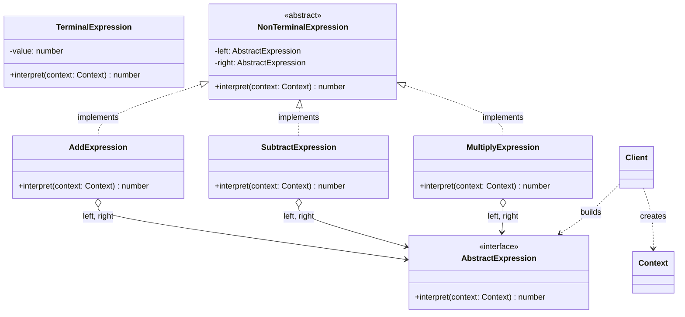
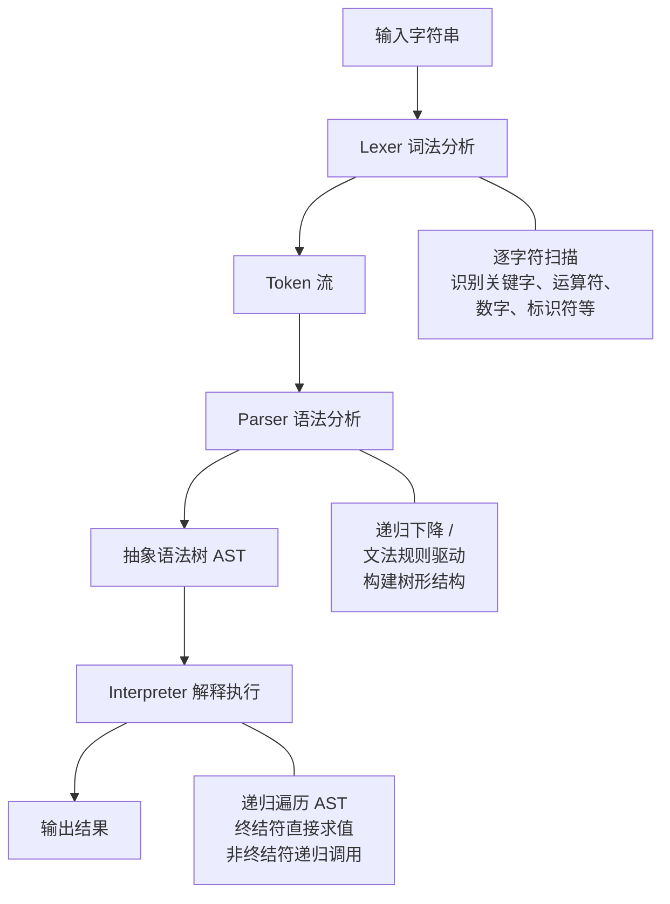
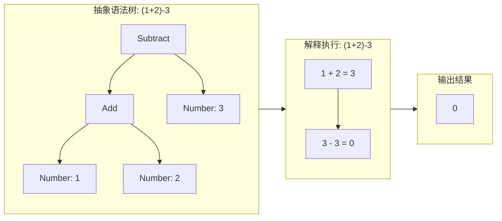

# 解释器模式

## 1. 定义与意图

> 给定一种语言，定义它的文法的一种表示，并定义一个解释器，这个解释器使用该表示来解释语言中的句子。——GoF

解释器模式的核心思想是将文法规则映射为类：每一条文法规则对应一个类，通过组合这些类来构建抽象语法树（AST），再递归调用各节点的解释方法来执行语言中的句子。终结符规则对应叶子节点（如数字常量、字符串字面量），非终结符规则对应组合节点（如二元运算、条件表达式），它们递归引用其他表达式节点，形成树形结构。

解释器模式并非通用编译器方案，它有明确的适用边界：

- **文法相对简单**：当文法规则数量有限、层次不深时，每个规则一个类的实现方式直观清晰
- **效率不是关键考量**：解释器的递归遍历存在性能开销，不适合高性能计算场景
- **需要动态解释**：当系统需要在运行时解释执行用户自定义的表达式或规则时
- **领域特定语言（DSL）**：为特定业务领域提供一种可理解的表达方式

当文法变得复杂时，解释器模式会产生大量类（类爆炸问题），此时应转向解析器生成器（如 ANTLR、Peggy）或编译器构造工具。GoF 本人也指出，解释器模式适用于"小规模语言"，大规模语言应使用编译器技术栈。

---

## 2. UML 类图



---

## 3. 核心角色与职责

| 角色 | 职责 | 典型映射 |
|------|------|----------|
| **AbstractExpression** | 声明 `interpret(context)` 接口，所有表达式节点的公共抽象 | 表达式接口 |
| **TerminalExpression** | 终结符解释，不包含子表达式，对应文法中的原子元素（数字、变量） | 数字常量、变量引用 |
| **NonTerminalExpression** | 非终结符解释，包含对其他 Expression 的引用，递归调用子表达式的 interpret | 加法、减法、乘法等二元运算 |
| **Context** | 存储解释过程中需要的全局信息（变量表、函数表、配置等） | 变量环境、作用域 |
| **Client** | 构建抽象语法树（AST），创建 Context，调用根节点的 interpret 启动解释 | 表达式构建器 |

### 协作流程

Client 根据输入构建 AST，创建 Context 填入全局信息，然后调用根节点的 `interpret(context)`。非终结符节点递归调用子节点的 interpret，将 Context 逐层传递；终结符节点直接从 Context 中取值或返回常量。递归调用链从根节点蔓延到所有叶子节点，最终汇总为整个表达式的解释结果。

---

## 4. 应用场景

### 4.1 通用场景

| 场景 | 说明 | 关键收益 |
|------|------|----------|
| SQL 解析 | 将 SQL 语句解析为 AST，解释执行查询计划 | 不同数据库方言可共享解析逻辑，仅替换执行层 |
| 正则表达式引擎 | 正则语法解析为 NFA/DFA 自动机，解释执行匹配 | 文法规则映射为状态转换，易于扩展新语法特性 |
| 配置文件解析 | YAML/TOML/INI 等配置语言解析为结构化数据 | 新增配置项只需新增语法规则类 |
| 领域特定语言（DSL） | 为特定业务领域提供表达规则的语言 | 业务人员可直接编写规则，无需修改代码 |
| 规则引擎 | 业务规则动态解释执行，如定价策略、风控规则 | 规则变更无需重新部署，运行时生效 |
| 模板引擎 | Mustache/Handlebars 模板解析为 AST 后渲染 | 模板语法独立于数据，支持逻辑复用 |

### 4.2 前端框架实战

#### CSS 选择器引擎：Sizzle / querySelectorAll

CSS 选择器的解析过程本质上是解释器模式的应用：选择器字符串先被解析为 AST（由复合选择器、简单选择器等节点组成），然后解释器遍历 AST 对 DOM 节点进行匹配。

#### Vue 模板编译：template -> AST -> render 函数

Vue 的模板编译器是解释器模式在前端最典型的应用之一。编译过程分为三个阶段：解析（parse）将模板字符串转为 AST，变换（transform）对 AST 进行静态标记与优化，生成（generate）将 AST 转为 render 函数代码。

#### 规则引擎：JSON 配置驱动的业务规则解释执行

规则引擎将业务规则从代码中抽离为 JSON 配置，运行时由解释器解析执行。这种方式使得业务人员可以直接修改规则，无需重新部署应用。

#### GraphQL 查询解析

GraphQL 查询的解析过程是解释器模式的典型应用：查询字符串经过词法分析和语法分析生成 AST，然后解释器遍历 AST 执行对应的 resolver 函数，最终组装查询结果。

---

## 5. Mermaid 流程图

### 解释器解析执行流程



### AST 构建与解释流程



---

## 6. 优缺点分析

| 优点 | 缺点 |
|------|------|
| **易于扩展文法规则**：新增语法规则只需新增一个 Expression 类，符合 OCP | **复杂文法导致类爆炸**：每条文法规则一个类，复杂语言可能产生数百个类 |
| **文法规则与代码一一对应**：代码结构直接反映文法结构，可读性强 | **维护成本随文法复杂度急剧上升**：类间关系错综复杂，修改一处可能波及全局 |
| **符合 OCP（新增规则不修改已有类）**：扩展新语法无需改动已有表达式类 | **执行效率低于直接硬编码**：递归调用链长，方法调用开销大 |
| **易于实现简单 DSL**：将领域知识编码为可解释的语法规则 | **不适合复杂文法**：应使用解析器生成器（ANTLR、Peggy 等） |
| **递归结构天然匹配树形语法**：AST 的递归解释与树形遍历高度契合 | **调试困难**：递归调用链长，出错时调用栈深，难以定位问题 |
| **与组合模式天然兼容**：AST 本质是组合模式，非终结符组合子表达式 | **缺乏标准化**：不同实现方式差异大，无统一范式 |

### 适用性判断

```
+-------------------------------------------------------------+
|                    解释器模式适用性判断                       |
+-------------------------------------------------------------+
|                                                             |
|  文法简单 & 需要动态解释 ── 强烈推荐使用解释器模式           |
|                                                             |
|  文法简单 & 不需要动态解释 ── 解释器可能过度设计             |
|                                                             |
|  文法复杂 & 需要动态解释 ── 使用解析器生成器 + 访问者        |
|                                                             |
|  文法复杂 & 不需要动态解释 ── 使用编译器技术栈               |
|                                                             |
+-------------------------------------------------------------+
```

---

## 7. 相关模式对比

| 对比维度 | 解释器模式 | 访问者模式 | 组合模式 |
|----------|-----------|-----------|---------|
| **意图** | 解释执行语法规则 | 操作与数据结构分离 | 树形结构统一处理 |
| **数据结构** | AST（抽象语法树） | 任意对象结构 | 任意树形结构 |
| **扩展方向** | 新增语法规则容易 | 新增操作容易 | 新增组件类型容易 |
| **典型应用** | DSL / 编译器前端 | AST 遍历操作 | UI 组件树 / 文件系统 |
| **关系** | 常与访问者配合 | 可独立于解释器 | 解释器的 AST 本质是组合 |

### 解释器与访问者模式的配合关系

解释器模式将操作（interpret）内嵌在 AST 节点中，扩展新语法规则容易但新增操作困难（需要修改所有节点类）。访问者模式将操作从节点中分离，新增操作容易但新增节点类型困难。两者配合使用：解释器负责定义 AST 结构与语法规则，访问者负责对同一棵 AST 执行不同操作。

### 解释器模式与建造者模式

解释器模式关注"如何解释 AST"，建造者模式关注"如何构建 AST"。在实际应用中，Parser 本质上就是一个建造者：它根据输入字符串逐步构建 AST 的各个节点。两者协作关系：Parser（建造者）构建 AST，Interpreter 解释执行 AST。

### 解释器模式与组合模式

解释器模式的 AST 本质上就是组合模式的应用：非终结符表达式对应 Composite 节点（包含子表达式），终结符表达式对应 Leaf 节点（不含子表达式）。`interpret` 方法就是组合模式中 `operation` 方法的具体化。理解这一点有助于在设计 AST 时借鉴组合模式的最佳实践，如统一的接口、递归遍历、透明性等。

---

## 8. 总结

解释器模式将文法规则映射为类，通过构建 AST 并递归解释的方式实现语言的动态执行。它的核心价值在于：将领域知识编码为可理解、可扩展的语法规则，使得业务人员或配置系统能够在不修改代码的前提下定义新的行为。

### 核心要点

1. **何时使用**：文法相对简单、需要实现领域特定语言（DSL）、需要在运行时动态解释执行用户定义的表达式或规则。

2. **何时不用**：文法复杂（规则数量超过数十条）、性能敏感场景（递归调用开销大）、语法需要频繁变更节点类型（此时访问者模式的扩展方向不匹配）。

3. **与其他模式的关系**：
   - AST 的结构本质是**组合模式**——非终结符组合子表达式形成树形结构
   - 遍历 AST 执行不同操作用**访问者模式**——将操作与数据结构解耦
   - 构建 AST 用**建造者模式**或**工厂方法模式**——Parser 根据输入逐步构建节点

4. **在前端中的实际价值**：
   - **模板编译**：Vue/Angular 的模板编译器将模板字符串解析为 AST，再生成渲染函数
   - **规则引擎**：JSON 配置驱动的业务规则解释执行，如条件判断规则、定价规则、风控规则
   - **查询解析**：GraphQL 查询字符串解析为 AST 后解释执行，CSS 选择器解析后匹配 DOM
   - **CSS-in-JS**：样式对象或模板字面量解析为 CSS 规则

5. **现代 TypeScript 实现**：优先使用 Discriminated Union 定义 AST 节点，配合类型收窄（narrowing）实现编译时穷尽检查；通过 Visitor 分离操作与数据；Parser 使用递归下降法实现，简洁直观。

> 解释器模式是连接"语言"与"执行"的桥梁。在前端工程中，每当系统需要理解并执行一种自定义的表达式语言——无论是模板语法、查询语言还是业务规则——解释器模式都在幕后默默工作。理解其原理与边界，是构建可扩展 DSL 与规则引擎的基石。

---

## TypeScript 实现

### 基础实现：简易数学表达式求值器

以数学表达式求值为场景，实现数字常量（终结符）、加法表达式和减法表达式（非终结符），演示如何构建和求值 AST。

```typescript
// ==================== 上下文：变量环境 ====================

class Context {
  private readonly variables: Map<string, number> = new Map();

  setVariable(name: string, value: number): void {
    this.variables.set(name, value);
  }

  getVariable(name: string): number {
    const value = this.variables.get(name);
    if (value === undefined) {
      throw new Error(`未定义的变量: ${name}`);
    }
    return value;
  }
}

// ==================== 抽象表达式 ====================
interface Expression {
  interpret(context: Context): number;
  toString(): string;
}

// ==================== 终结符：数字 ====================
class NumberExpression implements Expression {
  constructor(private readonly value: number) {}
  interpret(_context: Context): number { return this.value; }
  toString(): string { return String(this.value); }
}

// ==================== 终结符：变量 ====================
class VariableExpression implements Expression {
  constructor(private readonly name: string) {}
  interpret(context: Context): number { return context.getVariable(this.name); }
  toString(): string { return this.name; }
}

// ==================== 非终结符：二元运算 ====================
abstract class BinaryExpression implements Expression {
  constructor(protected left: Expression, protected right: Expression, protected symbol: string) {}
  abstract interpret(context: Context): number;
  toString(): string { return `(${this.left.toString()} ${this.symbol} ${this.right.toString()})`; }
}

class AddExpression extends BinaryExpression {
  constructor(left: Expression, right: Expression) { super(left, right, '+'); }
  interpret(context: Context): number { return this.left.interpret(context) + this.right.interpret(context); }
}
class SubtractExpression extends BinaryExpression {
  constructor(left: Expression, right: Expression) { super(left, right, '-'); }
  interpret(context: Context): number { return this.left.interpret(context) - this.right.interpret(context); }
}
class MultiplyExpression extends BinaryExpression {
  constructor(left: Expression, right: Expression) { super(left, right, '*'); }
  interpret(context: Context): number { return this.left.interpret(context) * this.right.interpret(context); }
}

// ==================== 使用 ====================
const context = new Context();
context.setVariable('x', 10);
context.setVariable('y', 5);

const variableExpr = new AddExpression(
  new VariableExpression('x'),
  new MultiplyExpression(new VariableExpression('y'), new NumberExpression(2))
);

console.log(variableExpr.toString());  // (x + (y * 2))
console.log(variableExpr.interpret(context));  // 20
```

---

### 现代 TypeScript 实现

#### 4.2.1 泛型 AST 解释器

通过泛型参数将解释器的返回类型参数化，使同一套 AST 节点结构可以返回不同的结果类型（数值、字符串、布尔值等）。

```typescript
// ==================== 泛型上下文 ====================

interface EvaluationContext {
  readonly variables: Map<string, unknown>;
  readonly functions: Map<string, (...args: unknown[]) => unknown>;
}

class DefaultContext implements EvaluationContext {
  readonly variables: Map<string, unknown> = new Map();
  readonly functions: Map<string, (...args: unknown[]) => unknown> = new Map();

  setVariable(name: string, value: unknown): this {
    this.variables.set(name, value);
    return this;
  }
  setFunction(name: string, fn: (...args: unknown[]) => unknown): this {
    this.functions.set(name, fn);
    return this;
  }
}

// ==================== 泛型表达式节点 ====================
interface GenericExpr<T> {
  evaluate(ctx: EvaluationContext): T;
}

class NumberNode<T = number> implements GenericExpr<T> {
  constructor(private readonly value: number) {}
  evaluate(): T { return this.value as unknown as T; }
}

class VariableNode<T> implements GenericExpr<T> {
  constructor(private readonly name: string) {}
  evaluate(ctx: EvaluationContext): T {
    return ctx.variables.get(this.name) as T;
  }
}

class CompareNode implements GenericExpr<boolean> {
  constructor(
    private readonly op: '>' | '<' | '>=',
    private readonly left: GenericExpr<number>,
    private readonly right: GenericExpr<number>
  ) {}
  evaluate(ctx: EvaluationContext): boolean {
    const a = this.left.evaluate(ctx);
    const b = this.right.evaluate(ctx);
    return this.op === '>' ? a > b : this.op === '<' ? a < b : a >= b;
  }
}

class TernaryNode<T> implements GenericExpr<T> {
  constructor(
    private readonly condition: GenericExpr<boolean>,
    private readonly thenExpr: GenericExpr<T>,
    private readonly elseExpr: GenericExpr<T>
  ) {}
  evaluate(ctx: EvaluationContext): T {
    return this.condition.evaluate(ctx) ? this.thenExpr.evaluate(ctx) : this.elseExpr.evaluate(ctx);
  }
}

// ==================== 使用 ====================
const ctx = new DefaultContext();
ctx.setVariable('a', 10);
ctx.setVariable('b', 42);

const maxExprComplete = new TernaryNode<number>(
  new CompareNode('>', new VariableNode<number>('a'), new VariableNode<number>('b')),
  new VariableNode<number>('a'),
  new VariableNode<number>('b'),
);

console.log(maxExprComplete.evaluate(ctx));  // 42
```

#### 4.2.2 Discriminated Union 实现类型安全的 AST 节点

利用 TypeScript 的 Discriminated Union 与类型收窄（narrowing），以数据优先的方式定义 AST 节点，避免类爆炸，同时保证类型安全。

```typescript
// ==================== Discriminated Union 定义 AST 节点 ====================

type ExprNode =
  | { type: 'number'; value: number }
  | { type: 'boolean'; value: boolean }
  | { type: 'string'; value: string }
  | { type: 'variable'; name: string }
  | { type: 'add'; left: ExprNode; right: ExprNode }
  | { type: 'subtract'; left: ExprNode; right: ExprNode }
  | { type: 'multiply'; left: ExprNode; right: ExprNode }
  | { type: 'divide'; left: ExprNode; right: ExprNode }
  | { type: 'compare'; operator: '>' | '<' | '>=' | '<=' | '==' | '!='; left: ExprNode; right: ExprNode }
  | { type: 'ternary'; condition: ExprNode; thenExpr: ExprNode; elseExpr: ExprNode };

// ==================== 求值解释器（类型收窄） ====================
interface EvalContext {
  variables: Map<string, number>;
}

function evaluate(node: ExprNode, ctx: EvalContext): number {
  switch (node.type) {
    case 'number': return node.value;
    case 'boolean': return node.value ? 1 : 0;
    case 'string': return node.value.length;
    case 'variable': {
      const v = ctx.variables.get(node.name);
      if (v === undefined) throw new Error(`未定义变量: ${node.name}`);
      return v;
    }
    case 'add': return evaluate(node.left, ctx) + evaluate(node.right, ctx);
    case 'subtract': return evaluate(node.left, ctx) - evaluate(node.right, ctx);
    case 'multiply': return evaluate(node.left, ctx) * evaluate(node.right, ctx);
    case 'divide': return evaluate(node.left, ctx) / evaluate(node.right, ctx);
    case 'compare': {
      const a = evaluate(node.left, ctx);
      const b = evaluate(node.right, ctx);
      switch (node.operator) {
        case '>': return a > b ? 1 : 0;
        case '<': return a < b ? 1 : 0;
        case '>=': return a >= b ? 1 : 0;
        case '<=': return a <= b ? 1 : 0;
        case '==': return a === b ? 1 : 0;
        case '!=': return a !== b ? 1 : 0;
      }
    }
    case 'ternary': return evaluate(node.condition, ctx) ? evaluate(node.thenExpr, ctx) : evaluate(node.elseExpr, ctx);
  }
}

// ==================== 使用 ====================
const expr: ExprNode = {
  type: 'ternary',
  condition: { type: 'compare', operator: '<=', left: { type: 'variable', name: 'a' }, right: { type: 'variable', name: 'b' } },
  thenExpr: { type: 'add', left: { type: 'variable', name: 'b' }, right: { type: 'number', value: 10 } },
  elseExpr: { type: 'number', value: 0 },
};

const ctx: EvalContext = {
  variables: new Map([
    ['a', 15],
    ['b', 42],
  ]),
};

console.log(evaluate(expr, ctx));  // 52 (b + 10，因为 a <= b)
```

#### 4.2.3 解释器 + 访问者模式结合

通过 Visitor 遍历 AST 实现不同操作（求值、打印、优化），将操作与数据结构解耦。新增操作只需添加新的 Visitor，无需修改 AST 节点定义。

```typescript
// ==================== AST 节点定义（支持 Visitor） ====================

type SimpleExpr =
  | { kind: 'number'; value: number }
  | { kind: 'add'; left: SimpleExpr; right: SimpleExpr }
  | { kind: 'subtract'; left: SimpleExpr; right: SimpleExpr }
  | { kind: 'multiply'; left: SimpleExpr; right: SimpleExpr };

// ==================== Visitor 接口 ====================

interface ExprVisitor<T> {
  visitNumber(node: SimpleExpr & { kind: 'number' }): T;
  visitAdd(node: SimpleExpr & { kind: 'add' }): T;
  visitSubtract(node: SimpleExpr & { kind: 'subtract' }): T;
  visitMultiply(node: SimpleExpr & { kind: 'multiply' }): T;
}

// 分发函数
function acceptExpr<T>(node: SimpleExpr, visitor: ExprVisitor<T>): T {
  switch (node.kind) {
    case 'number': return visitor.visitNumber(node);
    case 'add': return visitor.visitAdd(node);
    case 'subtract': return visitor.visitSubtract(node);
    case 'multiply': return visitor.visitMultiply(node);
  }
}

// ==================== 具体访问者 ====================
const evaluator: ExprVisitor<number> = {
  visitNumber: (n) => n.value,
  visitAdd: (n) => acceptExpr(n.left, evaluator) + acceptExpr(n.right, evaluator),
  visitSubtract: (n) => acceptExpr(n.left, evaluator) - acceptExpr(n.right, evaluator),
  visitMultiply: (n) => acceptExpr(n.left, evaluator) * acceptExpr(n.right, evaluator),
};

const printer: ExprVisitor<string> = {
  visitNumber: (n) => String(n.value),
  visitAdd: (n) => `(${acceptExpr(n.left, printer)} + ${acceptExpr(n.right, printer)})`,
  visitSubtract: (n) => `(${acceptExpr(n.left, printer)} - ${acceptExpr(n.right, printer)})`,
  visitMultiply: (n) => `(${acceptExpr(n.left, printer)} * ${acceptExpr(n.right, printer)})`,
};

const optimizer: ExprVisitor<SimpleExpr> = {
  visitNumber: (n) => n,
  visitAdd: (n) => {
    const l = acceptExpr(n.left, optimizer);
    const r = acceptExpr(n.right, optimizer);
    return l.kind === 'number' && r.kind === 'number' ? { kind: 'number', value: l.value + r.value } : { kind: 'add', left: l, right: r };
  },
  visitSubtract: (n) => {
    const l = acceptExpr(n.left, optimizer);
    const r = acceptExpr(n.right, optimizer);
    return l.kind === 'number' && r.kind === 'number' ? { kind: 'number', value: l.value - r.value } : { kind: 'subtract', left: l, right: r };
  },
  visitMultiply: (n) => {
    const l = acceptExpr(n.left, optimizer);
    const r = acceptExpr(n.right, optimizer);
    return l.kind === 'number' && r.kind === 'number' ? { kind: 'number', value: l.value * r.value } : { kind: 'multiply', left: l, right: r };
  },
};

// ==================== 使用 ====================
const ast: SimpleExpr = {
  kind: 'multiply',
  left: { kind: 'add', left: { kind: 'number', value: 1 }, right: { kind: 'number', value: 2 } },
  right: { kind: 'number', value: 3 },
};

console.log(acceptExpr(ast, printer));     // ((1 + 2) * 3)

// 优化后：常量折叠自底向上进行，(1 + 2) 折叠为 3，3 * 3 继续折叠，整个表达式折叠为单个数字节点 9
const optimized = acceptExpr(ast, optimizer);
console.log(acceptExpr(optimized, printer));  // 9
console.log(acceptExpr(optimized, evaluator)); // 9
```

#### 4.2.4 简易 Parser：将字符串解析为 AST

实现一个递归下降解析器（Recursive Descent Parser），将字符串 `"(1+2)-3"` 解析为 AST，再调用解释器求值。

```typescript
// ==================== Token 定义 ====================

type TokenType = 'NUMBER' | 'PLUS' | 'MINUS' | 'MULTIPLY' | 'DIVIDE' | 'LPAREN' | 'RPAREN' | 'IDENTIFIER' | 'EOF';

interface Token {
  type: TokenType;
  value: string;
  position: number;
}

// ==================== 词法分析器（Lexer） ====================
class Lexer {
  private tokens: Token[] = [];
  private position = 0;

  constructor(private readonly input: string) {}

  tokenize(): Token[] {
    while (this.position < this.input.length) {
      const char = this.input[this.position];
      if (/\s/.test(char)) { this.position++; continue; }
      if (/\d/.test(char)) { this.tokens.push(this.readNumber()); continue; }
      if (/[a-zA-Z_]/.test(char)) { this.tokens.push(this.readIdentifier()); continue; }
      const type = this.typeFor(char);
      if (type) { this.tokens.push({ type, value: char, position: this.position }); this.position++; continue; }
      throw new Error(`无法识别的字符: ${char}`);
    }
    this.tokens.push({ type: 'EOF', value: '', position: this.position });
    return this.tokens;
  }

  private readNumber(): Token {
    const start = this.position;
    let value = '';
    while (this.position < this.input.length && /\d/.test(this.input[this.position])) {
      value += this.input[this.position++];
    }
    return { type: 'NUMBER', value, position: start };
  }

  private readIdentifier(): Token {
    const start = this.position;
    let value = '';
    while (this.position < this.input.length && /[a-zA-Z0-9_]/.test(this.input[this.position])) {
      value += this.input[this.position++];
    }
    return { type: 'IDENTIFIER', value, position: start };
  }

  private typeFor(char: string): TokenType | null {
    const map: Record<string, TokenType> = {
      '+': 'PLUS', '-': 'MINUS', '*': 'MULTIPLY', '/': 'DIVIDE', '(': 'LPAREN', ')': 'RPAREN',
    };
    return map[char] ?? null;
  }
}

// ==================== 语法分析器（Parser） ====================
class Parser {
  private tokens: Token[] = [];
  private current = 0;

  constructor(private readonly input: string) {}

  parse(): ExprNode2 {
    this.tokens = new Lexer(this.input).tokenize();
    this.current = 0;
    const node = this.parseExpression();
    return node;
  }

  private parseExpression(): ExprNode2 {
    let left = this.parseTerm();
    while (this.peek().type === 'PLUS' || this.peek().type === 'MINUS') {
      const op = this.advance();
      const right = this.parseTerm();
      left = { type: op.type === 'PLUS' ? 'add' : 'subtract', left, right };
    }
    return left;
  }

  private parseTerm(): ExprNode2 {
    let left = this.parseFactor();
    while (this.peek().type === 'MULTIPLY' || this.peek().type === 'DIVIDE') {
      const op = this.advance();
      const right = this.parseFactor();
      left = { type: op.type === 'MULTIPLY' ? 'multiply' : 'divide', left, right };
    }
    return left;
  }

  private parseFactor(): ExprNode2 {
    const token = this.peek();
    if (token.type === 'NUMBER') { this.advance(); return { type: 'number', value: Number(token.value) }; }
    if (token.type === 'IDENTIFIER') { this.advance(); return { type: 'variable', name: token.value }; }
    if (token.type === 'LPAREN') {
      this.advance();
      const expr = this.parseExpression();
      this.expect('RPAREN');
      return expr;
    }
    throw new Error(`意外的 token: ${token.type}`);
  }

  private peek(): Token { return this.tokens[this.current]; }
  private advance(): Token { return this.tokens[this.current++]; }
  private expect(type: TokenType): void {
    if (this.peek().type !== type) throw new Error(`期望 ${type}，实际 ${this.peek().type}`);
    this.advance();
  }
}

// 求值（AST 解释器）
interface ExprContext2 { variables: Map<string, number>; }
function evaluate(node: ExprNode2, ctx: ExprContext2): number {
  switch (node.type) {
    case 'number': return node.value;
    case 'variable': {
      const v = ctx.variables.get(node.name);
      if (v === undefined) throw new Error(`未定义变量: ${node.name}`);
      return v;
    }
    case 'add': return evaluate(node.left, ctx) + evaluate(node.right, ctx);
    case 'subtract': return evaluate(node.left, ctx) - evaluate(node.right, ctx);
    case 'multiply': return evaluate(node.left, ctx) * evaluate(node.right, ctx);
    case 'divide': return evaluate(node.left, ctx) / evaluate(node.right, ctx);
  }
}

type ExprNode2 =
  | { type: 'number'; value: number }
  | { type: 'variable'; name: string }
  | { type: 'add'; left: ExprNode2; right: ExprNode2 }
  | { type: 'subtract'; left: ExprNode2; right: ExprNode2 }
  | { type: 'multiply'; left: ExprNode2; right: ExprNode2 }
  | { type: 'divide'; left: ExprNode2; right: ExprNode2 };

// ==================== 使用 ====================
const parser = new Parser('(1 + 2) - 3');
const ast2 = parser.parse();
console.log(evaluate(ast2, { variables: new Map() }));  // 0

// 带变量的表达式
const parser2 = new Parser('x * 2 + y');
const ast3 = parser2.parse();
const ctx3: ExprContext2 = {
  variables: new Map([['x', 5], ['y', 3]]),
};
console.log(evaluate(ast3, ctx3));  // 13
```

---

```typescript
// ==================== CSS 选择器 AST 定义 ====================

type SelectorNode =
  | { type: 'tag'; tagName: string }
  | { type: 'class'; className: string }
  | { type: 'id'; id: string }
  | { type: 'attribute'; name: string; operator: '=' | '~=' | '|=' | '^=' | '$=' | '*='; value: string }
  | { type: 'combinator'; combinator: ' ' | '>' | '+' | '~'; left: SelectorNode; right: SelectorNode }
  | { type: 'universal' };

// ==================== 选择器解释器：匹配 DOM 元素 ====================
// 单选择器匹配
function matchSelector(node: SelectorNode, element: HTMLElement): boolean {
  switch (node.type) {
    case 'universal': return true;
    case 'tag': return element.tagName.toLowerCase() === node.tagName;
    case 'class': return element.classList.contains(node.className);
    case 'id': return element.id === node.id;
    case 'attribute': {
      const value = element.getAttribute(node.name);
      if (value === null) return false;
      switch (node.operator) {
        case '=': return value === node.value;
        case '^=': return value.startsWith(node.value);
        case '$=': return value.endsWith(node.value);
        case '*=': return value.includes(node.value);
        case '~=': return value.split(/\s+/).includes(node.value);
        case '|=': return value === node.value || value.startsWith(node.value + '-');
      }
    }
    case 'combinator': return matchCombinator(node, element);
  }
}

// 组合器匹配
function matchCombinator(node: Extract<SelectorNode, { type: 'combinator' }>, element: HTMLElement): boolean {
  if (node.combinator === '>' && element.parentElement) {
    return matchSelector(node.right, element) && matchSelector(node.left, element.parentElement);
  }
  if (node.combinator === ' ' && element.parentElement) {
    let ancestor = element.parentElement;
    while (ancestor) {
      if (matchSelector(node.left, ancestor)) return matchSelector(node.right, element);
      ancestor = ancestor.parentElement;
    }
  }
  return false;
}

// 查询元素
function queryElements(root: HTMLElement, selector: SelectorNode): HTMLElement[] {
  const results: HTMLElement[] = [];
  const traverse = (el: HTMLElement) => {
    if (matchSelector(selector, el)) {
      results.push(el);
    }
    Array.from(el.children).forEach((child) => traverse(child as HTMLElement));
  };

  traverse(root);
  return results;
}
```

```typescript
// ==================== Vue 模板 AST 简化定义 ====================

type TemplateASTNode =
  | { type: 'Element'; tag: string; props: TemplateProp[]; children: TemplateASTNode[]; isStatic: boolean }
  | { type: 'Text'; content: string }
  | { type: 'Interpolation'; content: string };  // {{ expression }}

interface TemplateProp {
  name: string;
  value: string;
  isDynamic: boolean;  // 是否为 :prop 动态绑定
}

// ==================== 解析器（简化版） ====================
function parseTemplate(template: string): TemplateASTNode {
  // 简化解析：识别 {{ }} 插值和文本
  const interpolationMatch = template.match(/\{\{\s*(.*?)\s*\}\}/);
  if (interpolationMatch) {
    return { type: 'Interpolation', content: interpolationMatch[1] };
  }
  // 识别 div 元素
  const divMatch = template.match(/<div([^>]*)>([\s\S]*)<\/div>/);
  if (divMatch) {
    const props: TemplateProp[] = [];
    const attrMatch = divMatch[1].match(/:\w+="([^"]*)"/g) ?? [];
    attrMatch.forEach((attr) => {
      const key = attr.slice(1).split('=')[0];
      const value = attr.match(/"([^"]*)"/)![1];
      props.push({ name: key, value, isDynamic: true });
    });
    // 递归解析子内容
    const children: TemplateASTNode[] = [];
    const inner = divMatch[2];
    if (inner.includes('{{')) children.push(parseTemplate(inner.match(/\{\{.*?\}\}/)![0]));
    else children.push({ type: 'Text', content: inner });
    return { type: 'Element', tag: 'div', props, children, isStatic: props.length === 0 };
  }
  return { type: 'Text', content: template };
}

// ==================== 代码生成器 ====================
function generateRenderCode(ast: TemplateASTNode): string {
  switch (ast.type) {
    case 'Text':
      return `_v("${ast.content}")`;
    case 'Interpolation':
      return `_v(_s(${ast.content}))`;
    case 'Element': {
      const propsCode = ast.props.map((p) => (p.isDynamic ? `${p.name}: ${p.value}` : `${p.name}: "${p.value}"`)).join(', ');
      const childrenCode = ast.children.map(generateRenderCode).join(', ');
      return `_c("${ast.tag}", { ${propsCode} }, [${childrenCode}])`;
    }
  }
}

// ==================== 使用 ====================
const template = '<div><span>{{ name }}</span></div>';
const ast = parseTemplate(template);
const renderCode = generateRenderCode(ast);
console.log(renderCode);
// _v(_s(name))
// （简化解析器对整个模板优先匹配 {{ }} 插值，因此该输入被解释为 Interpolation 节点，而非 div 元素）
```

```typescript
// ==================== 规则 AST 定义 ====================

type RuleNode =
  | { type: 'literal'; value: unknown }
  | { type: 'field'; path: string }
  | { type: 'eq'; left: RuleNode; right: RuleNode }
  | { type: 'gt'; left: RuleNode; right: RuleNode }
  | { type: 'lt'; left: RuleNode; right: RuleNode }
  | { type: 'and'; conditions: RuleNode[] }
  | { type: 'or'; conditions: RuleNode[] }
  | { type: 'not'; condition: RuleNode }
  | { type: 'between'; value: RuleNode; min: RuleNode; max: RuleNode };

// ==================== 规则解释器 ====================
interface RuleContext {
  data: Record<string, unknown>;
}

function getPath(data: unknown, path: string): unknown {
  return path.split('.').reduce((acc, key) => (acc as Record<string, unknown>)?.[key], data);
}

function evaluateRule(node: RuleNode, ctx: RuleContext): boolean {
  switch (node.type) {
    case 'literal': return Boolean(node.value);
    case 'field': return Boolean(getPath(ctx.data, node.path));
    case 'eq': return evaluateRule(node.left, ctx) === evaluateRule(node.right, ctx);
    case 'gt': return Number(evaluateRule(node.left, ctx)) > Number(evaluateRule(node.right, ctx));
    case 'lt': return Number(evaluateRule(node.left, ctx)) < Number(evaluateRule(node.right, ctx));
    case 'and': return node.conditions.every((c) => evaluateRule(c, ctx));
    case 'or': return node.conditions.some((c) => evaluateRule(c, ctx));
    case 'not': return !evaluateRule(node.condition, ctx);
    case 'between': {
      const v = Number(getPath(ctx.data, (node.value as { path: string }).path));
      const min = Number((node.min as { value: number }).value);
      const max = Number((node.max as { value: number }).value);
      return v >= min && v <= max;
    }
  }
}

// ==================== 使用 ====================
const ageRule: RuleNode = {
  type: 'between',
  value: { type: 'field', path: 'user.age' },
  min: { type: 'literal', value: 18 },
  max: { type: 'literal', value: 60 },
};

const ageCtx: RuleContext = {
  data: { user: { age: 25 } },
};

console.log(evaluateRule(ageRule, ageCtx));  // true
```

```typescript
// ==================== GraphQL AST 简化定义 ====================

type GQLNode =
  | { kind: 'Field'; name: string; alias?: string; arguments: Map<string, unknown>; selections?: GQLNode[] }
  | { kind: 'FragmentSpread'; name: string }
  | { kind: 'InlineFragment'; typeCondition: string; selections: GQLNode[] };

interface GQLQuery {
  operation: 'query' | 'mutation' | 'subscription';
  name?: string;
  selections: GQLNode[];
}

// ==================== 解释器：执行查询 ====================
interface ResolverMap {
  [field: string]: (parent: unknown, args: Map<string, unknown>) => unknown;
}

function executeQuery(query: GQLQuery, rootValue: unknown, resolvers: ResolverMap): unknown {
  const result: Record<string, unknown> = {};
  query.selections.forEach((selection) => {
    if (selection.kind === 'Field') {
      const resolver = resolvers[selection.name];
      const value = resolver ? resolver(rootValue, selection.arguments) : (rootValue as Record<string, unknown>)?.[selection.name];
      // 递归解析子字段
      if (selection.selections && value && typeof value === 'object') {
        result[selection.alias ?? selection.name] = executeSelection(selection.selections, value, resolvers);
      } else {
        result[selection.alias ?? selection.name] = value;
      }
    }
  });
  return result;
}

function executeSelection(selections: GQLNode[], value: unknown, resolvers: ResolverMap): unknown {
  const subQuery: GQLQuery = { operation: 'query', selections };
  return executeQuery(subQuery, value, resolvers);
}
```

```typescript
// ==================== 解释器模式：操作内嵌在节点中 ====================

interface InterpreterExpr {
  interpret(ctx: Map<string, number>): number;
}

class InterpreterAdd implements InterpreterExpr {
  constructor(
    private left: InterpreterExpr,
    private right: InterpreterExpr,
  ) {}
  interpret(ctx: Map<string, number>): number {
    return this.left.interpret(ctx) + this.right.interpret(ctx);
  }
}

class InterpreterSubtract implements InterpreterExpr {
  constructor(
    private left: InterpreterExpr,
    private right: InterpreterExpr,
  ) {}
  interpret(ctx: Map<string, number>): number {
    return this.left.interpret(ctx) - this.right.interpret(ctx);
  }
}

class InterpreterNumber implements InterpreterExpr {
  constructor(private value: number) {}
  interpret(_ctx: Map<string, number>): number { return this.value; }
}

// ==================== 访问者模式：操作分离 ====================
type CombinedExpr =
  | { kind: 'number'; value: number }
  | { kind: 'add'; left: CombinedExpr; right: CombinedExpr }
  | { kind: 'subtract'; left: CombinedExpr; right: CombinedExpr };

interface CombinedVisitor<T> {
  visitNumber(n: CombinedExpr & { kind: 'number' }): T;
  visitAdd(n: CombinedExpr & { kind: 'add' }): T;
  visitSubtract(n: CombinedExpr & { kind: 'subtract' }): T;
}

function acceptCombinedExpr<T>(node: CombinedExpr, visitor: CombinedVisitor<T>): T {
  switch (node.kind) {
    case 'number': return visitor.visitNumber(node);
    case 'add': return visitor.visitAdd(node);
    case 'subtract': return visitor.visitSubtract(node);
  }
}

// ==================== 具体访问者 ====================
class EvalVisitor implements CombinedVisitor<number> {
  constructor(private ctx: Map<string, number>) {}
  visitNumber(n): number { return n.value; }
  visitAdd(n): number { return acceptCombinedExpr(n.left, this) + acceptCombinedExpr(n.right, this); }
  visitSubtract(n): number { return acceptCombinedExpr(n.left, this) - acceptCombinedExpr(n.right, this); }
}

class StringifyVisitor implements CombinedVisitor<string> {
  visitNumber(n): string { return String(n.value); }
  visitAdd(n): string { return `(${acceptCombinedExpr(n.left, this)} + ${acceptCombinedExpr(n.right, this)})`; }
  visitSubtract(n): string { return `(${acceptCombinedExpr(n.left, this)} - ${acceptCombinedExpr(n.right, this)})`; }
}

class DepthVisitor implements CombinedVisitor<number> {
  visitNumber(): number { return 1; }
  visitAdd(n): number { return 1 + Math.max(acceptCombinedExpr(n.left, this), acceptCombinedExpr(n.right, this)); }
  visitSubtract(n): number { return 1 + Math.max(acceptCombinedExpr(n.left, this), acceptCombinedExpr(n.right, this)); }
}

// ==================== 使用 ====================
const expr: CombinedExpr = {
  kind: 'subtract',
  left: { kind: 'add', left: { kind: 'number', value: 1 }, right: { kind: 'number', value: 2 } },
  right: { kind: 'number', value: 3 },
};

const ctx = new Map<string, number>();
console.log(acceptCombinedExpr(expr, new EvalVisitor(ctx)));       // 0
console.log(acceptCombinedExpr(expr, new StringifyVisitor()));     // ((1 + 2) - 3)
console.log(acceptCombinedExpr(expr, new DepthVisitor()));         // 3
```

---

## Java 实现

### 解释器模式（定义语法并解释执行）

```java
import java.util.Map;

// 抽象表达式
interface Expression {
    int interpret(Map<String, Integer> context);
}

// 终结符表达式：变量
class VariableExpression implements Expression {
    private final String name;

    public VariableExpression(String name) {
        this.name = name;
    }

    @Override
    public int interpret(Map<String, Integer> context) {
        return context.getOrDefault(name, 0);
    }
}

// 终结符表达式：数字常量
class NumberExpression implements Expression {
    private final int value;

    public NumberExpression(int value) {
        this.value = value;
    }

    @Override
    public int interpret(Map<String, Integer> context) {
        return value;
    }
}

// 非终结符：加法
class AddExpression implements Expression {
    private final Expression left, right;

    public AddExpression(Expression left, Expression right) {
        this.left = left;
        this.right = right;
    }

    @Override
    public int interpret(Map<String, Integer> context) {
        return left.interpret(context) + right.interpret(context);
    }
}

// 使用：构建语法树并解释
public class Client {
    public static void main(String[] args) {
        // 表达式: a + 5
        Expression expr = new AddExpression(
                new VariableExpression("a"),
                new NumberExpression(5));

        int result = expr.interpret(Map.of("a", 10));
        System.out.println("结果: " + result);  // 15
    }
}
```

> 解释器模式为特定语言/文法定义抽象语法树并解释执行。Java 中 `java.util.regex.Pattern`（正则）、`javax.el.EL`（表达式语言）都体现了解释器思想。实际业务中直接实现解释器成本较高，常借助 ANTLR 等工具。

## Python 实现

### 解释器模式

```python
from abc import ABC, abstractmethod

class Expression(ABC):
    @abstractmethod
    def interpret(self, context: dict) -> int:
        pass

class VariableExpression(Expression):
    def __init__(self, name: str):
        self.name = name

    def interpret(self, context: dict) -> int:
        return context.get(self.name, 0)

class NumberExpression(Expression):
    def __init__(self, value: int):
        self.value = value

    def interpret(self, context: dict) -> int:
        return self.value

class AddExpression(Expression):
    def __init__(self, left: Expression, right: Expression):
        self.left = left
        self.right = right

    def interpret(self, context: dict) -> int:
        return self.left.interpret(context) + self.right.interpret(context)

# 使用：构建语法树
expr = AddExpression(VariableExpression("a"), NumberExpression(5))
print(expr.interpret({"a": 10}))  # 15
```

> Python 中解释器模式常与 AST（抽象语法树）结合。Python 标准库的 `ast` 模块、`eval`/`compile`、`json`/`re` 解析器都体现了解释器思想。

