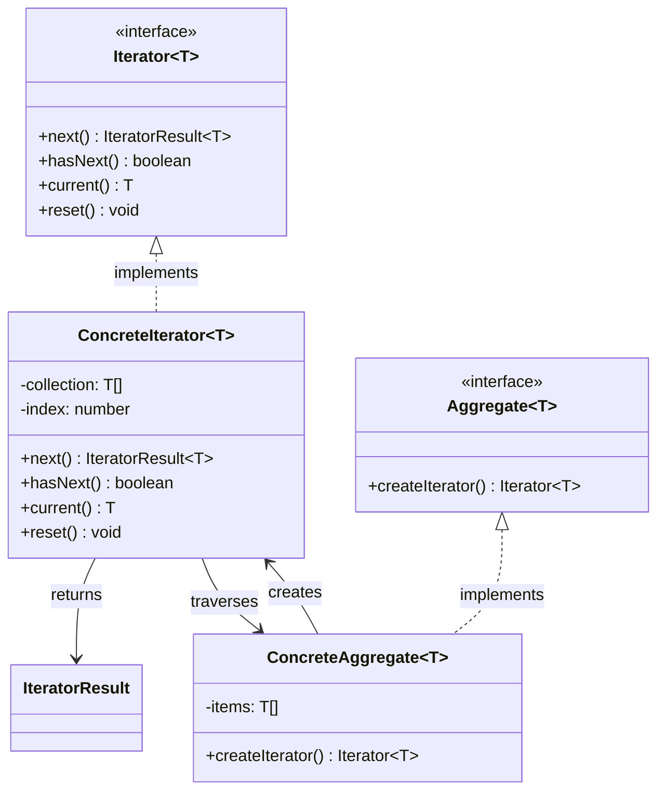
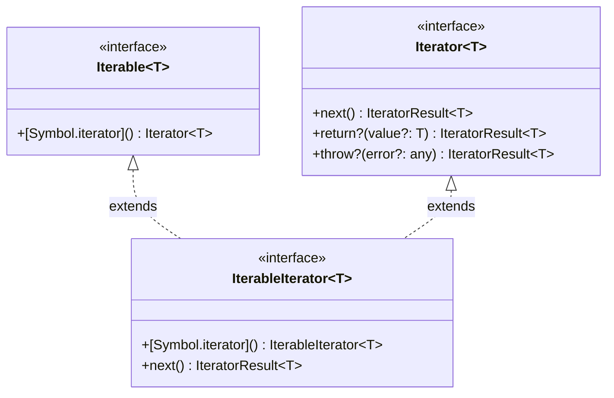
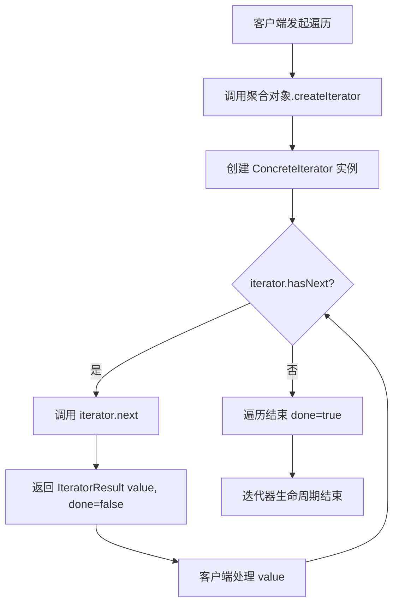
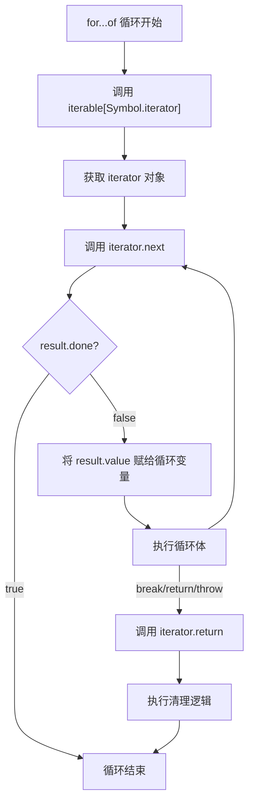
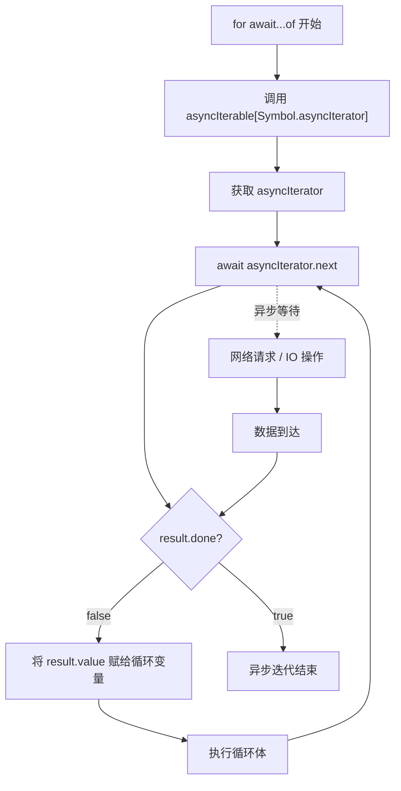
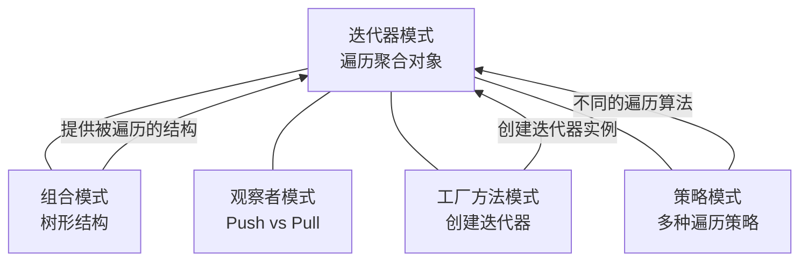

# 迭代器模式

> 提供一种方法顺序访问一个聚合对象中各个元素，而又不暴露该对象的内部表示。--GoF

## 1. 定义与意图

迭代器模式（Iterator Pattern）是一种行为型设计模式，其核心思想是将遍历逻辑从聚合对象中抽离出来，封装为独立的迭代器对象，从而实现以下目标：

- **访问与表示分离**：客户端无需了解聚合对象的内部数据结构（数组、链表、树等），只需通过统一接口遍历元素。
- **遍历策略可替换**：同一聚合对象可以提供多种迭代器（正序、倒序、深度优先、广度优先），客户端按需选择。
- **单一职责**：聚合对象专注存储数据，迭代器专注遍历逻辑，各司其职。

### JavaScript 中的特殊地位

与其他语言不同，JavaScript 在语言层面原生支持迭代器模式，这是 ES6 规范的核心特性之一：

| 特性 | 说明 |
|------|------|
| `Symbol.iterator` | 可迭代协议的统一入口，任何实现该符号方法的对象都可被 `for...of` 遍历 |
| `Iterator Protocol` | 规定 `next()` 方法返回 `{ value, done }` 结构，标准化遍历步进 |
| `function*` / `yield` | Generator 函数是创建迭代器的一等语法，大幅简化实现 |
| `for...of` | 语言层面消费可迭代对象的语法糖，自动调用 `[Symbol.iterator]()` |
| `Symbol.asyncIterator` | 异步迭代协议，配合 `for await...of` 实现异步数据源的惰性遍历 |

这意味着在 JavaScript 中，迭代器模式不是可选的设计模式，而是**语言内建的基础设施**。数组、字符串、Map、Set、TypedArray、arguments 等全部原生实现可迭代协议。

---

## 2. UML类图



### ES6 迭代协议视角的类图



---

## 3. 核心角色与职责

| 角色 | 职责 | JavaScript 对应 |
|------|------|-----------------|
| **Iterator（迭代器接口）** | 定义遍历元素的接口：`next()`、`hasNext()`、`current()` | `Iterator Protocol`：`next()` 返回 `{ value, done }` |
| **ConcreteIterator（具体迭代器）** | 实现特定聚合对象的遍历逻辑，维护当前遍历位置 | Generator 函数、手写 `[Symbol.iterator]()` 实现 |
| **Aggregate（聚合接口）** | 声明创建迭代器的方法 | `Iterable Protocol`：`[Symbol.iterator]()` |
| **ConcreteAggregate（具体聚合）** | 实现创建迭代器的方法，返回对应的 ConcreteIterator | 自定义类实现 `[Symbol.iterator]()` |

### 迭代器 vs 可迭代对象

```
┌─────────────────────────────────────────────────────────────┐
│              迭代器与可迭代对象的关系                         │
├─────────────────────────────────────────────────────────────┤
│                                                             │
│  Iterable（可迭代对象）                                      │
│  ────────────────────                                      │
│  • 实现了 [Symbol.iterator]() 方法                           │
│  • 可被 for...of、展开运算符、解构赋值消费                    │
│  • 是"数据源"的抽象                                         │
│                                                             │
│  Iterator（迭代器）                                         │
│  ────────────────────                                      │
│  • 实现了 next() 方法                                       │
│  • 维护遍历状态（当前位置）                                  │
│  • 是"遍历指针"的抽象                                       │
│                                                             │
│  关系：Iterable.[Symbol.iterator]() => Iterator              │
│  一个 Iterable 可以创建多个独立的 Iterator                   │
│                                                             │
└─────────────────────────────────────────────────────────────┘
```

---

## 4. 应用场景

### 4.1 通用场景

#### 集合遍历 -- 统一不同数据结构的遍历接口

#### 树形结构遍历（DFS / BFS）

### 4.2 前端框架实战

#### for...of 原理 -- 任何实现 Symbol.iterator 的对象都可被 for...of 遍历

#### 自定义可迭代数据结构 -- 链表

#### 分页迭代器 -- 按页加载远程数据，LazyIterator 模式

#### React Suspense 与异步迭代器的关系

---

## 5. Mermaid流程图

### 迭代器遍历流程



### for...of 内部执行流程



### 异步迭代器流程



---

## 6. 优缺点分析

| 优点 | 缺点 |
|------|------|
| **不暴露内部结构**：客户端无需了解聚合对象的存储方式 | **遍历中修改集合可能出问题**：并发修改导致不确定行为 |
| **统一遍历接口**：不同数据结构用相同的 `for...of` 遍历 | **额外的迭代器对象**：每次遍历创建迭代器实例，有内存开销 |
| **支持多种遍历策略**：同一聚合可提供正序、倒序、DFS、BFS 等 | **简单集合可能过度设计**：纯数组场景直接索引访问更直接 |
| **单一职责**：聚合专注存储，迭代器专注遍历 | **单向遍历限制**：标准迭代器只能向前，反向需额外实现 |
| **惰性求值**：Generator 按需产出，处理无限序列或大数据集 | **调试不直观**：迭代器状态机不如普通循环直观 |
| **可组合**：Generator 链式组合 filter/map/take，无中间数组 | **学习曲线**：需理解迭代协议、Generator、异步迭代等概念 |
| **语言原生支持**：ES6 迭代协议是标准，生态兼容性好 | |

### 适用性判断

```
┌─────────────────────────────────────────────────────────────┐
│               何时使用迭代器模式？                           │
├─────────────────────────────────────────────────────────────┤
│                                                             │
│  需要遍历自定义数据结构？                                    │
│       │                                                     │
│       ├── 否 --> 直接使用数组原生方法                        │
│       │                                                     │
│       └── 是 --> 需要多种遍历策略？                         │
│                 │                                           │
│                 ├── 否 --> 实现 [Symbol.iterator]()          │
│                 │                                           │
│                 └── 是 --> 提供多个 Generator 方法           │
│                           (dfs/bfs/reverse/entries)         │
│                                                             │
│  数据量大或需要惰性加载？                                    │
│       │                                                     │
│       ├── 否 --> 同步迭代器即可                              │
│       │                                                     │
│       └── 是 --> 使用 Async Iterator / Async Generator       │
│                                                             │
└─────────────────────────────────────────────────────────────┘
```

---

## 7. 相关模式对比

### 迭代器 vs 组合

| 对比维度 | 迭代器模式 | 组合模式 |
|----------|-----------|---------|
| **意图** | 遍历聚合对象中的元素 | 将对象组合成树形结构 |
| **关注点** | 如何访问元素 | 如何组织元素 |
| **结构** | Iterator + Aggregate | Component + Leaf + Composite |
| **关系** | 常与组合模式配合使用 | 提供被遍历的树形结构 |
| **典型场景** | 集合遍历、树遍历 | UI 组件树、文件系统 |

### 迭代器 vs 观察者

| 对比维度 | 迭代器模式 | 观察者模式 |
|----------|-----------|-----------|
| **数据流向** | Pull（客户端主动拉取） | Push（数据源主动推送） |
| **控制权** | 客户端控制遍历节奏 | 数据源控制推送时机 |
| **适用场景** | 遍历已有数据集合 | 响应事件和数据变化 |
| **关系** | Observable 可视为 Push 版本的 Iterator | Iterator 可视为 Pull 版本的 Observable |

### 迭代器 vs 工厂方法

| 对比维度 | 迭代器模式 | 工厂方法模式 |
|----------|-----------|-------------|
| **意图** | 遍历聚合对象 | 定义创建对象的接口 |
| **关系** | `createIterator()` 本身就是工厂方法 | 聚合对象扮演工厂角色 |
| **协作** | 聚合对象通过工厂方法创建迭代器实例 | 为迭代器模式提供创建机制 |

### 模式关系图



---

## 8. 总结

迭代器模式在 JavaScript/TypeScript 中拥有独特的地位 -- 它不是可选的设计模式，而是语言层面的基础设施。ES6 的迭代协议（`Symbol.iterator`、`Iterator Protocol`、`Generator`）将 GoF 的迭代器模式直接内建到了语言规范中。

**核心要点回顾：**

1. **语言原生支持**：`for...of`、展开运算符、解构赋值、`Array.from` 等全部基于迭代协议，任何实现 `[Symbol.iterator]()` 的对象自动获得这些语法支持。

2. **Generator 是一等实现方式**：`function*` + `yield` 是创建迭代器最简洁、最可读的方式，自动实现 `IterableIterator` 接口，支持 `yield*` 委托和递归。

3. **惰性求值是杀手级特性**：Generator 按需产出值，天然支持无限序列、大数据集、分页加载等场景，避免一次性加载全部数据。

4. **异步迭代扩展了边界**：`Symbol.asyncIterator` + `for await...of` 将迭代器模式延伸到异步数据源，与 React Suspense、数据流等前端概念深度关联。

5. **与组合模式天然配合**：组合模式构建树形结构，迭代器模式遍历树形结构，二者配合可实现 DFS、BFS、条件查找等多种遍历策略。

6. **避免过度设计**：对于简单数组场景，直接使用原生方法（`forEach`、`map`、`filter`）更直接；只在自定义数据结构、多种遍历策略、惰性加载等场景下引入迭代器模式。

> 最佳实践：优先使用 Generator 函数实现迭代器，它比手写 `next()` 方法更简洁、更不容易出错。为聚合对象提供多种迭代方法（`reverse()`、`entries()`、`dfs()`、`bfs()`）以满足不同遍历需求。处理异步数据源时使用 Async Generator + `for await...of`，避免手动管理分页状态。

---

## TypeScript 实现

### 基础实现

#### 内部迭代器

内部迭代器将遍历逻辑封装在聚合对象内部，客户端只需传入回调函数，无需控制遍历步进。典型代表即 `Array.prototype.forEach`。

```typescript
// 内部迭代器：遍历逻辑封装在聚合对象内部
class NumberCollection {
  private items: number[];

  constructor(items: number[] = []) {
    this.items = items;
  }

  // 内部迭代器 -- 客户端无法控制遍历步进
  each(callback: (item: number, index: number) => void): void {
    for (let i = 0; i < this.items.length; i++) {
      callback(this.items[i], i);
    }
  }

  // 可提前终止的变体
  every(callback: (item: number, index: number) => boolean): boolean {
    for (let i = 0; i < this.items.length; i++) {
      if (!callback(this.items[i], i)) return false;
    }
    return true;
  }
}

// 使用
const collection = new NumberCollection([1, 2, 3, 4, 5]);
collection.each((item, index) => {
  console.log(`[${index}] = ${item}`);
});
collection.every((item) => item < 10); // true
```

#### 外部迭代器

外部迭代器由客户端控制遍历步进，每次调用 `next()` 推进一步，适用于需要精细控制遍历过程的场景。

```typescript
// 迭代结果类型
interface IteratorResult<T> {
  value: T | undefined;
  done: boolean;
}

// 迭代器接口
interface IIterator<T> {
  next(): IteratorResult<T>;
  hasNext(): boolean;
  current(): T | undefined;
  reset(): void;
}

// 具体迭代器
class ArrayIterator<T> implements IIterator<T> {
  private index = 0;
  constructor(private collection: T[]) {}

  next(): IteratorResult<T> {
    if (this.index < this.collection.length) {
      return { value: this.collection[this.index++], done: false };
    }
    return { value: undefined, done: true };
  }
  hasNext(): boolean { return this.index < this.collection.length; }
  current(): T | undefined { return this.collection[this.index]; }
  reset(): void { this.index = 0; }
}

// 具体聚合
class ArrayCollection<T> {
  constructor(private items: T[]) {}
  createIterator(): IIterator<T> { return new ArrayIterator(this.items); }
  size(): number { return this.items.length; }
}

// ==================== 使用 ====================
const arr = new ArrayCollection(['TypeScript', 'Rust', 'Go']);
const iterator = arr.createIterator();

while (iterator.hasNext()) {
  console.log(iterator.next().value);
}
// 输出: TypeScript, Rust, Go
```

#### 反向迭代器

```typescript
class ReverseArrayIterator<T> implements IIterator<T> {
  private collection: T[];
  private index: number;

  constructor(collection: T[]) {
    this.collection = collection;
    this.index = collection.length - 1;
  }

  next(): IteratorResult<T> {
    if (this.index >= 0) {
      return { value: this.collection[this.index--], done: false };
    }
    return { value: undefined, done: true };
  }
  hasNext(): boolean { return this.index >= 0; }
  current(): T | undefined { return this.collection[this.index]; }
  reset(): void { this.index = this.collection.length - 1; }
}

// 聚合：支持正向和反向迭代
class ReverseArrayCollection<T> {
  constructor(private items: T[]) {}
  createForwardIterator(): IIterator<T> { return new ArrayIterator(this.items); }
  createReverseIterator(): IIterator<T> { return new ReverseArrayIterator(this.items); }
}

// 使用
const reverseIter = new ReverseArrayIterator([1, 2, 3, 4, 5]);
while (reverseIter.hasNext()) {
  console.log(reverseIter.next().value);
}
// 输出: 5, 4, 3, 2, 1
```

### 现代TypeScript实现

#### Iterator Protocol -- 实现 `[Symbol.iterator]()` 返回 IteratorResult

```typescript
// 完整的 IteratorResult 类型（TypeScript 内置）
// interface IteratorResult<T> {
//   value: T | undefined;
//   done: boolean;
// }
// interface Iterator<T> {
//   next(value?: any): IteratorResult<T>;
//   return?(value?: T): IteratorResult<T>;
//   throw?(e?: any): IteratorResult<T>;
// }
// interface Iterable<T> {
//   [Symbol.iterator](): Iterator<T>;
// }

// 实现 [Symbol.iterator]() 的集合
class NumberCollection implements Iterable<number> {
  constructor(private items: number[]) {}

  [Symbol.iterator](): Iterator<number> {
    let index = 0;
    const items = this.items;
    return {
      next(): IteratorResult<number> {
        if (index < items.length) {
          return { value: items[index++], done: false };
        }
        return { value: undefined, done: true };
      },
    };
  }
}

// ==================== 使用 ====================
const col = new NumberCollection([10, 20, 30]);

// for...of
for (const num of col) console.log(num); // 10, 20, 30

// 展开运算符
console.log([...col]); // [10, 20, 30]

// 解构赋值
const [first, second, ...rest] = col;
console.log(first, second, rest); // 10 20 [30]
```

#### Generator 函数 -- `function*` 实现迭代器

Generator 函数是创建迭代器最简洁的方式，它自动实现 `Iterator` 和 `IterableIterator` 接口。

```typescript
// Generator 函数自动返回 IterableIterator
function* rangeGenerator(
  start: number,
  end: number,
  step: number = 1
): IterableIterator<number> {
  for (let i = start; i < end; i += step) {
    yield i;
  }
}

// 使用 Generator 实现的集合类
class NumberRange implements Iterable<number> {
  constructor(private start: number, private end: number, private step = 1) {}

  *[Symbol.iterator](): IterableIterator<number> {
    for (let i = this.start; i < this.end; i += this.step) {
      yield i;
    }
  }

  // 反向迭代
  *reverse(): IterableIterator<number> {
    for (let i = this.end - 1; i >= this.start; i -= this.step) {
      yield i;
    }
  }

  // 带索引的迭代
  *entries(): IterableIterator<[number, number]> {
    let index = 0;
    for (const value of this) {
      yield [index++, value];
    }
  }
}

const range = new NumberRange(1, 6);
console.log([...range]);          // [1, 2, 3, 4, 5]
console.log([...range.reverse()]); // [5, 4, 3, 2, 1]
console.log([...range.entries()]); // [[0,1], [1,2], [2,3], [3,4], [4,5]]
```

#### yield* 委托

```typescript
// yield* 将迭代委托给另一个可迭代对象
function* concatIterables<T>(
  ...iterables: Iterable<T>[]
): IterableIterator<T> {
  for (const iterable of iterables) {
    yield* iterable;
  }
}

// 使用（显式标注 T 为 string | number，否则 TS 会把 T 推断为首参的 number）
const merged = [
  ...concatIterables<number | string>([1, 2], 'ab', new Set([3, 4]))
];
console.log(merged); // [1, 2, 'a', 'b', 3, 4]

// 递归委托 -- 树形结构遍历
interface TreeNode<T> {
  value: T;
  children: TreeNode<T>[];
}

function* traverseTree<T>(node: TreeNode<T>): IterableIterator<T> {
  yield node.value;
  for (const child of node.children) {
    yield* traverseTree(child); // 递归委托
  }
}
```

#### Async Iterator + Async Generator -- 异步迭代

```typescript
// 异步迭代器协议
// interface AsyncIterator<T> {
//   next(value?: any): Promise<IteratorResult<T>>;
//   return?(value?: T): Promise<IteratorResult<T>>;
//   throw?(e?: any): Promise<IteratorResult<T>>;
// }
// interface AsyncIterable<T> {
//   [Symbol.asyncIterator](): AsyncIterator<T>;
// }

// 异步数据源
class AsyncDataSource implements AsyncIterable<Record<string, unknown>> {
  private pages: Array<Record<string, unknown>> = [];

  addPage(data: Record<string, unknown>): this {
    this.pages.push(data);
    return this;
  }

  async *[Symbol.asyncIterator](): AsyncIterator<Record<string, unknown>> {
    for (const page of this.pages) {
      // 模拟异步拉取
      await new Promise((r) => setTimeout(r, 10));
      yield page;
    }
  }
}

// ==================== 使用 ====================
async function fetchPages<T>(url: string, pageSize: number): Promise<AsyncIterable<T>> {
  const source = new AsyncDataSource();
  for (let i = 0; i < 3; i++) {
    source.addPage({ page: i + 1, items: Array(pageSize).fill(0).map((_, j) => ({ id: i * pageSize + j })) } as Record<string, unknown>);
  }
  return source as AsyncIterable<T>;
}

async function consume() {
  // 使用 Async Generator
  for await (const user of await fetchPages<Record<string, unknown>>('/api/users', 50)) {
    console.log(user);
  }
}
consume();
```

#### IterableIterator 接口的完整类型定义

```typescript
// 完整的泛型可迭代集合类型定义
interface ICollection<T> extends Iterable<T> {
  readonly size: number;
  add(item: T): this;
  remove(item: T): boolean;
  has(item: T): boolean;
  clear(): void;

  // 多种迭代策略
  reverse(): IterableIterator<T>;
  entries(): IterableIterator<[number, T]>;
  filter(predicate: (item: T) => boolean): IterableIterator<T>;
  map<U>(mapper: (item: T) => U): IterableIterator<U>;
}

// 智能集合实现
class SmartCollection<T> implements ICollection<T> {
  private items: T[] = [];

  get size(): number { return this.items.length; }
  add(item: T): this { this.items.push(item); return this; }
  remove(item: T): boolean {
    const index = this.items.indexOf(item);
    if (index >= 0) { this.items.splice(index, 1); return true; }
    return false;
  }
  has(item: T): boolean { return this.items.includes(item); }
  clear(): void { this.items = []; }

  *[Symbol.iterator](): IterableIterator<T> { yield* this.items; }
  *reverse(): IterableIterator<T> { yield* [...this.items].reverse(); }
  *entries(): IterableIterator<[number, T]> {
    for (let i = 0; i < this.items.length; i++) yield [i, this.items[i]];
  }
  *filter(predicate: (item: T) => boolean): IterableIterator<T> {
    for (const item of this.items) if (predicate(item)) yield item;
  }
  *map<U>(mapper: (item: T) => U): IterableIterator<U> {
    for (const item of this.items) yield mapper(item);
  }
}

// 使用
const smart = new SmartCollection<number>();
smart.add(1).add(2).add(3).add(4).add(5);

console.log([...smart]);                // [1, 2, 3, 4, 5]
console.log([...smart.reverse()]);      // [5, 4, 3, 2, 1]
console.log([...smart.filter(n => n > 2)]); // [3, 4, 5]
console.log([...smart.map(n => n * 10)]);   // [10, 20, 30, 40, 50]
```

---

```typescript
// 不同内部结构的集合，统一遍历接口
class SparseArray<T> implements Iterable<T> {
  private data: Map<number, T> = new Map();
  private maxIndex: number = 0;

  set(index: number, value: T): void {
    this.data.set(index, value);
    if (index > this.maxIndex) this.maxIndex = index;
  }

  get(index: number): T | undefined {
    return this.data.get(index);
  }

  // 只遍历实际存储的元素
  *[Symbol.iterator](): IterableIterator<T> {
    // 按插入顺序遍历（Map 保持插入序，非按索引排序）
    for (const value of this.data.values()) {
      yield value;
    }
  }
}

// ==================== 使用 ====================
const sparse = new SparseArray<string>();
sparse.set(0, 'a');
sparse.set(100, 'b');
sparse.set(999, 'c');

for (const val of sparse) {
  console.log(val); // a, b, c（只遍历3个元素，而非1000个）
}
```

```typescript
interface ITreeNode<T> {
  value: T;
  children: ITreeNode<T>[];
}

class TreeNode<T> implements ITreeNode<T> {
  value: T;
  children: TreeNode<T>[] = [];

  constructor(value: T) {
    this.value = value;
  }

  addChild(child: TreeNode<T>): this {
    this.children.push(child);
    return this;
  }

  // DFS 前序遍历
  *[Symbol.iterator](): IterableIterator<TreeNode<T>> {
    yield this;
    for (const child of this.children) {
      yield* child;
    }
  }

  // BFS 遍历
  *bfs(): IterableIterator<TreeNode<T>> {
    const queue: TreeNode<T>[] = [this];
    while (queue.length > 0) {
      const node = queue.shift()!;
      yield node;
      queue.push(...node.children);
    }
  }

  // 查找满足条件的节点
  *find(predicate: (node: TreeNode<T>) => boolean): IterableIterator<TreeNode<T>> {
    for (const node of this) {
      if (predicate(node)) yield node;
    }
  }
}

// ==================== 使用 ====================
const root = new TreeNode<string>('src');
const components = new TreeNode<string>('components');
components.addChild(new TreeNode<string>('App.tsx')).addChild(new TreeNode<string>('Button.tsx')).addChild(new TreeNode<string>('Input.tsx'));
root.addChild(new TreeNode<string>('index.ts')).addChild(components);

// 查找 .tsx 文件
for (const node of root.find(n => n.value.endsWith('.tsx'))) {
  console.log(node.value); // App.tsx, Button.tsx, Input.tsx
}
```

```typescript
// for...of 的等价手动展开
function forOf<T>(iterable: Iterable<T>, callback: (item: T) => void): void {
  const iterator = iterable[Symbol.iterator]();
  let result: IteratorResult<T> = iterator.next();

  while (!result.done) {
    callback(result.value!);
    result = iterator.next();
  }

  // 注意：真实的 for...of 只在 break/return/throw 提前退出时才会
  // 调用 iterator.return() 做清理；正常结束（done=true）不会调用。
}

// 自定义可迭代对象
const customIterable: Iterable<number> = {
  [Symbol.iterator](): Iterator<number> {
    let i = 0;
    return {
      next(): IteratorResult<number> {
        if (i < 5) return { value: i++, done: false };
        return { value: undefined, done: true };
      },
      return(): IteratorResult<number> {
        console.log('迭代器被提前终止');
        return { value: undefined, done: true };
      },
    };
  },
};

// 以下全部可用
for (const n of customIterable) { console.log(n); }        // 0,1,2,3,4
console.log([...customIterable]);                            // [0,1,2,3,4]
const [a, b, ...c] = customIterable;                         // a=0, b=1, c=[2,3,4]
console.log(Array.from(customIterable));                     // [0,1,2,3,4]
```

```typescript
class ListNode<T> {
  constructor(
    public value: T,
    public next: ListNode<T> | null = null
  ) {}
}

class LinkedList<T> implements Iterable<T> {
  private head: ListNode<T> | null = null;
  private tail: ListNode<T> | null = null;
  private _size: number = 0;

  get size(): number { return this._size; }

  push(value: T): void {
    const node = new ListNode(value);
    if (!this.head) {
      this.head = this.tail = node;
    } else {
      this.tail!.next = node;
      this.tail = node;
    }
    this._size++;
  }

  pop(): T | undefined {
    if (!this.head) return undefined;
    let current = this.head;
    let prev: ListNode<T> | null = null;
    while (current.next) { prev = current; current = current.next; }
    if (prev) prev.next = null; else this.head = null;
    this.tail = prev;
    this._size--;
    return current.value;
  }

  *[Symbol.iterator](): IterableIterator<T> {
    let current = this.head;
    while (current) { yield current.value; current = current.next; }
  }

  // 反向迭代
  *reverse(): IterableIterator<T> {
    const values: T[] = [];
    for (const v of this) values.unshift(v);
    yield* values;
  }
}

// ==================== 使用 ====================
const list = new LinkedList<number>();
list.push(0);
list.push(1);
list.push(2);
list.push(3);

for (const val of list) {
  console.log(val); // 0, 1, 2, 3
}

console.log([...list.reverse()]); // [3, 2, 1, 0]
```

```typescript
// 分页 API 响应类型
interface PageResult<T> {
  items: T[];
  total: number;
  hasMore: boolean;
}

// 分页迭代器 -- 惰性加载，按需请求
class PagedIterator<T> implements AsyncIterable<T> {
  private currentPage: number = 0;
  private buffer: T[] = [];
  private bufferIndex: number = 0;
  private hasMoreData = true;

  constructor(
    private readonly fetcher: (page: number) => Promise<PageResult<T>>
  ) {}

  // 拉取下一页
  private async fetchNextPage(): Promise<void> {
    const result = await this.fetcher(this.currentPage++);
    this.buffer = result.items;
    this.bufferIndex = 0;
    this.hasMoreData = result.hasMore;
  }

  async *[Symbol.asyncIterator](): AsyncIterator<T> {
    while (this.hasMoreData || this.bufferIndex < this.buffer.length) {
      if (this.bufferIndex >= this.buffer.length && this.hasMoreData) {
        await this.fetchNextPage();
      }
      if (this.bufferIndex < this.buffer.length) {
        yield this.buffer[this.bufferIndex++];
      } else {
        break;
      }
    }
  }
}

interface User {
  id: number;
  name: string;
}
```

```typescript
// Suspense 的 fetch-then-render 模式与异步迭代器的惰性加载理念一致
// 以下展示如何用 Async Iterator 实现 Suspense 风格的数据流

interface Resource<T> {
  read(): T;
}

// 简化的 Suspense 资源包装
function createResource<T>(promise: Promise<T>): Resource<T> {
  let status: 'pending' | 'success' | 'error' = 'pending';
  let result: T | undefined;
  let error: Error | undefined;

  // 启动 promise
  promise.then(
    (value) => { status = 'success'; result = value; },
    (err) => { status = 'error'; error = err; }
  );

  return {
    read(): T {
      if (status === 'pending') throw promise; // 让 Suspense 捕获并挂起
      if (status === 'error') throw error;     // 抛出错误到 ErrorBoundary
      return result!;
    },
  };
}

// ==================== 使用（示意） ====================
// function AsyncList({ stream }: { stream: AsyncIterable<Resource<User>> }) {
//   const items: React.ReactNode[] = [];
//   for await (const resource of stream) {
//     const data = resource.read(); // Suspense 边界
//     items.push(<Item key={data.id} data={data} />);
//   }
//   return <ul>{items}</ul>;
// }
```

```typescript
// 组合模式构建树形结构，迭代器模式遍历树形结构
// 二者常配合使用

// 组合模式：定义统一接口
interface IComponent {
  operation(): void;
}

// 迭代器模式：为组合结构提供遍历能力
class CompositeNode implements IComponent, Iterable<IComponent> {
  private children: IComponent[] = [];

  operation(): void {
    // 组合模式的统一操作
  }

  add(child: IComponent): this {
    this.children.push(child);
    return this;
  }

  // 迭代器模式：遍历子节点
  *[Symbol.iterator](): IterableIterator<IComponent> {
    yield* this.children;
  }
}
```

```typescript
// 聚合对象的 createIterator 就是工厂方法的应用
class MultiStrategyCollection<T> implements Iterable<T> {
  constructor(private items: T[]) {}

  // 工厂方法：创建默认迭代器
  [Symbol.iterator](): Iterator<T> {
    return this.createForwardIterator();
  }

  // 工厂方法：创建正向迭代器
  createForwardIterator(): Iterator<T> {
    let index = 0;
    const items = this.items;
    return {
      next(): IteratorResult<T> {
        if (index < items.length) return { value: items[index++], done: false };
        return { value: undefined, done: true };
      },
    };
  }

  // 工厂方法：创建反向迭代器
  createReverseIterator(): Iterator<T> {
    let index = this.items.length - 1;
    const items = this.items;
    return {
      next(): IteratorResult<T> {
        if (index >= 0) return { value: items[index--], done: false };
        return { value: undefined, done: true };
      }
    };
  }
}
```

---

## Java 实现

### 迭代器模式（统一遍历集合）

```java
import java.util.ArrayList;
import java.util.Iterator;
import java.util.List;

// 自定义集合
class NameCollection implements Iterable<String> {
    private final List<String> names = new ArrayList<>();

    public void add(String name) {
        names.add(name);
    }

    // 返回迭代器，客户端可统一遍历，无需知道内部结构
    @Override
    public Iterator<String> iterator() {
        return names.iterator();
    }
}

// 使用：for-each 语法糖底层就是迭代器
public class Client {
    public static void main(String[] args) {
        NameCollection collection = new NameCollection();
        collection.add("张三");
        collection.add("李四");
        collection.add("王五");

        for (String name : collection) {
            System.out.println(name);
        }

        // 显式使用迭代器（可删除元素）
        Iterator<String> it = collection.iterator();
        while (it.hasNext()) {
            System.out.println(it.next());
        }
    }
}
```

### 自定义迭代器（反向遍历）

```java
import java.util.Iterator;
import java.util.NoSuchElementException;

class ReverseCollection implements Iterable<Integer> {
    private final int[] data;

    public ReverseCollection(int[] data) {
        this.data = data;
    }

    @Override
    public Iterator<Integer> iterator() {
        return new Iterator<>() {
            private int index = data.length - 1;

            @Override
            public boolean hasNext() {
                return index >= 0;
            }

            @Override
            public Integer next() {
                if (!hasNext()) throw new NoSuchElementException();
                return data[index--];
            }
        };
    }
}
```

> 迭代器模式提供统一方式顺序访问聚合元素，而不暴露内部表示。Java 集合框架（`Collection`/`Iterator`）是迭代器模式的标准实现，`for-each` 语法依赖 `Iterable`。

## Python 实现

### 迭代器模式（`__iter__` / `__next__`）

```python
class NameCollection:
    def __init__(self):
        self._names = []

    def add(self, name: str):
        self._names.append(name)

    def __iter__(self):
        # 返回迭代器对象
        return iter(self._names)

# 使用
collection = NameCollection()
collection.add("张三")
collection.add("李四")
collection.add("王五")

for name in collection:
    print(name)

# 自定义迭代器：反向遍历
class ReverseIterator:
    def __init__(self, data):
        self._data = data
        self._index = len(data) - 1

    def __iter__(self):
        return self

    def __next__(self):
        if self._index < 0:
            raise StopIteration
        value = self._data[self._index]
        self._index -= 1
        return value

for n in ReverseIterator([1, 2, 3, 4]):
    print(n)  # 4, 3, 2, 1
```

> Python 的迭代器协议由 `__iter__`（返回迭代器）与 `__next__`（返回下一个元素，耗尽抛 `StopIteration`）构成。生成器（`yield`）、`for` 循环、`map`/`filter` 都建立在该协议之上。这是 Python 中"鸭子类型"与迭代器模式的完美结合。

