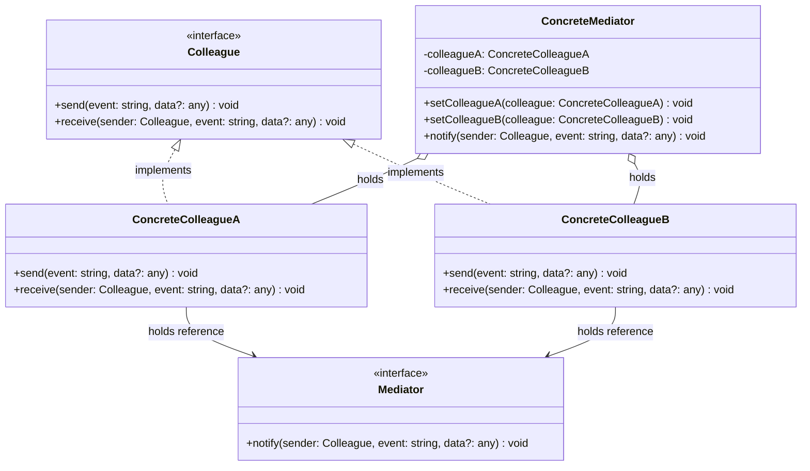
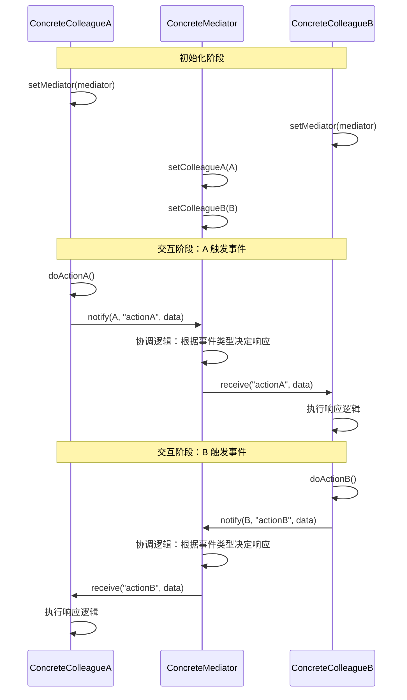
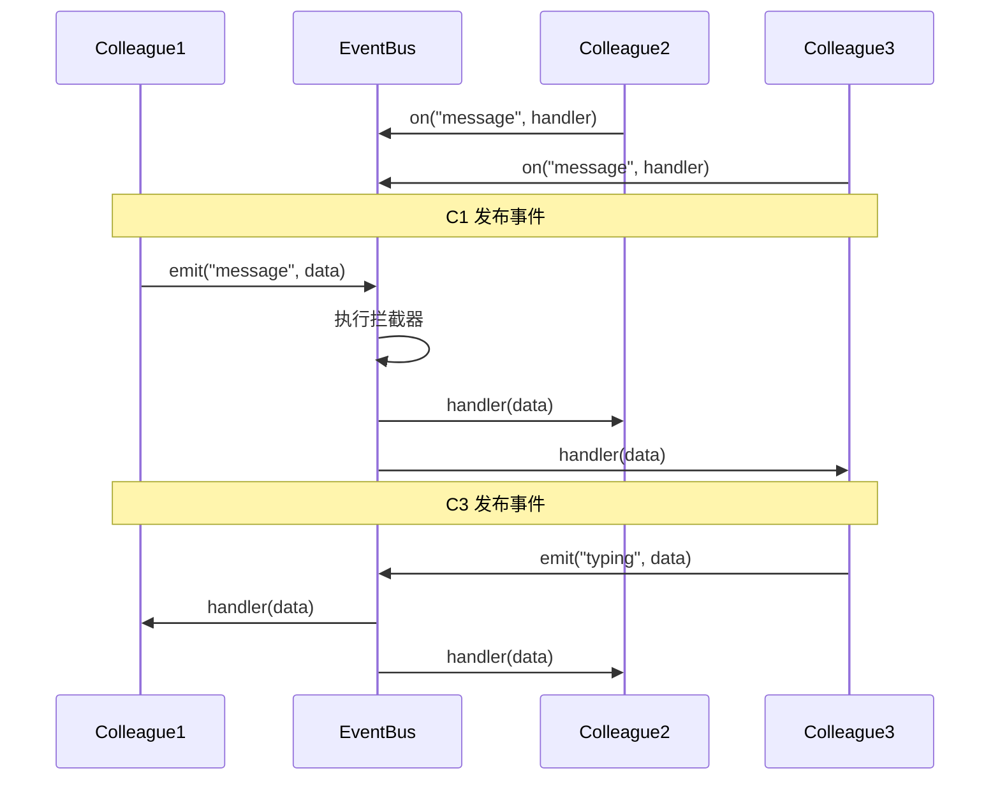

# 中介者模式

> 中介者模式（Mediator Pattern）用一个中介对象来封装一系列的对象交互。中介者使各对象不需要显式地相互引用，从而使其耦合松散，而且可以独立地改变它们之间的交互。 --GoF

## 1. 定义与意图

### 模式定义

中介者模式是一种行为型设计模式，它通过引入一个中介对象，将系统中一组对象之间的复杂交互关系封装在中介者内部。各对象不再直接相互引用和通信，而是通过中介者进行间接交互，从而降低对象间的耦合度，使系统更易于理解和扩展。

### 问题背景

当系统中对象之间存在复杂的网状交互关系时，每个对象都需要持有其他对象的引用并直接调用其方法。这种设计导致：

- **耦合度高**：修改一个对象可能影响多个与之交互的对象
- **复用困难**：对象难以脱离当前交互环境独立使用
- **维护复杂**：对象间的关系如蛛网般纠缠，难以理清交互逻辑

```
┌─────────────────────────────────────────────────────────────┐
│                  无中介者：网状耦合                          │
├─────────────────────────────────────────────────────────────┤
│                                                             │
│              ┌──────────┐                                   │
│         ┌───▶│ Object A │◀───┐                              │
│         │    └──────────┘    │                              │
│         │         │  ▲       │                              │
│         │         ▼  │       │                              │
│    ┌──────────┐   ┌──────────┐   ┌──────────┐              │
│    │ Object D │   │ Object B │──▶│ Object C │              │
│    └──────────┘   └──────────┘◀──└──────────┘              │
│         ▲               │                                  │
│         └───────┐       ▼                                  │
│                │    ┌──────────┐                           │
│                └───▶│ Object A │                           │
│                     └──────────┘                           │
│                                                             │
│  对象 A 直接依赖 B、C、D，形成网状耦合                       │
│  N 个对象间的交互关系数: O(N²)                               │
│                                                             │
│  引入中介者后：                                              │
│    ┌──────────┐   ┌──────────┐   ┌──────────┐              │
│    │ Object A │   │ Object B │   │ Object C │              │
│    └──────────┘   └──────────┘   └──────────┘              │
│         │              │              │                    │
│         └──────────────┼──────────────┘                    │
│                        ▼                                   │
│               ┌──────────────┐                             │
│               │   Mediator   │                             │
│               └──────────────┘                             │
│  N 个对象间的交互关系数: O(N)                               │
│                                                             │
└─────────────────────────────────────────────────────────────┘
```

---

## 2. UML类图



---

## 3. 核心角色与职责

| 角色 | 职责 | 说明 |
|------|------|------|
| **Mediator（中介者接口）** | 定义同事间通信接口 | 声明 notify 方法，同事通过此方法与中介者通信 |
| **ConcreteMediator（具体中介者）** | 协调同事对象交互 | 持有所有同事引用，实现具体的协调逻辑 |
| **Colleague（同事接口）** | 通过中介者与其他同事通信 | 持有中介者引用，不直接引用其他同事 |
| **ConcreteColleague（具体同事）** | 实现自身业务逻辑 | 只与中介者交互，不关心其他同事的存在 |

### 角色关系

```
┌─────────────────────────────────────────────────────────────┐
│                    角色关系图                               │
├─────────────────────────────────────────────────────────────┤
│                                                             │
│   ┌─────────────────────┐                                  │
│   │    ConcreteMediator  │                                  │
│   │                     │                                  │
│   │  ┌───────────────┐  │  ┌───────────────────────────┐  │
│   │  │ colleagueA ───┼──┼─▶│ ConcreteColleagueA        │  │
│   │  │ colleagueB ───┼──┼─▶│                           │  │
│   │  │ colleagueC ───┼──┼─▶│  mediator ──▶ Mediator    │  │
│   │  └───────────────┘  │  │  doActionA()              │  │
│   │                     │  │  receive()                │  │
│   │  notify() {         │  └───────────────────────────┘  │
│   │    // 协调逻辑      │                                  │
│   │  }                  │  ┌───────────────────────────┐  │
│   │                     │  │ ConcreteColleagueB        │  │
│   └─────────────────────┘  │                           │  │
│                            │  mediator ──▶ Mediator    │  │
│                            │  doActionB()              │  │
│                            │  receive()                │  │
│                            └───────────────────────────┘  │
│                                                             │
│  关键：同事只认识中介者，不认识其他同事                     │
│                                                             │
└─────────────────────────────────────────────────────────────┘
```

---

## 4. 应用场景

### 4.1 通用场景

| 场景类型 | 具体应用 | 说明 |
|----------|----------|------|
| **聊天室** | 多用户消息系统 | 用户通过聊天室中介者通信，互不直接引用 |
| **空中交通管制** | 飞机与塔台 | 飞机不直接通信，通过塔台协调起降 |
| **UI组件协调** | 表单联动、对话框交互 | 组件通过中介者联动，避免组件间直接依赖 |
| **对话框交互** | 按钮与输入框联动 | 按钮状态由中介者根据输入框状态决定 |
| **机场调度** | 航班与登机口 | 调度中心协调航班与登机口的分配 |

#### 空中交通管制示例

### 4.2 前端框架实战

#### Vue EventBus

#### React Context 作为中介者

#### Redux Store 作为中介者

#### 微前端通信：qiankun initGlobalState

---

## 5. Mermaid流程图

### 同事对象通过中介者交互的时序



### 事件总线交互流程



---

## 6. 优缺点分析

### 优点

| 优点 | 说明 |
|------|------|
| **解耦同事对象** | 各同事对象不再直接引用，仅依赖中介者接口 |
| **简化对象交互** | 一对多交互替代多对多交互，交互关系从 O(N²) 降为 O(N) |
| **符合迪米特法则** | 每个对象只与中介者通信，不与陌生对象交互 |
| **集中控制交互逻辑** | 交互协调逻辑集中在中介者，便于理解和修改 |
| **提高可复用性** | 同事对象可在不同中介者环境中复用 |

### 缺点

| 缺点 | 说明 |
|------|------|
| **中介者可能变成上帝对象** | 协调逻辑全部集中，中介者可能过于庞大 |
| **中介者复杂度高** | 随着同事数量增加，中介者协调逻辑急剧复杂 |
| **调试困难** | 交互通过中介者间接进行，调用链不如直接调用直观 |
| **单点故障风险** | 中介者是所有交互的中心节点，其故障影响全局 |
| **可能过度设计** | 简单场景下引入中介者增加不必要的抽象层 |

### 适用性判断

```
┌─────────────────────────────────────────────────────────────┐
│                    适用场景判断                             │
├─────────────────────────────────────────────────────────────┤
│                                                             │
│  适合使用中介者模式：                                       │
│  - 一组对象以定义良好但复杂的方式通信                       │
│  - 对象间的交互逻辑难以理解且分散在多个类中                 │
│  - 想要复用一个对象但难以将其从其他对象中分离               │
│  - 对象间存在网状引用关系                                  │
│                                                             │
│  不适合使用中介者模式：                                     │
│  - 对象间交互简单，直接引用即可                             │
│  - 责任可以合理分配到各对象中                               │
│  - 同事数量很少（2-3个）且交互逻辑简单                     │
│  - 对性能极其敏感，无法承受间接调用的开销                   │
│                                                             │
└─────────────────────────────────────────────────────────────┘
```

---

## 7. 相关模式对比

### 中介者 vs 观察者

| 对比维度 | 中介者 | 观察者 |
|----------|-------|-------|
| **交互方式** | 集中式（通过中介者） | 分布式（直接订阅） |
| **耦合度** | 同事仅依赖中介者 | 观察者依赖主题 |
| **复杂度** | 中介者可能很复杂 | 分散在各观察者 |
| **通信方向** | 双向（同事与中介者互调） | 单向（主题通知观察者） |
| **适用场景** | 多对象复杂交互 | 一对多事件通知 |

### 中介者 vs 外观模式

| 对比维度 | 中介者 | 外观 |
|----------|-------|------|
| **目的** | 协调对象间的交互 | 简化子系统的访问接口 |
| **交互方向** | 双向（同事与中介者互调） | 单向（客户端调用外观） |
| **对象关系** | 同事知道中介者，中介者知道同事 | 子系统不知道外观的存在 |
| **新增行为** | 修改中介者协调逻辑 | 新增外观方法或修改现有方法 |

### 中介者 vs 命令模式

| 对比维度 | 中介者 | 命令 |
|----------|-------|------|
| **关注点** | 对象间如何通信 | 请求如何封装 |
| **解耦对象** | 解耦交互对象 | 解耦请求发送者和接收者 |
| **可撤销** | 一般不支持 | 原生支持撤销/重做 |

### 模式组合

---

## 8. 最佳实践

### 1. 避免中介者成为上帝对象

### 2. 使用接口隔离中介者职责

### 3. 为中介者添加日志与调试支持

### 4. 中介者与异步操作

---

## 9. 常见问题

### Q1: 中介者模式和观察者模式如何选择？

**A:** 当对象间的交互是**双向的**且需要**集中协调**时，选择中介者模式。当交互是**单向通知**且关注**事件分发**时，选择观察者模式。两者常组合使用：中介者内部用观察者模式实现事件分发。

### Q2: 如何避免中介者变成上帝对象？

**A:** 三种策略：
1. **职责拆分**：将大中介者拆分为多个专职中介者
2. **接口隔离**：同事只依赖自己需要的交互接口
3. **委托策略**：中介者将具体协调逻辑委托给策略对象

### Q3: 中介者模式对性能有什么影响？

**A:** 每次交互都经过中介者间接调用，增加了一层函数调用开销。对于高频交互场景，需要注意：
- 使用事件总线减少不必要的通知
- 对通知进行批量/合并处理，降低调用频率
- 避免中介者中做耗时同步操作，必要时异步化
- 对于极高频且简单的交互，可考虑绕过中介者直接通信（权衡耦合与性能）

---

## 10. 应用领域总结

| 应用领域 | 具体场景 | 核心价值 |
|----------|----------|----------|
| **聊天系统** | 多用户消息通信 | 用户不直接引用，通过聊天室通信 |
| **UI协调** | 表单联动、组件交互 | 组件解耦，通过中介者联动 |
| **前端框架** | EventBus/Context/Store | 跨组件通信的统一中介者 |
| **微前端** | 跨应用状态共享 | initGlobalState 作为全局中介者 |
| **交通管制** | 飞机与塔台协调 | 避免飞机间直接通信的安全风险 |

### 关键要点

```
┌─────────────────────────────────────────────────────────────┐
│                    中介者模式要点总结                        │
├─────────────────────────────────────────────────────────────┤
│                                                             │
│  核心思想                                                   │
│  - 用中介对象封装对象交互                                   │
│  - 对象不直接引用，通过中介者间接通信                       │
│  - 交互关系从 O(N²) 降为 O(N)                              │
│                                                             │
│  使用时机                                                   │
│  - 对象间存在复杂的网状交互关系                             │
│  - 想要复用对象但难以从交互中分离                           │
│  - 交互逻辑集中管理比分散更有利                             │
│                                                             │
│  注意事项                                                   │
│  - 避免中介者变成上帝对象                                   │
│  - 通过接口隔离中介者职责                                   │
│  - 为中介者添加日志和调试支持                               │
│  - 简单场景不要过度设计                                     │
│                                                             │
│  最佳实践                                                   │
│  - 使用泛型中介者保证类型安全                               │
│  - 结合事件总线实现灵活的事件驱动                           │
│  - 拆分大中介者为多个专职中介者                             │
│  - 支持异步交互和错误处理                                   │
│                                                             │
└─────────────────────────────────────────────────────────────┘
```

---

> 中介者模式在前端开发中应用广泛，Vue 的 EventBus、React 的 Context、Redux 的 Store、微前端的 initGlobalState 都是中介者思想的体现。使用时需注意避免中介者过度膨胀，通过职责拆分和接口隔离保持中介者的可维护性。对于简单交互场景，直接引用往往比引入中介者更清晰。

---

## TypeScript 实现

### 基础实现：聊天室系统

User 通过 ChatRoom 中介者发消息，不需要知道其他 User 的存在。

```typescript
// 中介者接口
interface ChatRoomMediator {
  register(user: User): void;
  unregister(user: User): void;
  broadcast(sender: User, message: string): void;
  sendPrivate(sender: User, receiver: string, message: string): void;
}

// 同事类：用户
class User {
  private mediator: ChatRoomMediator | null = null;
  private receivedMessages: Array<{ from: string; content: string }> = [];

  constructor(public readonly name: string) {}

  setMediator(mediator: ChatRoomMediator): void {
    this.mediator = mediator;
  }

  // 群发
  send(message: string): void {
    console.log(`[${this.name}] 发送: ${message}`);
    this.mediator?.broadcast(this, message);
  }

  // 私发
  sendTo(receiver: string, message: string): void {
    console.log(`[${this.name}] 私发 ${receiver}: ${message}`);
    this.mediator?.sendPrivate(this, receiver, message);
  }

  // 接收消息
  receive(from: string, content: string): void {
    this.receivedMessages.push({ from, content });
    console.log(`[${this.name}] 收到来自 ${from} 的消息: ${content}`);
  }

  getMessages(): Array<{ from: string; content: string }> {
    return this.receivedMessages;
  }
}

// 中介者：聊天室
class ChatRoom implements ChatRoomMediator {
  private users: Map<string, User> = new Map();

  register(user: User): void {
    user.setMediator(this);
    this.users.set(user.name, user);
    console.log(`[ChatRoom] ${user.name} 已加入聊天室`);
  }
  unregister(user: User): void {
    this.users.delete(user.name);
  }
  broadcast(sender: User, message: string): void {
    this.users.forEach((user) => {
      if (user !== sender) user.receive(sender.name, message);
    });
  }
  sendPrivate(sender: User, receiver: string, message: string): void {
    const target = this.users.get(receiver);
    if (target) target.receive(sender.name, message);
    else console.log(`[ChatRoom] 用户 ${receiver} 不存在`);
  }
}

// ==================== 使用 ====================
const chatRoom = new ChatRoom();
const alice = new User('Alice');
const bob = new User('Bob');
const charlie = new User('Charlie');

chatRoom.register(alice);
chatRoom.register(bob);
chatRoom.register(charlie);

alice.send('大家好!');
bob.sendTo('Alice', '你好，Alice');
```

### 现代TypeScript实现

#### 泛型中介者

```typescript
/**
 * 泛型中介者：类型安全的事件驱动中介者
 * 支持任意事件映射，编译期保证事件名和载荷类型对应
 */

// 事件映射类型约束：事件名 -> 载荷类型
type EventMap = Record<string, unknown>;

// 同事标识
type ColleagueId = string;

// 中介者接口
interface IMediator<TEvents extends EventMap> {
  send<K extends keyof TEvents>(sender: ColleagueId, event: K, data: TEvents[K]): void;
  on<K extends keyof TEvents>(event: K, handler: (data: TEvents[K], sender: ColleagueId) => void): () => void;
  onAny(handler: (event: string, data: unknown, sender: ColleagueId) => void): () => void;
}

// 泛型中介者实现
class GenericMediator<TEvents extends EventMap> implements IMediator<TEvents> {
  private handlers = new Map<string, Set<(data: unknown, sender: ColleagueId) => void>>();
  private globalHandlers: Array<(event: string, data: unknown, sender: ColleagueId) => void> = [];

  send<K extends keyof TEvents>(sender: ColleagueId, event: K, data: TEvents[K]): void {
    const eventName = String(event);
    this.handlers.get(eventName)?.forEach((handler) => handler(data, sender));
    this.globalHandlers.forEach((handler) => handler(eventName, data, sender));
  }

  on<K extends keyof TEvents>(event: K, handler: (data: TEvents[K], sender: ColleagueId) => void): () => void {
    const eventName = String(event);
    const wrapped = handler as (data: unknown, sender: ColleagueId) => void;
    if (!this.handlers.has(eventName)) this.handlers.set(eventName, new Set());
    this.handlers.get(eventName)!.add(wrapped);
    return () => this.handlers.get(eventName)?.delete(wrapped);
  }

  onAny(handler: (event: string, data: unknown, sender: ColleagueId) => void): () => void {
    this.globalHandlers.push(handler);
    return () => {
      const index = this.globalHandlers.indexOf(handler);
      if (index > -1) {
        this.globalHandlers.splice(index, 1);
      }
    };
  }
}
```

#### 事件总线实现中介者

```typescript
/**
 * 事件总线：一种更灵活的中介者变体
 * 同事对象通过订阅/发布模式与总线交互
 */

type EventCallback<T = unknown> = (data: T, sender?: ColleagueId) => void;

class EventBus<TEvents extends EventMap> {
  private subscribers: Map<string, Set<EventCallback>> = new Map();
  private interceptors: Array<{
    event: string;
    callback: EventCallback;
  }> = [];

  // 订阅事件
  on<K extends keyof TEvents>(event: K, callback: EventCallback<TEvents[K]>): () => void {
    const eventName = String(event);
    if (!this.subscribers.has(eventName)) this.subscribers.set(eventName, new Set());
    this.subscribers.get(eventName)!.add(callback as EventCallback);
    return () => this.subscribers.get(eventName)?.delete(callback as EventCallback);
  }

  // 发布事件
  emit<K extends keyof TEvents>(event: K, data: TEvents[K], sender?: ColleagueId): void {
    const eventName = String(event);
    // 拦截器优先处理
    this.interceptors.filter((i) => i.event === eventName).forEach((i) => i.callback(data, sender));
    this.subscribers.get(eventName)?.forEach((callback) => callback(data, sender));
  }

  // 注册拦截器（可修改/阻断事件）
  use(event: string, callback: EventCallback): this {
    this.interceptors.push({ event, callback });
    return this;
  }

  /**
   * 清空所有订阅
   */
  clear(): void {
    this.subscribers.clear();
    this.interceptors.length = 0;
  }
}
```

#### 类型安全的事件映射示例

```typescript
/**
 * 完整的类型安全事件映射示例
 * 定义聊天室事件类型，编译期检查事件名和载荷
 */

// 定义事件映射（用类型别名而非 interface：interface 没有隐式索引签名，
// 无法满足 GenericMediator<TEvents extends Record<string, unknown>> 的约束）
type ChatEvents = {
  message: { content: string; timestamp: number };
  join: { userId: string; nickname: string };
  leave: { userId: string; reason?: string };
  typing: { userId: string; isTyping: boolean };
  rename: { userId: string; oldName: string; newName: string };
};

// 使用泛型中介者
const chatBus = new GenericMediator<ChatEvents>();

// 订阅消息事件
const offMessage = chatBus.on('message', (data, sender) => {
  console.log(`[${sender}] ${data.content} @ ${data.timestamp}`);
});

const offJoin = chatBus.on('join', (data) => {
  console.log(`${data.nickname}(${data.userId}) 加入聊天室`);
});

// 订阅任意事件
const offAny = chatBus.onAny((event, data, sender) => {
  console.log(`[ANY] ${event} from ${sender}:`, data);
});

// 发送事件
chatBus.send('user-1', 'message', { content: 'Hello', timestamp: Date.now() });
chatBus.send('user-2', 'join', {
  userId: 'user-2',
  nickname: 'Bob'
});

// 取消订阅
offMessage();
offJoin();
offAny();
```

### UI组件协调中介者

```typescript
/**
 * UI 组件协调中介者
 * 模拟表单中多个组件的联动：输入框、下拉框、复选框、提交按钮
 */

// UI 组件事件映射（类型别名，理由同上：需满足 EventBus<TEvents extends EventMap> 约束）
type FormEvents = {
  fieldChange: { field: string; value: unknown };
  fieldBlur: { field: string };
  formSubmit: { formData: Record<string, unknown> };
  formReset: Record<string, never>;
  validationError: { field: string; errors: string[] };
};

// 表单中介者：协调多个组件联动
class FormMediator {
  private data: Record<string, unknown> = {};
  private bus = new EventBus<FormEvents>();

  constructor() {
    // 校验失败联动：显示错误
    this.bus.on('validationError', ({ field, errors }) => {
      console.log(`[验证失败] ${field}: ${errors.join(', ')}`);
    });
    // 提交时校验所有字段
    this.bus.on('formSubmit', ({ formData }) => {
      if (!formData.name || !formData.email) {
        this.bus.emit('validationError', { field: 'form', errors: ['名称和邮箱必填'] });
        return;
      }
      console.log('[提交成功]', formData);
    });
  }

  registerComponent(component: UIComponent): void {
    component.setMediator(this);
  }

  // 组件通知中介者
  notify(field: string, value: unknown): void {
    this.data[field] = value;
    this.bus.emit('fieldChange', { field, value });
  }

  submit(): void {
    this.bus.emit('formSubmit', { formData: this.data });
  }
}

// UI 组件（只依赖中介者）
interface UIComponent {
  setMediator(mediator: FormMediator): void;
}
class TextInput implements UIComponent {
  private mediator: FormMediator | null = null;
  constructor(private fieldName: string) {}
  setMediator(m: FormMediator): void { this.mediator = m; }
  setValue(value: string): void { this.mediator?.notify(this.fieldName, value); }
}
class SelectInput implements UIComponent {
  private mediator: FormMediator | null = null;
  setMediator(m: FormMediator): void { this.mediator = m; }
  select(value: string): void { this.mediator?.notify('role', value); }
}

// ==================== 使用 ====================
const formMediator = new FormMediator();
const nameInput = new TextInput('name');
const emailInput = new TextInput('email');
const roleSelect = new SelectInput();
formMediator.registerComponent(nameInput);
formMediator.registerComponent(emailInput);
formMediator.registerComponent(roleSelect);

nameInput.setValue('Alice');
emailInput.setValue('alice@example.com');
roleSelect.select('admin');

formMediator.submit();
```

---

```typescript
/**
 * 空中交通管制系统
 * 飞机不直接通信，通过塔台（中介者）协调
 */

interface AircraftMediator {
  register(aircraft: Aircraft): void;
  requestLanding(aircraft: Aircraft): void;
  requestTakeoff(aircraft: Aircraft): void;
  notifyPosition(aircraft: Aircraft, position: Position): void;
}

interface Position { x: number; y: number; altitude: number; }

// 同事类：飞机
class Aircraft {
  constructor(
    public readonly id: string,
    private mediator: AircraftMediator | null = null
  ) {}

  setMediator(mediator: AircraftMediator): void { this.mediator = mediator; }
  requestLanding(): void { console.log(`[${this.id}] 请求降落`); this.mediator?.requestLanding(this); }
  requestTakeoff(): void { console.log(`[${this.id}] 请求起飞`); this.mediator?.requestTakeoff(this); }
  updatePosition(pos: Position): void { this.mediator?.notifyPosition(this, pos); }
  receive(message: string): void { console.log(`[${this.id}] 收到指令: ${message}`); }
}

// 中介者：塔台
class ControlTower implements AircraftMediator {
  private aircrafts: Set<Aircraft> = new Set();
  private runwayOccupied = false;
  private landingQueue: Aircraft[] = [];

  register(aircraft: Aircraft): void {
    aircraft.setMediator(this);
    this.aircrafts.add(aircraft);
  }

  requestLanding(aircraft: Aircraft): void {
    if (!this.runwayOccupied) {
      this.runwayOccupied = true;
      aircraft.receive('允许降落');
    } else {
      this.landingQueue.push(aircraft);
      aircraft.receive('跑道占用，进入等待队列');
    }
  }

  requestTakeoff(aircraft: Aircraft): void {
    if (!this.runwayOccupied) {
      this.runwayOccupied = true;
      aircraft.receive('允许起飞');
    } else {
      aircraft.receive('跑道占用，请稍候');
    }
  }

  notifyPosition(aircraft: Aircraft, position: Position): void {
    this.aircrafts.forEach((other) => {
      if (other !== aircraft) other.receive(`${aircraft.id} 位置更新: (${position.x}, ${position.y})`);
    });
  }

  releaseRunway(): void {
    this.runwayOccupied = false;
    const next = this.landingQueue.shift();
    if (next) this.requestLanding(next);
  }
}

// ==================== 使用 ====================
const tower = new ControlTower();
const flight1 = new Aircraft('CA1234');
const flight2 = new Aircraft('MU5678');
const flight3 = new Aircraft('CZ9012');
tower.register(flight1);
tower.register(flight2);
tower.register(flight3);

flight1.requestLanding();
flight2.requestLanding(); // 跑道占用，进入等待
tower.releaseRunway();    // 释放跑道，通知等待飞机
```

```typescript
/**
 * Vue EventBus 中介者模式
 * Vue 2 的 $emit/$on 和 Vue 3 的 mitt 库
 */

// Vue 3 风格的 mitt 实现（简化版）
type MittHandler<T = unknown> = (event: T) => void;
type MittWildcardHandler = (type: string, event: unknown) => void;

class Mitt<TEvents extends EventMap> {
  private all: Map<string, Set<MittHandler>> = new Map();
  private wildcardHandlers: Set<MittWildcardHandler> = new Set();

  on<K extends keyof TEvents>(type: K, handler: MittHandler<TEvents[K]>): void {
    const eventName = String(type);
    if (!this.all.has(eventName)) this.all.set(eventName, new Set());
    this.all.get(eventName)!.add(handler as MittHandler);
  }

  off<K extends keyof TEvents>(type: K, handler?: MittHandler<TEvents[K]>): void {
    const eventName = String(type);
    const handlers = this.all.get(eventName);
    if (!handlers) return;
    if (handler) handlers.delete(handler as MittHandler);
    else this.all.delete(eventName);
  }

  emit<K extends keyof TEvents>(type: K, event: TEvents[K]): void {
    const eventName = String(type);
    this.all.get(eventName)?.forEach((handler) => handler(event));
    this.wildcardHandlers.forEach((handler) => handler(eventName, event));
  }

  onAll(handler: MittWildcardHandler): void {
    this.wildcardHandlers.add(handler);
  }
}

// ==================== 使用 ====================
const bus = new Mitt<{
  'cart:update': { itemId: string; quantity: number };
  'notification:show': { message: string; type: string };
}>();

// CartBadge 组件订阅
bus.on('cart:update', (data) => console.log('购物车更新:', data));

// Product 组件发布购物车更新
bus.emit('cart:update', { itemId: 'item-123', quantity: 2 });

// 任意组件发布通知
bus.emit('notification:show', { message: '添加成功', type: 'success' });
```

```typescript
/**
 * React Context 作为中介者
 * Context 充当组件间的中介者，协调跨层级组件通信
 */

// 定义 Context 的类型（模拟 React）
interface AppContextValue {
  state: {
    user: { id: string; name: string } | null;
    theme: 'light' | 'dark';
    locale: string;
  };
  dispatch(action: AppAction): void;
}

type AppAction =
  | { type: 'SET_USER'; payload: { id: string; name: string } | null }
  | { type: 'SET_THEME'; payload: 'light' | 'dark' }
  | { type: 'SET_LOCALE'; payload: string };

// Context 中介者：简化版（模拟 React 的 Context + useReducer）
class ContextMediator {
  private state: AppContextValue['state'] = { user: null, theme: 'light', locale: 'zh-CN' };
  private listeners: Set<() => void> = new Set();

  dispatch(action: AppAction): void {
    switch (action.type) {
      case 'SET_USER': this.state = { ...this.state, user: action.payload }; break;
      case 'SET_THEME': this.state = { ...this.state, theme: action.payload }; break;
      case 'SET_LOCALE': this.state = { ...this.state, locale: action.payload }; break;
    }
    this.listeners.forEach((listener) => listener());
  }

  getState(): AppContextValue['state'] { return this.state; }
  subscribe(listener: () => void): () => void {
    this.listeners.add(listener);
    return () => this.listeners.delete(listener);
  }
}

// ==================== 使用 ====================
const contextMediator = new ContextMediator();
const unsubscribe = contextMediator.subscribe(() => {
  console.log('[Context] 状态更新:', contextMediator.getState());
});

contextMediator.dispatch({ type: 'SET_USER', payload: { id: '1', name: 'Alice' } });
contextMediator.dispatch({ type: 'SET_THEME', payload: 'dark' });

unsubscribe();
```

```typescript
/**
 * Redux Store 作为中介者
 * 组件不直接交互，通过 dispatch/subscribe 通信
 */

interface ReduxState {
  user: { id: string; name: string } | null;
  cart: Array<{ itemId: string; quantity: number }>;
  notifications: Array<{ id: string; message: string }>;
}

type ReduxAction =
  | { type: 'LOGIN'; payload: { id: string; name: string } }
  | { type: 'LOGOUT' }
  | { type: 'ADD_TO_CART'; payload: { itemId: string; quantity: number } }
  | { type: 'NOTIFY'; payload: { message: string } };

// reducer（纯函数）
function reducer(state: ReduxState, action: ReduxAction): ReduxState {
  switch (action.type) {
    case 'LOGIN': return { ...state, user: action.payload };
    case 'LOGOUT': return { ...state, user: null };
    case 'ADD_TO_CART': return { ...state, cart: [...state.cart, action.payload] };
    case 'NOTIFY': return { ...state, notifications: [...state.notifications, { id: String(Date.now()), message: action.payload.message }] };
    default: return state;
  }
}

// 简化的 createStore（中介者）
function createStore(initialState: ReduxState) {
  let state = initialState;
  const listeners = new Set<() => void>();
  return {
    getState: () => state,
    dispatch(action: ReduxAction) {
      state = reducer(state, action);
      listeners.forEach((listener) => listener());
    },
    subscribe(listener: () => void) {
      listeners.add(listener);
      return () => listeners.delete(listener);
    },
  };
}

const store = createStore({ user: null, cart: [], notifications: [] });

store.subscribe(() => {
  console.log('[Store] 状态变更:', store.getState());
});

store.dispatch({ type: 'LOGIN', payload: { id: '1', name: 'Alice' } });
store.dispatch({ type: 'ADD_TO_CART', payload: { itemId: 'item-1', quantity: 1 } });
```

```typescript
/**
 * 微前端通信中介者
 * qiankun 的 initGlobalState 作为跨应用中介者
 */

interface MicroAppState {
  user: { id: string; name: string } | null;
  token: string | null;
  locale: string;
}

class GlobalStateMediator {
  private state: MicroAppState = { user: null, token: null, locale: 'zh-CN' };
  private listeners = new Set<(state: MicroAppState) => void>();

  setState(partial: Partial<MicroAppState>): void {
    this.state = { ...this.state, ...partial };
    this.listeners.forEach((listener) => listener(this.state));
  }
  getState(): MicroAppState { return this.state; }
  onChange(listener: (state: MicroAppState) => void): () => void {
    this.listeners.add(listener);
    return () => this.listeners.delete(listener);
  }
}

// ==================== 使用 ====================
const globalState = new GlobalStateMediator();

// 子应用 A 更新全局状态
globalState.setState({
  user: { id: '1', name: 'Alice' },
  token: 'jwt-token-xxx'
});

// 子应用切换语言
globalState.setState({ locale: 'en-US' });
```

```typescript
// 观察者模式：单向通知
class Subject {
  private observers: Set<() => void> = new Set();

  subscribe(fn: () => void): () => void {
    this.observers.add(fn);
    return () => this.observers.delete(fn);
  }

  notify(): void {
    this.observers.forEach(fn => fn());
  }
}

// 中介者模式：双向协调
interface IColleague<TEvents extends EventMap> {
  readonly id: string;
  send<K extends keyof TEvents & string>(event: K, data: TEvents[K]): void;
  receive<K extends keyof TEvents & string>(event: K, data: TEvents[K], sender?: string): void;
}

class MediatorImpl<TEvents extends EventMap> {
  private colleagues = new Map<string, IColleague<TEvents>>();

  register(colleague: IColleague<TEvents>): void {
    this.colleagues.set(colleague.id, colleague);
  }

  send<K extends keyof TEvents & string>(sender: string, event: K, data: TEvents[K]): void {
    this.colleagues.forEach((colleague, id) => {
      if (id !== sender) {
        colleague.receive(event, data, sender);
      }
    });
  }
}
```

```typescript
/**
 * 中介者 + 观察者 组合
 * 中介者内部使用观察者模式实现事件分发
 */

class HybridMediator<TEvents extends EventMap> {
  private bus = new EventBus<TEvents>();
  private colleagues: Map<string, IColleague<TEvents>> = new Map();

  register(colleague: IColleague<TEvents>): void {
    this.colleagues.set(colleague.id, colleague);
  }

  // 通过事件总线分发（观察者模式）
  send<K extends keyof TEvents & string>(sender: string, event: K, data: TEvents[K]): void {
    this.colleagues.forEach((colleague, id) => {
      if (id !== sender) colleague.receive(event, data, sender);
    });
    this.bus.emit(event, data);
  }

  on<K extends keyof TEvents>(
    event: K,
    handler: (data: TEvents[K], sender?: string) => void
  ): () => void {
    return this.bus.on(event, handler);
  }
}
```

```typescript
/**
 * 将中介者拆分为多个专职中介者
 * 每个中介者只负责一类交互协调
 */

// 用户交互中介者
class UserInteractionMediator {
  // 只协调用户相关的交互
}

// 购物车交互中介者
class CartInteractionMediator {
  // 只协调购物车相关的交互
}

// 通知交互中介者
class NotificationMediator {
  // 只协调通知相关的交互
}
```

```typescript
/**
 * 通过接口隔离，同事只依赖自己需要的交互接口
 */

interface ILoginMediator {
  onLogin(user: { id: string; name: string }): void;
  onLogout(): void;
}

interface ICartMediator {
  onAddToCart(itemId: string, quantity: number): void;
  onRemoveFromCart(itemId: string): void;
}

// 购物车中介者实现
class CartMediatorImpl implements ICartMediator {
  private cart: Array<{ itemId: string; quantity: number }> = [];

  onAddToCart(itemId: string, quantity: number): void {
    const existing = this.cart.find((item) => item.itemId === itemId);
    if (existing) existing.quantity += quantity;
    else this.cart.push({ itemId, quantity });
    console.log('[CartMediator] 加入购物车:', this.cart);
  }

  onRemoveFromCart(itemId: string): void {
    this.cart = this.cart.filter((item) => item.itemId !== itemId);
    console.log('[CartMediator] 从购物车移除:', this.cart);
  }
}
```

```typescript
/**
 * 可调试的中介者
 */

class DebuggableMediator<TEvents extends EventMap> {
  private bus = new EventBus<TEvents>();
  private logEnabled: boolean;
  private history: Array<{
    event: string;
    timestamp: number;
    sender?: string;
  }> = [];

  emit<K extends keyof TEvents & string>(sender: string, event: K, data: TEvents[K]): void {
    this.history.push({ event: String(event), timestamp: Date.now(), sender });
    if (this.logEnabled) {
      console.log(`[Mediator:${String(event)}] sender=${sender}`, data);
    }
    this.bus.emit(event, data);
  }

  setLogEnabled(enabled: boolean): void {
    this.logEnabled = enabled;
  }

  getHistory(): Array<{ event: string; timestamp: number; sender?: string }> {
    return [...this.history];
  }
}
```

```typescript
/**
 * 支持异步操作的中介者
 */

class AsyncMediator<TEvents extends EventMap> {
  private colleagues: Map<string, IColleague<TEvents>> = new Map();

  register(colleague: IColleague<TEvents>): void {
    this.colleagues.set(colleague.id, colleague);
  }

  async emitAsync<K extends keyof TEvents & string>(
    sender: string,
    event: K,
    data: TEvents[K]
  ): Promise<void> {
    const tasks: Promise<void>[] = [];
    this.colleagues.forEach((colleague, id) => {
      if (id !== sender) {
        // receive 返回 void，用 Promise.resolve 包装后并入并发任务
        tasks.push(Promise.resolve(colleague.receive(event, data, sender)));
      }
    });
    await Promise.all(tasks);
  }
}
```

---

## Java 实现

### 中介者模式（对象间集中通信）

```java
import java.util.HashMap;
import java.util.Map;

// 中介者：管理对象间通信，解耦彼此
class ChatRoom {
    private final Map<String, User> users = new HashMap<>();

    public void register(User user) {
        users.put(user.getName(), user);
    }

    // 集中转发消息：A 发消息给 B，通过中介者解耦
    public void sendMessage(String from, String to, String message) {
        User receiver = users.get(to);
        if (receiver != null) {
            receiver.receive(from, message);
        }
    }
}

// 同事对象：通过中介者通信，不直接持有其他用户
class User {
    private final String name;
    private final ChatRoom chatRoom;

    public User(String name, ChatRoom chatRoom) {
        this.name = name;
        this.chatRoom = chatRoom;
        chatRoom.register(this);
    }

    public String getName() { return name; }

    public void send(String to, String message) {
        chatRoom.sendMessage(name, to, message);
    }

    public void receive(String from, String message) {
        System.out.println(name + " 收到 " + from + ": " + message);
    }
}

// 使用
public class Client {
    public static void main(String[] args) {
        ChatRoom room = new ChatRoom();
        User alice = new User("Alice", room);
        User bob = new User("Bob", room);

        alice.send("Bob", "你好");  // 经中介者转发，Alice 不知道 Bob 的存在细节
    }
}
```

> 中介者模式用一个中介对象封装一系列对象的交互，降低对象间耦合。Java 中 MVC 的 Controller、`java.util.Timer`、消息中间件都体现中介者思想。缺点是中介者可能变得庞大复杂。

## Python 实现

### 中介者模式

```python
class ChatRoom:
    """中介者"""
    def __init__(self):
        self._users = {}

    def register(self, user: "User"):
        self._users[user.name] = user

    def send_message(self, sender: str, receiver: str, message: str):
        target = self._users.get(receiver)
        if target is not None:
            target.receive(sender, message)

class User:
    """同事对象"""
    def __init__(self, name: str, chat_room: ChatRoom):
        self.name = name
        self._chat_room = chat_room
        chat_room.register(self)

    def send(self, receiver: str, message: str):
        self._chat_room.send_message(self.name, receiver, message)

    def receive(self, sender: str, message: str):
        print(f"{self.name} 收到 {sender}: {message}")

room = ChatRoom()
alice = User("Alice", room)
bob = User("Bob", room)
alice.send("Bob", "你好")
```

> Python 中中介者模式常用于事件总线、消息队列、GUI 组件间协调。相比观察者模式的"广播"，中介者是"集中路由"，能精确控制消息流向。

