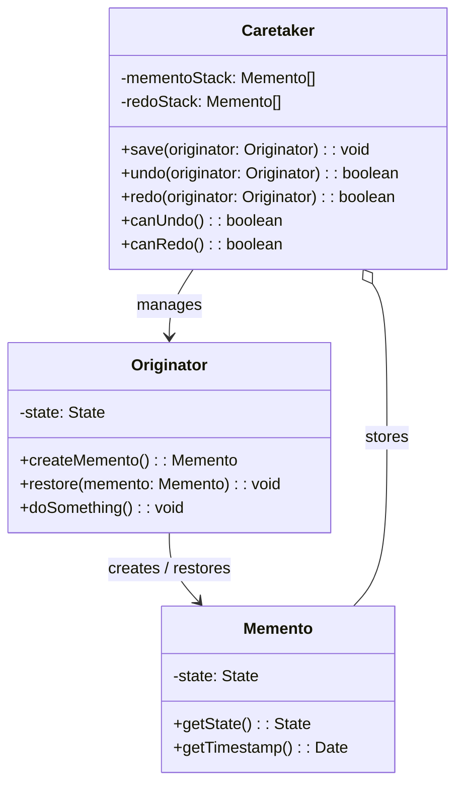
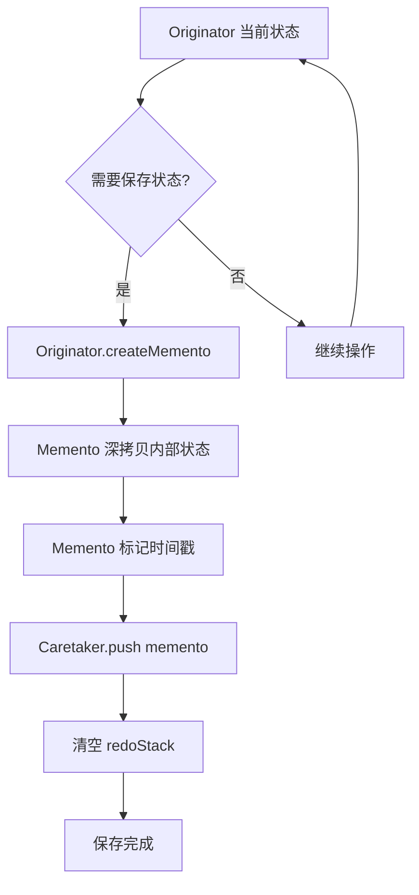
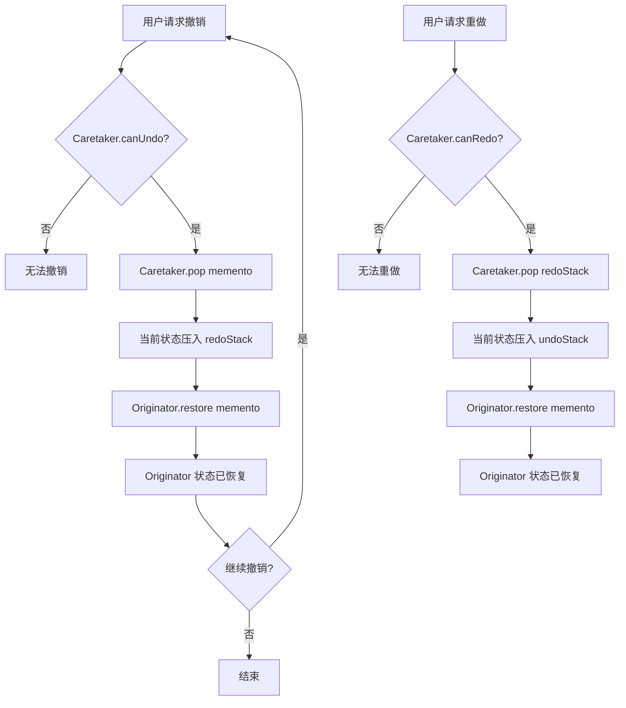
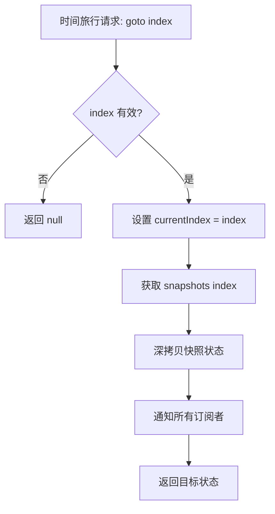

# 备忘录模式

> 在不破坏封装性的前提下，捕获一个对象的内部状态，并在该对象之外保存这个状态，这样以后就可将该对象恢复到原先保存的状态。-- GoF

## 1. 定义与意图

### 模式定义

备忘录模式（Memento Pattern）是一种行为型设计模式，它允许在不暴露对象实现细节的情况下保存和恢复对象的内部状态。备忘录将对象的状态快照封装在一个独立对象中，只有原发器才能访问备忘录中的实际状态，外部对象只能传递备忘录而无法修改其内容。

### 设计意图

| 意图 | 说明 |
|------|------|
| **封装保护** | 不破坏对象的封装性，外部无法直接访问内部状态 |
| **状态快照** | 捕获对象在某一时刻的完整内部状态 |
| **安全恢复** | 通过受控的方式将对象恢复到之前的状态 |
| **历史管理** | 支持多级撤销/重做、存档/读档等操作 |

### 适用场景

```
+-------------------------------------------------------------+
|                   如何判断是否使用备忘录模式？                |
+-------------------------------------------------------------+
|                                                             |
|  需要保存和恢复对象状态？                                    |
|       |                                                     |
|       +-- 否 --> 不需要备忘录模式                           |
|       |                                                     |
|       +-- 是 --> 需要不破坏封装地保存状态？                  |
|                 |                                           |
|                 +-- 否 --> 考虑直接克隆或序列化             |
|                 |                                           |
|                 +-- 是 --> 需要多级撤销/存档？              |
|                           |                                 |
|                           +-- 否 --> 简单快照即可           |
|                           |                                 |
|                           +-- 是 --> 适合备忘录模式         |
|                                                             |
+-------------------------------------------------------------+
```

| 适用场景 | 说明 | 示例 |
|----------|------|------|
| **游戏存档** | 保存游戏进度，支持读档 | HP/MP/位置/装备 |
| **事务回滚** | 事务失败时恢复到一致状态 | 数据库操作、支付流程 |
| **草稿保存** | 定时保存编辑中的内容 | 表单草稿、文档自动保存 |
| **撤销/重做** | 多级撤销与重做操作 | 文本编辑器、图形编辑器 |
| **状态快照** | 时间旅行调试 | Redux DevTools、状态机调试 |
| **检查点** | 长流程中设置恢复点 | 安装向导、配置向导 |

---

## 2. UML类图



### 模式结构

```
+-------------------------------------------------------------+
|                     备忘录模式结构                           |
+-------------------------------------------------------------+
|                                                             |
|   +------------------+       +------------------------+      |
|   |   Originator     |       |      Memento           |      |
|   |   原发器         |       |      备忘录             |      |
|   +------------------+       +------------------------+      |
|   | -state: State    |<----->| -state: State          |      |
|   +------------------+  创建 +------------------------+      |
|   | +createMemento() |  恢复 | +getState(): State     |      |
|   | +restore()       |       | +getTimestamp(): Date  |      |
|   +------------------+       +------------------------+      |
|          ^                           ^                      |
|          | 管理                      | 存储                  |
|          |                           |                      |
|   +------------------+               |                      |
|   |   Caretaker      |---------------+                      |
|   |   负责人         |                                      |
|   +------------------+                                      |
|   | -mementoStack[]  |                                      |
|   | -redoStack[]     |                                      |
|   +------------------+                                      |
|   | +save()          |                                      |
|   | +undo()          |                                      |
|   | +redo()          |                                      |
|   +------------------+                                      |
|                                                             |
+-------------------------------------------------------------+
```

---

## 3. 核心角色与职责

| 角色 | 职责 | 说明 |
|------|------|------|
| **Memento（备忘录）** | 存储 Originator 的内部状态 | 备忘录是不可变的，一旦创建状态不可修改 |
| **Originator（原发器）** | 创建/恢复备忘录 | 拥有需要被保存的内部状态，能生成快照并从快照恢复 |
| **Caretaker（负责人）** | 保存/管理备忘录 | 负责备忘录的存储、检索和生命周期管理，但不修改备忘录内容 |

### 角色协作流程

```
+-------------------------------------------------------------+
|                   角色协作流程                               |
+-------------------------------------------------------------+
|                                                             |
|  1. 保存状态                                                |
|     Originator.createMemento() --> Memento                  |
|     Caretaker.save(memento)                                |
|                                                             |
|  2. 修改状态                                                |
|     Originator.doSomething() --> state 发生变化             |
|                                                             |
|  3. 撤销（恢复状态）                                        |
|     Caretaker.undo() --> Memento                            |
|     Originator.restore(memento) --> state 恢复              |
|                                                             |
|  4. 重做                                                    |
|     Caretaker.redo() --> Memento                            |
|     Originator.restore(memento) --> state 恢复              |
|                                                             |
+-------------------------------------------------------------+
```

---

## 4. 应用场景

### 4.1 通用场景

#### 游戏存档系统

#### 事务回滚

#### 草稿自动保存

### 4.2 前端框架实战

#### Redux DevTools：时间旅行调试

#### 表单草稿自动保存（React）

#### React State 历史：useReducer + 状态快照实现 undo/redo

---

## 5. Mermaid流程图

### 备忘录保存流程



### 备忘录恢复流程



### 时间旅行流程



---

## 6. 优缺点分析

### 优点

| 优点 | 详细说明 |
|------|----------|
| **不破坏封装** | 备忘录将状态封装在内部，外部无法直接访问或修改 |
| **简化状态恢复** | Originator 只需调用 restore 即可恢复，无需了解状态细节 |
| **符合 SRP** | 状态存储（Memento）、状态管理（Caretaker）、业务逻辑（Originator）各司其职 |
| **支持多级撤销** | Caretaker 维护栈结构，天然支持多级撤销/重做 |
| **时间旅行** | 保存完整历史，支持跳转到任意时间点 |
| **安全可靠** | 备忘录不可变，防止状态被意外修改 |

### 缺点

| 缺点 | 详细说明 |
|------|----------|
| **内存消耗大** | 每次保存完整状态快照，频繁操作时内存占用显著 |
| **备忘录管理复杂** | Caretaker 需要管理多个备忘录的生命周期和索引 |
| **频繁保存影响性能** | 深拷贝操作在大状态对象上开销较大 |
| **可能导致状态泄漏** | 如果备忘录持有对可变对象的引用而非深拷贝 |
| **不适合增量变更** | 保存完整状态而非增量，对大型状态效率低 |

### 适用场景判断

```
+-------------------------------------------------------------+
|                     适用场景判断                             |
+-------------------------------------------------------------+
|                                                             |
|  适合使用备忘录模式：                                       |
|  - 需要不破坏封装地保存和恢复对象内部状态                   |
|  - 需要多级撤销/重做功能                                   |
|  - 需要时间旅行调试能力                                    |
|  - 状态对象较小或保存频率可控                              |
|  - 需要存档/读档机制（游戏、表单草稿）                     |
|                                                             |
|  不适合使用备忘录模式：                                     |
|  - 状态对象非常大且保存频繁（考虑增量快照）                |
|  - 只需要单级撤销（直接保存前一个状态即可）                |
|  - 状态恢复逻辑简单（无需封装）                            |
|  - 内存受限的环境                                          |
|                                                             |
+-------------------------------------------------------------+
```

---

## 7. 相关模式对比

### 备忘录模式 vs 命令模式

| 对比维度 | 备忘录模式 | 命令模式 |
|----------|-----------|----------|
| **关注点** | 状态保存与恢复 | 操作封装与执行 |
| **撤销方式** | 恢复到之前的状态快照 | 反向执行操作（undo） |
| **内存占用** | 大（保存完整状态） | 小（仅保存操作信息） |
| **封装性** | 不暴露内部状态 | 需要知道如何反向执行 |
| **适用场景** | 状态快照、存档系统 | 操作队列、事务回滚 |
| **组合使用** | 可与命令模式配合 | 备忘录作为命令的撤销依据 |

### 备忘录模式 vs 原型模式

| 对比维度 | 备忘录模式 | 原型模式 |
|----------|-----------|----------|
| **目的** | 保存状态以供恢复 | 通过克隆创建新对象 |
| **结果** | 生成状态快照 | 生成对象副本 |
| **使用方式** | 恢复到历史状态 | 作为新对象使用 |
| **关系** | 可用原型模式实现备忘录的深拷贝 | -- |

### 备忘录模式 vs 状态模式

| 对比维度 | 备忘录模式 | 状态模式 |
|----------|-----------|----------|
| **目的** | 保存和恢复状态 | 根据状态改变行为 |
| **状态含义** | 对象的属性值 | 对象的行为模式 |
| **关注点** | 时间维度（历史） | 空间维度（当前） |
| **可组合** | 保存状态模式的状态快照 | -- |

### 模式关系图

```
+-------------------------------------------------------------+
|                     行为型模式关系图                         |
+-------------------------------------------------------------+
|                                                             |
|  +--------------+         +--------------+                   |
|  |  备忘录模式  |<------->|  命令模式    |                   |
|  |  状态快照    |  互补   |  操作封装    |                   |
|  +--------------+         +--------------+                   |
|         |                        |                           |
|         | 可用深拷贝              | 可用备忘录               |
|         v                        v                           |
|  +--------------+         +--------------+                   |
|  |  原型模式    |         |  状态模式    |                   |
|  |  对象克隆    |         |  状态行为    |                   |
|  +--------------+         +--------------+                   |
|                                                             |
+-------------------------------------------------------------+
```

---

## 8. 最佳实践

### 1. 确保备忘录的不可变性

### 2. 限制历史记录大小

### 3. 增量快照优化

### 4. 使用 structuredClone 替代 JSON 深拷贝

### 5. 持久化备忘录

---

## 9. 常见陷阱

### 陷阱一：浅拷贝导致状态共享

### 陷阱二：备忘录可变导致状态被篡改

### 陷阱三：无限增长的历史栈

### 陷阱四：JSON 序列化丢失特殊类型

---

## 10. 总结

### 核心要点

| 要点 | 说明 |
|------|------|
| **封装保护** | 备忘录的核心价值在于不破坏封装地保存状态 |
| **不可变性** | 备忘录一旦创建，其内部状态不应被修改 |
| **深拷贝** | 必须使用深拷贝确保备忘录与原对象独立 |
| **有界历史** | 始终限制历史记录大小，防止内存溢出 |
| **增量优化** | 大状态对象考虑增量快照以减少内存占用 |

### 模式选择指南

```
+-------------------------------------------------------------+
|                   备忘录模式选择指南                         |
+-------------------------------------------------------------+
|                                                             |
|  需求                           推荐方案                   |
|  ----                           --------                   |
|  简单撤销/重做                  SnapshotManager            |
|  时间旅行调试                   TimeTravelDebugger         |
|  游戏存档                       GameSaveSystem             |
|  表单草稿                       DraftAutoSave              |
|  事务回滚                       TransactionManager         |
|  命令式撤销                     CommandHistoryManager      |
|                                                             |
+-------------------------------------------------------------+
```

### 与其他模式的关系

| 模式 | 关系 |
|------|------|
| **命令模式** | 互补关系：命令保存操作，备忘录保存状态；常组合使用 |
| **原型模式** | 备忘录可用原型模式的克隆机制实现深拷贝 |
| **状态模式** | 备忘录可保存状态模式的状态快照 |
| **迭代器模式** | 历史记录可用迭代器遍历 |

### 参考资源

- [Memento Pattern - Refactoring Guru](https://refactoring.guru/design-patterns/memento)
- [Memento Pattern - Wikipedia](https://en.wikipedia.org/wiki/Memento_pattern)
- [Design Patterns: Elements of Reusable Object-Oriented Software](https://book.douban.com/subject/1052241/) -- GoF 原著

### 相关文档

| 文档 | 关系说明 |
|------|----------|
| [命令模式](15-命令模式.md) | 互补：命令封装操作，备忘录封装状态 |
| [状态模式](21-状态模式.md) | 备忘录可保存状态模式的状态快照 |
| [原型模式](06-原型模式.md) | 备忘录可用原型克隆实现深拷贝 |

---

> 备忘录模式的核心价值在于"不破坏封装地保存状态"。在前端开发中，它是实现撤销/重做、时间旅行调试、表单草稿自动保存、游戏存档等功能的基础模式。使用时务必确保备忘录的不可变性和深拷贝，并限制历史记录大小以防止内存溢出。对于大型状态对象，考虑增量快照或与命令模式组合使用以优化性能。

---

## TypeScript 实现

### 基础实现：游戏存档系统

```typescript
// ========== 玩家状态类型 ==========
interface PlayerState {
  hp: number;
  mp: number;
  level: number;
  exp: number;
  position: { x: number; y: number };
  inventory: string[];
}

// ========== 备忘录：游戏存档 ==========
class PlayerMemento {
  private readonly snapshot: PlayerState;
  public readonly timestamp: number;

  constructor(state: PlayerState) {
    // 深拷贝，防止外部修改
    this.snapshot = JSON.parse(JSON.stringify(state));
    this.timestamp = Date.now();
  }

  // 注：TS 没有 Java 包私有 / friend 机制，无法对 Caretaker 完全隐藏状态（窄接口），
  // 这里以返回只读副本模拟；Caretaker 只应持有并传递备忘录，不应读取其内容。
  getState(): PlayerState {
    return JSON.parse(JSON.stringify(this.snapshot));
  }
}

// ========== Originator：玩家 ==========
class Player {
  private state: PlayerState;

  constructor() {
    this.state = { hp: 100, mp: 50, level: 1, exp: 0, position: { x: 0, y: 0 }, inventory: ['铁剑'] };
  }

  gainExp(amount: number): void {
    this.state.exp += amount;
    if (this.state.exp >= 100) {
      this.state.level++;
      this.state.exp -= 100;
      this.state.hp += 50;
      this.state.mp += 25;
      this.state.inventory.push('皮甲');
    }
  }

  display(): string {
    const s = this.state;
    return `Lv.${s.level} HP:${s.hp} MP:${s.mp} Pos:(${s.position.x},${s.position.y}) Items:[${s.inventory.join(', ')}]`;
  }

  save(): PlayerMemento { return new PlayerMemento(this.state); }
  restore(memento: PlayerMemento): void { this.state = memento.getState(); }
}

// ========== Caretaker：存档管理器 ==========
class SaveManager {
  private undoStack: PlayerMemento[] = [];
  private redoStack: PlayerMemento[] = [];

  save(player: Player): void {
    this.undoStack.push(player.save());
    this.redoStack.length = 0;
  }
  undo(player: Player): void {
    const memento = this.undoStack.pop();
    if (memento) { this.redoStack.push(player.save()); player.restore(memento); }
  }
  redo(player: Player): void {
    const memento = this.redoStack.pop();
    if (memento) { this.undoStack.push(player.save()); player.restore(memento); }
  }
}

// ========== 使用 ==========
const player = new Player();
const saveManager = new SaveManager();

saveManager.save(player);       // 初始状态
player.gainExp(100);            // 升级到 Lv.2
console.log(player.display());  // Lv.2 HP:150 MP:75 ...

saveManager.undo(player);       // 撤销回到初始
console.log(player.display());
// Lv.1 HP:100 MP:50 Pos:(0,0) Items:[铁剑]

// 重做回到升级后
saveManager.redo(player);
console.log(player.display());
// Lv.2 HP:150 MP:75 Pos:(0,0) Items:[铁剑, 皮甲]
```

### 现代 TypeScript 实现：泛型快照管理器

```typescript
// ========== 泛型快照接口 ==========
interface Snapshot<T> {
  readonly state: T;
  readonly timestamp: number;
  readonly label: string;
  readonly index: number;
}

// ========== 不可变快照实现 ==========
class ImmutableSnapshot<T> implements Snapshot<T> {
  public readonly state: T;
  public readonly timestamp: number;

  constructor(state: T, label: string, index: number) {
    // 深拷贝，保证不可变性
    this.state = structuredClone(state);
    this.timestamp = Date.now();
    this.label = label;
    this.index = index;
  }
  public readonly label: string;
  public readonly index: number;
}

// ========== 快照管理器 ==========
class SnapshotManager<T> {
  private snapshots: Snapshot<T>[] = [];
  private currentIndex = -1;
  private cursor = 0;

  takeSnapshot(state: T, label: string): Snapshot<T> {
    const snapshot = new ImmutableSnapshot<T>(state, label, this.cursor++);
    // 丢弃当前游标之后的历史
    this.snapshots = this.snapshots.slice(0, this.currentIndex + 1);
    this.snapshots.push(snapshot);
    this.currentIndex = this.snapshots.length - 1;
    return snapshot;
  }

  undo(): Snapshot<T> | null {
    if (this.currentIndex <= 0) return null;
    this.currentIndex--;
    return this.snapshots[this.currentIndex];
  }

  redo(): Snapshot<T> | null {
    if (this.currentIndex >= this.snapshots.length - 1) return null;
    this.currentIndex++;
    return this.snapshots[this.currentIndex];
  }

  goto(index: number): Snapshot<T> | null {
    if (index < 0 || index >= this.snapshots.length) return null;
    this.currentIndex = index;
    return this.snapshots[index];
  }

  getHistory(): Snapshot<T>[] { return [...this.snapshots]; }
}

// ========== 使用：表单状态 ==========
interface FormState { username: string; email: string; age: number; preferences: Record<string, unknown>; }
const formManager = new SnapshotManager<FormState>();

formManager.takeSnapshot({ username: '', email: '', age: 0, preferences: {} }, '初始状态');
formManager.takeSnapshot({ username: 'alice', email: '', age: 0, preferences: {} }, '填写用户名');
formManager.takeSnapshot({ username: 'alice', email: 'a@b.com', age: 25, preferences: { theme: 'dark' } }, '完成表单');

console.log(formManager.undo()?.state);
// { username: 'alice', email: '', age: 0, preferences: {} }

// 时间旅行：跳转到初始状态
const initial = formManager.goto(0);
console.log(initial?.state);
// { username: '', email: '', age: 0, preferences: {} }
```

### 时间旅行调试器

```typescript
// ========== 状态变更记录 ==========
interface StateChange<T> {
  snapshot: Snapshot<T>;
  action: string;
  delta?: Partial<T>;
}

// ========== 时间旅行调试器 ==========
class TimeTravelDebugger<T> {
  private manager: SnapshotManager<T>;
  private actionLog: StateChange<T>[] = [];

  constructor(initialState: T) {
    this.manager = new SnapshotManager<T>();
    this.manager.takeSnapshot(initialState, '初始化');
  }

  // 记录一个 action 并创建快照
  dispatch(action: string, state: T, delta?: Partial<T>): void {
    const snapshot = this.manager.takeSnapshot(state, action);
    this.actionLog.push({ snapshot, action, delta });
  }

  stepBack(): T | null {
    const snapshot = this.manager.undo();
    return snapshot?.state ?? null;
  }

  stepForward(): T | null {
    const snapshot = this.manager.redo();
    return snapshot?.state ?? null;
  }

  travelTo(index: number): T | null {
    const snapshot = this.manager.goto(index);
    return snapshot?.state ?? null;
  }

  getActionLog(): StateChange<T>[] { return this.actionLog; }
}

// ========== 使用：TODO 状态调试 ==========
interface TodoState { todos: string[]; filter: 'all' | 'active' | 'completed'; }
const debugger_ = new TimeTravelDebugger<TodoState>({ todos: [], filter: 'all' });

debugger_.dispatch('ADD_TODO', { todos: ['Learn Memento'], filter: 'all' });
debugger_.dispatch('SET_FILTER', { todos: ['Learn Memento'], filter: 'completed' });

const prevState = debugger_.stepBack();
console.log(prevState?.filter); // 'all'

// 跳转到初始状态（index 0，todos 为空）
const earlyState = debugger_.travelTo(0);
console.log(earlyState?.todos.length); // 0
```

### 与命令模式配合的撤销/重做系统

```typescript
// ========== 命令接口 ==========
interface Command<T> {
  execute(state: T): T;
  undo(state: T): T;
  description: string;
}

// ========== 命令历史管理器 ==========
class CommandHistoryManager<T> {
  private undoStack: Array<{ command: Command<T>; memento: T }> = [];
  private redoStack: Array<{ command: Command<T>; memento: T }> = [];
  private currentState: T;

  constructor(initialState: T) {
    this.currentState = initialState;
  }

  execute(command: Command<T>): T {
    // 执行前保存当前状态作为备忘录
    const memento = structuredClone(this.currentState);
    this.currentState = command.execute(this.currentState);
    this.undoStack.push({ command, memento });
    this.redoStack.length = 0;
    return this.currentState;
  }

  undo(): T | null {
    const entry = this.undoStack.pop();
    if (!entry) return null;
    this.redoStack.push({ command: entry.command, memento: structuredClone(this.currentState) });
    this.currentState = entry.command.undo(this.currentState);
    return this.currentState;
  }

  redo(): T | null {
    const entry = this.redoStack.pop();
    if (!entry) return null;
    this.undoStack.push({ command: entry.command, memento: structuredClone(this.currentState) });
    this.currentState = entry.command.execute(this.currentState);
    return this.currentState;
  }

  getState(): T { return this.currentState; }
}

// ========== 使用：文本编辑器 ==========
interface EditorState { content: string; cursor: number; }
const editor = new CommandHistoryManager<EditorState>({ content: '', cursor: 0 });

const insertCommand: Command<EditorState> = {
  description: '插入文本',
  execute: (s) => ({ content: s.content + 'Hello', cursor: s.content.length + 5 }),
  undo: (s) => ({ content: s.content.slice(0, -5), cursor: Math.max(0, s.cursor - 5) }),
};

editor.execute(insertCommand);
console.log(editor.getState().content); // "Hello"

editor.undo();
console.log(editor.getState().content); // ""

editor.execute(insertCommand);
editor.undo();
console.log(editor.getState().content); // ""

editor.redo();
console.log(editor.getState().content); // "Hello"
```

---

```typescript
// 完整的游戏存档系统
interface GameState {
  player: { hp: number; mp: number; level: number; position: [number, number] };
  world: { currentMap: string; timeOfDay: number };
  inventory: Array<{ id: string; name: string; quantity: number }>;
  quests: Array<{ id: string; status: 'active' | 'completed' | 'failed' }>;
}

class GameSaveSystem {
  private saves: Map<string, Snapshot<GameState>> = new Map();
  private quickSave: Snapshot<GameState> | null = null;
  private autoSaveTimer: ReturnType<typeof setInterval> | null = null;

  // 保存到指定存档位
  save(slot: string, state: GameState): void {
    this.saves.set(slot, new ImmutableSnapshot(state, `手动存档-${slot}`, 0));
  }

  // 快速存档
  quickSaveSlot(state: GameState): void {
    this.quickSave = new ImmutableSnapshot(state, '快速存档', 0);
  }

  // 读取快速存档
  quickLoad(): GameState | null {
    return this.quickSave?.state ?? null;
  }

  // 自动存档
  enableAutoSave(state: GameState, intervalMs = 60000): void {
    this.autoSaveTimer = setInterval(() => {
      this.save('auto', state);
    }, intervalMs);
  }

  disableAutoSave(): void {
    if (this.autoSaveTimer) clearInterval(this.autoSaveTimer);
    this.autoSaveTimer = null;
  }

  // 列出所有存档
  listSaves(): Array<{ slot: string; label: string; timestamp: number }> {
    return Array.from(this.saves.entries()).map(([slot, snapshot]) => ({
      slot,
      label: snapshot.label,
      timestamp: snapshot.timestamp,
    }));
  }
}
```

```typescript
// 数据库事务与备忘录
interface TransactionState {
  data: Map<string, unknown>;
  version: number;
}

class TransactionManager {
  private state: TransactionState;
  private checkpoints: Snapshot<TransactionState>[] = [];

  constructor() {
    this.state = { data: new Map(), version: 0 };
  }

  // 设置检查点
  savepoint(): void {
    this.checkpoints.push(new ImmutableSnapshot(structuredClone(this.state), `checkpoint-${this.state.version}`, 0));
  }

  // 执行事务
  execute(fn: (state: TransactionState) => TransactionState): TransactionState | null {
    this.savepoint();
    try {
      this.state = fn(structuredClone(this.state));
      this.state.version++;
      return this.state;
    } catch {
      // 失败则回滚
      this.rollback();
      return null;
    }
  }

  // 回滚到最近检查点
  rollback(): void {
    const snapshot = this.checkpoints.pop();
    if (snapshot) this.state = structuredClone(snapshot.state);
  }
}
```

```typescript
// 表单草稿自动保存
interface DraftData {
  fields: Record<string, unknown>;
  lastModified: number;
}

class DraftAutoSave {
  private timer: ReturnType<typeof setInterval> | null = null;
  private mementoStack: DraftData[] = [];
  private readonly maxDrafts: number = 5;

  constructor(private storageKey: string) {
    this.loadFromStorage();
  }

  // 保存草稿（自动保存）
  saveDraft(data: Record<string, unknown>): void {
    // 深拷贝：若直接存引用，调用方后续修改会污染已保存的草稿
    const draft: DraftData = { fields: structuredClone(data), lastModified: Date.now() };
    this.mementoStack.push(draft);
    if (this.mementoStack.length > this.maxDrafts) {
      this.mementoStack.shift();
    }
    this.persist();
  }

  // 恢复最近草稿
  restoreDraft(): Record<string, unknown> | null {
    const draft = this.mementoStack[this.mementoStack.length - 1];
    return draft ? draft.fields : null;
  }

  // 启用定时自动保存
  enableAutoSave(getData: () => Record<string, unknown>, intervalMs = 30000): void {
    this.timer = setInterval(() => this.saveDraft(getData()), intervalMs);
  }

  disableAutoSave(): void {
    if (this.timer) clearInterval(this.timer);
    this.timer = null;
  }

  private persist(): void {
    try {
      localStorage.setItem(this.storageKey, JSON.stringify(this.mementoStack));
    } catch {
      this.mementoStack = [];
    }
  }

  private loadFromStorage(): void {
    try {
      const raw = localStorage.getItem(this.storageKey);
      if (raw) this.mementoStack = JSON.parse(raw);
    } catch {
      this.mementoStack = [];
    }
  }
}
```

```typescript
// 模拟 Redux DevTools 的时间旅行机制
// 每个 action 后的 state 就是一个 Memento

interface ReduxState {
  [key: string]: unknown;
}

interface ReduxAction {
  type: string;
  payload?: unknown;
}

// 支持时间旅行的 Redux Store
class ReduxStoreWithTimeTravel {
  private history: Array<{ action: ReduxAction; state: ReduxState }> = [];
  private currentIndex = -1;
  private listeners: Array<(state: ReduxState) => void> = [];

  constructor(private reducer: (state: ReduxState, action: ReduxAction) => ReduxState, initialState: ReduxState) {
    this.history.push({ action: { type: '@@INIT' }, state: initialState });
    this.currentIndex = 0;
  }

  dispatch(action: ReduxAction): void {
    const prevState = this.history[this.currentIndex].state;
    const nextState = this.reducer(prevState, action);
    // 截断未来，压入新快照
    this.history = this.history.slice(0, this.currentIndex + 1);
    this.history.push({ action, state: nextState });
    this.currentIndex++;
    this.notify();
  }

  // 时间旅行：跳到任意历史状态
  jumpTo(index: number): void {
    if (index < 0 || index >= this.history.length) return;
    this.currentIndex = index;
    this.notify();
  }

  undo(): void {
    if (this.currentIndex > 0) { this.currentIndex--; this.notify(); }
  }

  redo(): void {
    if (this.currentIndex < this.history.length - 1) { this.currentIndex++; this.notify(); }
  }

  getState(): ReduxState {
    return this.history[this.currentIndex].state;
  }

  getHistory(): Array<{ action: ReduxAction; state: ReduxState }> {
    return this.history.slice(0, this.currentIndex + 1);
  }

  subscribe(listener: (state: ReduxState) => void): () => void {
    this.listeners.push(listener);
    return () => {
      const index = this.listeners.indexOf(listener);
      if (index > -1) this.listeners.splice(index, 1);
    };
  }

  private notify(): void {
    this.listeners.forEach(fn => fn(this.getState()));
  }
}
```

```typescript
// React 中使用备忘录模式实现表单草稿
// 以下为逻辑层实现，可配合 React Hooks 使用

interface FormDraftManager<T> {
  save(state: T): void;
  restore(): T | null;
  canRestore(): boolean;
  clearDraft(): void;
}

function createFormDraftManager<T>(
  formId: string,
  options: { maxDrafts?: number } = {}
): FormDraftManager<T> {
  const storageKey = `draft:${formId}`;
  const maxDrafts = options.maxDrafts ?? 5;
  let drafts: T[] = [];

  // 从 localStorage 恢复
  try {
    const raw = localStorage.getItem(storageKey);
    if (raw) drafts = JSON.parse(raw);
  } catch {
    drafts = [];
  }

  return {
    save(state: T): void {
      drafts.push(structuredClone(state));
      if (drafts.length > maxDrafts) drafts.shift();
      localStorage.setItem(storageKey, JSON.stringify(drafts));
    },
    restore(): T | null {
      return drafts.length > 0 ? drafts[drafts.length - 1] : null;
    },
    canRestore(): boolean {
      return drafts.length > 0;
    },
    clearDraft(): void {
      drafts = [];
      localStorage.removeItem(storageKey);
    },
  };
}
```

```typescript
// React useUndoRedo Hook 的逻辑层实现
// 实际使用时需配合 React 的 useState/useReducer

interface UndoRedoState<T> {
  past: T[];
  present: T;
  future: T[];
}

interface UndoRedoActions<T> {
  push(state: T): void;
  undo(): T | null;
  redo(): T | null;
  reset(initialState: T): void;
}

// 撤销/重做历史实现（备忘录模式）
class UndoRedoHistory<T> implements UndoRedoActions<T> {
  private state: UndoRedoState<T>;
  private maxHistory: number;

  constructor(initialState: T, maxHistory = 50) {
    this.state = { past: [], present: initialState, future: [] };
    this.maxHistory = maxHistory;
  }

  push(state: T): void {
    this.state.past.push(this.state.present);
    if (this.state.past.length > this.maxHistory) this.state.past.shift();
    this.state.present = state;
    this.state.future = [];
  }

  undo(): T | null {
    if (this.state.past.length === 0) return null;
    const previous = this.state.past.pop()!;
    this.state.future.unshift(this.state.present);
    this.state.present = previous;
    return previous;
  }

  redo(): T | null {
    if (this.state.future.length === 0) return null;
    const next = this.state.future.shift()!;
    this.state.past.push(this.state.present);
    this.state.present = next;
    return next;
  }

  reset(initialState: T): void {
    this.state = { past: [], present: initialState, future: [] };
  }

  get present(): T { return this.state.present; }
}

// ========== 使用：编辑器光标 ==========
const history = new UndoRedoHistory<{ text: string; cursor: number }>({ text: '', cursor: 0 });
history.push({ text: 'H', cursor: 1 });
history.push({ text: 'He', cursor: 2 });
history.push({ text: 'Hel', cursor: 3 });

const prev = history.undo(); // { text: 'He', cursor: 2 }
const next = history.redo(); // { text: 'Hel', cursor: 3 }
```

```typescript
// 备忘录方式：保存完整状态
class MementoUndo<T> {
  private stack: T[] = [];
  save(state: T): void { this.stack.push(JSON.parse(JSON.stringify(state))); }
  undo(): T | null { return this.stack.pop() ?? null; }
}

// 命令方式：保存操作和反向操作
class CommandUndo {
  private stack: Array<{ undo: () => void }> = [];
  execute(fn: () => void, undo: () => void): void { fn(); this.stack.push({ undo }); }
  undo(): void { this.stack.pop()?.undo(); }
}
```

```typescript
// 深冻结对象
function deepFreeze<T>(obj: T): T {
  const propNames = Object.getOwnPropertyNames(obj);
  for (const name of propNames) {
    const value = (obj as Record<string, unknown>)[name];
    if (value && typeof value === 'object') {
      deepFreeze(value);
    }
  }
  return Object.freeze(obj);
}

class SafeMemento<T> {
  private readonly frozenState: T;

  constructor(state: T) {
    this.frozenState = deepFreeze(JSON.parse(JSON.stringify(state)));
  }

  getState(): T {
    return JSON.parse(JSON.stringify(this.frozenState));
  }
}
```

```typescript
class BoundedHistory<T> {
  private stack: T[] = [];
  private readonly maxSize: number;

  constructor(maxSize: number = 50) {
    this.maxSize = maxSize;
  }

  push(item: T): void {
    this.stack.push(item);
    if (this.stack.length > this.maxSize) {
      this.stack.shift();
    }
  }

  pop(): T | undefined {
    return this.stack.pop();
  }

  get size(): number {
    return this.stack.length;
  }
}
```

```typescript
// 仅保存变化的部分，而非完整状态
interface DeltaSnapshot<T> {
  baseIndex: number;
  delta: Partial<T>;
  timestamp: number;
}

class IncrementalSnapshotManager<T> {
  private baseSnapshots: T[] = [];
  private deltas: DeltaSnapshot<T>[] = [];
  private baseInterval: number = 10; // 每 10 次保存一次完整快照
  private counter: number = 0;

  save(state: T): void {
    this.counter++;
    if (this.counter % this.baseInterval === 0 || this.baseSnapshots.length === 0) {
      // 保存完整快照
      this.baseSnapshots.push(structuredClone(state));
      this.counter = 0;
    } else {
      // 保存增量
      const baseIndex = this.baseSnapshots.length - 1;
      const delta = this.computeDelta(this.baseSnapshots[baseIndex], state);
      this.deltas.push({ baseIndex, delta, timestamp: Date.now() });
    }
  }

  // 计算两个状态的差异
  private computeDelta(prev: T, next: T): Partial<T> {
    const delta: Record<string, unknown> = {};
    for (const key of Object.keys(next as object)) {
      const prevVal = (prev as Record<string, unknown>)[key];
      const nextVal = (next as Record<string, unknown>)[key];
      if (prevVal !== nextVal) {
        delta[key] = nextVal;
      }
    }
    return delta as Partial<T>;
  }
}
```

```typescript
// 现代浏览器支持 structuredClone，性能更好且支持更多类型
class ModernMemento<T> {
  private readonly state: T;

  constructor(state: T) {
    // structuredClone 支持循环引用、Date、RegExp、Map、Set 等
    this.state = typeof structuredClone !== 'undefined'
      ? structuredClone(state)
      : JSON.parse(JSON.stringify(state));
  }

  getState(): T {
    return typeof structuredClone !== 'undefined'
      ? structuredClone(this.state)
      : JSON.parse(JSON.stringify(this.state));
  }
}
```

```typescript
interface StorageAdapter {
  getItem(key: string): string | null;
  setItem(key: string, value: string): void;
  removeItem(key: string): void;
}

class PersistentMementoManager<T> {
  private storage: StorageAdapter;
  private key: string;

  constructor(storage: StorageAdapter, key: string) {
    this.storage = storage;
    this.key = key;
  }

  save(state: T): void {
    this.storage.setItem(this.key, JSON.stringify(state));
  }

  load(): T | null {
    const raw = this.storage.getItem(this.key);
    if (!raw) return null;
    try {
      return JSON.parse(raw) as T;
    } catch {
      return null;
    }
  }

  clear(): void {
    this.storage.removeItem(this.key);
  }
}

// ==================== 使用 ====================
// sessionStorage 适配器
const sessionStorageAdapter: StorageAdapter = {
  getItem: (key) => sessionStorage.getItem(key),
  setItem: (key, value) => sessionStorage.setItem(key, value),
  removeItem: (key) => sessionStorage.removeItem(key),
};
```

```typescript
// 错误：浅拷贝导致备忘录和原对象共享引用
class BadMemento<T> {
  constructor(private state: T) {} // 浅拷贝，危险！

  getState(): T {
    return this.state; // 返回原始引用
  }
}

// 正确：深拷贝确保独立性
class GoodMemento<T> {
  private readonly state: T;

  constructor(state: T) {
    this.state = JSON.parse(JSON.stringify(state));
  }

  getState(): T {
    return JSON.parse(JSON.stringify(this.state));
  }
}
```

```typescript
// 错误：备忘录状态可被外部修改
class MutableMemento {
  public state: { hp: number }; // public 且可变
}

const m = new MutableMemento();
m.state = { hp: 100 };
// 外部可以直接修改
m.state.hp = 0; // 状态被篡改！

// 正确：状态私有且返回副本
class ImmutableMemento {
  #state: object;

  constructor(state: object) {
    this.#state = JSON.parse(JSON.stringify(state));
  }

  getState(): object {
    return JSON.parse(JSON.stringify(this.#state));
  }
}
```

```typescript
// 错误：无限制地保存备忘录
class UnboundedCaretaker<T> {
  private stack: T[] = [];
  save(state: T): void {
    this.stack.push(state); // 可能导致内存溢出
  }
}

// 正确：限制历史记录大小
class BoundedCaretaker<T> {
  private stack: T[] = [];
  private readonly maxSize: number;

  constructor(maxSize: number = 50) {
    this.maxSize = maxSize;
  }

  save(state: T): void {
    this.stack.push(state);
    while (this.stack.length > this.maxSize) {
      this.stack.shift();
    }
  }
}
```

```typescript
// JSON.stringify 会丢失 Date、Map、Set、RegExp 等类型
const state = {
  date: new Date(),       // 变成字符串
  map: new Map([['a', 1]]), // 变成 {}
  set: new Set([1, 2, 3]),  // 变成 {}
};

const serialized = JSON.parse(JSON.stringify(state));
console.log(serialized.date instanceof Date); // false
console.log(serialized.map instanceof Map);   // false

// 解决方案 1：使用 structuredClone（推荐）
const cloned = structuredClone(state);
console.log(cloned.date instanceof Date); // true
console.log(cloned.map instanceof Map);   // true

// 解决方案 2：自定义序列化/反序列化
interface SerializableState {
  date: string;
  data: Array<[string, unknown]>;
}

function serialize(state: { date: Date; data: Map<string, unknown> }): SerializableState {
  return {
    date: state.date.toISOString(),
    data: Array.from(state.data.entries()),
  };
}

function deserialize(serialized: SerializableState): { date: Date; data: Map<string, unknown> } {
  return {
    date: new Date(serialized.date),
    // 注意：不能用 Object.entries(serialized.data)——那会把成对的数组再变成
    // { "0": ["a", 1], ... }，重建出的 Map 键是 "0"/"1" 而非原始键
    data: new Map(serialized.data),
  };
}
```

---

## Java 实现

### 备忘录模式（状态快照与恢复）

```java
import java.util.ArrayDeque;
import java.util.Deque;

// 备忘录：保存发起人的状态快照（不可变）
class EditorState {
    private final String content;
    private final int cursor;

    public EditorState(String content, int cursor) {
        this.content = content;
        this.cursor = cursor;
    }

    public String getContent() { return content; }
    public int getCursor() { return cursor; }
}

// 发起人：可创建备忘录、可从备忘录恢复
class Editor {
    private String content = "";
    private int cursor = 0;

    public void write(String text) {
        this.content += text;
        this.cursor = content.length();
    }

    public EditorState save() {
        return new EditorState(content, cursor);
    }

    public void restore(EditorState state) {
        this.content = state.getContent();
        this.cursor = state.getCursor();
    }

    @Override
    public String toString() {
        return "Editor{content='" + content + "', cursor=" + cursor + "}";
    }
}

// 负责人：管理备忘录历史，不修改备忘录内容
class History {
    private final Deque<EditorState> states = new ArrayDeque<>();

    public void push(EditorState state) {
        states.push(state);
    }

    public EditorState pop() {
        return states.isEmpty() ? null : states.pop();
    }
}

// 使用：支持撤销
public class Client {
    public static void main(String[] args) {
        Editor editor = new Editor();
        History history = new History();

        history.push(editor.save());   // 保存初始快照
        editor.write("Hello");
        history.push(editor.save());   // 保存快照

        editor.write(" World");

        System.out.println(editor);    // Hello World

        editor.restore(history.pop()); // 撤销一次，回到上一个快照 "Hello"
        System.out.println(editor);    // Hello
    }
}
```

> 备忘录模式在不破坏封装的前提下捕获并保存对象状态，用于撤销/重做。备忘录需保持不可变且与发起人解耦。Java 中 `Swing` 的 `UndoManager`、数据库事务回滚都体现此思想。

## Python 实现

### 备忘录模式

```python
from dataclasses import dataclass
from collections import deque

@dataclass(frozen=True)  # frozen 保证不可变
class EditorState:
    content: str
    cursor: int

class Editor:
    def __init__(self):
        self.content = ""
        self.cursor = 0

    def write(self, text: str):
        self.content += text
        self.cursor = len(self.content)

    def save(self) -> EditorState:
        return EditorState(self.content, self.cursor)

    def restore(self, state: EditorState):
        self.content = state.content
        self.cursor = state.cursor

    def __repr__(self):
        return f"Editor(content={self.content!r}, cursor={self.cursor})"

class History:
    def __init__(self):
        self._states = deque()

    def push(self, state: EditorState):
        self._states.append(state)

    def pop(self) -> EditorState | None:
        return self._states.pop() if self._states else None

editor = Editor()
history = History()

history.push(editor.save())   # 保存初始快照
editor.write("Hello")
history.push(editor.save())

editor.write(" World")
print(editor)          # Editor(content='Hello World', ...)

editor.restore(history.pop())   # 撤销一次，回到上一个快照 "Hello"
print(editor)          # Editor(content='Hello', ...)
```

> Python 用 `@dataclass(frozen=True)` 轻松创建不可变备忘录。备忘录模式常用于文本编辑器撤销、游戏存档、事务回滚。`copy.deepcopy` 也可用于生成复杂状态快照。

