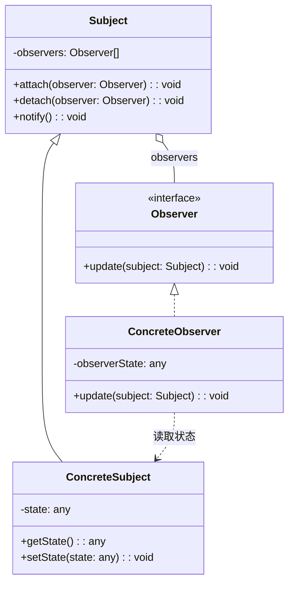
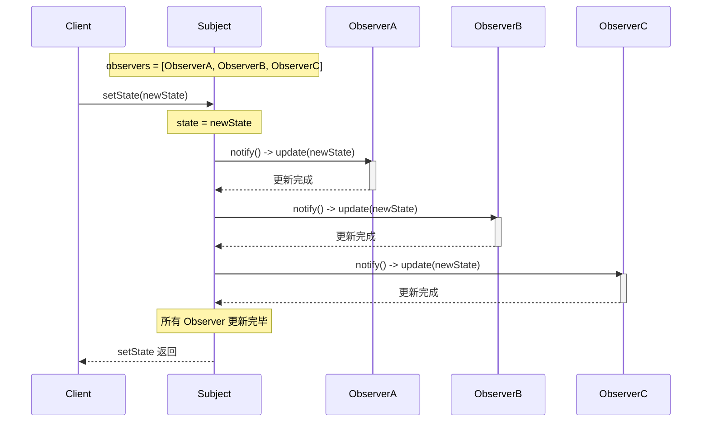
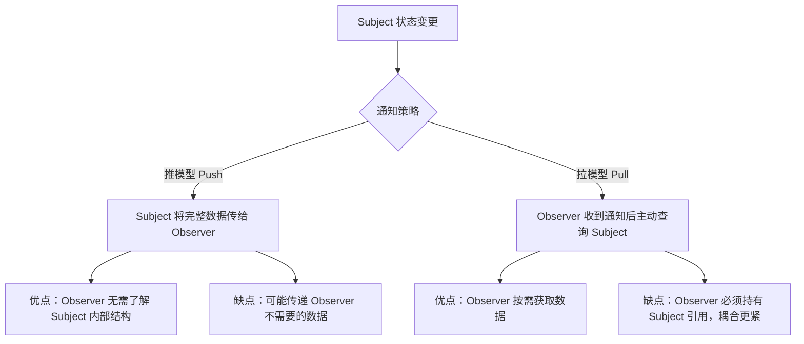

# 观察者模式

## 1. 定义与意图

> 定义对象间的一种一对多的依赖关系，当一个对象的状态发生改变时，所有依赖于它的对象都得到通知并被自动更新。——GoF

观察者模式（Observer Pattern）是行为型设计模式中应用最广泛的一种。其核心思想是：当被观察者（Subject）的状态发生变化时，自动通知所有已注册的观察者（Observer），使它们能够同步更新。

### 观察者与发布订阅的本质区别

这是前端社区中最容易被混淆的两个概念。两者的本质区别在于**是否存在第三方调度中心**：

- **观察者模式**：Subject 直接持有 Observer 的引用，状态变化时 Subject 直接调用 Observer 的更新方法。这是一个**同步、紧耦合**的过程——Subject 必须知道 Observer 的存在。
- **发布订阅模式**：发布者和订阅者互不相识，通过 Event Broker（事件调度中心）完全解耦。发布者只管 emit 事件，订阅者只管 on 监听，中间由 Broker 负责转发。这是一个**异步、松耦合**的过程。

```
观察者模式：  Subject ----直接调用----> Observer
发布订阅模式： Publisher --emit--> EventBroker --dispatch--> Subscriber
```

从设计哲学上看，观察者模式强调的是"状态驱动"——Subject 的状态变更必须立刻反映到 Observer；发布订阅模式强调的是"事件驱动"——消息的传递不需要发送方和接收方有直接依赖。

## 2. UML 类图



## 3. 核心角色与职责

| 角色 | 职责 |
|------|------|
| Subject | 维护观察者列表，提供 attach/detach 接口，状态变化时调用 notify 通知所有观察者 |
| Observer | 定义统一的更新接口 update，是所有观察者的抽象基类或接口 |
| ConcreteSubject | 存储具体业务状态，状态变更时触发 Subject.notify |
| ConcreteObserver | 维护对 Subject 的引用，实现 update 方法以响应通知并更新自身状态 |

Subject 是通知的发起者，Observer 是通知的接收者。ConcreteSubject 持有真正需要被观察的状态数据，ConcreteObserver 则在收到通知后从 ConcreteSubject 拉取最新状态或由 Subject 推送增量数据。这种"推模型"与"拉模型"的选择是观察者模式实现中的一个重要决策点。

## 4. 应用场景

### 4.1 通用场景

#### 事件处理

浏览器原生 DOM 事件就是观察者模式的典型应用：`addEventListener` 注册观察者，事件触发时浏览器通知所有监听器。

#### 消息通知

跨模块通信、状态同步等场景下，观察者模式让消息的生产者和消费者解耦：

#### 数据绑定

MVVM 架构的核心就是观察者模式：Model 变更通知 View 更新：

### 4.2 前端框架实战

#### Vue 响应式系统

Vue 的响应式系统是观察者模式在前端最经典的应用。从 Vue 2 到 Vue 3，核心架构完成了从 `Object.defineProperty` 到 `Proxy` 的演进：

#### React 状态订阅

React 没有显式的观察者 API，但 `useState` + `useEffect` 的组合本质上构成了观察者语义：

#### Node.js EventEmitter

Node.js 中几乎所有异步操作都基于 EventEmitter，它是服务端观察者模式的基石：

#### RxJS

RxJS 将观察者模式从"单次通知"提升为"可终止的数据流"，是前端异步编程的利器：

### 4.3 发布订阅 vs 观察者对比

| 对比维度 | 观察者模式 | 发布订阅模式 |
|----------|-----------|-------------|
| 耦合度 | 紧耦合：Subject 持有 Observer 引用 | 松耦合：发布者和订阅者互不相识 |
| 通信方式 | Subject 直接调用 Observer.update() | 通过 Event Broker 中转 |
| 同步/异步 | 通常同步（也可异步） | 通常异步（事件循环下一帧） |
| 事件过滤 | 无过滤，所有 Observer 收到相同通知 | 可按事件名、条件过滤 |
| 典型实现 | Vue Dep/Watcher、RxJS Subject | EventEmitter、EventBus、Message Queue |
| 取消订阅 | Subject.detach(observer) | EventEmitter.off(event, callback) |
| 数据流向 | Subject -> Observer（单向） | Publisher -> Broker -> Subscriber（单向） |
| 内存管理 | Subject 持有引用，需显式 detach | Broker 持有引用，需显式 off 或弱引用 |
| 适用场景 | 一对多状态同步 | 多对多事件通信 |
| 设计层次 | GoF 设计模式 | 架构模式（观察者模式的变体） |

## 5. Mermaid 流程图



推模型 vs 拉模型的通知策略：



## 6. 优缺点分析

| 优点 | 缺点 |
|------|------|
| 解耦 Subject 和 Observer，二者可独立变化 | 更新顺序不可控，Subject 遍历 Observer 的顺序决定通知顺序 |
| 符合开闭原则（OCP），新增 Observer 无需修改 Subject | 级联更新难以追踪：A 通知 B，B 更新后又通知 C，形成链式反应 |
| 广播通信，一次通知多个对象 | 内存泄漏风险：忘记 detach/off 导致 Observer 无法被 GC |
| 支持运行时动态增减 Observer | 性能问题：大量 Observer 时 notify 可能成为瓶颈 |
| 符合真实世界中"一对多"的依赖关系 | 调试困难：无法直观看出哪些 Observer 响应了某个通知 |

### 常见陷阱与应对

## 7. 相关模式对比

| 对比维度 | 观察者模式 | 中介者模式 |
|----------|-----------|-----------|
| 交互方式 | Subject 直接通知 Observer | 同事对象通过 Mediator 间接通信 |
| 耦合度 | Observer 依赖 Subject 接口 | 同事对象仅依赖 Mediator 接口 |
| 通信方向 | 单向（Subject -> Observer） | 双向（同事 <-> Mediator <-> 同事） |
| 典型场景 | 事件通知、状态同步 | 组件间复杂交互协调 |
| 对象关系 | 一对多 | 多对多（通过 Mediator） |
| 关注点 | 谁需要知道状态变化 | 谁应该响应并如何协调 |

| 对比维度 | 观察者模式 | 迭代器模式 |
|----------|-----------|-----------|
| 关注点 | 状态变化的通知 | 集合元素的遍历 |
| 数据流向 | 推/拉模型 | 拉模型 |
| 触发时机 | 状态变更时主动推送 | 调用方主动拉取 |
| 组合应用 | RxJS Observable = 观察者 + 迭代器 | — |

| 对比维度 | 观察者模式 | 策略模式 |
|----------|-----------|---------|
| 意图 | 一对多依赖通知 | 算法族封装与替换 |
| 触发方式 | 状态变更自动触发 | 客户端主动选择策略 |
| 对象关系 | Subject 维护 Observer 列表 | Context 持有单个 Strategy |
| 运行时行为 | 动态增减 Observer | 动态替换 Strategy |

## 8. 总结

观察者模式是前端开发中无处不在的设计模式。从浏览器 DOM 事件到 Vue 响应式系统，从 Node.js EventEmitter 到 RxJS Observable，观察者模式贯穿了前端技术栈的每一层。

理解观察者模式的关键要点：

1. **核心机制**：Subject 维护 Observer 列表，状态变更时逐个调用 Observer.update()。这是同步、紧耦合的一对多通知。

2. **与发布订阅的区别**：观察者是 Subject 直接通知 Observer，发布订阅通过 Event Broker 解耦。前者是 GoF 设计模式，后者是架构模式。在实际项目中，二者的边界有时模糊——Vue 的 Dep/Watcher 是观察者，而 mitt/tiny-emitter 是发布订阅。

3. **现代演进**：RxJS 将观察者模式提升为响应式流编程，Signal 将其沉淀为声明式 UI 的响应式原语。这三种形态并非替代关系，而是适用于不同抽象层级：Signal 适合组件内细粒度响应式，RxJS 适合跨组件异步数据流编排，经典观察者适合简单的一对多通知。

4. **工程实践**：始终返回取消订阅函数、在组件销毁时清理订阅、在 notify 中使用快照遍历防止并发修改、为 Observer 的 update 添加 try-catch 防止一个 Observer 异常影响其他 Observer。

---

## TypeScript 实现

### 基础实现

#### 经典观察者模式

Subject 直接调用 Observer.update()，无需中间层：

```typescript
// 观察者接口
interface Observer<T> {
  update(data: T): void;
}

// 被观察者（Subject）
class Subject<T> {
  private observers: Observer<T>[] = [];

  attach(observer: Observer<T>): void {
    const index = this.observers.indexOf(observer);
    if (index === -1) {
      this.observers.push(observer);
    }
  }

  detach(observer: Observer<T>): void {
    const index = this.observers.indexOf(observer);
    if (index !== -1) this.observers.splice(index, 1);
  }

  notify(data: T): void {
    for (const observer of this.observers) {
      observer.update(data);
    }
  }
}

// ==================== 使用：天气预报站 ====================
interface WeatherData { temperature: number; humidity: number; pressure: number; }

class WeatherStation extends Subject<WeatherData> {
  setMeasurements(data: WeatherData): void {
    this.notify(data);
  }
}

const station = new WeatherStation();

const display: Observer<WeatherData> = {
  update(data) { console.log(`Temperature: ${data.temperature}C`); },
};
const pressureAlert: Observer<WeatherData> = {
  update(data) { if (data.pressure < 990) console.log(`Warning: Low pressure ${data.pressure} hPa`); },
};

station.attach(display);
station.attach(pressureAlert);

station.setMeasurements({ temperature: 25, humidity: 65, pressure: 980 });
// 输出: Temperature: 25C
// 输出: Warning: Low pressure 980 hPa
```

#### 发布订阅模式（EventEmitter）

通过事件名解耦，发布者不直接持有订阅者引用：

```typescript
type EventCallback = (...args: any[]) => void;

class EventEmitter {
  private events: Map<string, Set<EventCallback>> = new Map();

  on(event: string, callback: EventCallback): () => void {
    if (!this.events.has(event)) {
      this.events.set(event, new Set());
    }
    this.events.get(event)!.add(callback);

    // 返回取消订阅函数，避免忘记 off
    return () => this.off(event, callback);
  }

  off(event: string, callback: EventCallback): void {
    this.events.get(event)?.delete(callback);
  }

  emit(event: string, ...args: any[]): void {
    this.events.get(event)?.forEach((callback) => callback(...args));
  }

  // 只订阅一次
  once(event: string, callback: EventCallback): void {
    const wrapper: EventCallback = (...args) => {
      this.off(event, wrapper);
      callback(...args);
    };
    this.on(event, wrapper);
  }
}

// ==================== 使用 ====================
const emitter = new EventEmitter();
const unsubscribe = emitter.on('user:login', (userId) => {
  console.log(`User ${userId} logged in`);
});

emitter.emit('user:login', 'u_12345');
// 输出: User u_12345 logged in

unsubscribe(); // 取消订阅
```

### 现代 TypeScript 实现

#### 泛型事件系统

这是工业级前端项目的标配方案，通过泛型约束事件名和 payload 的类型映射：

```typescript
// 事件映射：事件名 -> payload 类型
interface EventMap {
  'user:login': { userId: string; timestamp: number };
  'user:logout': { userId: string };
  'cart:add': { productId: string; quantity: number };
  'cart:remove': { productId: string };
  'order:create': { orderId: string; total: number };
}

class TypedEventEmitter<T extends Record<string, any>> {
  private events: {
    [K in keyof T]?: Set<(data: T[K]) => void>;
  } = {};

  on<K extends keyof T>(event: K, handler: (data: T[K]) => void): () => void {
    if (!this.events[event]) this.events[event] = new Set();
    this.events[event]!.add(handler);
    return () => this.events[event]!.delete(handler);
  }

  emit<K extends keyof T>(event: K, data: T[K]): void {
    this.events[event]?.forEach((handler) => handler(data));
  }
}

// ==================== 使用 ====================
const bus = new TypedEventEmitter<EventMap>();
bus.on('user:login', (data) => console.log(`用户 ${data.userId} 登录于 ${data.timestamp}`));
bus.on('cart:add', (data) => console.log(`添加商品 ${data.productId} x${data.quantity}`));

bus.emit('user:login', { userId: 'u_001', timestamp: Date.now() });

// 以下代码均会在编译期报错：
// bus.emit('user:login', { userId: 123 });           // 类型错误
// bus.emit('unknown:event', {});                      // 事件名不存在
// bus.on('cart:add', (data) => data.nonexistent);     // 属性不存在
```

#### RxJS Observable：响应式编程的观察者模式升华

RxJS 将观察者模式从"单次通知"提升为"数据流"，是观察者模式 + 迭代器模式 + 函数式编程的融合：

```typescript
import { Observable, Subject, BehaviorSubject, ReplaySubject, Subscription, fromEvent, merge } from 'rxjs';
import { map, filter, debounceTime, switchMap, takeUntil, distinctUntilChanged } from 'rxjs/operators';

// 1. Observable 基础：创建自定义数据流
class StockPriceService {
  private priceSubject = new BehaviorSubject<{ symbol: string; price: number } | null>(null);

  // 作为 Observable 暴露，外部只能订阅不能 emit
  get price$(): Observable<{ symbol: string; price: number }> {
    return this.priceSubject.asObservable().pipe(
      filter((data): data is { symbol: string; price: number } => data !== null),
      distinctUntilChanged((prev, curr) => prev.price === curr.price)
    );
  }

  // 内部更新价格
  updatePrice(symbol: string, price: number): void {
    this.priceSubject.next({ symbol, price });
  }
}

// ==================== 使用 ====================
const stock = new StockPriceService();
stock.price$.subscribe(({ symbol, price }) => {
  console.log(`${symbol} 价格: ${price}`);
});

// 2. Subject vs BehaviorSubject vs ReplaySubject
const subject = new Subject<number>();
const behaviorSubject = new BehaviorSubject<number>(0);
const replaySubject = new ReplaySubject<number>(2);

// 订阅
subject.subscribe((v) => console.log(`Subject: ${v}`));
behaviorSubject.subscribe((v) => console.log(`Behavior: ${v}`)); // 订阅时立即收到当前值 0
replaySubject.subscribe((v) => console.log(`Replay: ${v}`));

// 发送
subject.next(1);          // Subject: 1
behaviorSubject.next(1);  // Behavior: 1
replaySubject.next(1);    // Replay: 1

// 再次发送
subject.next(3);          // Subject: 3
behaviorSubject.next(3);  // Behavior: 3
replaySubject.next(3);    // Replay: 3
```

#### Signal（Solid.js / Vue 3.4+）：现代响应式原语

Signal 是观察者模式在声明式 UI 框架中的最新演进，将"订阅-通知"机制下沉为语言级原语：

```typescript
// ============================================================
// 1. 最小 Signal 实现（理解原理）
// ============================================================
function createSignal<T>(initialValue: T): [() => T, (value: T) => void] {
  let value = initialValue;
  const subscribers = new Set<() => void>();

  const getter = (): T => {
    // 自动追踪依赖：如果当前有正在执行的 effect，将其加入订阅列表
    if (currentEffect) {
      subscribers.add(currentEffect);
    }
    return value;
  };

  const setter = (newValue: T): void => {
    if (Object.is(value, newValue)) return;
    value = newValue;
    // 通知所有订阅的 effect 重新执行
    subscribers.forEach((sub) => sub());
  };

  return [getter, setter];
}

// 当前正在执行的 effect
let currentEffect: (() => void) | null = null;

// 创建 effect：执行时自动收集依赖
function createEffect(fn: () => void): () => void {
  const effect = () => {
    currentEffect = effect;
    fn();
    currentEffect = null;
  };
  effect();
  return () => {};
}

// ==================== 使用：购物车 ====================
const [items, setItems] = createSignal<Array<{ id: string; price: number }>>([]);
const [discount, setDiscount] = createSignal<number>(1);

const totalPrice = () => items().reduce((sum, item) => sum + item.price, 0) * discount();

createEffect(() => {
  console.log('总价:', totalPrice());
});

setItems([{ id: 'a', price: 100 }, { id: 'b', price: 50 }]);
setDiscount(0.8);

// ==================== 响应式购物车 Hook ====================
function useCart() {
  const [items, setItems] = createSignal([] as Array<{ id: string; price: number }>);
  const [totalPrice, setTotalPrice] = createSignal(0);

  const stopEffect = createEffect(() => {
    setTotalPrice(items().reduce((s, i) => s + i.price, 0));
  });
  const stopWatch = () => {};

  const addItem = (item: { id: string; price: number }) => {
    setItems([...items(), item]);
  };
  const removeItem = (id: string) => {
    setItems(items().filter((i) => i.id !== id));
  };

  // 清理
  const cleanup = () => {
    stopEffect();
    stopWatch();
  };

  return { items, totalPrice, itemCount: () => items().length, addItem, removeItem };
}
```

```typescript
// DOM 事件的观察者语义
class Button {
  private clickHandlers: Set<() => void> = new Set();

  // attach 的变体
  onClick(handler: () => void): () => void {
    this.clickHandlers.add(handler);
    return () => this.clickHandlers.delete(handler); // 返回 detach 函数
  }

  // notify 的变体
  click(): void {
    for (const handler of this.clickHandlers) {
      handler();
    }
  }
}
```

```typescript
interface NotificationPayload {
  type: 'info' | 'warning' | 'error';
  message: string;
  timestamp: number;
}

class NotificationCenter {
  private static instance: NotificationCenter;
  private observers: Set<(payload: NotificationPayload) => void> = new Set();

  static getInstance(): NotificationCenter {
    if (!NotificationCenter.instance) {
      NotificationCenter.instance = new NotificationCenter();
    }
    return NotificationCenter.instance;
  }

  subscribe(observer: (payload: NotificationPayload) => void): () => void {
    this.observers.add(observer);
    return () => this.observers.delete(observer);
  }

  notify(payload: NotificationPayload): void {
    for (const observer of this.observers) {
      try {
        observer(payload);
      } catch (error) {
        console.error('Observer error:', error);
      }
    }
  }
}
```

```typescript
// 极简双向绑定
class Model<T extends object> {
  private observers: Set<(key: string, value: unknown) => void> = new Set();
  private data: T;

  constructor(initial: T) {
    this.data = new Proxy(initial, {
      set: (target, key: string, value) => {
        const old = Reflect.get(target, key);
        if (!Object.is(old, value)) {
          Reflect.set(target, key, value);
          this.notifyObservers(key, value);
        }
        return true;
      },
    });
  }

  subscribe(observer: (key: string, value: unknown) => void): () => void {
    this.observers.add(observer);
    return () => this.observers.delete(observer);
  }

  private notifyObservers(key: string, value: unknown): void {
    this.observers.forEach((observer) => observer(key, value));
  }

  getData(): T {
    return this.data;
  }
}
```

```typescript
// ============================================================
// Vue 2: Object.defineProperty + Dep/Watcher
// ============================================================
class Dep {
  static target: Watcher | null = null;
  private subscribers: Set<Watcher> = new Set();

  depend(): void {
    if (Dep.target) {
      this.subscribers.add(Dep.target);
    }
  }

  notify(): void {
    this.subscribers.forEach((watcher) => watcher.update());
  }
}

// Watcher：观察者
class Watcher {
  update(): void { console.log('Watcher 收到更新通知'); }
}

// Vue 2 的响应式：Object.defineProperty
function defineReactive(target: Record<string, any>, key: string, val: unknown): void {
  const dep = new Dep();
  Object.defineProperty(target, key, {
    get() {
      dep.depend();
      return val;
    },
    set(newVal) {
      if (newVal === val) return;
      val = newVal;
      dep.notify();
    },
  });
}

// 将对象所有属性转为响应式
function observeVue2<T extends object>(obj: T): T {
  Object.keys(obj).forEach((key) => defineReactive(obj, key, obj[key]));
  return obj;
}

const vue2State = observeVue2({ count: 0, name: 'Vue2' });
Dep.target = new Watcher();
console.log(vue2State.count); // 收集依赖
Dep.target = null;
vue2State.count = 1; // 触发 notify

// Vue 3 Proxy 的优势：
// 1. 可以检测属性的新增/删除
// 2. 可以检测数组索引和 length 修改
// 3. 惰性深层响应式：访问时才递归代理，而非初始化时
// 4. 基于 Map/WeakMap 的依赖收集，比每个属性一个 Dep 更高效
```

```typescript
import { useState, useEffect, useCallback, useRef } from 'react';

// 1. useState + useEffect 的观察者语义
//    useState 创建可观察状态，useEffect 在状态变化时执行副作用（类似于 Observer.update）
function useObservableState<T>(initialValue: T) {
  const [state, setState] = useState(initialValue);

  // useEffect 类似于 Observer 的订阅注册
  useEffect(() => {
    // 相当于 Observer.update 被调用
    console.log('State changed:', state);
  }, [state]); // 依赖数组指定观察目标

  return [state, setState] as const;
}

// 2. 全局 store（观察者模式）：createStore + useStore
interface Store<T> {
  getState(): T;
  setState(updater: (prev: T) => T): void;
  subscribe(listener: () => void): () => void;
}

function createStore<T>(initialState: T): Store<T> {
  let state = initialState;
  const listeners = new Set<() => void>();
  return {
    getState: () => state,
    setState(updater) {
      state = updater(state);
      listeners.forEach((listener) => listener());
    },
    subscribe(listener) {
      listeners.add(listener);
      return () => listeners.delete(listener);
    },
  };
}

// useStore Hook：订阅 store 变化
function useStore<T, K>(store: Store<T>, selector: (state: T) => K): K {
  const [selected, setSelected] = useState(selector(store.getState()));
  useEffect(() => {
    const unsubscribe = store.subscribe(() => {
      setSelected(selector(store.getState()));
    });
    return unsubscribe;
  }, [store, selector]);
  return selected;
}

const counterStore = createStore({ count: 0 });

function Counter(): void {
  const count = useStore(counterStore, (s) => s.count);
  // count 变化时组件自动重渲染，等效于 Observer.update
}
```

```typescript
import { EventEmitter } from 'events';

// 1. 自定义 EventEmitter 子类
class JobQueue extends EventEmitter {
  private queue: Array<{ id: string; payload: unknown }> = [];
  private processing = false;

  async enqueue(job: { id: string; payload: unknown }): Promise<void> {
    this.queue.push(job);
    this.emit('job:enqueued', job); // 通知：新任务入队

    if (!this.processing) {
      await this.processNext();
    }
  }

  private async processNext(): Promise<void> {
    this.processing = true;
    while (this.queue.length > 0) {
      const job = this.queue.shift()!;
      this.emit('job:started', job);
      try {
        await this.execute(job);
        this.emit('job:completed', job);
      } catch (error) {
        this.emit('job:failed', { job, error });
      }
    }
    this.processing = false;
  }

  private async execute(job: { id: string; payload: unknown }): Promise<void> {
    // 模拟异步执行
    await new Promise((r) => setTimeout(r, 10));
    console.log(`处理任务: ${job.id}`);
  }

  // 包装 emit：出错时把异常转发到 error 事件，避免队列崩溃
  private async safeEmit(event: string, ...args: unknown[]): Promise<void> {
    try {
      this.emit(event, ...args);
    } catch (error) {
      this.emit('error', error);
    }
  }
}

// ==================== 使用 ====================
const jobQueue = new JobQueue();
jobQueue.on('job:completed', (job) => console.log(`任务完成: ${(job as any).id}`));
jobQueue.on('error', (err) => console.error('队列错误:', err));
jobQueue.enqueue({ id: 'j1', payload: {} });
jobQueue.enqueue({ id: 'j2', payload: {} });
```

```typescript
import {
  Observable, Subject, BehaviorSubject, ReplaySubject,
  fromEvent, from, interval, merge, combineLatest,
  Subscription
} from 'rxjs';
import {
  map, filter, debounceTime, switchMap, takeUntil,
  distinctUntilChanged, tap, retry, catchError, take
} from 'rxjs/operators';

// 实时协作编辑器中的观察者模式
class CollaborationService {
  private documentChange$ = new Subject<{ id: string; content: string }>();
  private presence$ = new Subject<{ userId: string; cursor: { x: number; y: number } }>();
  private destroy$ = new Subject<void>();

  // 外部订阅文档变更
  onDocumentChange(): Observable<{ id: string; content: string }> {
    return this.documentChange$.asObservable().pipe(takeUntil(this.destroy$));
  }

  // 外部订阅在线状态
  onPresence(): Observable<{ userId: string; cursor: { x: number; y: number } }> {
    return this.presence$.asObservable().pipe(takeUntil(this.destroy$));
  }

  // 内部更新文档内容
  updateDocument(id: string, content: string): void {
    this.documentChange$.next({ id, content });
  }

  // 内部更新在线状态
  updatePresence(userId: string, cursor: { x: number; y: number }): void {
    this.presence$.next({ userId, cursor });
  }

  destroy(): void {
    this.destroy$.next();
    this.destroy$.complete();
    this.documentChange$.complete();
    this.presence$.complete();
  }
}
```

```typescript
// 陷阱 1：内存泄漏——忘记取消订阅
// （复用前文《经典观察者模式》中定义的 Subject<T> 与 Observer<T>）
class BadComponent {
  constructor(private subject: Subject<string>) {
    subject.attach(this); // 陷阱：组件销毁后未 detach，subject 仍持有引用
  }

  update(data: string): void {
    console.log('收到更新:', data);
  }
}

class GoodComponent {
  private unsubscribe: (() => void) | null = null;

  constructor(private subject: { on(callback: (data: string) => void): () => void }) {
    this.unsubscribe = subject.on(this.update.bind(this));
  }

  update(data: string): void {
    console.log('收到更新:', data);
  }

  // 组件销毁时取消订阅
  destroy(): void {
    this.unsubscribe?.();
    this.unsubscribe = null;
  }
}

// 陷阱 2：重复通知——版本号去重
class VersionedSubject<T> {
  private version = 0;
  private lastNotifiedVersion = new WeakMap<object, number>();
  private observers: Array<{ observer: Observer<T>; context: object }> = [];

  attach(observer: Observer<T>, context: object): void {
    this.observers.push({ observer, context });
  }

  // 状态真正变更时才递增版本号
  setState(data: T): void {
    this.version++;
    this.notify(data);
  }

  notify(data: T): void {
    for (const { observer, context } of this.observers) {
      // 同一版本只通知一次，同一状态变更引发的多次 notify 不会重复通知
      if (this.lastNotifiedVersion.get(context) !== this.version) {
        this.lastNotifiedVersion.set(context, this.version);
        observer.update(data);
      }
    }
  }
}
```

---

## Java 实现

### 观察者模式（一对多通知）

```java
import java.util.ArrayList;
import java.util.List;

// 观察者接口
interface Observer {
    void update(String event);
}

// 被观察者（Subject）：维护观察者列表并通知
class Subject {
    private final List<Observer> observers = new ArrayList<>();
    private String state;

    public void attach(Observer observer) {
        observers.add(observer);
    }

    public void detach(Observer observer) {
        observers.remove(observer);
    }

    public void setState(String state) {
        this.state = state;
        notifyObservers();  // 状态变化时通知所有观察者
    }

    private void notifyObservers() {
        for (Observer observer : observers) {
            observer.update(state);
        }
    }
}

// 具体观察者
class EmailObserver implements Observer {
    private final String name;

    public EmailObserver(String name) {
        this.name = name;
    }

    @Override
    public void update(String event) {
        System.out.println(name + " 收到邮件通知: " + event);
    }
}

// 使用
public class Client {
    public static void main(String[] args) {
        Subject subject = new Subject();
        subject.attach(new EmailObserver("用户A"));
        subject.attach(new EmailObserver("用户B"));

        subject.setState("商品降价!");  // 所有观察者被通知
    }
}
```

> 观察者模式定义对象间一对多依赖，状态变化时自动通知所有观察者，实现解耦。Java 内置 `Observer`/`Observable`（自 JDK 9 起标记为 @Deprecated，官方推荐改用 `PropertyChangeListener`）、Swing 事件监听、`java.util.EventListener` 都是其体现。

## Python 实现

### 观察者模式

```python
class Subject:
    def __init__(self):
        self._observers = []
        self._state = None

    def attach(self, observer):
        self._observers.append(observer)

    def detach(self, observer):
        self._observers.remove(observer)

    def set_state(self, state):
        self._state = state
        self._notify()

    def _notify(self):
        for observer in self._observers:
            observer.update(self._state)

class EmailObserver:
    def __init__(self, name: str):
        self.name = name

    def update(self, event):
        print(f"{self.name} 收到邮件通知: {event}")

subject = Subject()
subject.attach(EmailObserver("用户A"))
subject.attach(EmailObserver("用户B"))
subject.set_state("商品降价!")
```

### 观察者模式（回调/事件）

```python
from dataclasses import dataclass, field
from typing import Callable, List

@dataclass
class EventBus:
    handlers: List[Callable] = field(default_factory=list)

    def subscribe(self, handler: Callable):
        self.handlers.append(handler)

    def publish(self, event: str):
        for handler in self.handlers:
            handler(event)

bus = EventBus()
bus.subscribe(lambda e: print(f"日志: {e}"))
bus.subscribe(lambda e: print(f"统计: {e}"))
bus.publish("点击事件")
```

> Python 中观察者模式非常常用：事件系统、信号/槽、回调、`asyncio` 事件循环、`logging` 的 Handler、`signal` 模块都体现观察者思想。Python 的函数是一等公民，观察者可直接用回调函数实现。

