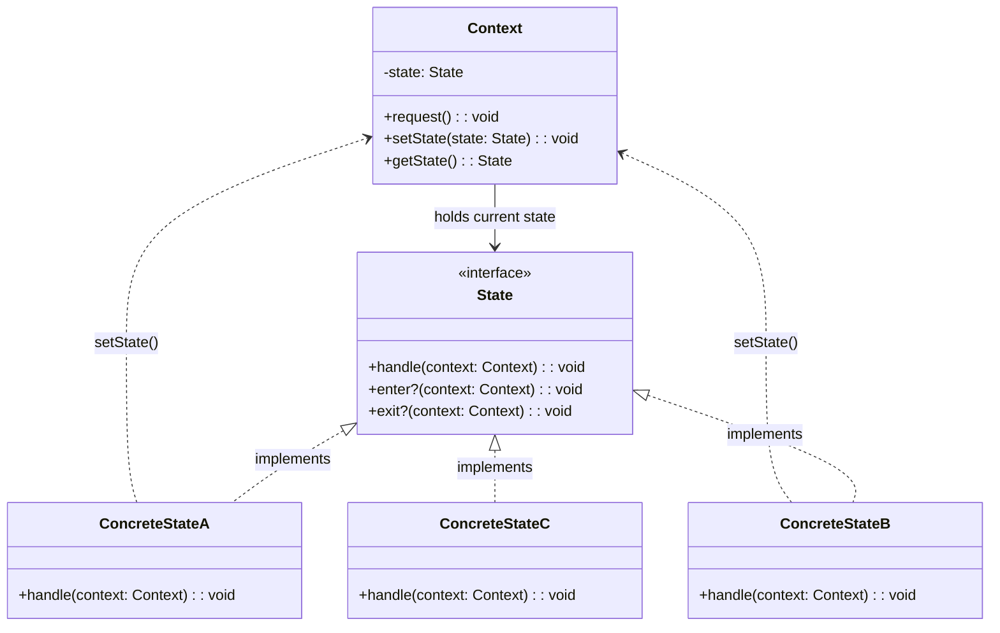
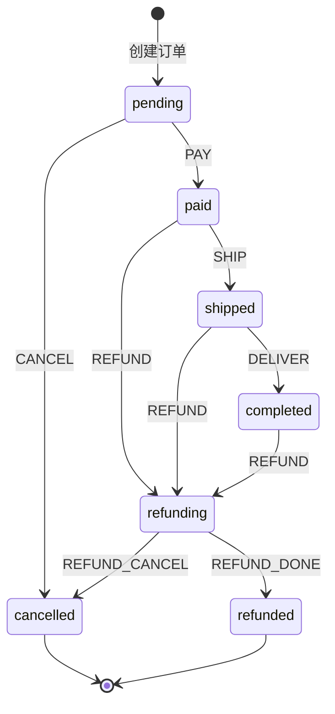
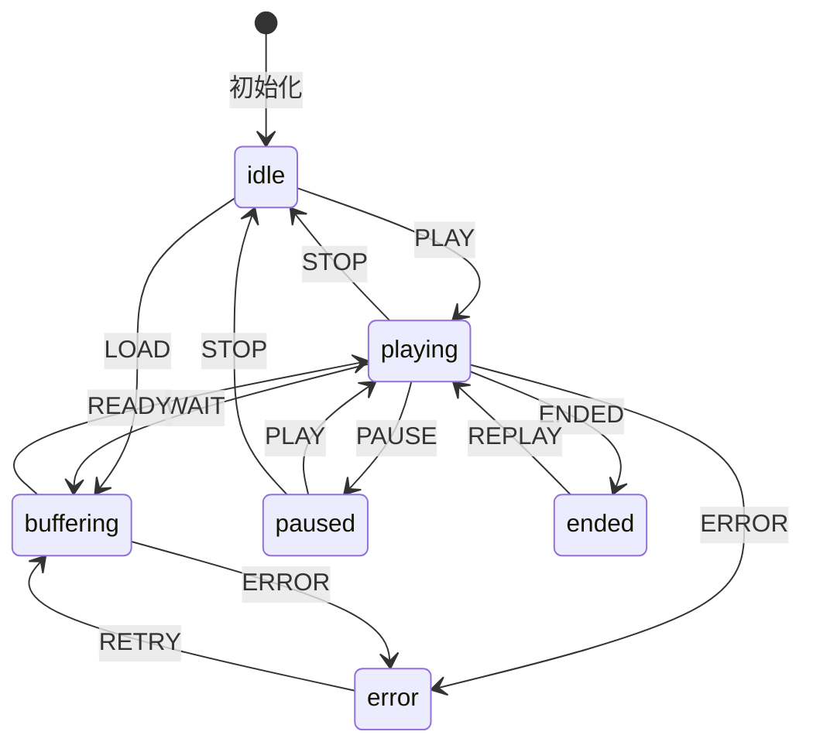
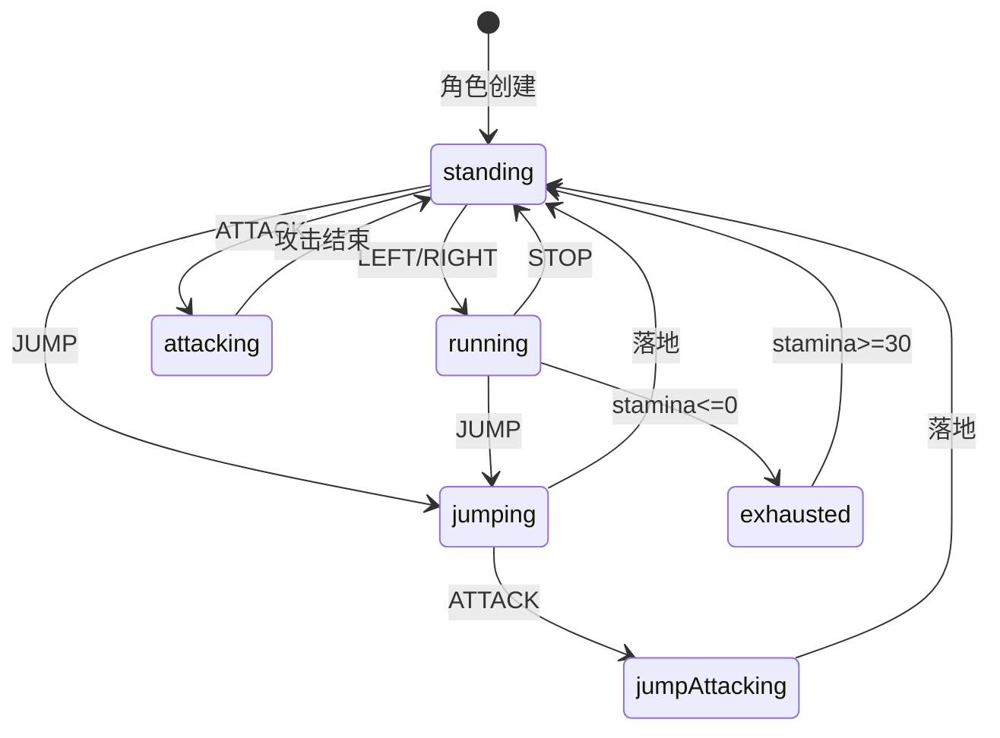

# 状态模式

## 1. 定义与意图

> 允许一个对象在其内部状态改变时改变它的行为，对象看起来似乎修改了它的类。 -- GoF

状态模式（State Pattern）是一种行为型设计模式，其核心思想是将对象的状态逻辑分散到独立的类中，每个状态类封装与该状态相关的行为。当对象的内部状态发生改变时，其行为也随之改变，从外部看来仿佛对象所属的类发生了变化。

### 核心动机

- 消除大量与状态相关的条件判断语句（if-else / switch-case）
- 将状态转换逻辑显式化，使状态流转规则一目了然
- 符合开闭原则（OCP）：新增状态无需修改已有状态类或上下文
- 符合单一职责原则（SRP）：每个状态类只负责该状态下的行为

---

## 2. UML 类图



---

## 3. 核心角色与职责

| 角色 | 职责 |
|------|------|
| Context（上下文） | 维护当前状态对象的引用，将客户端请求委托给当前状态对象处理；提供 setState 方法供状态对象触发状态转换 |
| State（状态接口） | 定义所有状态共有的行为接口，通常包含 handle 方法以及可选的 enter / exit 生命周期钩子 |
| ConcreteState（具体状态） | 实现特定状态下的行为逻辑；在处理请求时可调用 Context.setState 触发状态转换 |

### 状态生命周期

每个状态可定义两个可选钩子：

- `enter(context)` -- 进入该状态时执行，用于初始化资源、发送通知等
- `exit(context)` -- 退出该状态时执行，用于清理资源、记录日志等

Context 在 setState 时自动调用旧状态的 exit 和新状态的 enter，确保状态切换的完整生命周期。

---

## 4. 应用场景

### 4.1 通用场景

| 场景 | 说明 | 典型状态 |
|------|------|----------|
| 订单/工单状态流转 | 电商、审批、工单系统中对象随流程推进改变行为 | pending -> paid -> shipped -> completed |
| TCP 连接状态 | 网络协议中连接在不同阶段响应不同事件 | CLOSED -> SYN_SENT -> ESTABLISHED -> CLOSE_WAIT |
| 游戏角色状态 | 角色在不同状态下对输入有不同响应 | standing -> running -> jumping -> attacking |
| 文档审批流程 | 文档在草稿、审批、发布等阶段有不同操作 | draft -> reviewing -> approved -> published |
| 认证状态管理 | 用户登录、锁定、登出等状态决定可执行操作 | guest -> loggedIn -> locked |

### 4.2 前端框架实战

#### XState -- 声明式状态机库

XState 是前端领域最成熟的状态机库，以声明式配置定义状态图，支持层级状态、并行状态、守卫条件、动作等。

#### React useReducer -- reducer + action 即简易状态机

#### Promise 状态 -- pending -> fulfilled / rejected，三态转换不可逆

Promise 本质上是一个三态不可逆状态机：

#### 视频播放器 -- playing / paused / buffering / ended 状态管理

---

## 5. Mermaid 流程图

### 订单状态转换图



### 视频播放器状态转换图



### 游戏角色状态转换图



---

## 6. 优缺点分析

| 优点 | 缺点 |
|------|------|
| 消除大量条件判断语句，代码更清晰 | 类数量增加，每个状态需要一个类 |
| 状态转换显式化，流转规则一目了然 | 状态过多时状态类数量急剧膨胀 |
| 符合开闭原则（OCP），新增状态无需修改已有代码 | 状态间共享数据需通过上下文传递 |
| 符合单一职责原则（SRP），每个状态类职责单一 | 简单场景下使用可能过度设计 |
| 状态逻辑封装在独立类中，易于独立测试 | 状态对象如需复用（享元）则不能持有实例数据 |

## 7. 相关模式对比

状态模式与策略模式、观察者模式、命令模式在结构上相近，但关注点和适用场景截然不同。

### 状态模式 vs 策略模式

| 对比维度 | 状态模式 | 策略模式 |
|------|------|------|
| 行为变化原因 | 内部状态改变 | 客户端主动切换 |
| 生命周期 | 状态自动切换，状态对象可触发转换 | 策略手动设置，策略对象之间互不知晓 |
| 客户端感知 | 客户端不知道当前处于哪个状态 | 客户端知道选择了哪个策略 |
| 典型场景 | 订单状态、TCP连接、游戏角色 | 支付方式、排序算法、表单验证 |
| 接口复杂度 | 状态接口通常包含多个操作方法 | 策略接口通常只有一个 execute 方法 |

```
// 策略模式：客户端显式选择策略
class PaymentProcessor {
  constructor(private strategy: PaymentStrategy) {}
  setStrategy(s: PaymentStrategy) { this.strategy = s; } // 客户端手动切换
  pay(amount: number) { return this.strategy.pay(amount); }
}

// 状态模式：状态由内部逻辑自动切换
class Order {
  private state: IOrderState = new PendingState(); // 初始状态
  pay() { this.state.pay(this); } // 状态内部自动转换，客户端无需关心
}
```

### 状态模式 vs 观察者模式

| 对比维度 | 状态模式 | 观察者模式 |
|----------|----------|----------|
| 核心目的 | 封装状态相关行为 | 定义一对多依赖关系 |
| 通信方式 | 上下文委托给当前状态对象 | 主题通知多个观察者 |
| 响应数量 | 同一时刻只有一个状态生效 | 多个观察者同时响应 |

两者常结合使用：状态变更的同时可触发观察者通知订阅方。

### 状态模式 vs 命令模式

| 对比维度 | 状态模式 | 命令模式 |
|----------|----------|----------|
| 关注点 | 状态决定行为 | 请求的封装 |
| 可撤销 | 通常不支持 | 核心特性 |
| 历史记录 | 可记录状态转换历史 | 记录命令执行历史用于撤销/重做 |

---

## 8. 总结

状态模式是管理对象状态依赖行为的经典方案，其核心价值在于：

1. **消除条件分支** -- 将 if-else / switch-case 分散到独立状态类中，每个类只处理自己状态下的逻辑
2. **显式化状态流转** -- 状态转换规则体现在状态类的代码中，配合 Mermaid 状态图可直观呈现
3. **类型安全** -- 通过 Type State Pattern 可在编译期阻止非法状态转换
4. **声明式配置** -- 泛型状态机 / XState 风格将状态、事件、转换以配置对象描述，实现配置驱动

在前端领域，状态模式与有限状态机思想深度融合。XState 将状态图理论引入 UI 开发，React useReducer 以 reducer + action 实现简易状态机，Promise 本身就是三态不可逆状态机。掌握状态模式不仅是理解一个设计模式，更是理解状态机理论在前端工程中的系统应用。

**最佳实践建议**：

- 简单场景（2-3 个状态）可用对象映射或 useReducer 简化实现
- 中等复杂度场景使用泛型状态机类，配置驱动
- 复杂状态图（层级状态、并行状态、历史状态）推荐使用 XState
- 需要编译期状态安全时使用 Type State Pattern
- 始终为状态定义 enter / exit 生命周期钩子，确保资源正确初始化和清理
- 状态对象如需复用则必须无实例数据，所有数据存储在上下文中

---

## TypeScript 实现

### 基础实现 -- 订单状态机

订单状态流转：PendingState -> PaidState -> ShippedState -> CompletedState，每个状态定义允许的操作。

```typescript
// ---- 状态接口 ----
interface IOrderState {
  readonly name: string;
  pay(order: OrderContext): void;
  cancel(order: OrderContext): void;
  ship(order: OrderContext): void;
  confirm(order: OrderContext): void;
}

// ---- 具体状态 ----

class PendingState implements IOrderState {
  readonly name = "pending";
  pay(order: OrderContext): void { order.setState(new PaidState()); }
  cancel(order: OrderContext): void { order.setState(new CancelledState()); }
  ship(order: OrderContext): void { console.log("请先支付"); }
  confirm(order: OrderContext): void { console.log("未支付，无法确认"); }
}

class PaidState implements IOrderState {
  readonly name = "paid";
  pay(order: OrderContext): void { console.log("已支付"); }
  cancel(order: OrderContext): void { console.log("已支付，如需取消请走退款流程"); }
  ship(order: OrderContext): void { order.setState(new ShippedState()); }
  confirm(order: OrderContext): void { console.log("未发货，无法确认"); }
}

class ShippedState implements IOrderState {
  readonly name = "shipped";
  pay(order: OrderContext): void { console.log("已支付"); }
  cancel(order: OrderContext): void { console.log("已发货，无法取消"); }
  ship(order: OrderContext): void { console.log("已发货"); }
  confirm(order: OrderContext): void { order.setState(new CompletedState()); }
}

class CancelledState implements IOrderState {
  readonly name = "cancelled";
  pay(order: OrderContext): void { console.log("订单已取消"); }
  cancel(order: OrderContext): void { console.log("订单已取消"); }
  ship(order: OrderContext): void { console.log("订单已取消"); }
  confirm(order: OrderContext): void { console.log("订单已取消"); }
}

class CompletedState implements IOrderState {
  readonly name = "completed";
  pay(order: OrderContext): void { console.log("订单已结束"); }
  cancel(order: OrderContext): void { console.log("订单已结束"); }
  ship(order: OrderContext): void { console.log("订单已结束"); }
  confirm(order: OrderContext): void { console.log("订单已结束"); }
}

// ---- 上下文 ----
class OrderContext {
  private state: IOrderState = new PendingState();
  private history: Array<{ from: string; to: string }> = [];

  setState(state: IOrderState): void {
    this.history.push({ from: this.state.name, to: state.name });
    this.state = state;
  }
  getStatus(): string { return this.state.name; }
  getHistory() { return this.history; }
  pay() { this.state.pay(this); }
  cancel() { this.state.cancel(this); }
  ship() { this.state.ship(this); }
  confirm() { this.state.confirm(this); }
}

// ---- 使用 ----
const order = new OrderContext();
order.pay();       // pending -> paid
order.ship();      // 已发货 -> shipped
order.confirm();   // 确认收货 -> completed

console.log('最终状态:', order.getStatus()); // completed
console.log('转换历史:', order.getHistory().map(r => `${r.from}->${r.to}`).join(', '));
// pending->paid, paid->shipped, shipped->completed
```

### 现代 TypeScript 实现

#### 泛型状态机

```typescript
type StateValue = string;
type EventValue = string;

interface TransitionConfig<TCtx> {
  target: StateValue;
  actions?: Array<(ctx: TCtx, event: unknown) => void>;
  guard?: (ctx: TCtx, event: unknown) => boolean;
}

interface StateNode<TCtx> {
  on?: Partial<Record<EventValue, StateValue | TransitionConfig<TCtx>>>;
  entry?: Array<(ctx: TCtx, event: unknown) => void>;
  exit?: Array<(ctx: TCtx, event: unknown) => void>;
}

class StateMachine<TCtx> {
  value: StateValue;
  context: TCtx;
  private states: Record<StateValue, StateNode<TCtx>>;
  private initial: StateValue;

  constructor(config: { initial: StateValue; context: TCtx; states: Record<StateValue, StateNode<TCtx>> }) {
    this.initial = config.initial;
    this.value = config.initial;
    this.context = config.context;
    this.states = config.states;
  }

  send(event: EventValue): void {
    const node = this.states[this.value];
    const transition = node?.on?.[event];
    if (!transition) throw new Error(`无效事件 ${event}（当前状态 ${this.value}）`);
    const target = typeof transition === "string" ? transition : transition.target;
    const config = typeof transition === "string" ? null : transition;
    if (config?.guard && !config.guard(this.context, event)) return;
    node.exit?.forEach((fn) => fn(this.context, event));
    this.value = target;
    config?.actions?.forEach((fn) => fn(this.context, event));
    this.states[target].entry?.forEach((fn) => fn(this.context, event));
  }

  matches(value: StateValue): boolean { return this.value === value; }
}

// ---- 使用 ----
const orderMachine = new StateMachine({
  initial: "pending",
  context: { amount: 299 },
  states: {
    pending: { on: { PAY: "paid" } },
    paid: { on: { SHIP: "shipped" } },
    shipped: { on: { DELIVER: "delivered" } },
    delivered: {}
  }
});
orderMachine.send('PAY');
console.log(orderMachine.value); // paid
console.log(orderMachine.context.amount); // 299
orderMachine.send('SHIP');
console.log(orderMachine.value); // shipped
orderMachine.send('DELIVER');
console.log(orderMachine.matches('delivered')); // true
```

#### 有限状态机（XState 风格）

```typescript
/**
 * XState 风格的声明式状态机定义
 * 强调配置驱动，状态、事件、转换、动作均以声明式对象描述
 */

interface XStateNode {
  on?: Record<string, string | { target: string; actions?: string[] }>;
  entry?: string[];
  exit?: string[];
}

interface XMachineConfig {
  id: string;
  initial: string;
  states: Record<string, XStateNode>;
}

// 创建播放器状态机（XState 风格）
const playerMachine: XMachineConfig = {
  id: "player",
  initial: "idle",
  states: {
    idle: { on: { PLAY: "playing" } },
    playing: {
      on: {
        PAUSE: "paused",
        WAIT: "buffering",
        ENDED: "ended"
      }
    },
    paused: { on: { PLAY: "playing", STOP: "idle" } },
    buffering: { on: { READY: "playing" } },
    ended: { on: { REPLAY: "playing" } }
  }
};

// 简化解释器
const playerService = {
  value: playerMachine.initial,
  can(event: string) { return !!playerMachine.states[this.value].on?.[event]; },
  send(event: string) {
    const next = playerMachine.states[this.value].on?.[event];
    if (next) this.value = next;
  }
};

console.log(playerService.value); // idle
playerService.send('PLAY');       // 播放开始 -> playing
playerService.send('WAIT');       // 播放结束, 显示加载动画... -> buffering
playerService.send('READY');      // 隐藏加载动画, 播放开始 -> playing
playerService.send('ENDED');      // 播放结束 -> ended
console.log(playerService.can('REPLAY')); // true
```

#### 类型状态模式（Type State Pattern）

利用泛型在类型层面约束状态转换，使非法状态转换在编译期报错。

```typescript
/**
 * Type State Pattern
 * 通过泛型参数将状态编码到类型中，编译期即可阻止非法操作
 */

// 状态标记类型：字段值参与结构比较，不同状态互不兼容
// （注意：泛型参数 S 必须出现在类成员中，否则 TS 按结构化比较会视为同一类型）
type Pending = { readonly state: 'pending' };
type Paid = { readonly state: 'paid' };
type Shipped = { readonly state: 'shipped' };
type Completed = { readonly state: 'completed' };
type Cancelled = { readonly state: 'cancelled' };

// 用类型参数 S 标记当前状态
class TypedOrder<S> {
  private constructor(
    public readonly id: string,
    readonly state: S,
  ) {}

  // 每种状态只有合法的操作
  pay(this: TypedOrder<Pending>): TypedOrder<Paid> {
    return new TypedOrder(this.id, { state: 'paid' });
  }
  ship(this: TypedOrder<Paid>): TypedOrder<Shipped> {
    return new TypedOrder(this.id, { state: 'shipped' });
  }
  confirm(this: TypedOrder<Shipped>): TypedOrder<Completed> {
    return new TypedOrder(this.id, { state: 'completed' });
  }
  cancel(this: TypedOrder<Pending>): TypedOrder<Cancelled> {
    return new TypedOrder(this.id, { state: 'cancelled' });
  }

  static create(id: string): TypedOrder<Pending> {
    return new TypedOrder(id, { state: 'pending' });
  }
}

// 合法的状态转换链
const order = TypedOrder.create("A001");
const paid = order.pay();
const shipped = paid.ship();
const completed = shipped.confirm(); // 合法

// 以下代码在编译期报错：
// paid.pay();        // Error: this: TypedOrder<Pending> 不匹配 TypedOrder<Paid>
// order.ship();      // Error: this: TypedOrder<Paid> 不匹配 TypedOrder<Pending>
// shipped.ship();    // Error: this: TypedOrder<Paid> 不匹配 TypedOrder<Shipped>
```

```typescript
import { assign, createActor, createMachine, fromPromise } from 'xstate';

/**
 * XState 风格的声明式状态机定义
 * 强调配置驱动，状态、事件、转换、动作均以声明式对象描述
 * （截至 2026-09，XState 主流大版本为 v5：v4 的 interpret 已更名为 createActor，
 *   事件需以 { type } 对象发送，异步服务用 fromPromise 声明）
 */

const fetchMachine = createMachine({
  id: 'fetch',
  initial: 'idle',
  context: { data: null as unknown, error: null as unknown },
  states: {
    idle: {
      on: { FETCH: 'loading' },
    },
    loading: {
      invoke: {
        src: fromPromise(async () => {
          const res = await fetch('/api/data');
          return res.json();
        }),
        onDone: {
          target: 'success',
          actions: assign({ data: ({ event }) => event.output }),
        },
        onError: {
          target: 'failure',
          actions: assign({ error: ({ event }) => event.error }),
        },
      },
    },
    success: {
      on: { FETCH: 'loading' },
    },
    failure: {
      on: { RETRY: 'loading' },
    },
  },
});

const actor = createActor(fetchMachine).start();
actor.send({ type: 'FETCH' });
```

```typescript
import { useReducer, useCallback } from 'react';

type PlayerState = 'idle' | 'playing' | 'paused' | 'ended';
type PlayerEvent = 'PLAY' | 'PAUSE' | 'STOP' | 'END';

const transitions: Record<PlayerState, Partial<Record<PlayerEvent, PlayerState>>> = {
  idle:    { PLAY: 'playing' },
  playing: { PAUSE: 'paused', STOP: 'idle', END: 'ended' },
  paused:  { PLAY: 'playing', STOP: 'idle' },
  ended:   { PLAY: 'playing' },
};

function playerReducer(state: PlayerState, event: PlayerEvent): PlayerState {
  return transitions[state]?.[event] ?? state;
}

function usePlayerStateMachine() {
  const [state, dispatch] = useReducer(playerReducer, 'idle');

  const send = useCallback((event: PlayerEvent) => dispatch(event), []);
  const can = useCallback((event: PlayerEvent) => transitions[state]?.[event] !== undefined, [state]);

  return { state, send, can };
}

// 组件中使用
// const { state, send, can } = usePlayerStateMachine();
// <button disabled={!can('PLAY')} onClick={() => send('PLAY')}>播放</button>
```

```typescript
// Promise 状态机模型
type PromiseState = 'pending' | 'fulfilled' | 'rejected';

// 状态转换规则：pending -> fulfilled（不可逆）
//               pending -> rejected（不可逆）
//               fulfilled / rejected 为终态，不可再转换

// 这正是状态模式的天然体现：
// - pending 状态下可以 then/catch
// - fulfilled 状态下 then 立即执行 onFulfilled
// - rejected 状态下 catch 立即执行 onRejected
// - 状态一旦确定不可逆转
```

```typescript
interface VideoPlayerState {
  readonly name: string;
  play(player: VideoPlayer): void;
  pause(player: VideoPlayer): void;
  seek(player: VideoPlayer, time: number): void;
}

class VideoPlayingState implements VideoPlayerState {
  readonly name = 'playing';
  play(_player: VideoPlayer): void { console.log('已在播放中'); }
  pause(player: VideoPlayer): void {
    console.log('暂停播放');
    player.setState(new VideoPausedState());
  }
  seek(player: VideoPlayer, time: number): void {
    console.log(`跳转到 ${time}s`);
    player.currentTime = time;
  }
}

class VideoPausedState implements VideoPlayerState {
  readonly name = 'paused';
  play(player: VideoPlayer): void {
    console.log('继续播放');
    player.setState(new VideoPlayingState());
  }
  pause(_player: VideoPlayer): void { console.log('已暂停'); }
  seek(player: VideoPlayer, time: number): void {
    console.log(`跳转到 ${time}s`);
    player.currentTime = time;
  }
}

class VideoBufferingState implements VideoPlayerState {
  readonly name = 'buffering';
  play(player: VideoPlayer): void { player.setState(new VideoPlayingState()); }
  pause(player: VideoPlayer): void { player.setState(new VideoPausedState()); }
  seek(player: VideoPlayer, time: number): void {
    console.log(`缓冲中，稍后跳转到 ${time}s`);
  }
}

class VideoEndedState implements VideoPlayerState {
  readonly name = 'ended';
  play(player: VideoPlayer): void {
    console.log('从头播放');
    player.setState(new VideoPlayingState());
  }
  pause(_player: VideoPlayer): void { console.log('已结束'); }
  seek(player: VideoPlayer, time: number): void { player.setState(new VideoPlayingState()); }
}

// 上下文
class VideoPlayer {
  private state: VideoPlayerState = new VideoPlayingState();
  currentTime = 0;
  setState(state: VideoPlayerState) { this.state = state; }
  play() { this.state.play(this); }
  pause() { this.state.pause(this); }
  seek(time: number) { this.state.seek(this, time); }
}

const vp = new VideoPlayer();
vp.play();       // 已在播放中（初始状态即为 playing）
vp.seek(30);     // 跳转到 30s
vp.pause();      // 暂停播放
vp.seek(60);     // 跳转到 60s
vp.play();       // 继续播放
```

---

## Java 实现

### 状态模式（状态驱动的行为变化）

```java
// 状态接口
interface State {
    void handle(Context context);
}

// 具体状态：空闲
class IdleState implements State {
    @Override
    public void handle(Context context) {
        System.out.println("空闲 -> 播放中");
        context.setState(new PlayingState());  // 状态转移
    }
}

// 具体状态：播放中
class PlayingState implements State {
    @Override
    public void handle(Context context) {
        System.out.println("播放中 -> 暂停");
        context.setState(new PausedState());
    }
}

// 具体状态：暂停
class PausedState implements State {
    @Override
    public void handle(Context context) {
        System.out.println("暂停 -> 播放中");
        context.setState(new PlayingState());
    }
}

// 上下文：持有当前状态，将行为委托给状态对象
class Context {
    private State state;

    public Context() {
        this.state = new IdleState();  // 初始状态
    }

    public void setState(State state) {
        this.state = state;
    }

    public void request() {
        state.handle(this);  // 委托给当前状态处理
    }
}

// 使用
public class Client {
    public static void main(String[] args) {
        Context context = new Context();
        context.request();  // 空闲 -> 播放
        context.request();  // 播放 -> 暂停
        context.request();  // 暂停 -> 播放
    }
}
```

> 状态模式允许对象在内部状态变化时改变其行为，将每个状态的行为封装到独立类，消除大量 if-else。与策略模式结构相似，但状态模式由状态自身驱动状态转移。

## Python 实现

### 状态模式

```python
from abc import ABC, abstractmethod

class State(ABC):
    @abstractmethod
    def handle(self, context):
        pass

class IdleState(State):
    def handle(self, context):
        print("空闲 -> 播放中")
        context.state = PlayingState()

class PlayingState(State):
    def handle(self, context):
        print("播放中 -> 暂停")
        context.state = PausedState()

class PausedState(State):
    def handle(self, context):
        print("暂停 -> 播放中")
        context.state = PlayingState()

class Context:
    def __init__(self):
        self.state = IdleState()

    def request(self):
        self.state.handle(self)

context = Context()
context.request()  # 空闲 -> 播放
context.request()  # 播放 -> 暂停
context.request()  # 暂停 -> 播放
```

> Python 中状态对象可赋值给上下文的状态属性实现状态转移。状态模式适合"行为随状态变化"的场景，如订单状态机、TCP 连接状态、播放器状态。也可用字典+函数表实现，但状态模式更 OOP。

