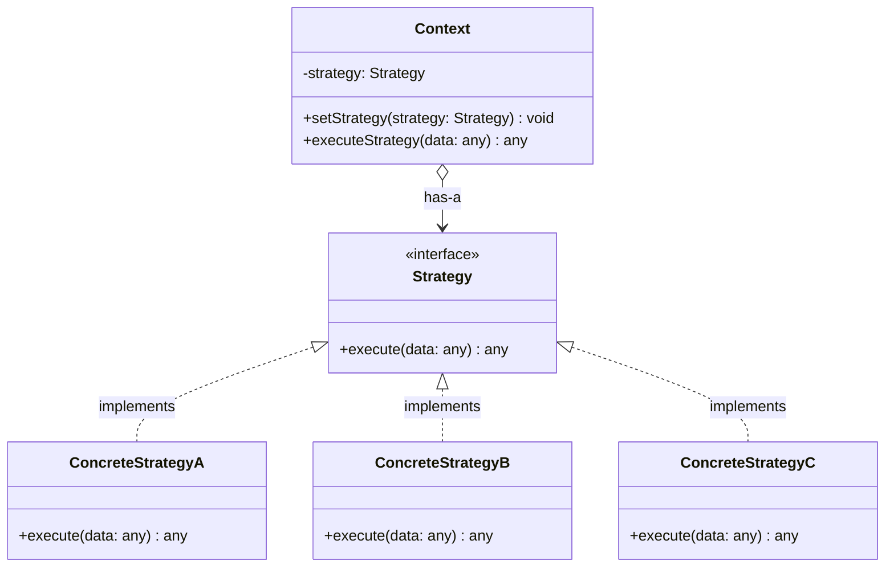
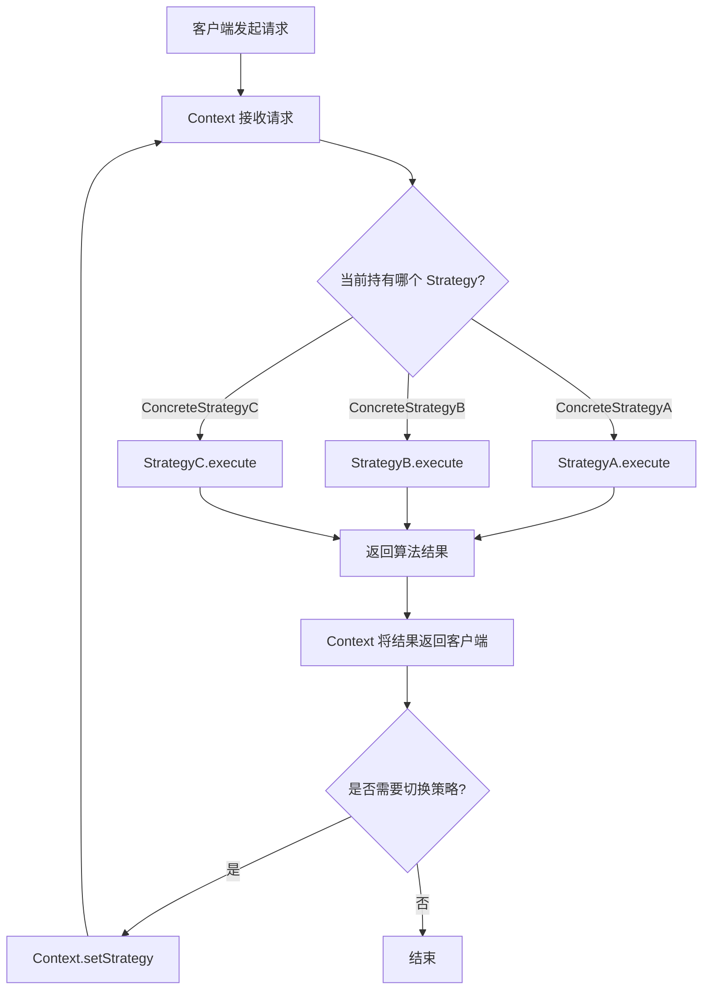
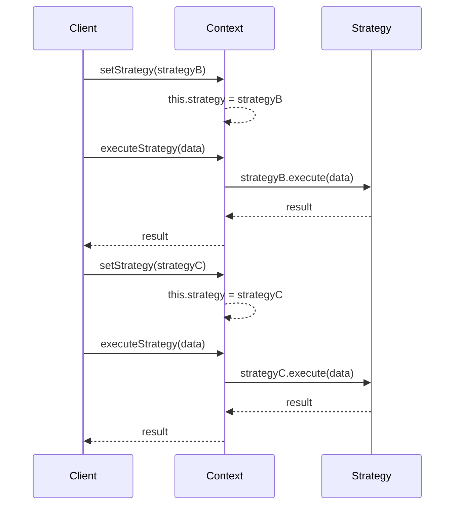

# 策略模式

## 1. 定义与意图

> 定义一系列的算法，把它们一个个封装起来，并且使它们可相互替换。本模式使得算法可独立于使用它的客户而变化。——GoF

策略模式（Strategy Pattern）又称政策模式（Policy Pattern），是一种行为型设计模式。其核心思想是：将一族算法分别封装到独立的策略类中，使它们可以互相替换，从而让算法的变化不会影响到使用算法的客户端。

策略模式在软件开发中的价值体现在三个层面：

- **消除条件分支**：将 if-else/switch-case 中的每个分支提取为独立策略类，客户端只需持有策略引用并委派执行，代码从"过程式分支"进化为"对象式多态"
- **符合开闭原则**：新增算法只需添加新策略类并注册到上下文，无需修改已有策略或客户端代码，系统对扩展开放、对修改关闭
- **算法可复用**：策略类与上下文解耦，同一策略可被多个上下文复用，也可在运行时动态切换，实现算法的灵活组合

从工程实践角度看，策略模式最适合"算法族"场景——即多个算法在逻辑上平级、可互换、且未来可能新增。如果算法之间不存在替换关系，或算法数量极少且稳定不变，则不必引入策略模式，直接调用即可。

## 2. UML类图



## 3. 核心角色与职责

| 角色 | 职责 | 典型实现方式 |
|------|------|-------------|
| Strategy | 声明算法的公共接口，所有具体策略均实现此接口 | TypeScript interface 或 abstract class |
| ConcreteStrategy | 实现具体算法，封装算法的完整逻辑 | 实现 Strategy 接口的独立类 |
| Context | 持有 Strategy 引用，将算法执行委派给策略对象，可提供策略切换方法 | 组合 Strategy，提供 setStrategy / executeStrategy |

角色间的协作流程：

1. 客户端创建具体策略对象，注入到 Context
2. Context 收到执行请求后，将调用委派给当前持有的 Strategy
3. Strategy 执行算法逻辑并返回结果
4. Context 将结果返回给客户端（可选：对结果做后处理）
5. 客户端可在运行时通过 setStrategy 切换策略，下次调用即使用新算法

## 4. 应用场景

### 4.1 通用场景

| 场景 | 策略族 | 说明 |
|------|--------|------|
| 排序算法选择 | 冒泡排序 / 快速排序 / 归并排序 / 堆排序 | 根据数据规模和特征选择最优排序算法 |
| 压缩算法选择 | GZIP / LZ4 / Brotli / Zstd | 根据数据大小和压缩率/速度偏好选择 |
| 支付方式选择 | 支付宝 / 微信支付 / 银行卡 / Apple Pay | 用户在运行时选择支付渠道 |
| 路由策略 | 最短路径 / 最少跳数 / 负载均衡 | 网络路由中根据策略选择转发路径 |
| 定价策略 | 原价 / 折扣 / 满减 / 会员价 | 电商系统中不同促销策略的计算 |
| 日志输出策略 | 控制台 / 文件 / 远程 / 混合 | 根据环境选择日志输出方式 |

### 4.2 前端框架实战

#### 表单验证：不同字段的验证策略

#### React 条件渲染策略

#### 排序策略：列表页多种排序方式

#### 动画缓动函数策略

## 5. Mermaid流程图



策略模式执行时序：



## 6. 优缺点分析

| 优点 | 缺点 |
|------|------|
| 消除大量条件判断语句（if-else / switch-case） | 客户端必须了解所有策略的差异，才能做出正确的选择 |
| 符合开闭原则：新增策略无需修改已有代码 | 策略数量增加时，策略类数量膨胀，维护成本上升 |
| 符合单一职责原则：每个策略类只封装一种算法 | 策略与 Context 之间的通信可能产生额外开销 |
| 算法可独立复用，同一策略可被多个 Context 共享 | 如果策略极少（2-3个）且稳定不变，引入模式可能过度设计 |
| 运行时可动态切换策略，灵活性高 | 策略切换逻辑仍需客户端控制，未完全消除决策逻辑 |
| 提供了一种用组合替代继承的方案 | 部分策略可能共享大量公共逻辑，导致代码重复 |

---

## 7. 相关模式对比

策略模式与状态模式结构高度相似（都持有接口引用并委派执行），但意图截然不同：

- **策略模式**：客户端在多个平级算法中做选择，策略之间互不知晓，切换由外部驱动
- **状态模式**：状态对象封装了状态转换逻辑，状态之间可能相互感知，切换由内部驱动

```
// 策略模式：客户端选择策略
class PaymentContext {
  constructor(private strategy: IPaymentStrategy) {}
  setStrategy(s: IPaymentStrategy) { this.strategy = s; } // 外部切换
  pay(amount: number) { return this.strategy.pay(amount); }
}

// 状态模式：状态自动切换
class OrderContext {
  constructor(private state: IOrderState) {}
  pay() { this.state.pay(this); } // 内部可能触发 state 转换
}
```

### 策略模式 vs 模板方法模式

- **策略模式**：通过组合实现算法切换，运行时可替换，更灵活
- **模板方法模式**：通过继承实现步骤扩展，编译时确定，结构更稳定

### 策略模式 + 职责链模式

策略模式选择"一个"算法执行；职责链模式让"多个"处理者依次尝试。两者可以组合：先用职责链确定使用哪个策略，再由策略执行具体算法。

## 8. 总结

策略模式是行为型设计模式中最直观、最常用的一种。其核心价值在于将算法族从客户端中解耦出来，使算法可以独立变化、自由替换、灵活组合。

| 应用领域 | 典型场景 | 核心价值 |
|----------|----------|----------|
| 表单验证 | 必填/邮箱/手机号/身份证策略 | 规则独立封装，自由组合 |
| 支付系统 | 支付宝/微信/银行卡策略 | 运行时切换支付渠道 |
| 排序系统 | 冒泡/快排/归并策略 | 根据数据特征选择最优算法 |
| 动画系统 | easeIn/easeOut/easeInOut策略 | 缓动函数可插拔替换 |
| 压缩系统 | GZIP/LZ4/Brotli策略 | 按数据大小选择压缩算法 |
| 定价系统 | 原价/折扣/满减/会员价策略 | 促销规则灵活组合 |

### 关键要点

1. **定义算法接口**：所有策略实现同一接口，保证可互换性
2. **Context 持有策略引用**：通过组合而非继承实现算法委派
3. **运行时切换策略**：客户端通过 setStrategy 动态替换算法
4. **Map 注册表替代 switch-case**：策略数量多时，用注册表管理策略选择
5. **与工厂模式结合**：策略工厂根据条件自动创建/选择策略，客户端无需了解策略细节
6. **注意策略数量**：策略过多时考虑合并相似策略或引入策略层级

### 最佳实践

- 策略类应保持无状态（或仅持有配置参数），状态数据由 Context 管理
- 使用泛型策略接口 `IStrategy<TInput, TOutput>` 提升类型安全性
- 优先使用对象组合（Strategy 作为 Context 的属性），而非类继承
- 为策略注册表提供默认策略，避免客户端未设置策略时出错
- 在 React/Vue 中，策略模式常与 Hook/Composable 结合，将策略封装为可复用逻辑

---

## TypeScript 实现

### 基础实现

表单验证是策略模式的经典应用场景。不同字段的验证规则（必填、邮箱格式、最小长度等）各自独立，且可自由组合，天然适合策略模式。

```typescript
// ==================== 策略接口 ====================

/** 验证策略接口 */
interface IValidationStrategy {
  /** 执行验证，返回错误信息或 null */
  validate(value: string, fieldName: string): string | null;
}

// ==================== 具体策略 ====================

/** 必填验证策略 */
class RequiredStrategy implements IValidationStrategy {
  validate(value: string, fieldName: string): string | null {
    return value.trim() ? null : `${fieldName}为必填项`;
  }
}

/** 邮箱验证策略 */
class EmailStrategy implements IValidationStrategy {
  private readonly regex = /^[^\s@]+@[^\s@]+\.[^\s@]+$/;
  validate(value: string, fieldName: string): string | null {
    return this.regex.test(value) ? null : `${fieldName}格式不正确`;
  }
}

/** 手机号验证策略 */
class PhoneStrategy implements IValidationStrategy {
  private readonly regex = /^1[3-9]\d{9}$/;
  validate(value: string, fieldName: string): string | null {
    return this.regex.test(value) ? null : `${fieldName}格式不正确`;
  }
}

/** 最小长度验证策略 */
class MinLengthStrategy implements IValidationStrategy {
  constructor(private min: number) {}
  validate(value: string, fieldName: string): string | null {
    return value.length >= this.min ? null : `${fieldName}长度不能少于${this.min}个字符`;
  }
}

// ==================== 上下文 ====================
class ValidationContext {
  private strategies = new Map<string, IValidationStrategy>();

  add(field: string, strategy: IValidationStrategy): this {
    this.strategies.set(field, strategy);
    return this;
  }

  validate(data: Record<string, string>): Map<string, string> {
    const errors = new Map<string, string>();
    this.strategies.forEach((strategy, field) => {
      const error = strategy.validate(data[field] ?? "", field);
      if (error) errors.set(field, error);
    });
    return errors;
  }
}

// 使用
const formData = {
  email: 'invalid-email',
  phone: '123',
  password: '123'
};

const validator = new ValidationContext()
  .add('email', new EmailStrategy())
  .add('phone', new PhoneStrategy())
  .add('password', new MinLengthStrategy(8));

const errors = validator.validate(formData);
console.log(errors);
// Map { 'email' => 'email格式不正确', 'phone' => 'phone格式不正确', 'password' => 'password长度不能少于8个字符' }
```

### 现代 TypeScript 实现

现代 TypeScript 提供了泛型、Map 注册表、函数重载等特性，可以构建更加类型安全、更灵活的策略模式。

#### 泛型策略上下文

```typescript
// ==================== 泛型策略接口 ====================

/** 通用策略接口：输入 TInput，输出 TOutput */
interface IStrategy<TInput, TOutput> {
  readonly name: string;
  execute(input: TInput): TOutput;
}

/** 泛型策略上下文 */
class StrategyContext<TInput, TOutput> {
  private strategy: IStrategy<TInput, TOutput>;

  constructor(strategy: IStrategy<TInput, TOutput>) {
    this.strategy = strategy;
  }

  setStrategy(strategy: IStrategy<TInput, TOutput>): void {
    this.strategy = strategy;
  }

  execute(input: TInput): TOutput {
    return this.strategy.execute(input);
  }

  getStrategyName(): string {
    return this.strategy.name;
  }
}

// ==================== 具体策略 ====================
interface SortInput { data: number[]; order: 'asc' | 'desc'; }

class BubbleSortStrategy implements IStrategy<SortInput, number[]> {
  readonly name = 'BubbleSort';
  execute(input: SortInput): number[] {
    const arr = [...input.data];
    for (let i = 0; i < arr.length - 1; i++) {
      for (let j = 0; j < arr.length - 1 - i; j++) {
        const needSwap = input.order === 'asc' ? arr[j] > arr[j + 1] : arr[j] < arr[j + 1];
        if (needSwap) [arr[j], arr[j + 1]] = [arr[j + 1], arr[j]];
      }
    }
    return arr;
  }
}

class QuickSortStrategy implements IStrategy<SortInput, number[]> {
  readonly name = 'QuickSort';
  execute(input: SortInput): number[] {
    const arr = [...input.data];
    return arr.sort((a, b) => input.order === 'asc' ? a - b : b - a);
  }
}

const sortContext = new StrategyContext(new BubbleSortStrategy());
const data: SortInput = { data: [64, 34, 25, 12, 22, 11, 90], order: 'asc' };
console.log(sortContext.getStrategyName()); // 'BubbleSort'
console.log(sortContext.execute(data));     // [11, 12, 22, 25, 34, 64, 90]

sortContext.setStrategy(new QuickSortStrategy());
console.log(sortContext.getStrategyName()); // 'QuickSort'
```

#### Map 注册表替代 switch-case

```typescript
// ==================== 策略注册表 ====================

/** 支付策略接口 */
interface IPaymentStrategy {
  readonly name: string;
  pay(amount: number, orderId: string): Promise<PaymentResult>;
}

interface PaymentResult {
  success: boolean;
  transactionId: string;
  message: string;
}

/** 支付宝策略 */
class AlipayStrategy implements IPaymentStrategy {
  readonly name = 'Alipay';
  async pay(amount: number, orderId: string): Promise<PaymentResult> {
    // 调用支付宝 API
    return { success: true, transactionId: `ALI-${orderId}`, message: '支付宝支付成功' };
  }
}

/** 微信支付策略 */
class WechatPayStrategy implements IPaymentStrategy {
  readonly name = 'WechatPay';
  async pay(amount: number, orderId: string): Promise<PaymentResult> {
    return { success: true, transactionId: `WX-${orderId}`, message: '微信支付成功' };
  }
}

/** 策略注册表：替代 switch-case */
const paymentStrategies = new Map<string, IPaymentStrategy>();
paymentStrategies.set('Alipay', new AlipayStrategy());
paymentStrategies.set('WechatPay', new WechatPayStrategy());

async function processPayment(name: string, amount: number, orderId: string) {
  const strategy = paymentStrategies.get(name);
  if (!strategy) throw new Error(`不支持的支付方式: ${name}`);
  return strategy.pay(amount, orderId);
}

// 客户端只需传入策略名称，无需 switch-case
await processPayment('Alipay', 100, 'ORD-001');
await processPayment('WechatPay', 200, 'ORD-002');
```

#### 策略模式 + 工厂模式

```typescript
// ==================== 策略工厂 ====================

/** 压缩策略接口 */
interface ICompressionStrategy {
  readonly algorithm: string;
  compress(data: Buffer): Buffer;
  decompress(data: Buffer): Buffer;
}

/** GZIP 压缩策略 */
class GzipStrategy implements ICompressionStrategy {
  readonly algorithm = 'gzip';
  compress(data: Buffer): Buffer {
    // 使用 gzip 压缩
    return data;
  }
  decompress(data: Buffer): Buffer {
    return data;
  }
}

/** Brotli 压缩策略 */
class BrotliStrategy implements ICompressionStrategy {
  readonly algorithm = 'brotli';
  compress(data: Buffer): Buffer {
    return data;
  }
  decompress(data: Buffer): Buffer {
    return data;
  }
}

/** 策略工厂：根据数据大小选择最优压缩策略 */
class CompressionStrategyFactory {
  static createOptimal(dataSize: number): ICompressionStrategy {
    if (dataSize > 1024 * 1024) {
      return new BrotliStrategy(); // 大数据用高压缩率
    }
    return new GzipStrategy(); // 小数据用速度快的
  }
}

// 使用
const strategy = CompressionStrategyFactory.createOptimal(5 * 1024 * 1024);
console.log(strategy.algorithm); // 'brotli'
```

```typescript
// ==================== React 表单验证策略 ====================

import { useState, useCallback } from 'react';

/** 验证策略类型 */
type ValidationStrategy = (value: string) => string | null;

/** 策略工厂—— 预定义常用验证策略 */
const ValidationStrategies = {
  required: (fieldName: string): ValidationStrategy =>
    (value) => value.trim() ? null : `${fieldName}为必填项`,
  minLength: (min: number): ValidationStrategy =>
    (value) => value.length >= min ? null : `长度不能少于${min}个字符`,
  email: (): ValidationStrategy =>
    (value) => /^[^\s@]+@[^\s@]+\.[^\s@]+$/.test(value) ? null : '邮箱格式不正确',
  match: (pattern: RegExp, message: string): ValidationStrategy =>
    (value) => pattern.test(value) ? null : message,
};

// 组合多个验证策略
function composeValidation(strategies: ValidationStrategy[]): ValidationStrategy {
  return (value) => {
    for (const strategy of strategies) {
      const error = strategy(value);
      if (error) return error;
    }
    return null;
  };
}

const passwordValidator = composeValidation([
  ValidationStrategies.required('密码'),
  ValidationStrategies.minLength(8),
]);
```

```typescript
// ==================== React 渲染策略 ====================

import { ComponentType } from 'react';

/** 渲染策略注册表 */
class RenderStrategyRegistry<T extends Record<string, unknown>> {
  private readonly strategies = new Map<string, ComponentType<T>>();

  register(state: string, component: ComponentType<T>): this {
    this.strategies.set(state, component);
    return this;
  }

  resolve(state: string): ComponentType<T> {
    const component = this.strategies.get(state);
    if (!component) throw new Error(`未注册状态: ${state}`);
    return component;
  }
}

/** 各状态对应的组件（示意，实现省略） */
const PendingOrderComponent: ComponentType<any> = () => null;
const PaidOrderComponent: ComponentType<any> = () => null;
const ShippedOrderComponent: ComponentType<any> = () => null;
const DeliveredOrderComponent: ComponentType<any> = () => null;
const CancelledOrderComponent: ComponentType<any> = () => null;

// ==================== 使用 ====================
function OrderStatusView({ status, order }: { status: string; order: Record<string, unknown> }) {
  const registry = new RenderStrategyRegistry()
    .register('pending', PendingOrderComponent)
    .register('paid', PaidOrderComponent)
    .register('shipped', ShippedOrderComponent)
    .register('delivered', DeliveredOrderComponent)
    .register('cancelled', CancelledOrderComponent);

  const StrategyComponent = registry.resolve(status);
  return <StrategyComponent {...order} />;
}
```

```typescript
// ==================== 商品排序策略 ====================

interface Product {
  id: string;
  name: string;
  price: number;
  sales: number;
  rating: number;
  createdAt: Date;
}

type SortStrategy = (products: Product[]) => Product[];

/** 按价格排序 */
const sortByPrice: SortStrategy = (products) =>
  [...products].sort((a, b) => a.price - b.price);

/** 按销量排序 */
const sortBySales: SortStrategy = (products) =>
  [...products].sort((a, b) => b.sales - a.sales);

/** 按评分排序 */
const sortByRating: SortStrategy = (products) =>
  [...products].sort((a, b) => b.rating - a.rating);

/** 上下文：可切换排序策略 */
class ProductSorter {
  private strategy: SortStrategy = sortByPrice;

  setStrategy(strategy: SortStrategy): this {
    this.strategy = strategy;
    return this;
  }

  sort(products: Product[]): Product[] {
    return this.strategy(products);
  }
}
```

```typescript
// ==================== 缓动函数策略 ====================

type EasingStrategy = (t: number) => number; // t: [0, 1] -> [0, 1]

const EasingStrategies = {
  /** 线性 */
  linear: ((t: number) => t) as EasingStrategy,

  /** 缓入（加速） */
  easeIn: ((t: number) => t * t) as EasingStrategy,

  /** 缓出（减速） */
  easeOut: ((t: number) => 1 - Math.pow(1 - t, 3)) as EasingStrategy,

  /** 缓入缓出（先加速后减速） */
  easeInOut: ((t: number) =>
    t < 0.5 ? 4 * t * t * t : 1 - Math.pow(-2 * t + 2, 3) / 2) as EasingStrategy,

  /** 弹性缓动 */
  elasticOut: ((t: number) => {
    if (t === 0 || t === 1) return t;
    const c4 = (2 * Math.PI) / 3;
    return Math.pow(2, -10 * t) * Math.sin((t * 10 - 0.75) * c4) + 1;
  }) as EasingStrategy,
};

/** 动画上下文：使用缓动策略 */
class AnimationContext {
  private easing: EasingStrategy = EasingStrategies.linear;
  setEasing(easing: EasingStrategy): this { this.easing = easing; return this; }
  async animate(from: number, to: number, duration: number, onUpdate: (value: number) => void) {
    const start = performance.now();
    return new Promise<void>((resolve) => {
      const step = (now: number) => {
        const t = Math.min((now - start) / duration, 1);
        onUpdate(from + (to - from) * this.easing(t));
        if (t < 1) requestAnimationFrame(step);
        else resolve();
      };
      requestAnimationFrame(step);
    });
  }
}

// 使用
const anim = new AnimationContext();
anim.setEasing(EasingStrategies.elasticOut);
await anim.animate(0, 300, 1000, (value) => {
  // 更新 DOM 元素位置
});
```

```typescript
/** 策略接口（示意） */
interface IProcessStrategy {
  execute(data: unknown): unknown;
}

// 策略模式：组合
class DataProcessor {
  constructor(private strategy: IProcessStrategy) {}
  process(data: unknown) { return this.strategy.execute(data); }
}

// 模板方法模式：继承
abstract class DataProcessorBase {
  process(data: unknown) {           // 骨架算法
    const parsed = this.parse(data);  // 步骤1：子类覆写
    const validated = this.validate(parsed); // 步骤2：子类覆写
    return this.transform(validated); // 步骤3：子类覆写
  }
  protected abstract parse(data: unknown): unknown;
  protected abstract validate(data: unknown): unknown;
  protected abstract transform(data: unknown): unknown;
}
```

```typescript
// 复用前文《泛型策略上下文》中定义的 IStrategy<TInput, TOutput> 接口

/** 策略选择链：根据条件选择最优策略 */
class StrategySelector<TInput, TOutput> {
  private readonly rules: Array<{
    condition: (input: TInput) => boolean;
    strategy: IStrategy<TInput, TOutput>;
  }> = [];

  addRule(condition: (input: TInput) => boolean, strategy: IStrategy<TInput, TOutput>): this {
    this.rules.push({ condition, strategy });
    return this;
  }

  select(input: TInput): IStrategy<TInput, TOutput> | null {
    for (const { condition, strategy } of this.rules) {
      if (condition(input)) return strategy;
    }
    return null;
  }
}
```

---

## Java 实现

### 策略模式（算法族可互换）

```java
// 策略接口
interface DiscountStrategy {
    double calculate(double amount);
}

// 具体策略：无折扣
class NoDiscount implements DiscountStrategy {
    public double calculate(double amount) { return amount; }
}

// 具体策略：VIP 九折
class VipDiscount implements DiscountStrategy {
    public double calculate(double amount) { return amount * 0.9; }
}

// 具体策略：满减
class ThresholdDiscount implements DiscountStrategy {
    private final double threshold;
    private final double reduction;

    public ThresholdDiscount(double threshold, double reduction) {
        this.threshold = threshold;
        this.reduction = reduction;
    }

    public double calculate(double amount) {
        return amount >= threshold ? amount - reduction : amount;
    }
}

// 上下文：持有策略，可运行时切换
class PriceCalculator {
    private DiscountStrategy strategy;

    public PriceCalculator(DiscountStrategy strategy) {
        this.strategy = strategy;
    }

    public void setStrategy(DiscountStrategy strategy) {
        this.strategy = strategy;
    }

    public double calculate(double amount) {
        return strategy.calculate(amount);
    }
}

// 使用：运行时动态切换算法
public class Client {
    public static void main(String[] args) {
        PriceCalculator calculator = new PriceCalculator(new NoDiscount());
        System.out.println(calculator.calculate(100));  // 100

        calculator.setStrategy(new VipDiscount());
        System.out.println(calculator.calculate(100));  // 90

        calculator.setStrategy(new ThresholdDiscount(200, 30));
        System.out.println(calculator.calculate(250));  // 220
    }
}
```

> 策略模式将一族算法封装为可互换的策略，消除大量 if-else，符合开闭原则。Java 中 `Comparator`、`ThreadPoolExecutor` 的拒绝策略（`RejectedExecutionHandler`）都是策略模式的经典应用。

## Python 实现

### 策略模式（类策略）

```python
from abc import ABC, abstractmethod

class DiscountStrategy(ABC):
    @abstractmethod
    def calculate(self, amount: float) -> float:
        pass

class NoDiscount(DiscountStrategy):
    def calculate(self, amount: float) -> float:
        return amount

class VipDiscount(DiscountStrategy):
    def calculate(self, amount: float) -> float:
        return amount * 0.9

class ThresholdDiscount(DiscountStrategy):
    def __init__(self, threshold: float, reduction: float):
        self.threshold = threshold
        self.reduction = reduction

    def calculate(self, amount: float) -> float:
        return amount - self.reduction if amount >= self.threshold else amount

class PriceCalculator:
    def __init__(self, strategy: DiscountStrategy):
        self._strategy = strategy

    def set_strategy(self, strategy: DiscountStrategy):
        self._strategy = strategy

    def calculate(self, amount: float) -> float:
        return self._strategy.calculate(amount)

calculator = PriceCalculator(NoDiscount())
print(calculator.calculate(100))  # 100
calculator.set_strategy(VipDiscount())
print(calculator.calculate(100))  # 90
```

### 策略模式（函数策略，Python 特性）

```python
# Python 函数是一等公民，策略可直接用函数实现
def no_discount(amount: float) -> float:
    return amount

def vip_discount(amount: float) -> float:
    return amount * 0.9

class PriceCalculator:
    def __init__(self, strategy):
        self._strategy = strategy

    def set_strategy(self, strategy):
        self._strategy = strategy

    def calculate(self, amount: float) -> float:
        return self._strategy(amount)

calc = PriceCalculator(no_discount)
print(calc.calculate(100))  # 100
calc.set_strategy(vip_discount)
print(calc.calculate(100))  # 90
```

> Python 中策略模式可简化——直接用函数/可调用对象作为策略，无需定义抽象基类。`sorted` 的 `key` 参数、`functools.partial` 都是策略思想的体现。

