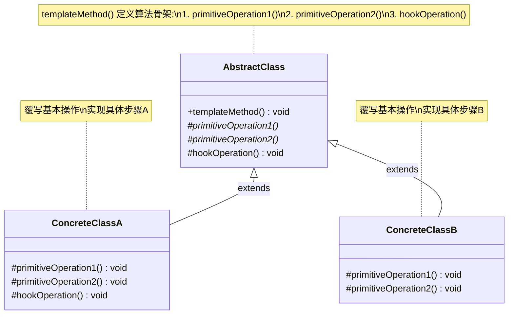
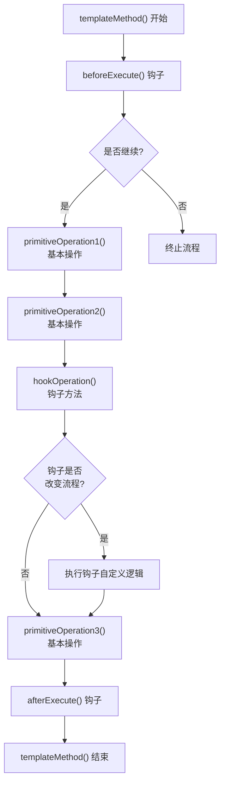

# 模板方法模式

> 定义一个操作中的算法的骨架，而将一些步骤延迟到子类中。模板方法使得子类可以不改变一个算法的结构即可重定义该算法的某些特定步骤。-- GoF

## 1. 定义与意图

模板方法模式（Template Method Pattern）是一种行为型设计模式，它在基类中定义算法的骨架结构，将某些步骤的实现延迟到子类中完成。基类控制算法的整体执行流程（即"模板方法"），子类通过覆写特定的"基本操作"来定制算法的细节，而无需改变算法的整体结构。

### 核心思想

- **算法骨架不变，步骤实现可变**：模板方法固定了算法的执行顺序和逻辑框架，子类只能覆写被标记为可覆写的步骤。
- **控制反转（Hollywood Principle）**："不要调用我们，我们会调用你" -- 基类调用子类的方法，而非子类驱动基类。
- **钩子方法（Hook Method）**：基类提供默认空实现的钩子，子类可选择性地覆写以插入自定义逻辑。

### 前端中的变体

由于 JavaScript/TypeScript 的函数式特性，模板方法模式在前端中有两种典型实现路径：

1. **类继承方式**：经典的 GoF 实现，通过抽象基类定义模板方法，子类覆写基本操作。
2. **高阶函数方式（Hook 模式）**：以函数组合替代类继承，通过传入钩子函数定制算法步骤。React Hooks、Vue Composition API 均是此变体的典型实践。

```
+-------------------------------------------------------------+
|              模板方法模式的两种前端实现路径                     |
+-------------------------------------------------------------+
|                                                             |
|  类继承方式                         高阶函数方式              |
|  +----------------------+          +----------------------+  |
|  | abstract class Base  |          | function template(   |  |
|  |   templateMethod()   |          |   step1, step2, ...  |  |
|  |   abstract step1()   |          | ) {                  |  |
|  |   abstract step2()   |          |   step1()            |  |
|  | }                    |          |   step2()            |  |
|  +----------------------+          | }                    |  |
|         |                          +----------------------+  |
|         | extends                           |               |
|         v                                  | 传入钩子函数   |
|  +----------------------+          +----------------------+  |
|  | class Derived        |          | template({           |  |
|  |   step1() { ... }    |          |   before: () => {},  |  |
|  |   step2() { ... }    |          |   transform: () => {}|  |
|  | }                    |          | })                   |  |
|  +----------------------+          +----------------------+  |
|                                                             |
+-------------------------------------------------------------+
```

---

## 2. UML类图



### 结构说明

| 方法类型 | 标记 | 说明 |
|---------|------|------|
| 模板方法 | `+templateMethod()` | 公有方法，定义算法骨架，调用基本操作和钩子方法 |
| 基本操作 | `#primitiveOperation()*` | 保护抽象方法，子类必须实现 |
| 钩子方法 | `#hookOperation()` | 保护方法，提供默认空实现，子类可选择覆写 |

---

## 3. 核心角色与职责

| 角色 | 职责 |
|------|------|
| AbstractClass | 定义算法骨架（templateMethod）和基本操作的签名；实现钩子方法的默认行为；控制算法的执行流程 |
| ConcreteClass | 实现基本操作以完成算法的具体步骤；可选择覆写钩子方法以插入自定义逻辑 |

### 方法分类

```
+-------------------------------------------------------------+
|               AbstractClass 中的方法分类                       |
+-------------------------------------------------------------+
|                                                             |
|  1. 模板方法 (Template Method)                               |
|     - 定义算法骨架，调用基本操作和钩子方法                     |
|     - 通常标记为 final，子类不应覆写                          |
|     - 示例: templateMethod()                                 |
|                                                             |
|  2. 基本操作 (Primitive Operation)                           |
|     - 算法的具体步骤，由子类实现                              |
|     - 标记为 abstract/protected                              |
|     - 示例: read(), parse(), process(), output()             |
|                                                             |
|  3. 钩子方法 (Hook Method)                                   |
|     - 提供扩展点，默认空实现或默认行为                        |
|     - 子类可选择覆写，也可不覆写                              |
|     - 示例: beforeProcess(), afterProcess(), shouldCache()   |
|                                                             |
+-------------------------------------------------------------+
```

---

## 4. 应用场景

### 4.1 通用场景

| 场景 | 说明 | 典型示例 |
|------|------|---------|
| 算法骨架固定、步骤可变 | 整体流程不变，部分步骤有差异 | 数据处理管道、报表生成 |
| 框架设计 | 框架定义流程，用户定制步骤 | 构建工具、测试框架 |
| 代码复用 | 多个类有相似逻辑，仅步骤不同 | 各类继承基类复用骨架 |
| 控制流程扩展 | 需要在固定流程中插入自定义逻辑 | 钩子方法、生命周期回调 |

### 4.2 前端框架实战

#### React 生命周期

React Class Component 的生命周期方法是模板方法模式的经典应用。React 内部定义了组件的渲染骨架，开发者通过覆写生命周期方法来定制行为。

#### Vue Composition API

Vue 的 `setup()` 函数本身就是模板方法模式的函数式变体。`onMounted`、`onUnmounted`、`onUpdated` 等生命周期钩子就是模板方法中的钩子方法。

#### Express 中间件

Express 的 `app.use()` 定义了请求处理的骨架，中间件函数实现具体的处理步骤。这是模板方法模式在服务端框架中的典型应用。

#### React Class Component 的 render()

React Class Component 的 `render()` 方法是模板方法模式最直接的体现。React 调用 `render()` 获取虚拟 DOM，子类通过覆写 `render()` 定制渲染输出。

---

## 5. Mermaid流程图



### 执行流程说明

| 步骤 | 类型 | 说明 |
|------|------|------|
| templateMethod | 模板方法 | 入口方法，定义算法骨架，不可覆写 |
| beforeExecute | 钩子方法 | 执行前回调，可拦截流程 |
| primitiveOperation1/2/3 | 基本操作 | 算法的具体步骤，子类必须实现 |
| hookOperation | 钩子方法 | 算法中的扩展点，提供默认行为 |
| afterExecute | 钩子方法 | 执行后回调，用于清理或通知 |

---

## 6. 优缺点分析

| 优点 | 缺点 |
|------|------|
| 复用算法骨架，减少重复代码 | 子类必须遵循父类定义的流程，灵活性受限 |
| 符合开闭原则（OCP），新增变体只需新增子类 | 违反里氏替换原则（LSP） |
| 骨架集中管理，逻辑清晰 | 子类依赖父类的实现细节（模板方法调用顺序），而非仅依赖接口 |
| — | 修改模板方法的流程会影响所有子类，风险较高 |
| — | TypeScript/JavaScript 单继承，子类无法同时继承多个模板 |

### 适用场景判断

```
+-------------------------------------------------------------+
|                    适用场景判断                               |
+-------------------------------------------------------------+
|                                                             |
|  适合使用模板方法模式:                                       |
|  - 多个类有相似的算法结构，仅步骤实现不同                    |
|  - 算法骨架固定，需要在不同场景中复用                        |
|  - 需要控制子类的扩展范围（仅允许覆写特定步骤）              |
|  - 框架设计中需要提供可扩展的钩子点                          |
|                                                             |
|  不适合使用模板方法模式:                                    |
|  - 算法结构经常变化，步骤顺序不固定                          |
|  - 步骤之间无共同骨架，各变体差异过大                        |
|  - 需要运行时动态组合步骤（应考虑策略模式或管道模式）        |
|  - 类继承层次已经过深，继续继承会增加复杂度                  |
|                                                             |
+-------------------------------------------------------------+
```

---

## 7. 相关模式对比

### 模板方法 vs 策略模式

| 对比维度 | 模板方法 | 策略 |
|----------|---------|------|
| 算法控制 | 父类控制骨架，子类实现步骤 | 客户端选择策略，策略独立执行 |
| 扩展方式 | 继承覆写 | 组合替换 |
| 耦合度 | 子类依赖父类实现细节 | Context 仅依赖策略接口 |
| 变化粒度 | 算法的部分步骤可变 | 整个算法可替换 |
| 代码复用 | 基类复用骨架代码 | 策略独立复用 |
| 运行时灵活性 | 编译时确定（继承关系固定） | 运行时切换策略 |

### 模板方法 vs 工厂方法

| 对比维度 | 模板方法 | 工厂方法 |
|----------|---------|---------|
| 意图 | 定义算法骨架 | 定义创建对象的接口 |
| 关注点 | 行为/流程 | 对象创建 |
| 方法性质 | 模板方法调用多个基本操作 | 工厂方法返回产品对象 |
| 结合使用 | 基本操作中可调用工厂方法 | 工厂方法可在模板方法中作为步骤 |

### 模板方法 vs 装饰器模式

| 对比维度 | 模板方法 | 装饰器 |
|----------|---------|--------|
| 扩展方式 | 继承覆写步骤 | 组合包装对象 |
| 扩展粒度 | 算法步骤级别 | 对象行为级别 |
| 静态/动态 | 编译时确定 | 运行时动态组合 |
| 扩展数量 | 受限于继承层次 | 可无限嵌套装饰 |

---

## 8. 总结

模板方法模式是行为型设计模式中最直观的模式之一。它通过在基类中定义算法骨架，将步骤实现延迟到子类，实现了算法结构的复用与步骤的灵活定制。

### 核心要点

1. **算法骨架与步骤分离**：模板方法固定算法结构，基本操作由子类实现，钩子方法提供可选扩展点。
2. **Hollywood Principle**："不要调用我们，我们会调用你" -- 基类控制调用流程，子类被动响应。
3. **前端中的函数式变体**：高阶函数组合（pipe/compose）和 Hook 模式是模板方法在函数式编程中的自然对应。React Hooks、Vue Composition API、Express 中间件均体现了模板方法的思想。
4. **钩子方法是关键**：合理设计钩子方法的位置和签名，决定了模式的扩展能力和易用性。

### 实践建议

- 优先考虑函数式变体（Hook 模式、pipe 组合），避免类继承层次过深。
- 模板方法应标记为不可覆写（TypeScript 中无 final 关键字，可通过命名约定或文档约束）。
- 钩子方法的默认实现应保持安全（不产生副作用），子类覆写时不应破坏算法的不变量。
- 当算法步骤超过 5 个时，考虑拆分为多个模板方法或引入策略模式替代。
- 异步场景中，确保模板方法正确处理 Promise 链，避免步骤间的竞态条件。

### 与前端框架的深层联系

模板方法模式的思想渗透在前端框架的各个层面：

| 框架/工具 | 模板方法体现 |
|----------|-------------|
| React Class Component | render() 是基本操作，生命周期是钩子方法 |
| React Hooks | useEffect/useLayoutEffect 是钩子，组件函数是模板 |
| Vue Composition API | setup() 是基本操作，onMounted/onUnmounted 是钩子 |
| Express | 请求处理管线是模板方法，中间件是步骤/钩子 |
| Webpack | 构建流程是模板方法，插件（tapable 钩子）是扩展点 |
| Vite | 插件管线是模板方法，resolveId/load/transform 是钩子 |
| Jest | 测试生命周期（beforeEach/afterEach）是钩子方法 |

---

> 模板方法模式的精髓在于"固定骨架，开放步骤"。在前端工程中，无论是框架的生命周期设计、构建工具的插件系统，还是业务代码中的数据处理管线，模板方法的思想无处不在。理解并善用此模式，有助于编写结构清晰、易于扩展的代码。当类继承带来过多约束时，转向函数式变体（Hook 模式、pipe 组合）是更符合 JavaScript/TypeScript 习惯的选择。

---

## TypeScript 实现

### 基础实现：数据处理管道

数据处理管道的算法骨架为：`read -> parse -> process -> output`。基类定义模板方法固定该流程，子类实现各步骤的具体逻辑。

```typescript
// 抽象基类：定义数据处理管道的算法骨架
abstract class DataPipeline {
  // 模板方法：定义算法骨架，子类不应覆写
  public execute(): void {
    const raw = this.read();
    const parsed = this.parse(raw);
    const processed = this.process(parsed);
    this.output(processed);
  }

  // 基本操作：子类必须实现
  protected abstract read(): string;
  protected abstract parse(raw: string): unknown;
  protected abstract process(parsed: unknown): unknown;
  protected abstract output(processed: unknown): void;
}

// ==================== CSV 管道 ====================
class CsvPipeline extends DataPipeline {
  constructor(private filePath: string) { super(); }
  protected read(): string { return `id,name\n1,Alice\n2,Bob`; }
  protected parse(raw: string): unknown { return raw.split('\n').map((line) => line.split(',')); }
  protected process(parsed: unknown): unknown { return parsed; }
  protected output(processed: unknown): void { console.log('[CSV] 输出:', processed); }
}

// ==================== JSON 管道 ====================
class JsonPipeline extends DataPipeline {
  constructor(private filePath: string) { super(); }
  protected read(): string { return '{"users":[{"id":1,"name":"Alice"}]}'; }
  protected parse(raw: string): unknown { return JSON.parse(raw); }
  protected process(parsed: unknown): unknown { return (parsed as any).users; }
  protected output(processed: unknown): void { console.log('[JSON] 输出:', processed); }
}

// 使用
const csvPipeline = new CsvPipeline("data.csv");
csvPipeline.execute();

const jsonPipeline = new JsonPipeline("data.json");
jsonPipeline.execute();
```

### 带钩子方法的增强实现

钩子方法为子类提供可选的扩展点，子类可以选择性地覆写以插入自定义逻辑，而不必实现所有步骤。

```typescript
// 抽象基类：带钩子方法的数据处理管道
abstract class EnhancedDataPipeline<TInput, TIntermediate, TOutput> {
  // 模板方法：定义增强的算法骨架
  public execute(): TOutput | null {
    // 钩子：执行前
    if (!this.beforeExecute()) {
      console.log("[Pipeline] 执行被钩子拦截，终止流程");
      return null;
    }

    // 步骤1：读取
    const raw = this.read();

    // 钩子：读取后处理
    const transformed = this.afterRead ? this.afterRead(raw) : raw;

    // 步骤2：解析
    const parsed = this.parse(transformed);

    // 步骤3：处理
    const processed = this.process(parsed);

    // 步骤4：输出
    const result = this.output(processed);

    // 钩子：执行后
    this.afterExecute?.(result);

    return result;
  }

  protected abstract read(): string;
  protected abstract parse(raw: string): TIntermediate | null;
  protected abstract process(parsed: TIntermediate | null): TOutput;
  protected abstract output(result: TOutput): TOutput;

  // 钩子方法（可选覆写）
  protected beforeExecute(): boolean { return true; }
  protected afterRead?(raw: string): string;
  protected afterExecute?(result: TOutput): void;
}

// ==================== 带缓存的 API 管道 ====================
class ApiPipeline extends EnhancedDataPipeline<string, string, unknown> {
  private cache: Map<string, unknown> = new Map();
  private url = 'https://api.example.com/data';

  protected beforeExecute(): boolean {
    if (this.cache.has(this.url)) {
      console.log('[ApiPipeline] 命中缓存');
      return false; // 拦截，跳过执行
    }
    return true;
  }
  protected read(): string { return `{"ok":true,"data":[1,2,3]}`; }
  protected parse(raw: string): string | null { return raw; }
  protected process(parsed: string | null): unknown { return JSON.parse(parsed ?? '{}'); }
  protected output(result: unknown): unknown {
    this.cache.set(this.url, result);
    return result;
  }
  protected afterExecute(result: unknown): void {
    console.log('[ApiPipeline] 执行完成:', result);
  }
}

// 使用
const apiPipeline = new ApiPipeline();
apiPipeline.execute();
// 第二次执行会命中缓存
apiPipeline.execute();
```

### 现代TypeScript实现：高阶函数组合

函数式编程中的 `pipe` 组合是模板方法模式的函数式变体。算法骨架通过函数组合定义，步骤通过传入不同的函数实现。

```typescript
// 函数式工具：pipe 组合
function pipe<A>(...fns: Array<(a: A) => A>): (a: A) => A {
  return (initial: A) => fns.reduce((acc, fn) => fn(acc), initial);
}

// 函数式模板方法：数据处理管道
type PipelineStep<T> = (data: T) => T;

interface PipelineConfig<T> {
  before?: (data: T) => T;
  steps: PipelineStep<T>[];
  after?: (data: T) => T;
}

// 函数式模板方法
function createPipeline<T>(config: PipelineConfig<T>): (data: T) => T {
  return (initial: T): T => {
    const before = config.before ? config.before(initial) : initial;
    const result = pipe(...config.steps)(before);
    return config.after ? config.after(result) : result;
  };
}

// ==================== 使用：文本处理 ====================
const textPipeline = createPipeline({
  before: (text: string) => {
    console.log('[Pipeline] 开始处理文本');
    return text.trim();
  },
  steps: [
    (text) => text.toLowerCase(),
    (text) => text.replace(/\s+/g, '-'),
  ],
  after: (text) => {
    console.log(`[Pipeline] 处理完成: ${text}`);
    return text;
  },
});

const result = textPipeline("  Hello World! This is a Test.  ");
// [Pipeline] 开始处理文本
// [Pipeline] 处理完成: hello-world!-this-is-a-test.
```

### Hook模式：无需继承的模板方法

Hook 模式是前端中最常见的模板方法变体。通过传入钩子对象定制算法，完全避免类继承。

```typescript
// Hook 模式：可配置的请求处理器
interface RequestHooks<TReq, TRes> {
  beforeRequest?: (config: TReq) => TReq;
  transformRequest?: (config: TReq) => TReq;
  afterRequest?: (response: TRes) => TRes;
  onError?: (error: Error) => TRes | never;
  shouldRetry?: (error: Error, retryCount: number) => boolean;
  finally?: () => void;
}

interface RequestConfig {
  url: string;
  method?: string;
  headers?: Record<string, string>;
  body?: unknown;
}

// Hook 模式请求处理器
function createRequestHandler<TReq extends RequestConfig, TRes>(hooks: RequestHooks<TReq, TRes>) {
  return async (config: TReq): Promise<TRes> => {
    try {
      let current = hooks.transformRequest ? hooks.transformRequest(config) : config;
      if (hooks.beforeRequest) current = hooks.beforeRequest(current);
      const response = await fetch(current.url, {
        method: current.method,
        headers: current.headers,
        body: current.body ? JSON.stringify(current.body) : undefined,
      }) as unknown as TRes;
      const result = hooks.afterRequest ? hooks.afterRequest(response) : response;
      hooks.finally?.();
      return result;
    } catch (error) {
      hooks.finally?.();
      if (hooks.onError) return hooks.onError(error as Error);
      throw error;
    }
  };
}

// 带认证的请求处理器
const authRequestHandler = createRequestHandler<RequestConfig, unknown>({
  beforeRequest: (config) => ({
    ...config,
    headers: { ...config.headers, Authorization: 'Bearer token' },
  }),
  onError: (error) => {
    console.error('[请求失败]', error.message);
    throw error;
  },
});

authRequestHandler({
  url: "/api/users",
  method: "GET",
  headers: { "Content-Type": "application/json" },
});
```

### 泛型模板：类型安全的数据管道

```typescript
// 泛型模板方法：类型安全的多步骤数据处理
abstract class TypedPipeline<TInput, TIntermediate, TOutput> {
  // 模板方法：完整的类型安全处理流程
  public run(input: TInput): TOutput {
    this.validateInput(input);
    const intermediate = this.transform(input);
    const enriched = this.enrich(intermediate);
    const output = this.format(enriched);
    this.notify?.(output);
    return output;
  }

  // 基本操作
  protected abstract validateInput(input: TInput): void;
  protected abstract transform(input: TInput): TIntermediate;
  protected abstract enrich(intermediate: TIntermediate): TIntermediate;
  protected abstract format(intermediate: TIntermediate): TOutput;
  // 钩子
  protected notify?(output: TOutput): void;
}

// ==================== 用户创建管道 ====================
interface UserInput { username: string; email: string; password: string; }
interface UserEntity { userId: string; username: string; email: string; createdAt: string; }

class UserCreationPipeline extends TypedPipeline<UserInput, UserInput, UserEntity> {
  protected validateInput(input: UserInput): void {
    if (!input.username || !input.email || !input.password) throw new Error('字段缺失');
  }
  protected transform(input: UserInput): UserInput {
    return { ...input, username: input.username.trim(), email: input.email.toLowerCase() };
  }
  protected enrich(intermediate: UserInput): UserInput { return intermediate; }
  protected format(intermediate: UserInput): UserEntity {
    return {
      userId: `user_${Date.now()}`,
      username: intermediate.username,
      email: intermediate.email,
      createdAt: new Date().toISOString(),
    };
  }
  protected notify(output: UserEntity): void {
    console.log('[UserPipeline] 创建用户:', output.username);
  }
}

// ==================== 使用 ====================
const userPipeline = new UserCreationPipeline();
const user = userPipeline.run({
  username: "alice",
  email: "Alice@Example.COM",
  password: "securePass123",
});
console.log(user);
// { userId: 'user_...', username: 'alice', email: 'alice@example.com', createdAt: '...' }
```

### 异步模板方法

前端场景中大量涉及异步操作，异步模板方法需要特殊处理。

```typescript
// 异步模板方法基类
abstract class AsyncPipeline<TInput, TIntermediate, TOutput> {
  // 异步模板方法
  public async execute(input: TInput): Promise<TOutput> {
    await this.beforeExecute(input);

    const step1Result = await this.step1(input);
    const step2Result = await this.step2(step1Result);
    const step3Result = await this.step3(step2Result);

    await this.afterExecute(step3Result);

    return step3Result;
  }

  protected abstract beforeExecute(input: TInput): Promise<void>;
  protected abstract step1(input: TInput): Promise<TIntermediate>;
  protected abstract step2(input: TIntermediate): Promise<TIntermediate>;
  protected abstract step3(input: TIntermediate): Promise<TOutput>;
  protected async afterExecute(_result: TOutput): Promise<void> {}
}

// ==================== 数据加载管道 ====================
class DataLoaderPipeline extends AsyncPipeline<string, string, unknown> {
  protected async beforeExecute(input: string): Promise<void> {
    console.log(`[AsyncPipeline] 开始加载: ${input}`);
  }
  protected async step1(input: string): Promise<string> {
    await new Promise((r) => setTimeout(r, 10));
    return `raw:${input}`;
  }
  protected async step2(input: string): Promise<string> {
    return input.toUpperCase();
  }
  protected async step3(input: string): Promise<unknown> {
    return { data: input, loadedAt: Date.now() };
  }
}

// 使用
const loader = new DataLoaderPipeline();
loader.execute("/api/items").then((result) => console.log(result));
```

---

```typescript
// React 生命周期 -- 模板方法模式的体现
//
// React 内部的模板方法（简化）:
//   renderPipeline():
//     1. shouldComponentUpdate()  -- 钩子：决定是否更新
//     2. render()                 -- 基本操作：子类必须实现
//     3. componentDidMount()      -- 钩子：DOM 挂载后
//     4. componentDidUpdate()     -- 钩子：更新完成后
//     5. componentWillUnmount()   -- 钩子：卸载前清理
//
// 以下代码仅为概念演示，展示模板方法模式的思想:
abstract class ReactComponentLike {
  // 模板方法：React 调用的生命周期骨架
  public renderPipeline(): void {
    if (!this.shouldComponentUpdate()) return; // 钩子
    this.render();                             // 基本操作
    this.componentDidMount?.();                // 钩子
    this.componentDidUpdate?.();               // 钩子
  }

  protected abstract render(): void;
  protected shouldComponentUpdate(): boolean { return true; }
  protected componentDidMount?(): void;
  protected componentDidUpdate?(): void;

  protected componentWillUnmount(): void {
    console.log("[Hook] 组件卸载，清理资源");
  }
}
```

```typescript
// Vue Composition API -- 模板方法的函数式变体
//
// Vue 内部的模板方法（简化）:
//   componentLifecycle():
//     1. setup()           -- 基本操作：定义响应式状态和逻辑
//     2. onBeforeMount()   -- 钩子
//     3. onMounted()       -- 钩子
//     4. render()          -- 基本操作
//     5. onUpdated()       -- 钩子
//     6. onUnmounted()     -- 钩子

// 以下代码展示 Vue Composition API 中模板方法模式的思想
function defineComponent(options: { setup: () => void; mounted?: () => void; render?: () => void }) {
  return {
    mount() {
      options.setup();
      options.render?.();
      options.mounted?.();
    },
  };
}

const listComponent = defineComponent({
  setup() {
    console.log('[Vue] setup: 定义响应式状态');
  },
  render() {
    console.log('渲染列表: [Apple, Banana, Cherry]');
  },
  mounted() {
    console.log('[Vue] 列表组件已挂载');
  },
});

listComponent.mount();
// 渲染列表: [Apple, Banana, Cherry]
// [Vue] 列表组件已挂载
```

```typescript
// Express 中间件 -- 模板方法模式的应用
//
// Express 内部的模板方法（简化）:
//   handleRequest(req, res):
//     1. 执行 middleware1(req, res, next)
//     2. 执行 middleware2(req, res, next)
//     3. ...
//     4. 执行 routeHandler(req, res)

type Middleware = (
  req: Record<string, unknown>,
  res: Record<string, unknown>,
  next: () => void
) => void;

// 简化版 Express 应用（模板方法）
class ExpressAppLike {
  private middlewares: Middleware[] = [];

  use(middleware: Middleware): this {
    this.middlewares.push(middleware);
    return this;
  }

  // 模板方法：请求处理骨架
  handle(req: Record<string, unknown>, res: Record<string, unknown>): void {
    const compose = (index: number): void => {
      const middleware = this.middlewares[index];
      if (!middleware) return;
      middleware(req, res, () => compose(index + 1));
    };
    compose(0);
  }
}

// 使用
const app = new ExpressAppLike();
app.use((req, res, next) => {
  console.log('[中间件1] 日志:', (req as any).method, (req as any).url);
  next();
});
app.use((req, res, next) => {
  console.log('[中间件2] 鉴权');
  next();
});

// 模拟请求
app.handle(
  { method: "GET", url: "/api/users", headers: { authorization: "token" } },
  { statusCode: 200 }
);
```

```typescript
// React Class Component 的 render() -- 模板方法
//
// React 内部调用:
//   component.render()  -->  获取 VNode  -->  diff  -->  patch DOM
//
// render() 就是模板方法中的"基本操作"，React 框架控制调用时机，
// 开发者只需覆写 render() 返回 JSX

abstract class Component {
  // React 框架的模板方法（简化）
  public update(): void {
    const vNode = this.render(); // 基本操作：子类实现
    console.log(`[React] 提交更新: ${vNode}`);
    this.componentDidUpdate?.();
  }

  protected abstract render(): string;
  protected componentDidUpdate?(): void;
}

// 子类覆写 render()
class ButtonComponent extends Component {
  protected render(): string {
    return "<button>Click Me</button>";
  }
}

class ListComponent extends Component {
  protected render(): string {
    return "<ul><li>Item 1</li><li>Item 2</li></ul>";
  }
}

new ButtonComponent().update();
// [React] 提交更新: <button>Click Me</button>
```

```typescript
// 模板方法：继承覆写步骤
abstract class SortTemplate {
  public sort(data: number[]): number[] {
    // 骨架固定：排序后格式化
    const sorted = this.doSort(data); // 基本操作
    return this.format(sorted); // 基本操作
  }
  protected abstract doSort(data: number[]): number[];
  protected format(data: number[]): number[] {
    return data; // 默认格式化
  }
}

// 策略模式：组合替换整个算法
interface SortStrategy {
  sort(data: number[]): number[];
}

class BubbleSort implements SortStrategy {
  sort(data: number[]): number[] {
    const arr = [...data];
    for (let i = 0; i < arr.length - 1; i++) {
      for (let j = 0; j < arr.length - 1 - i; j++) {
        if (arr[j] > arr[j + 1]) [arr[j], arr[j + 1]] = [arr[j + 1], arr[j]];
      }
    }
    return arr;
  }
}

class QuickSort implements SortStrategy {
  sort(data: number[]): number[] {
    return [...data].sort((a, b) => a - b);
  }
}

class SortContext {
  constructor(private strategy: SortStrategy) {
    this.strategy = strategy;
  }
  setStrategy(strategy: SortStrategy): void {
    this.strategy = strategy;
  }
  sort(data: number[]): number[] {
    return this.strategy.sort(data);
  }
}
```

---

## Java 实现

### 模板方法模式（算法骨架 + 子类实现步骤）

```java
// 抽象类：定义算法骨架，部分步骤由子类实现
abstract class DataProcessor {
    // 模板方法：定义固定流程（final 防止子类修改骨架）
    public final void process() {
        readData();
        processData();
        writeResult();
    }

    // 钩子方法（可选）：子类可选择是否覆盖
    protected boolean shouldLog() {
        return true;
    }

    private void readData() {
        System.out.println("读取数据...");
        if (shouldLog()) System.out.println("[日志] 开始读取");
    }

    // 抽象步骤：必须由子类实现
    protected abstract void processData();

    private void writeResult() {
        System.out.println("写出结果...");
    }
}

// 具体子类：CSV 处理
class CsvProcessor extends DataProcessor {
    @Override
    protected void processData() {
        System.out.println("处理 CSV 数据");
    }
}

// 具体子类：JSON 处理，覆盖钩子
class JsonProcessor extends DataProcessor {
    @Override
    protected void processData() {
        System.out.println("处理 JSON 数据");
    }

    @Override
    protected boolean shouldLog() {
        return false;  // JSON 处理不记日志
    }
}

// 使用
public class Client {
    public static void main(String[] args) {
        new CsvProcessor().process();   // 完整流程
        new JsonProcessor().process();  // 流程但跳过日志
    }
}
```

> 模板方法模式在父类中定义算法骨架，将可变步骤延迟到子类实现，实现"代码复用 + 扩展点"。Java 中 `AbstractList`、`InputStream`、`Servlet` 生命周期（`init`/`service`/`destroy`）、Spring 的 `JdbcTemplate` 都是模板方法应用。

## Python 实现

### 模板方法模式

```python
from abc import ABC, abstractmethod

class DataProcessor(ABC):
    def process(self):  # 模板方法：定义固定流程
        self.read_data()
        self.process_data()
        self.write_result()

    def read_data(self):
        print("读取数据...")
        if self.should_log():
            print("[日志] 开始读取")

    def should_log(self) -> bool:  # 钩子方法，默认 True
        return True

    @abstractmethod
    def process_data(self):
        pass

    def write_result(self):
        print("写出结果...")

class CsvProcessor(DataProcessor):
    def process_data(self):
        print("处理 CSV 数据")

class JsonProcessor(DataProcessor):
    def process_data(self):
        print("处理 JSON 数据")

    def should_log(self) -> bool:
        return False  # 覆盖钩子

CsvProcessor().process()
JsonProcessor().process()
```

> Python 用 `abc.ABC` + `@abstractmethod` 定义抽象步骤，普通方法定义算法骨架。模板方法模式在框架设计中极为常见——框架定义流程，用户实现钩子。Django/Flask 的请求处理流程、`unittest.TestCase` 的 `setUp`/`tearDown` 都是典型应用。

