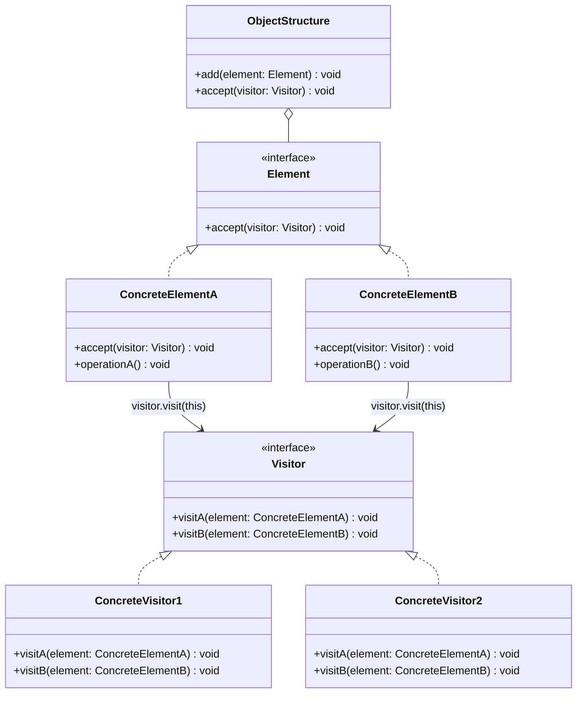
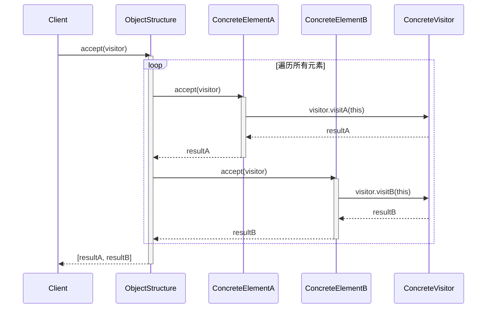
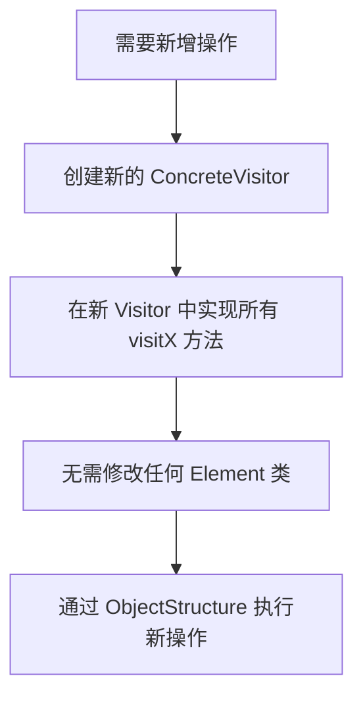
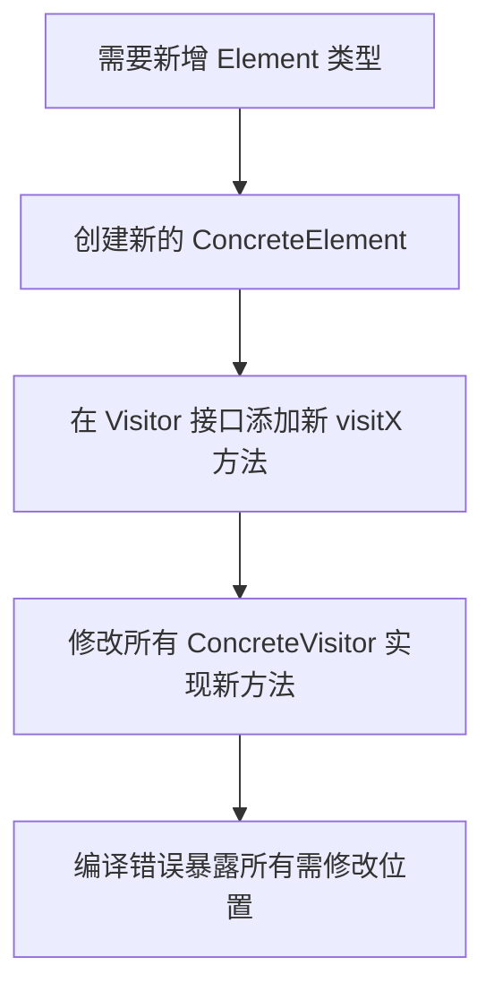

# 访问者模式

> 表示一个作用于某对象结构中的各元素的操作。它使你可以在不改变各元素的类的前提下定义作用于这些元素的新操作。 -- GoF

## 1. 定义与意图

访问者模式（Visitor Pattern）是一种行为型设计模式，核心思想是将**数据结构**与**作用于其上的操作**分离。通过在元素类中提供一个 `accept` 方法接受访问者，再由访问者根据元素的具体类型调用对应的 `visit` 方法，实现了在不修改元素类的前提下扩展新操作。

### 双分派机制（Double Dispatch）

访问者模式的核心技术是**双分派**，即通过两次动态分派来确定最终执行的方法：

1. **第一次分派**：客户端调用 `element.accept(visitor)`，根据 Element 的运行时类型分派到具体元素的 `accept` 方法。
2. **第二次分派**：在具体元素的 `accept` 方法内部，调用 `visitor.visit(this)`，此时 `this` 的编译时类型已明确，因此分派到 Visitor 中对应的重载 `visit` 方法。

```
┌─────────────────────────────────────────────────────────────┐
│                    双分派执行流程                           │
├─────────────────────────────────────────────────────────────┤
│                                                             │
│  Client                                                     │
│    │                                                        │
│    │ element.accept(visitor)                                │
│    ▼                                                        │
│  ┌──────────────────────────────────────────────┐           │
│  │  第一次分派：根据 Element 运行时类型          │           │
│  │  ConcreteElementA.accept(visitor)             │           │
│  │      │                                        │           │
│  │      │ visitor.visit(this)                    │           │
│  │      ▼                                        │           │
│  │  第二次分派：根据 this 编译时类型             │           │
│  │  ConcreteVisitor.visit(elementA: ElementA)    │           │
│  └──────────────────────────────────────────────┘           │
│                                                             │
│  结果：两次分派共同确定了最终执行的方法                     │
│                                                             │
└─────────────────────────────────────────────────────────────┘
```

### 适用性判断

| 条件 | 说明 |
|------|------|
| 数据结构稳定 | Element 类型不频繁变化 |
| 操作频繁扩展 | 需要经常新增对元素的操作 |
| 跨类操作 | 操作需要访问多种不同类型的元素 |
| 不愿修改元素类 | 希望在不改变元素类的前提下添加新行为 |

---

## 2. UML类图



---

## 3. 核心角色与职责

| 角色 | 职责 |
|------|------|
| **Visitor（访问者接口）** | 为每种 ConcreteElement 声明一个 visit 方法，方法的签名区分不同元素类型 |
| **ConcreteVisitor（具体访问者）** | 实现 Visitor 接口，每个 visit 方法实现针对特定元素类型的操作逻辑 |
| **Element（元素接口）** | 声明 accept 方法，接受一个 Visitor 对象作为参数 |
| **ConcreteElement（具体元素）** | 实现 accept 方法，在其中调用 `visitor.visit(this)`，通过 this 的编译时类型触发第二次分派 |
| **ObjectStructure（对象结构）** | 持有一组 Element 对象，提供遍历接口，允许 Visitor 依次访问所有元素 |

### 角色协作关系

```
┌─────────────────────────────────────────────────────────────┐
│                    角色协作关系                             │
├─────────────────────────────────────────────────────────────┤
│                                                             │
│  ObjectStructure                                            │
│    │                                                        │
│    │ 遍历 elements                                          │
│    ▼                                                        │
│  ┌───────────┐    ┌───────────┐                            │
│  │ Element A │    │ Element B │                            │
│  └─────┬─────┘    └─────┬─────┘                            │
│        │ accept(v)       │ accept(v)                       │
│        ▼                 ▼                                  │
│  ┌─────────────────────────────────────┐                   │
│  │           Visitor                   │                   │
│  ├─────────────────────────────────────┤                   │
│  │ + visitA(elementA) ── 操作 ElementA │                   │
│  │ + visitB(elementB) ── 操作 ElementB │                   │
│  └─────────────────────────────────────┘                   │
│                                                             │
│  新增操作：只需新增 ConcreteVisitor，无需修改 Element       │
│  新增元素：需修改所有 Visitor 接口和实现                    │
│                                                             │
└─────────────────────────────────────────────────────────────┘
```

---

## 4. 应用场景

### 4.1 通用场景

| 场景 | 说明 | 典型实现 |
|------|------|----------|
| **AST操作** | 编译器对语法树进行类型检查、代码生成、优化 | TypeScript Compiler, Babel |
| **编译器设计** | 词法分析、语法分析、语义分析各阶段作为不同 Visitor | LLVM Pass |
| **报表生成** | 同一数据结构生成不同格式的报表（HTML/PDF/CSV） | 企业报表系统 |
| **文档处理** | 对 XML/HTML DOM 树执行序列化、校验、变换 | DOM API |
| **图形编辑器** | 对图形元素执行导出、渲染、碰撞检测 | CAD 系统 |
| **序列化/反序列化** | 将对象结构序列化为不同格式 | Protocol Buffers |

### 4.2 前端框架实战

#### 4.2.1 TypeScript Compiler API

TypeScript 编译器内部大量使用访问者模式。`ts.visitEachChild` 接受一个 visitor 回调函数与 `TransformationContext`，遍历并转换 AST 节点。

#### 4.2.2 ESLint 规则

每条 ESLint 规则本质上就是一个 Visitor，遍历 AST 检查特定模式并报告问题。

#### 4.2.3 Babel 插件

Babel 插件通过 `visitor` 对象定义对特定节点类型的转换逻辑，这正是访问者模式的直接应用。

#### 4.2.4 JSON Schema 遍历

校验器作为 Visitor 遍历 Schema 结构，对每种 Schema 关键字执行校验逻辑。

---

## 5. Mermaid流程图

### 双分派流程时序图



### 新增操作流程



### 新增元素类型流程



---

## 6. 优缺点分析

### 优点

| 优点 | 说明 |
|------|------|
| **新增操作不修改元素类** | 新增操作只需添加新的 Visitor 实现，符合开闭原则（操作维度） |
| **相关操作集中管理** | 同一操作逻辑集中在同一个 Visitor 类中，而非分散在各个 Element 中 |
| **符合单一职责原则** | 每个 Visitor 只负责一种操作，每个 Element 只负责自身数据结构 |
| **灵活组合操作** | 可以在运行时组合不同的 Visitor，甚至实现 Visitor 链式调用 |
| **累积状态** | Visitor 在遍历过程中可以方便地累积状态（如求和、收集列表） |

### 缺点

| 缺点 | 说明 |
|------|------|
| **新增 Element 类型困难** | 新增元素类型需修改 Visitor 接口及所有 ConcreteVisitor，违反开闭原则（元素维度） |
| **破坏封装** | Visitor 需要访问 Element 的内部状态才能执行操作，可能需要暴露原本私有的字段 |
| **双分派复杂** | 两次分派机制增加了理解和调试的难度 |
| **循环依赖** | Visitor 接口依赖所有 Element 类型，Element 的 accept 又依赖 Visitor 接口，形成循环依赖 |
| **不易支持递归结构** | 对于递归嵌套的数据结构（如树），Visitor 需要自行处理递归遍历逻辑 |

### 适用性决策矩阵

```
┌─────────────────────────────────────────────────────────────┐
│                    适用性决策矩阵                           │
├─────────────────────────────────────────────────────────────┤
│                                                             │
│  元素类型稳定 & 操作频繁变化 ── 强烈推荐使用访问者模式     │
│                                                             │
│  元素类型稳定 & 操作稳定 ── 访问者模式可能过度设计         │
│                                                             │
│  元素类型频繁变化 & 操作稳定 ── 不推荐，改用策略模式       │
│                                                             │
│  元素类型频繁变化 & 操作频繁变化 ── 不推荐，考虑重构       │
│                                                             │
└─────────────────────────────────────────────────────────────┘
```

---

## 7. 相关模式对比

### 访问者模式 vs 解释器模式

| 对比维度 | 访问者模式 | 解释器模式 |
|----------|-----------|-----------|
| **意图** | 操作与数据结构分离 | 解释执行语法规则 |
| **扩展方向** | 新增操作容易，新增元素类型困难 | 新增语法规则容易，新增操作困难 |
| **结构** | Visitor 遍历 Element 结构 | 每个语法规则对应一个 Expression 类 |
| **关系** | 常与解释器模式配合，在 AST 上执行多种操作 | 解释器可使用访问者实现不同求值策略 |

### 访问者模式 vs 迭代器模式

| 对比维度 | 访问者模式 | 迭代器模式 |
|----------|-----------|-----------|
| **意图** | 在不改变元素类的前提下定义新操作 | 顺序访问集合中的元素，不暴露内部结构 |
| **关注点** | 对元素执行什么操作 | 如何遍历元素 |
| **类型感知** | Visitor 知道每个元素的具体类型 | 迭代器不关心元素的具体类型 |
| **关系** | 访问者通常借助迭代器遍历对象结构 | 迭代器是访问者遍历的基础设施 |

### 访问者模式 vs 组合模式

| 对比维度 | 访问者模式 | 组合模式 |
|----------|-----------|---------|
| **意图** | 操作与数据结构分离 | 统一处理树形结构中的单个对象和组合对象 |
| **结构** | Visitor + Element 双分派 | Component + Leaf + Composite 递归结构 |
| **关系** | 访问者常与组合模式配合，Visitor 遍历 Composite 树 | 组合模式提供 Visitor 可遍历的对象结构 |

### 访问者模式 vs 命令模式

| 对比维度 | 访问者模式 | 命令模式 |
|----------|-----------|---------|
| **意图** | 对结构中的元素执行操作 | 将请求封装为对象 |
| **操作对象** | 一组不同类型的元素 | 单个接收者 |
| **可撤销** | 不直接支持撤销 | 命令可存储状态支持撤销/重做 |
| **关系** | 访问者的一次遍历可视为一组命令的执行 | 命令可触发访问者执行 |

---

## 8. 总结

访问者模式通过双分派机制实现了**操作与数据结构的解耦**，在元素类型稳定而操作频繁变化的场景中具有显著优势。

### 核心要点

```
┌─────────────────────────────────────────────────────────────┐
│                    访问者模式要点总结                       │
├─────────────────────────────────────────────────────────────┤
│                                                             │
│  核心机制                                                    │
│  - 双分派：element.accept(v) -> v.visit(this)               │
│  - 第一次分派确定 Element 具体类型                          │
│  - 第二次分派确定 Visitor 中对应的 visit 方法               │
│                                                             │
│  使用时机                                                    │
│  - Element 类型稳定，操作频繁扩展                           │
│  - 需要跨多种 Element 类型执行操作                          │
│  - 不愿为新增操作修改 Element 类                            │
│                                                             │
│  注意事项                                                    │
│  - 新增 Element 类型需修改所有 Visitor                      │
│  - Visitor 可能需要访问 Element 内部状态                    │
│  - 递归结构中 Visitor 需自行处理遍历逻辑                    │
│  - TypeScript 中可用 Discriminated Union + never 实现穷尽检查│
│                                                             │
│  前端典型应用                                                │
│  - TypeScript Compiler: ts.visitEachChild                   │
│  - ESLint 规则：每个 Rule 是一个 Visitor                    │
│  - Babel 插件：visitor 对象定义节点变换                     │
│  - JSON Schema 校验：校验器遍历 Schema 结构                 │
│                                                             │
└─────────────────────────────────────────────────────────────┘
```

### 实现方式选择

| 实现方式 | 适用场景 | 优势 |
|----------|---------|------|
| **经典类式访问者** | 元素类型固定、需要多种操作 | 结构清晰、OCP友好 |
| **Discriminated Union** | TypeScript 项目、追求类型安全 | 编译器穷尽检查、无运行时开销 |
| **函数式访问者** | 纯函数偏好、需要组合变换 | 轻量、易测试、可组合 |
| **泛型访问者** | 多种返回类型、高复用需求 | 类型灵活、可复用分派逻辑 |

> 访问者模式是编译器与前端工具链中最为常见的设计模式之一。理解其双分派机制与扩展方向的不对称性，是正确运用该模式的关键。在 TypeScript 中，结合 Discriminated Union 与 `never` 类型可实现编译时穷尽检查，为访问者模式提供了更安全的现代化实现路径。

---

## TypeScript 实现

### 基础实现：AST节点访问器

以抽象语法树（AST）为经典场景，定义两种节点类型 `NumberNode` 和 `BinaryExpressionNode`，以及两种访问者 `EvaluatorVisitor`（计算值）和 `PrinterVisitor`（输出字符串）。

```typescript
// ============================================================
// 基础实现：AST 节点访问器
// ============================================================

// --- Element 接口 ---

interface ASTNode {
  accept<T>(visitor: ASTVisitor<T>): T;
}

// --- Visitor 接口 ---
interface ASTVisitor<T> {
  visitNumber(node: NumberNode): T;
  visitBinaryExpr(node: BinaryExpressionNode): T;
}

// --- ConcreteElement ---
class NumberNode implements ASTNode {
  constructor(public readonly value: number) {}
  accept<T>(visitor: ASTVisitor<T>): T { return visitor.visitNumber(this); }
}

class BinaryExpressionNode implements ASTNode {
  constructor(
    public readonly op: '+' | '-' | '*' | '/',
    public readonly left: ASTNode,
    public readonly right: ASTNode
  ) {}
  accept<T>(visitor: ASTVisitor<T>): T { return visitor.visitBinaryExpr(this); }
}

// --- ObjectStructure ---
class ASTProgram {
  private nodes: ASTNode[] = [];
  add(node: ASTNode): this { this.nodes.push(node); return this; }
  accept<T>(visitor: ASTVisitor<T>): T[] { return this.nodes.map((node) => node.accept(visitor)); }
}

// --- ConcreteVisitor1: 求值 ---
class EvaluatorVisitor implements ASTVisitor<number> {
  visitNumber(node: NumberNode): number { return node.value; }
  visitBinaryExpr(node: BinaryExpressionNode): number {
    const left = node.left.accept(this);
    const right = node.right.accept(this);
    switch (node.op) {
      case '+': return left + right;
      case '-': return left - right;
      case '*': return left * right;
      case '/': return left / right;
    }
  }
}

// --- ConcreteVisitor2: 打印 ---
class PrinterVisitor implements ASTVisitor<string> {
  visitNumber(node: NumberNode): string { return String(node.value); }
  visitBinaryExpr(node: BinaryExpressionNode): string {
    return `(${node.left.accept(this)} ${node.op} ${node.right.accept(this)})`;
  }
}

// --- 使用 ---
const evaluator = new EvaluatorVisitor();
const printer = new PrinterVisitor();
const expression = new BinaryExpressionNode('*',
  new BinaryExpressionNode('+', new NumberNode(1), new NumberNode(2)),
  new NumberNode(3)
);

const program = new ASTProgram();
program.add(new NumberNode(42));
program.add(expression);

console.log(program.accept(evaluator)); // [42, 9]
console.log(program.accept(printer));   // ['42', '((1 + 2) * 3)']
```

### 现代TypeScript实现

#### 泛型访问者

通过泛型参数 `TResult` 构建类型安全的访问者接口，支持以不同返回类型复用同一 `visit` 分派逻辑。

```typescript
// ============================================================
// 泛型访问者
// ============================================================

// 节点类型枚举
enum ASTNodeType {
  Number = 'Number',
  BinaryExpression = 'BinaryExpression',
  Identifier = 'Identifier',
  CallExpression = 'CallExpression',
}

// 泛型访问者接口：TNode 输入类型，TResult 返回类型
interface TypedVisitor<TResult> {
  visit(node: { type: ASTNodeType; [key: string]: unknown }): TResult;
}

// 具体访问者：类型检查器
class TypeCheckerVisitor implements TypedVisitor<string> {
  visit(node: { type: ASTNodeType; [key: string]: unknown }): string {
    switch (node.type) {
      case ASTNodeType.Number: return 'number';
      case ASTNodeType.Identifier: return 'unknown';
      case ASTNodeType.BinaryExpression: return 'number';
      case ASTNodeType.CallExpression: return 'number';
      default: return 'void';
    }
  }
}

// 使用
const checker = new TypeCheckerVisitor();
const callNode = {
  type: ASTNodeType.CallExpression,
  callee: { type: ASTNodeType.Identifier, name: 'add' },
  args: [
    { type: ASTNodeType.Identifier, name: 'x' },
    { type: ASTNodeType.Number, value: 1 },
  ],
};

console.log(checker.visit(callNode)); // 'number'
```

#### Discriminated Union + 类型收窄实现类型安全的visit

利用 TypeScript 的 Discriminated Union 和 `never` 类型实现穷尽检查，确保新增节点类型时编译器强制要求处理所有分支。

```typescript
// ============================================================
// Discriminated Union + 类型收窄
// ============================================================

// 节点 Discriminated Union 定义
type ExprNode =
  | { kind: 'number'; value: number }
  | { kind: 'binary'; op: '+' | '-' | '*' | '/'; left: ExprNode; right: ExprNode }
  | { kind: 'conditional'; condition: ExprNode; then: ExprNode; else: ExprNode }
  | { kind: 'unary'; op: '-' | '!'; operand: ExprNode };

// 穷尽检查辅助函数：确保 switch 覆盖所有分支
function assertNever(x: never): never {
  throw new Error(`Unexpected node: ${JSON.stringify(x)}`);
}

// 求值访问者
function evaluateExpr(node: ExprNode): number {
  switch (node.kind) {
    case 'number': return node.value;
    case 'binary':
      const left = evaluateExpr(node.left);
      const right = evaluateExpr(node.right);
      switch (node.op) {
        case '+': return left + right;
        case '-': return left - right;
        case '*': return left * right;
        case '/': return left / right;
      }
    case 'conditional':
      return evaluateExpr(node.condition) ? evaluateExpr(node.then) : evaluateExpr(node.else);
    case 'unary':
      if (node.op === '-') return -evaluateExpr(node.operand);
      return evaluateExpr(node.operand) ? 0 : 1;
    default: return assertNever(node);
  }
}

// 字符串化访问者
function stringifyExpr(node: ExprNode): string {
  switch (node.kind) {
    case 'number': return String(node.value);
    case 'binary': return `(${stringifyExpr(node.left)} ${node.op} ${stringifyExpr(node.right)})`;
    case 'conditional': return `${stringifyExpr(node.condition)} ? ${stringifyExpr(node.then)} : ${stringifyExpr(node.else)}`;
    case 'unary': return `${node.op}${stringifyExpr(node.operand)}`;
    default: return assertNever(node);
  }
}

// 使用
const expr: ExprNode = {
  kind: 'conditional',
  condition: { kind: 'unary', op: '!', operand: { kind: 'number', value: 0 } },
  then: { kind: 'binary', op: '+', left: { kind: 'number', value: 1 }, right: { kind: 'number', value: 2 } },
  else: { kind: 'number', value: 0 },
};

console.log(evaluateExpr(expr));   // 3
console.log(stringifyExpr(expr));  // !0 ? (1 + 2) : 0
```

#### 函数式访问者：递归遍历AST的transform函数

以纯函数方式实现 AST 变换，无需类和接口，仅通过高阶函数组合访问逻辑。

```typescript
// ============================================================
// 函数式访问者
// ============================================================

type FuncNode =
  | { kind: 'number'; value: number }
  | { kind: 'add'; left: FuncNode; right: FuncNode }
  | { kind: 'multiply'; left: FuncNode; right: FuncNode };

// 通用 transform 函数：接收一个部分访问者映射，返回变换后的节点
type PartialVisitor<T> = {
  [K in FuncNode['kind']]?: (node: Extract<FuncNode, { kind: K }>) => T;
};

function visit<T>(node: FuncNode, visitor: PartialVisitor<T>): T {
  const fn = visitor[node.kind];
  if (!fn) throw new Error(`未处理的节点类型: ${node.kind}`);
  return (fn as (n: FuncNode) => T)(node);
}

// 求值
const evaluate = (node: FuncNode): number => visit<number>(node, {
  number: (n) => n.value,
  add: (n) => evaluate(n.left) + evaluate(n.right),
  multiply: (n) => evaluate(n.left) * evaluate(n.right),
});

// 深度
const depth = (node: FuncNode): number => visit<number>(node, {
  number: () => 1,
  add: (n) => 1 + Math.max(depth(n.left), depth(n.right)),
  multiply: (n) => 1 + Math.max(depth(n.left), depth(n.right)),
});

// 常量折叠
const constantFold = (node: FuncNode): FuncNode => visit<FuncNode>(node, {
  number: (n) => n,
  add: (n) => {
    const left = constantFold(n.left);
    const right = constantFold(n.right);
    return left.kind === 'number' && right.kind === 'number'
      ? { kind: 'number', value: left.value + right.value }
      : { kind: 'add', left, right };
  },
  multiply: (n) => {
    const left = constantFold(n.left);
    const right = constantFold(n.right);
    return left.kind === 'number' && right.kind === 'number'
      ? { kind: 'number', value: left.value * right.value }
      : { kind: 'multiply', left, right };
  },
});

// 使用
const expr2: FuncNode = {
  kind: 'add',
  left: { kind: 'multiply', left: { kind: 'number', value: 2 }, right: { kind: 'number', value: 3 } },
  right: { kind: 'number', value: 4 },
};

console.log(evaluate(expr2));     // 10
console.log(depth(expr2));        // 3
console.log(constantFold(expr2)); // { kind: 'number', value: 10 }
```

### 扩展实现：带状态与组合的访问者

```typescript
// ============================================================
// 扩展实现：带状态与组合的访问者
// ============================================================

// 文件系统节点
interface FSNode {
  accept<T>(visitor: FSVisitor<T>): T;
}

class FileNode implements FSNode {
  constructor(
    public readonly name: string,
    public readonly size: number
  ) {}
  accept<T>(visitor: FSVisitor<T>): T { return visitor.visitFile(this); }
}

class DirectoryNode implements FSNode {
  private children: FSNode[] = [];
  constructor(public readonly name: string) {}
  add(node: FSNode): this { this.children.push(node); return this; }
  getChildren(): FSNode[] { return this.children; }
  accept<T>(visitor: FSVisitor<T>): T { return visitor.visitDirectory(this); }
}

// Visitor 接口
interface FSVisitor<T> {
  visitFile(file: FileNode): T;
  visitDirectory(dir: DirectoryNode): T;
}

// 访问者1：计算总大小
class SizeVisitor implements FSVisitor<number> {
  visitFile(file: FileNode): number { return file.size; }
  visitDirectory(dir: DirectoryNode): number {
    return dir.getChildren().reduce((sum, child) => sum + child.accept(this), 0);
  }
}

// 访问者2：打印树形结构
class PrintVisitor implements FSVisitor<string> {
  constructor(private indent = 0) {}
  visitFile(file: FileNode): string {
    return `${'  '.repeat(this.indent)}- ${file.name} (${file.size}KB)`;
  }
  visitDirectory(dir: DirectoryNode): string {
    const lines = [`${'  '.repeat(this.indent)}+ ${dir.name}/`];
    const visitor = new PrintVisitor(this.indent + 1);
    dir.getChildren().forEach((child) => lines.push(child.accept(visitor)));
    return lines.join('\n');
  }
}

// 使用
const root = new DirectoryNode('src');
const utils = new DirectoryNode('utils');
utils.add(new FileNode('helpers.ts', 3)).add(new FileNode('math.ts', 2));
const components = new DirectoryNode('components');
components.add(new FileNode('Button.tsx', 8)).add(new FileNode('Input.tsx', 6));
root.add(utils).add(components).add(new FileNode('index.ts', 1));

console.log(root.accept(new PrintVisitor()));
// + src/
//   + utils/
//     - helpers.ts (3KB)
//     - math.ts (2KB)
//   + components/
//     - Button.tsx (8KB)
//     - Input.tsx (6KB)
//   - index.ts (1KB)
console.log(`总大小: ${root.accept(new SizeVisitor())}KB`);
```

---

```typescript
// TypeScript Compiler API 中的访问者模式
import * as ts from 'typescript';

// 自定义 Transformer：将所有标识符转为大写
function uppercaseTransformer(context: ts.TransformationContext): ts.Transformer<ts.SourceFile> {
  return (sourceFile: ts.SourceFile) => {
    // Visitor 函数：对每种节点类型定义变换逻辑
    function visitor(node: ts.Node): ts.Node {
      if (ts.isIdentifier(node)) {
        // 对 Identifier 节点执行变换
        return ts.factory.createIdentifier(node.text.toUpperCase());
      }
      // 递归访问子节点
      return ts.visitEachChild(node, visitor, context);
    }
    return ts.visitNode(sourceFile, visitor) as ts.SourceFile;
  };
}
```

```typescript
// ESLint 规则本质上是 Visitor
// 简化的类型定义与规则结构（示意）
interface RuleContext {
  report(info: { node: unknown; message: string }): void;
}
type ASTVisitor = Record<string, (node: any) => void>;

interface ESLintRule {
  create(context: RuleContext): ASTVisitor;
}

// 示例：禁止使用 console.log 的规则
const noConsoleLogRule: ESLintRule = {
  create(context) {
    return {
      // visit CallExpression 节点
      CallExpression(node) {
        if (
          node.callee.type === 'MemberExpression' &&
          node.callee.object.type === 'Identifier' &&
          node.callee.object.name === 'console' &&
          node.callee.property.type === 'Identifier' &&
          node.callee.property.name === 'log'
        ) {
          context.report({
            node,
            message: 'Unexpected console.log call.',
          });
        }
      },
    };
  },
};
```

```typescript
// Babel 插件中的 Visitor
import type { PluginObject } from '@babel/core';

const arrowFunctionPlugin: PluginObject = {
  name: 'transform-arrow-functions',
  visitor: {
    // 访问 ArrowFunctionExpression 节点
    ArrowFunctionExpression(path) {
      // 将箭头函数转换为普通函数
      const { node } = path;
      if (!node.body.type.endsWith('Expression')) {
        return; // 函数体已是块语句，无需转换
      }

      // 将表达式体的箭头函数转换为普通函数（Babel 内置转换能力）
      path.arrowFunctionToExpression();
    },
  },
};
```

```typescript
// JSON Schema 校验器作为 Visitor
interface SchemaNode {
  type?: string;
  properties?: Record<string, SchemaNode>;
  items?: SchemaNode;
  required?: string[];
  minimum?: number;
  maximum?: number;
  [key: string]: unknown;
}

interface SchemaVisitor<T> {
  visitObject(schema: SchemaNode, data: Record<string, unknown>): T;
  visitArray(schema: SchemaNode, data: unknown[]): T;
  visitString(schema: SchemaNode, data: string): T;
  visitNumber(schema: SchemaNode, data: number): T;
  visitBoolean(schema: SchemaNode, data: boolean): T;
  visitType(schema: SchemaNode, data: unknown): T;
}

// 具体访问者：JSON Schema 校验器
class SchemaValidator implements SchemaVisitor<boolean> {
  visitObject(schema: SchemaNode, data: Record<string, unknown>): boolean {
    if (!schema.properties) return true;
    return Object.entries(schema.properties).every(([key, childSchema]) =>
      key in data ? this.visitType(childSchema, data[key]) : !schema.required?.includes(key)
    );
  }
  visitArray(schema: SchemaNode, data: unknown[]): boolean {
    const items = schema.items;
    if (!items) return true;
    return data.every((item) => this.visitType(items, item));
  }
  visitString(_schema: SchemaNode, _data: string): boolean { return true; }
  visitNumber(schema: SchemaNode, data: number): boolean {
    if (schema.minimum !== undefined && data < schema.minimum) return false;
    if (schema.maximum !== undefined && data > schema.maximum) return false;
    return true;
  }
  visitBoolean(_schema: SchemaNode, _data: boolean): boolean { return true; }
  visitType(schema: SchemaNode, data: unknown): boolean {
    switch (schema.type) {
      case 'object':
        return this.visitObject(schema, data as Record<string, unknown>);
      case 'array':
        return this.visitArray(schema, data as unknown[]);
      case 'string':
        return this.visitString(schema, data as string);
      case 'number':
        return this.visitNumber(schema, data as number);
      case 'boolean':
        return this.visitBoolean(schema, data as boolean);
      default:
        return true;
    }
  }
}
```

```typescript
// 解释器模式：操作内嵌在元素中
interface Expr {
  interpret(): number;
}

class AddExpr implements Expr {
  constructor(private left: Expr, private right: Expr) {}
  interpret(): number {
    return this.left.interpret() + this.right.interpret();
  }
}

// 访问者模式：操作与元素分离
interface ExprNode3 {
  accept<T>(v: ExprVisitor3<T>): T;
}

interface ExprVisitor3<T> {
  visitNum(node: NumNode): T;
  visitAdd(node: AddNode3): T;
}

class AddNode3 implements ExprNode3 {
  constructor(public left: ExprNode3, public right: ExprNode3) {}
  accept<T>(v: ExprVisitor3<T>): T { return v.visitAdd(this); }
}

class NumNode implements ExprNode3 {
  constructor(public value: number) {}
  accept<T>(v: ExprVisitor3<T>): T {
    return v.visitNum(this);
  }
}

// 求值访问者：新增操作无需修改节点类
class EvalVisitor3 implements ExprVisitor3<number> {
  visitNum(node: NumNode): number { return node.value; }
  visitAdd(node: AddNode3): number { return node.left.accept(this) + node.right.accept(this); }
}
```

```typescript
// 组合模式 + 访问者模式配合
// 组合模式定义树形结构，访问者模式定义对树的操作

interface Shape {
  accept<T>(visitor: ShapeVisitor<T>): T;
}

class Circle implements Shape {
  constructor(public radius: number) {}
  accept<T>(visitor: ShapeVisitor<T>): T {
    return visitor.visitCircle(this);
  }
}

class Rectangle implements Shape {
  constructor(public width: number, public height: number) {}
  accept<T>(visitor: ShapeVisitor<T>): T {
    return visitor.visitRectangle(this);
  }
}

// Composite：图形组
class Group implements Shape {
  constructor(public shapes: Shape[]) {}
  accept<T>(visitor: ShapeVisitor<T>): T {
    return visitor.visitGroup(this);
  }
}

interface ShapeVisitor<T> {
  visitCircle(c: Circle): T;
  visitRectangle(r: Rectangle): T;
  visitGroup(g: Group): T;
}

// 面积访问者
class AreaVisitor implements ShapeVisitor<number> {
  visitCircle(c: Circle): number { return Math.PI * c.radius * c.radius; }
  visitRectangle(r: Rectangle): number {
    return r.width * r.height;
  }
  visitGroup(g: Group): number {
    return g.shapes.reduce((sum, s) => sum + s.accept(this), 0);
  }
}
```

---

## Java 实现

### 访问者模式（不改元素类，新增对元素的操作）

```java
// 元素接口：接受访问者（双重分派入口）
interface Element {
    void accept(Visitor visitor);
}

// 具体元素：文件
class File implements Element {
    private final String name;
    private final int size;

    public File(String name, int size) {
        this.name = name;
        this.size = size;
    }

    public String getName() { return name; }
    public int getSize() { return size; }

    @Override
    public void accept(Visitor visitor) {
        visitor.visit(this);  // 把自身传给访问者（触发第二次分派）
    }
}

// 具体元素：目录
class Directory implements Element {
    private final String name;

    public Directory(String name) {
        this.name = name;
    }

    public String getName() { return name; }

    @Override
    public void accept(Visitor visitor) {
        visitor.visit(this);  // 第二次分派到具体 visit 重载
    }
}

// 访问者接口：每种元素对应一个 visit 重载
interface Visitor {
    void visit(File file);
    void visit(Directory directory);
}

// 具体访问者：打印信息（新增操作无需修改 Element）
class PrintVisitor implements Visitor {
    @Override
    public void visit(File file) {
        System.out.println("文件: " + file.getName() + " (" + file.getSize() + "B)");
    }

    @Override
    public void visit(Directory directory) {
        System.out.println("目录: " + directory.getName());
    }
}

// 使用
public class Client {
    public static void main(String[] args) {
        Element[] elements = {
                new File("a.txt", 100),
                new Directory("src")
        };
        Visitor printer = new PrintVisitor();
        for (Element element : elements) {
            element.accept(printer);  // 双重分派
        }
    }
}
```

> 访问者模式通过双重分派，在不修改元素类的前提下新增操作（访问者）。适合元素结构稳定、操作频繁变化的场景。缺点是新增元素类需修改所有访问者。Java 的 `javax.lang.model.element.Element`（注解处理）是其典型应用。

## Python 实现

### 访问者模式

```python
from abc import ABC, abstractmethod

class Element(ABC):
    @abstractmethod
    def accept(self, visitor: "Visitor"):
        pass

class File(Element):
    def __init__(self, name: str, size: int):
        self.name = name
        self.size = size

    def accept(self, visitor: "Visitor"):
        visitor.visit_file(self)

class Directory(Element):
    def __init__(self, name: str):
        self.name = name

    def accept(self, visitor: "Visitor"):
        visitor.visit_directory(self)

class Visitor(ABC):
    @abstractmethod
    def visit_file(self, file: File):
        pass

    @abstractmethod
    def visit_directory(self, directory: Directory):
        pass

class PrintVisitor(Visitor):
    def visit_file(self, file: File):
        print(f"文件: {file.name} ({file.size}B)")

    def visit_directory(self, directory: Directory):
        print(f"目录: {directory.name}")

elements = [File("a.txt", 100), Directory("src")]
printer = PrintVisitor()
for element in elements:
    element.accept(printer)
```

> Python 中访问者模式通常用 `visit_xxx` 命名方法代替重载（Python 不支持方法重载）。也可用 `functools.singledispatch` 实现单分派访问。访问者模式适合"元素稳定、操作多变"的场景，如 AST 遍历、文件系统扫描。

