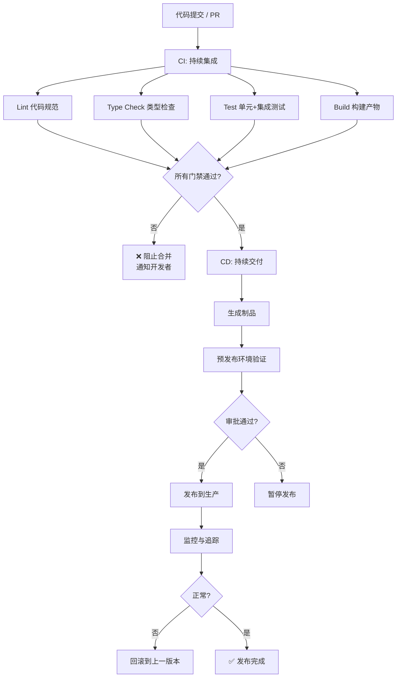
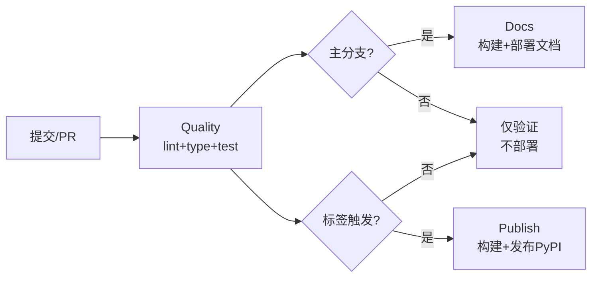
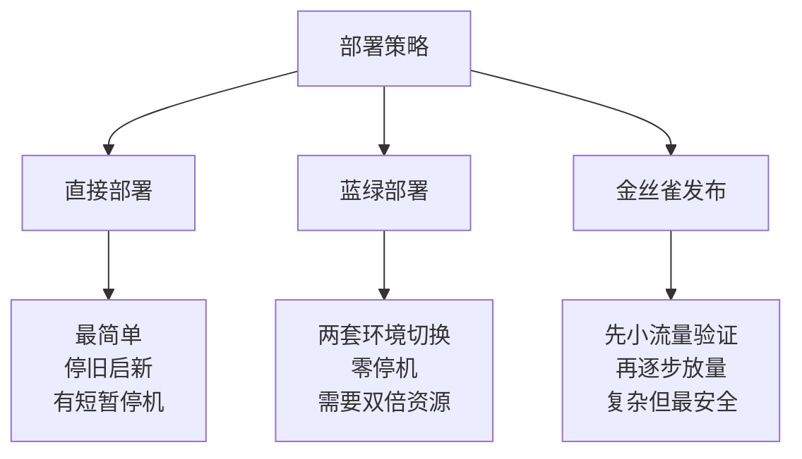
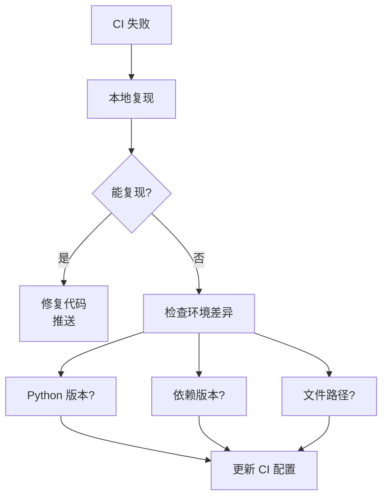

# CI/CD

CI/CD 的目标是把重复、容易漏掉的工程动作交给自动化流程执行，例如格式检查、类型检查、测试和构建。它的核心价值不是"炫"，而是减少人为疏漏，让每次提交都更可预测。

> 阅读提示

- 如果你只想快速搭一个 CI，直接看 [最小 CI 流水线](#最小-ci-流水线)
- 如果你想了解完整 CI/CD 流程设计，从 [CI/CD 流程全景](#cicd-流程全景)开始
- 如果你遇到 CI 失败，查看 [常见失败与排查](#常见失败与排查)
- 本文以 **GitHub Actions** 为主，Python 3.12+ 项目

## CI/CD 流程全景



## 最小 CI 流水线

一个 Python 项目最小可接受的 CI 流程至少包括：lint、type check、test、build。

```yaml
# .github/workflows/ci.yml
name: CI

on:
  push:
    branches: [main]
  pull_request:

jobs:
  quality:
    runs-on: ubuntu-latest

    steps:
      - uses: actions/checkout@v4

      - uses: actions/setup-python@v5
        with:
          python-version: "3.12"

      - name: Install dependencies
        run: |
          python -m pip install --upgrade pip
          pip install -e ".[dev]"

      - name: Lint
        run: ruff check .

      - name: Type check
        run: mypy src

      - name: Test
        run: pytest --cov=src --cov-report=term-missing

      - name: Build
        run: python -m build
```

::: tip 本地和 CI 用同一套命令
流水线应该尽量复用本地同一套命令，避免本地一套、CI 一套，最后谁都不信谁。`pip install -e ".[dev]"` + `ruff check .` + `mypy src` + `pytest` + `python -m build` —— 这套命令本地和 CI 完全一致。
:::

## 进阶流水线

### 多版本测试矩阵

```yaml
jobs:
  test:
    runs-on: ubuntu-latest
    strategy:
      fail-fast: false  # 一个版本失败不影响其他版本继续
      matrix:
        python-version: ["3.12", "3.13"]
        os: [ubuntu-latest, macos-latest]  # 可选：跨操作系统

    steps:
      - uses: actions/checkout@v4

      - uses: actions/setup-python@v5
        with:
          python-version: ${{ matrix.python-version }}

      - name: Install dependencies
        run: pip install -e ".[dev]"

      - name: Lint
        run: ruff check .

      - name: Type check
        run: mypy src

      - name: Test
        run: pytest --cov=src

      - name: Build
        run: python -m build
```

::: warning 测试矩阵不要过度
初期先单版本（3.12），稳定后再扩展到 3.13。版本越多反馈越慢，不要一开始就把矩阵堆得像圣诞树。
:::

### 分阶段流水线：质量 → 文档 → 发布

```yaml
name: pipeline

on:
  push:
    branches: [main]
  pull_request:

jobs:
  # 阶段一：代码质量门禁
  quality:
    runs-on: ubuntu-latest
    steps:
      - uses: actions/checkout@v4
      - uses: actions/setup-python@v5
        with:
          python-version: "3.12"
      - run: pip install -e ".[dev]"
      - run: ruff check .
      - run: mypy src
      - run: pytest --cov=src

  # 阶段二：文档构建（仅主分支）
  docs:
    runs-on: ubuntu-latest
    needs: quality
    if: github.ref == 'refs/heads/main'
    steps:
      - uses: actions/checkout@v4
      - uses: actions/setup-node@v4
        with:
          node-version: "20"
      - run: npm ci
      - run: npm run build
      - name: Deploy docs
        uses: peaceiris/actions-gh-pages@v4
        with:
          github_token: ${{ secrets.GITHUB_TOKEN }}
          publish_dir: ./docs/.vitepress/dist

  # 阶段三：发布（仅标签触发）
  publish:
    runs-on: ubuntu-latest
    needs: quality
    if: startsWith(github.ref, 'refs/tags/v')
    permissions:
      id-token: write  # Trusted Publishing
    steps:
      - uses: actions/checkout@v4
      - uses: actions/setup-python@v5
        with:
          python-version: "3.12"
      - run: pip install build
      - run: python -m build
      - name: Publish to PyPI
        uses: pypa/gh-action-pypi-publish@release/v1
```



## CI 门禁配置

### 代码规范（Ruff）

```toml
# pyproject.toml
[tool.ruff]
line-length = 100
target-version = "py312"

[tool.ruff.lint]
select = [
    "E",    # pycodestyle errors
    "W",    # pycodestyle warnings
    "F",    # Pyflakes
    "I",    # isort
    "N",    # pep8-naming
    "UP",   # pyupgrade
    "B",    # flake8-bugbear
    "SIM",  # flake8-simplify
    "RUF",  # Ruff-specific rules
]
ignore = ["E501"]  # 行长度由 formatter 处理

[tool.ruff.format]
quote-style = "double"
```

### 类型检查（mypy）

```toml
# pyproject.toml
[tool.mypy]
python_version = "3.12"
warn_return_any = true
warn_unused_configs = true
disallow_untyped_defs = true
check_untyped_defs = true
no_implicit_optional = true
strict = true

[[tool.mypy.overrides]]
module = "tests.*"
disallow_untyped_defs = false  # 测试代码不需要严格注解
```

### 测试（pytest）

```toml
# pyproject.toml
[tool.pytest.ini_options]
testpaths = ["tests"]
addopts = "-v --tb=short --strict-markers"
markers = [
    "slow: 慢测试",
    "integration: 集成测试",
]

[tool.coverage.run]
source = ["src"]
omit = ["tests/*"]

[tool.coverage.report]
fail_under = 80
show_missing = true
```

### 分支保护规则

在 GitHub 仓库设置中配置：

1. **Require status checks to pass before merging**：勾选所有 CI job
2. **Require branches to be up to date before merging**：确保 PR 基于最新代码
3. **Require signed commits**（可选）：防止伪造提交
4. **Do not allow bypassing the above settings**：管理员也不能绕过

## 实战场景

### 场景一：Python 包项目的完整 CI/CD

```yaml
# .github/workflows/ci-cd.yml
name: CI/CD

on:
  push:
    branches: [main]
  pull_request:
  release:
    types: [published]

jobs:
  # --- CI 阶段 ---
  lint:
    runs-on: ubuntu-latest
    steps:
      - uses: actions/checkout@v4
      - uses: actions/setup-python@v5
        with:
          python-version: "3.12"
      - run: pip install ruff
      - run: ruff check .
      - run: ruff format --check .

  typecheck:
    runs-on: ubuntu-latest
    steps:
      - uses: actions/checkout@v4
      - uses: actions/setup-python@v5
        with:
          python-version: "3.12"
      - run: pip install -e ".[dev]"
      - run: mypy src

  test:
    runs-on: ubuntu-latest
    strategy:
      fail-fast: false
      matrix:
        python-version: ["3.12", "3.13"]
    steps:
      - uses: actions/checkout@v4
      - uses: actions/setup-python@v5
        with:
          python-version: ${{ matrix.python-version }}
      - run: pip install -e ".[dev]"
      - run: pytest --cov=src --cov-report=xml
      - uses: codecov/codecov-action@v4
        with:
          token: ${{ secrets.CODECOV_TOKEN }}

  build:
    runs-on: ubuntu-latest
    needs: [lint, typecheck, test]
    steps:
      - uses: actions/checkout@v4
      - uses: actions/setup-python@v5
        with:
          python-version: "3.12"
      - run: pip install build
      - run: python -m build
      - uses: actions/upload-artifact@v4
        with:
          name: dist
          path: dist/

  # --- CD 阶段 ---
  publish:
    runs-on: ubuntu-latest
    needs: build
    if: github.event_name == 'release'
    permissions:
      id-token: write
    steps:
      - uses: actions/download-artifact@v4
        with:
          name: dist
          path: dist/
      - name: Publish to PyPI
        uses: pypa/gh-action-pypi-publish@release/v1
```

### 场景二：安全审计自动化

```yaml
  # 添加到 CI 流水线中
  security:
    runs-on: ubuntu-latest
    steps:
      - uses: actions/checkout@v4
      - uses: actions/setup-python@v5
        with:
          python-version: "3.12"
      - run: pip install pip-audit safety

      - name: Check dependencies for known vulnerabilities
        run: pip-audit

      - name: Safety check
        run: safety check --json
```

### 场景三：定时任务 — 依赖升级检测

```yaml
# .github/workflows/dependency-update.yml
name: Dependency Update Check

on:
  schedule:
    - cron: '3 9 * * 1'  # 每周一早上 9:03（UTC）

jobs:
  check-updates:
    runs-on: ubuntu-latest
    steps:
      - uses: actions/checkout@v4
      - uses: actions/setup-python@v5
        with:
          python-version: "3.12"

      - name: Check for outdated dependencies
        run: |
          pip list --outdated --format=json | python -c "
          import json, sys
          data = json.load(sys.stdin)
          for pkg in data:
              print(f'{pkg[\"name\"]}: {pkg[\"version\"]} → latest: {pkg[\"latest_version\"]}')
          " > updates.txt

      - name: Create issue if updates available
        uses: actions/github-script@v7
        with:
          script: |
            const fs = require('fs');
            const output = fs.readFileSync('updates.txt', 'utf8').trim();
            if (output) {
              await github.rest.issues.create({
                owner: context.repo.owner,
                repo: context.repo.repo,
                title: '⚠️ 依赖更新提醒',
                body: output,
                labels: ['dependencies']
              });
            }
```

## 部署策略

### 部署方式对比



| 策略 | 停机时间 | 复杂度 | 资源需求 | 适用场景 |
|------|---------|--------|---------|---------|
| **直接部署** | 有（短） | 低 | 单份 | 内部工具、低流量服务 |
| **蓝绿部署** | 无 | 中 | 双份 | 需要零停机的服务 |
| **金丝雀发布** | 无 | 高 | 双份 | 高流量、高风险变更 |

### 回滚机制

```bash
# Python 包回滚：发布旧版本
twine upload dist/myapp-1.0.0-py3-none-any.whl  # 重新上传稳定版本

# Docker 部署回滚：把 compose 文件中的镜像 tag 切回上一稳定版本（如 myapp:1.0.0）后
docker compose up -d

# GitHub Pages 回滚
git revert HEAD  # 回退到上一个提交
git push origin main

# Kubernetes 回滚
kubectl rollout undo deployment/myapp
```

::: tip 回滚不是附属品
回滚是发布设计的一部分。发布前就应该确定"上一版本可恢复"的能力，而不是事故发生时临时想办法。
:::

## 常见失败与排查

| 失败类型 | 常见原因 | 排查步骤 |
|---------|---------|---------|
| Lint 失败 | 格式不符合规范、未使用导入 | 本地运行 `ruff check .`，确认配置一致 |
| Type check 失败 | 缺少注解、类型不匹配 | 先检查是新代码引入还是旧债，优先修公共接口 |
| Test 失败 | 断言失败、环境差异 | 先本地复现，检查是否依赖时间/网络/文件系统 |
| Build 失败 | 缺文件、依赖声明错误 | 本地运行 `python -m build`，检查 `pyproject.toml` |
| 依赖安装失败 | 版本冲突、网络问题 | 检查 `requires-python`、`pip install` 日志 |
| 发布失败 | 权限问题、包名冲突 | 检查 PyPI Token、确认包名未被占用 |

### 排查流程



## CI/CD 对比

| 对比维度 | 持续集成（CI） | 持续交付/部署（CD） |
|---------|---------------|-------------------|
| 核心目标 | 自动验证改动质量 | 自动或半自动发布结果 |
| 典型动作 | lint、type check、test、build | 发布包、部署站点、上线服务 |
| 触发时机 | 每次提交、PR | 主分支、标签、人工审批 |
| 失败后果 | 阻止低质量代码进入 | 阻止错误版本被发布 |

| 对比维度 | 本地验证 | CI 验证 |
|---------|---------|---------|
| 反馈速度 | 快 | 较慢 |
| 环境一致性 | 可能受个人影响 | 更统一 |
| 调试便利性 | 高 | 中 |
| 结论 | 两者使用同一套命令互相印证 |

## 常见陷阱

| 陷阱 | 现象 | 原因 | 解决方案 |
|------|------|------|----------|
| CI 只跑测试不跑构建 | 发布时包打不出来 | 忽略了 build 步骤 | CI 流水线必须包含 build |
| 本地和 CI 用不同命令 | CI 失败但本地正常 | 环境不一致 | 统一使用 pyproject.toml 定义 |
| 测试矩阵过度 | CI 跑 20 分钟 | 验证太多 Python 版本 | 先单版本，稳定后扩展 |
| 缺少分支保护 | 坏代码直接合并 | 没设置 GitHub 保护规则 | 配置 Require status checks |
| 回滚无路径 | 出事故时无从回退 | 发布前没设计回滚方案 | 每次发布保留上一个版本 |
| 硬编码密钥 | CI 配置暴露敏感信息 | 直接写在 YAML 中 | 使用 GitHub Secrets |
| CI 是黑盒 | 失败后无从排查 | 神秘脚本没人能复现 | 本地命令和 CI 命令一致 |

## 最佳实践速查表

| 场景 | 推荐做法 | 避免 |
|------|---------|------|
| 新项目 CI | lint + type + test + build 四步 | 只跑 pytest |
| 命令一致性 | 本地和 CI 用同一套命令 | 本地一套 CI 一套 |
| 测试矩阵 | 先 3.12 单版本 → 稳定后加 3.13 | 一开始就堆 5 个版本 |
| 分支保护 | 设置 Required status checks | 跳过 CI 直接合并 |
| 发布流程 | CI → 构建 → TestPyPI → PyPI | 直接发布 |
| 回滚设计 | 每次发布保留上一版本 | 无回滚能力 |
| 密钥管理 | GitHub Secrets | 硬编码在 YAML 中 |
| 定时任务 | 每周检查依赖更新 | 永远不升级 |
| 制品保存 | upload-artifact 保留构建产物 | 每次重新构建 |

## 术语表

| 术语 | 英文 | 定义 |
|------|------|------|
| CI | Continuous Integration | 持续集成：每次提交自动验证代码质量 |
| CD | Continuous Delivery/Deployment | 持续交付/部署：验证通过后自动发布 |
| 流水线 | Pipeline | CI/CD 中一系列自动执行的任务链 |
| 门禁 | Gate/Quality Gate | 必须通过的检查条件，未通过则阻断后续步骤 |
| 测试矩阵 | Test Matrix | 多版本/多操作系统组合的测试策略 |
| 制品 | Artifact | 构建产物（wheel、Docker 镜像、静态站点） |
| Trusted Publishing | — | PyPI 的 OIDC 认证发布机制，无需手动管理 Token |
| 蓝绿部署 | Blue-Green Deployment | 两套环境切换，实现零停机部署 |
| 金丝雀发布 | Canary Release | 先小流量验证新版本，再逐步放量 |
| 回滚 | Rollback | 将服务恢复到上一个稳定版本 |
| GitHub Actions | — | GitHub 提供的 CI/CD 平台 |
| Secrets | — | CI 中存储敏感信息的加密变量 |

## 延伸阅读

### 平台文档

- [GitHub Actions 官方文档](https://docs.github.com/actions)
- [GitLab CI/CD 文档](https://docs.gitlab.com/ee/ci/)
- [CircleCI 文档](https://circleci.com/docs/)

### 工具文档

- [pytest 文档](https://docs.pytest.org/)
- [mypy 文档](https://mypy.readthedocs.io/)
- [ruff 文档](https://docs.astral.sh/ruff/)
- [pip-audit 文档](https://pypi.org/project/pip-audit/)
- [Python 打包指南](https://packaging.python.org/)

### 推荐阅读

- [Martin Fowler — Continuous Integration](https://martinfowler.com/articles/continuousIntegration.html)
- [GitHub — Trusted Publishing](https://docs.pypi.org/trusted-publishers/)
- 本系列：[测试](../../03-Python/03-工程化与运维/01-工程化/03-测试) — CI 中运行的测试
- 本系列：[类型注解](../../03-Python/03-工程化与运维/01-工程化/02-类型注解) — CI 中运行的类型检查
- 本系列：[依赖管理](../../03-Python/03-工程化与运维/01-工程化/04-依赖管理) — CI 中安装依赖
- 本系列：[打包与发布](../../03-Python/03-工程化与运维/01-工程化/05-打包与发布) — CI 中的构建与发布