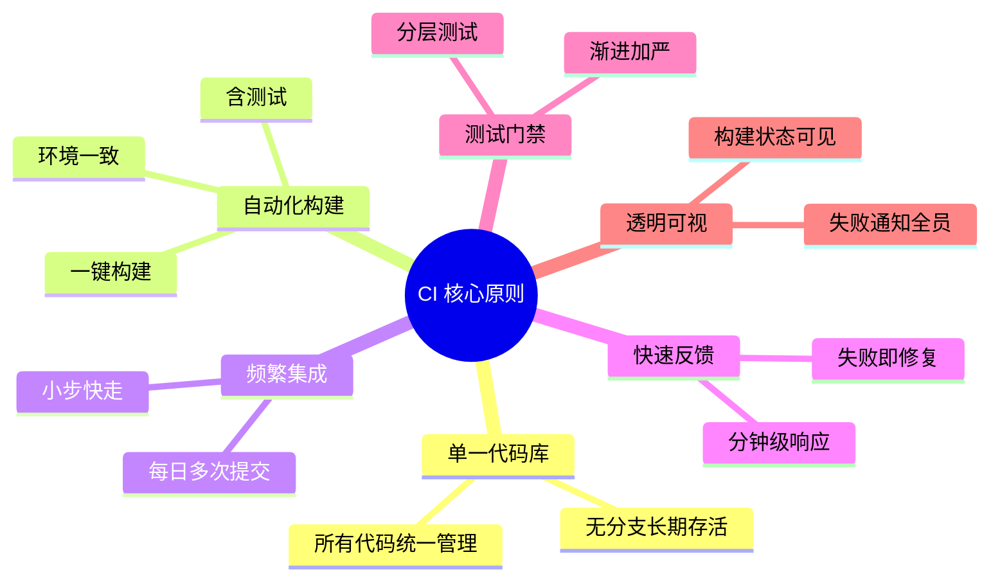
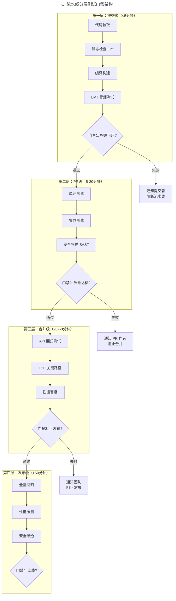
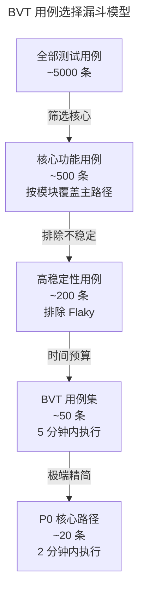
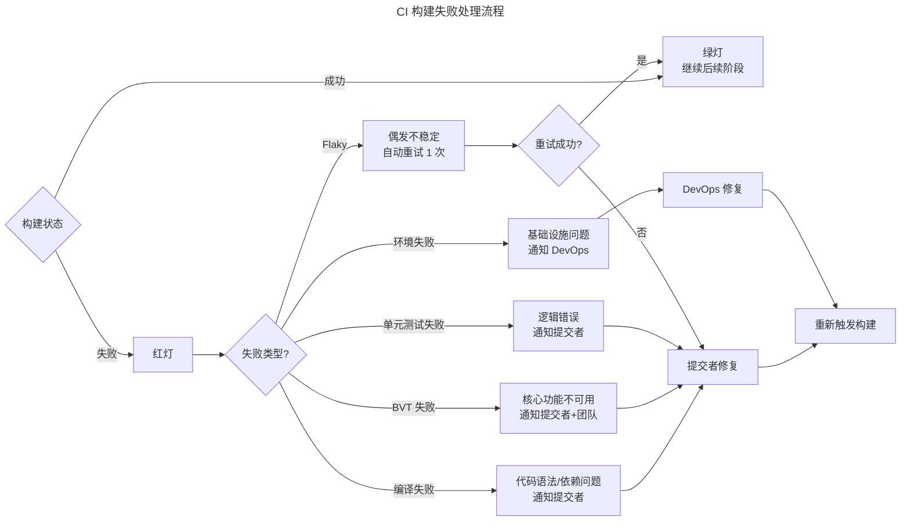

# 持续集成体系与 BVT

## 一、模块介绍

**持续集成**（Continuous Integration，CI）是现代软件工程的基石实践——开发者频繁地将代码集成到主干，每次集成触发自动化构建与测试，快速发现集成问题。Martin Fowler 将 CI 定义为"一种软件开发实践，团队成员频繁集成他们的工作，每次集成都通过自动化构建（含测试）来验证"。

**构建验证测试**（Build Verification Test，BVT），也称冒烟测试（Smoke Test），是 CI 流水线的第一道质量门禁——验证构建的基本可用性，决定是否值得启动后续的完整测试。BVT 不追求覆盖全面，而追求"快速判断构建是否值得信任"。

本文系统阐述 CI 体系架构、BVT 设计原则、流水线门禁策略，以及 CI 反馈效率优化。

## 二、核心方法论

### 2.1 CI 的核心原则



### 2.2 CI 流水线分层架构



分层门禁的核心思想：**尽早失败、快速失败**。低成本测试在前面拦截明显问题，高成本测试只在必要时执行。

### 2.3 BVT 设计原则

BVT 的设计遵循 **FAST** 原则：

| 原则 | 含义 | 实践 |
| --- | --- | --- |
| **F**ast（快速） | 5 分钟内完成 | 用例数控制在 20-50 条 |
| **A**ccurate（准确） | 失败即真实问题 | 只选稳定性高的核心用例 |
| **S**table（稳定） | 零 Flaky 测试 | 排除偶发失败用例 |
| **T**argeted（聚焦） | 验证"构建可用" | 覆盖核心功能的主路径 |

## 三、关键流程

### 3.1 BVT 用例选择策略



BVT 用例的维护是动态的：新功能上线后其核心路径应纳入 BVT；Flaky 用例应及时移出 BVT 并转入普通回归集。

### 3.2 CI 失败处理流程



### 3.3 修复窗口与升级机制

| 构建类型 | 修复窗口 | 超时升级 |
| --- | --- | --- |
| 主干构建 | 10 分钟 | 通知全员 → 30 分钟回滚 |
| PR 构建 | 30 分钟 | PR 标记 blocked → 1 小时通知主管 |
| 发布构建 | 即时 | 暂停发布 → 召集应急会 |

**"破窗效应"**：CI 红灯超过 10 分钟未修复，团队会逐渐习惯红灯状态，CI 的信任度崩塌。这是 CI 体系最常见的失败模式。

## 四、工具与实践

### 4.1 GitHub Actions 分层 CI 配置

```yaml
# .github/workflows/ci-pipeline.yml
name: CI Pipeline
on:
  push:
    branches: [main]
  pull_request:
    branches: [main]

jobs:
  # 第一层：提交级（目标 < 5 分钟）
  bvt:
    name: "L1: BVT 冒烟"
    runs-on: ubuntu-latest
    timeout-minutes: 5
    steps:
      - uses: actions/checkout@v4
      - uses: actions/setup-python@v5
        with:
          python-version: '3.13'
          cache: 'pip'

      - name: 安装依赖（利用缓存）
        run: pip install -r requirements.txt

      - name: 静态检查
        run: ruff check src/ --exit-zero  # 警告不阻断

      - name: BVT 冒烟测试（标记 @smoke 的用例）
        run: |
          pytest tests/ -m "smoke" \
            --tb=short \
            --maxfail=3 \
            -q

  # 第二层：PR 级（目标 < 20 分钟）
  unit-integration:
    name: "L2: 单元+集成"
    needs: bvt  # BVT 通过后才执行
    runs-on: ubuntu-latest
    timeout-minutes: 20
    steps:
      - uses: actions/checkout@v4
      - uses: actions/setup-python@v5
        with:
          python-version: '3.13'
          cache: 'pip'

      - name: 单元测试 + 覆盖率
        run: |
          pytest tests/unit/ \
            --cov=src \
            --cov-fail-under=80 \
            --cov-report=xml \
            --junitxml=unit-report.xml

      - name: 集成测试（Testcontainers）
        run: pytest tests/integration/ -m "integration"

      - name: SAST 安全扫描
        uses: github/codeql-action/analyze@v3  # 需先执行 github/codeql-action/init 初始化

  # 第三层：合并级（目标 < 60 分钟）
  regression:
    name: "L3: 回归测试"
    needs: unit-integration
    if: github.event_name == 'pull_request'
    runs-on: ubuntu-latest
    timeout-minutes: 60
    steps:
      - uses: actions/checkout@v4
        with:
          fetch-depth: 0  # 精准测试需要 diff

      - name: 精准回归测试
        run: |
          python scripts/precision_test_selector.py
          pytest $(cat precision-tests.txt) --html=report.html

      - name: E2E 关键路径（Playwright）
        run: |
          npx playwright test --grep "@critical"
```

### 4.2 BVT 标记管理

```python
# pytest BVT 用例标记示例
import pytest

@pytest.mark.smoke  # BVT 冒烟标记
class TestOrderBVT:
    """订单核心功能 BVT - 5 分钟内验证构建可用性"""

    def test_create_order(self, api_client):
        """创建订单 - 最核心的功能"""
        resp = api_client.post("/orders", json={"sku": "A001", "qty": 1})
        assert resp.status_code == 201
        assert resp.json()["id"] is not None

    def test_query_order(self, api_client, create_test_order):
        """查询订单 - 读路径验证"""
        order_id = create_test_order()
        resp = api_client.get(f"/orders/{order_id}")
        assert resp.status_code == 200

    def test_pay_order(self, api_client, create_test_order):
        """支付订单 - 核心交易链路"""
        order_id = create_test_order()
        resp = api_client.post(f"/orders/{order_id}/pay")
        assert resp.status_code == 200
        assert resp.json()["status"] == "PAID"
```

### 4.3 CI 反馈效率优化

| 优化策略 | 效果 | 实践 |
| --- | --- | --- |
| **并行执行** | 测试时间 ÷ CPU 核数 | pytest-xdist 并行 |
| **精准测试** | 只跑受影响用例 | 变更影响分析 |
| **缓存依赖** | 安装时间 -70% | pip/npm 缓存 |
| **增量构建** | 编译时间 -60% | 增量编译器 |
| **测试分片** | E2E 时间 ÷ N | Matrix 并行 |
| **预热池** | 容器启动 -80% | 预启动 runner |

```ini
# pytest 并行执行配置（pytest.ini）
[pytest]
addopts = -n auto --dist=loadfile  # 按文件分配，避免 fixture 冲突
markers =
    smoke: BVT 冒烟测试（5分钟内）
    integration: 集成测试（需依赖服务）
    slow: 慢测试（>10s）
    flaky: 不稳定测试（不纳入 BVT）
```

### 4.4 CI 度量指标

| 指标 | 健康目标 | 告警阈值 |
| --- | --- | --- |
| 构建成功率 | > 95% | < 90% |
| 构建平均耗时 | < 10 分钟 | > 20 分钟 |
| BVT 执行时间 | < 5 分钟 | > 10 分钟 |
| 反馈到提交者时长 | < 10 分钟 | > 30 分钟 |
| Flaky 率 | < 1% | > 5% |
| 主干红灯时长 | < 10 分钟 | > 30 分钟 |

## 五、常见误区

### 5.1 "CI 就是自动跑测试"

**误区**：认为配置了 GitHub Actions 跑测试就是 CI。

**纠正**：CI 是一种**开发文化**，工具只是支撑。CI 的核心是"频繁集成+快速反馈+失败即修复"的工作习惯。有工具无文化的"伪 CI"——分支长期存活、红灯无人修复、构建从不看——比没有工具更危险。

### 5.2 BVT 过度膨胀

**误区**：BVT 用例从 50 条增长到 500 条，执行时间从 5 分钟膨胀到 1 小时。

**纠正**：BVT 必须有**时间预算硬约束**。超过 5 分钟的用例应移出 BVT 转入第二层。定期（每月）审查 BVT 用例集，移除低价值用例。

### 5.3 忽视 Flaky 测试

**误区**：对偶发失败的用例"重试几次就过了"而不处理。

**纠正**：Flaky 测试是 CI 信任度的杀手。应建立 Flaky 测试隔离机制：自动检测 Flaky → 移入隔离区 → 限期修复 → 超时移除。

### 5.4 所有测试同等对待

**误区**：每次提交跑全量测试，导致反馈时间过长。

**纠正**：测试应分层分级，按"成本递增、频率递减"原则分布：提交级跑 BVT，PR 级跑单元+集成，合并级跑回归+E2E。

## 六、进阶扩展与参考

### 6.1 CI 与 GitOps 的融合

GitOps 将 CI 与 CD 统一为"Git 仓库驱动的自动化"。Flux/ArgoCD 监听 Git 仓库变更自动部署，CI 专注构建与测试，CD 专注部署与收敛。测试门禁从"CI 内阻塞"演变为"Git 仓库状态保护"——未通过测试的 PR 无法合并，从而无法触发部署。

### 6.2 AI 辅助 CI 优化

2025-2026 年趋势：AI 分析 CI 历史数据，自动优化测试并行度、预测构建耗时、识别 Flaky 测试根因、甚至自动修复简单构建失败（如依赖版本冲突）。

### 6.3 推荐参考

- 文章：Martin Fowler《Continuous Integration》（martinfowler.com）
- 图书：《Continuous Delivery》Jez Humble & David Farley
- 工具：GitHub Actions（docs.github.com/actions）
- 工具：Jenkins（jenkins.io）
- 实践：Google Testing Blog《Flaky Tests》系列
