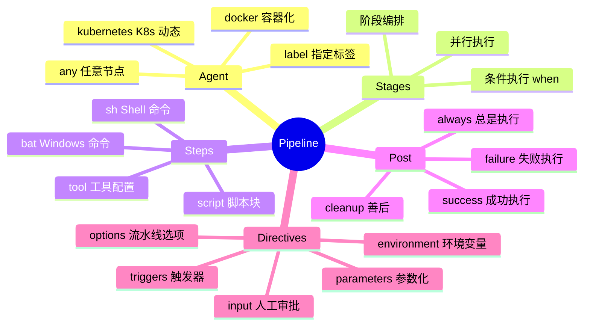
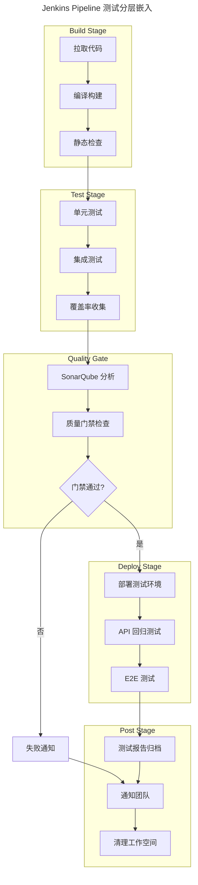
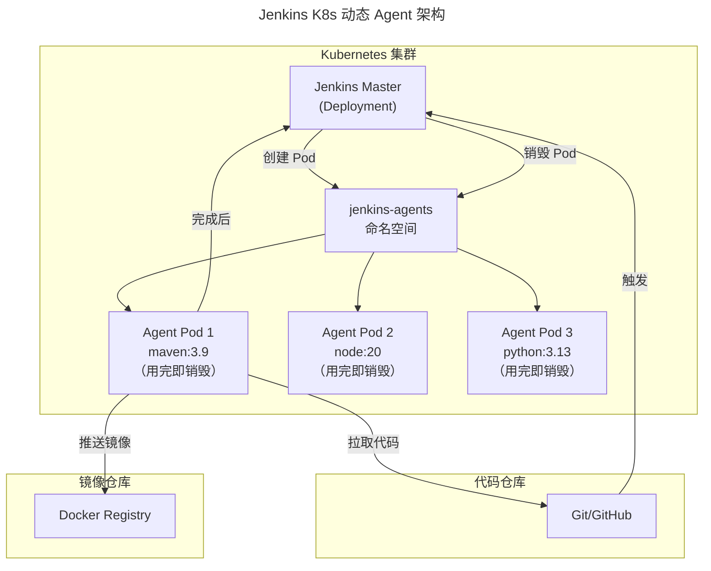
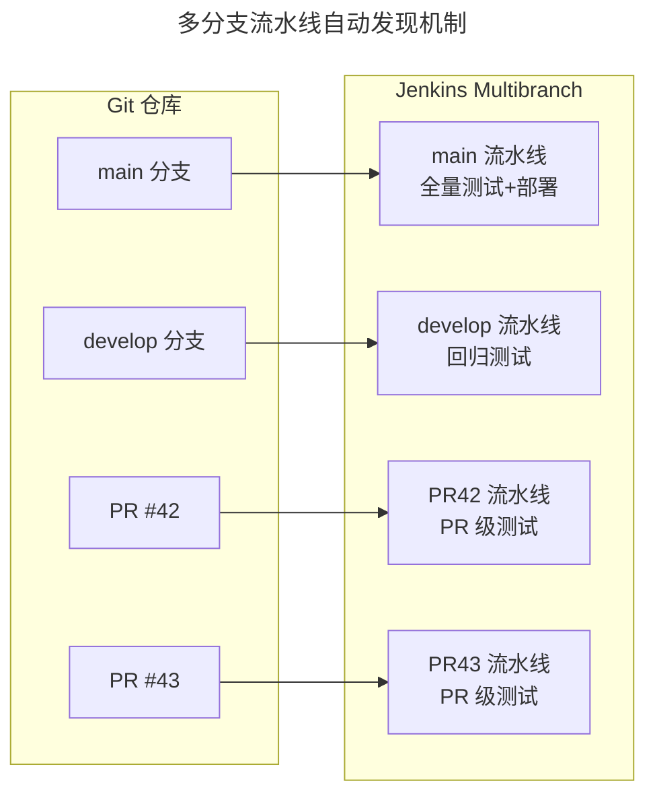

# Jenkins 2.5+ LTS 与 Pipeline

## 一、模块介绍

**Jenkins** 是全球使用最广泛的开源 CI/CD 服务器。Pipeline as Code 自 Jenkins 2.0（2016 年）引入，是 Jenkins 2.x 相比 1.x 时代的核心进化——用 `Jenkinsfile`（基于 Groovy 的 DSL）将流水线定义为代码，纳入版本控制，实现流水线的可审计、可复用、可演进。截至 2026-09，Jenkins 周版本已达 2.58x，LTS 线为 2.568.x（本文语法对 2.x LTS 均适用）。

在 GitHub Actions、GitLab CI 等新兴 CI 平台兴起的背景下，Jenkins 凭借**插件生态丰富、自托管数据可控、复杂流水线编排能力强**等优势，仍在大中型企业中占据主导地位。本文系统阐述 Jenkins Pipeline 的核心语法、测试集成模式、共享库设计、以及大规模 Jenkins 集群的运维实践。

## 二、核心方法论

### 2.1 Jenkins Pipeline 两种语法

Jenkins Pipeline 支持两种语法：**声明式**（Declarative）与**脚本式**（Scripted）。

| 维度 | 声明式 Pipeline | 脚本式 Pipeline |
| --- | --- | --- |
| 语法 | 结构化 DSL（`pipeline {}`块） | Groovy 自由代码 |
| 可读性 | 高，非开发也能理解 | 低，需 Groovy 知识 |
| 灵活性 | 受 DSL 约束 | 完全自由 |
| 错误提示 | 友好 | Groovy 堆栈 |
| 推荐度 | **首选** | 复杂逻辑补充 |

实践中应以声明式为主、脚本式为辅：声明式定义流水线骨架，复杂逻辑用 `script {}` 块嵌入脚本式代码。

### 2.2 Pipeline 核心概念



### 2.3 测试集成分层策略

Jenkins Pipeline 中测试活动的分层嵌入策略：



## 三、关键流程

### 3.1 完整声明式 Pipeline 示例

以下是一个涵盖构建、测试、质量门禁、部署的完整声明式 Pipeline：

```groovy
// Jenkinsfile
pipeline {
    agent {
        label 'linux && docker'  // 在带 docker 的 Linux 节点运行
    }

    // 工具配置
    tools {
        jdk 'JDK-21'
        maven 'Maven-3.9'
    }

    // 环境变量
    environment {
        SONAR_TOKEN = credentials('sonarqube-token')
        DOCKER_REGISTRY = 'registry.company.com'
        IMAGE_TAG = "${env.BUILD_NUMBER}-${env.GIT_COMMIT?.take(7)}"
    }

    // 流水线选项
    options {
        timeout(time: 30, unit: 'MINUTES')
        buildDiscarder(logRotator(numToKeepStr: '20'))
        disableConcurrentBuilds()
        timestamps()
    }

    // 参数化构建
    parameters {
        choice(name: 'DEPLOY_ENV', choices: ['test', 'staging'], description: '部署环境')
        booleanParam(name: 'RUN_E2E', defaultValue: true, description: '是否执行 E2E')
    }

    stages {
        stage('Checkout') {
            steps {
                checkout scm
                script {
                    env.GIT_COMMIT = sh(script: 'git rev-parse HEAD', returnStdout: true).trim()
                }
            }
        }

        stage('Build') {
            steps {
                sh 'mvn clean package -DskipTests -B'
            }
        }

        stage('Static Analysis') {
            parallel {
                stage('Lint') {
                    steps {
                        sh 'mvn checkstyle:check -B'
                    }
                }
                stage('SpotBugs') {
                    steps {
                        sh 'mvn spotbugs:check -B'
                    }
                }
            }
        }

        stage('Unit Test') {
            steps {
                sh 'mvn test -B'
            }
            post {
                always {
                    junit '**/target/surefire-reports/*.xml'
                    jacoco(execPattern: '**/target/jacoco.exec')
                }
            }
        }

        stage('Quality Gate') {
            steps {
                withSonarQubeEnv('SonarQube') {
                    sh "mvn sonar:sonar -Dsonar.projectKey=order-service -B"
                }
                timeout(time: 5, unit: 'MINUTES') {
                    waitForQualityGate abortPipeline: true
                }
            }
        }

        stage('Integration Test') {
            steps {
                sh 'mvn failsafe:integration-test failsafe:verify -B'
            }
            post {
                always {
                    junit '**/target/failsafe-reports/*.xml'
                }
            }
        }

        stage('Build Docker Image') {
            steps {
                sh """
                    docker build -t ${DOCKER_REGISTRY}/order-service:${IMAGE_TAG} .
                    docker push ${DOCKER_REGISTRY}/order-service:${IMAGE_TAG}
                """
            }
        }

        stage('Deploy') {
            when {
                anyOf {
                    branch 'main'
                    expression { params.DEPLOY_ENV == 'staging' }
                }
            }
            steps {
                sh """
                    kubectl set image deployment/order-service \
                      order-service=${DOCKER_REGISTRY}/order-service:${IMAGE_TAG} \
                      -n ${params.DEPLOY_ENV}
                """
            }
        }

        stage('E2E Test') {
            when {
                expression { params.RUN_E2E }
            }
            steps {
                build job: 'e2e-test-suite', parameters: [
                    string(name: 'SERVICE_VERSION', value: env.IMAGE_TAG),
                    string(name: 'ENV', value: params.DEPLOY_ENV)
                ]
            }
        }
    }

    post {
        success {
            slackSend(channel: '#release',
                color: 'good',
                message: "构建成功: ${env.JOB_NAME} #${env.BUILD_NUMBER}")
        }
        failure {
            slackSend(channel: '#release',
                color: 'danger',
                message: "构建失败: ${env.JOB_NAME} #${env.BUILD_NUMBER} - ${env.BUILD_URL}")
            emailext(to: '${FAILED_TESTS_RECIPIENTS}',
                subject: "构建失败: ${env.JOB_NAME} #${env.BUILD_NUMBER}",
                body: '${SCRIPT, template:"groovy-html.template"}')
        }
        always {
            archiveArtifacts artifacts: '**/target/*.jar', allowEmptyArchive: true
            publishHTML(target: [
                reportDir: 'target/site',
                reportFiles: 'index.html',
                reportName: 'Test Report'
            ])
            cleanWs()  // 清理工作空间
        }
    }
}
```

### 3.2 共享库设计

大型组织中，多个项目的 Pipeline 有大量重复逻辑。Jenkins **共享库**（Shared Library）将公共逻辑抽取为可复用的 Groovy 函数/类：

```groovy
// vars/standardTestPipeline.groovy（共享库入口）
/**
 * 标准测试流水线
 * @param config Map 配置项
 *   - projectName: 项目名
 *   - sonarProjectKey: SonarQube 项目 Key
 *   - coverageThreshold: 覆盖率阈值（默认 80）
 */
def call(Map config) {
    pipeline {
        agent { label 'linux && docker' }

        tools {
            jdk 'JDK-21'
            maven 'Maven-3.9'
        }

        environment {
            SONAR_TOKEN = credentials('sonarqube-token')
        }

        options {
            timeout(time: 30, unit: 'MINUTES')
            buildDiscarder(logRotator(numToKeepStr: '20'))
        }

        stages {
            stage('Build & Test') {
                steps {
                    sh 'mvn clean verify -B'
                }
                post {
                    always {
                        junit '**/target/surefire-reports/*.xml'
                        jacoco(execPattern: '**/target/jacoco.exec')
                    }
                }
            }

            stage('Quality Gate') {
                steps {
                    withSonarQubeEnv('SonarQube') {
                        sh "mvn sonar:sonar -Dsonar.projectKey=${config.sonarProjectKey} -B"
                    }
                    timeout(time: 5, unit: 'MINUTES') {
                        waitForQualityGate abortPipeline: true
                    }
                }
            }
        }

        post {
            always {
                cleanWs()
            }
        }
    }
}
```

各项目只需一行调用即可使用标准 Pipeline：

```groovy
// 项目的 Jenkinsfile（极简）
@Library('jenkins-shared-lib@v1.2') _

standardTestPipeline(
    projectName: 'order-service',
    sonarProjectKey: 'com.company:order-service',
    coverageThreshold: 85
)
```

### 3.3 Kubernetes 动态 Agent

传统 Jenkins 使用固定 Agent，资源利用率低。Kubernetes 插件支持按需创建 Pod 作为 Agent：



```groovy
// Kubernetes 动态 Agent Pipeline
pipeline {
    agent {
        kubernetes {
            yaml '''
apiVersion: v1
kind: Pod
spec:
  containers:
  - name: maven
    image: maven:3.9-eclipse-temurin-21
    command: ["sleep"]
    args: ["infinity"]
    resources:
      limits:
        memory: 4Gi
        cpu: 2
  - name: docker
    image: docker:25
    securityContext:
      privileged: true
    command: ["sleep"]
    args: ["infinity"]
'''
        }
    }

    stages {
        stage('Build') {
            steps {
                container('maven') {
                    sh 'mvn clean package -B'
                }
            }
        }

        stage('Docker Build') {
            steps {
                container('docker') {
                    sh 'docker build -t myapp .'
                }
            }
        }
    }
}
```

## 四、工具与实践

### 4.1 多分支流水线

多分支流水线（Multibranch Pipeline）自动发现 Git 仓库的所有分支与 PR，为每条分支创建独立流水线：



配合 `when { branch 'main' }` 条件，同一份 Jenkinsfile 可在不同分支执行不同行为。

### 4.2 Blue Ocean 可视化

Blue Ocean 是 Jenkins 的可视化 UI，提供：
- 流水线阶段可视化（绿/红/进行中状态一目了然）
- 测试结果按模块分组展示
- 日志按阶段折叠，快速定位失败点

::: warning Blue Ocean 已进入维护模式
截至 2026-09，Blue Ocean 插件已被官方标记为废弃（deprecated）：不再新增功能，仅对重要安全与功能缺陷做选择性维护。官方推荐改用 [Pipeline Graph View](https://plugins.jenkins.io/pipeline-graph-view/) 或 [Pipeline Stage View](https://plugins.jenkins.io/pipeline-stage-view/) 插件实现流水线可视化。
:::

### 4.3 Jenkins 即代码（JCasC）

Jenkins Configuration as Code（JCasC）插件将 Jenkins 自身配置也纳入版本控制：

```yaml
# jenkins.yaml（JCasC 配置）
jenkins:
  systemMessage: "CI/CD Platform - Jenkins 2.5xx"
  numExecutors: 0  # Master 不执行任务

  securityRealm:
    ldap:
      server: ldap.company.com
      rootDN: dc=company,dc=com
      userSearchBase: ou=people
      userSearch: uid={0}

  authorizationStrategy:
    roleBased:
      roles:
        global:
          - name: "admin"
            assignments:
              - "ci-admin-group"
            permissions:
              - "Overall/Administer"
          - name: "developer"
            assignments:
              - "dev-group"
            permissions:
              - "Overall/Read"
              - "Job/Build"
              - "Job/Read"

tools:
  jdk:
    installations:
      - name: "JDK-21"
        home: "/usr/lib/jvm/java-21"
  maven:
    installations:
      - name: "Maven-3.9"
        home: "/opt/maven"
```

## 五、常见误区

### 5.1 Pipeline 中写大量业务逻辑

**误区**：在 Jenkinsfile 中用 Groovy 编写复杂的部署脚本、数据处理逻辑。

**纠正**：Jenkinsfile 应是**编排层**，复杂逻辑放到 Shell 脚本、Python 脚本或共享库中。Pipeline 的职责是"调度"，不是"实现"。

### 5.2 凭据硬编码

**误区**：在 Jenkinsfile 中直接写 `password = 'xxx'` 或 `sh 'export DB_PASSWORD=secret123'`。

**纠正**：必须使用 `credentials()` 或 `withCredentials()` 块。凭据存储在 Jenkins Credentials Store 中，日志中自动脱敏。

### 5.3 固定 Agent 资源浪费

**误区**：配置 10 台固定 Agent，其中 8 台大部分时间空闲。

**纠正**：使用 Kubernetes 动态 Agent 或 AWS EC2 按需扩缩容插件，按需创建销毁 Agent。

### 5.4 忽视 Pipeline 语法版本

**误区**：Jenkinsfile 不纳入版本控制，直接在 Jenkins UI 中编辑。

**纠正**：Pipeline 必须存储在 Git 仓库中（Jenkinsfile）。UI 编辑无法追踪变更历史、无法 Code Review、无法多分支复用。

## 六、进阶扩展与参考

### 6.1 Jenkins 与 GitOps 协同

现代实践中 Jenkins 可与 ArgoCD/Flux 协同：Jenkins 负责构建镜像与测试，测试通过后更新 Git 仓库中的镜像版本，ArgoCD 监听 Git 变更自动部署。这种"Jenkins 构建 + GitOps 部署"模式兼顾了 Jenkins 的测试编排能力与 GitOps 的声明式部署优势。

### 6.2 Jenkins X 与云原生演进

Jenkins X 是围绕 Kubernetes 构建的独立云原生 CI/CD 项目（底层基于 Tekton 与 GitOps，并非运行传统 Jenkins 服务端）。对新建的云原生项目，Jenkins X 提供更现代的开箱体验；对已有大量 Jenkins Pipeline 的团队，渐进式迁移到 K8s 动态 Agent + 共享库是更务实的选择。

### 6.3 推荐参考

- 文档：Jenkins User Documentation（jenkins.io/doc）
- 图书：《Jenkins 2: Up and Running》Brent Laster
- 插件：Pipeline（plugins.jenkins.io/workflow-aggregator）
- 插件：Kubernetes（plugins.jenkins.io/kubernetes）
- 实践：Jenkins Shared Library 最佳实践（jenkins.io/doc/book/pipeline/shared-libraries）
