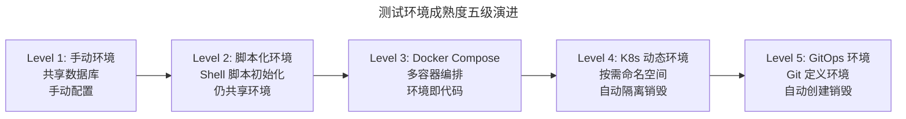
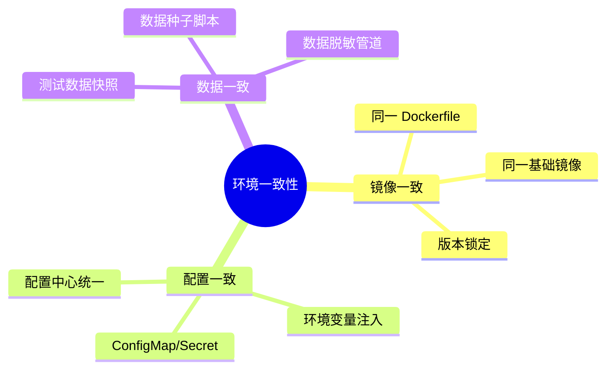
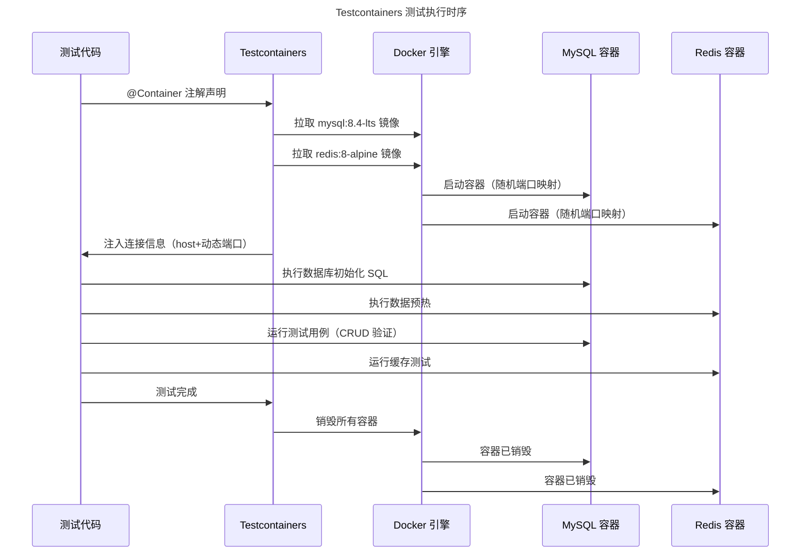
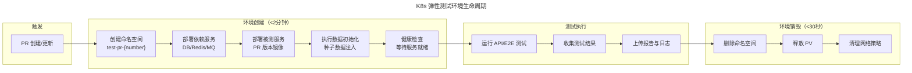

# Docker/K8s 测试执行环境

## 一、模块介绍

**测试执行环境**是测试运行的载体——从开发者本地到 CI 流水线再到预发布集群，测试环境的稳定性与一致性直接决定了测试结果的可信度。传统测试环境的痛点是"环境漂移"（Environment Drift）：本地能跑通，CI 跑不通；测试环境通过，生产环境失败。

**Docker** 与 **Kubernetes** 从根本上改变了测试环境的构建方式：Docker 实现了"环境即代码"（Environment as Code）——测试依赖（数据库、缓存、消息队列）以容器形式定义、随测试启停；Kubernetes 提供了"弹性测试环境"——按需创建独立测试命名空间，用完即销毁。本文系统阐述容器化测试环境的设计原则、Testcontainers 实践、K8s 测试环境架构、以及数据隔离策略。

## 二、核心方法论

### 2.1 测试环境成熟度模型



### 2.2 测试环境隔离级别

| 隔离级别 | 粒度 | 适用场景 | 实现方式 |
| --- | --- | --- | --- |
| **进程级隔离** | 单测试进程 | 单元测试 | Mock/Stub 依赖 |
| **容器级隔离** | 单测试套件 | 集成测试 | Testcontainers |
| **命名空间级隔离** | 单测试任务 | E2E/性能测试 | K8s Namespace |
| **集群级隔离** | 单测试团队 | 性能压测 | 独立 K8s 集群 |

### 2.3 环境一致性原则



## 三、关键流程

### 3.1 Testcontainers 集成测试架构



### 3.2 K8s 弹性测试环境生命周期



### 3.3 测试数据隔离策略

| 策略 | 说明 | 适用场景 |
| --- | --- | --- |
| **独立数据库** | 每个测试套件独立 DB 容器 | 集成测试 |
| **Schema 隔离** | 同一 DB 实例不同 Schema | 资源受限场景 |
| **事务回滚** | 测试在事务中执行，结束后回滚 | 单元/轻量集成测试 |
| **数据快照** | 从基线快照恢复 | E2E/性能测试 |
| **数据工厂** | 测试前用工厂模式生成数据 | 所有场景的通用补充 |

## 四、工具与实践

### 4.1 Docker Compose 测试环境

```yaml
# docker-compose.test.yml（Compose v2：version 字段已废弃，无需书写）
services:
  # 被测服务
  app:
    build:
      context: .
      dockerfile: Dockerfile.test
    ports:
      - "8080:8080"
    environment:
      - SPRING_PROFILES_ACTIVE=test
      - DB_HOST=postgres
      - DB_PORT=5432
      - REDIS_HOST=redis
      - KAFKA_BROKERS=kafka:9092
    depends_on:
      postgres:
        condition: service_healthy
      redis:
        condition: service_started
      kafka:
        condition: service_healthy

  # 数据库
  postgres:
    image: postgres:16-alpine
    environment:
      POSTGRES_DB: test_db
      POSTGRES_USER: test
      POSTGRES_PASSWORD: test
    volumes:
      - ./init-scripts:/docker-entrypoint-initdb.d
    healthcheck:
      test: ["CMD-SHELL", "pg_isready -U test"]
      interval: 5s
      timeout: 3s
      retries: 5

  # 缓存
  redis:
    image: redis:8-alpine
    command: redis-server --save "" --appendonly no  # 纯内存模式

  # 消息队列
  kafka:
    image: confluentinc/cp-kafka:7.7.0
    environment:
      KAFKA_ZOOKEEPER_CONNECT: zookeeper:2181
      KAFKA_ADVERTISED_LISTENERS: PLAINTEXT://kafka:9092
      KAFKA_OFFSETS_TOPIC_REPLICATION_FACTOR: 1
    healthcheck:
      test: ["CMD", "kafka-topics", "--list", "--bootstrap-server", "localhost:9092"]
      interval: 10s
      retries: 5

  zookeeper:
    image: confluentinc/cp-zookeeper:7.7.0
    environment:
      ZOOKEEPER_CLIENT_PORT: 2181

  # 测试执行器
  test-runner:
    image: maven:3.9-eclipse-temurin-21
    volumes:
      - .:/app
      - maven-cache:/root/.m2
    working_dir: /app
    command: mvn verify -B
    depends_on:
      app:
        condition: service_healthy

volumes:
  maven-cache:
```

### 4.2 Testcontainers 多容器测试

```java
// Java: Testcontainers 复杂依赖测试
import org.testcontainers.containers.*;
import org.testcontainers.junit.jupiter.Container;
import org.testcontainers.junit.jupiter.Testcontainers;
import org.testcontainers.kafka.ConfluentKafkaContainer;
import org.testcontainers.utility.DockerImageName;

@Testcontainers
public class OrderServiceFullStackTest {

    @Container
    static PostgreSQLContainer<?> postgres = new PostgreSQLContainer<>(
        DockerImageName.parse("postgres:16-alpine"))
        .withDatabaseName("order_test")
        .withInitScript("schema.sql");  // 类路径下初始化脚本

    @Container
    static GenericContainer<?> redis = new GenericContainer<>(
        DockerImageName.parse("redis:8-alpine"))
        .withExposedPorts(6379);

    @Container
    static ConfluentKafkaContainer kafka = new ConfluentKafkaContainer(
        DockerImageName.parse("confluentinc/cp-kafka:7.7.0"));

    @Container
    static ToxiproxyContainer toxiproxy = new ToxiproxyContainer(
        DockerImageName.parse("ghcr.io/shopify/toxiproxy:2.11.1"));

    @Test
    void shouldHandleOrderWithFullStack() {
        // 构建配置
        OrderServiceConfig config = OrderServiceConfig.builder()
            .dbUrl(postgres.getJdbcUrl())
            .dbUser(postgres.getUsername())
            .dbPassword(postgres.getPassword())
            .redisHost(redis.getHost())
            .redisPort(redis.getMappedPort(6379))
            .kafkaBootstrapServers(kafka.getBootstrapServers())
            .build();

        OrderService service = new OrderService(config);
        service.start();

        // 执行测试
        Order order = service.createOrder("user-001", List.of("sku-1"));
        assertNotNull(order.getId());

        // 验证消息发送
        ConsumerRecord<String, String> record = KafkaTestUtils
            .getSingleRecord(kafkaConsumer, "order-created", Duration.ofSeconds(10));
        assertThat(record.value()).contains(order.getId());
    }

    @Test
    void shouldHandleNetworkLatency() {
        // 使用 Toxiproxy 注入网络延迟
        ToxiproxyContainer.ContainerProxy proxy =
            toxiproxy.getProxy(postgres);

        proxy.toxics()
            .latency("latency-toxic", ToxicDirection.DOWNSTREAM, 500)
            .setJitter(50);

        // 验证系统在高延迟下的降级行为
        OrderService service = new OrderService(configWithProxy(proxy));
        assertTimeout(Duration.ofSeconds(5), () -> {
            service.createOrder("user-002", List.of("sku-2"));
        });

        proxy.toxics().get("latency-toxic").remove();
    }
}
```

### 4.3 K8s 测试命名空间自动化

```yaml
# Helm Chart: 测试环境动态创建
apiVersion: v1
kind: Namespace
metadata:
  name: test-pr-{{ .Values.prNumber }}
  labels:
    type: ephemeral-test
    pr-number: "{{ .Values.prNumber }}"
    auto-delete: "true"
---
apiVersion: apps/v1
kind: Deployment
metadata:
  name: order-service
  namespace: test-pr-{{ .Values.prNumber }}
spec:
  replicas: 1
  selector:
    matchLabels:
      app: order-service
  template:
    spec:
      containers:
      - name: order-service
        image: "{{ .Values.imageRepo }}/order-service:{{ .Values.imageTag }}"
        env:
        - name: DB_HOST
          value: postgres
        - name: SPRING_PROFILES_ACTIVE
          value: test
        readinessProbe:
          httpGet:
            path: /actuator/health
            port: 8080
          initialDelaySeconds: 10
          periodSeconds: 5
```

```bash
#!/bin/bash
# 创建 PR 测试环境
PR_NUMBER=$1
IMAGE_TAG=$2

# 部署测试环境
helm install test-env-${PR_NUMBER} ./charts/test-env \
  --namespace test-pr-${PR_NUMBER} \
  --create-namespace \
  --set prNumber=${PR_NUMBER} \
  --set imageTag=${IMAGE_TAG}

# 等待服务就绪
kubectl wait --for=condition=ready pod -l app=order-service \
  -n test-pr-${PR_NUMBER} --timeout=120s

# 获取测试环境 URL
INGRESS_HOST="pr-${PR_NUMBER}.test.cluster.local"
echo "测试环境就绪: https://${INGRESS_HOST}"

# 执行测试
pytest tests/e2e/ --base-url=https://${INGRESS_HOST} --junitxml=results.xml

# 测试完成后销毁环境
helm uninstall test-env-${PR_NUMBER} -n test-pr-${PR_NUMBER}
kubectl delete namespace test-pr-${PR_NUMBER}
```

### 4.4 测试数据快照恢复

```python
"""
测试数据快照管理
通过 PostgreSQL 的 pg_dump / pg_restore 实现数据快照与恢复
"""
import os
import subprocess
import time

class TestDataSnapshot:
    def __init__(self, db_host, db_user, db_password, db_name):
        self.db_host = db_host
        self.db_user = db_user
        self.db_password = db_password
        self.db_name = db_name

    def create_snapshot(self, snapshot_name):
        """创建数据快照（基于 pg_dump）"""
        start = time.time()
        subprocess.run([
            "pg_dump",
            f"--host={self.db_host}",
            f"--username={self.db_user}",
            f"--dbname={self.db_name}",
            "--format=custom",
            f"--file=/snapshots/{snapshot_name}.dump"
        ], check=True, env={**os.environ, "PGPASSWORD": self.db_password})
        print(f"快照创建耗时: {time.time()-start:.1f}s")

    def restore_snapshot(self, snapshot_name):
        """恢复数据快照（秒级恢复）"""
        start = time.time()
        subprocess.run([
            "pg_restore",
            f"--host={self.db_host}",
            f"--username={self.db_user}",
            f"--dbname={self.db_name}",
            "--clean",  # 先清理现有数据
            "--if-exists",
            "--no-owner",
            f"/snapshots/{snapshot_name}.dump"
        ], check=True, env={**os.environ, "PGPASSWORD": self.db_password})
        print(f"快照恢复耗时: {time.time()-start:.1f}s")
```

## 五、常见误区

### 5.1 "生产用 K8s，测试用 Docker Compose"

**误区**：测试环境用 Docker Compose，生产用 K8s，两者架构差异大。

**纠正**：尽量缩小测试与生产的环境差距。至少预发布环境应与生产架构一致。Docker Compose 适合本地开发与单元/集成测试，E2E 与性能测试应在 K8s 环境执行。

### 5.2 容器镜像不锁版本

**误区**：Dockerfile 中写 `FROM python:latest` 或 `FROM node:latest`。

**纠正**：必须锁定具体版本（`python:3.13.1-slim`），否则今天通过的测试明天可能因基础镜像更新而失败。

### 5.3 测试数据污染

**误区**：测试用例之间共享数据，测试 A 创建的数据影响测试 B。

**纠正**：每个测试用例应**自给自足**——创建自己的数据，测试后清理。使用事务回滚，或将 Testcontainers 的 `@Container` 声明为实例字段，让每个测试方法获得独立容器实例。

### 5.4 环境创建慢

**误区**：K8s 测试环境创建需要 10 分钟，PR 反馈太慢。

**纠正**：使用 Helm + 预制镜像 + 健康检查优化可将创建时间压缩到 2 分钟内。关键优化点：预拉取镜像到节点、使用轻量级基础镜像、并行部署依赖服务。

## 六、进阶扩展与参考

### 6.1 Telepresence 本地开发调试

Telepresence 允许开发者将本地服务"代理"到 K8s 集群中，使本地代码能访问集群内的依赖服务。这对调试难以在本地启动的微服务系统特别有价值——本地运行被测服务，依赖服务（DB/MQ/其他微服务）在 K8s 集群中。

### 6.2 Signadot 精细环境隔离

新兴工具如 Signadot 支持**请求级隔离**——多个 PR 的请求在同一集群中路由到各自的版本，无需创建完整独立环境。这种"智能路由"模式将环境隔离粒度从命名空间级降到请求级，大幅降低资源消耗。

### 6.3 推荐参考

- 工具：Testcontainers（testcontainers.com）
- 工具：Docker Compose（docs.docker.com/compose）
- 工具：Helm（helm.sh）
- 工具：Telepresence（telepresence.io）
- 实践：Google 的 Shipyard 测试环境管理经验
