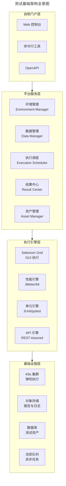
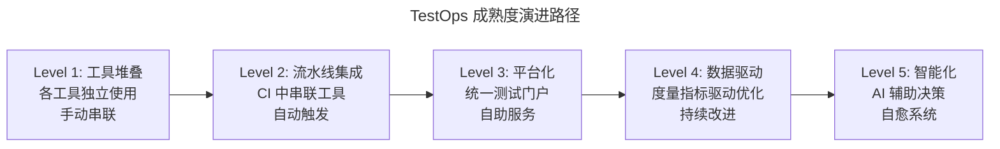
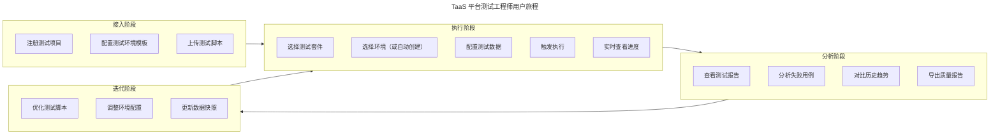
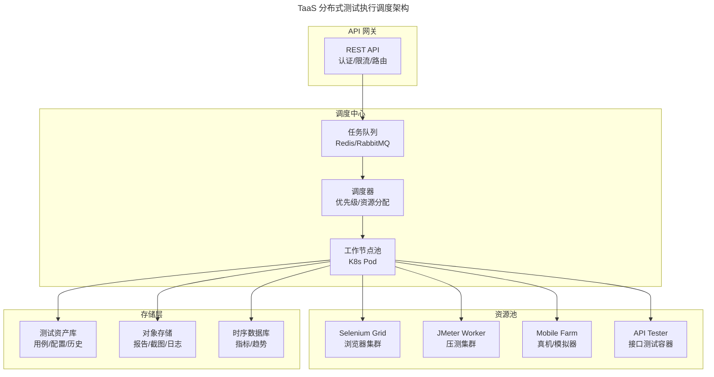
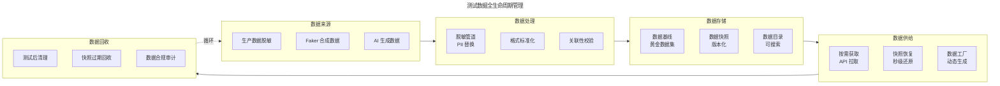
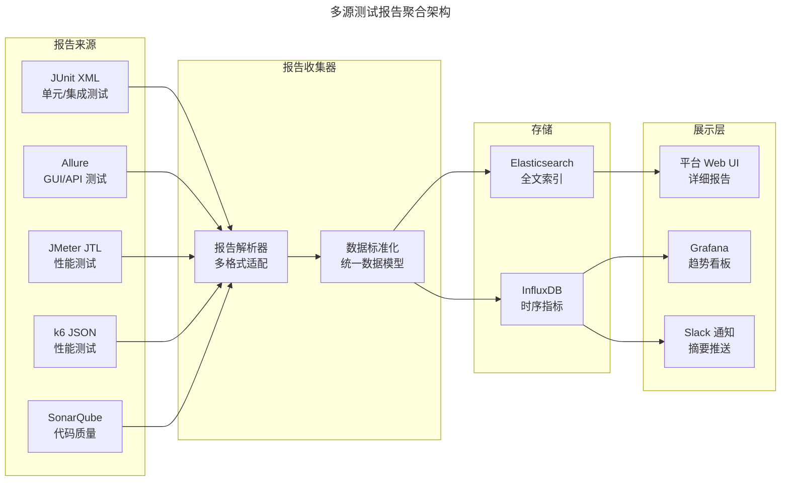

# 测试基础架构与 TaaS 设计

## 一、模块介绍

**测试基础架构**（Test Infrastructure）是支撑测试活动高效运行的所有技术设施的总和——测试环境管理、测试数据供给、测试执行调度、测试结果分析、测试资产管理。当团队规模从十人扩展到百人、测试用例从数千增长到数万时，点状的工具堆叠已无法支撑，需要**系统化的测试基础架构设计**。

**测试即服务**（Testing as a Service，TaaS）是测试基础架构的服务化形态——测试工程师通过自助平台获取测试资源，如同开发者通过云平台获取计算资源。TaaS 的核心理念是**将测试能力平台化**，让测试工程师聚焦于测试设计而非环境搭建。本文系统阐述测试基础架构的组成、TaaS 平台设计原则、以及 TestOps 运维实践。

## 二、核心方法论

### 2.1 测试基础架构组成



### 2.2 TaaS 设计原则

| 原则 | 含义 | 反模式 |
| --- | --- | --- |
| **自助服务**（Self-Service） | 测试者无需 DevOps 协助即可获取资源 | 每次提工单等 DevOps 配环境 |
| **按需弹性**（Elastic） | 资源随测试需求自动扩缩容 | 固定 10 台测试机闲置 60% |
| **多租户隔离**（Multi-Tenant） | 各团队测试互不干扰 | A 团队的测试数据覆盖 B 团队的 |
| **可观测**（Observable） | 平台自身运行状态可视 | 不知道哪个测试在排队 |
| **API 优先**（API First） | 所有能力通过 API 暴露 | 只能通过 UI 操作 |

### 2.3 TestOps 成熟度



## 三、关键流程

### 3.1 TaaS 平台用户旅程



### 3.2 测试执行调度架构



### 3.3 测试数据管理流程



## 四、工具与实践

### 4.1 TaaS API 设计

```python
"""
TaaS 平台核心 API 设计（FastAPI 实现）
"""
from fastapi import FastAPI, HTTPException
from pydantic import BaseModel
from typing import Optional
import uuid

app = FastAPI(title="TaaS Platform API", version="1.0")

# ===== 数据模型 =====
class TestExecutionRequest(BaseModel):
    project_id: str
    suite_id: str
    environment: str  # "auto" 或指定环境 ID
    parallel: int = 4
    tags: Optional[list[str]] = None
    data_snapshot: Optional[str] = None
    notify: Optional[str] = None  # Slack/Email 频道

class TestExecutionResponse(BaseModel):
    execution_id: str
    status: str
    environment_id: str
    estimated_duration: int  # 秒

# ===== 核心接口 =====
@app.post("/api/v1/executions", response_model=TestExecutionResponse)
async def create_execution(req: TestExecutionRequest):
    """创建测试执行任务"""
    execution_id = str(uuid.uuid4())

    # 1. 获取或创建测试环境
    if req.environment == "auto":
        env = await provision_environment(req.project_id)
    else:
        env = await get_environment(req.environment)

    # 2. 准备测试数据
    if req.data_snapshot:
        await restore_snapshot(env, req.data_snapshot)

    # 3. 提交执行任务
    await submit_execution(
        execution_id=execution_id,
        suite_id=req.suite_id,
        env_id=env.id,
        parallel=req.parallel,
        tags=req.tags
    )

    return TestExecutionResponse(
        execution_id=execution_id,
        status="QUEUED",
        environment_id=env.id,
        estimated_duration=await estimate_duration(req.suite_id, req.parallel)
    )

@app.get("/api/v1/executions/{execution_id}")
async def get_execution(execution_id: str):
    """查询执行状态"""
    execution = await get_execution_status(execution_id)
    if not execution:
        raise HTTPException(404, "执行任务不存在")
    return execution

@app.get("/api/v1/executions/{execution_id}/report")
async def get_report(execution_id: str, format: str = "html"):
    """获取测试报告"""
    report_url = await generate_report(execution_id, format)
    return {"report_url": report_url}

@app.post("/api/v1/environments")
async def create_environment(project_id: str, template: str):
    """创建测试环境"""
    env = await provision_environment(project_id, template)
    return {"environment_id": env.id, "endpoint": env.endpoint}

@app.delete("/api/v1/environments/{env_id}")
async def destroy_environment(env_id: str):
    """销毁测试环境"""
    await teardown_environment(env_id)
    return {"status": "DESTROYED"}

@app.get("/api/v1/metrics")
async def get_metrics(project_id: str, days: int = 7):
    """获取测试度量数据"""
    return await query_metrics(project_id, days)
```

### 4.2 测试报告聚合



### 4.3 测试资产版本管理

```yaml
# 测试资产仓库结构
test-assets/
├── projects/
│   └── order-service/
│       ├── suites/                    # 测试套件
│       │   ├── smoke.yaml             # 冒烟测试套件
│       │   ├── regression.yaml        # 回归测试套件
│       │   └── e2e.yaml               # E2E 测试套件
│       ├── environments/              # 环境模板
│       │   ├── minimal.yaml           # 最小依赖环境
│       │   └── full-stack.yaml        # 全栈环境
│       ├── data/                      # 测试数据
│       │   ├── baseline/              # 基线数据快照
│       │   │   └── v1.0.0.sql
│       │   └── factories/             # 数据工厂脚本
│       │       └── order_factory.py
│       └── config/                    # 测试配置
│           ├── timeout.yaml
│           └── retry-policy.yaml
```

### 4.4 主流 TaaS 平台对比

| 平台 | 类型 | 特点 | 适用规模 |
| --- | --- | --- | --- |
| **Selenium Grid 4** | 开源 | GUI 测试分布式执行 | 中小团队 |
| **ReportPortal** | 开源 | 测试报告聚合分析 | 中大团队 |
| **TestRail** | 商业 | 测试用例管理 + 执行调度 | 中大团队 |
| **BrowserStack** | SaaS | 云真机 + 浏览器测试 | 全规模 |
| **LambdaTest** | SaaS | 云浏览器测试 | 全规模 |
| **自研 TaaS** | 自研 | 深度定制 | 大型企业 |

## 五、常见误区

### 5.1 "TaaS 就是买一个测试工具"

**误区**：认为采购一个测试管理工具就等于建设了 TaaS。

**纠正**：TaaS 是**平台工程**，不是工具采购。它需要打通环境管理、数据管理、执行调度、结果分析的全链路。工具是组件，平台是系统。

### 5.2 过度自研

**误区**：从零自研所有模块，包括报告渲染、浏览器管理等。

**纠正**：优先使用开源组件（Selenium Grid、Allure、ReportPortal），自研聚焦于**编排层与门户层**——将开源组件整合为统一体验。

### 5.3 忽视平台自身可观测性

**误区**：TaaS 平台为他人提供测试服务，但自身缺乏监控。

**纠正**：TaaS 平台需"测试自己的测试平台"——平台自身的 CI、监控告警、SLA 度量缺一不可。平台宕机 = 全员测试停滞。

### 5.4 数据管理后置

**误区**：先建执行引擎再考虑数据管理，导致测试数据散乱各处。

**纠正**：测试数据管理应与执行引擎**同步设计**。数据是测试的血液，没有统一数据管理的 TaaS 只是半成品。

## 六、进阶扩展与参考

### 6.1 平台工程与 TaaS 的融合

2025-2026 年趋势：TaaS 正在融入**内部开发者平台**（IDP）体系，成为平台工程的能力之一。开发者通过统一门户提交代码 → 自动触发测试 → 部署，测试能力作为"隐形基础设施"嵌入其中，测试工程师无需感知平台细节。

### 6.2 AI 驱动的智能 TaaS

新一代 TaaS 引入 AI 能力：自动识别 Flaky 测试并隔离、基于历史数据预测测试执行时长、智能推荐测试用例优先级、自动分析失败根因。AI 不替代测试工程师，而是将平台从"自动化"升级为"智能化"。

### 6.3 推荐参考

- 图书：《Building Evolutionary Architectures》Neal Ford 等（平台架构演进）
- 项目：ReportPortal（reportportal.io）
- 项目：Selenium Grid 4（github.com/SeleniumHQ/selenium）
- 实践：Google Testing Infrastructure 论文与博客
- 实践：Netflix Test Platform 工程实践
