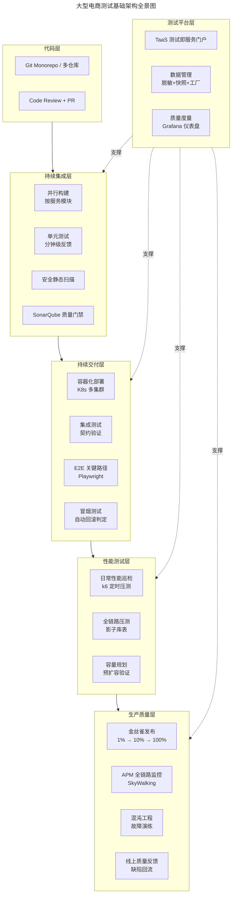
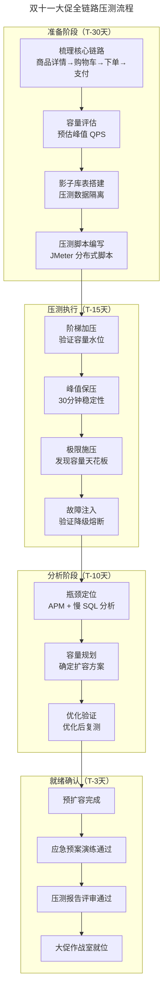
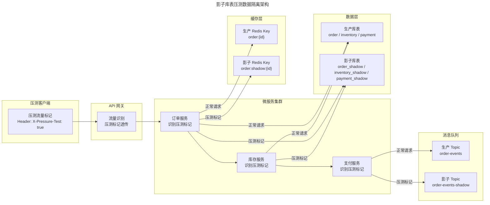
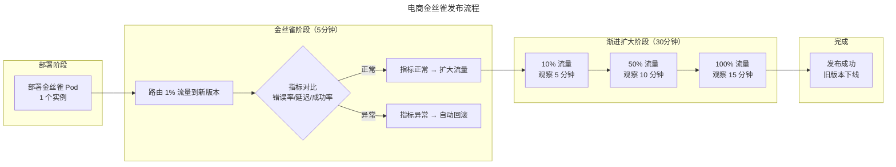

# 大型电商测试基础架构案例

## 一、模块介绍

大型电商平台（如淘宝、京东、Amazon）的测试基础架构是软件工程领域最复杂的测试系统之一——数千个微服务、亿级用户、双十一瞬时峰值数十万 QPS。这些平台的测试基础架构经过十余年演进，形成了从代码提交到生产监控的全链路质量保障体系。

本文以一个虚构的"大型电商平台"（日均订单千万级，大促峰值百万 QPS）为案例，系统阐述其测试基础架构的设计决策、分层策略、全链路压测方案、以及质量度量体系。案例综合了业界公开的工程实践（阿里、京东、美团、Netflix 等），旨在为中型团队向大型演进提供参考蓝图。

## 二、核心方法论

### 2.1 电商测试基础架构全景



### 2.2 测试分层策略

| 测试层 | 覆盖目标 | 工具 | 执行频率 | 反馈时长 |
| --- | --- | --- | --- | --- |
| 单元测试 | 行覆盖 ≥ 85% | JUnit 5 + Mockito | 每次提交 | < 3 分钟 |
| 集成测试 | 模块间契约 100% | Spring Boot Test + Testcontainers + Pact | 每次 PR | < 15 分钟 |
| API 回归 | 接口覆盖 ≥ 95% | REST Assured + 自研平台 | 每日 + 按需 | < 30 分钟 |
| E2E 测试 | 核心路径 100% | Playwright + Selenium Grid | 每日构建 | < 60 分钟 |
| 性能巡检 | P99 ≤ 基线 | k6 + JMeter | 每日 + 每版本 | 15-30 分钟 |
| 全链路压测 | 峰值容量验证 | JMeter 分布式 + 影子库 | 大促前 | 2-4 小时 |
| 探索式测试 | 高风险功能 | SBTM | Sprint 内 | - |

### 2.3 质量门禁矩阵

```mermaid
---
title: 电商质量门禁四级矩阵
---
flowchart LR
    subgraph G1["PR 门禁（提交级）"]
        G1a["单元测试通过率 100%"]
        G1b["覆盖率 ≥ 85%"]
        G1c["静态检查 0 Error"]
        G1d["契约测试通过"]
    end

    subgraph G2["合并门禁（分支级）"]
        G2a["集成测试通过"]
        G2b["SonarQube 质量门禁通过"]
        G2c["安全扫描无高危"]
        G2d["Code Review 2人批准"]
    end

    subgraph G3["发布门禁（版本级）"]
        G3a["E2E 关键路径通过"]
        G3b["性能基线达标"]
        G3c["回归测试通过率 ≥ 99%"]
        G3d["无 S1/S2 缺陷"]
    end

    subgraph G4["上线门禁（生产级）"]
        G4a["金丝雀指标达标"]
        G4b["冒烟测试通过"]
        G4c["回滚预案就绪"]
        G4d["监控告警已配置"]
    end

    G1 --> G2 --> G3 --> G4
```



## 三、关键流程

### 3.1 大促全链路压测流程



### 3.2 影子库表设计

全链路压测的核心难题是**数据隔离**——压测流量不能污染生产数据。影子库表方案：



**影子库表方案要点**：
1. 流量标记：压测请求在 HTTP Header 或 RPC Context 中打标
2. 路由切换：数据访问层（DAL）根据标记路由到影子表或生产表
3. 影子 Topic：消息队列创建影子 Topic，消费者按标记消费
4. 影子缓存：Redis Key 加 `shadow:` 前缀，压测结束自动清理
5. 影子日志：日志加压测标记，便于过滤分析

### 3.3 金丝雀发布流程



## 四、工具与实践

### 4.1 全链路压测脚本架构

```java
/**
 * 全链路压测脚本（JMeter Java Sampler）
 * 模拟：浏览商品 → 加购物车 → 下单 → 支付
 */
public class FullLinkPressureTest extends AbstractJavaSamplerClient {

    @Override
    public SampleResult runTest(JavaSamplerContext context) {
        SampleResult result = new SampleResult();
        result.sampleStart();

        try {
            String userId = generatePressureTestUserId();  // 压测用户 ID
            String token = login(userId);

            // 1. 浏览商品详情
            String skuId = randomSkuId();
            HttpResponse detailResp = httpGet("/api/skus/" + skuId, token, true);
            assertSuccess(detailResp);

            // 2. 加入购物车
            HttpResponse cartResp = httpPost("/api/cart/add",
                jsonBody(Map.of("skuId", skuId, "qty", 1)), token, true);
            assertSuccess(cartResp);

            // 3. 创建订单
            HttpResponse orderResp = httpPost("/api/orders",
                jsonBody(Map.of("items", List.of(Map.of("skuId", skuId, "qty", 1)),
                    "addressId", "test-addr-001")), token, true);
            assertSuccess(orderResp);

            String orderId = parseJson(orderResp.getBody(), "id");

            // 4. 支付（模拟支付回调）
            HttpResponse payResp = httpPost("/api/orders/" + orderId + "/pay",
                jsonBody(Map.of("method", "MOCK")), token, true);
            assertSuccess(payResp);

            result.setSuccessful(true);
            result.setResponseCode("200");
        } catch (Exception e) {
            result.setSuccessful(false);
            result.setResponseCode("500");
            result.setResponseMessage(e.getMessage());
        } finally {
            result.sampleEnd();
        }
        return result;
    }

    /**
     * 压测请求统一添加压测标记 Header
     */
    private HttpResponse httpGet(String path, String token, boolean isPressure) {
        HttpRequest req = HttpRequest.get(BASE_URL + path)
            .header("Authorization", "Bearer " + token);
        if (isPressure) {
            req.header("X-Pressure-Test", "true")
               .header("X-Pressure-User", generatePressureTestUserId());
        }
        return req.execute();
    }
}
```

### 4.2 线上质量监控仪表盘

```yaml
# Grafana 仪表盘核心指标面板配置（简化）
dashboards:
  - name: "电商线上质量监控"
    panels:
      - title: "核心链路成功率"
        targets:
          - expr: "sum(rate(http_requests_total{status=~'2..',route=~'order|pay|cart'}[1m])) / sum(rate(http_requests_total{route=~'order|pay|cart'}[1m])) * 100"
        thresholds:
          - value: 99.9
            color: green
          - value: 99.0
            color: yellow
          - value: 95.0
            color: red

      - title: "P99 响应延迟（按服务）"
        targets:
          - expr: "histogram_quantile(0.99, sum(rate(http_request_duration_seconds_bucket[5m])) by (le, service))"

      - title: "线上缺陷逃逸率趋势"
        targets:
          - expr: "prod_defects_escape / total_defects * 100"

      - title: "全链路压测水位"
        targets:
          - expr: "sum(rate(pressure_test_requests_total[1m])) by (link)"

      - title: "金丝雀版本 vs 稳定版本对比"
        targets:
          - expr: "rate(http_errors_total{version='canary'}[5m]) / rate(http_requests_total{version='canary'}[5m])"
          - expr: "rate(http_errors_total{version='stable'}[5m]) / rate(http_requests_total{version='stable'}[5m])"
```

### 4.3 质量度量周报自动化

```python
"""
质量度量周报自动生成
每周一自动汇总上周质量数据，推送至管理群
"""
import datetime
from dataclasses import dataclass

@dataclass
class QualityReport:
    week: str
    # CI 效率
    ci_success_rate: float       # CI 成功率
    avg_ci_duration: int         # 平均 CI 耗时（分钟）
    # 测试覆盖
    unit_coverage: float         # 单元测试覆盖率
    api_coverage: float          # API 覆盖率
    e2e_coverage: float          # E2E 路径覆盖率
    # 缺陷质量
    defects_found: int           # 发现缺陷数
    defects_escaped: int         # 逃逸缺陷数
    escape_rate: float           # 逃逸率
    avg_mttr: int                # 平均修复时长（小时）
    # 性能基线
    p99_latency: dict            # 各服务 P99 延迟
    error_rate: float            # 线上错误率
    # 发布效率
    deploy_count: int            # 发布次数
    rollback_count: int          # 回滚次数
    rollback_rate: float         # 回滚率

def generate_weekly_report():
    today = datetime.date.today()
    monday = today - datetime.timedelta(days=today.weekday())
    last_monday = monday - datetime.timedelta(days=7)
    sunday = last_monday + datetime.timedelta(days=6)

    report = QualityReport(
        week=f"{last_monday} ~ {sunday}",
        ci_success_rate=query_ci_success_rate(last_monday, sunday),
        avg_ci_duration=query_avg_ci_duration(last_monday, sunday),
        unit_coverage=query_coverage("unit", last_monday, sunday),
        api_coverage=query_coverage("api", last_monday, sunday),
        e2e_coverage=query_coverage("e2e", last_monday, sunday),
        defects_found=query_defects("found", last_monday, sunday),
        defects_escaped=query_defects("escaped", last_monday, sunday),
        escape_rate=calculate_escape_rate(last_monday, sunday),
        avg_mttr=query_mttr(last_monday, sunday),
        p99_latency=query_p99_by_service(last_monday, sunday),
        error_rate=query_error_rate(last_monday, sunday),
        deploy_count=query_deploy_count(last_monday, sunday),
        rollback_count=query_rollback_count(last_monday, sunday),
        rollback_rate=calculate_rollback_rate(last_monday, sunday),
    )

    send_to_slack(format_report(report))
    save_to_influxdb(report)
```

## 五、常见误区

### 5.1 全链路压测 = 性能测试

**误区**：将全链路压测等同于普通的性能测试，在测试环境模拟。

**纠正**：全链路压测的**核心价值是在生产环境验证真实容量**。测试环境无法模拟真实流量分布、数据量级与第三方依赖。必须在生产环境 + 影子库表 + 压测标记下执行。

### 5.2 金丝雀只看成功率

**误区**：金丝雀发布只监控 HTTP 成功率，认为成功率高就安全。

**纠正**：金丝雀需对比**多维指标**：成功率、延迟分布（P50/P95/P99）、错误率、资源利用率、业务指标（转化率、支付率）。某些 Bug 不影响成功率但影响业务结果（如支付金额计算错误）。

### 5.3 压测数据不清理

**误区**：压测后未清理影子数据，残留数据影响后续压测准确性。

**纠正**：每次压测后自动清理影子库表、影子缓存、影子 Topic。清理脚本纳入压测流水线的 `post` 阶段。

### 5.4 忽视第三方依赖降级

**误区**：压测时 Mock 所有第三方依赖，生产环境第三方真实调用时崩溃。

**纠正**：压测应区分核心链路（真实调用）与非核心依赖（Mock 或降级验证）。第三方不可用时的降级行为必须作为独立测试场景验证。

## 六、进阶扩展与参考

### 6.1 大促质量保障体系演进

电商大促质量保障经历三个阶段演进：
1. **事后救火**（2010 年前）：大促当天盯着监控手动应急
2. **事前压测**（2010-2020）：大促前全链路压测，提前发现瓶颈
3. **常态化演练**（2020 至今）：混沌工程 + 持续容量验证，将大促级保障常态化

### 6.2 AI 驱动的智能容量预测

2025-2026 年趋势：基于历史大促数据与实时流量，AI 模型预测容量需求，自动触发预扩容。异常检测 AI 实时分析金丝雀指标，比人工规则更快发现问题。

### 6.3 推荐参考

- 案例：阿里双 11 技术架构演进公开分享
- 案例：京东全链路压测实践
- 案例：Netflix Chaos Engineering 工程实践
- 工具：Chaos Mesh（chaos-mesh.org）
- 书籍：《微服务架构下的质量保障体系建设》
