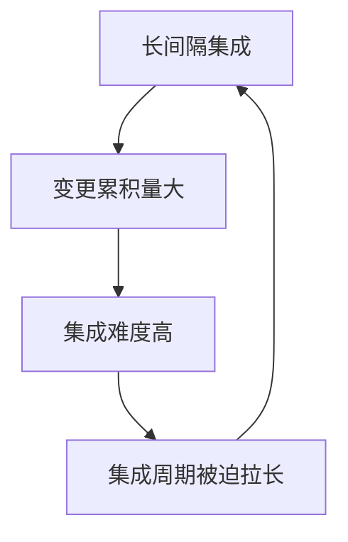
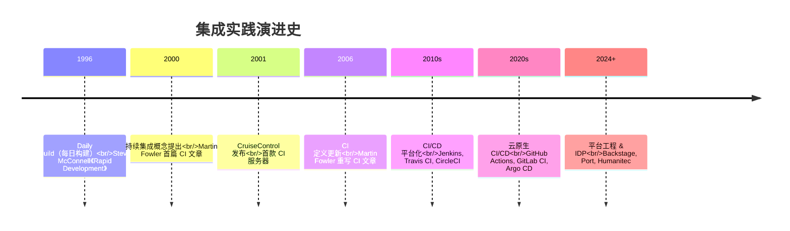
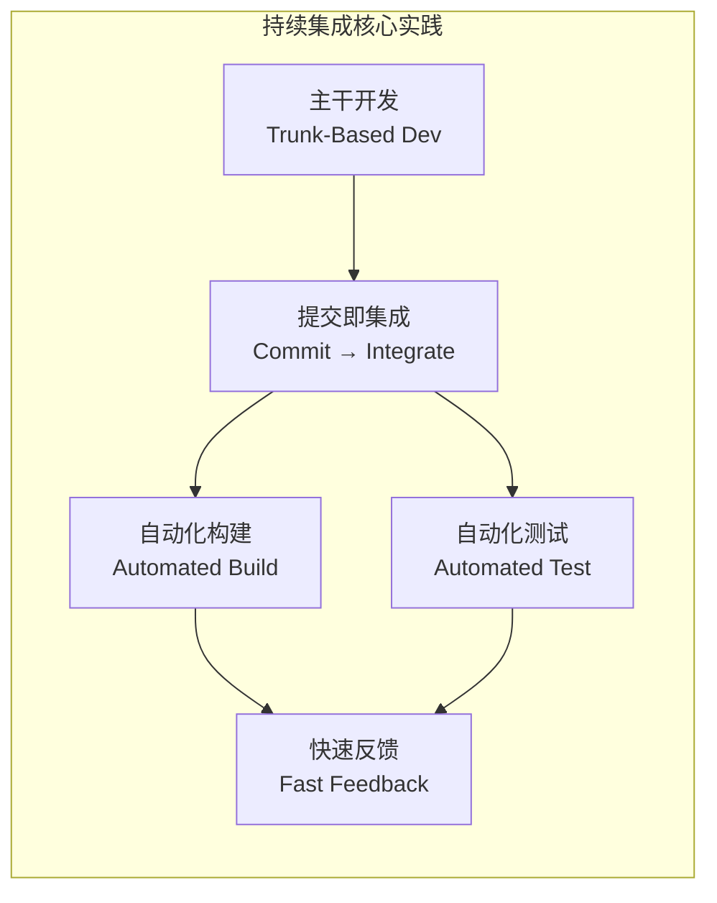
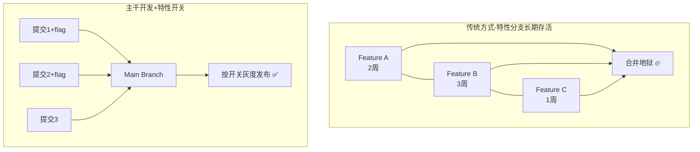
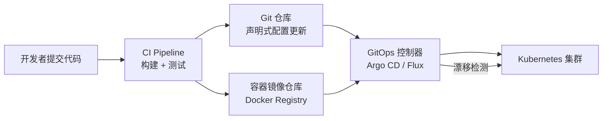
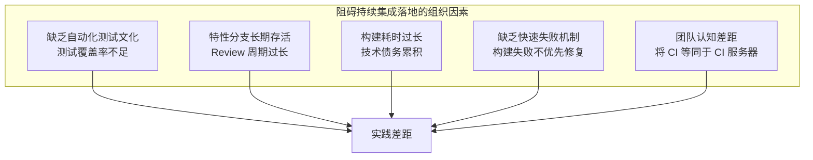
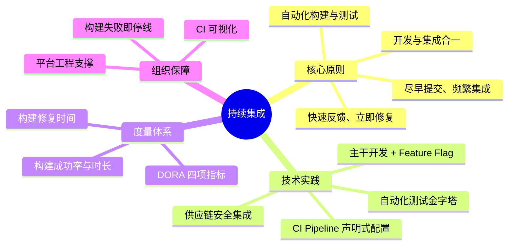
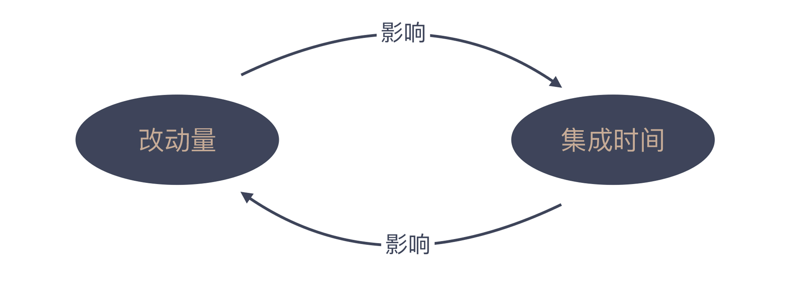

# 持续集成：集成本身就是写代码的一个环节

## 核心命题

软件工程中，代码编写并非交付的终点——**可运行的软件**才是团队的交付物。当多人协作时，将各分支代码合并为可工作整体的过程即为**集成（Integration）**。集成的频率与质量，直接决定了软件交付的效能与可靠性。

---

## 1. 集成困境：从"集成地狱"到"持续集成"

### 1.1 集成问题的本质

集成问题的根源在于**变更累积量与集成间隔时间之间的正反馈循环**：

这一恶性循环在业界被称为 **Integration Hell（集成地狱）**。其核心特征为：

| 维度 | 长间隔集成 | 短间隔集成 |
|------|-----------|-----------|
| 变更累积量 | 大（数周至数月） | 小（数分钟至数小时） |
| 冲突概率 | 高 | 低 |
| 问题定位难度 | 高（需在大量变更中排查） | 低（最近一次提交即可定位） |
| 回滚成本 | 高 | 低 |
| 心理压力 | 大（"集成周"焦虑） | 小（日常行为） |

### 1.2 行业实践演进

集成实践的演进遵循一条清晰的逻辑线——**不断缩短集成间隔**：

**关键转折点解析**：

- **Daily Build → 持续集成**：从"每天一次"到"每次提交即集成"，将集成间隔从天级压缩到分钟级。这一质变的实现依赖于**自动化构建流水线**的支撑。
- **CI 服务器 → CI/CD 平台**：CruiseControl 作为鼻祖开启了 CI 服务器时代，但真正推动行业规模化的是 Jenkins（原 Hudson）的插件生态。然而，Jenkins 的声明式 Pipeline 和 Groovy DSL 在云原生时代面临挑战，促使 GitHub Actions、GitLab CI 等以 YAML 声明式配置为核心的现代 CI 平台崛起。
- **CI/CD → 平台工程**：2024 年后，行业焦点从"如何构建 CI/CD 流水线"转向"如何为开发团队提供自助式的交付平台"（Internal Developer Platform, IDP）。Gartner 将此趋势定义为 **Platform Engineering**。

---

## 2. 持续集成的技术定义与核心实践

### 2.1 定义

**持续集成（Continuous Integration, CI）** 是一种软件开发实践，要求团队成员**频繁地将代码变更合并到共享主干分支**，每次合并均触发**自动化构建与测试**，以快速检测集成错误。

> Martin Fowler 在其 2006 年修订的定义中明确指出：持续集成的核心不在于工具，而在于**实践纪律**——"每个人每天至少向主干提交一次代码"是最低标准。

### 2.2 核心实践矩阵

基于 DORA（DevOps Research and Assessment）研究团队 2024 年报告的验证，持续集成的有效性依赖于以下实践的系统性实施：

| 实践 | 要求 | 现代工具支撑 |
|------|------|-------------|
| **单一主干分支** | 所有开发基于 main/trunk 分支，特性分支存活时间 < 1 天 | GitHub Flow、Trunk-Based Development |
| **自动化构建** | 代码提交即触发构建，包含编译、依赖解析、静态分析 | GitHub Actions、GitLab CI、Bazel、Nx |
| **自动化测试** | 单元测试、集成测试、契约测试全覆盖 | Jest、pytest、JUnit 5、Pact |
| **快速反馈** | 构建失败时，修复为最高优先级；反馈时间 < 10 分钟 | CI Monitor、Slack/Teams 通知、CI 可视化 |
| **频繁提交** | 每人每日至少提交一次 | 任务分解、小步提交 |

### 2.3 Trunk-Based Development 与 Feature Flag

原文提及"尽早提交代码去集成"，但未展开具体策略。在现代实践中，实现频繁集成的关键技术手段是 **Trunk-Based Development（主干开发）** 配合 **Feature Flag（特性开关）**：

**Feature Flag 的核心价值**：

- 将"代码集成"与"功能发布"解耦——代码可以安全合入主干，但功能通过开关控制对用户可见性
- 支持灰度发布（Canary Release）、A/B 测试、紧急回滚
- 主流实现：LaunchDarkly、Unleash、Flagr、自研开关服务

---

## 3. 现代 CI 技术生态（2024-2026）

### 3.1 CI 平台演进对比

| 维度 | 传统 CI（Jenkins） | 云原生 CI（GitHub Actions） | 下一代（平台工程） |
|------|-------------------|---------------------------|-------------------|
| 配置方式 | Groovy DSL / Jenkinsfile | YAML 声明式 | Golden Path 模板 |
| 执行环境 | 固定 Agent / Slave | 临时容器（ephemeral runner） | 按需容器 + 缓存 |
| 扩展机制 | 插件（>1800 个） | Marketplace Actions | 自定义组件 |
| 安全模型 | 凭据硬编码 / Credential Plugin | OIDC / GitHub Token | Secret 管理集成 |
| 适用场景 | 企业内部复杂流水线 | 开源 + 云原生项目 | 组织级标准化交付 |
| 学习曲线 | 陡峭（Groovy + 插件生态） | 中等（YAML + Actions） | 低（开发者自助） |

### 3.2 关键技术趋势

#### 3.2.1 GitOps 与声明式交付

GitOps 将 Git 仓库作为**系统期望状态的唯一事实来源（Single Source of Truth）**，CI/CD 流水线的职责从"执行部署"变为"更新 Git 仓库中的声明式配置"，由独立的同步引擎（如 Argo CD、Flux）将期望状态与实际状态对齐。

#### 3.2.2 平台工程与内部开发者平台（IDP）

2024 年 Gartner 将 **Platform Engineering** 列为十大战略技术趋势之一。其核心理念是：

> **将基础设施和交付能力封装为可自助消费的服务，让开发团队无需理解底层复杂性即可完成从代码到生产的全流程。**

IDP 的典型架构（参考 CNCF TAG App Delivery 白皮书）：

| 层级 | 组件 | 职责 |
|------|------|------|
| **开发者界面** | Backstage / Port / Service Catalog | 服务模板、文档、创建向导 |
| **平台编排** | Crossplane / Terraform / Pulumi | 基础设施编排 |
| **CI/CD** | GitHub Actions / GitLab CI / Tekton | 构建、测试、镜像推送 |
| **交付引擎** | Argo CD / Flux | GitOps 同步、渐进式发布 |
| **运行时** | Kubernetes / Serverless | 工作负载执行环境 |

#### 3.2.3 Supply Chain Security（供应链安全）

CI 流水线已成为软件供应链攻击的主要目标（SolarWinds、Codecov 等事件后），现代 CI 实践必须集成安全控制：

- **SLSA（Supply-chain Levels for Software Artifacts）**：Google 主导的供应链完整性框架，v1.x 规范将构建保障分为 Build Track 的 Level 0–3（早期 v0.x 版本曾定义至 Level 4，已废弃）
- **SBOM（Software Bill of Materials）**：强制生成软件物料清单（美国 EO 14028 行政令要求）
- **Sigstore / Cosign**：容器镜像签名与验证
- **OIDC 联邦认证**：CI Pipeline 通过 OIDC Token 获取临时凭证，替代长期密钥

---

## 4. 持续集成的实施度量

### 4.1 DORA 四项关键指标

Google Cloud 的 DORA 研究团队通过多年大规模调研，确立了衡量软件交付效能的四项核心指标：

| 指标 | 定义 | 高效能团队基准（DORA 历年报告口径） |
|------|------|----------------------|
| **Deployment Frequency** | 部署到生产的频率 | 按需（每天多次） |
| **Lead Time for Changes** | 代码提交到部署生产的耗时 | < 1 天 |
| **Change Failure Rate** | 部署导致故障的比例 | 0–15% |
| **MTTR（近年报告称 Failed Deployment Recovery Time）** | 从故障到恢复的平均时间 | < 1 小时 |

> **关键洞察**：DORA 历年报告均表明，实施持续集成的团队在这四项指标上显著优于未实施团队。需注意 DORA 2024 年报调整了 Change Failure Rate 的统计口径（仅统计一日内恢复的失败变更），且未再单列精英档阈值。

### 4.2 CI 特定度量

除 DORA 指标外，持续集成本身的健康度还需关注：

| 度量项 | 计算方式 | 目标值 |
|--------|---------|--------|
| **Build Success Rate** | 成功构建次数 / 总构建次数 | > 90% |
| **Build Duration (P95)** | 构建耗时的第 95 百分位 | < 10 分钟 |
| **Time to Fix Broken Build** | 构建失败到修复的时间 | < 30 分钟 |
| **Commit-to-Build Latency** | 代码提交到构建启动的延迟 | < 2 分钟 |
| **Flaky Test Rate** | 不稳定测试的比例 | < 1% |

---

## 5. 持续集成的组织维度

### 5.1 "地面上"的持续集成——实践差距

原文指出，即便持续集成已发展多年，行业应用水平仍存在巨大差异。以下为对行业现状的归纳性示例数据（非权威调研实测值）：

- 相当一部分开发团队实施了某种形式的 CI/CD
- 真正达到"每次提交即集成"持续集成标准的团队仍是少数
- 大量团队仍处于"集成依赖英雄"的阶段

这一差距的根源往往不是技术问题，而是**组织因素**：

### 5.2 从"安装 Jenkins"到"持续集成文化"

持续集成不是工具的部署，而是**工程实践纪律的内化**。其落地路径为：

1. **建立主干开发共识**：团队约定特性分支存活不超过 24 小时
2. **构建自动化测试基线**：从单元测试覆盖率 > 60% 开始，逐步提升
3. **设定构建时长目标**：P95 < 10 分钟，超时则优化瓶颈
4. **定义"构建失败即停线"**：构建失败时，全团队停止新功能开发，优先修复
5. **可视化 CI 健康度**：部署 CI 监视器（如 ci-overview、Buildkite Dashboard）

---

## 6. 总结

持续集成的核心认知框架可归纳为：

**核心要义**：集成本身就是写代码的一个环节。不是"写完代码后去集成"，而是"边写代码边集成"。这一认知的转变，是从"集成依赖英雄"到"持续集成成为日常"的关键跃迁。

---

> **延伸阅读**
>
> - Martin Fowler, "Continuous Integration" (2006 revision): https://martinfowler.com/articles/continuousIntegration.html
> - DORA State of DevOps Report (2024): https://dora.dev/research/
> - CNCF TAG App Delivery, "Platform Engineering Whitepaper": https://tag-app-delivery.cncf.io/whitepapers/platform-eng/
> - SLSA Specification: https://slsa.dev/spec/v1.0/
> - Trunk-Based Development: https://trunkbaseddevelopment.com/

---

## 原文存档

> 以下为郑晔原文完整内容，保留作为参考。

## 05 | 持续集成：集成本身就是写代码的一个环节

前文我们探讨了需求的“完成”，你现在知道如何去界定一个需求是否算做完了，这要看它是不是能够满足验收标准，如果没有验收标准，就要先制定验收标准。这一点，对于每一个程序员来说都至关重要。

在今天本文中，我们假设需求的验收标准已经制定清楚，接下来作为一个优秀的程序员，你就要撸起袖子准备开始写代码了。

不过在这里，我要问你一个问题：“是不是写完代码，工作就算完成了呢？”你或许会疑惑，难道不是这样吗？那我再问你：“代码是技术团队的交付物吗？”

你是不是发现什么不对劲了。没有人需要这堆文本，人们真正需要的是一个可运行的软件。 **写代码是程序员的职责，但我们更有义务交付一个可运行的软件。**

交付一个可运行的软件，通常不是靠程序员个体奋战就能完成的，它是开发团队协作的结果。我们大多数人都工作在一个团队中，那我们写的代码是不是能够自然而然地就和其他人的代码配合到一起呢？显然没那么简单。

如果想将每个程序员编写的代码很好地组合在一起，我们就必须做一件事： **集成。**

但是集成这件事情，该谁做，该怎么做呢？我不知道你有没有思考过这个问题。在开始这个话题之前，我先给你讲个故事。

### 集成之“灾”

2009年，我在一个大公司做咨询。对接合作的部门里有很多个小组，正在共同研发一个项目。他们工作流程是，先开发一个月，等到开发阶段告一段落，大项目经理再把各个小组最精锐成员调到一起开始集成。对他们来说，集成是一件大事，难度很大，所以要聚集精英来做。

这个项目是用 C 语言编写的，所以，集成的第一步就是编译链接。大家把各个小组写好的程序模块编译到一起，哪个模块有问题，哪个小组的精英就出手解决它。

如果第一天，所有模块能够编译链接到一起，大家就要谢天谢地了。之后才进入到一个正式“联调”的过程。

“联调”的目标，是把一个最基本的流程跑通，这样，集成才算完成。而对他们这个项目来说，“联调”阶段更像是场“灾难”。

为什么？你想想，一个大部门有若干个团队，每个团队都在为同一个项目进行代码开发，周期为一个月。这一个月期间，所有团队的程序模块汇总在一起，体量会非常庞大。那么这些内容中，出现错误需要改动的可能性也就非常大，需要改动的量也就非常大。因此他们集成“联调”所需要的时间也会非常长。

即便他们调动各组精英，完成一次项目集成的时间至少也需要2～3天，改动量稍大，可能就要一周了。虽然我不知道你所处公司的现状是什么样的，但大概率地说，你在职业生涯中，会遇到过类似的场景。那怎么去解决这个问题呢？

### 迈向持续集成

聪明的你作为旁观者一定会想，在这个故事里， **为什么他们要在开发一个月后才做集成呢？为什么不能在开发一周后，甚至是更短的时间内就集成一次？**

这是一个行业中常见的痛点，所以，就会有人不断地尝试改进，最先取得的突破是“每日构建”。

1996年，Steve McConnell出版了一本著作《Rapid Development》，国内译作《快速软件开发》。在这本书中，作者首次提出了解决集成问题的优秀实践： **Daily Build，每日构建。** 通过这个名字，我们便不难看出它的集成策略， **即每天集成一次。**

这在当时的人看来，已经是“惊为天人”了。就像上面提到的例子一样，当时的人普遍存在一种错误认知：集成不是一件容易的事，需要精英参与，需要很长时间，如果每天都进行集成，这是想都不敢想的事情。

实际上，每日构建背后的逻辑很简单：既然一段时间累积下来的改动量太过巨大，那一天的时间，累积的改动量就小多了，集成的难度也会随之降低。

你会看到，对比最后做集成和每日构建，这两种不同的做法都是在处理改动量和集成时间的关系。只不过，一个是朝着“长”的方向在努力，一个则瞄准“短”的方向。最后的事实证明，“长”的成了恶性循环，“短”的成了最佳实践。

既然，我们认同了只要增加集成的频率，就可以保证在每次集成时有较少的改动量，从而降低集成难度。

那问题来了？究竟要在开发后多久才进行一次集成呢？是半天、两个小时、还是一个小时呢？ **倘若这个想法推演到极致，是否就变成了只要有代码提交，就去做集成？**

没错，正是基于这样的想法，有人尝试着让开发和集成同时进行，诞生了一个关于集成的全新实践：持续集成。

持续集成一个关键的思维破局是，将原来分成两个阶段的开发与集成合二为一了，也就是一边开发一边集成。

持续集成这个想法固然好，但是不是需要有专人负责盯着大家的工作，只要有人提交了代码，这个负责人就要去集成呢？显然，这在真实工作中是行不通的。

既然是程序员的想法，程序员解决问题的方案自然就是自动化这个过程。于是，有人编写了一个脚本，定期去源码服务器上拉代码，出现程序更新时，就自动完成构建。

后来，人们发现这段脚本与任何具体项目都是无关的。于是，把它进一步整理并发布出来，逐步迭代发展成为今天广为人知的持续集成服务器。

在2000年时，“软件行业最会总结的人” Martin Fowler 发布了一篇重量级文章“ [Continuous Integration](http://martinfowler.com/articles/continuousIntegration.html)”。

之后一年，由 Martin Fowler 所在的 ThoughtWorks 公司发布了市面上第一款持续集成服务器 CruiseControl。CruiseControl 可谓是持续集成服务器的鼻祖，后来市面上的服务器基本都是在它的基础上改良而来的。

Martin Fowler 的重磅文章和首款持续集成服务器的问世，让软件行业对持续集成进行了更为深入的探讨，人们对于持续集成的认知程度一路走高，持续集成服务器成为了开发团队在集成阶段最得心应手的工具。围绕着持续集成的一系列行为准则逐渐成型。

以至于发展到2006年，Martin Fowler 不得不重写了“ [Continuous Integration](http://martinfowler.com/articles/continuousIntegration.html)”这篇文章。之后人们更是以持续集成为基础，进一步拓展出 **持续交付** 的概念。

人类对工具是有偏爱的，持续集成服务器的发布，将持续集成从一项小众实践逐步发展成为今天行业的“事实”标准。

### “地面上”的持续集成

然而，即便持续集成已经发展多年，至今整个行业在对它的应用上，却并未达到同步的状态。有趣的是，有一部分公司虽然还无法实现持续集成，但是 **因为持续集成服务器的出现，反而可以做到每日构建。**

这不难理解，每日构建的概念虽然早早就提出来了，但在那个时期，行业里真正践行每日构建的公司并不多，其根本原因就在于，每日构建最初都是一些指导原则，缺乏工具的支持。而每日构建和持续集成最根本的区别在于构建时机，而这只是持续集成服务器的一个配置选项而已。

当然，行业内有一部分公司已经可以将持续集成运用得得心应手，而也有相当大的一部分人还在为集成而痛苦不堪，比如我前面提到的咨询项目。

这个项目是我在2009年时参与的。也就是说，此时距离 Martin Fowler 最初写下“ [Continuous Integration](http://martinfowler.com/articles/continuousIntegration.html)”已经过去了9年，甚至距离这篇文章的更新版发布也已经过去了3年，更不要说距离 McConnell 提出“每日构建”已经13年。

即便以当时的时间坐标系来看，这个项目的集成实践水平至少落后行业10年以上。没错，他们甚至连每日构建都还差很远。

时至今日，持续集成早就是成熟得不能再成熟的实践了。然而，据我所知，许多公司依然处于集成要依赖于“英雄”的蛮荒阶段。

**虽然我们在同一个时代写代码做开发，但在技术实践层面，不同的团队却仿佛生活在不同的年代。** 这也是我们要学习的原因。

也许，目前国内对于持续集成的实践水平还处于较为原始的状态，这是个坏消息。但好消息是，我们可以通过更多的学习，对集成有足够的了解，从而一步到位地进入到最先进的状态中。

无需停留在以精英为核心的集成时代，也可以完全不理会每日构建，我希望你拥有这个时代的集成观，直接开始持续集成。

如果有了持续集成的集成观，我们该怎么看待开发这件事呢？开发和集成就不再是两个独立的过程，而是合二为一成为一体。

基于这样的理解，我们就不能再说代码写完了，就差集成了，因为这不叫开发的完成。 **一个好的做法是尽早把代码和已有代码集成到一起，而不应该等着所有代码都开发完了，再去做提交。**

怎样尽早呢？你需要懂得任务分解，这是我们在之后的“任务分解”主题下会讲到的内容。

### 总结时刻

在软件开发中，编写代码是很重要的一环，但程序员的交付物并不应该是代码，而是一个可工作的软件。当我们在一个团队中工作的时候，把不同人的代码放在一起，使之成为一个可工作软件的过程就是集成。

在很长一段时间内，集成都是软件行业的难题，改动量和集成时间互相影响。幸运的是，不同的人在不同的方向尝试着改变，结果，同时加大改动量和集成时间的人陷入了泥潭，而调小这两个参数的人看到了曙光。

每日构建作为早期的一种“最佳实践”被提了出来，但因为它基本上都是原则，没有得到广泛的应用。当人们进一步“调小”参数后，诞生了一个更极致的实践：持续集成，也就是每次提交代码都进行集成。

真正让持续集成成为行业最佳实践的是，Martin Fowler 的文章以及持续集成服务器。持续集成的思维让我们认识到，开发和集成可以合二为一。我们应该把开发的完成定义为代码已经集成起来，而站在个体的角度，我们应该尽早提交自己的代码，早点开始集成。

如果今天的内容你只能记住一件事，那请记住： **尽早提交代码去集成。**

最后，我想请你分享一下，在实际工作中，你遇到过哪些由集成带来的困扰？

感谢阅读，如果你觉得这篇文章对你有帮助的话，也欢迎把它分享给你的朋友。