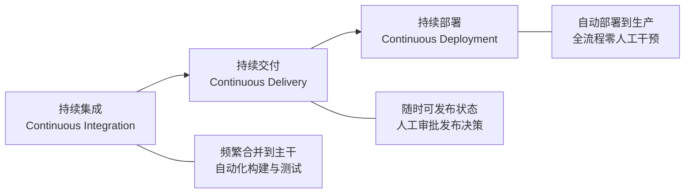
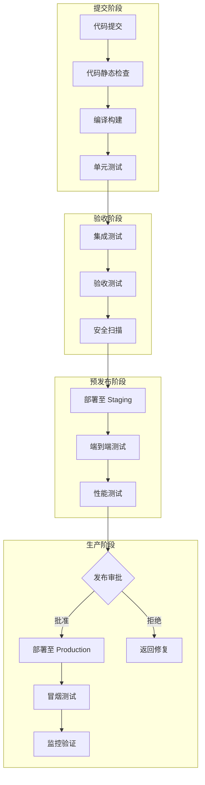
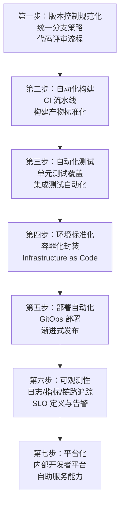

# 持续交付概述：定义、价值与演进

## 背景与问题定义

软件交付的效率与质量，始终是工程组织的核心命题。随着业务迭代速度的持续加快，传统的瀑布式发布模式——以月甚至季度为周期的集成、测试与部署——已无法适应市场对快速反馈的需求。持续交付（Continuous Delivery, CD）正是在这一背景下被提出并广泛实践的方法论。

持续交付要解决的根本问题是：**如何以可持续的方式，将软件从代码提交安全、快速、可靠地交付到最终用户手中？**

这一问题的重要性直接关联 DORA（DevOps Research and Assessment）四项关键指标：

| DORA 指标 | 与持续交付的关系 |
|-----------|-----------------|
| Deployment Frequency（部署频率） | 持续交付的流水线能力直接决定部署频率上限 |
| Lead Time for Changes（变更前置时间） | 从提交到部署的端到端自动化缩短前置时间 |
| Change Failure Rate（变更失败率） | 自动化测试与质量门禁降低失败率 |
| Mean Time to Recovery（平均恢复时间） | 标准化回滚与快速部署机制加速故障恢复 |

## 核心概念

### 持续交付的定义

Jez Humble 与 David Farley 在《Continuous Delivery: Reliable Software Releases through Build, Test, and Deployment Automation》中给出了被广泛引用的定义：

> 持续交付是一种软件开发实践，通过它，软件可以随时被可靠地发布到生产环境中。其目标是使软件始终处于可发布状态。

这一定义包含三个关键约束：

1. **随时可发布**：代码主干在任何时刻都处于可部署状态
2. **可靠发布**：发布过程是可重复、可预测、可回滚的
3. **生产环境**：交付的终点是真实用户可访问的生产环境

### 持续集成、持续交付与持续部署的关系

三者构成递进关系，每一层都是前一层的自然延伸：



| 阶段 | 核心活动 | 人工介入点 | 产出 |
|------|---------|-----------|------|
| 持续集成（CI） | 编码→构建→单元测试→集成测试 | 代码提交 | 可构建产物 |
| 持续交付（CD） | CI + 验收测试→预发布验证→发布准备 | 发布审批 | 可发布产物 |
| 持续部署（CD） | CD + 自动部署→生产环境→监控验证 | 无 | 已部署的生产版本 |

**关键区分**：持续交付与持续部署的区别在于"最后一公里"的决策权。持续交付要求软件始终处于可发布状态，但发布决策由人做出；持续部署则将这一决策也自动化，通过预定义的规则（如测试通过率、性能指标）决定是否推进到生产环境。

### 持续交付的核心原则

1. **一切自动化**：构建、测试、部署、环境配置——凡是可重复的，皆应自动化
2. **一切版本化**：代码、配置、基础设施定义、数据库迁移脚本——凡影响交付的，皆应纳入版本控制
3. **频繁集成**：小批量、高频次地合并代码，避免大规模集成的风险
4. **快速反馈**：在流水线的最早期发现缺陷，反馈越早，修复成本越低
5. **可重复构建**：同样的源码在任何时间、任何环境下构建出完全一致的产物

## 架构设计

### 发布流水线

持续交付的核心架构是发布流水线（Deployment Pipeline），它定义了从代码提交到生产部署的完整路径：



### 流水线设计原则

| 原则 | 说明 | 反模式 |
|------|------|--------|
| 只做一次构建 | 构建产物在后续阶段只做部署，不重新编译 | 每个阶段重新编译源码 |
| 流式推进 | 后续阶段只在前一阶段通过后执行 | 跳过测试直接部署 |
| 环境递进 | Dev → Staging → Production 逐级推进 | 直接从 Dev 部署到 Production |
| 失败即停 | 任何阶段失败则终止流水线，优先修复 | 忽略失败继续推进 |
| 产物不可变 | 构建产物一旦生成，不可修改 | 在部署阶段修改配置后重新打包 |

## 实现方案

### 工具链选型

| 工具类别 | 推荐方案 | 适用场景 | 备注 |
|---------|---------|---------|------|
| CI 引擎 | GitHub Actions | GitHub 托管项目，中小型团队 | 市场份额增长最快，生态丰富 |
| CI 引擎 | GitLab CI | GitLab 托管项目，企业级 | 内置 DevSecOps，一体化方案 |
| CI 引擎 | Jenkins | 遗留系统，复杂插件需求 | 仍在使用但新建项目建议迁移 |
| CD 引擎 | Argo CD | Kubernetes 环境，GitOps 模式 | CNCF 毕业项目，社区活跃 |
| CD 引擎 | Flux | Kubernetes 环境，轻量 GitOps | CNCF 毕业项目，配置简洁 |
| CD 引擎 | Spinnaker | 多云多集群，复杂部署策略 | 学习曲线陡峭，新项目可考虑 ArgoCD |
| 制品仓库 | JFrog Artifactory | 企业级制品管理 | 支持所有主流包格式 |
| 制品仓库 | Harbor | 容器镜像管理 | CNCF 毕业项目，云原生首选 |

### GitHub Actions 基础流水线示例

以下是一个包含构建、测试、容器镜像构建与推送的基础 CI/CD 流水线：

```yaml
name: CI/CD Pipeline

on:
  push:
    branches: [main]
  pull_request:
    branches: [main]

env:
  REGISTRY: ghcr.io
  IMAGE_NAME: ${{ github.repository }}

jobs:
  # 阶段一：代码检查与单元测试
  test:
    runs-on: ubuntu-latest
    steps:
      - name: Checkout code
        uses: actions/checkout@v4

      - name: Setup runtime
        uses: actions/setup-go@v5
        with:
          go-version: '1.22'

      - name: Run linter
        uses: golangci/golangci-lint-action@v6
        with:
          version: latest

      - name: Run unit tests
        run: go test -v -race -coverprofile=coverage.out ./...

      - name: Upload coverage
        uses: codecov/codecov-action@v4
        with:
          files: ./coverage.out

  # 阶段二：构建容器镜像
  build:
    needs: test
    runs-on: ubuntu-latest
    permissions:
      contents: read
      packages: write
    steps:
      - name: Checkout code
        uses: actions/checkout@v4

      - name: Log in to Container Registry
        uses: docker/login-action@v3
        with:
          registry: ${{ env.REGISTRY }}
          username: ${{ github.actor }}
          password: ${{ secrets.GITHUB_TOKEN }}

      - name: Extract metadata
        id: meta
        uses: docker/metadata-action@v5
        with:
          images: ${{ env.REGISTRY }}/${{ env.IMAGE_NAME }}
          tags: |
            type=sha,prefix=
            type=ref,event=branch

      - name: Build and push image
        uses: docker/build-push-action@v6
        with:
          context: .
          push: ${{ github.event_name == 'push' }}
          tags: ${{ steps.meta.outputs.tags }}
          labels: ${{ steps.meta.outputs.labels }}
          cache-from: type=gha
          cache-to: type=gha,mode=max

  # 阶段三：部署到 Staging
  deploy-staging:
    needs: build
    runs-on: ubuntu-latest
    if: github.event_name == 'push' && github.ref == 'refs/heads/main'
    environment: staging
    steps:
      - name: Deploy to staging
        run: |
          echo "Deploying ${{ env.REGISTRY }}/${{ env.IMAGE_NAME }}:sha-$(git rev-parse --short HEAD) to staging"
          # 实际部署逻辑：kubectl apply / argocd app sync 等

  # 阶段四：部署到 Production
  deploy-production:
    needs: deploy-staging
    runs-on: ubuntu-latest
    if: github.event_name == 'push' && github.ref == 'refs/heads/main'
    environment: production
    steps:
      - name: Deploy to production
        run: |
          echo "Deploying to production with canary strategy"
          # 实际部署逻辑：渐进式发布 / 金丝雀部署等
```

### 分步实施指南

持续交付的实施是一个渐进过程，建议按以下路径推进：



**第一阶段（1-3 个月）**：建立 CI 基础能力
- 统一代码仓库和分支策略
- 搭建 CI 流水线，确保每次提交触发构建和测试
- 建立代码静态检查和单元测试覆盖率要求

**第二阶段（3-6 个月）**：构建 CD 能力
- 容器化所有应用，标准化构建产物
- 搭建 Staging 环境，实现自动部署
- 引入 GitOps 部署模式

**第三阶段（6-12 个月）**：持续优化与平台化
- 实施渐进式部署策略（金丝雀、蓝绿）
- 建立可观测性体系，定义 SLO
- 构建内部开发者平台，提供自助服务

## 最佳实践

### 业界推荐做法

1. **Trunk-Based Development**：保持主干始终可部署，使用 Feature Flag 管理未完成功能，分支存活时间不超过一天
2. **构建产物不可变**：一次构建，多处部署。不同环境仅通过环境变量和配置注入差异
3. **部署与发布解耦**：部署是技术动作（将版本放到服务器），发布是业务决策（将版本暴露给用户），两者应独立控制
4. **数据库变更向前兼容**：数据库 Migration 必须向前兼容，避免部署时的锁表和数据丢失
5. **灾难恢复演练**：定期执行回滚演练，验证回滚流程的可靠性

### 常见反模式与规避方法

| 反模式 | 表现 | 危害 | 规避方法 |
|--------|------|------|---------|
| 冰山发布 | 发布包含大量变更，难以定位问题 | 变更失败率飙升 | 小批量、高频次发布 |
| 手工部署 | 依赖运维人员手动执行部署步骤 | 不可重复、易出错 | 全流程自动化 |
| 环境漂移 | 各环境配置不一致 | "在我机器上没问题" | Infrastructure as Code + 容器化 |
| 测试后补 | 开发完成后集中测试 | 缺陷发现晚，修复成本高 | 测试左移，TDD/BDD |
| 审批瓶颈 | 发布需多级人工审批 | 部署频率低下 | 自动化质量门禁替代人工审批 |
| 构建缓存滥用 | 依赖本地缓存导致构建不可重复 | 构建结果不一致 | 远程缓存 + 锁文件 |

## 效果度量

### 关键指标定义

| 指标 | 定义 | 采集方式 | 目标值 |
|------|------|---------|--------|
| 构建成功率 | 成功构建次数 / 总构建次数 | CI 系统统计 | > 95% |
| 流水线执行时间 | 从提交到部署完成的总耗时 | CI/CD 系统统计 | < 30 分钟 |
| 部署频率 | 单位时间内成功部署到生产的次数 | 部署系统统计 | 按需（Elite） |
| 变更前置时间 | 从代码提交到生产部署的时间 | 版本控制系统 + 部署系统 | < 1 天（Elite） |
| 变更失败率 | 导致生产故障的部署比例 | 事故管理系统 | 0–15%（Elite） |
| 平均恢复时间 | 从生产故障到恢复的时间 | 监控系统 | < 1 小时（Elite） |

### DORA 性能分级

DORA 历年研究报告将软件交付效能分为低、中、高、精英（Elite）四个等级（2024 年报因指标分布变化，部分指标不再严格区分精英与高档）：

```mermaid
xychart-beta
    title "DORA 指标：Elite vs Low Performer 对比"
    x-axis ["部署频率\n(次/天)", "变更前置时间\n(小时)", "变更失败率\n(%)", "平均恢复时间\n(小时)"]
    y-axis "归一化数值" 0 --> 10
    bar [10, 9, 9.5, 9]
    bar [0.1, 1, 3, 2]
```



> **注**：图中数值为相对示意的归一化数值，非实测数据。DORA 报告在 2021 年新增了第五项指标——**Reliability（可靠性）**，衡量系统稳定性和用户体验；2023 年起，报告还强调了文档质量和团队健康度对交付效能的影响。

## 总结

### 核心要点

1. 持续交付是一套涵盖构建、测试、部署全生命周期的工程方法论，其核心目标是使软件始终处于可发布状态
2. 持续集成→持续交付→持续部署构成递进关系，每一步都是前一步的自然延伸
3. 发布流水线是持续交付的核心架构，遵循"只构建一次、环境递进、失败即停"等原则
4. 实施路径应渐进式推进：先建立 CI 基础能力，再构建 CD 能力，最终走向平台化
5. DORA 指标是衡量持续交付效能的黄金标准，第五项指标 Reliability 于 2021 年加入

### 延伸阅读

- Jez Humble, David Farley. *Continuous Delivery: Reliable Software Releases through Build, Test, and Deployment Automation*. Addison-Wesley, 2010
- Google Cloud. *DORA State of DevOps Report 2024*. https://cloud.google.com/resources/state-of-devops
- Martin Fowler. *DeploymentPipeline*. https://martinfowler.com/bliki/DeploymentPipeline.html
- CNCF. *Cloud Native Landscape - CI/CD*. https://landscape.cncf.io/
