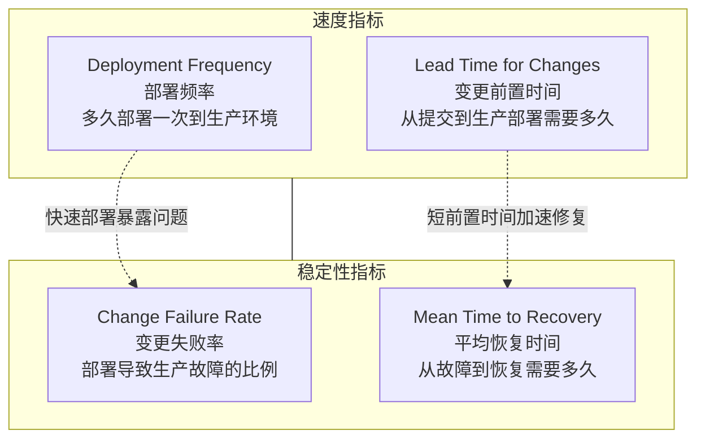
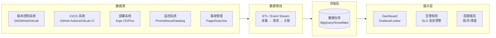
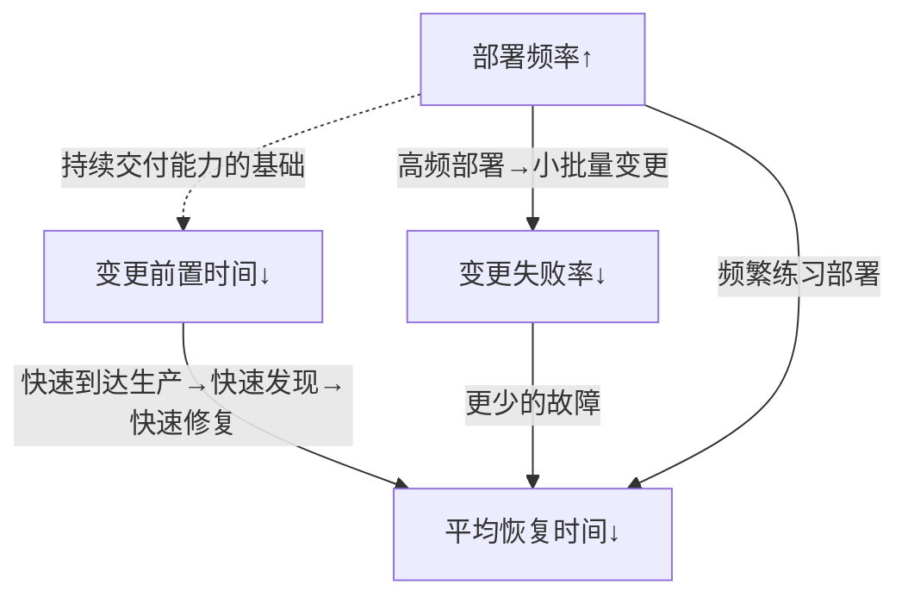
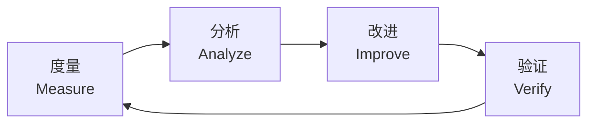

# DORA指标体系：衡量软件交付效能的黄金标准

## 背景与问题定义

"我们团队的交付效率到底怎么样？"——这是每一个工程管理者都会面对的问题。然而，传统的度量方式往往陷入两个极端：要么过于粗放（"这个版本按时交付了吗？"），要么过于微观（"你今天写了多少行代码？"）。前者无法揭示瓶颈，后者则容易引发度量驱动的行为扭曲。

DORA（DevOps Research and Assessment）指标体系正是为解决这一问题而生。自 2014 年起，DORA 团队（后被 Google Cloud 收编）持续对全球数万名软件从业者进行调研，以实证方法识别出与软件交付效能显著相关的关键指标。

DORA 指标体系解决的核心问题是：**如何以科学、可量化、可比较的方式，评估和改进软件组织的交付效能？**

## 核心概念

### 四项关键指标

DORA 研究最初识别出四项与交付效能高度相关的指标，被称为"Four Key Metrics"：



| 指标 | 英文全称 | 定义 | 采集点 |
|------|---------|------|--------|
| 部署频率 | Deployment Frequency | 单位时间内成功部署到生产环境的次数 | 部署系统日志 |
| 变更前置时间 | Lead Time for Changes | 从代码提交到该变更成功运行在生产环境的时间 | 版本控制系统 + 部署系统 |
| 变更失败率 | Change Failure Rate | 导致生产环境服务降级或需要修复的部署占比 | 事故管理系统 + 部署系统 |
| 平均恢复时间 | Mean Time to Recovery | 从生产环境发生故障到服务恢复正常的时间 | 监控告警系统 |

**设计哲学**：速度与稳定性不是对立面。DORA 研究的实证数据表明，Elite 级别团队同时在速度和稳定性指标上表现优异——高部署频率与低变更失败率可以同时实现。

### 第五项指标：Reliability

2021 年 DORA 报告引入第五项核心指标——**Reliability（可靠性）**，标志着度量体系从"交付速度与质量"扩展到"运行时可靠性"：

| 维度 | 指标 | 说明 |
|------|------|------|
| 可靠性 | Reliability | 系统是否按预期运行，是否满足用户的可用性期望 |

Reliability 的衡量通常采用 SLO（Service Level Objective）达成率，即：

```
SLO 达成率 = (总请求量 - 违反 SLO 的请求数) / 总请求量 × 100%
```

### 性能分级标准

DORA 将团队效能分为四个等级：Elite（卓越）、High（高）、Medium（中）、Low（低）。

| 指标 | Elite | High | Medium | Low |
|------|-------|------|--------|-----|
| 部署频率 | 按需，多次/天 | 每天～每周 | 每周～每月 | 每月～每半年 |
| 变更前置时间 | < 1 天 | 1 天～1 周 | 1 周～1 月 | > 1 个月 |
| 变更失败率 | 0–15% | 16–30% | 16–30% | 16–60% |
| 平均恢复时间 | < 1 小时 | < 1 天 | 1 天～1 周 | > 1 周 |

> **注**：上表为 DORA 2021–2022 年报的分级口径（Elite 变更前置时间自 2021 年起由"< 1 小时"调整为"< 1 天"；变更失败率口径 2024 年报起仅统计一日内恢复的失败变更）。自 2023 年报起，DORA 不再按四级基准发布阈值对比，转而强调持续改进。

### 2024 年报告的关键发现

1. **AI 辅助开发的矛盾**：AI 工具显著提升了开发者的主观生产力感受，但对 DORA 客观指标的影响呈混合结果——部分团队文档质量下降，代码可审查性降低
2. **文档质量的影响**：DORA 2023 年报发现，拥有高质量文档的团队，组织绩效达标的概率提升 **3.5 倍**，文档质量是组织绩效最强的预测因子之一
3. **Platform Engineering 的关联**：采用 Platform Engineering 实践的团队在开发者体验和交付吞吐量上均有显著改善
4. **可持续交付**：焦点从"多快"转向"多可持续"——精英团队不仅快，而且稳定、健康
5. **心理安全**：团队心理安全感仍是高性能团队的核心特征，与代码审查质量、事故响应效率正相关

## 架构设计

### 指标采集架构

构建一个完整的 DORA 指标采集与可视化体系，需要整合多个数据源：



### 指标关联模型

四个核心指标并非独立存在，它们之间存在因果关系：



## 实现方案

### 工具链选型

| 方案 | 优势 | 劣势 | 适用场景 |
|------|------|------|---------|
| Google Cloud DORA Dashboard | 官方出品，指标定义准确 | 依赖 Google Cloud 生态 | Google Cloud 用户 |
| Faros CE | 开源，连接多数据源 | 社区规模较小 | 中小型团队 |
| Jira + Bitbucket Pipelines | Atlassian 生态一体化 | 指标精度受配置影响 | Atlassian 用户 |
| 自建（Grafana + Prometheus） | 完全定制化 | 开发维护成本高 | 有数据工程能力的团队 |
| LinearB | 专注工程效能，开箱即用 | 商业产品，成本较高 | 中大型团队 |

### DORA 指标采集：GitHub Actions 示例

以下示例展示如何在 CI/CD 流水线中嵌入 DORA 指标的采集点：

```yaml
name: DORA Metrics Collection

on:
  push:
    branches: [main]
  workflow_dispatch:

jobs:
  deploy:
    runs-on: ubuntu-latest
    steps:
      - name: Checkout code
        uses: actions/checkout@v4
        with:
          fetch-depth: 0

      - name: Record deployment event
        env:
          DEPLOY_TIME: ${{ github.event.head_commit.timestamp }}
          COMMIT_SHA: ${{ github.sha }}
          ENVIRONMENT: production
        run: |
          # 记录部署事件到时序数据库
          # 部署频率 = 单位时间内的部署事件计数
          # 变更前置时间 = 部署时间 - 提交时间
          COMMIT_TIME=$(git log -1 --format=%ct $COMMIT_SHA)
          DEPLOY_TIMESTAMP=$(date +%s)
          LEAD_TIME=$((DEPLOY_TIMESTAMP - COMMIT_TIME))

          echo "Deployment Frequency: +1"
          echo "Lead Time for Changes: ${LEAD_TIME}s"
          echo "Commit SHA: ${COMMIT_SHA}"
          echo "Environment: ${ENVIRONMENT}"

          # 发送到指标收集端点
          curl -X POST "${{ secrets.METRICS_ENDPOINT }}/deployments" \
            -H "Content-Type: application/json" \
            -d "{
              \"commit_sha\": \"${COMMIT_SHA}\",
              \"commit_time\": ${COMMIT_TIME},
              \"deploy_time\": ${DEPLOY_TIMESTAMP},
              \"lead_time_seconds\": ${LEAD_TIME},
              \"environment\": \"${ENVIRONMENT}\",
              \"deployer\": \"${{ github.actor }}\"
            }"
```

### 变更失败率与恢复时间采集

```yaml
name: Incident Tracking

on:
  issues:
    types: [opened, closed, labeled]

jobs:
  track-incident:
    if: contains(github.event.issue.labels.*.name, 'incident')
    runs-on: ubuntu-latest
    steps:
      - name: Record incident metrics
        env:
          ISSUE_NUMBER: ${{ github.event.issue.number }}
          ACTION: ${{ github.event.action }}
          CREATED_AT: ${{ github.event.issue.created_at }}
          CLOSED_AT: ${{ github.event.issue.closed_at }}
        run: |
          if [ "$ACTION" = "closed" ]; then
            # 计算 MTTR（GitHub 托管 runner 为 Linux，使用 GNU date 语法）
            CREATED_EPOCH=$(date -d "$CREATED_AT" +%s 2>/dev/null || echo "0")
            CLOSED_EPOCH=$(date -d "$CLOSED_AT" +%s 2>/dev/null || echo "0")

            if [ "$CREATED_EPOCH" != "0" ] && [ "$CLOSED_EPOCH" != "0" ]; then
              MTTR=$((CLOSED_EPOCH - CREATED_EPOCH))
              echo "MTTR for incident #${ISSUE_NUMBER}: ${MTTR}s"

              curl -X POST "${{ secrets.METRICS_ENDPOINT }}/incidents/close" \
                -H "Content-Type: application/json" \
                -d "{
                  \"incident_id\": \"${ISSUE_NUMBER}\",
                  \"mttr_seconds\": ${MTTR},
                  \"closed_at\": \"${CLOSED_AT}\"
                }"
            fi
          fi
```

### 分步实施指南

**第一步：建立基线（Week 1-2）**

在引入任何改进措施前，先测量当前的 DORA 指标水平。即使数据不完整，粗略的基线也胜过没有数据。

| 指标 | 基线采集方法 | 精度 |
|------|------------|------|
| 部署频率 | 统计过去 3 个月的生产部署次数 | 中 |
| 变更前置时间 | 抽样 10 个需求，从 Jira 创建到上线的时间 | 低 |
| 变更失败率 | 统计过去 3 个月因部署导致的生产事故占比 | 中 |
| 平均恢复时间 | 统计过去 3 个月生产事故的平均修复时长 | 中 |

**第二步：自动化采集（Week 3-6）**

部署指标采集管线，实现自动化数据收集。关键步骤：

1. 在 CI/CD 流水线中埋点，记录每次部署的时间戳和关联的 Commit SHA
2. 建立部署事件与事故事件的关联模型
3. 将数据汇入时序数据库或数据仓库
4. 搭建 Grafana Dashboard 可视化

**第三步：持续改进（Week 7+）**

基于数据驱动的改进循环：



## 最佳实践

### 业界推荐做法

1. **指标驱动而非指标指挥**：DORA 指标用于识别瓶颈和验证改进效果，而非用于考核个人绩效。将指标用于个人考核会导致数据造假和行为扭曲
2. **先建立基线，再制定目标**：不了解当前水平就设定目标，要么目标过低无意义，要么目标过高挫伤团队信心
3. **速度与稳定性并重**：只追求部署频率而忽视变更失败率，会适得其反。DORA 研究证实，Elite 团队在两类指标上均表现优异
4. **关注趋势而非绝对值**：从 Low 到 Medium 的进步，比从 High 到 Elite 的进步更有组织价值
5. **结合上下文解读**：部署频率突然下降可能是因为团队在偿还技术债务，而非效率倒退

### 常见反模式与规避方法

| 反模式 | 表现 | 危害 | 规避方法 |
|--------|------|------|---------|
| Goodhart's Law | "当一个指标成为目标，它就不再是好指标" | 为达标而优化指标本身，而非改进实际过程 | 使用指标组合，而非单一指标决策 |
| 指标孤岛 | 各团队用不同方式计算同一指标 | 无法横向比较，失去标杆意义 | 统一指标定义和采集方法 |
| 精度陷阱 | 追求指标的绝对精确，迟迟无法启动 | 完美主义阻碍行动，粗略数据即可指导改进 | 先有粗数据，再逐步精细化 |
| 忽视定性数据 | 只看数字，不看团队反馈 | 数字可能掩盖深层问题 | 定期开展开发者满意度调查 |
| 选择性报告 | 只展示改善的指标，隐藏退化的指标 | 管理层看到虚假进步 | 全量指标透明展示 |

## 效果度量

### DORA 指标的投资回报

根据 DORA 多年研究数据，Elite 团队与 Low 团队的差距可达数量级（以下倍数出自《Accelerate State of DevOps Report 2019》）：

| 维度 | Elite vs Low 差距 | 业务影响 |
|------|-------------------|---------|
| 部署频率 | 208 倍 | 市场响应速度 |
| 变更前置时间 | 106 倍 | 功能交付速度 |
| 变更失败率 | 7 倍 | 系统稳定性 |
| 平均恢复时间 | 2,604 倍 | 故障影响范围 |

> **注**：2019 年之后的年报未再发布同口径的倍数对比（2023 年报起不再按 Elite/Low 分级），切勿将该表数值当作现行官方基准。

### 度量体系成熟度模型

| 级别 | 特征 | 典型表现 |
|------|------|---------|
| L0 - 无度量 | 依赖主观感受判断交付效能 | "感觉还行" |
| L1 - 手动度量 | 定期人工收集数据，表格汇报 | 季度总结中计算部署次数 |
| L2 - 自动采集 | CI/CD 中埋点，自动采集部分指标 | Dashboard 可查看部署频率 |
| L3 - 全量采集 | 四项指标全覆盖，自动化可视化 | 完整 DORA Dashboard |
| L4 - 预测驱动 | 基于历史数据预测趋势，提前预警 | "按当前趋势，下周变更失败率可能超标" |

## 总结

### 核心要点

1. DORA 四项关键指标（部署频率、变更前置时间、变更失败率、平均恢复时间）是衡量软件交付效能的实证标准
2. 2021 年新增第五项指标——Reliability，强调运行时可靠性与交付效能的统一
3. 速度与稳定性不矛盾：Elite 团队在两类指标上同时表现优异
4. 文档质量是 DORA 2023 年报确认的关键驱动因素，高文档质量团队绩效达标概率提升 3.5 倍
5. 指标应用于驱动改进，而非考核个人——Goodhart's Law 是永恒的警醒

### 延伸阅读

- Nicole Forsgren, Jez Humble, Gene Kim. *Accelerate: The Science of Lean Software and DevOps*. IT Revolution, 2018
- Google Cloud. *DORA State of DevOps Report 2024*. https://cloud.google.com/resources/state-of-devops
- DORA Team. *DORA Quick Check*. https://www.dora.dev/quickcheck/
- Steve Smith. *Measuring Continuous Delivery*. https://www.continuous-delivery.co.uk/
