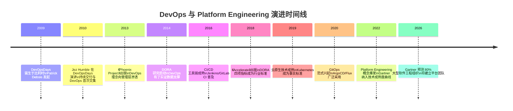
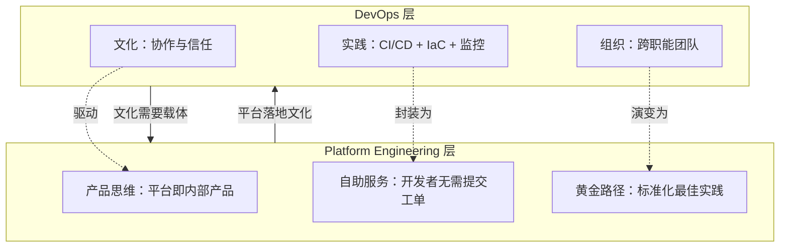
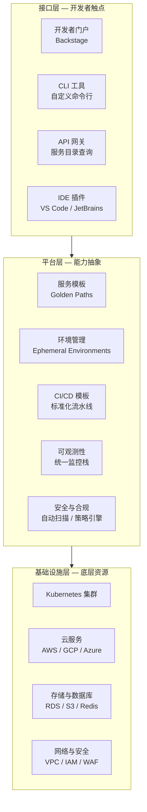

# DevOps与Platform Engineering：从文化到平台

## 背景与问题定义

DevOps 运动自 2009 年诞生以来，已深刻改变了软件交付的方式。然而，经过十余年的实践，组织在推进 DevOps 时普遍面临一个困境：**文化倡导容易，落地执行困难。** DevOps 强调打破 Dev 与 Ops 之间的壁垒，但当团队规模扩大、系统复杂度提升时，仅靠文化驱动已不足以维持高效的交付节奏。

Platform Engineering（平台工程）正是在这一背景下兴起的实践方向。它将 DevOps 的文化理念转化为可落地、可度量的平台产品，通过构建内部开发者平台（Internal Developer Platform, IDP），为开发团队提供自助式的基础设施与服务能力。

本文要解决的核心问题是：**DevOps 与 Platform Engineering 的关系是什么？组织应如何从 DevOps 文化演进到 Platform Engineering 实践？**

## 核心概念

### DevOps 的演进历程



### DevOps 的四种认知维度

业界对 DevOps 的理解历经演化，形成了四种主要认知：

| 维度 | 核心主张 | 局限性 |
|------|---------|--------|
| 一组技术 | DevOps = 自动化运维 + CI/CD + Docker + IaC | 忽视了技术背后的文化和组织问题 |
| 一个职能 | 设立 DevOps 工程师/部门 | 违背了 DevOps 打破壁垒的初衷，形成新孤岛 |
| 一种文化 | 鼓励 Dev 与 Ops 协作、信任、共担 | 文化难以量化和复制，无法规模化 |
| 一种组织架构 | 将 Dev 与 Ops 置于同一团队 | Ops 资源稀缺，无法为每个团队配备 |

**本质定位**：DevOps 首先是一种鼓励协作的研发文化——这一认知已成为业界共识。但文化的传播需要载体，这正是 Platform Engineering 的价值所在。

### Platform Engineering 的核心定义

Platform Engineering 是一种以产品思维构建内部开发者平台的工程实践：

> Platform Engineering 是设计并构建工具链和工作流的学科，旨在为软件研发组织提供自助服务能力。平台团队将基础设施、流水线、环境配置等能力封装为可复用的服务，使开发团队能够自主完成从代码到生产的全流程，无需提交工单或等待运维支持。

### DevOps 与 Platform Engineering 的关系



| 对比维度 | DevOps | Platform Engineering |
|---------|--------|---------------------|
| 核心关注 | 破除 Dev 与 Ops 壁垒 | 构建自助服务平台 |
| 方法论 | 文化运动 | 产品思维 |
| 目标 | 协作 | 自助 |
| 适用范围 | 团队级 | 组织级 |
| 落地载体 | 流程和工具链 | 内部开发者平台（IDP） |
| 度量方式 | DORA 指标 | 开发者体验（DevEx）+ DORA |

## 架构设计

### 内部开发者平台（IDP）参考架构

Platform Engineering 的核心产出是 IDP，其典型架构如下：



### 平台能力矩阵

| 能力域 | 具体服务 | 底层技术 | 自助程度 |
|--------|---------|---------|---------|
| 应用创建 | 项目脚手架、服务模板 | Backstage Templates, Cookiecutter | 全自助 |
| CI/CD | 标准化流水线模板 | GitHub Actions, GitLab CI, Tekton | 全自助 |
| 环境管理 | 临时环境、预发布环境 | Kubernetes Namespace, vcluster | 全自助 |
| 数据库 | 数据库实例创建与迁移 | Cloud SQL, Crossplane | 半自助 |
| 可观测性 | 日志、指标、链路追踪接入 | OpenTelemetry, Grafana Stack | 全自助 |
| 安全扫描 | 代码扫描、镜像扫描、依赖检查 | Trivy, Snyk, OPA | 全自动 |
| 密钥管理 | 证书签发、密钥轮转 | Vault, External Secrets Operator | 半自助 |
| 成本管理 | 资源配额、成本归集 | Kubecost, Cloud Billing API | 可视化 |

## 实现方案

### 工具链选型

| 组件 | 推荐方案 | 备选方案 | 说明 |
|------|---------|---------|------|
| 开发者门户 | Backstage | Port, OpsLevel | Backstage 是事实标准，CNCF 孵化项目 |
| 基础设施编排 | Crossplane | Pulumi, Terraform | Crossplane 原生 Kubernetes，适合 GitOps |
| 密钥管理 | HashiCorp Vault | AWS Secrets Manager, External Secrets | Vault 功能最全面，社区版即可满足 |
| 策略引擎 | OPA / Kyverno | Datree, Checkov | Kyverno 原生 Kubernetes，策略即资源 |
| CI/CD 模板 | GitHub Actions Reusable Workflows | GitLab CI Templates | 可复用工作流是平台化的关键 |
| 环境管理 | vcluster / Namespace | Signadot, Quali | vcluster 提供轻量级虚拟集群 |

### Backstage 服务模板示例

以下是一个 Backstage Software Template 的配置示例，用于创建标准化的微服务项目：

```yaml
# templates/microservice/template.yaml
apiVersion: scaffolder.backstage.io/v1beta3
kind: Template
metadata:
  name: microservice-go
  title: Go Microservice
  description: 创建一个标准化的 Go 微服务项目，包含 CI/CD、Dockerfile 和 Kubernetes 部署清单
spec:
  owner: platform-team
  type: service

  parameters:
    - title: 服务基本信息
      required:
        - name
        - owner
        - description
      properties:
        name:
          title: 服务名称
          type: string
          description: 服务的唯一标识，将用于仓库、镜像和 Kubernetes 资源命名
          pattern: '^[a-z][a-z0-9-]{1,31}$'
        owner:
          title: 负责团队
          type: string
          description: 负责此服务的团队
          ui:field: OwnerPicker
          ui:options:
            allowedKinds:
              - Group
        description:
          title: 服务描述
          type: string
          description: 简要描述服务的功能

    - title: 基础设施配置
      required:
        - environment
      properties:
        environment:
          title: 目标环境
          type: string
          default: staging
          enum:
            - staging
            - production
          enumNames:
            - 预发布环境
            - 生产环境

  steps:
    - id: fetch-base
      name: 获取模板
      action: fetch:template
      input:
        url: ./skeleton
        values:
          name: ${{ parameters.name }}
          owner: ${{ parameters.owner }}
          description: ${{ parameters.description }}
          environment: ${{ parameters.environment }}

    - id: publish
      name: 发布到 Git 仓库
      action: publish:github
      input:
        allowedHosts: ['github.com']
        description: ${{ parameters.description }}
        repoUrl: github.com?owner=${{ parameters.owner }}&repo=${{ parameters.name }}
        defaultBranch: main
        repoVisibility: private

    - id: register
      name: 注册到服务目录
      action: catalog:register
      input:
        catalogInfoUrl: https://github.com/${{ parameters.owner }}/${{ parameters.name }}/blob/main/catalog-info.yaml

  output:
    links:
      - title: 仓库地址
        url: ${{ steps.publish.output.remoteUrl }}
      - title: 在目录中查看
        icon: catalog
        entityRef: ${{ steps.register.output.entityRef }}
```

### Crossplane 基础设施定义示例

以下示例展示如何通过 Crossplane 定义一个标准化的云基础设施组合：

```yaml
# composite-resources/database-xrd.yaml
apiVersion: apiextensions.crossplane.io/v1
kind: CompositeResourceDefinition
metadata:
  name: standarddatabases.platform.example.com
spec:
  group: platform.example.com
  names:
    kind: StandardDatabase
    plural: standarddatabases
  claimNames:
    kind: DatabaseClaim
    plural: databaseclaims
  versions:
    - name: v1alpha1
      served: true
      referenceable: true
      schema:
        openAPIV3Schema:
          type: object
          properties:
            spec:
              type: object
              properties:
                engine:
                  type: string
                  enum: ["mysql", "postgresql"]
                  default: "postgresql"
                size:
                  type: string
                  enum: ["small", "medium", "large"]
                  default: "small"
                environment:
                  type: string
                  enum: ["staging", "production"]
              required:
                - environment
```

```yaml
# composite-resources/database-claim.yaml
apiVersion: platform.example.com/v1alpha1
kind: DatabaseClaim
metadata:
  name: orders-db
  namespace: orders-service
spec:
  engine: postgresql
  size: medium
  environment: staging
  # 开发者只需声明需求，平台自动配置底层资源
  # 包括：实例规格、备份策略、网络策略、监控告警
```

### 分步实施指南

**第一阶段：识别黄金路径（Month 1-2）**

1. 调研组织中 80% 团队的共同工作流模式
2. 提炼出 2-3 条黄金路径（Golden Path）：
   - **微服务创建路径**：从项目创建到首次部署
   - **环境申请路径**：从需求提出到环境就绪
   - **数据库变更路径**：从 Schema 变更到生产执行
3. 为每条黄金路径定义 SLA（如：环境就绪 < 15 分钟）

**第二阶段：构建最小可行平台（Month 3-6）**

1. 部署 Backstage 作为开发者门户
2. 实现第一条黄金路径的完全自助化
3. 引入 Crossplane 或 Terraform 管理基础设施
4. 建立平台反馈渠道（Slack 频道、定期用户访谈）

**第三阶段：扩展与成熟（Month 7-12）**

1. 逐步覆盖所有黄金路径
2. 引入策略引擎（OPA/Kyverno），实现合规自动化
3. 建立平台采纳度量（服务目录覆盖率、自助服务使用率）
4. 构建 Platform as Product 运营模式——定期发布路线图、收集用户反馈

## 最佳实践

### 业界推荐做法

1. **Platform as Product**：将内部平台视为产品，开发团队是用户。平台团队需要做用户研究、定义路线图、收集 NPS，而非仅响应工单
2. **黄金路径而非强制路径**：提供最佳实践的标准化路径，但不禁止团队偏离。强制路径会引发"影子 IT"
3. **文档优先**：平台没有文档等于不存在。DORA 2023 年报发现，高质量文档团队的绩效达标概率提升 3.5 倍
4. **渐进式采纳**：不要求所有团队一次性迁移到平台。从早期采纳者开始，用成功案例吸引更多团队
5. **最小权限 + 自助服务**：开发者不应拥有集群管理员权限，但应能自助完成日常工作。通过抽象层实现"有限权力下的最大自由"

### 常见反模式与规避方法

| 反模式 | 表现 | 危害 | 规避方法 |
|--------|------|------|---------|
| 平台孤岛 | 平台团队闭门造车，开发者不用 | 投入产出比极低 | 用户调研驱动，定期用户访谈 |
| 过度抽象 | 一层又一层抽象，开发者无法理解底层 | 调试困难，黑箱效应 | 透明化设计，提供"逃生舱"（escape hatch） |
| 强制迁移 | 要求所有团队必须在某个时间点迁移 | 引发抵触，影响业务交付 | 渐进采纳，新项目默认使用平台 |
| 工具堆砌 | 引入大量工具但缺乏集成 | 开发者体验碎片化 | 以开发者工作流为中心设计集成 |
| 忽视开发者体验 | 只关注平台功能，忽视使用体验 | 平台采纳率低 | DevEx 度量（DX 框架） |

## 效果度量

### 平台工程效能指标

| 指标类别 | 指标名称 | 定义 | 目标 |
|---------|---------|------|------|
| 采纳 | 平台采纳率 | 使用平台服务的团队数 / 总团队数 | > 70% |
| 采纳 | 自助服务率 | 无需平台团队介入完成的操作占比 | > 80% |
| 效率 | 环境就绪时间 | 从申请到环境可用的时间 | < 15 分钟 |
| 效率 | 新服务上线时间 | 从项目创建到首次部署的时间 | < 1 小时 |
| 满意度 | 开发者 NPS | 平台用户净推荐值 | > 30 |
| 满意度 | 工单减少率 | 平台上线后运维工单的下降比例 | > 50% |
| 质量 | 黄金路径覆盖率 | 走黄金路径完成的工作流占比 | > 60% |

### Gartner 预测

- 2022 年 Gartner 发布《Innovation Insight for Platform Engineering》，将其纳入技术成熟度曲线跟踪
- Gartner 预测：到 2026 年，**80% 的大型软件工程组织**将建立平台团队，作为内部可复用服务与组件的提供方
- Gartner 同时警告：不采用 Platform Engineering 的大型组织，将在开发者生产力上显著落后

## 总结

### 核心要点

1. DevOps 是文化基础，Platform Engineering 是落地载体——两者是继承与演进的关系，而非替代
2. Platform Engineering 的核心产出是 IDP，通过自助服务和黄金路径将 DevOps 文化转化为可复用的平台能力
3. 平台团队应采用产品思维——开发者是用户，平台是产品，NPS 是度量
4. 实施路径：识别黄金路径 → 构建最小可行平台 → 扩展与成熟
5. 文档质量是平台采纳的关键驱动因素，忽视文档的平台等于不存在

### 延伸阅读

- Team Topologies. *Team Topologies: Organizing Business and Technology Teams for Fast Flow*. IT Revolution, 2020
- Gartner. *Innovation Insight for Platform Engineering*. 2024
- CNCF. *Platform Engineering White Paper*. https://tag-app-delivery.cncf.io/whitepapers/platform-eng/
- Backstage. *Official Documentation*. https://backstage.io/docs/
- Crossplane. *Official Documentation*. https://docs.crossplane.io/
