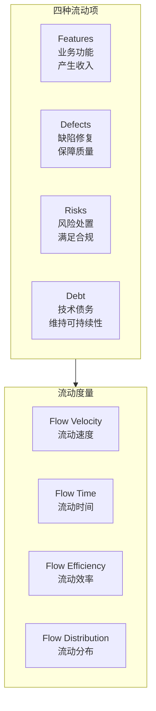
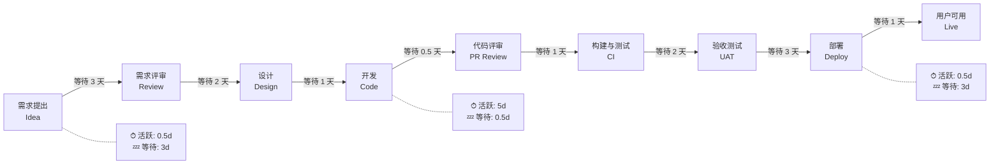
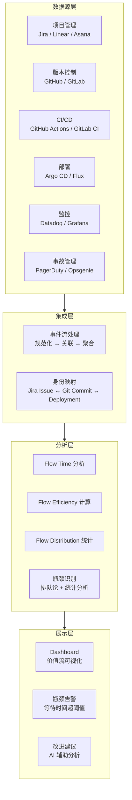
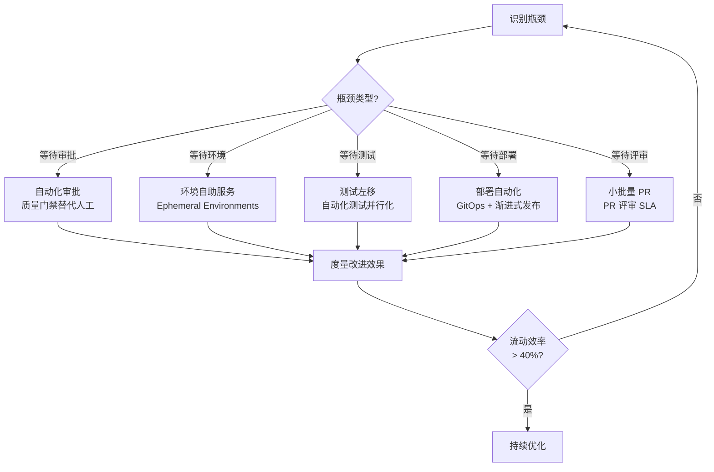

# 价值流管理：端到端交付可视化

## 背景与问题定义

在软件交付的实践中，一个普遍存在的现象是：**从代码提交到生产部署的"技术交付"环节已被大量优化，但从业务需求到用户价值的"端到端交付"仍然缺乏可见性。** 管理层看到的是 Jira 中的需求状态，开发团队看到的是 Git 中的提交记录，运维团队看到的是 Kubernetes 中的部署事件——三者之间没有形成统一的价值流动视图。

价值流管理（Value Stream Management, VSM）正是为解决这一问题而生的方法论。它将精益制造中的价值流映射（Value Stream Mapping）理念引入软件交付领域，通过对从业务需求到用户价值实现的端到端流动进行可视化、度量和优化，识别并消除流动中的瓶颈与浪费。

核心问题：**如何实现从"业务想法"到"用户价值"的全链路可视化，并基于数据驱动的方式持续优化交付效率？**

## 核心概念

### 价值流定义

在软件交付语境下，价值流的定义是：

> 价值流是端到端的活动集合，包括将业务需求转化为用户可感知的价值所需的全部步骤——从需求提出、设计、编码、测试、部署，到最终用户使用并反馈。

### 流动效率与资源效率

这是理解价值流管理的关键区分：

| 概念 | 定义 | 计算方式 | 典型值 |
|------|------|---------|--------|
| 资源效率（Resource Efficiency） | 资源被利用的时间占比 | 活动时间 / 总可用时间 | 80%-95% |
| 流动效率（Flow Efficiency） | 价值项处于活跃处理状态的时间占比 | 活动时间 / (活动时间 + 等待时间) | < 15% |

**关键洞察**：大多数组织中，一个需求从提出到上线，超过 85% 的时间处于等待状态——等待评审、等待测试环境、等待部署窗口、等待审批。优化资源效率（让人更忙）无法改善流动效率（让价值更快流动），反而可能加剧瓶颈。

### Flow Framework

由 Mik Kersten 提出的 Flow Framework 是当前价值流管理的主流方法论，它定义了四种流动项（Flow Item）：



| 流动项 | 类型 | 业务价值 | 典型示例 |
|--------|------|---------|---------|
| Features | 业务驱动 | 直接产生收入 | 新支付方式、推荐算法优化 |
| Defects | 质量驱动 | 避免收入损失 | 线上 Bug 修复、回归问题 |
| Risks | 合规驱动 | 规避合规风险 | 安全漏洞修复、数据隐私合规 |
| Debt | 技术驱动 | 维持长期可持续性 | 重构、框架升级、文档补充 |

**Flow Distribution**（流动分布）是四种流动项在总工作量中的占比。健康的流动分布应保持 Features 占比不低于 40%-50%，Debt 占比不低于 15%-20%，避免"功能债务螺旋"——过度追求功能而忽视技术债务，最终导致交付速度下降。

### 价值流映射

价值流映射是识别瓶颈和浪费的核心工具：



**典型数据**（示例数值，非实测）：从需求提出到用户可用，总耗时约 18 天，其中活跃处理时间约 8 天，等待时间约 10 天，流动效率仅约 44%。在成熟度较低的组织中，流动效率甚至低于 15%。

## 架构设计

### 价值流管理平台架构



### 数据关联模型

价值流管理的核心技术挑战是跨系统数据关联。需要建立以下映射关系：

| 关联关系 | 映射方式 | 技术实现 |
|---------|---------|---------|
| Jira Issue → Git Branch | 分支命名约定（如 `feature/PROJ-123`） | Git Hook + 正则匹配 |
| Git Commit → CI Build | Commit SHA 作为唯一键 | CI 系统原生支持 |
| CI Build → Deployment | Build Number / Image Tag | 部署系统原生支持 |
| Deployment → Incident | 部署时间窗口内的事故 | 时间窗口关联算法 |
| Jira Issue → Deployment | 端到端追踪：Issue → Branch → Build → Deploy | 需要聚合以上所有映射 |

## 实现方案

### 工具链选型

| 方案 | 类型 | 优势 | 劣势 | 适用场景 |
|------|------|------|------|---------|
| Jira Align | 商业 | Atlassian 生态一体化 | 成本高，配置复杂 | 大型企业 |
| Planview / Tasktop | 商业 | 强大的跨工具集成 | 不够轻量 | 需要多工具集成的组织 |
| LeanIX | 商业 | EA + VSM 结合 | 偏架构视角 | 企业架构管理需求 |
| ValueOps (Broadcom) | 商业 | 完整 VSM 功能 | 厂商绑定 | Broadcom 生态用户 |
| Faros CE | 开源 | 社区驱动，可扩展 | 功能有限 | 中小型团队起步 |
| 自建（Grafana + Custom ETL） | 自研 | 完全定制 | 开发维护成本高 | 有数据工程能力的团队 |

### Jira + GitHub 关联配置

以下示例展示如何通过 GitHub Actions 实现 Jira Issue 与 Git Commit/PR 的自动关联：

```yaml
name: Jira Integration

on:
  pull_request:
    types: [opened, synchronize, closed]

jobs:
  jira-sync:
    runs-on: ubuntu-latest
    steps:
      - name: Checkout code
        uses: actions/checkout@v4

      - name: Extract Jira Issue Key
        id: jira
        run: |
          # 从分支名或 PR 标题中提取 Jira Issue Key
          BRANCH_NAME="${{ github.head_ref }}"
          PR_TITLE="${{ github.event.pull_request.title }}"

          ISSUE_KEY=$(echo "$BRANCH_NAME $PR_TITLE" | grep -oE '[A-Z]+-[0-9]+' | head -1)

          if [ -z "$ISSUE_KEY" ]; then
            echo "warn=No Jira issue key found" >> $GITHUB_OUTPUT
            exit 0
          fi

          echo "issue_key=$ISSUE_KEY" >> $GITHUB_OUTPUT
          echo "Found Jira issue: $ISSUE_KEY"

      - name: Update Jira Issue
        if: steps.jira.outputs.issue_key
        uses: atlassian/gajira-transition@v3
        with:
          issue: ${{ steps.jira.outputs.issue_key }}
          transition: "In Review"
        env:
          JIRA_BASE_URL: ${{ secrets.JIRA_BASE_URL }}
          JIRA_USER_EMAIL: ${{ secrets.JIRA_USER_EMAIL }}
          JIRA_API_TOKEN: ${{ secrets.JIRA_API_TOKEN }}

      - name: Record flow metrics
        if: steps.jira.outputs.issue_key
        run: |
          # 记录价值流事件
          curl -X POST "${{ secrets.VSM_ENDPOINT }}/flow-events" \
            -H "Content-Type: application/json" \
            -d "{
              \"event_type\": \"pr_${{ github.event.action }}\",
              \"issue_key\": \"${{ steps.jira.outputs.issue_key }}\",
              \"pr_number\": ${{ github.event.pull_request.number }},
              \"timestamp\": \"$(date -u +%Y-%m-%dT%H:%M:%SZ)\",
              \"actor\": \"${{ github.actor }}\"
            }"
```

### 价值流 Dashboard 配置示例

以下是一个基于 Grafana 的价值流 Dashboard 的 JSON Model 片段：

```json
{
  "dashboard": {
    "title": "Value Stream Metrics",
    "panels": [
      {
        "title": "Flow Time Distribution",
        "type": "barchart",
        "gridPos": { "h": 8, "w": 12, "x": 0, "y": 0 },
        "targets": [
          {
            "expr": "histogram_quantile(0.95, sum(rate(flow_time_seconds_bucket{team=~\"$team\"}[7d])) by (le, flow_item_type))",
            "legendFormat": "{{flow_item_type}} P95"
          }
        ]
      },
      {
        "title": "Flow Distribution",
        "type": "piechart",
        "gridPos": { "h": 8, "w": 6, "x": 12, "y": 0 },
        "targets": [
          {
            "expr": "sum(flow_items_count{team=~\"$team\"}) by (flow_item_type)",
            "legendFormat": "{{flow_item_type}}"
          }
        ]
      },
      {
        "title": "Flow Efficiency Trend",
        "type": "timeseries",
        "gridPos": { "h": 8, "w": 12, "x": 0, "y": 8 },
        "targets": [
          {
            "expr": "avg(flow_efficiency_ratio{team=~\"$team\"})",
            "legendFormat": "Flow Efficiency %"
          }
        ]
      },
      {
        "title": "Bottleneck Identification",
        "type": "table",
        "gridPos": { "h": 8, "w": 12, "x": 12, "y": 8 },
        "targets": [
          {
            "expr": "topk(5, avg by (stage) (wait_time_seconds{team=~\"$team\"}))",
            "format": "table"
          }
        ]
      }
    ]
  }
}
```

### 分步实施指南

**第一步：绘制当前价值流地图（Week 1-2）**

1. 选择一个代表性产品/服务，跟踪 5-10 个需求从提出到上线的完整路径
2. 记录每个阶段的活跃时间和等待时间
3. 计算流动效率
4. 识别 Top 3 瓶颈

**第二步：建立基线度量（Week 3-4）**

| 度量项 | 采集方式 | 频率 |
|--------|---------|------|
| Flow Time（端到端时间） | Jira 创建日期 → 首次部署日期 | 每周 |
| Flow Efficiency | 活跃时间 / Flow Time | 每周 |
| Flow Distribution | 各类 Flow Item 的数量占比 | 每月 |
| WIP（在制品数量） | 各阶段中的 Flow Item 数量 | 每日 |
| 吞吐量（Throughput） | 单位时间内完成的 Flow Item 数量 | 每周 |

**第三步：消除瓶颈（Week 5-12）**

基于数据驱动的瓶颈消除策略：



**第四步：持续优化（Ongoing）**

1. 建立 WIP 限制——每个阶段的在制品数量上限
2. 定期回顾 Flow Distribution，确保技术债务不被持续忽视
3. 引入 DORA 指标与 VSM 指标的联合分析——DORA 衡量技术交付效能，VSM 衡量端到端业务效能
4. 建立"价值流回顾"仪式——每季度回顾端到端流动效率变化

## 最佳实践

### 业界推荐做法

1. **从价值流映射开始**：在引入任何工具之前，先用白板和便利贴画出当前的价值流。工具只是手段，理解流动才是目的
2. **限制 WIP**：Little's Law 告诉我们，在制品越多，前置时间越长。限制每个阶段的在制品数量是提升流动效率最直接的手段
3. **小批量交付**：需求拆分到可在 1-2 天内完成交付的粒度。批量越大，反馈越慢，瓶颈越严重
4. **关注等待而非忙碌**：大多数组织的瓶颈不在"做得慢"，而在"等得久"。减少等待时间是提升流动效率的关键杠杆
5. **技术与业务度量联合**：DORA 指标衡量技术交付效率，Flow Framework 衡量业务交付效果，两者结合才能全面评估

### 常见反模式与规避方法

| 反模式 | 表现 | 危害 | 规避方法 |
|--------|------|------|---------|
| 局部优化 | 优化某个环节的速度，但整体流动效率未改善 | 局部快 ≠ 全局快 | 以端到端 Flow Time 为优化目标 |
| WIP 无限制 | 各阶段同时处理大量需求 | 上下文切换成本高，前置时间长 | 设置 WIP 限制，拉动式流转 |
| 功能债务螺旋 | Features 占比过高，Debt 持续被推迟 | 技术债务积累导致交付速度下降 | Flow Distribution 中 Debt ≥ 15% |
| 度量不透明 | 价值流数据仅管理层可见 | 团队无法自主改进 | 全员可见的 Dashboard |
| 忽视变更类型 | 将所有工作项同等对待 | 无法识别不同流动项的最佳策略 | Flow Framework 四类流动项分类 |

## 效果度量

### 价值流管理成熟度模型

| 级别 | 特征 | 流动效率 | 典型表现 |
|------|------|---------|---------|
| L0 - 不可见 | 无法追踪需求的端到端流动 | 未知 | "需求到哪一步了？"无法回答 |
| L1 - 手动追踪 | 通过会议和邮件追踪需求状态 | < 10% | 每周状态同步会 |
| L2 - 工具集成 | 项目管理与 CI/CD 数据关联 | 10%-25% | Dashboard 可查看 Flow Time |
| L3 - 数据驱动 | 基于数据识别瓶颈并持续改进 | 25%-40% | 瓶颈自动告警 |
| L4 - 预测优化 | 基于历史数据预测交付时间 | > 40% | "该需求预计 3/15 上线" |

### DORA + VSM 联合分析

| 场景 | DORA 指标表现 | VSM 指标表现 | 诊断 |
|------|-------------|-------------|------|
| 技术交付快但业务价值慢 | Elite | Low | 瓶颈在需求到开发的环节（需求评审、设计） |
| 业务需求快但质量差 | High 速度 / Low 稳定性 | High Flow Velocity / High Defect Rate | 过度追求 Features，忽视 Debt 和 Risks |
| 技术和业务都慢 | Low | Low | 全链路瓶颈，需系统性改进 |
| 技术和业务都快 | Elite | High | 持续优化，关注可持续性 |

## 总结

### 核心要点

1. 价值流管理将优化视角从"技术交付"扩展到"端到端业务交付"，关注从需求到价值的全链路流动
2. 流动效率（< 15% 是典型值）与资源效率（80%-95%）是两个独立维度，优化资源效率不一定改善流动效率
3. Flow Framework 定义了四种流动项（Features、Defects、Risks、Debt），健康的 Flow Distribution 应保持 Debt ≥ 15%
4. 价值流映射是识别瓶颈的起点——先白板画图，再工具度量
5. DORA 指标 + VSM 指标联合分析，才能全面评估交付效能

### 延伸阅读

- Mik Kersten. *Project to Product: How to Survive and Thrive in the Age of Digital Disruption with the Flow Framework*. IT Revolution, 2018
- Karen Martin, Mike Osterling. *Value Stream Mapping: How to Visualize Work and Align Leadership for Organizational Transformation*. McGraw-Hill, 2013
- Donald G. Reinertsen. *The Principles of Product Development Flow*. Celeritas Publishing, 2009
- Tasktop. *Value Stream Management Guide*. https://www.tasktop.com/value-stream-management/
