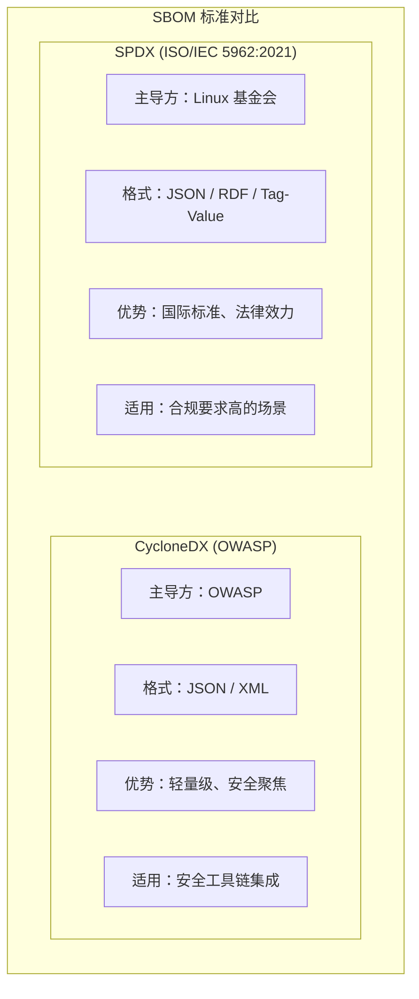
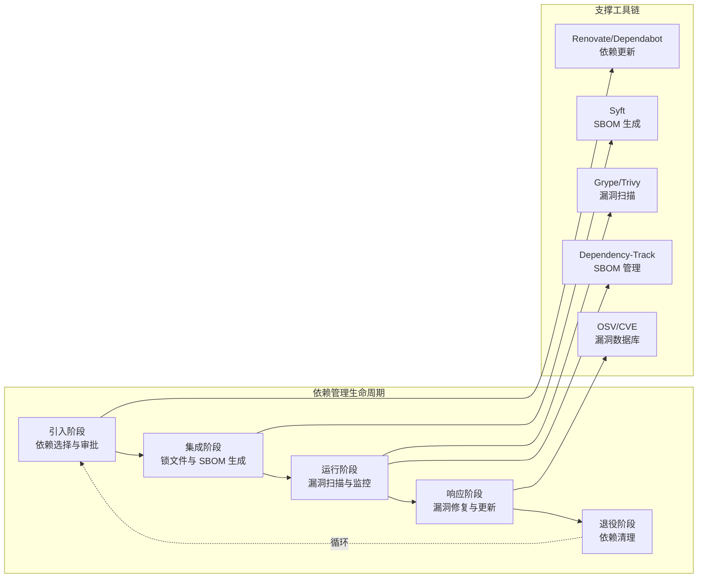
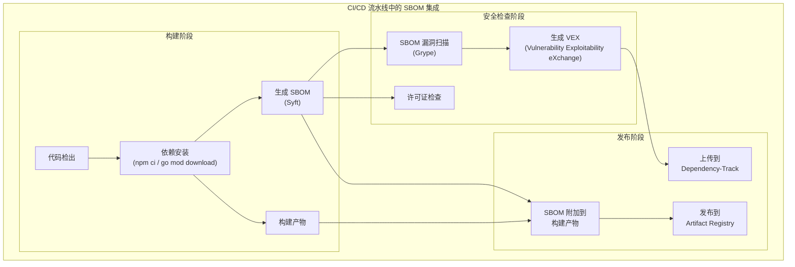
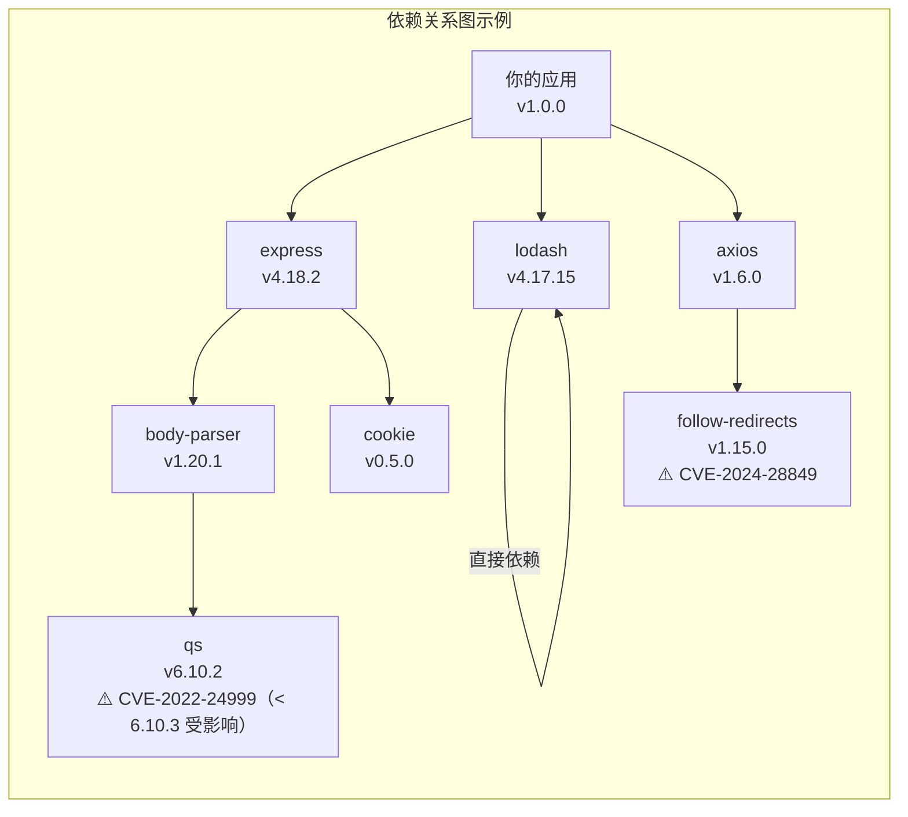

# 依赖管理：供应链安全与SBOM

## 背景与问题定义

现代软件开发的效率很大程度上依赖于开源生态。一个典型的 Web 应用可能直接依赖 50-100 个第三方包，但这些包的传递依赖（Transitive Dependencies）往往达到 500-1000 个。这种"依赖爆炸"带来了巨大的供应链安全风险——每一个依赖都是潜在的攻击面。

2020 年的 SolarWinds 供应链攻击事件震惊了整个行业：攻击者在 SolarWinds Orion 软件的构建过程中注入了后门代码，影响了超过 18,000 个组织，包括美国财政部、国土安全部等政府机构。2021 年的 Log4Shell 漏洞（CVE-2021-44228）则展示了依赖风险的另一种形态：一个被广泛使用的日志库中的漏洞，影响了全球数十亿设备。

这些事件揭示了一个残酷的现实：**现代软件供应链的攻击面已经从"代码本身"扩展到"代码的整个依赖树"**。传统的安全扫描只关注自有代码，而忽略了依赖包中的漏洞和恶意代码。这正是 SBOM（Software Bill of Materials，软件物料清单）成为行业焦点的根本原因。

SBOM 的概念源于制造业的物料清单（Bill of Materials）。正如汽车制造商需要知道每辆车的所有零部件来源，软件生产者也需要知道每个软件的所有依赖来源。美国行政命令 EO 14028 明确要求向联邦政府销售的软件必须提供 SBOM，欧盟 Cyber Resilience Act 2024 将 SBOM 列为数字产品的强制要求，FDA 也要求医疗设备软件提供 SBOM。

本文将系统探讨现代依赖管理的挑战、SBOM 的标准与实践、供应链安全的工具链，以及如何在 CI/CD 流水线中集成依赖安全检查。

## 核心概念

### 依赖爆炸：现代软件的隐形成本

现代软件的依赖结构呈现出"冰山"特征：开发者直接声明的依赖只是水面上的冰山一角，水面下的传递依赖才是真正的规模所在。

以一个典型的 Node.js 项目为例（示例数值，非实测）：

```
package.json 直接依赖：
- express: ^4.18.0
- lodash: ^4.17.0
- axios: ^1.6.0
- winston: ^3.11.0

npm install 后的实际安装：
- 总包数：847
- 直接依赖：4
- 传递依赖：843
- 总代码量：约 150MB
```

这种依赖爆炸带来了三类核心风险：

**风险一：已知漏洞（Known Vulnerabilities）**。传递依赖中可能包含已公开的 CVE（Common Vulnerabilities and Exposures）漏洞。由于开发者通常只关注直接依赖的版本更新，传递依赖中的漏洞往往被忽视。

**风险二：恶意代码注入（Malicious Code Injection）**。攻击者可能通过以下方式注入恶意代码：
- 劫持维护者账号，发布带后门的版本
- 注册与知名包名相似的"typosquatting"包
- 在依赖链上游注入恶意代码（如 event-stream 事件）

**风险三：许可证合规风险（License Compliance Risk）**。传递依赖可能包含与项目不兼容的许可证（如 GPL），导致法律风险。

### SBOM 标准：SPDX 与 CycloneDX

SBOM 是软件依赖的完整清单，包含每个组件的名称、版本、供应商、许可证、哈希值等信息。当前主流的 SBOM 标准有两个：

**SPDX（Software Package Data Exchange）** 由 Linux 基金会主导，于 2021 年成为 ISO/IEC 5962:2021 国际标准。SPDX 的优势在于标准化程度高、国际认可度强，但格式相对复杂。

**CycloneDX** 由 OWASP（Open Web Application Security Project）主导，专注于安全场景。CycloneDX 的优势在于轻量级、易于生成和消费，与安全工具链集成更紧密。



两种标准的核心字段对比：

| 字段 | SPDX | CycloneDX | 说明 |
|------|------|-----------|------|
| 组件名称 | packageName | name | 必填，组件标识 |
| 组件版本 | packageVersion | version | 必填，版本号 |
| 供应商 | supplier | publisher | 可选，组件提供者 |
| 许可证 | concludedLicense | licenses | SPDX 使用 SPDX License Identifier |
| 哈希值 | checksums | hashes | 支持 SHA-256、SHA-512 等 |
| PURL | externalRefs | purl | Package URL，统一包标识符 |
| CPE | externalRefs | cpe | Common Platform Enumeration |
| 关系 | relationships | dependencies | 组件间的依赖关系 |
| 漏洞 | - | vulnerabilities | CycloneDX 原生支持 VEX |

### 法规要求与合规驱动

SBOM 从"最佳实践"转变为"强制要求"，主要受以下法规驱动：

**美国行政命令 EO 14028（2021 年 5 月）**：要求向联邦政府销售的软件必须提供 SBOM，以改善软件供应链的可见性。NIST（美国国家标准与技术研究院）随后发布了详细的实施指南。

**欧盟 Cyber Resilience Act 2024**：要求在欧盟市场销售的数字产品必须提供 SBOM，并确保依赖组件的漏洞得到及时修复。违规将面临最高 1500 万欧元或全球年营业额 2.5% 的罚款。

**FDA 医疗设备网络安全指南（2023 年）**：要求医疗设备制造商在上市申请中提供 SBOM，确保设备依赖的漏洞可追踪。

**美国 SEC 网络安全披露规则（2023 年）**：要求上市公司在 4 天内披露重大网络安全事件，包括供应链攻击。这间接推动企业加强供应链风险管理。

## 架构设计

### 依赖管理生命周期架构

完整的依赖管理应覆盖从引入到退役的全生命周期：



### SBOM 在 CI/CD 流水线中的位置

SBOM 应作为 CI/CD 流水线的标准产出物，与构建产物一起存储和分发：



### 依赖关系图与风险传播

理解依赖关系图对于评估风险传播路径至关重要：



## 实现方案

### 锁文件最佳实践

锁文件（Lock File）是依赖管理的基石，它精确记录了每个依赖的版本和哈希值，确保可重复构建。

| 语言/包管理器 | 锁文件 | 关键特性 |
|--------------|--------|---------|
| Node.js (npm) | package-lock.json | 记录完整依赖树，支持 integrity 校验 |
| Node.js (pnpm) | pnpm-lock.yaml | 使用内容寻址存储，节省磁盘空间 |
| Node.js (yarn) | yarn.lock | 支持 resolutions 强制版本 |
| Go | go.sum | 记录模块哈希，支持模块代理 |
| Python (pip) | requirements.txt + hashes | 需要显式启用哈希校验 |
| Python (poetry) | poetry.lock | 完整依赖锁定 |
| Rust (cargo) | Cargo.lock | 默认锁定，发布到 crates.io 时排除 |
| Java (Maven) | 无原生锁文件 | 可使用 maven-lock-plugin 或 Gradle lockfile |
| Java (Gradle) | gradle.lockfile | Gradle 6+ 支持 |

锁文件管理的核心原则：

1. **锁文件必须提交到版本控制**。这确保所有环境（开发、CI、生产）使用完全相同的依赖版本。

2. **使用确定性安装命令**。如 `npm ci` 而非 `npm install`，`go mod download` 而非 `go get`。

3. **定期更新依赖**。使用 Renovate 或 Dependabot 自动化依赖更新，避免"依赖债务"积累。

4. **启用哈希校验**。确保安装的包与锁文件记录的哈希一致，防止中间人攻击。

### SBOM 生成工具：Syft

Syft 是 Anchore 开源的 SBOM 生成工具，支持多种语言和格式：

```bash
#!/bin/bash
# generate-sbom.sh - 使用 Syft 生成 SBOM

set -euo pipefail

IMAGE_NAME="${1:-myapp:latest}"
OUTPUT_DIR="${2:-./sbom}"
FORMAT="${3:-cyclonedx-json}"

mkdir -p "$OUTPUT_DIR"

echo "=== 使用 Syft 生成 SBOM ==="
echo "目标: $IMAGE_NAME"
echo "格式: $FORMAT"
echo "输出目录: $OUTPUT_DIR"
echo ""

# 安装 Syft（如果未安装）
if ! command -v syft &> /dev/null; then
    echo "安装 Syft..."
    curl -sSfL https://raw.githubusercontent.com/anchore/syft/main/install.sh | sh -s -- -b /usr/local/bin
fi

# 生成 CycloneDX JSON 格式的 SBOM
echo "生成 SBOM..."
syft "$IMAGE_NAME" \
    --output "$FORMAT" \
    --file "$OUTPUT_DIR/sbom.json"

# 同时生成 SPDX 格式（用于合规场景）
syft "$IMAGE_NAME" \
    --output spdx-json \
    --file "$OUTPUT_DIR/sbom-spdx.json"

# 生成人类可读的表格格式
syft "$IMAGE_NAME" \
    --output table \
    --file "$OUTPUT_DIR/sbom.txt"

echo ""
echo "=== SBOM 生成完成 ==="
echo "文件列表："
ls -la "$OUTPUT_DIR"

# 提取关键统计信息
echo ""
echo "=== SBOM 统计 ==="
jq '{
  total_components: (.components | length),
  licenses: [.components[].licenses[]?.license.id] | unique,
  suppliers: [.components[].publisher // "unknown"] | unique | length
}' "$OUTPUT_DIR/sbom.json"
```

### 漏洞扫描工具：Grype

Grype 是 Syft 的配套漏洞扫描工具，支持从 SBOM 或容器镜像直接扫描：

```bash
#!/bin/bash
# scan-vulnerabilities.sh - 使用 Grype 扫描漏洞

set -euo pipefail

SBOM_FILE="${1:-./sbom/sbom.json}"
OUTPUT_DIR="${2:-./security-reports}"
SEVERITY_THRESHOLD="${3:-high}"  # negligible, low, medium, high, critical

mkdir -p "$OUTPUT_DIR"

echo "=== 使用 Grype 扫描漏洞 ==="
echo "SBOM 文件: $SBOM_FILE"
echo "严重性阈值: $SEVERITY_THRESHOLD"
echo ""

# 安装 Grype（如果未安装）
if ! command -v grype &> /dev/null; then
    echo "安装 Grype..."
    curl -sSfL https://raw.githubusercontent.com/anchore/grype/main/install.sh | sh -s -- -b /usr/local/bin
fi

# 执行漏洞扫描
echo "执行扫描..."
grype "sbom:$SBOM_FILE" \
    --output table \
    --output json \
    --file "$OUTPUT_DIR/vulnerability-report.json" \
    --severity "$SEVERITY_THRESHOLD" \
    --fail-on "$SEVERITY_THRESHOLD"

# 生成 SARIF 格式（用于 GitHub Code Scanning）
grype "sbom:$SBOM_FILE" \
    --output sarif \
    --file "$OUTPUT_DIR/vulnerability-report.sarif" \
    --severity "$SEVERITY_THRESHOLD"

echo ""
echo "=== 扫描完成 ==="

# 提取漏洞统计
echo ""
echo "=== 漏洞统计 ==="
jq '{
  total: (.matches | length),
  by_severity: (.matches | group_by(.vulnerability.severity) | map({key: .[0].vulnerability.severity, value: length}) | from_entries),
  critical_packages: [.matches[] | select(.vulnerability.severity == "Critical") | .artifact.name] | unique
}' "$OUTPUT_DIR/vulnerability-report.json"
```

### SBOM 管理平台：Dependency-Track

Dependency-Track 是 OWASP 的开源 SBOM 管理平台，提供持续监控和风险分析：

```yaml
# docker-compose.yml - Dependency-Track 部署配置
version: '3.8'

services:
  apiserver:
    image: dependencytrack/apiserver:latest
    container_name: dtrack-apiserver
    ports:
      - "8081:8080"
    environment:
      - ALPINE_DATABASE_MODE=external
      - ALPINE_DATABASE_URL=jdbc:postgresql://postgres:5432/dtrack
      - ALPINE_DATABASE_DRIVER=org.postgresql.Driver
      - ALPINE_DATABASE_USERNAME=dtrack
      - ALPINE_DATABASE_PASSWORD=${DTRACK_DB_PASSWORD:-dtrack}
      # 配置漏洞数据源
      - VULNERABILITY_SOURCES=NVD,OSV,GITHUB_ADVISORIES
      # 启用策略检查
      - POLICY_VIOLATION_ANALYZER_ENABLED=true
    volumes:
      - dtrack-data:/data
    depends_on:
      - postgres
    restart: unless-stopped
    healthcheck:
      test: ["CMD", "curl", "-f", "http://localhost:8080/api/version"]
      interval: 30s
      timeout: 10s
      retries: 3

  frontend:
    image: dependencytrack/frontend:latest
    container_name: dtrack-frontend
    ports:
      - "8080:8080"
    environment:
      - API_BASE_URL=http://apiserver:8080
    depends_on:
      - apiserver
    restart: unless-stopped

  postgres:
    image: postgres:16-alpine
    container_name: dtrack-postgres
    environment:
      - POSTGRES_DB=dtrack
      - POSTGRES_USER=dtrack
      - POSTGRES_PASSWORD=${DTRACK_DB_PASSWORD:-dtrack}
    volumes:
      - postgres-data:/var/lib/postgresql/data
    restart: unless-stopped
    healthcheck:
      test: ["CMD-SHELL", "pg_isready -U dtrack"]
      interval: 30s
      timeout: 10s
      retries: 3

volumes:
  dtrack-data:
  postgres-data:
```

### GitHub Actions 集成工作流

以下是将 SBOM 生成和漏洞扫描集成到 CI/CD 流水线的完整示例：

```yaml
# .github/workflows/sbom-security.yml
# SBOM 生成与供应链安全检查工作流

name: SBOM & Supply Chain Security

on:
  push:
    branches: [main]
  pull_request:
    branches: [main]
  # 每周定时扫描，检测新披露的漏洞
  schedule:
    - cron: '0 6 * * 1'

permissions:
  contents: read
  security-events: write
  packages: write

jobs:
  generate-sbom:
    name: Generate SBOM
    runs-on: ubuntu-latest
    outputs:
      sbom-file: ${{ steps.syft.outputs.sbom }}
    steps:
      - name: Checkout code
        uses: actions/checkout@v4

      - name: Setup Node.js
        uses: actions/setup-node@v4
        with:
          node-version: '20'
          cache: 'npm'

      - name: Install dependencies
        run: npm ci

      - name: Install Syft
        uses: anchore/sbom-action/download-syft@v0
        with:
          syft-version: latest

      - name: Generate SBOM from directory
        id: syft
        uses: anchore/sbom-action@v0
        with:
          artifact-type: directory
          path: .
          format: cyclonedx-json
          output-file: sbom.json

      - name: Upload SBOM artifact
        uses: actions/upload-artifact@v4
        with:
          name: sbom
          path: sbom.json
          retention-days: 90

  scan-vulnerabilities:
    name: Scan Vulnerabilities
    needs: generate-sbom
    runs-on: ubuntu-latest
    steps:
      - name: Checkout code
        uses: actions/checkout@v4

      - name: Download SBOM
        uses: actions/download-artifact@v4
        with:
          name: sbom

      - name: Install Grype
        uses: anchore/scan-action/download-grype@v3
        with:
          grype-version: latest

      - name: Scan SBOM for vulnerabilities
        id: scan
        uses: anchore/scan-action@v3
        with:
          sbom: sbom.json
          severity-cutoff: high
          fail-build: true
          output-format: sarif

      - name: Upload SARIF to GitHub Security
        uses: github/codeql-action/upload-sarif@v3
        if: always()
        with:
          sarif_file: results.sarif
          category: dependency-vulnerabilities

      - name: Generate vulnerability report
        if: always()
        run: |
          echo "## Vulnerability Scan Results" >> $GITHUB_STEP_SUMMARY
          echo "" >> $GITHUB_STEP_SUMMARY
          grype sbom:sbom.json --output table >> $GITHUB_STEP_SUMMARY || true

  scan-licenses:
    name: License Compliance Check
    needs: generate-sbom
    runs-on: ubuntu-latest
    steps:
      - name: Download SBOM
        uses: actions/download-artifact@v4
        with:
          name: sbom

      - name: Check license compliance
        run: |
          # 定义不允许的许可证列表
          DENIED_LICENSES="GPL-3.0|AGPL-3.0|SSPL-1.0|BSL-1.1"

          echo "## License Compliance Report" >> $GITHUB_STEP_SUMMARY
          echo "" >> $GITHUB_STEP_SUMMARY

          # 提取所有许可证
          LICENSES=$(jq -r '.components[].licenses[]?.license.id // "NOASSERTION"' sbom.json | sort | uniq -c | sort -rn)

          echo "### License Distribution" >> $GITHUB_STEP_SUMMARY
          echo "\`\`\`" >> $GITHUB_STEP_SUMMARY
          echo "$LICENSES" >> $GITHUB_STEP_SUMMARY
          echo "\`\`\`" >> $GITHUB_STEP_SUMMARY

          # 检查是否有不允许的许可证
          VIOLATIONS=$(jq -r --arg denied "$DENIED_LICENSES" '
            .components[] |
            select(.licenses[]?.license.id | test($denied)) |
            "\(.name) (\(.version)): \(.licenses[]?.license.id)"
          ' sbom.json || true)

          if [ -n "$VIOLATIONS" ]; then
            echo "" >> $GITHUB_STEP_SUMMARY
            echo "### ⚠️ License Violations Detected" >> $GITHUB_STEP_SUMMARY
            echo "\`\`\`" >> $GITHUB_STEP_SUMMARY
            echo "$VIOLATIONS" >> $GITHUB_STEP_SUMMARY
            echo "\`\`\`" >> $GITHUB_STEP_SUMMARY
            exit 1
          fi

          echo "" >> $GITHUB_STEP_SUMMARY
          echo "✅ No license violations detected" >> $GITHUB_STEP_SUMMARY

  upload-to-dependency-track:
    name: Upload to Dependency-Track
    needs: generate-sbom
    runs-on: ubuntu-latest
    if: github.event_name == 'push' && github.ref == 'refs/heads/main'
    steps:
      - name: Download SBOM
        uses: actions/download-artifact@v4
        with:
          name: sbom

      - name: Upload SBOM to Dependency-Track
        run: |
          PROJECT_NAME="${{ github.repository }}"
          PROJECT_VERSION="${{ github.sha }}"

          # 创建或获取项目
          PROJECT_UUID=$(curl -s -X PUT \
            "${{ secrets.DTRACK_URL }}/api/v1/project" \
            -H "X-Api-Key: ${{ secrets.DTRACK_API_KEY }}" \
            -H "Content-Type: application/json" \
            -d "{\"name\": \"${PROJECT_NAME}\", \"version\": \"${PROJECT_VERSION}\"}" | jq -r '.uuid')

          # 上传 SBOM
          curl -X PUT \
            "${{ secrets.DTRACK_URL }}/api/v1/bom" \
            -H "X-Api-Key: ${{ secrets.DTRACK_API_KEY }}" \
            -H "Content-Type: application/json" \
            -d "{\"project\": \"${PROJECT_UUID}\", \"bom\": \"$(cat sbom.json | base64 -w 0)\"}"

          echo "SBOM uploaded to Dependency-Track"
          echo "Project UUID: ${PROJECT_UUID}"

  provenance-attestation:
    name: Generate SLSA Provenance
    needs: generate-sbom
    runs-on: ubuntu-latest
    if: github.event_name == 'push' && github.ref == 'refs/heads/main'
    steps:
      - name: Checkout code
        uses: actions/checkout@v4

      - name: Download SBOM
        uses: actions/download-artifact@v4
        with:
          name: sbom

      - name: Generate SLSA provenance
        uses: actions/attest-sbom@v1
        with:
          # 注意：subject-digest 必须是实际构建产物（如容器镜像）的 sha256 摘要，
          # 不能使用 git commit SHA。此处以镜像 digest 为例。
          subject-name: ${{ github.repository }}
          subject-digest: sha256:abc123... # 示例占位，实际使用时替换为产物的 sha256 摘要
          sbom-path: sbom.json
          push-to-registry: false
```

### VEX（Vulnerability Exploitability eXchange）

VEX 是 SBOM 生态的重要补充，用于声明漏洞的可利用性状态。当一个漏洞被扫描出来，但经过分析确认在特定场景下不可利用时，可以通过 VEX 文档声明"不受影响"，避免误报干扰：

```json
{
  "bomFormat": "CycloneDX",
  "specVersion": "1.5",
  "vulnerabilities": [
    {
      "id": "CVE-2024-28849",
      "source": {
        "name": "NVD",
        "url": "https://nvd.nist.gov/vuln/detail/CVE-2024-28849"
      },
      "ratings": [
        {
          "source": {
            "name": "NVD"
          },
          "severity": "high",
          "score": 7.5,
          "vector": "CVSS:3.1/AV:N/AC:L/PR:N/UI:N/S:U/C:H/I:N/A:N"
        }
      ],
      "analysis": {
        "state": "not_affected",
        "justification": "vulnerable_code_not_in_execute_path",
        "detail": "follow-redirects 的受影响功能（followRedirects with custom protocols）在本应用中未使用，配置已禁用该功能",
        "responses": ["workaround_available"]
      },
      "affects": [
        {
          "ref": "urn:cdx:myapp/1.0.0#pkg:npm/follow-redirects@1.15.0",
          "versions": [
            {
              "version": "1.15.0",
              "status": "affected"
            }
          ]
        }
      ]
    }
  ]
}
```

## 最佳实践

### 依赖引入决策框架

在引入新依赖前，应进行系统评估：

| 评估维度 | 检查项 | 风险等级 |
|---------|-------|---------|
| **维护活跃度** | 最近 6 个月有发布？Issue 响应时间？ | 高风险：> 1 年无更新 |
| **社区规模** | GitHub Stars、下载量、贡献者数量 | 高风险：< 100 Stars |
| **安全历史** | 历史漏洞数量、修复响应时间 | 高风险：多次严重漏洞 |
| **许可证** | 是否与项目许可证兼容？ | 高风险：GPL/AGPL/SSPL |
| **传递依赖** | 传递依赖数量、是否有已知漏洞 | 高风险：> 50 传递依赖 |
| **代码质量** | 测试覆盖率、代码风格、文档质量 | 中风险：无测试 |
| **供应链安全** | 是否有 SBOM、SLSA 证明？ | 低风险：有 SLSA L3+ |

### 依赖更新策略

| 策略 | 描述 | 适用场景 | 风险 |
|------|------|---------|------|
| **自动更新（安全补丁）** | Dependabot 自动提交安全补丁 PR | 所有项目 | 低 |
| **自动更新（小版本）** | Renovate 自动提交 minor/patch 版本 PR | 非关键项目 | 中 |
| **手动更新（大版本）** | 人工评估后手动升级 major 版本 | 所有关键依赖 | 需要测试 |
| **锁定策略** | 严格锁定版本，仅安全补丁例外 | 高合规要求 | 依赖债务风险 |

### SBOM 分发与消费

SBOM 的价值在于被消费。以下是 SBOM 分发的最佳实践：

1. **与构建产物一起发布**。将 SBOM 作为发布包的一部分，用户可直接获取。

2. **上传到 SBOM 管理平台**。如 Dependency-Track，实现持续监控。

3. **附加到容器镜像**。使用 OCI 注解将 SBOM 附加到镜像：

```dockerfile
# Dockerfile 中嵌入 SBOM 注解
LABEL org.opencontainers.image.authors="team@example.com"
LABEL org.opencontainers.image.documentation="https://docs.example.com"
LABEL org.opencontainers.image.sbom="sbom.json"
```

4. **通过透明日志分发**。SBOMit（https://sbomit.com）将经签名的 SBOM 以透明日志方式与 OCI 制品关联，供下游消费者验证。

## 效果度量

### 供应链安全度量指标

| 指标 | 定义 | 目标值 | 度量方法 |
|------|------|-------|---------|
| SBOM 覆盖率 | 有 SBOM 的发布版本比例 | 100% | 发布流水线统计 |
| 漏洞修复 SLA | 高危漏洞从发现到修复的时间 | < 7 天 | 漏洞管理系统统计 |
| 传递依赖可见性 | 已知传递依赖占总依赖比例 | > 95% | SBOM 分析 |
| 许可证合规率 | 无许可证违规的依赖比例 | 100% | 许可证扫描工具 |
| 依赖新鲜度 | 依赖版本与最新版本差距 | < 1 个 major 版本 | Renovate 统计 |
| VEX 使用率 | 有 VEX 声明的漏洞比例 | > 50%（误报场景） | VEX 文档统计 |

### 度量数据采集

```bash
#!/bin/bash
# measure-supply-chain-metrics.sh
# 采集供应链安全度量指标

SBOM_FILE="${1:-./sbom/sbom.json}"
VULN_FILE="${2:-./security-reports/vulnerability-report.json}"

echo "=== 供应链安全度量报告 ==="
echo ""

# 1. SBOM 覆盖率（假设当前项目有 SBOM）
echo "--- 1. SBOM 覆盖率 ---"
if [ -f "$SBOM_FILE" ]; then
    echo "  ✅ 当前版本有 SBOM"
    COMPONENT_COUNT=$(jq '.components | length' "$SBOM_FILE")
    echo "  组件数量: $COMPONENT_COUNT"
else
    echo "  ❌ 当前版本无 SBOM"
fi

# 2. 依赖新鲜度
echo ""
echo "--- 2. 依赖新鲜度 ---"
if command -v npm &> /dev/null && [ -f "package.json" ]; then
    OUTDATED=$(npm outdated --json 2>/dev/null || echo "{}")
    OUTDATED_COUNT=$(echo "$OUTDATED" | jq 'keys | length')
    TOTAL_DEPS=$(jq '.dependencies + .devDependencies | keys | length' package.json)
    FRESHNESS=$(echo "scale=2; ($TOTAL_DEPS - $OUTDATED_COUNT) * 100 / $TOTAL_DEPS" | bc 2>/dev/null || echo "N/A")
    echo "  总依赖数: $TOTAL_DEPS"
    echo "  过期依赖数: $OUTDATED_COUNT"
    echo "  新鲜度: ${FRESHNESS}%"
fi

# 3. 漏洞统计
echo ""
echo "--- 3. 漏洞统计 ---"
if [ -f "$VULN_FILE" ]; then
    TOTAL_VULNS=$(jq '.matches | length' "$VULN_FILE")
    CRITICAL=$(jq '[.matches[] | select(.vulnerability.severity == "Critical")] | length' "$VULN_FILE")
    HIGH=$(jq '[.matches[] | select(.vulnerability.severity == "High")] | length' "$VULN_FILE")
    MEDIUM=$(jq '[.matches[] | select(.vulnerability.severity == "Medium")] | length' "$VULN_FILE")
    LOW=$(jq '[.matches[] | select(.vulnerability.severity == "Low")] | length' "$VULN_FILE")

    echo "  总漏洞数: $TOTAL_VULNS"
    echo "  - Critical: $CRITICAL"
    echo "  - High: $HIGH"
    echo "  - Medium: $MEDIUM"
    echo "  - Low: $LOW"
else
    echo "  未找到漏洞报告文件"
fi

# 4. 许可证分布
echo ""
echo "--- 4. 许可证分布 ---"
if [ -f "$SBOM_FILE" ]; then
    jq -r '.components[].licenses[]?.license.id // "NOASSERTION"' "$SBOM_FILE" | \
        sort | uniq -c | sort -rn | head -10
fi

# 5. 传递依赖深度
echo ""
echo "--- 5. 依赖深度分析 ---"
if [ -f "$SBOM_FILE" ]; then
    DIRECT_DEPS=$(jq '[.components[] | select(.scope == "required")] | length' "$SBOM_FILE" 2>/dev/null || echo "N/A")
    TRANSITIVE_DEPS=$(jq '[.components[] | select(.scope == "excluded")] | length' "$SBOM_FILE" 2>/dev/null || echo "N/A")
    echo "  直接依赖: $DIRECT_DEPS"
    echo "  传递依赖: $TRANSITIVE_DEPS"
fi

echo ""
echo "=== 报告结束 ==="
```

## 总结

软件供应链安全已成为现代软件开发不可忽视的核心议题。随着法规要求的收紧和攻击手段的演进，依赖管理从"版本兼容性"问题升级为"供应链风险管理"问题。

本文的关键要点：

1. **依赖爆炸是现代软件的常态**。一个典型项目可能包含数百个传递依赖，每一个都是潜在的风险点。SBOM 提供了完整的依赖可见性。

2. **SBOM 是供应链安全的基础设施**。SPDX（ISO/IEC 5962:2021）和 CycloneDX 是两大主流标准，前者适合合规场景，后者适合安全工具链集成。

3. **法规驱动 SBOM 成为强制要求**。美国 EO 14028、欧盟 Cyber Resilience Act 2024、FDA 医疗设备指南都明确要求提供 SBOM。

4. **工具链已成熟**。Syft 生成 SBOM、Grype 扫描漏洞、Dependency-Track 管理 SBOM，这些开源工具可以无缝集成到 CI/CD 流水线。

5. **VEX 解决误报问题**。当漏洞在特定场景下不可利用时，通过 VEX 声明"不受影响"，避免误报干扰决策。

6. **持续监控是关键**。漏洞每天都在新披露，SBOM 不是一次性产物，需要持续更新和监控。

供应链安全的本质是"信任链"的建立。从代码到依赖，从依赖到上游供应商，每一环都需要可验证的信任凭证。SBOM、SLSA Provenance、VEX 共同构成了软件供应链的信任基础设施。
