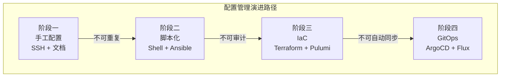
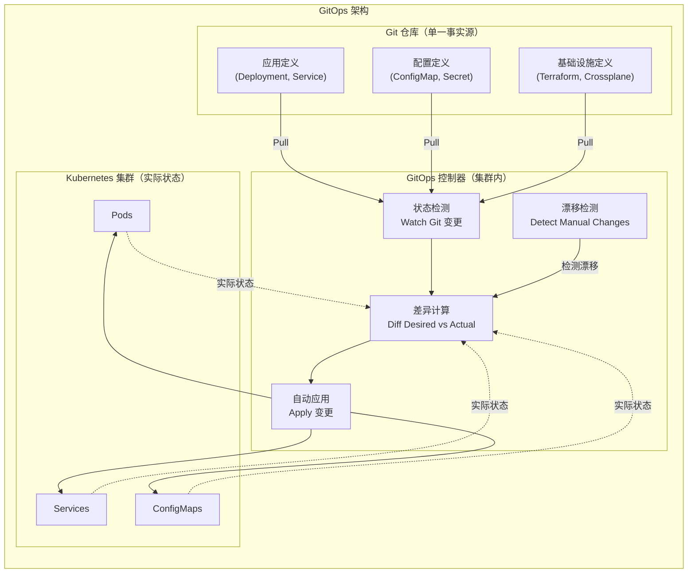
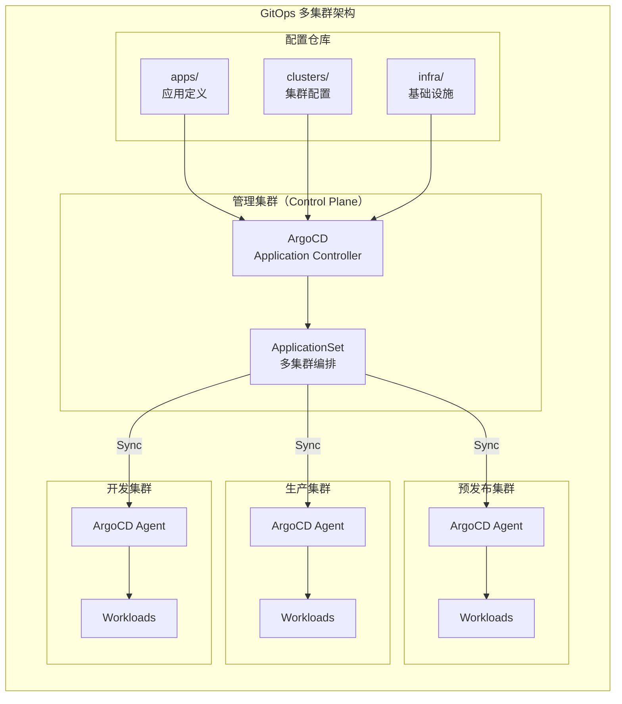

# 配置管理：GitOps与Infrastructure as Code

## 背景与问题定义

配置管理是持续交付体系中承上启下的关键环节。它向上承接代码分支策略的产出物（构建产物），向下驱动部署与发布流程的执行。配置管理的质量直接决定了环境的一致性、部署的可重复性和故障恢复的速度。

然而，配置管理在实践中的痛点长期存在：

**配置漂移（Configuration Drift）**。生产环境与预发布环境的配置差异，往往在故障发生时才被发现。运维人员的手工修改、紧急补丁的临时调整，都使得实际运行配置与文档记录产生偏差。这种偏差是"定时炸弹"——它不会在日常运行中暴露，但会在关键时刻（如扩容、故障切换）导致意外行为。

**雪花服务器（Snowflake Servers）**。每台服务器经过长期的手工调优，变得独一无二、不可复制。当需要扩容或替换时，没有人能准确复现这台服务器的完整配置。

**配置散落（Configuration Scatter）**。配置信息分散在代码仓库、配置中心、环境变量、数据库、运维文档等多个位置，缺乏统一的版本控制和审计追踪。

**变更风险不可控**。手工配置变更缺乏测试和回滚机制，一次错误的配置修改可能导致全局故障。2017 年 AWS S3 的大规模故障，根因就是一个配置命令的输入错误。

这些痛点的共同根源是：**配置管理缺乏"代码化"和"自动化"的约束**。Infrastructure as Code（IaC）和 GitOps 正是为了解决这些问题而诞生的两种互补范式——IaC 将基础设施定义为代码，GitOps 将代码化的配置与 Git 工作流结合，实现配置的版本控制、自动同步和持续协调。

## 核心概念

### 配置管理的演进路径

配置管理经历了四个阶段的演进，每个阶段都解决了前一阶段的核心痛点：



| 阶段 | 核心方法 | 优势 | 痛点 | 代表工具 |
|------|---------|------|------|---------|
| 手工配置 | SSH 登录服务器手动操作 | 灵活、即时生效 | 不可重复、不可审计、配置漂移 | SSH、Web 控制台 |
| 脚本化 | Shell 脚本批量执行 | 可重复、可部分自动化 | 缺乏状态管理、幂等性差 | Bash、Ansible、Chef |
| IaC | 声明式基础设施定义 | 可版本控制、可审计、幂等 | 推送模式、缺乏持续协调 | Terraform、Pulumi、CloudFormation |
| GitOps | Git 作为单一事实源 | 自动同步、持续协调、自愈 | 学习曲线、工具链复杂 | ArgoCD、Flux、Crossplane |

### Infrastructure as Code 核心原则

IaC 的核心思想是将基础设施的定义和管理用代码来表达，使其具备与软件代码相同的属性：

**声明式（Declarative）**。描述"想要什么"而非"怎么做"。声明式定义关注期望状态（Desired State），工具负责计算从当前状态到期望状态的变更计划。这与命令式（Imperative）脚本形成对比——命令式脚本描述操作步骤，难以保证幂等性。

**幂等性（Idempotency）**。多次执行同一配置产生相同结果。如果期望状态未变，再次执行不应产生任何变更。这确保了配置管理的安全性和可重复性。

**不可变基础设施（Immutable Infrastructure）**。不修改已部署的资源，而是替换。容器和不可变镜像（AMI）是这一原则的典型实现。不可变基础设施消除了配置漂移的可能性——因为不存在"修改"，只有"替换"。

**版本控制（Version Control）**。所有基础设施定义存储在 Git 仓库中，变更通过 Pull Request 审核，历史可追溯，回滚可通过 `git revert` 实现。

### GitOps 核心原则

GitOps 由 Weaveworks 在 2017 年提出，它在 IaC 的基础上增加了四个核心原则：

**原则一：声明式（Declarative）**。整个系统的期望状态用声明式语言描述，包括应用、配置、基础设施。这与 IaC 的声明式原则一致。

**原则二：版本控制且不可变（Version Controlled and Immutable）**。期望状态存储在 Git 仓库中，Git 的不可变历史确保了每次变更都有审计记录。Git 仓库是系统的"单一事实源"（Single Source of Truth）。

**原则三：自动拉取（Pulled Automatically）**。运行系统从 Git 仓库自动拉取期望状态并应用。这与传统的"推送"模式（CI 流水线执行 `kubectl apply` 或 `terraform apply`）形成对比。拉取模式的优势在于：控制器始终在集群内运行，不受 CI 系统故障影响；控制器可以持续检测漂移并自动修复。

**原则四：持续协调（Continuously Reconciled）**。软件代理持续对比期望状态（Git 仓库中的定义）与实际状态（集群中的运行状态），发现偏差时自动纠正。这实现了"自愈"能力——即使有人手动修改了集群配置，控制器也会将其恢复到 Git 定义的状态。



## 架构设计

### IaC 工具对比

当前主流的 IaC 工具可分为三类：

| 维度 | Terraform | Pulumi | Crossplane |
|------|-----------|--------|-----------|
| **语言** | HCL（HashiCorp Configuration Language） | 通用编程语言（TypeScript、Python、Go） | YAML + K8s CRD |
| **范式** | 声明式 | 声明式（命令式表达） | 声明式 |
| **状态管理** | 本地/远程 State 文件 | Pulumi Cloud / 自托管 | Kubernetes etcd |
| **云支持** | 所有主流云（Provider 生态） | 所有主流云（基于 Terraform Provider） | 所有主流云（Provider） |
| **K8s 集成** | Kubernetes Provider | Kubernetes Provider | 原生（K8s 控制器） |
| **GitOps 兼容** | 需要外部编排 | 需要外部编排 | 原生兼容 |
| **学习曲线** | 中（需学 HCL） | 低（用已有编程语言） | 中（需理解 K8s CRD） |
| **适用场景** | 通用基础设施管理 | 开发者友好的 IaC | K8s 原生基础设施管理 |
| **许可证** | BSL 1.1（v1.6+） | Apache 2.0 | Apache 2.0 |
| **社区规模** | 最大 | 快速增长 | 快速增长 |

### ArgoCD vs Flux 对比

ArgoCD 和 Flux 是当前最主流的两个 GitOps 控制器：

| 维度 | ArgoCD | Flux |
|------|--------|------|
| **项目归属** | CNCF 毕业项目 | CNCF 毕业项目 |
| **UI** | 丰富的 Web UI | 简洁的 Web UI（v2+） |
| **多集群管理** | ApplicationSet（原生） | Kustomization + GitRepository |
| **RBAC** | 细粒度 RBAC | 基于 K8s RBAC |
| **通知** | 内置通知系统 | Notification Controller |
| **Progressive Delivery** | Argo Rollouts（原生集成） | Flagger（需额外安装） |
| **多源应用** | 支持（Multiple Sources） | 支持（Multiple Sources） |
| **同步策略** | Manual / Auto Sync | Manual / Auto Sync |
| **漂移检测** | 默认开启，可配置修复间隔 | 默认开启，可配置修复间隔 |
| **回滚** | UI 一键回滚 | Git revert 触发同步 |
| **API** | REST API + gRPC | REST API |
| **适用场景** | 需要可视化管理和多集群编排 | 轻量级、偏好 Git-native 工作流 |
| **社区规模** | 更大 | 较大 |

### GitOps 多集群架构

对于需要管理多个集群的企业，GitOps 的架构设计需要考虑集群间的协调：



## 实现方案

### Terraform 模块化实践

Terraform 是当前最广泛使用的 IaC 工具。以下是一个生产级的 Terraform 模块结构示例：

```hcl
# infra/main.tf - Terraform 主入口
# 使用模块化组织基础设施定义

terraform {
  required_version = ">= 1.6"

  required_providers {
    aws = {
      source  = "hashicorp/aws"
      version = "~> 5.0"
    }
    kubernetes = {
      source  = "hashicorp/kubernetes"
      version = "~> 2.25"
    }
    helm = {
      source  = "hashicorp/helm"
      version = "~> 2.12"
    }
  }

  # 远程状态存储（S3 + DynamoDB 锁）
  backend "s3" {
    bucket         = "terraform-state-prod"
    key            = "infra/terraform.tfstate"
    region         = "us-east-1"
    encrypt        = true
    dynamodb_table = "terraform-locks"
    kms_key_id     = "arn:aws:kms:us-east-1:123456789012:key/xxx"
  }
}

# 区域和账户变量
variable "aws_region" {
  description = "AWS region"
  type        = string
  default     = "us-east-1"
}

variable "environment" {
  description = "Environment name"
  type        = string
  validation {
    condition     = contains(["dev", "staging", "production"], var.environment)
    error_message = "Environment must be dev, staging, or production."
  }
}

variable "cluster_name" {
  description = "EKS cluster name"
  type        = string
  default     = "main"
}

provider "aws" {
  region = var.aws_region

  default_tags {
    tags = {
      Environment = var.environment
      ManagedBy   = "terraform"
      Project     = "platform"
    }
  }
}

# VPC 模块
module "vpc" {
  source = "./modules/vpc"

  environment   = var.environment
  vpc_cidr      = "10.0.0.0/16"
  azs           = ["us-east-1a", "us-east-1b", "us-east-1c"]
  public_subnets  = ["10.0.1.0/24", "10.0.2.0/24", "10.0.3.0/24"]
  private_subnets = ["10.0.10.0/24", "10.0.20.0/24", "10.0.30.0/24"]

  # 生产环境启用 NAT Gateway 高可用
  enable_nat_gateway     = true
  single_nat_gateway     = var.environment != "production"
  one_nat_gateway_per_az = var.environment == "production"
}

# EKS 模块
module "eks" {
  source = "./modules/eks"

  environment  = var.environment
  cluster_name = "${var.environment}-${var.cluster_name}"
  vpc_id       = module.vpc.vpc_id
  subnet_ids   = module.vpc.private_subnet_ids

  cluster_version = "1.29"

  # 节点组配置
  node_groups = {
    general = {
      instance_types = ["m6i.large"]
      min_size       = var.environment == "production" ? 3 : 1
      max_size       = var.environment == "production" ? 20 : 5
      desired_size   = var.environment == "production" ? 5 : 2
      labels = {
        role = "general"
      }
    }
    compute = {
      instance_types = ["c6i.xlarge"]
      min_size       = 0
      max_size       = var.environment == "production" ? 50 : 10
      desired_size   = var.environment == "production" ? 3 : 0
      taints = {
        dedicated = {
          key    = "dedicated"
          value  = "compute"
          effect = "NO_SCHEDULE"
        }
      }
    }
  }

  # 安全配置
  cluster_encryption_config = {
    provider_key_arn = aws_kms_key.eks.arn
    resources        = ["secrets"]
  }

  # 日志配置
  cluster_enabled_log_types = ["api", "audit", "authenticator"]
}

# ArgoCD 安装（通过 Helm）
resource "helm_release" "argocd" {
  name             = "argocd"
  repository       = "https://argoproj.github.io/argo-helm"
  chart            = "argo-cd"
  namespace        = "argocd"
  create_namespace = true
  version          = "5.52.0"

  values = [
    templatefile("${path.module}/values/argocd.yaml.tpl", {
      environment    = var.environment
      domain         = "argocd.${var.environment}.example.com"
      repo_url       = "https://github.com/org/gitops-config.git"
    })
  ]

  depends_on = [module.eks]
}
```

```hcl
# infra/modules/vpc/main.tf - VPC 模块定义

variable "environment" {
  type = string
}

variable "vpc_cidr" {
  type = string
}

variable "azs" {
  type = list(string)
}

variable "public_subnets" {
  type = list(string)
}

variable "private_subnets" {
  type = list(string)
}

variable "enable_nat_gateway" {
  type    = bool
  default = false
}

variable "single_nat_gateway" {
  type    = bool
  default = true
}

variable "one_nat_gateway_per_az" {
  type    = bool
  default = false
}

resource "aws_vpc" "main" {
  cidr_block           = var.vpc_cidr
  enable_dns_hostnames = true
  enable_dns_support   = true

  tags = {
    Name        = "${var.environment}-vpc"
    Environment = var.environment
  }
}

resource "aws_subnet" "public" {
  count = length(var.public_subnets)

  vpc_id                  = aws_vpc.main.id
  cidr_block              = var.public_subnets[count.index]
  availability_zone       = var.azs[count.index]
  map_public_ip_on_launch = true

  tags = {
    Name = "${var.environment}-public-${var.azs[count.index]}"
    Tier = "public"
  }
}

resource "aws_subnet" "private" {
  count = length(var.private_subnets)

  vpc_id            = aws_vpc.main.id
  cidr_block        = var.private_subnets[count.index]
  availability_zone = var.azs[count.index]

  tags = {
    Name = "${var.environment}-private-${var.azs[count.index]}"
    Tier = "private"
  }
}

# 输出
output "vpc_id" {
  value = aws_vpc.main.id
}

output "private_subnet_ids" {
  value = aws_subnet.private[*].id
}

output "public_subnet_ids" {
  value = aws_subnet.public[*].id
}
```

### ArgoCD Application 配置

ArgoCD 的核心概念是 Application——它定义了一个 Kubernetes 资源的来源（Git 仓库中的路径）和目标（集群和命名空间）：

```yaml
# gitops-config/apps/payment-service.yaml
# ArgoCD Application 定义 - 支付服务

apiVersion: argoproj.io/v1alpha1
kind: Application
metadata:
  name: payment-service
  namespace: argocd
  # finalizer 确保删除 Application 时同时清理集群资源
  finalizers:
    - resources-finalizer.argocd.argoproj.io
  # 标签用于分组和搜索
  labels:
    team: payments
    tier: backend
    criticality: high
spec:
  # 项目（用于 RBAC 隔离）
  project: payments

  # 源配置：从哪个 Git 仓库的哪个路径读取清单
  source:
    repoURL: https://github.com/org/k8s-manifests.git
    targetRevision: main
    path: overlays/production/payment-service

    # Helm value 覆盖
    helm:
      valueFiles:
        - values.yaml
        - values-production.yaml
      parameters:
        - name: image.tag
          value: "v2.3.1"
        - name: replicas
          value: "3"

  # 目标配置：部署到哪个集群的哪个命名空间
  destination:
    server: https://kubernetes.default.svc
    namespace: payments

  # 同步策略
  syncPolicy:
    # 自动同步
    automated:
      prune: true    # 自动删除 Git 中不存在的资源
      selfHeal: true # 自动修复漂移
      allowEmpty: false

    # 同步选项
    syncOptions:
      - CreateNamespace=true
      - PrunePropagationPolicy=foreground
      - PruneLast=true
      - ServerSideApply=true

    # 重试策略
    retry:
      limit: 3
      backoff:
        duration: 5s
        factor: 2
        maxDuration: 3m

  # 忽略某些字段的漂移检测
  ignoreDifferences:
    - group: apps
      kind: Deployment
      jsonPointers:
        - /spec/replicas  # HPA 控制的副本数不应触发漂移告警
    - group: ""
      kind: Secret
      jsonPointers:
        - /data  # 外部 Secret Manager 注入的值
```

### ApplicationSet 多集群部署

ApplicationSet 是 ArgoCD 的多集群编排工具，它通过模板化生成多个 Application：

```yaml
# gitops-config/appsets/microservices.yaml
# ApplicationSet - 多环境多集群微服务部署

apiVersion: argoproj.io/v1alpha1
kind: ApplicationSet
metadata:
  name: microservices
  namespace: argocd
spec:
  # 生成器：从 Git 目录结构自动发现应用
  generators:
    # 矩阵生成器：组合集群和应用
    - matrix:
        generators:
          # 集群生成器：从 ArgoCD 注册的集群列表生成
          - clusters:
              selector:
                matchLabels:
                  managed: "true"
              values:
                # 根据集群名称确定环境
                environment: '{{index .metadata.labels "environment"}}'

          # Git 目录生成器：从仓库目录结构发现应用
          - git:
              repoURL: https://github.com/org/k8s-manifests.git
              revision: main
              directories:
                - path: "base/*"
                  exclude: true  # 排除 base 目录
                - path: "overlays/production/*"

  # 模板：生成 Application 的模板
  template:
    metadata:
      name: '{{path.basename}}-{{values.environment}}'
      labels:
        app: '{{path.basename}}'
        environment: '{{values.environment}}'
    spec:
      project: '{{values.environment}}'
      source:
        repoURL: https://github.com/org/k8s-manifests.git
        targetRevision: main
        path: 'overlays/{{values.environment}}/{{path.basename}}'
        helm:
          valueFiles:
            - values.yaml
            - 'values-{{values.environment}}.yaml'
      destination:
        server: '{{server}}'
        namespace: '{{path.basename}}'
      syncPolicy:
        automated:
          prune: true
          selfHeal: true
        syncOptions:
          - CreateNamespace=true
```

### Progressive Delivery：渐进式发布

GitOps 与 Progressive Delivery 结合，实现了从代码提交到全量发布的渐进式控制。Argo Rollouts 是 ArgoCD 生态中的渐进式发布工具：

```yaml
# gitops-config/apps/payment-rollout.yaml
# Argo Rollouts - 金丝雀发布策略

apiVersion: argoproj.io/v1alpha1
kind: Rollout
metadata:
  name: payment-service
  namespace: payments
spec:
  replicas: 10
  strategy:
    canary:
      # 金丝雀发布步骤
      steps:
        # 步骤 1：将 5% 流量导向新版本
        - setWeight: 5
        # 步骤 2：暂停，等待人工确认或自动分析
        - pause:
            duration: 5m
        # 步骤 3：将流量提升到 20%
        - setWeight: 20
        # 步骤 4：运行自动分析
        - analysis:
            templates:
              - templateName: success-rate
            args:
              - name: service-name
                value: payment-service-canary
        # 步骤 5：将流量提升到 50%
        - setWeight: 50
        # 步骤 6：暂停，等待人工确认
        - pause: {}
        # 步骤 7：全量发布
        - setWeight: 100

      # 金丝雀服务配置
      canaryService: payment-service-canary
      stableService: payment-service-stable

      # 流量管理（Istio）
      trafficRouting:
        istio:
          virtualServices:
            - name: payment-service
              routes:
                - primary

  # 工作负载模板
  selector:
    matchLabels:
      app: payment-service
  template:
    metadata:
      labels:
        app: payment-service
    spec:
      containers:
        - name: payment-service
          image: registry.example.com/payment-service:latest
          ports:
            - containerPort: 8080
          resources:
            requests:
              cpu: 100m
              memory: 128Mi
            limits:
              cpu: 500m
              memory: 512Mi
          readinessProbe:
            httpGet:
              path: /health
              port: 8080
            initialDelaySeconds: 5
            periodSeconds: 10
          livenessProbe:
            httpGet:
              path: /health
              port: 8080
            initialDelaySeconds: 15
            periodSeconds: 20

---
# 自动分析模板：基于 Prometheus 指标判断发布质量
apiVersion: argoproj.io/v1alpha1
kind: AnalysisTemplate
metadata:
  name: success-rate
  namespace: payments
spec:
  args:
    - name: service-name
  metrics:
    - name: success-rate
      interval: 30s
      count: 5
      successLimit: 3
      failureLimit: 2
      provider:
        prometheus:
          address: http://prometheus.monitoring:9090
          query: |
            sum(rate(http_requests_total{service="{{args.service-name}}",status!~"5.."}[1m]))
            /
            sum(rate(http_requests_total{service="{{args.service-name}}"}[1m]))
      # 成功条件：成功率 > 99%
      successCondition: result[0] >= 0.99
      # 失败条件：成功率 < 95%
      failureCondition: result[0] < 0.95
```

### Pulumi：开发者友好的 IaC

对于偏好通用编程语言的团队，Pulumi 提供了用 TypeScript、Python、Go 等语言定义基础设施的能力：

```typescript
// infra/index.ts - Pulumi 基础设施定义（TypeScript）

import * as aws from "@pulumi/aws";
import * as k8s from "@pulumi/kubernetes";
import * as pulumi from "@pulumi/pulumi";

// 注：clusterRole、kmsKey、clusterRolePolicyAttachment、k8sProvider 等
// 资源需在同一工程的其他文件中定义，此处从简省略。

// 配置
const config = new pulumi.Config();
const environment = config.require("environment");
const vpcCidr = config.get("vpcCidr") || "10.0.0.0/16";

// 标签策略：所有资源统一标签
const commonTags = {
  Environment: environment,
  ManagedBy: "pulumi",
  Project: "platform",
  Owner: "platform-team",
};

// VPC
const vpc = new aws.ec2.Vpc("main", {
  cidrBlock: vpcCidr,
  enableDnsHostnames: true,
  enableDnsSupport: true,
  tags: { ...commonTags, Name: `${environment}-vpc` },
});

// 子网
const publicSubnets = ["us-east-1a", "us-east-1b", "us-east-1c"].map(
  (az, i) =>
    new aws.ec2.Subnet(`public-${az}`, {
      vpcId: vpc.id,
      cidrBlock: `10.0.${i + 1}.0/24`,
      availabilityZone: az,
      mapPublicIpOnLaunch: true,
      tags: { ...commonTags, Name: `${environment}-public-${az}`, Tier: "public" },
    })
);

const privateSubnets = ["us-east-1a", "us-east-1b", "us-east-1c"].map(
  (az, i) =>
    new aws.ec2.Subnet(`private-${az}`, {
      vpcId: vpc.id,
      cidrBlock: `10.0.${i + 10}.0/24`,
      availabilityZone: az,
      tags: { ...commonTags, Name: `${environment}-private-${az}`, Tier: "private" },
    })
);

// EKS 集群
const cluster = new aws.eks.Cluster("main", {
  name: `${environment}-cluster`,
  roleArn: clusterRole.arn,
  version: "1.29",
  vpcConfig: {
    subnetIds: [...publicSubnets.map((s) => s.id), ...privateSubnets.map((s) => s.id)],
    endpointPrivateAccess: true,
    endpointPublicAccess: environment !== "production",
  },
  encryptionConfig: {
    provider: { keyArn: kmsKey.arn },
    resources: ["secrets"],
  },
  tags: commonTags,
}, { dependsOn: [clusterRolePolicyAttachment] });

// ArgoCD 安装
const argocdNamespace = new k8s.core.v1.Namespace("argocd", {
  metadata: { name: "argocd" },
}, { provider: k8sProvider });

const argocd = new k8s.helm.v3.Release("argocd", {
  name: "argocd",
  chart: "argo-cd",
  repositoryOpts: { repo: "https://argoproj.github.io/argo-helm" },
  version: "5.52.0",
  namespace: "argocd",
  values: {
    server: {
      ingress: {
        enabled: true,
        hosts: [`argocd.${environment}.example.com`],
      },
    },
    configs: {
      repositories: {
        "gitops-config": {
          url: "https://github.com/org/gitops-config.git",
          type: "git",
        },
      },
    },
  },
}, { provider: k8sProvider, dependsOn: [argocdNamespace] });

// 导出
export const vpcId = vpc.id;
export const clusterName = cluster.name;
export const argocdEndpoint = pulumi.interpolate`https://argocd.${environment}.example.com`;
```

### Crossplane：Kubernetes 原生的 IaC

Crossplane 将云资源定义为 Kubernetes CRD（Custom Resource Definition），使基础设施管理与 GitOps 天然兼容：

```yaml
# infra/crossplane/provider-config.yaml
# Crossplane AWS Provider 配置

apiVersion: aws.upbound.io/v1beta1
kind: ProviderConfig
metadata:
  name: aws-provider
spec:
  credentials:
    source: Secret
    secretRef:
      namespace: crossplane-system
      name: aws-credentials
      key: credentials
  region: us-east-1

---
# infra/crossplane/s3-bucket.yaml
# 使用 Crossplane 定义 S3 Bucket（K8s 原生方式）

apiVersion: s3.aws.upbound.io/v1beta1
kind: Bucket
metadata:
  name: platform-artifacts
  annotations:
    crossplane.io/external-name: platform-artifacts-prod
spec:
  forProvider:
    region: us-east-1
    versioning:
      - enabled: true
    serverSideEncryptionConfiguration:
      - rule:
          - applyServerSideEncryptionByDefault:
              - sseAlgorithm: aws:kms
                kmsMasterKeyId: arn:aws:kms:us-east-1:123456789012:key/xxx
    lifecycleRule:
      - id: cleanup-old-versions
        enabled: true
        noncurrentVersionExpiration:
          - days: 30
    tags:
      Environment: production
      ManagedBy: crossplane
  providerConfigRef:
    name: aws-provider
  # 删除策略：保留资源（防止误删）
  deletionPolicy: Orphan
```

## 最佳实践

### GitOps 仓库结构设计

GitOps 仓库的结构直接影响团队协作效率。以下是推荐的多团队仓库结构：

```
gitops-config/
├── README.md
├── argocd/
│   ├── apps/                    # ArgoCD Application 定义
│   │   ├── payment-service.yaml
│   │   ├── user-service.yaml
│   │   └── frontend.yaml
│   ├── appsets/                 # ApplicationSet 定义
│   │   └── microservices.yaml
│   └── projects/                # ArgoCD Project 定义
│       ├── payments.yaml
│       └── frontend.yaml
├── base/                        # Kustomize Base（共享配置）
│   ├── payment-service/
│   │   ├── kustomization.yaml
│   │   ├── deployment.yaml
│   │   └── service.yaml
│   └── user-service/
│       ├── kustomization.yaml
│       ├── deployment.yaml
│       └── service.yaml
├── overlays/                    # Kustomize Overlays（环境差异）
│   ├── development/
│   │   ├── kustomization.yaml
│   │   └── patches/
│   ├── staging/
│   │   ├── kustomization.yaml
│   │   └── patches/
│   └── production/
│       ├── kustomization.yaml
│       └── patches/
├── infra/                       # 基础设施定义
│   ├── terraform/
│   │   ├── main.tf
│   │   ├── modules/
│   │   └── environments/
│   └── crossplane/
│       ├── provider-config.yaml
│       └── resources/
└── scripts/                     # 辅助脚本
    ├── validate-manifests.sh
    └── diff-apply.sh
```

### Secret 管理策略

Secret 管理是 GitOps 实践中最敏感的环节。将 Secret 明文存储在 Git 仓库中是严重的安全风险，但 GitOps 的"一切皆代码"原则又要求配置的完整性。以下是几种解决方案的对比：

| 方案 | 原理 | 优势 | 劣势 | 适用场景 |
|------|------|------|------|---------|
| Sealed Secrets | 加密后存储在 Git，集群内解密 | Git 兼容、简单 | 密钥轮换复杂 | 中小规模 |
| External Secrets Operator | 从外部 Secret Manager 同步 | 与 AWS/Azure/GCP 集成 | 依赖外部服务 | 云原生环境 |
| SOPS（Mozilla） | 加密文件存储在 Git | 支持多种密钥服务 | 工作流较复杂 | 通用 |
| Vault + CSI Provider | Vault 注入到 Pod | 动态 Secret、审计 | 架构复杂 | 高安全要求 |

```yaml
# External Secrets Operator 示例
# 从 AWS Secrets Manager 同步 Secret 到 Kubernetes

apiVersion: external-secrets.io/v1beta1
kind: SecretStore
metadata:
  name: aws-secrets-manager
  namespace: payments
spec:
  provider:
    aws:
      service: SecretsManager
      region: us-east-1
      auth:
        jwt:
          serviceAccountRef:
            name: external-secrets-sa

---
apiVersion: external-secrets.io/v1beta1
kind: ExternalSecret
metadata:
  name: payment-db-credentials
  namespace: payments
spec:
  refreshInterval: 1h
  secretStoreRef:
    name: aws-secrets-manager
    kind: SecretStore
  target:
    name: payment-db-credentials
    creationPolicy: Owner
  data:
    - secretKey: username
      remoteRef:
        key: payments/database
        property: username
    - secretKey: password
      remoteRef:
        key: payments/database
        property: password
```

### 漂移检测与自愈

GitOps 的核心价值之一是漂移自愈。以下是漂移检测的配置和监控实践：

```yaml
# ArgoCD 漂移检测配置
# argocd-cm ConfigMap

apiVersion: v1
kind: ConfigMap
metadata:
  name: argocd-cm
  namespace: argocd
data:
  # 漂移检测间隔（默认 180 秒）
  timeout.reconciliation: "300s"

  # 资源级别的忽略差异配置
  resource.customizations.ignoreDifferences.apps_Deployment: |
    jsonPointers:
      - /spec/replicas
      - /spec/template/metadata/annotations/kubectl.kubernetes.io~1restartedAt

  # 全局忽略差异
  resource.ignoreDifferences: |
    all:
      jsonPointers:
        - /metadata/annotations/kubectl.kubernetes.io~1last-applied-configuration
```

### GitOps 实施的渐进路径

| 阶段 | 目标 | 关键行动 | 预期时间 |
|------|------|---------|---------|
| 阶段一：IaC 基础 | 所有基础设施用 Terraform 管理 | 迁移手工配置到 Terraform 模块 | 1-3 个月 |
| 阶段二：GitOps 试点 | 单集群 ArgoCD/Flux 部署 | 选择非关键应用试点 | 1-2 个月 |
| 阶段三：全面推广 | 所有应用通过 GitOps 部署 | 建立模板和最佳实践 | 2-4 个月 |
| 阶段四：多集群编排 | ApplicationSet 多集群管理 | 统一多环境配置 | 2-3 个月 |
| 阶段五：Progressive Delivery | 金丝雀发布 + 自动分析 | Argo Rollouts 集成 | 1-2 个月 |

## 效果度量

### GitOps 效果度量指标

| 指标 | 定义 | 目标值 | 度量方法 |
|------|------|-------|---------|
| GitOps 覆盖率 | 通过 GitOps 部署的应用比例 | > 95% | ArgoCD Application 统计 |
| 配置漂移率 | 检测到漂移的频率 | < 1 次/周/应用 | ArgoCD 漂移事件统计 |
| 自愈成功率 | 漂移自动修复的比例 | > 99% | ArgoCD Sync 事件统计 |
| 变更前置时间 | 从 Git commit 到集群生效的时间 | < 5 分钟 | ArgoCD Sync 时间统计 |
| 配置回滚时间 | 从发现配置错误到回滚完成的时间 | < 2 分钟 | 事件响应统计 |
| IaC 覆盖率 | 用 IaC 管理的基础设施比例 | > 90% | Terraform State 分析 |
| Secret 合规率 | Secret 不以明文存储在 Git 的比例 | 100% | Git 仓库扫描 |

### 度量数据采集

```bash
#!/bin/bash
# measure-gitops-metrics.sh
# 采集 GitOps 效果度量指标

ARGOCD_SERVER="${1:-argocd.example.com}"
ARGOCD_TOKEN="${ARGOCD_TOKEN:?请设置 ARGOCD_TOKEN 环境变量}"

echo "=== GitOps 效果度量报告 ==="
echo ""

# 1. GitOps 覆盖率
echo "--- 1. GitOps 覆盖率 ---"
APPS=$(curl -s -H "Authorization: Bearer $ARGOCD_TOKEN" \
  "https://${ARGOCD_SERVER}/api/v1/applications" | \
  jq '.items | length')
HEALTHY=$(curl -s -H "Authorization: Bearer $ARGOCD_TOKEN" \
  "https://${ARGOCD_SERVER}/api/v1/applications" | \
  jq '[.items[] | select(.status.health.status == "Healthy")] | length')
SYNCED=$(curl -s -H "Authorization: Bearer $ARGOCD_TOKEN" \
  "https://${ARGOCD_SERVER}/api/v1/applications" | \
  jq '[.items[] | select(.status.sync.status == "Synced")] | length')

echo "  总应用数: $APPS"
echo "  健康应用数: $HEALTHY"
echo "  同步应用数: $SYNCED"
if [ "$APPS" -gt 0 ]; then
  HEALTH_RATE=$(echo "scale=2; $HEALTHY * 100 / $APPS" | bc)
  SYNC_RATE=$(echo "scale=2; $SYNCED * 100 / $APPS" | bc)
  echo "  健康率: ${HEALTH_RATE}%"
  echo "  同步率: ${SYNC_RATE}%"
fi

# 2. 漂移检测统计
echo ""
echo "--- 2. 漂移检测统计 ---"
OUT_OF_SYNC=$(curl -s -H "Authorization: Bearer $ARGOCD_TOKEN" \
  "https://${ARGOCD_SERVER}/api/v1/applications" | \
  jq '[.items[] | select(.status.sync.status == "OutOfSync")] | length')
echo "  漂移应用数: $OUT_OF_SYNC"

# 列出漂移的应用详情
if [ "$OUT_OF_SYNC" -gt 0 ]; then
  echo "  漂移应用列表:"
  curl -s -H "Authorization: Bearer $ARGOCD_TOKEN" \
    "https://${ARGOCD_SERVER}/api/v1/applications" | \
    jq -r '.items[] | select(.status.sync.status == "OutOfSync") |
      "    - \(.metadata.name) (\(.status.sync.status)): \(.status.sync.comparedTo.source.targetRevision)"'
fi

# 3. 变更前置时间
echo ""
echo "--- 3. 最近同步操作 ---"
curl -s -H "Authorization: Bearer $ARGOCD_TOKEN" \
  "https://${ARGOCD_SERVER}/api/v1/applications?fields=items.metadata.name,items.status.operationState" | \
  jq -r '.items[] | select(.status.operationState != null) |
    "\(.metadata.name): started=\(.status.operationState.startedAt) finished=\(.status.operationState.finishedAt // "running") phase=\(.status.operationState.phase)"' | \
  head -10

# 4. Terraform 状态分析
echo ""
echo "--- 4. IaC 覆盖率 ---"
if command -v terraform &> /dev/null; then
  RESOURCE_COUNT=$(terraform state list 2>/dev/null | wc -l || echo "N/A")
  echo "  Terraform 管理的资源数: $RESOURCE_COUNT"
else
  echo "  Terraform 未安装，跳过 IaC 覆盖率统计"
fi

echo ""
echo "=== 报告结束 ==="
```

## 总结

配置管理从手工操作到 GitOps 的演进，本质上是将"配置"从运维行为转变为工程实践的过程。GitOps 通过将 Git 作为单一事实源、自动拉取和持续协调，实现了配置管理的自动化、可审计和自愈能力。

本文的关键要点：

1. **配置管理的演进遵循清晰的路径**：手工配置 → 脚本化 → IaC → GitOps。每个阶段解决前一阶段的核心痛点，但引入新的复杂度。团队应根据自身成熟度选择合适的阶段。

2. **IaC 是 GitOps 的基础**。Terraform、Pulumi、Crossplane 三种工具各有优势：Terraform 生态最成熟，Pulumi 对开发者最友好，Crossplane 与 Kubernetes 和 GitOps 天然兼容。

3. **GitOps 的四个核心原则**（声明式、版本控制、自动拉取、持续协调）构成了配置管理的"免疫系统"。漂移检测和自愈能力是 GitOps 区别于传统 IaC 的关键价值。

4. **ArgoCD 和 Flux 是当前最主流的 GitOps 控制器**。ArgoCD 适合需要可视化管理和多集群编排的场景，Flux 适合偏好轻量级和 Git-native 工作流的团队。

5. **Progressive Delivery 是 GitOps 的自然延伸**。通过 Argo Rollouts 等工具，将部署从"全量切换"升级为"渐进式验证"，结合 Prometheus 指标自动判断发布质量。

6. **Secret 管理需要特殊处理**。External Secrets Operator 和 Sealed Secrets 是两种主流方案，前者与云厂商 Secret Manager 集成，后者在 Git 仓库中存储加密后的 Secret。

7. **效果度量是持续改进的基础**。GitOps 覆盖率、漂移率、自愈成功率、变更前置时间等指标，帮助团队量化 GitOps 的实施效果。

GitOps 不是终点，而是持续交付体系中配置管理的当前最优解。随着平台工程（Platform Engineering）的兴起，GitOps 正在从"开发者直接操作 Git 仓库"演变为"开发者通过平台抽象间接使用 GitOps"——这将是配置管理的下一个演进方向。
