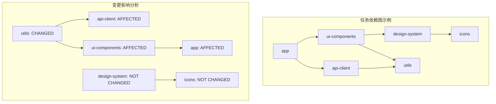
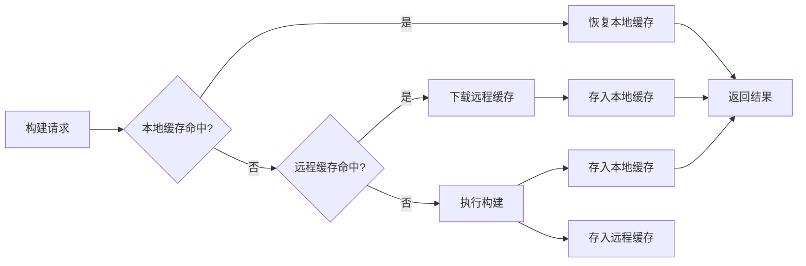
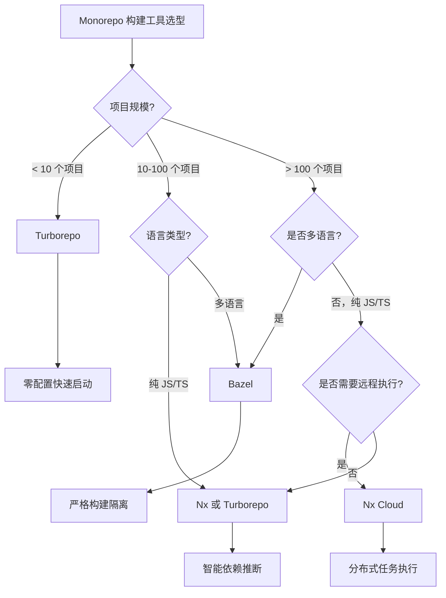

# 构建缓存与加速：Bazel、Nx、Turborepo

## 背景与问题定义

构建性能是持续交付体系的基础瓶颈。当一个项目的构建时间从分钟级膨胀到小时级，整个交付流水线的反馈周期将被严重拉长，开发者的工作流被打断，持续集成的"快速反馈"价值荡然无存。

构建性能退化通常遵循一个可预测的轨迹：项目初期构建只需几十秒，随着代码量增长和依赖关系复杂化，构建时间逐步攀升。当项目进入 Monorepo 模式后，问题进一步恶化——一个包含数十个服务的代码仓库中，即使只修改了一个模块的代码，全量构建也可能需要重新编译整个依赖树。

这个问题的本质在于：传统构建工具缺乏对任务依赖关系的精确追踪，无法实现真正的增量构建。每次构建都是"全量重建"，大量计算资源被浪费在重复编译未变更的代码上。

构建缓存与加速技术正是为解决这一问题而生。其核心思想是：**只重新构建发生变化的部分，其余部分从缓存中恢复**。这一思想看似简单，但要正确实现，需要解决三个关键技术挑战：

1. **依赖图精确性**：必须精确追踪每个构建任务的输入和输出，任何输入变化都应触发重新构建，任何输入不变都应命中缓存。
2. **缓存一致性**：缓存的内容必须与实际构建结果完全一致，否则会导致构建结果不可复现。
3. **分布式缓存效率**：在团队协作场景下，一个人的构建结果应能被其他人复用，避免重复计算。

本文将系统阐述构建缓存的核心策略，并深入对比三大 Monorepo 构建工具——Bazel、Nx、Turborepo 的设计理念和实现方案。

## 核心概念

### 增量构建与任务依赖图

增量构建（Incremental Build）的核心是任务依赖图（Task Dependency Graph）。每个构建任务（如编译一个模块、运行一组测试）都有明确的输入（源文件、配置、依赖产物）和输出（编译结果、测试报告）。当某个任务的输入未发生变化时，其输出可以直接从缓存中恢复，而无需重新执行。



当 `utils` 模块发生变更时，依赖它的 `api-client` 和 `ui-components` 需要重新构建，进而 `app` 也需要重新构建。而 `design-system` 和 `icons` 不受影响，可以直接从缓存恢复。

### 构建缓存策略

| 缓存策略 | 存储位置 | 命中条件 | 适用场景 | 一致性保证 |
|---------|---------|---------|---------|-----------|
| 本地缓存 | 本地磁盘 | 输入哈希匹配 | 单机开发 | 强一致 |
| 远程缓存 | 共享存储（S3/GCS） | 输入哈希匹配 | 团队协作 | 最终一致 |
| 分布式缓存 | 多节点复制 | 输入哈希匹配 | 大规模团队 | 最终一致 |
| 内容寻址缓存 | CAS（Content Addressable Store） | 内容哈希匹配 | Bazel 场景 | 强一致 |

缓存命中的核心机制是**输入哈希**（Input Hash）：将任务的所有输入（源文件内容、编译器版本、环境变量等）计算出一个哈希值，作为缓存键。如果缓存中存在相同哈希值的产物，则直接恢复，否则执行构建并存储结果。

### 缓存键的构成

一个完整的缓存键需要包含以下要素：

```
Cache Key = Hash(
    源文件内容,
    传递依赖的输出哈希,
    构建工具版本,
    构建配置（compiler flags, env vars）,
    平台信息（OS, arch）
)
```

任何要素的变化都会导致缓存未命中，这是正确性的保证。但过于保守的缓存键设计（如包含不必要的平台信息）会降低命中率，需要在正确性和效率之间取得平衡。

## 架构设计

### Monorepo 构建工具架构对比

```mermaid
graph TB
    subgraph "Bazel 架构"
        B1[WORKSPACE] --> B2[BUILD files]
        B2 --> B3[Action Graph]
        B3 --> B4[Local Execution]
        B3 --> B5[Remote Execution]
        B4 --> B6[Local Cache]
        B5 --> B7[Remote Cache / CAS]
    end

    subgraph "Nx 架构"
        N1[nx.json + project.json] --> N2[Task Graph]
        N2 --> N3[Computation Hash]
        N3 --> N4[Local Cache]
        N3 --> N5[Nx Cloud]
        N5 --> N6[Distributed Cache]
    end

    subgraph "Turborepo 架构"
        T1[turbo.json] --> T2[Task Definition]
        T2 --> T3[Input Hashing]
        T3 --> T4[Local Cache (.turbo)]
        T3 --> T5[Remote Cache]
    end

```

### 三大工具核心对比

| 维度 | Bazel | Nx | Turborepo |
|------|-------|----|-----------|
| 开发者 | Google | Nx（原 Nrwl） | Vercel |
| 语言 | Starlark (Python DSL) | JSON + JS | JSON |
| 生态定位 | 通用构建系统 | JS/TS Monorepo | JS/TS Monorepo |
| 学习曲线 | 极高 | 中等 | 低 |
| 远程执行 | 支持（RBE） | 支持（Nx Cloud） | 不支持 |
| 远程缓存 | 支持 | 支持 | 支持 |
| 增量构建 | 精确到文件级 | 精确到项目级 | 精确到项目级 |
| 依赖追踪 | 显式声明 | 自动推断 + 手动标注 | 自动推断 + 手动标注 |
| 构建隔离 | 沙箱化（严格） | 无沙箱 | 无沙箱 |
| 多语言支持 | 原生支持 | JS/TS 为主 | JS/TS 为主 |
| 适用规模 | 超大规模（10万+目标） | 中大规模（100+项目） | 中等规模（50+项目） |
| 开源协议 | Apache 2.0 | MIT | MIT |
| 商业产品 | Bazel Remote Cache | Nx Cloud | Turborepo Remote Cache |

### 构建缓存层级架构



## 实现方案

### Bazel：Google 的构建基础设施

Bazel 是 Google 内部构建系统 Blaze 的开源版本，为超大规模代码仓库设计。其核心设计理念是**正确性优先**：通过严格的沙箱隔离和显式依赖声明，确保构建结果的完全可复现性。

> **注**：Bazel 自 7.0 起推荐使用 `MODULE.bazel` 管理外部依赖（`WORKSPACE` 已标记废弃，Bazel 9 中移除）；rules_nodejs 也已停止维护，新项目建议使用 Aspect Build 维护的 rules_js。以下示例保留传统写法，字段结构在新版本中需对应迁移。

**WORKSPACE 配置**

```python
# WORKSPACE - 定义外部依赖和工具链
workspace(name = "my_monorepo")

# 加载 rules_nodejs 用于 Node.js 项目（已停止维护，建议迁移到 rules_js）
load("@bazel_tools//tools/build_defs/repo:http.bzl", "http_archive")

http_archive(
    name = "build_bazel_rules_nodejs",
    sha256 = "6b3245ce8d3b4e1e44b3bac5e81b3e4a9d52e72c4f4c3e4a1b1c2d3e4f5a6b7c",  # 示例占位：请填写官方发布的校验值
    urls = ["https://github.com/bazelbuild/rules_nodejs/releases/download/6.0.0/rules_nodejs-6.0.0.tar.gz"],
)

load("@build_bazel_rules_nodejs//:index.bzl", "npm_install")

npm_install(
    name = "npm",
    package_json = "//:package.json",
    package_lock_json = "//:package-lock.json",
)

# 远程缓存服务（bazel-remote）是独立部署的服务器，无需作为 Bazel 依赖引入，
# 部署方式见下文"远程缓存配置"
```

**BUILD 文件**

```python
# libs/utils/BUILD - 工具库构建定义
load("@npm//:defs.bzl", "npm_link_all_packages")
load("@build_bazel_rules_nodejs//:index.bzl", "ts_project", "npm_package")

# TypeScript 编译目标
ts_project(
    name = "utils",
    srcs = glob(["src/**/*.ts"]),
    tsconfig = "tsconfig.json",
    deps = [
        "//libs/types:types",
    ],
    visibility = ["//visibility:public"],
)

# 测试目标
ts_project(
    name = "utils_test",
    testonly = True,
    srcs = glob(["test/**/*.spec.ts"]),
    tsconfig = "tsconfig.json",
    deps = [
        ":utils",
        "@npm//jest",
        "@npm//@types/jest",
    ],
)

# npm 包发布目标
npm_package(
    name = "utils_pkg",
    srcs = [":utils"],
    package_name = "@myorg/utils",
    visibility = ["//visibility:public"],
)
```

```python
# apps/web-app/BUILD - Web 应用构建定义
load("@build_bazel_rules_nodejs//:index.bzl", "ts_project")

ts_project(
    name = "web-app",
    srcs = glob(["src/**/*.ts", "src/**/*.tsx"]),
    tsconfig = "tsconfig.json",
    deps = [
        "//libs/utils:utils",
        "//libs/ui-components:ui-components",
        "@npm//react",
        "@npm//react-dom",
    ],
)
```

**远程缓存配置**

```bash
# 启动 Bazel Remote Cache 服务
docker run -d \
  --name bazel-remote-cache \
  -p 9092:9092 \
  -v /data/bazel-cache:/data \
  buchgr/bazel-remote:v2.4.0 \
  --dir /data \
  --max_size 50 \
  --port 9092

# .bazelrc - Bazel 配置文件
# 远程缓存配置
build --remote_cache=grpc://cache.example.com:9092
build --remote_upload_local_results=true

# 构建优化
build --jobs=auto
build --experimental_repository_cache_hardlinks
build --disk_cache=/home/user/.bazel/cache

# 沙箱配置（确保构建隔离）
build --spawn_strategy=standalone
build --strategy=TypeScriptCompile=standalone

# 平台配置
build --host_platform=@build_bazel_rules_nodejs//platforms:node18_linux_amd64
```

### Nx：智能 Monorepo 构建工具

Nx 的设计哲学是在保持开发者体验的同时提供 Monorepo 级别的构建加速。与 Bazel 的显式声明不同，Nx 通过代码静态分析自动推断项目依赖关系，同时支持手动标注以提高精确度。

> **注**：Nx 20+ 已将下例中的 `tasksRunnerOptions`/`nx-cloud` runner 等旧式配置迁移为 `nx.json` 顶层的 `nxCloudAccessToken` 等字段，分布式执行也改由 Nx Agents 承担；下例为传统写法，供理解配置模型参考。

**workspace 配置**

```json
// nx.json - Nx 工作区配置
{
  "$schema": "./node_modules/nx/schemas/nx-schema.json",
  "affected": {
    "defaultBase": "main"
  },
  "tasksRunnerOptions": {
    "default": {
      "runner": "nx/tasks-runners/default",
      "options": {
        "cacheableOperations": ["build", "test", "lint", "e2e"],
        "parallel": 3
      }
    },
    "cloud": {
      "runner": "nx-cloud",
      "options": {
        "accessToken": "NX_CLOUD_ACCESS_TOKEN",
        "cacheableOperations": ["build", "test", "lint", "e2e"],
        "parallel": 4,
        "distribution": {
          "strategy": "dynamic",
          "targets": ["build", "test"]
        }
      }
    }
  },
  "targetDefaults": {
    "build": {
      "dependsOn": ["^build"],
      "inputs": ["production", "^production"]
    },
    "test": {
      "dependsOn": ["build"],
      "inputs": ["default", "^production"]
    },
    "lint": {
      "inputs": ["default", "{workspaceRoot}/.eslintrc.json"]
    }
  },
  "namedInputs": {
    "default": ["{projectRoot}/**/*", "sharedGlobals"],
    "production": [
      "default",
      "!{projectRoot}/**/*.spec.ts",
      "!{projectRoot}/**/*.test.ts",
      "!{projectRoot}/tsconfig.spec.json"
    ],
    "sharedGlobals": [
      "{workspaceRoot}/tsconfig.base.json",
      "{workspaceRoot}/nx.json",
      "{workspaceRoot}/package-lock.json"
    ]
  }
}
```

**项目配置**

```json
// apps/web-app/project.json
{
  "name": "web-app",
  "$schema": "../../node_modules/nx/schemas/project-schema.json",
  "sourceRoot": "apps/web-app/src",
  "projectType": "application",
  "targets": {
    "build": {
      "executor": "@nx/webpack:webpack",
      "outputs": ["{options.outputPath}"],
      "options": {
        "outputPath": "dist/apps/web-app",
        "index": "apps/web-app/src/index.html",
        "baseHref": "/",
        "main": "apps/web-app/src/main.tsx",
        "tsConfig": "apps/web-app/tsconfig.app.json",
        "assets": ["apps/web-app/src/favicon.ico", "apps/web-app/src/assets"],
        "styles": ["apps/web-app/src/styles.css"]
      },
      "configurations": {
        "production": {
          "optimization": true,
          "outputHashing": "all",
          "sourceMap": false,
          "namedChunks": false,
          "extractLicenses": true,
          "vendorChunk": false
        }
      }
    },
    "test": {
      "executor": "@nx/jest:jest",
      "outputs": ["{workspaceRoot}/coverage/apps/web-app"],
      "options": {
        "jestConfig": "apps/web-app/jest.config.ts",
        "passWithNoTests": true
      }
    },
    "lint": {
      "executor": "@nx/linter:eslint",
      "outputs": ["{options.outputFile}"],
      "options": {
        "lintFilePatterns": ["apps/web-app/**/*.{ts,tsx,js,jsx}"]
      }
    }
  },
  "tags": ["type:app", "scope:web"]
}
```

**增量构建与受影响项目检测**

```bash
#!/bin/bash
# ci-pipeline.sh - Nx 增量构建流水线

# 1. 检测受影响的项目（基于 PR 的变更范围）
npx nx show projects --affected --base=origin/main --head=HEAD

# 2. 只构建和测试受影响的项目
npx nx affected -t build --base=origin/main --head=HEAD --configuration=production
npx nx affected -t test --base=origin/main --head=HEAD
npx nx affected -t lint --base=origin/main --head=HEAD

# 3. 查看任务依赖图（可视化调试）
npx nx graph --affected --base=origin/main --head=HEAD

# 4. 分布式任务执行（Nx Agents）：启动 CI run，将任务分发到多台机器
npx nx-cloud start-ci-run --distribute-on="3"
npx nx affected -t build --configuration=production
npx nx-cloud stop-all-agents
```

**Nx Cloud 分布式执行**

```yaml
# .github/workflows/nx-cloud-ci.yml
name: Nx Cloud CI

on:
  push:
    branches: [main]
  pull_request:

env:
  NX_CLOUD_ACCESS_TOKEN: ${{ secrets.NX_CLOUD_ACCESS_TOKEN }}

jobs:
  main:
    name: Nx Cloud - Main Job
    runs-on: ubuntu-latest
    steps:
      - uses: actions/checkout@v4
        with:
          fetch-depth: 0

      - uses: actions/setup-node@v4
        with:
          node-version: '20'
          cache: 'npm'

      - run: npm ci

      - name: Derive SHAs for Nx Cloud
        uses: nrwl/nx-set-shas@v4

      - name: Start CI run with Nx Agents
        run: npx nx-cloud start-ci-run --distribute-on="3"

      - name: Run affected tasks with distribution
        run: npx nx affected -t lint,test,build --parallel=3

      - name: Stop all agents
        if: always()
        run: npx nx-cloud stop-all-agents
```

### Turborepo：零配置的构建加速器

Turborepo 的设计哲学是"零配置即可获得显著加速"。它通过任务定义（Turborepo 1.x 中称为 Pipeline，2.0 起更名为 Tasks）描述任务间的依赖关系，自动处理缓存和并行执行。

**任务配置**

```json
// turbo.json - Turborepo 任务配置（2.x 语法；1.x 中顶层键为 "pipeline"）
{
  "$schema": "https://turbo.build/schema.json",
  "globalDependencies": ["package-lock.json", "tsconfig.base.json"],
  "globalEnv": ["NODE_ENV"],
  "tasks": {
    "build": {
      "dependsOn": ["^build"],
      "outputs": ["dist/**", ".next/**", "!.next/cache/**"],
      "outputMode": "new-only"
    },
    "test": {
      "dependsOn": ["build"],
      "outputs": ["coverage/**"],
      "inputs": ["src/**/*.tsx", "src/**/*.ts", "test/**/*.ts", "jest.config.*"]
    },
    "lint": {
      "outputs": [],
      "inputs": ["src/**/*.tsx", "src/**/*.ts", ".eslintrc.*"]
    },
    "dev": {
      "cache": false,
      "persistent": true
    },
    "clean": {
      "cache": false
    }
  }
}
```

**远程缓存配置**

```bash
# Turborepo 远程缓存 - 自托管
# 使用社区主流的 ducktors 实现，以 S3 作为后端存储

# 1. 启动自托管远程缓存服务器
docker run -d \
  --name turbo-remote-cache \
  -p 3000:3000 \
  -e STORAGE_PROVIDER=s3 \
  -e STORAGE_PATH=turborepo-cache \
  -e AWS_REGION=us-east-1 \
  -e AWS_ACCESS_KEY_ID=${AWS_ACCESS_KEY_ID} \
  -e AWS_SECRET_ACCESS_KEY=${AWS_SECRET_ACCESS_KEY} \
  -e TURBO_TOKEN=${TURBO_TOKEN} \
  ducktors/turborepo-remote-cache:latest

# 2. 配置客户端连接远程缓存
# 在 CI 环境中设置环境变量
export TURBO_API="https://cache.example.com"
export TURBO_TOKEN="${TURBO_CACHE_TOKEN}"
export TURBO_TEAM="my-team"

# 3. 执行构建（自动使用远程缓存）
npx turbo build --filter=web-app
```

**Monorepo 项目结构示例**

```
my-monorepo/
├── turbo.json
├── package.json
├── package-lock.json
├── apps/
│   ├── web-app/
│   │   ├── package.json
│   │   ├── tsconfig.json
│   │   └── src/
│   └── admin-app/
│       ├── package.json
│       ├── tsconfig.json
│       └── src/
├── packages/
│   ├── ui-components/
│   │   ├── package.json
│   │   ├── tsconfig.json
│   │   └── src/
│   ├── utils/
│   │   ├── package.json
│   │   ├── tsconfig.json
│   │   └── src/
│   └── api-client/
│       ├── package.json
│       ├── tsconfig.json
│       └── src/
└── tools/
    └── scripts/
```

**CI 流水线集成**

```yaml
# .github/workflows/turbo-ci.yml
name: Turborepo CI

on:
  push:
    branches: [main]
  pull_request:

concurrency:
  group: ${{ github.workflow }}-${{ github.ref }}
  cancel-in-progress: true

env:
  TURBO_API: ${{ vars.TURBO_API }}
  TURBO_TOKEN: ${{ secrets.TURBO_TOKEN }}
  TURBO_TEAM: ${{ vars.TURBO_TEAM }}

jobs:
  build:
    name: Build & Test
    runs-on: ubuntu-latest
    steps:
      - uses: actions/checkout@v4
        with:
          fetch-depth: 2  # Turborepo 需要至少 2 个 commit 来计算 diff

      - uses: actions/setup-node@v4
        with:
          node-version: '20'
          cache: 'npm'

      - run: npm ci

      - name: Lint
        run: npx turbo lint

      - name: Build
        run: npx turbo build

      - name: Test
        run: npx turbo test

      - name: Cache miss analysis
        if: always()
        run: |
          # Turborepo 输出缓存命中统计
          npx turbo run build --dry-run --filter=...[HEAD^1] 2>&1 | grep -E "(FULL TURBO|CACHE MISS)" || true
```

### 远程缓存方案对比

| 方案 | 后端存储 | 认证方式 | 数据加密 | 命中率统计 | 自托管 | 成本 |
|------|---------|---------|---------|-----------|--------|------|
| Bazel Remote Cache | 本地磁盘/S3/GCS | mTLS/Token | 可选 | 需自行实现 | 支持 | 基础设施成本 |
| Nx Cloud | Nx 托管 | Access Token | 传输加密 | 内置 Dashboard | 不支持 | 按用量计费 |
| Turborepo Remote Cache | Vercel 托管/S3 | Token | 传输加密 | turbo run --dry-run | 支持 | Vercel 订阅/自托管免费 |
| GitHub Actions Cache | GitHub 托管 | 自动 | 传输加密 | Actions 日志 | 不支持 | 免费（有限额） |

## 最佳实践

### 缓存键设计原则

**1. 精确性优先于命中率**

缓存键必须包含所有影响构建输出的因素。遗漏关键输入会导致缓存污染——从缓存恢复的产物与实际构建结果不一致。

```json
// turbo.json - 精确的输入定义
{
  "tasks": {
    "build": {
      "dependsOn": ["^build"],
      "outputs": ["dist/**"],
      "inputs": [
        "src/**/*.ts",
        "src/**/*.tsx",
        "package.json",
        "tsconfig.json",
        ".babelrc",
        "webpack.config.*"
      ]
    }
  }
}
```

**2. 排除不影响输出的输入**

测试文件、开发配置等不影响生产构建的文件应从缓存键中排除，以提高命中率。

```json
// nx.json - 区分 production 和 default 输入
{
  "namedInputs": {
    "default": ["{projectRoot}/**/*", "sharedGlobals"],
    "production": [
      "default",
      "!{projectRoot}/**/*.spec.ts",
      "!{projectRoot}/**/*.test.ts",
      "!{projectRoot}/**/*.stories.ts",
      "!{projectRoot}/tsconfig.spec.json",
      "!{projectRoot}/.eslintrc.json"
    ]
  }
}
```

**3. 全局依赖的正确处理**

某些文件的变化会影响所有项目（如根 tsconfig、lock 文件），必须作为全局依赖纳入缓存键。

| 全局依赖 | 影响范围 | 是否必须纳入 |
|---------|---------|------------|
| package-lock.json | 所有 Node.js 项目 | 是 |
| tsconfig.base.json | 所有 TS 项目 | 是 |
| .eslintrc.json | 所有 Lint 任务 | 是 |
| Dockerfile | 所有容器构建 | 是 |
| CI 配置文件 | 仅 CI 构建 | 视情况而定 |

### Monorepo 构建策略选择



### 缓存失效与一致性保障

**1. 缓存失效场景**

| 场景 | 失效范围 | 处理策略 |
|------|---------|---------|
| 源码变更 | 受影响项目及其传递依赖 | 自动（哈希变化） |
| 依赖版本升级 | 使用该依赖的所有项目 | 自动（lock 文件变化） |
| 构建工具升级 | 所有项目 | 需手动清理缓存 |
| 环境变量变更 | 使用该变量的项目 | 需正确配置 inputs |
| 构建配置变更 | 受影响项目 | 自动（配置文件变化） |

**2. 缓存清理策略**

```bash
# Bazel 缓存清理
bazel clean --expunge          # 清理所有本地缓存
bazel clean                     # 清理输出目录，保留外部依赖

# Nx 缓存清理
npx nx reset                    # 清理所有本地缓存
npx nx clear-cache              # 清理计算缓存

# Turborepo 缓存清理
rm -rf .turbo                   # 清理本地缓存
npx turbo build --force         # 忽略缓存强制构建

# 远程缓存清理（按需）
# Bazel Remote Cache
curl -X DELETE "http://cache.example.com:9092/cache?action=clear"

# Turborepo Remote Cache (S3)
aws s3 rm s3://turborepo-cache/ --recursive
```

**3. 缓存验证**

```bash
#!/bin/bash
# verify-cache-consistency.sh - 验证缓存一致性

# 执行两次构建，对比结果
echo "=== First build (cold cache) ==="
npx turbo build --force > build1.log 2>&1

echo "=== Second build (warm cache) ==="
npx turbo build > build2.log 2>&1

# 对比两次构建的产物哈希
echo "=== Comparing outputs ==="
find dist -type f -exec sha256sum {} \; | sort > checksums1.txt
npx turbo build --force > /dev/null 2>&1
find dist -type f -exec sha256sum {} \; | sort > checksums2.txt

if diff checksums1.txt checksums2.txt > /dev/null; then
  echo "PASS: Cache is consistent - cached outputs match fresh build"
else
  echo "FAIL: Cache inconsistency detected!"
  diff checksums1.txt checksums2.txt
  exit 1
fi
```

### CI 环境中的缓存优化

```yaml
# .github/workflows/optimized-cache-ci.yml
name: Optimized Cache CI

on:
  push:
    branches: [main]
  pull_request:

jobs:
  build:
    runs-on: ubuntu-latest
    steps:
      - uses: actions/checkout@v4
        with:
          fetch-depth: 0

      - uses: actions/setup-node@v4
        with:
          node-version: '20'
          cache: 'npm'

      # Turborepo 本地缓存持久化
      - name: Cache Turborepo local cache
        uses: actions/cache@v4
        with:
          path: .turbo
          key: turbo-${{ runner.os }}-${{ github.sha }}
          restore-keys: |
            turbo-${{ runner.os }}-

      # Nx 本地缓存持久化
      - name: Cache Nx local cache
        if: false  # 使用 Nx Cloud 时不需要
        uses: actions/cache@v4
        with:
          path: node_modules/.cache/nx
          key: nx-${{ runner.os }}-${{ hashFiles('package-lock.json') }}-${{ github.sha }}
          restore-keys: |
            nx-${{ runner.os }}-${{ hashFiles('package-lock.json') }}-

      - run: npm ci

      - name: Build with remote cache
        env:
          TURBO_TOKEN: ${{ secrets.TURBO_TOKEN }}
          TURBO_TEAM: ${{ vars.TURBO_TEAM }}
        run: npx turbo build test lint
```

## 效果度量

### 构建性能指标

| 指标 | 定义 | 目标值 | 度量方法 |
|------|------|--------|---------|
| Full Build Time | 全量构建耗时 | < 10 min | CI 流水线计时 |
| Incremental Build Time | 增量构建耗时 | < 2 min | 本地/CI 增量构建计时 |
| Cache Hit Rate | 缓存命中率 | > 80% | 构建工具统计 |
| Affected Project Ratio | 受影响项目比例 | < 30% | affected 命令输出 |
| Build Avoidance Rate | 构建避免率 | > 60% | (全量-增量)/全量 |
| Remote Cache Latency | 远程缓存延迟 | < 500ms | 网络监控 |
| Cache Storage Cost | 缓存存储成本 | 可控 | 云存储账单 |

### Nx Cloud 效果度量示例

```bash
# Nx Cloud 的缓存命中与节省时间统计可在 Nx Cloud Dashboard 查看
# 以下为示意输出（非实测数据）：
# ┌─────────────────────────────────────────┐
# │ Nx Cloud Statistics (Last 7 Days)       │
# ├─────────────────────────────────────────┤
# │ Total Tasks:        12,450              │
# │ Cache Hits:         9,830 (78.9%)       │
# │ Cache Misses:       2,620 (21.1%)       │
# │ Avg Full Build:     8m 32s              │
# │ Avg Cached Build:   1m 15s              │
# │ Time Saved:         1,245 hours         │
# │ Compute Saved:      78.9%               │
# └─────────────────────────────────────────┘
```

### Turborepo 缓存效果分析

```bash
# Turborepo dry-run 分析缓存命中
npx turbo run build test lint --dry-run --filter=...[HEAD^1]

# 输出示例：
# ┌──────────────────┬──────────┬─────────────┐
# │ Task             │ Status   │ Duration    │
# ├──────────────────┼──────────┼─────────────┤
# │ utils#build      │ FULL TURBO │ <1ms      │
# │ ui#build         │ FULL TURBO │ <1ms      │
# │ api-client#build │ CACHE MISS │ 45s       │
# │ web-app#build    │ CACHE MISS │ 2m 30s    │
# │ web-app#test     │ CACHE MISS │ 1m 15s    │
# └──────────────────┴──────────┴─────────────┘
# 2 cached, 3 executed
# Total: 4m 30s (vs 12m 45s full build = 64.7% faster)
```

### ROI 分析

以下为示意性示例数据（非实测），用于说明量级差异：

| 场景 | 无缓存 | 本地缓存 | 远程缓存 | 投资回报 |
|------|--------|---------|---------|---------|
| 单开发者日常构建 | 8 min | 2 min (75%↓) | 1.5 min (81%↓) | 本地缓存即可 |
| PR CI 构建 | 15 min | 10 min (33%↓) | 3 min (80%↓) | 远程缓存价值显著 |
| Main 分支全量构建 | 25 min | 25 min (0%) | 5 min (80%↓) | 远程缓存必需 |
| 10 人团队日构建量 | 40 hr | 20 hr (50%↓) | 8 hr (80%↓) | 远程缓存节省 32 hr/天 |

## 总结

构建缓存与加速是解决持续交付性能瓶颈的关键技术。本文从三个层面系统阐述了构建加速方案：

**概念层面**，增量构建的核心是任务依赖图和输入哈希。精确的依赖追踪确保只重建变化的部分，而输入哈希机制保证缓存命中的正确性。缓存策略从本地缓存到远程缓存再到分布式缓存，覆盖了从个人开发到大规模团队协作的不同场景。

**工具层面**，Bazel、Nx、Turborepo 三大工具各有定位：Bazel 以正确性优先，通过严格沙箱和显式声明实现构建可复现性，适合超大规模多语言项目；Nx 在开发者体验和构建性能间取得平衡，通过智能依赖推断和分布式执行提供高效的 JS/TS Monorepo 构建方案；Turborepo 以零配置为卖点，快速上手即可获得显著加速效果。

**实践层面**，缓存键设计需要在精确性和命中率之间取得平衡，全局依赖的正确处理是避免缓存不一致的关键，CI 环境中的缓存持久化配置直接影响流水线效率。效果度量体系则帮助团队量化缓存投资回报，持续优化构建策略。

选择构建工具时，应基于项目规模、语言类型、团队成熟度和性能需求综合考量。对于大多数 JS/TS Monorepo 项目，Nx 或 Turborepo 是更务实的选择；对于需要严格构建隔离和多语言支持的超大规模项目，Bazel 的投资虽然学习成本高，但长期回报显著。
