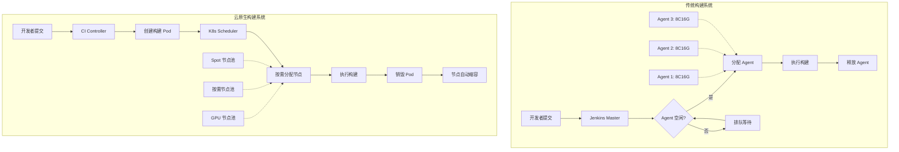
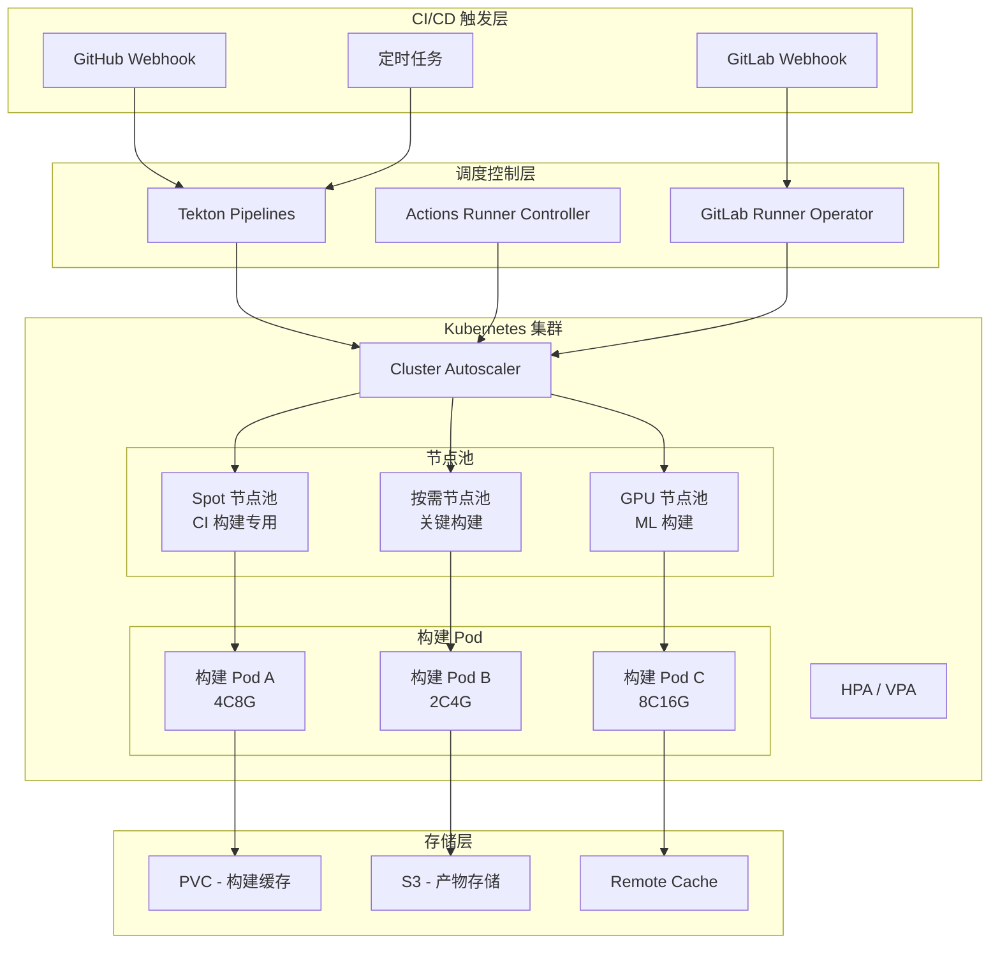

# 构建资源弹性伸缩：云原生构建系统

## 背景与问题定义

构建系统的资源管理是持续交付基础设施中一个常被忽视但影响深远的维度。当团队规模和项目数量增长到一定程度时，固定的构建资源配置将成为交付效率的硬约束。

传统构建系统通常采用固定节点池模式：预先配置若干台构建服务器（如 Jenkins Agent），所有构建任务在这些固定节点上排队执行。这种模式在低负载时造成资源浪费，在高负载时导致任务排队等待，形成典型的"潮汐效应"。

**问题一：资源浪费与瓶颈并存**

在工作时间（如工作日上午 10 点），大量开发者同时提交代码触发 CI 构建，构建队列积压严重，反馈周期从分钟级膨胀到小时级。而在非工作时间（如凌晨），构建节点大量闲置，资源利用率接近零。这种负载波动可达 5-10 倍。

**问题二：资源规格一刀切**

不同构建任务对资源的需求差异巨大：前端构建需要大量内存但 CPU 需求一般；Go 编译需要多核 CPU 但内存需求适中；端到端测试需要完整的环境依赖但计算量不大。固定规格的构建节点无法满足这种异构需求，导致要么资源过度配置（浪费成本），要么资源配置不足（构建失败或缓慢）。

**问题三：扩展性天花板**

固定节点池的容量上限是硬性的。当团队扩展或项目增加时，需要手动采购和配置新的构建节点，这个过程可能需要数天到数周。在业务快速增长的阶段，构建系统的扩展速度往往跟不上业务需求。

云原生构建系统通过将构建任务容器化、调度弹性化、资源按需分配，从根本上解决了这些问题。本文将系统阐述云原生构建系统的架构设计、实现方案和成本优化策略。

## 核心概念

### 传统构建 vs 云原生构建



| 维度 | 传统构建系统 | 云原生构建系统 |
|------|------------|--------------|
| 资源模型 | 固定节点池 | 弹性 Pod 调度 |
| 扩展方式 | 手动添加节点 | 自动水平伸缩 |
| 资源利用率 | 10%-40%（潮汐波动） | 60%-90%（按需分配） |
| 任务隔离 | 弱（共享 Agent） | 强（独立 Pod） |
| 规格定制 | 全局统一 | 每任务独立 |
| 故障恢复 | 手动干预 | 自动重启/重调度 |
| 成本模型 | 固定（无论是否使用） | 弹性（按使用量付费） |
| 冷启动 | 无（节点常驻） | 秒级（Pod 调度） |

### Kubernetes 构建调度核心概念

**Pod 作为构建单元**

在云原生构建系统中，每个构建任务映射为一个 Kubernetes Pod。Pod 的资源请求（requests）和限制（limits）精确控制了构建任务的资源配额。

```yaml
# 构建任务的资源规格示例
resources:
  requests:
    cpu: "2"        # 调度时保证分配 2 核
    memory: "4Gi"   # 调度时保证分配 4GB 内存
  limits:
    cpu: "4"        # 最多使用 4 核
    memory: "8Gi"   # 最多使用 8GB 内存
```

**节点池与自动伸缩**

Kubernetes Cluster Autoscaler 根据 Pod 调度需求自动增减节点。当有待调度的 Pod 时，自动扩容节点池；当节点利用率低于阈值时，自动缩容。

**优先级与抢占**

当集群资源不足时，Kubernetes 根据优先级决定哪些 Pod 先调度，必要时抢占低优先级 Pod 的资源。这允许将 CI 构建任务设置为低优先级，确保生产工作负载不受影响。

### 弹性构建架构



## 架构设计

### 弹性构建系统的设计原则

**原则一：构建任务无状态化**

构建 Pod 不应依赖本地持久化状态。所有需要持久化的数据（构建缓存、依赖包、构建产物）应存储在外部（PVC、S3、Remote Cache）。这确保 Pod 可以随时被销毁和重建，不受状态约束。

**原则二：资源请求精确化**

每个构建任务必须声明精确的资源请求（requests）和限制（limits）。过高的请求导致资源浪费，过低的请求导致构建 OOM 或 CPU 节流。建议基于历史构建数据持续优化资源配置。

**原则三：优先级分层**

将构建任务按重要性分为不同优先级，确保关键路径上的构建（如 main 分支、发布分支）优先获得资源，非关键构建（如 feature 分支的 lint）可以在资源不足时被延迟或抢占。

**原则四：成本与性能平衡**

利用 Spot/Preemptible 实例处理可中断的构建任务，使用按需实例保障关键构建的可靠性。通过构建缓存减少重复计算，降低整体资源消耗。

### 节点池规划

| 节点池 | 实例类型 | 用途 | 优先级 | 伸缩策略 | 成本 |
|--------|---------|------|--------|---------|------|
| ci-spot | Spot/Preemptible | 日常 CI 构建 | Low | 0 → N（按需） | 低（60-90% 折扣） |
| ci-ondemand | 按需实例 | 关键分支构建 | Medium | 1 → N | 标准 |
| ci-gpu | GPU Spot | ML 模型训练 | Low | 0 → N | 高（Spot 折扣） |
| ci-large | 高内存实例 | 前端构建 | Medium | 0 → N | 中高 |

## 实现方案

### Tekton Pipelines：Kubernetes 原生 CI

Tekton 是持续交付基金会（Continuous Delivery Foundation, CDF）项目，将 CI/CD 流水线的每个步骤定义为 Kubernetes CRD（Custom Resource Definition），天然融入 K8s 生态。

**Tekton Task 定义**

```yaml
# tekton/tasks/npm-build.yaml
apiVersion: tekton.dev/v1
kind: Task
metadata:
  name: npm-build
  labels:
    app.kubernetes.io/version: "0.1"
  annotations:
    tekton.dev/pipelines.minVersion: "0.44"
    tekton.dev/tags: build, npm
spec:
  description: >-
    Build a Node.js application using npm,
    with configurable resource requests.
  params:
    - name: node-version
      description: "Node.js version to use"
      default: "20"
    - name: build-command
      description: "Build command to execute"
      default: "npm run build"
    - name: context-path
      description: "Path to the build context"
      default: "."
    - name: cpu-request
      description: "CPU request for the build pod"
      default: "2"
    - name: memory-request
      description: "Memory request for the build pod"
      default: "4Gi"
  workspaces:
    - name: source
      description: "Workspace with source code"
  results:
    - name: build-log
      description: "Build output log path"
  steps:
    - name: install
      image: node:$(params.node-version)-alpine
      workingDir: $(workspaces.source.path)/$(params.context-path)
      script: |
        #!/bin/sh
        set -e
        echo "Installing dependencies..."
        npm ci --prefer-offline
      computeResources:
        requests:
          cpu: $(params.cpu-request)
          memory: $(params.memory-request)
        limits:
          cpu: "4"
          memory: "8Gi"

    - name: build
      image: node:$(params.node-version)-alpine
      workingDir: $(workspaces.source.path)/$(params.context-path)
      script: |
        #!/bin/sh
        set -e
        echo "Running build..."
        $(params.build-command)
        echo "Build completed successfully"
      computeResources:
        requests:
          cpu: $(params.cpu-request)
          memory: $(params.memory-request)
        limits:
          cpu: "4"
          memory: "8Gi"

    - name: upload-artifact
      image: amazon/aws-cli:latest
      workingDir: $(workspaces.source.path)/$(params.context-path)
      script: |
        #!/bin/sh
        set -e
        aws s3 sync dist/ s3://$(params.context-path)-artifacts/$(context.taskRun.uid)/
```

**Tekton Pipeline 编排**

```yaml
# tekton/pipelines/ci-pipeline.yaml
apiVersion: tekton.dev/v1
kind: Pipeline
metadata:
  name: elastic-ci-pipeline
spec:
  description: >-
    Elastic CI pipeline with resource-aware task scheduling.
  params:
    - name: repo-url
      type: string
    - name: revision
      type: string
    - name: image-name
      type: string
  workspaces:
    - name: shared-workspace
    - name: docker-config
  results:
    - name: image-digest
      value: $(tasks.build-image.results.image-digest)

  tasks:
    # Step 1: 获取源代码
    - name: fetch-source
      taskRef:
        name: git-clone
        kind: Task
      workspaces:
        - name: output
          workspace: shared-workspace
      params:
        - name: url
          value: $(params.repo-url)
        - name: revision
          value: $(params.revision)

    # Step 2: 并行执行 Lint 和测试（DAG 依赖）
    - name: lint
      runAfter:
        - fetch-source
      taskRef:
        name: npm-build
      workspaces:
        - name: source
          workspace: shared-workspace
      params:
        - name: build-command
          value: "npm run lint"
        - name: cpu-request
          value: "1"
        - name: memory-request
          value: "2Gi"

    - name: unit-test
      runAfter:
        - fetch-source
      taskRef:
        name: npm-build
      workspaces:
        - name: source
          workspace: shared-workspace
      params:
        - name: build-command
          value: "npm run test:ci"
        - name: cpu-request
          value: "2"
        - name: memory-request
          value: "4Gi"

    # Step 3: 构建应用（依赖 Lint 和测试通过）
    - name: build-app
      runAfter:
        - lint
        - unit-test
      taskRef:
        name: npm-build
      workspaces:
        - name: source
          workspace: shared-workspace
      params:
        - name: build-command
          value: "npm run build:prod"
        - name: cpu-request
          value: "4"
        - name: memory-request
          value: "8Gi"

    # Step 4: 构建容器镜像
    - name: build-image
      runAfter:
        - build-app
      taskRef:
        name: kaniko
        kind: Task
      workspaces:
        - name: source
          workspace: shared-workspace
        - name: dockerconfig
          workspace: docker-config
      params:
        - name: IMAGE
          value: $(params.image-name):$(params.revision)
        - name: BUILDER_IMAGE
          value: gcr.io/kaniko-project/executor:latest
        - name: EXTRA_ARGS
          value:
            - --cache=true
            - --cache-repo=$(params.image-name)/cache
            - --cache-ttl=72h

    # Step 5: 安全扫描
    - name: security-scan
      runAfter:
        - build-image
      taskRef:
        name: trivy-scan
      params:
        - name: image-ref
          value: $(params.image-name):$(params.revision)

  # 最终清理与通知
  finally:
    - name: notify
      taskRef:
        name: send-notification
      params:
        - name: status
          value: $(tasks.status)
        - name: pipeline-name
          value: $(context.pipeline.name)
```

**Tekton 触发器配置**

```yaml
# tekton/triggers/ci-trigger.yaml
apiVersion: triggers.tekton.dev/v1beta1
kind: TriggerTemplate
metadata:
  name: ci-trigger-template
spec:
  params:
    - name: git-repo-url
    - name: git-revision
    - name: git-repo-name
  resourcetemplates:
    - apiVersion: tekton.dev/v1
      kind: PipelineRun
      metadata:
        generateName: ci-$(tt.params.git-repo-name)-
        labels:
          tekton.dev/pipeline: elastic-ci-pipeline
          app: $(tt.params.git-repo-name)
          # 优先级标签：用于 K8s 优先级调度
          priority: "medium"
      spec:
        pipelineRef:
          name: elastic-ci-pipeline
          # 超时控制
        timeouts:
          pipeline: "1h0m0s"
          tasks: "45m0s"
        workspaces:
          - name: shared-workspace
            volumeClaimTemplate:
              spec:
                accessModes:
                  - ReadWriteOnce
                resources:
                  requests:
                    storage: 5Gi
                storageClassName: fast-ssd
          - name: docker-config
            secret:
              secretName: registry-credentials
        params:
          - name: repo-url
            value: $(tt.params.git-repo-url)
          - name: revision
            value: $(tt.params.git-revision)
          - name: image-name
            value: ghcr.io/my-org/$(tt.params.git-repo-name)
---
# TriggerBinding - 解析 Webhook 载荷
apiVersion: triggers.tekton.dev/v1beta1
kind: TriggerBinding
metadata:
  name: github-binding
spec:
  params:
    - name: git-repo-url
      value: $(body.repository.clone_url)
    - name: git-revision
      value: $(body.after)
    - name: git-repo-name
      value: $(body.repository.name)
---
# EventListener - 接收 Webhook
apiVersion: triggers.tekton.dev/v1beta1
kind: EventListener
metadata:
  name: github-listener
spec:
  serviceAccountName: tekton-triggers-sa
  triggers:
    - name: github-push
      bindings:
        - ref: github-binding
      template:
        ref: ci-trigger-template
      interceptors:
        - ref:
            name: github
          params:
            - name: eventTypes
              value: ["push", "pull_request"]
            - name: secretRef
              value:
                secretName: github-webhook-secret
                secretKey: token
```

### GitHub Actions Self-hosted Runners on Kubernetes

Actions Runner Controller (ARC) 是 GitHub 官方维护的 Kubernetes Operator，用于在 K8s 集群中自动管理 GitHub Actions Runners。

**安装 Actions Runner Controller**

```bash
#!/bin/bash
# install-arc.sh - 安装 Actions Runner Controller

# 1. 添加 Helm 仓库
helm repo add actions-runner-controller \
  https://actions-runner-controller.github.io/actions-runner-controller
helm repo update

# 2. 安装 ARC（认证信息通过 authSecret 配置，支持 GitHub App 或 PAT）
helm install arc \
  actions-runner-controller/actions-runner-controller \
  --namespace arc-system \
  --create-namespace \
  --set authSecret.create=true \
  --set authSecret.github_token=${GITHUB_TOKEN} \
  --set githubWebhookServer.enabled=true \
  --set replicaCount=2

# 3. 等待 Controller 就绪
kubectl rollout status deployment/arc-actions-runner-controller \
  --namespace=arc-system --timeout=120s
```

**Runner Deployment 配置**

```yaml
# arc/runners/ci-runners.yaml
apiVersion: actions-runner-controller.github.com/v1alpha1
kind: RunnerDeployment
metadata:
  name: ci-runners
  namespace: arc-system
spec:
  replicas: 1  # 最小副本数
  template:
    spec:
      organization: my-org
      # 使用 GitHub App 认证（推荐）
      githubAPICredentialsFrom:
        secretRef:
          name: github-app-credentials

      # Runner 镜像
      image: summerwind/actions-runner:ubuntu-22.04
      imagePullPolicy: IfNotPresent

      # Runner 标签（用于 Workflow 匹配）
      labels:
        - "self-hosted"
        - "linux"
        - "x64"
        - "ci"

      # 资源配置
      resources:
        requests:
          cpu: "2"
          memory: "4Gi"
        limits:
          cpu: "4"
          memory: "8Gi"

      # 工作目录挂载（构建缓存）
      volumeMounts:
        - name: runner-work
          mountPath: /home/runner/_work
        - name: npm-cache
          mountPath: /home/runner/.npm
      volumes:
        - name: runner-work
          emptyDir: {}
        - name: npm-cache
          persistentVolumeClaim:
            claimName: npm-cache-pvc

      # 环境变量
      env: []
      # 一次性 Runner：任务完成后自动销毁
      ephemeral: true
---
# HorizontalRunnerAutoscaler - 弹性伸缩配置
apiVersion: actions-runner-controller.github.com/v1alpha1
kind: HorizontalRunnerAutoscaler
metadata:
  name: ci-runners-autoscaler
  namespace: arc-system
spec:
  scaleTargetRef:
    name: ci-runners
  minReplicas: 1
  maxReplicas: 20

  # 基于 GitHub Actions 队列长度伸缩
  metrics:
    - type: TotalNumberOfQueuedAndInProgressWorkflowRuns
      repositoryNames:
        - my-org/my-app
        - my-org/my-api
        - my-org/shared-libs
---
# 大规格 Runner（用于前端构建等内存密集型任务）
apiVersion: actions-runner-controller.github.com/v1alpha1
kind: RunnerDeployment
metadata:
  name: ci-large-runners
  namespace: arc-system
spec:
  replicas: 0  # 默认 0，按需扩容
  template:
    spec:
      organization: my-org
      githubAPICredentialsFrom:
        secretRef:
          name: github-app-credentials
      image: summerwind/actions-runner:ubuntu-22.04
      labels:
        - "self-hosted"
        - "linux"
        - "x64"
        - "ci-large"
      resources:
        requests:
          cpu: "8"
          memory: "32Gi"
        limits:
          cpu: "16"
          memory: "64Gi"
      volumeMounts:
        - name: npm-cache
          mountPath: /home/runner/.npm
      volumes:
        - name: npm-cache
          persistentVolumeClaim:
            claimName: npm-cache-pvc-large
      env: []
      # 一次性 Runner：任务完成后自动销毁
      ephemeral: true
      # 节点选择器：指定运行在大规格节点上
      nodeSelector:
        node.kubernetes.io/instance-type: "m5.4xlarge"
      tolerations:
        - key: "runner-type"
          operator: "Equal"
          value: "large"
          effect: "NoSchedule"
---
apiVersion: actions-runner-controller.github.com/v1alpha1
kind: HorizontalRunnerAutoscaler
metadata:
  name: ci-large-runners-autoscaler
  namespace: arc-system
spec:
  scaleTargetRef:
    name: ci-large-runners
  minReplicas: 0
  maxReplicas: 5
  metrics:
    - type: TotalNumberOfQueuedAndInProgressWorkflowRuns
      repositoryNames:
        - my-org/frontend-app
```

**GitHub Actions Workflow 使用 Self-hosted Runner**

```yaml
# .github/workflows/self-hosted-ci.yml
name: Self-hosted CI

on:
  push:
    branches: [main]
  pull_request:

jobs:
  # 普通构建任务 - 使用标准 Runner
  test:
    runs-on: [self-hosted, linux, x64, ci]
    steps:
      - uses: actions/checkout@v4

      - name: Setup Node.js
        uses: actions/setup-node@v4
        with:
          node-version: '20'
          cache: 'npm'

      - run: npm ci
      - run: npm run lint
      - run: npm run test:ci

  # 大规格构建任务 - 使用 Large Runner
  build-frontend:
    runs-on: [self-hosted, linux, x64, ci-large]
    needs: test
    steps:
      - uses: actions/checkout@v4

      - name: Setup Node.js
        uses: actions/setup-node@v4
        with:
          node-version: '20'
          cache: 'npm'

      - run: npm ci
      - run: npm run build:production
```

### 构建资源调度策略

**优先级队列与抢占**

```yaml
# k8s/priority-classes.yaml
apiVersion: scheduling.k8s.io/v1
kind: PriorityClass
metadata:
  name: ci-critical
value: 1000
description: "Critical CI builds (main branch, releases)"
---
apiVersion: scheduling.k8s.io/v1
kind: PriorityClass
metadata:
  name: ci-normal
value: 500
description: "Normal CI builds (PR builds)"
---
apiVersion: scheduling.k8s.io/v1
kind: PriorityClass
metadata:
  name: ci-low
value: 100
preemptionPolicy: PreemptLowerPriority
description: "Low priority CI builds (feature branches, nightly)"
globalDefault: false
---
# 在 Tekton PipelineRun 中使用优先级
apiVersion: tekton.dev/v1
kind: PipelineRun
metadata:
  name: main-branch-build
  labels:
    priority: critical
spec:
  pipelineRef:
    name: elastic-ci-pipeline
  podTemplate:
    priorityClassName: ci-critical  # 关键构建使用高优先级
```

**资源配额管理**

```yaml
# k8s/resource-quotas.yaml
# CI 命名空间的资源配额
apiVersion: v1
kind: ResourceQuota
metadata:
  name: ci-resource-quota
  namespace: ci-system
spec:
  hard:
    requests.cpu: "100"       # 最多 100 核 CPU
    requests.memory: 200Gi    # 最多 200GB 内存
    limits.cpu: "200"         # CPU limit 上限
    limits.memory: 400Gi      # Memory limit 上限
    pods: "50"                # 最多 50 个 Pod
    persistentvolumeclaims: "20"  # 最多 20 个 PVC
---
# LimitRange - 单个 Pod 的资源限制
apiVersion: v1
kind: LimitRange
metadata:
  name: ci-limit-range
  namespace: ci-system
spec:
  limits:
    - type: Container
      default:              # 默认 limit
        cpu: "4"
        memory: "8Gi"
      defaultRequest:       # 默认 request
        cpu: "1"
        memory: "2Gi"
      max:                  # 最大 limit
        cpu: "16"
        memory: "64Gi"
      min:                  # 最小 request
        cpu: "0.5"
        memory: "1Gi"
    - type: Pod
      max:
        cpu: "32"
        memory: "128Gi"
```

**节点池自动伸缩配置**

```yaml
# k8s/cluster-autoscaler-config.yaml
# Cluster Autoscaler 配置（通过启动参数）
apiVersion: apps/v1
kind: Deployment
metadata:
  name: cluster-autoscaler
  namespace: kube-system
spec:
  template:
    spec:
      containers:
        - name: cluster-autoscaler
          image: registry.k8s.io/autoscaling/cluster-autoscaler:v1.29.0
          command:
            - ./cluster-autoscaler
            - --cloud-provider=aws
            - --node-group-auto-discovery=asg:tag=k8s.io/cluster-autoscaler/enabled,k8s.io/cluster-autoscaler/my-cluster
            - --scale-down-unneeded-time=5m      # 空闲 5 分钟后缩容
            - --scale-down-delay-after-add=5m    # 扩容后 5 分钟内不缩容
            - --scale-down-utilization-threshold=0.3  # 节点利用率低于 30% 可缩容
            - --balance-similar-node-groups=true
            - --expander=priority                # 按优先级选择节点组扩容
            - --max-graceful-termination-sec=600
            - --skip-nodes-with-system-pods=false  # CI Pod 可被驱逐
          resources:
            limits:
              cpu: 200m
              memory: 600Mi
            requests:
              cpu: 100m
              memory: 300Mi
```

## 最佳实践

### Spot/Preemptible 实例策略

Spot 实例提供 60-90% 的价格折扣，但随时可能被回收。构建系统需要正确处理实例中断，确保构建任务可以被恢复或重试。

**Spot 实例中断处理**

```yaml
# k8s/spot-node-config.yaml
# Spot 节点池配置（以 AWS EKS 为例）
apiVersion: apps/v1
kind: Deployment
metadata:
  name: spot-termination-handler
  namespace: kube-system
spec:
  replicas: 1
  selector:
    matchLabels:
      app: spot-termination-handler
  template:
    metadata:
      labels:
        app: spot-termination-handler
    spec:
      serviceAccountName: spot-termination-handler-sa
      containers:
        - name: handler
          image: amazon/aws-node-termination-handler:latest
          args:
            - --node-name=$(HOSTNAME)
            - --drain-grace-period=120     # 给 Pod 120 秒优雅终止时间
            - --monitor-grace-period=60    # 监控信号后 60 秒执行排空
            - --skip-nodes-with-local-storage=false
          env:
            - name: HOSTNAME
              valueFrom:
                fieldRef:
                  fieldPath: spec.nodeName
      nodeSelector:
        eks.amazonaws.com/capacityType: SPOT
---
# CI Pod 配置 Spot 容忍度
apiVersion: v1
kind: Pod
metadata:
  name: ci-build-example
  labels:
    app: ci-build
spec:
  # 优先调度到 Spot 节点
  affinity:
    nodeAffinity:
      preferredDuringSchedulingIgnoredDuringExecution:
        - weight: 100
          preference:
            matchExpressions:
              - key: eks.amazonaws.com/capacityType
                operator: In
                values:
                  - SPOT
  tolerations:
    - key: "spot-instance"
      operator: "Equal"
      value: "true"
      effect: "NoSchedule"
  containers:
    - name: build
      image: node:20-alpine
      command: ["npm", "run", "build"]
```

**Spot 实例成本优化对比**（以 AWS us-east-1 为例，Spot 价格随市场浮动，实际以云平台为准）

| 实例类型 | 按需价格 | Spot 价格（约） | 折扣率 | 中断概率 | 推荐用途 |
|---------|---------|----------|--------|---------|---------|
| m5.xlarge (4C16G) | $0.192/hr | $0.058/hr | 70% | < 5% | 通用 CI |
| m5.4xlarge (16C64G) | $0.768/hr | $0.230/hr | 70% | < 5% | 大型构建 |
| c5.4xlarge (16C32G) | $0.680/hr | $0.204/hr | 70% | < 5% | CPU 密集型 |
| r5.4xlarge (16C128G) | $1.008/hr | $0.302/hr | 70% | < 5% | 内存密集型 |
| p3.2xlarge (1 GPU) | $3.06/hr | $0.92/hr | 70% | 10-20% | ML 构建 |

### 构建缓存减少重复计算

构建缓存是降低资源消耗的最有效手段。通过缓存依赖和中间产物，避免重复下载和编译，直接减少构建时间和资源消耗。

```yaml
# k8s/build-cache-pvc.yaml
apiVersion: v1
kind: PersistentVolumeClaim
metadata:
  name: npm-cache-pvc
  namespace: ci-system
spec:
  accessModes:
    - ReadWriteMany  # 多 Pod 共享缓存
  storageClassName: fast-ssd
  resources:
    requests:
      storage: 50Gi
---
apiVersion: v1
kind: PersistentVolumeClaim
metadata:
  name: docker-cache-pvc
  namespace: ci-system
spec:
  accessModes:
    - ReadWriteOnce
  storageClassName: standard
  resources:
    requests:
      storage: 100Gi
---
# Tekton Workspace 使用 PVC 缓存
apiVersion: tekton.dev/v1
kind: PipelineRun
metadata:
  name: cached-build
spec:
  workspaces:
    - name: shared-workspace
      volumeClaimTemplate:
        spec:
          accessModes:
            - ReadWriteOnce
          resources:
            requests:
              storage: 5Gi
    - name: npm-cache
      persistentVolumeClaim:
        claimName: npm-cache-pvc
    - name: docker-cache
      persistentVolumeClaim:
        claimName: docker-cache-pvc
```

**缓存策略对比**

| 缓存策略 | 实现方式 | 命中率 | 一致性 | 成本 | 适用场景 |
|---------|---------|--------|--------|------|---------|
| PVC 缓存 | K8s PersistentVolume | 中 | 最终一致 | 中 | 依赖包缓存 |
| S3 远程缓存 | 对象存储 | 高 | 最终一致 | 低 | 构建产物缓存 |
| Redis 缓存 | 分布式缓存 | 高 | 强一致 | 中 | 元数据缓存 |
| GitHub Actions Cache | 平台内置 | 高 | 强一致 | 免费 | 通用 CI 缓存 |
| Bazel Remote Cache | gRPC 服务 | 极高 | 强一致 | 中高 | Bazel 构建 |

### 成本监控与优化

```yaml
# k8s/cost-monitoring.yaml
# 使用 Kubecost 监控构建成本
apiVersion: v1
kind: ConfigMap
metadata:
  name: cost-monitor-config
  namespace: ci-system
data:
  cost-model.json: |
    {
      "ci_namespace": "ci-system",
      "spot_discount": 0.7,
      "budget_monthly_usd": 5000,
      "alert_threshold": 0.8
    }
---
# 成本告警 Prometheus 规则
apiVersion: monitoring.coreos.com/v1
kind: PrometheusRule
metadata:
  name: ci-cost-alerts
  namespace: ci-system
spec:
  groups:
    - name: ci-cost
      rules:
        - alert: CIBudgetApproaching
          expr: |
            sum(kube_pod_container_resource_requests{namespace="ci-system"} * on(node) group_left() node_cpu_hourly_cost) > 4000
          for: 1h
          labels:
            severity: warning
          annotations:
            summary: "CI resource cost approaching monthly budget"
            description: "Current monthly CI cost estimate exceeds 80% of budget ($5000)"

        - alert: CIQueueTooLong
          expr: |
            tekton_pipelines_running_count < tekton_pipelines_pending_count
          for: 15m
          labels:
            severity: warning
          annotations:
            summary: "CI build queue is longer than running count"
            description: "Pending builds exceed running builds for 15 minutes"
```

### 构建资源弹性伸缩配置清单

| 配置项 | 推荐值 | 说明 |
|--------|--------|------|
| Cluster Autoscaler scan interval | 10s | 快速响应调度需求 |
| Scale-down unneeded time | 5m | 空闲节点快速回收 |
| Scale-down utilization threshold | 30% | 低利用率节点缩容 |
| Pod priority classes | 3 级（critical/normal/low） | 关键构建优先保障 |
| Spot instance ratio | 70-80% | 大部分 CI 任务可中断 |
| Max runner replicas | 按团队规模设定 | 防止无限扩容 |
| Build timeout | 30-60 min | 防止僵尸构建占用资源 |
| PVC cache size | 50-100 Gi | 依赖缓存空间 |
| Node pool cooldown | 5 min | 扩容后稳定期 |

## 效果度量

### 弹性构建系统效能指标

| 指标 | 定义 | 目标值 | 度量方法 |
|------|------|--------|---------|
| Queue Wait Time | 构建任务排队等待时间 | < 2 min | CI 平台统计 |
| Resource Utilization | 集群资源利用率 | 60-80% | K8s Metrics Server |
| Auto-scaling Latency | 扩容响应时间 | < 3 min | Cluster Autoscaler 日志 |
| Build Success Rate | 构建成功率 | > 95% | CI 平台统计 |
| Cost per Build | 单次构建成本 | 可追踪 | Kubecost/云账单 |
| Spot Interruption Rate | Spot 中断率 | < 5% | 云平台事件 |
| Cache Hit Rate | 构建缓存命中率 | > 70% | 缓存系统统计 |
| Cold Start Ratio | 冷启动（新建节点）比例 | < 20% | K8s 事件分析 |

### 成本效益分析

```bash
#!/bin/bash
# cost-analysis.sh - 弹性构建系统成本分析

echo "=== Elastic Build System Cost Analysis ==="
echo "Date: $(date -u +"%Y-%m-%d")"
echo ""

# 模拟参数
TEAM_SIZE=20
BUILDS_PER_DEV_PER_DAY=5
AVG_BUILD_DURATION_MIN=10
INSTANCE_TYPE="m5.xlarge"
ONDEMAND_HOURLY=0.192
SPOT_HOURLY=0.058

# 传统固定节点方案
FIXED_AGENTS=8  # 固定 8 个 Agent
FIXED_MONTHLY=$(echo "$FIXED_AGENTS * $ONDEMAND_HOURLY * 24 * 30" | bc)
echo "=== Traditional Fixed Agent Model ==="
echo "Fixed agents: $FIXED_AGENTS"
echo "Monthly cost: \$${FIXED_MONTHLY}"
echo "Peak capacity: $FIXED_AGENTS concurrent builds"
echo "Off-peak utilization: ~15%"
echo ""

# 弹性构建方案（70% Spot + 30% On-demand）
DAILY_BUILDS=$(echo "$TEAM_SIZE * $BUILDS_PER_DEV_PER_DAY" | bc)
TOTAL_BUILD_HOURS=$(echo "$DAILY_BUILDS * $AVG_BUILD_DURATION_MIN / 60" | bc)
SPOT_HOURS=$(echo "$TOTAL_BUILD_HOURS * 0.7" | bc)
ONDEMAND_HOURS=$(echo "$TOTAL_BUILD_HOURS * 0.3" | bc)
ELASTIC_DAILY=$(echo "$SPOT_HOURS * $SPOT_HOURLY + $ONDEMAND_HOURS * $ONDEMAND_HOURLY" | bc)
ELASTIC_MONTHLY=$(echo "$ELASTIC_DAILY * 30" | bc)
SAVINGS=$(echo "scale=1; ($FIXED_MONTHLY - $ELASTIC_MONTHLY) / $FIXED_MONTHLY * 100" | bc)

echo "=== Elastic Build Model ==="
echo "Daily builds: $DAILY_BUILDS"
echo "Total build hours/day: ${TOTAL_BUILD_HOURS}h"
echo "Spot hours/day: ${SPOT_HOURS}h"
echo "On-demand hours/day: ${ONDEMAND_HOURS}h"
echo "Monthly cost: \$${ELASTIC_MONTHLY}"
echo "Cost savings: ${SAVINGS}%"
echo "Peak capacity: 20+ concurrent builds (auto-scaled)"
echo ""

# 考虑缓存优化的方案
CACHE_HIT_RATE=0.7  # 70% 缓存命中
CACHED_BUILD_RATIO=$(echo "scale=2; 1 - $CACHE_HIT_RATE * 0.8" | bc)  # 缓存命中减少 80% 计算量
EFFECTIVE_BUILD_HOURS=$(echo "$TOTAL_BUILD_HOURS * $CACHED_BUILD_RATIO" | bc)
CACHED_SPOT_HOURS=$(echo "$EFFECTIVE_BUILD_HOURS * 0.7" | bc)
CACHED_ONDEMAND_HOURS=$(echo "$EFFECTIVE_BUILD_HOURS * 0.3" | bc)
CACHED_DAILY=$(echo "$CACHED_SPOT_HOURS * $SPOT_HOURLY + $CACHED_ONDEMAND_HOURS * $ONDEMAND_HOURLY" | bc)
CACHED_MONTHLY=$(echo "$CACHED_DAILY * 30" | bc)
TOTAL_SAVINGS=$(echo "scale=1; ($FIXED_MONTHLY - $CACHED_MONTHLY) / $FIXED_MONTHLY * 100" | bc)

echo "=== Elastic Build with Cache ==="
echo "Cache hit rate: 70%"
echo "Effective build hours/day: ${EFFECTIVE_BUILD_HOURS}h"
echo "Monthly cost: \$${CACHED_MONTHLY}"
echo "Total savings vs fixed: ${TOTAL_SAVINGS}%"
```

**成本对比总结**（按上方脚本假设条件计算，示例数值，非实测）

| 方案 | 月成本 | 并发容量 | 利用率 | 节省比例 |
|------|--------|---------|--------|---------|
| 传统固定节点 | $1,106 | 8 并发 | 15-40% | - |
| 弹性构建（Spot + On-demand） | $49 | 20+ 并发（自动伸缩） | 60-80% | ~96% |
| 弹性构建 + 缓存优化 | $22 | 20+ 并发（自动伸缩） | 70-90% | ~98% |

### 度量看板配置

```yaml
# grafana-dashboard-ci-metrics.yaml
# Grafana Dashboard ConfigMap（摘要）
apiVersion: v1
kind: ConfigMap
metadata:
  name: ci-metrics-dashboard
  namespace: monitoring
data:
  dashboard.json: |
    {
      "dashboard": {
        "title": "CI/CD Build System Metrics",
        "panels": [
          {
            "title": "Build Queue Wait Time",
            "targets": [
              {
                "expr": "histogram_quantile(0.95, sum(rate(tekton_pipelines_run_duration_seconds_bucket{namespace=\"ci-system\"}[5m])) by (le))"
              }
            ]
          },
          {
            "title": "Active Build Pods",
            "targets": [
              {
                "expr": "count(kube_pod_info{namespace=\"ci-system\"})"
              }
            ]
          },
          {
            "title": "Resource Utilization",
            "targets": [
              {
                "expr": "sum(kube_pod_container_resource_requests{namespace=\"ci-system\"}) / sum(kube_node_capacity)"
              }
            ]
          },
          {
            "title": "Spot Instance Usage",
            "targets": [
              {
                "expr": "count(kube_node_labels{label_eks_amazonaws_com_capacityType=\"SPOT\"}) / count(kube_node_info)"
              }
            ]
          },
          {
            "title": "Monthly Cost Estimate",
            "targets": [
              {
                "expr": "sum(kubecost_pod_cost_total{namespace=\"ci-system\"})"
              }
            ]
          }
        ]
      }
    }
```

## 总结

构建资源弹性伸缩是云原生时代持续交付基础设施的关键能力。本文从问题定义到实现方案系统阐述了弹性构建系统的设计与落地：

**问题层面**，传统固定节点池模式的三大痛点——潮汐效应导致的资源浪费与瓶颈、一刀切规格无法满足异构需求、扩展性天花板限制业务增长——在云原生架构中都有对应的解决方案。

**架构层面**，将构建任务容器化为 Pod、通过 Kubernetes 调度器实现按需分配、通过 Cluster Autoscaler 实现节点弹性伸缩、通过优先级队列保障关键构建的资源供给，构成了云原生构建系统的核心架构。Tekton Pipelines 作为 Kubernetes 原生 CI 框架，将流水线的每个步骤映射为 K8s CRD，天然具备弹性伸缩能力。Actions Runner Controller 则为 GitHub Actions 生态提供了在 K8s 上运行 Self-hosted Runners 的方案。

**成本层面**，Spot/Preemptible 实例为可中断构建任务提供 60-90% 的价格折扣，构建缓存通过减少重复计算降低 50% 以上的资源消耗，两者结合可实现 80% 以上的成本节省。成本监控和告警体系确保弹性构建系统在成本可控的前提下高效运行。

**实践层面**，节点池规划应区分 Spot 和按需实例的用途，优先级分层确保关键构建不被抢占，资源配额防止单一团队或项目占用过多资源。效果度量体系则将资源管理从经验驱动转向数据驱动，持续优化弹性策略。

云原生构建系统不是一蹴而就的改造，而是从传统模式逐步演进的旅程。建议团队从 Self-hosted Runners on K8s 入手，验证弹性伸缩的价值，再逐步迁移到 Tekton 等更原生的方案，最终实现构建基础设施的完全云原生化。
