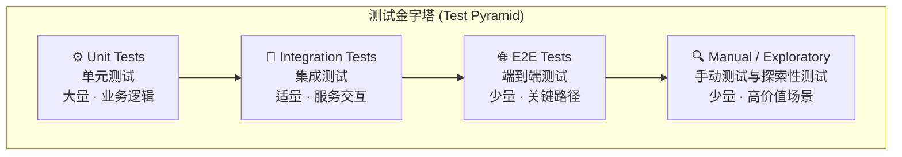
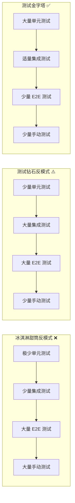
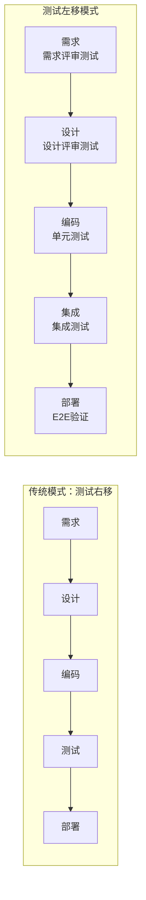
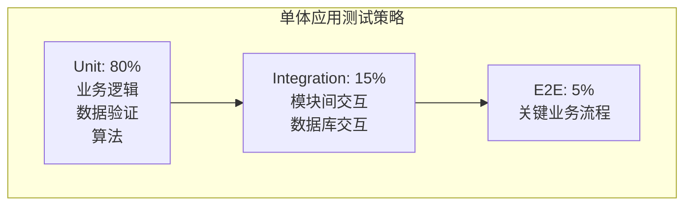
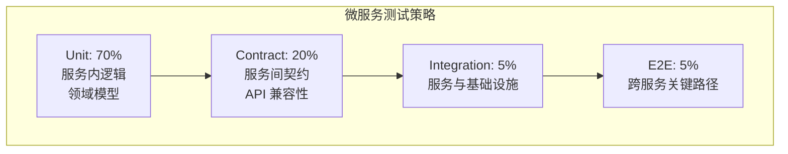
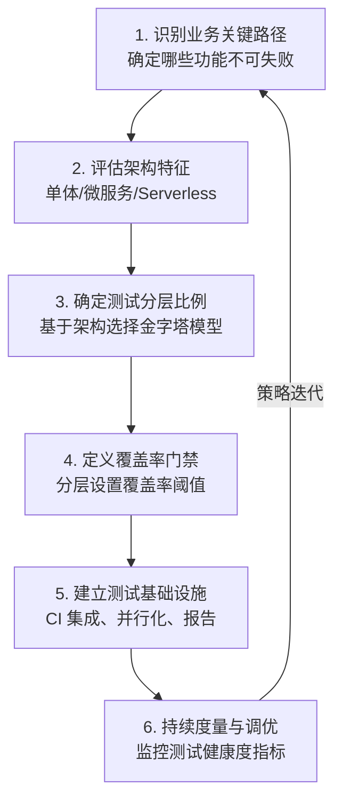
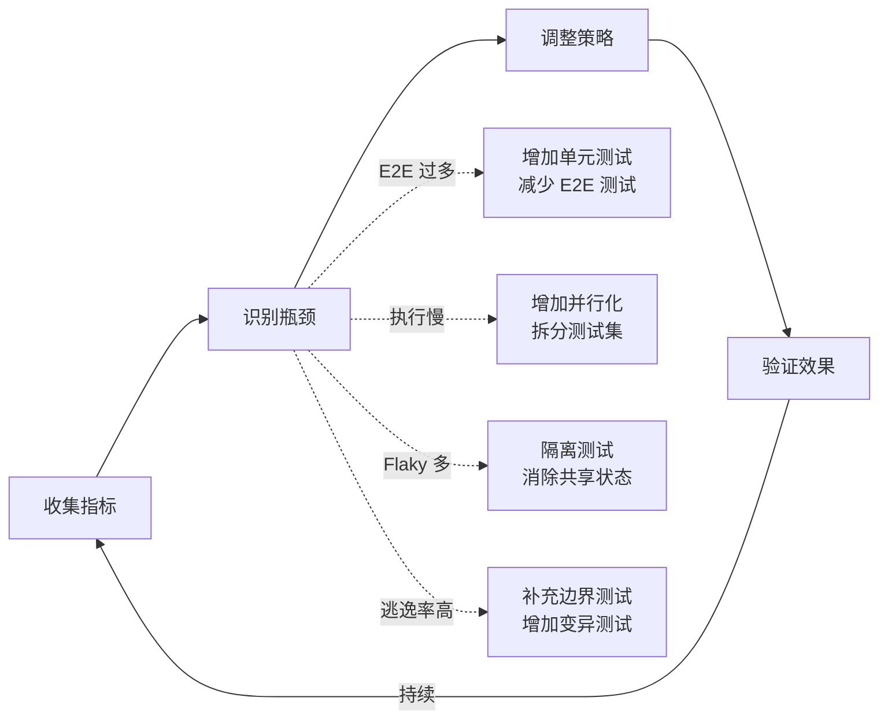

# 测试金字塔与测试策略

## 背景与问题定义

在持续交付的实践中，测试策略的缺失或失衡是导致交付效率低下的最常见原因之一。许多团队面临以下困境：

- **测试运行缓慢**：全量 E2E 测试执行时间超过 4 小时，严重阻塞 CI Pipeline
- **测试维护成本高**：UI 层自动化测试因界面频繁变更而不断失败，维护投入超过编写投入
- **缺陷逃逸率高**：单元测试覆盖率看似充足，但集成缺陷仍大量流入生产环境
- **测试信心不足**：大量测试通过却不敢发布，测试数量与测试信心不成正比

这些问题的根源在于缺乏系统性的测试策略——团队没有在正确的层级投入正确比例的测试，导致测试投资回报率（ROI）严重失衡。Mike Cohn 在《Succeeding with Agile》中提出的测试金字塔模型，为解决这一问题提供了理论框架，但在实际落地中，团队往往陷入各种反模式。

本文将从测试金字塔的原理出发，深入分析不同测试策略的适用场景，建立测试策略与 DORA 指标的量化关联，并针对不同架构风格给出差异化的测试策略方案。

## 核心概念

### 测试金字塔

测试金字塔是测试策略的基础模型，其核心思想是：**测试的层级越低，测试的执行速度越快、维护成本越低、定位缺陷越精确；测试的层级越高，测试的覆盖范围越广、置信度越高，但执行速度越慢、维护成本越高**。



各层级的特征如下：

| 层级 | 测试对象 | 执行速度 | 维护成本 | 缺陷定位精度 | 典型比例 |
|------|---------|---------|---------|------------|---------|
| Unit Tests | 函数/方法/类 | 毫秒级 | 低 | 高（精确到行） | 70% |
| Integration Tests | 模块交互/服务契约 | 秒级 | 中 | 中（定位到接口） | 20% |
| E2E Tests | 完整用户流程 | 分钟级 | 高 | 低（仅知失败场景） | 5% |
| Manual/Exploratory | 用户体验/边界探索 | 小时级 | 极高 | 依赖人工判断 | 5% |

### 测试金字塔的经济学原理

测试金字塔的形状并非随意设定，而是由测试的经济学特性决定的：

1. **执行成本与层级的指数关系**：E2E 测试的执行时间通常是单元测试的 100-1000 倍。一个 5ms 的单元测试，对应的 E2E 测试可能需要 5-30 秒。
2. **维护成本与耦合度的正相关**：测试与实现细节的耦合度越高，维护成本越高。E2E 测试耦合了 UI、网络、数据库等多个维度，任何一个维度的变更都可能导致测试失败。
3. **缺陷定位的逆向成本**：E2E 测试失败后，需要从用户操作层面逐层排查，定位成本远高于单元测试的直接报错。

### 反模式：测试冰淇淋甜筒与测试钻石

理解正确的金字塔形态，同样需要识别常见的反模式：



| 反模式 | 特征 | 成因 | 后果 |
|--------|------|------|------|
| 冰淇淋甜筒 | 底部窄、顶部宽，大量手动和 E2E 测试 | 团队不信任单元测试，依赖端到端验证 | CI 执行慢、反馈周期长、维护成本极高 |
| 测试钻石 | 中间宽、两端窄，大量集成测试 | 微服务架构下过度强调服务间测试 | 测试环境复杂、数据准备困难、Flaky Test 多 |
| 测试沙漏 | 底部宽、中间窄、顶部宽 | 集成测试被跳过，直接从单元跳到 E2E | 集成缺陷逃逸、E2E 测试承担过多验证 |

### 测试左移（Shift Left）

测试左移是测试策略的核心原则之一，其本质是将测试活动从软件开发生命周期的后期前移到早期阶段：



测试左移的实践包括：

- **需求阶段**：需求评审中的测试思维，定义验收标准（Acceptance Criteria）
- **设计阶段**：架构评审中的可测试性评估，接口契约先行定义
- **编码阶段**：TDD（Test-Driven Development），先写测试再写实现
- **代码评审阶段**：测试覆盖率门禁，测试质量审查

测试左移的量化收益：业界广泛流传的经验数据认为，缺陷在编码阶段发现的修复成本约为 1x，在测试阶段发现约为 10x，在生产环境发现约为 100x（该数字常被归于 IBM 的研究并被广泛引用，但缺乏严谨出处，宜作为量级参考）。"缺陷发现越晚、修复越贵"的总体方向则得到普遍认同。

## 架构设计

### 测试策略与 DORA 指标的关联

DORA（DevOps Research and Assessment）的四年研究揭示了软件交付效能的四个关键指标，测试策略与这些指标存在直接关联：

| DORA 指标 | 定义 | 测试策略的影响路径 |
|-----------|------|------------------|
| Deployment Frequency | 部署频率 | 测试执行速度决定部署频率上限；快速单元测试支持高频部署 |
| Lead Time for Changes | 变更前置时间 | 测试反馈速度直接影响变更从提交到部署的时间 |
| Change Failure Rate | 变更失败率 | 测试覆盖率与分层策略决定缺陷逃逸率 |
| MTTR | 平均恢复时间 | 测试定位精度影响故障定位与恢复速度 |

关键发现：

1. **测试覆盖率与变更失败率的相关性**：DORA 研究表明，高绩效团队的测试覆盖率通常在 80% 以上，且变更失败率控制在 0-15%。但覆盖率并非唯一因素——**测试的分层分布**比覆盖率数字更重要。一个 90% 覆盖率但全部是 E2E 测试的团队，其变更失败率可能高于 60% 覆盖率但遵循金字塔分布的团队。

2. **测试执行时间与部署频率的负相关**：当全量测试执行时间超过 30 分钟时，部署频率显著下降。Google 的研究显示，精英团队的测试执行时间中位数为 10 分钟以内。

3. **测试稳定性与 Lead Time 的关系**：Flaky Test 比例超过 5% 时，团队对测试结果的信任度急剧下降，导致人工验证增加，Lead Time 显著延长。

> **注**：以上数字为业界经验归纳的示意值，并非 DORA 报告原文数据，用于说明趋势方向。

### 不同架构的测试策略

不同架构风格对测试策略有根本性影响，不能简单套用同一套金字塔比例：

#### 单体应用（Monolith）

单体应用的测试策略最接近经典金字塔模型：



单体应用的特点：
- 所有代码在同一进程内，单元测试可以完全隔离
- 集成测试主要验证模块间调用和数据库交互
- E2E 测试通过 HTTP 接口驱动，环境搭建相对简单
- 推荐比例：Unit 80% / Integration 15% / E2E 5%

#### 微服务架构（Microservices）

微服务架构下，测试策略需要调整——集成测试的比重和复杂度显著增加：



微服务架构的关键差异：
- **Contract Testing 替代传统集成测试**：Pact 等工具验证服务间契约，避免搭建完整的服务依赖链
- **Service Virtualization**：用 Virtual Service 替代真实依赖服务，降低环境复杂度
- **每个服务独立测试金字塔**：每个微服务维护自己的测试金字塔，而非全局统一
- **跨服务 E2E 测试最小化**：仅覆盖最关键的业务流程，避免服务耦合

#### Serverless 架构

Serverless 架构的测试策略需要进一步调整：

| 测试层级 | Serverless 特殊考量 | 推荐工具 |
|---------|---------------------|---------|
| Unit | Lambda 函数隔离测试，Mock AWS SDK | Jest + aws-sdk-mock |
| Integration | Lambda 与 AWS 服务的集成验证 | LocalStack / SAM CLI |
| Contract | API Gateway 与 Lambda 的契约 | AWS CDK 集成测试 |
| E2E | 完整 Serverless 应用流程 | Serverless Framework + Playwright |

Serverless 架构的测试难点在于：
- 函数是独立部署单元，传统集成测试概念需要重新定义
- 云服务的 Mock 难度大，LocalStack 覆盖率有限
- 冷启动影响测试执行时间
- 事件驱动的异步流程测试复杂度高

## 实现方案

### Jest 单元测试示例

以下是一个完整的 Jest 单元测试项目示例，展示测试金字塔底层的高质量单元测试编写方法：

```javascript
// src/domain/Order.js - 订单领域模型
class Order {
  constructor(orderId, customerId, items = []) {
    if (!orderId) throw new Error('OrderId is required');
    if (!customerId) throw new Error('CustomerId is required');

    this.orderId = orderId;
    this.customerId = customerId;
    this.items = items;
    this.status = 'CREATED';
    this.createdAt = new Date();
    this.totalAmount = 0;
  }

  addItem(product, quantity) {
    if (this.status !== 'CREATED') {
      throw new Error(`Cannot add items to order in ${this.status} status`);
    }
    if (quantity <= 0) {
      throw new Error('Quantity must be positive');
    }
    if (!product || !product.price || !product.id) {
      throw new Error('Invalid product');
    }

    const existingItem = this.items.find(item => item.productId === product.id);
    if (existingItem) {
      existingItem.quantity += quantity;
    } else {
      this.items.push({
        productId: product.id,
        productName: product.name,
        price: product.price,
        quantity
      });
    }
    this._recalculateTotal();
    return this;
  }

  removeItem(productId) {
    if (this.status !== 'CREATED') {
      throw new Error(`Cannot remove items from order in ${this.status} status`);
    }
    const index = this.items.findIndex(item => item.productId === productId);
    if (index === -1) {
      throw new Error(`Product ${productId} not found in order`);
    }
    this.items.splice(index, 1);
    this._recalculateTotal();
    return this;
  }

  applyDiscount(discountCode) {
    const DISCOUNT_RULES = {
      'SAVE10': { type: 'percentage', value: 0.10, minOrder: 100 },
      'SAVE20': { type: 'percentage', value: 0.20, minOrder: 200 },
      'FLAT50': { type: 'fixed', value: 50, minOrder: 200 },
    };

    const rule = DISCOUNT_RULES[discountCode];
    if (!rule) throw new Error('Invalid discount code');

    if (this.totalAmount < rule.minOrder) {
      throw new Error(`Minimum order amount ${rule.minOrder} required for ${discountCode}`);
    }

    if (rule.type === 'percentage') {
      this.discountAmount = this.totalAmount * rule.value;
    } else {
      this.discountAmount = Math.min(rule.value, this.totalAmount);
    }

    this.discountCode = discountCode;
    this._recalculateTotal();
    return this;
  }

  submit() {
    if (this.status !== 'CREATED') {
      throw new Error(`Cannot submit order in ${this.status} status`);
    }
    if (this.items.length === 0) {
      throw new Error('Cannot submit empty order');
    }
    this.status = 'SUBMITTED';
    this.submittedAt = new Date();
    return this;
  }

  _recalculateTotal() {
    this.totalAmount = this.items.reduce(
      (sum, item) => sum + (item.price * item.quantity), 0
    );
    if (this.discountAmount) {
      this.finalAmount = Math.max(0, this.totalAmount - this.discountAmount);
    } else {
      this.finalAmount = this.totalAmount;
    }
  }
}

module.exports = { Order };
```

```javascript
// tests/unit/Order.test.js - 单元测试
const { Order } = require('../../src/domain/Order');

describe('Order Domain Model', () => {
  // --- 构造函数测试 ---
  describe('constructor', () => {
    test('should create order with valid parameters', () => {
      const order = new Order('ORD-001', 'CUST-001');
      expect(order.orderId).toBe('ORD-001');
      expect(order.customerId).toBe('CUST-001');
      expect(order.status).toBe('CREATED');
      expect(order.items).toEqual([]);
      expect(order.totalAmount).toBe(0);
    });

    test('should throw error when orderId is missing', () => {
      expect(() => new Order(null, 'CUST-001'))
        .toThrow('OrderId is required');
    });

    test('should throw error when customerId is missing', () => {
      expect(() => new Order('ORD-001', ''))
        .toThrow('CustomerId is required');
    });
  });

  // --- 添加商品测试 ---
  describe('addItem', () => {
    let order;
    const product = { id: 'PROD-001', name: 'TypeScript Guide', price: 99.00 };

    beforeEach(() => {
      order = new Order('ORD-001', 'CUST-001');
    });

    test('should add item to empty order', () => {
      order.addItem(product, 2);
      expect(order.items).toHaveLength(1);
      expect(order.items[0]).toEqual({
        productId: 'PROD-001',
        productName: 'TypeScript Guide',
        price: 99.00,
        quantity: 2
      });
      expect(order.totalAmount).toBe(198.00);
    });

    test('should merge quantity when adding same product', () => {
      order.addItem(product, 1);
      order.addItem(product, 2);
      expect(order.items).toHaveLength(1);
      expect(order.items[0].quantity).toBe(3);
      expect(order.totalAmount).toBe(297.00);
    });

    test('should throw error for non-positive quantity', () => {
      expect(() => order.addItem(product, 0))
        .toThrow('Quantity must be positive');
      expect(() => order.addItem(product, -1))
        .toThrow('Quantity must be positive');
    });

    test('should throw error for invalid product', () => {
      expect(() => order.addItem(null, 1)).toThrow('Invalid product');
      expect(() => order.addItem({ id: 'P1' }, 1)).toThrow('Invalid product');
    });

    test('should throw error when adding item to submitted order', () => {
      order.addItem(product, 1).submit();
      expect(() => order.addItem(product, 1))
        .toThrow('Cannot add items to order in SUBMITTED status');
    });
  });

  // --- 折扣测试 ---
  describe('applyDiscount', () => {
    let order;

    beforeEach(() => {
      order = new Order('ORD-001', 'CUST-001');
      order.addItem({ id: 'P1', name: 'Book', price: 150 }, 1);
    });

    test('should apply percentage discount SAVE10', () => {
      order.applyDiscount('SAVE10');
      expect(order.discountAmount).toBe(15.00);
      expect(order.finalAmount).toBe(135.00);
    });

    test('should apply percentage discount SAVE20', () => {
      order.addItem({ id: 'P2', name: 'Course', price: 100 }, 1);
      order.applyDiscount('SAVE20');
      expect(order.discountAmount).toBe(50.00);
      expect(order.finalAmount).toBe(200.00);
    });

    test('should apply fixed discount FLAT50', () => {
      order.addItem({ id: 'P2', name: 'Course', price: 100 }, 1);
      order.applyDiscount('FLAT50');
      expect(order.discountAmount).toBe(50.00);
      expect(order.finalAmount).toBe(200.00);
    });

    test('should throw error for invalid discount code', () => {
      expect(() => order.applyDiscount('INVALID'))
        .toThrow('Invalid discount code');
    });

    test('should throw error when order amount below minimum', () => {
      const smallOrder = new Order('ORD-002', 'CUST-002');
      smallOrder.addItem({ id: 'P1', name: 'Pen', price: 50 }, 1);
      expect(() => smallOrder.applyDiscount('SAVE10'))
        .toThrow('Minimum order amount 100 required');
    });
  });

  // --- 提交订单测试 ---
  describe('submit', () => {
    test('should submit order with items', () => {
      const order = new Order('ORD-001', 'CUST-001');
      order.addItem({ id: 'P1', name: 'Book', price: 50 }, 1);
      order.submit();
      expect(order.status).toBe('SUBMITTED');
      expect(order.submittedAt).toBeInstanceOf(Date);
    });

    test('should throw error when submitting empty order', () => {
      const order = new Order('ORD-001', 'CUST-001');
      expect(() => order.submit()).toThrow('Cannot submit empty order');
    });

    test('should not allow double submission', () => {
      const order = new Order('ORD-001', 'CUST-001');
      order.addItem({ id: 'P1', name: 'Book', price: 50 }, 1);
      order.submit();
      expect(() => order.submit())
        .toThrow('Cannot submit order in SUBMITTED status');
    });
  });

  // --- 链式调用测试 ---
  describe('method chaining', () => {
    test('should support fluent API', () => {
      const order = new Order('ORD-001', 'CUST-001')
        .addItem({ id: 'P1', name: 'Book', price: 150 }, 2)
        .addItem({ id: 'P2', name: 'Course', price: 100 }, 1)
        .applyDiscount('SAVE10')
        .submit();

      expect(order.status).toBe('SUBMITTED');
      expect(order.totalAmount).toBe(400.00);
      expect(order.discountAmount).toBe(40.00);
      expect(order.finalAmount).toBe(360.00);
    });
  });
});
```

```javascript
// jest.config.js - Jest 配置
module.exports = {
  testEnvironment: 'node',
  coverageDirectory: './coverage',
  collectCoverageFrom: [
    'src/**/*.js',
    '!src/**/*.d.ts',
    '!src/index.js',
  ],
  coverageThreshold: {
    global: {
      branches: 80,
      functions: 80,
      lines: 80,
      statements: 80,
    },
  },
  // 测试并行化
  maxWorkers: '50%',
  // 测试超时
  testTimeout: 5000,
};
```

运行测试与覆盖率报告：

```bash
# 安装依赖
npm install --save-dev jest

# 运行测试
npx jest tests/unit/Order.test.js

# 生成覆盖率报告
npx jest --coverage tests/unit/Order.test.js

# 输出示例：
# PASS  tests/unit/Order.test.js
#   Order Domain Model
#     constructor
#       ✓ should create order with valid parameters (3ms)
#       ✓ should throw error when orderId is missing
#       ✓ should throw error when customerId is missing
#     addItem
#       ✓ should add item to empty order
#       ✓ should merge quantity when adding same product
#       ✓ should throw error for non-positive quantity
#       ✓ should throw error for invalid product
#       ✓ should throw error when adding item to submitted order
#     applyDiscount
#       ✓ should apply percentage discount SAVE10
#       ✓ should apply percentage discount SAVE20
#       ✓ should apply fixed discount FLAT50
#       ✓ should throw error for invalid discount code
#       ✓ should throw error when order amount below minimum
#     submit
#       ✓ should submit order with items
#       ✓ should throw error when submitting empty order
#       ✓ should not allow double submission
#     method chaining
#       ✓ should support fluent API (1ms)
#
# ----------|---------|----------|---------|---------|-------------------
# File      | % Stmts | % Branch | % Funcs | % Lines | Uncovered Line #s
# ----------|---------|----------|---------|---------|-------------------
# All files |     100 |      100 |     100 |     100 |
# ----------|---------|----------|---------|---------|-------------------
```

### 测试策略制定流程

制定测试策略不是一次性活动，而是需要持续迭代的系统工程：



## 最佳实践

### 1. 覆盖率门禁的分层设置

不要对所有层级设置相同的覆盖率要求，应根据层级特征差异化设置：

| 测试层级 | 推荐覆盖率阈值 | 理由 |
|---------|--------------|------|
| Unit Tests | >= 80% | 核心业务逻辑必须充分覆盖 |
| Integration Tests | >= 60% 关键接口 | 服务间交互的关键路径必须覆盖 |
| E2E Tests | 100% 关键业务流程 | P0/P1 级功能必须端到端验证 |
| 总体覆盖率 | >= 70% | 保障整体质量基线 |

### 2. 测试策略的动态调整

测试策略不是静态文档，需要根据以下信号动态调整：

- **变更失败率上升**：增加对应模块的单元测试覆盖
- **Flaky Test 比例超过 5%**：降低 E2E 测试比重，用集成测试替代
- **CI 执行时间超过 30 分钟**：增加并行化，或拆分测试流水线
- **新服务上线**：优先建立 Contract Testing，再补充单元测试

### 3. 测试可测试性设计（Design for Testability）

测试策略的有效性很大程度上取决于代码的可测试性：

```javascript
// ❌ 不可测试的代码：硬编码依赖
class PaymentService {
  processPayment(orderId, amount) {
    // 硬编码依赖，无法 Mock
    const stripe = new Stripe('sk_live_xxx');
    const result = stripe.charges.create({
      amount: amount * 100,
      currency: 'usd',
    });
    // 硬编码数据库连接
    const db = new PostgreSQL('localhost:5432');
    db.query('INSERT INTO payments ...');
    return result;
  }
}

// ✅ 可测试的代码：依赖注入
class PaymentService {
  constructor(paymentGateway, paymentRepository) {
    this.paymentGateway = paymentGateway;
    this.repository = paymentRepository;
  }

  async processPayment(orderId, amount) {
    const result = await this.paymentGateway.charge(amount);
    await this.repository.save({ orderId, ...result });
    return result;
  }
}

// 测试时注入 Mock
describe('PaymentService', () => {
  test('should process payment successfully', async () => {
    const mockGateway = {
      charge: jest.fn().mockResolvedValue({ id: 'ch_123', status: 'succeeded' })
    };
    const mockRepo = {
      save: jest.fn().mockResolvedValue(true)
    };
    const service = new PaymentService(mockGateway, mockRepo);

    const result = await service.processPayment('ORD-001', 99.99);

    expect(mockGateway.charge).toHaveBeenCalledWith(99.99);
    expect(mockRepo.save).toHaveBeenCalledWith(
      expect.objectContaining({ orderId: 'ORD-001' })
    );
    expect(result.status).toBe('succeeded');
  });
});
```

### 4. 测试命名与组织规范

测试的组织方式直接影响测试的可维护性：

```javascript
// 推荐的测试组织模式：Given-When-Then
describe('Order.applyDiscount', () => {
  test('GIVEN order amount >= 100 WHEN applying SAVE10 THEN 10% discount applied', () => {
    // Given
    const order = new Order('ORD-001', 'CUST-001');
    order.addItem({ id: 'P1', name: 'Book', price: 150 }, 1);

    // When
    order.applyDiscount('SAVE10');

    // Then
    expect(order.discountAmount).toBe(15.00);
    expect(order.finalAmount).toBe(135.00);
  });
});
```

### 5. 避免测试反模式

| 反模式 | 描述 | 正确做法 |
|--------|------|---------|
| 测试实现细节 | 断言私有方法或内部状态 | 只测试公共接口和行为 |
| 过度 Mock | Mock 所有依赖包括简单数据对象 | 只 Mock 外部边界（I/O、网络、数据库） |
| 测试间依赖 | 测试 B 依赖测试 A 的执行结果 | 每个测试独立运行，beforeEach 重置状态 |
| 断言不足 | 测试执行但不验证结果 | 每个测试至少一个有意义的断言 |
| 重复测试 | 同一逻辑在多个层级重复测试 | 每个逻辑只在最合适的层级测试一次 |

## 效果度量

### 测试策略健康度指标

建立测试策略的度量体系，持续监控测试投资的有效性：

| 指标 | 计算方式 | 健康阈值 | 预警阈值 |
|------|---------|---------|---------|
| 测试金字塔比例 | 各层测试数量占比 | Unit:Integration:E2E = 70:20:10 | E2E 超过 30% |
| 测试执行时间 | 全量测试运行耗时 | < 10 分钟 | > 30 分钟 |
| Flaky Test 率 | 不稳定测试 / 总测试数 | < 2% | > 5% |
| 变更失败率 | 导致失败的部署 / 总部署 | < 5% | > 15% |
| 测试覆盖率 | 行/分支/函数覆盖率 | > 80% | < 60% |
| 缺陷逃逸率 | 生产缺陷 / (测试发现 + 生产缺陷) | < 5% | > 15% |
| 测试维护成本 | 测试修复时间 / 测试编写时间 | < 20% | > 50% |

### 度量驱动的策略优化循环



### ROI 分析框架

测试策略的投入产出分析：

```
测试 ROI = (缺陷预防收益 - 测试投入成本) / 测试投入成本

其中：
缺陷预防收益 = 逃逸缺陷数减少 × 平均缺陷修复成本（生产环境）
测试投入成本 = 测试编写时间 + 测试维护时间 + 测试执行时间 × 执行频率 + 基础设施成本

典型数据（示例区间，供建模参考，非实测）：
- 生产缺陷修复成本：$5,000 - $50,000 / 缺陷
- 测试阶段缺陷修复成本：$50 - $500 / 缺陷
- 单元测试编写成本：$5 - $20 / 测试
- E2E 测试编写成本：$100 - $500 / 测试
- 单元测试执行成本：$0.001 / 次
- E2E 测试执行成本：$0.5 - $5 / 次
```

## 总结

测试金字塔不是教条的数字比例，而是一种投资策略的思维方式——**在反馈速度最快、维护成本最低的层级投入最多的测试，在覆盖范围最广但成本最高的层级投入最少的测试**。核心要点回顾：

1. **金字塔原理**：Unit → Integration → E2E → Manual，底层大量快速测试，顶层少量高价值测试。偏离金字塔形态（冰淇淋甜筒、钻石）会导致测试 ROI 急剧下降。

2. **架构适配**：不同架构需要不同的测试策略。单体应用遵循经典金字塔，微服务引入 Contract Testing 替代传统集成测试，Serverless 需要重新定义集成测试的边界。

3. **测试左移**：将测试活动前移到需求和设计阶段，每前移一个阶段，缺陷修复成本降低一个数量级。

4. **DORA 关联**：测试策略直接影响变更失败率和部署频率。测试的分层分布比覆盖率数字更重要。

5. **持续度量**：建立测试健康度指标体系，用数据驱动策略调整，避免测试策略成为静态文档。

6. **可测试性设计**：测试策略的有效性取决于代码的可测试性。依赖注入、接口抽象、关注点分离是可测试性的三大支柱。

下一篇文章将深入测试金字塔的每一层，详细讲解单元测试、集成测试和 E2E 测试的实践方法，包括 Mock/Stub 策略、Contract Testing、Playwright E2E 测试以及测试并行化与 Flaky Test 治理。
