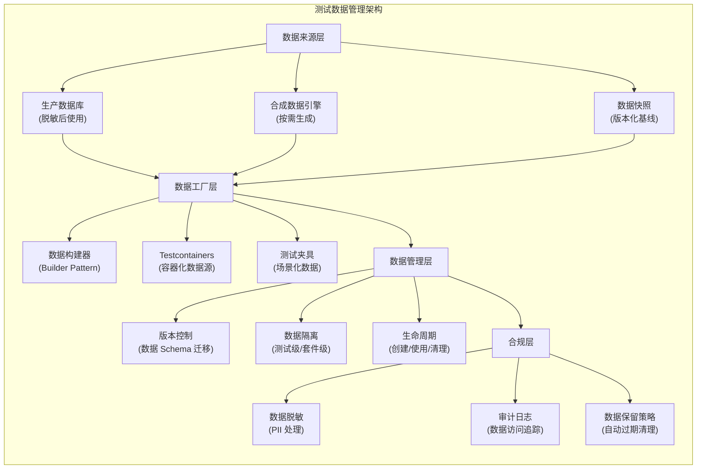
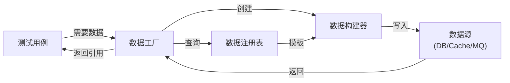
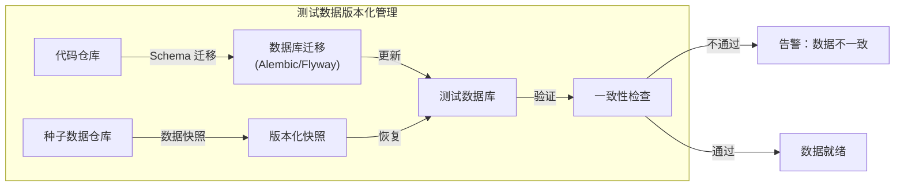

# 测试数据管理：Test Data Management

## 背景与问题定义

在前两篇文章中，我们建立了测试金字塔的理论框架，并详细讲解了各层自动化测试的实践方法。然而，有一个贯穿所有测试层级的核心挑战尚未解决——**测试数据**。

测试数据管理是自动化测试面临的最大瓶颈之一。世界质量报告（World Quality Report）连续多年的调研数据显示，超过 60% 的测试团队将"测试数据的获取与维护"列为自动化测试的首要障碍。具体表现为：

- **数据获取困难**：生产数据受隐私法规约束无法直接使用，合成数据缺乏真实感
- **数据一致性差**：不同测试用例共享数据导致相互干扰，并行测试冲突频发
- **数据维护成本高**：测试数据与代码变更不同步，数据"腐化"导致测试集体失败
- **环境数据漂移**：测试环境中的数据随时间偏离预期状态，测试结果不可重现
- **合规风险**：包含 PII（Personally Identifiable Information）的数据流入测试环境，违反 GDPR/CCPA 等法规

本文将系统性地解决测试数据的获取、生成、管理和合规问题，建立一套可落地的测试数据管理框架。

## 核心概念

### 测试数据管理架构



### 测试数据策略分类

不同的测试场景需要不同的数据策略，没有一种策略适用于所有情况：

| 数据策略 | 描述 | 优点 | 缺点 | 适用场景 |
|---------|------|------|------|---------|
| 生产数据脱敏 | 从生产环境复制数据并移除敏感信息 | 数据真实性高、边界条件自然 | 脱敏可能不彻底、数据量大、合规风险 | 性能测试、压力测试 |
| 合成数据生成 | 按规则或算法生成虚拟数据 | 完全合规、可控性强、按需生成 | 缺乏真实世界的边界情况 | 功能测试、单元测试 |
| 数据快照 | 在特定时间点捕获数据库状态 | 可重现、版本化、快速恢复 | 快照可能过时、存储成本高 | 回归测试、E2E 测试 |
| 混合策略 | 组合多种数据来源 | 兼顾真实性和合规性 | 实现复杂度较高 | 大型项目、合规要求严格的场景 |

### 测试数据的分类维度

按数据的生命周期和使用方式，测试数据可以分为以下几类：

| 分类 | 定义 | 生命周期 | 示例 |
|------|------|---------|------|
| Reference Data | 系统运行必需的静态参考数据 | 长期不变 | 国家代码、货币类型、产品分类 |
| Seed Data | 测试开始前预置的基础数据 | 随测试套件创建 | 测试用户、默认配置 |
| Test-specific Data | 特定测试用例需要的输入数据 | 随测试用例创建和销毁 | 订单数据、支付记录 |
| Shared Data | 多个测试共享的可复用数据 | 随测试环境创建 | 公共产品目录、共享账户 |

## 架构设计

### 数据工厂模式

数据工厂模式（Data Factory Pattern）是测试数据管理的核心设计模式，其目标是**将测试数据的创建与测试逻辑解耦**，使测试代码关注"验证什么"而非"数据怎么来"：



#### Python 数据工厂：Factory Boy

```python
# tests/factories.py - Factory Boy 数据工厂定义
import factory
from datetime import datetime, timezone
from src.models import User, Order, OrderItem, Product, Payment


class UserFactory(factory.Factory):
    """用户数据工厂"""
    class Meta:
        model = User

    # 自动生成唯一值
    username = factory.Sequence(lambda n: f'testuser_{n}')
    email = factory.LazyAttribute(lambda obj: f'{obj.username}@test.example.com')
    phone = factory.Sequence(lambda n: f'+86-138-{n:08d}')
    status = 'ACTIVE'
    created_at = factory.LazyFunction(lambda: datetime.now(timezone.utc))

    # 嵌套工厂：创建用户时自动创建默认地址
    # （AddressFactory 定义于同目录其他工厂模块中）
    class Params:
        with_address = False

    @factory.post_generation
    def addresses(self, create, extracted, **kwargs):
        if not create:
            return
        if self.with_address or extracted:
            AddressFactory.create(user=self, **kwargs)


class ProductFactory(factory.Factory):
    """产品数据工厂"""
    class Meta:
        model = Product

    product_id = factory.Sequence(lambda n: f'PROD-{n:05d}')
    name = factory.Sequence(lambda n: f'Test Product {n}')
    # 使用 Sequence 而非 hash()，保证跨进程可复现
    price = factory.Sequence(lambda n: round(10 + (n % 990), 2))
    category = 'ELECTRONICS'
    stock = 100
    status = 'ON_SALE'


class OrderFactory(factory.Factory):
    """订单数据工厂 - 支持多种预设场景"""
    class Meta:
        model = Order

    order_id = factory.Sequence(lambda n: f'ORD-{n:06d}')
    customer = factory.SubFactory(UserFactory)
    status = 'CREATED'
    total_amount = 0

    # 预设场景：含 N 个商品的订单
    class Params:
        item_count = 0

    @factory.post_generation
    def items(self, create, extracted, **kwargs):
        if not create:
            return
        if extracted:
            for item in extracted:
                OrderItemFactory.create(order=self, **item)
        elif self.item_count > 0:
            for _ in range(self.item_count):
                OrderItemFactory.create(order=self)


class OrderItemFactory(factory.Factory):
    """订单项数据工厂"""
    class Meta:
        model = OrderItem

    order = factory.SubFactory(OrderFactory)
    product = factory.SubFactory(ProductFactory)
    quantity = 1
    unit_price = factory.LazyAttribute(lambda obj: obj.product.price)

    @factory.lazy_attribute
    def subtotal(self):
        return self.unit_price * self.quantity


class PaymentFactory(factory.Factory):
    """支付数据工厂"""
    class Meta:
        model = Payment

    order = factory.SubFactory(OrderFactory)
    amount = factory.LazyAttribute(lambda obj: obj.order.total_amount or 100.00)
    method = 'CREDIT_CARD'
    status = 'COMPLETED'
    transaction_id = factory.Sequence(lambda n: f'TXN-{n:08d}')
```

```python
# tests/test_order_flow.py - 使用数据工厂的测试
import pytest
from tests.factories import UserFactory, OrderFactory, ProductFactory, PaymentFactory


class TestOrderFlow:
    """使用数据工厂的订单流程测试"""

    def test_create_order_with_multiple_items(self, db_session):
        """测试创建多商品订单"""
        # 使用工厂创建数据，无需关心底层数据细节
        order = OrderFactory.create(item_count=3)

        assert order.status == 'CREATED'
        assert len(order.items) == 3
        assert order.total_amount > 0

    def test_apply_discount_to_order(self, db_session):
        """测试订单折扣"""
        # 创建金额充足的订单
        product = ProductFactory.create(price=200.00)
        order = OrderFactory.create()
        order.add_item(product, quantity=1)

        order.apply_discount('SAVE10')

        assert order.discount_amount == 20.00
        assert order.final_amount == 180.00

    def test_submit_empty_order_fails(self, db_session):
        """测试提交空订单应失败"""
        order = OrderFactory.create(item_count=0)

        with pytest.raises(ValueError, match='Cannot submit empty order'):
            order.submit()

    def test_payment_for_order(self, db_session):
        """测试订单支付"""
        order = OrderFactory.create(item_count=2)
        order.submit()

        payment = PaymentFactory.create(order=order, amount=order.total_amount)

        assert payment.status == 'COMPLETED'
        assert payment.amount == order.total_amount

    def test_user_with_address(self, db_session):
        """测试用户地址关联"""
        user = UserFactory.create(with_address=True)

        assert len(user.addresses) >= 1
        assert user.addresses[0].user_id == user.id
```

### Testcontainers 实践

Testcontainers 提供了容器化的数据源管理能力，确保每个测试套件运行在独立的、干净的数据库实例中：

```python
# tests/conftest.py - Testcontainers 配置
import pytest
from testcontainers.postgres import PostgresContainer
from testcontainers.redis import RedisContainer
from sqlalchemy import create_engine, event
from sqlalchemy.orm import sessionmaker
from src.models.base import Base


@pytest.fixture(scope="session")
def postgres_container():
    """PostgreSQL 容器 - 整个测试会话共享"""
    with PostgresContainer("postgres:16-alpine") as postgres:
        # 获取容器内的连接信息
        host = postgres.get_container_host_ip()
        port = postgres.get_exposed_port(5432)
        yield {
            "host": host,
            "port": port,
            "url": postgres.get_connection_url(),
        }


@pytest.fixture(scope="session")
def redis_container():
    """Redis 容器 - 整个测试会话共享"""
    with RedisContainer("redis:7-alpine") as redis:
        yield {
            "host": redis.get_container_host_ip(),
            "port": redis.get_exposed_port(6379),
            "url": f"redis://{redis.get_container_host_ip()}:{redis.get_exposed_port(6379)}",
        }


@pytest.fixture(scope="session")
def engine(postgres_container):
    """SQLAlchemy Engine - 整个测试会话共享"""
    engine = create_engine(postgres_container["url"])
    # 创建所有表
    Base.metadata.create_all(engine)
    yield engine
    engine.dispose()


@pytest.fixture(autouse=True)
def db_session(engine):
    """
    数据库 Session - 每个测试独立
    使用事务回滚确保测试间数据隔离
    """
    connection = engine.connect()
    transaction = connection.begin()
    session = sessionmaker(bind=connection)()

    # 嵌套事务，支持测试内的 commit/rollback
    nested = connection.begin_nested()

    @event.listens_for(session, "after_transaction_end")
    def restart_savepoint(sess, trans):
        if trans.nested and not trans._parent.nested:
            connection.begin_nested()

    yield session

    session.close()
    transaction.rollback()
    connection.close()
```

```yaml
# docker-compose.test.yml - 完整测试环境编排
version: '3.8'

services:
  postgres:
    image: postgres:16-alpine
    environment:
      POSTGRES_DB: test_db
      POSTGRES_USER: test
      POSTGRES_PASSWORD: test_password
    ports:
      - "5432:5432"
    healthcheck:
      test: ["CMD-SHELL", "pg_isready -U test"]
      interval: 5s
      timeout: 5s
      retries: 5

  redis:
    image: redis:7-alpine
    ports:
      - "6379:6379"
    healthcheck:
      test: ["CMD", "redis-cli", "ping"]
      interval: 5s
      timeout: 5s
      retries: 5

  kafka:
    image: confluentinc/cp-kafka:7.5.0
    depends_on:
      - zookeeper
    ports:
      - "9092:9092"
    environment:
      KAFKA_BROKER_ID: 1
      KAFKA_ZOOKEEPER_CONNECT: zookeeper:2181
      KAFKA_ADVERTISED_LISTERS: PLAINTEXT://kafka:9092
      KAFKA_OFFSETS_TOPIC_REPLICATION_FACTOR: 1

  zookeeper:
    image: confluentinc/cp-zookeeper:7.5.0
    environment:
      ZOOKEEPER_CLIENT_PORT: 2181

  localstack:
    image: localstack/localstack:3.0
    ports:
      - "4566:4566"
    environment:
      SERVICES: s3,sqs,sns,dynamodb
      DEFAULT_REGION: us-east-1
```

### 数据脱敏

生产数据脱敏是测试数据获取的关键环节，必须在保证数据业务特征的同时移除所有 PII 信息：

```python
# scripts/data_masking.py - 生产数据脱敏脚本
import re
import hashlib
import random
import string
from datetime import datetime, date
from typing import Any, Dict, List, Optional, Callable
from dataclasses import dataclass, field


@dataclass
class MaskingRule:
    """脱敏规则定义"""
    field_name: str
    strategy: str  # hash, replace, redact, shuffle, format_preserving
    params: Dict[str, Any] = field(default_factory=dict)


class DataMasker:
    """
    生产数据脱敏引擎
    支持多种脱敏策略，确保脱敏后数据保持业务特征
    """

    def __init__(self, rules: List[MaskingRule]):
        self.rules = {rule.field_name: rule for rule in rules}
        self._mask_cache = {}  # 同一原始值始终映射到同一脱敏值

    def mask_record(self, record: Dict[str, Any]) -> Dict[str, Any]:
        """对单条记录执行脱敏"""
        masked = {}
        for field_name, value in record.items():
            if field_name in self.rules:
                rule = self.rules[field_name]
                masked[field_name] = self._apply_strategy(value, rule)
            else:
                masked[field_name] = value
        return masked

    def mask_dataset(self, records: List[Dict[str, Any]]) -> List[Dict[str, Any]]:
        """对整个数据集执行脱敏"""
        return [self.mask_record(record) for record in records]

    def _apply_strategy(self, value: Any, rule: MaskingRule) -> Any:
        """根据策略执行脱敏"""
        if value is None:
            return None

        strategy_map = {
            'hash': self._hash_mask,
            'replace': self._replace_mask,
            'redact': self._redact_mask,
            'shuffle': self._shuffle_mask,
            'format_preserving': self._format_preserving_mask,
            'partial': self._partial_mask,
        }

        handler = strategy_map.get(rule.strategy)
        if not handler:
            raise ValueError(f"Unknown masking strategy: {rule.strategy}")

        return handler(value, rule.params)

    def _hash_mask(self, value: Any, params: Dict) -> str:
        """
        哈希脱敏：使用 SHA256 映射为固定长度字符串
        优点：同一输入始终产生同一输出，保留唯一性约束
        """
        cache_key = f"hash:{value}"
        if cache_key not in self._mask_cache:
            salt = params.get('salt', 'default_salt')
            hash_input = f"{salt}:{value}".encode('utf-8')
            hash_value = hashlib.sha256(hash_input).hexdigest()[:16]
            self._mask_cache[cache_key] = hash_value
        return self._mask_cache[cache_key]

    def _replace_mask(self, value: Any, params: Dict) -> Any:
        """
        替换脱敏：用预设值或生成值替换原始值
        适用于：邮箱、电话、姓名等
        """
        cache_key = f"replace:{value}"
        if cache_key not in self._mask_cache:
            template = params.get('template', 'REDACTED')
            if '{index}' in template:
                self._mask_cache[cache_key] = template.format(
                    index=len(self._mask_cache)
                )
            elif '{value}' in template:
                self._mask_cache[cache_key] = template.format(value='***')
            else:
                self._mask_cache[cache_key] = template
        return self._mask_cache[cache_key]

    def _redact_mask(self, value: Any, params: Dict) -> str:
        """完全遮盖脱敏：用星号替换所有字符"""
        length = len(str(value))
        return '*' * length

    def _shuffle_mask(self, value: Any, params: Dict) -> Any:
        """
        洗牌脱敏：在同一列内随机交换值
        优点：保留数据的统计特征（分布、范围）
        注意：需要在整个数据集级别执行，不能单条处理
        """
        return value  # 洗牌在 mask_dataset 中批量处理

    def _format_preserving_mask(self, value: Any, params: Dict) -> str:
        """
        格式保留脱敏：保持原始格式，替换内容
        例如：13812345678 → 13898765432
        """
        cache_key = f"fpe:{value}"
        if cache_key not in self._mask_cache:
            str_value = str(value)
            result = []
            for char in str_value:
                if char.isdigit():
                    result.append(str(random.randint(0, 9)))
                elif char.isalpha():
                    if char.isupper():
                        result.append(random.choice(string.ascii_uppercase))
                    else:
                        result.append(random.choice(string.ascii_lowercase))
                else:
                    result.append(char)  # 保留分隔符
            self._mask_cache[cache_key] = ''.join(result)
        return self._mask_cache[cache_key]

    def _partial_mask(self, value: Any, params: Dict) -> str:
        """
        部分脱敏：保留首尾，中间用星号替换
        例如：张三丰 → 张** ，13812345678 → 138****5678
        """
        str_value = str(value)
        keep_start = params.get('keep_start', 1)
        keep_end = params.get('keep_end', 1)
        min_mask = params.get('min_mask_length', 2)

        if len(str_value) <= keep_start + keep_end:
            return '*' * len(str_value)

        start = str_value[:keep_start]
        end = str_value[-keep_end:] if keep_end > 0 else ''
        mask_length = max(len(str_value) - keep_start - keep_end, min_mask)

        return f"{start}{'*' * mask_length}{end}"


# ---- 脱敏规则配置 ----
ORDER_SYSTEM_MASKING_RULES = [
    # 用户信息
    MaskingRule('username', 'replace', {'template': 'user_{index}'}),
    MaskingRule('email', 'format_preserving'),       # user@domain.com → xyzt@abcdef.com
    MaskingRule('phone', 'partial', {'keep_start': 3, 'keep_end': 4}),  # 138****5678
    MaskingRule('real_name', 'partial', {'keep_start': 1, 'keep_end': 0}),  # 张**
    MaskingRule('id_card', 'partial', {'keep_start': 3, 'keep_end': 4}),     # 110***********1234
    MaskingRule('address', 'replace', {'template': '测试地址_{index}号'}),

    # 支付信息
    MaskingRule('card_number', 'partial', {'keep_start': 4, 'keep_end': 4}),  # 6222****1234
    MaskingRule('cvv', 'redact'),                     # ***
    MaskingRule('bank_account', 'hash'),              # 哈希映射

    # 订单信息（保留业务字段）
    # order_id, product_id, amount 等不脱敏
    MaskingRule('shipping_address', 'replace', {'template': '测试收货地址_{index}号'}),
    MaskingRule('recipient_name', 'partial', {'keep_start': 1, 'keep_end': 0}),
    MaskingRule('recipient_phone', 'format_preserving'),
]


# ---- 使用示例 ----
def mask_production_data():
    """脱敏生产数据导出到测试环境"""
    import json

    # 1. 从生产数据库导出数据
    production_data = [
        {
            'order_id': 'ORD-001',
            'username': 'zhangsan',
            'email': 'zhangsan@real-company.com',
            'phone': '13812345678',
            'real_name': '张三丰',
            'id_card': '110101199001011234',
            'address': '北京市朝阳区建国路88号',
            'card_number': '6222021234561234',
            'cvv': '123',
            'amount': 299.99,
            'shipping_address': '北京市海淀区中关村大街1号',
            'recipient_name': '李四',
            'recipient_phone': '13987654321',
        },
    ]

    # 2. 执行脱敏
    masker = DataMasker(ORDER_SYSTEM_MASKING_RULES)
    masked_data = masker.mask_dataset(production_data)

    # 3. 输出脱敏后数据
    print(json.dumps(masked_data, ensure_ascii=False, indent=2))
    # 示例输出：
    # {
    #   "order_id": "ORD-001",           # 保留
    #   "username": "user_0",             # 替换
    #   "email": "xyzt@abcdef.com",       # 格式保留
    #   "phone": "138****5678",           # 部分脱敏
    #   "real_name": "张**",              # 部分脱敏
    #   "id_card": "110***********1234",  # 部分脱敏
    #   "address": "测试地址_0号",          # 替换
    #   "card_number": "6222****1234",    # 部分脱敏
    #   "cvv": "***",                     # 完全遮盖
    #   "amount": 299.99,                 # 保留
    #   "shipping_address": "测试收货地址_0号", # 替换
    #   "recipient_name": "李**",         # 部分脱敏
    #   "recipient_phone": "25371946803"  # 格式保留
    # }

    # 4. 验证脱敏完整性
    pii_fields = ['email', 'phone', 'real_name', 'id_card', 'card_number', 'cvv']
    for record in masked_data:
        for pii_field in pii_fields:
            original = next(r[pii_field] for r in production_data if r['order_id'] == record['order_id'])
            assert record[pii_field] != original, f"PII field {pii_field} not masked!"

    return masked_data


if __name__ == '__main__':
    mask_production_data()
```

## 实现方案

### 测试数据版本化与一致性

测试数据与代码一样需要版本化管理，确保数据 Schema 的变更可追踪、可回滚：



#### 数据迁移管理

```python
# migrations/versions/2024_01_15_add_order_discount.py
"""Add order discount fields

Revision ID: v2024_01_15_001
Revises: v2024_01_10_001
Create Date: 2024-01-15
"""
from alembic import op
import sqlalchemy as sa

# 对应的种子数据迁移
SEED_DATA = [
    # 新增的折扣规则种子数据
    {'code': 'SAVE10', 'type': 'percentage', 'value': 0.10, 'min_order': 100, 'active': True},
    {'code': 'SAVE20', 'type': 'percentage', 'value': 0.20, 'min_order': 200, 'active': True},
    {'code': 'FLAT50', 'type': 'fixed', 'value': 50, 'min_order': 200, 'active': True},
]

def upgrade():
    # Schema 变更
    op.add_column('orders', sa.Column('discount_code', sa.String(50), nullable=True))
    op.add_column('orders', sa.Column('discount_amount', sa.Numeric(10, 2), nullable=True))
    op.add_column('orders', sa.Column('final_amount', sa.Numeric(10, 2), nullable=True))

    # 创建折扣规则表
    op.create_table(
        'discount_rules',
        sa.Column('id', sa.Integer, primary_key=True),
        sa.Column('code', sa.String(50), unique=True, nullable=False),
        sa.Column('type', sa.String(20), nullable=False),
        sa.Column('value', sa.Numeric(10, 4), nullable=False),
        sa.Column('min_order', sa.Numeric(10, 2), nullable=False),
        sa.Column('active', sa.Boolean, default=True),
    )

    # 插入种子数据
    op.bulk_insert(
        sa.table(
            'discount_rules',
            sa.column('code', sa.String),
            sa.column('type', sa.String),
            sa.column('value', sa.Numeric),
            sa.column('min_order', sa.Numeric),
            sa.column('active', sa.Boolean),
        ),
        SEED_DATA,
    )

def downgrade():
    op.drop_table('discount_rules')
    op.drop_column('orders', 'final_amount')
    op.drop_column('orders', 'discount_amount')
    op.drop_column('orders', 'discount_code')
```

#### 数据一致性检查

```python
# tests/helpers/data_consistency.py
from dataclasses import dataclass
from typing import List, Dict, Any
from enum import Enum


class ConsistencyLevel(Enum):
    EXACT = "exact"           # 完全一致
    SCHEMA = "schema"         # Schema 一致
    REFERENTIAL = "referential"  # 外键引用完整


@dataclass
class ConsistencyCheckResult:
    passed: bool
    level: ConsistencyLevel
    errors: List[str]
    warnings: List[str]


class DataConsistencyChecker:
    """测试数据一致性检查器"""

    def __init__(self, engine):
        self.engine = engine

    def check_all(self, expected_schema: Dict) -> ConsistencyCheckResult:
        """执行全部一致性检查"""
        errors = []
        warnings = []

        # 1. Schema 一致性：表结构是否匹配
        schema_errors = self._check_schema(expected_schema)
        errors.extend(schema_errors)

        # 2. 引用完整性：外键约束是否满足
        ref_errors = self._check_referential_integrity()
        errors.extend(ref_errors)

        # 3. 种子数据完整性：必要的种子数据是否存在
        seed_warnings = self._check_seed_data()
        warnings.extend(seed_warnings)

        return ConsistencyCheckResult(
            passed=len(errors) == 0,
            level=ConsistencyLevel.EXACT if not errors and not warnings
                  else ConsistencyLevel.SCHEMA if not errors
                  else ConsistencyLevel.REFERENTIAL,
            errors=errors,
            warnings=warnings,
        )

    def _check_schema(self, expected: Dict) -> List[str]:
        """检查数据库 Schema 是否与预期一致（SQLAlchemy 2.0 需通过 connect() 执行）"""
        from sqlalchemy import text
        errors = []
        with self.engine.connect() as conn:
            for table_name, expected_columns in expected.items():
                result = conn.execute(
                    text(
                        "SELECT column_name, data_type FROM information_schema.columns "
                        "WHERE table_name = :table_name"
                    ),
                    {"table_name": table_name},
                )
                actual_columns = {row[0]: row[1] for row in result}
                for col_name, col_type in expected_columns.items():
                    if col_name not in actual_columns:
                        errors.append(
                            f"Missing column: {table_name}.{col_name}"
                        )
        return errors

    def _check_referential_integrity(self) -> List[str]:
        """检查外键引用完整性"""
        from sqlalchemy import text
        errors = []
        # 查找所有外键约束，验证引用记录存在
        with self.engine.connect() as conn:
            result = conn.execute(text(
                "SELECT tc.table_name, kcu.column_name, ccu.table_name AS foreign_table_name "
                "FROM information_schema.table_constraints tc "
                "JOIN information_schema.key_column_usage kcu "
                "  ON tc.constraint_name = kcu.constraint_name "
                " AND tc.table_schema = kcu.table_schema "
                "JOIN information_schema.constraint_column_usage ccu "
                "  ON ccu.constraint_name = tc.constraint_name "
                " AND ccu.table_schema = tc.table_schema "
                "WHERE tc.constraint_type = 'FOREIGN KEY'"
            ))
            rows = result.fetchall()
        for row in rows:
            # 执行完整性验证查询
            pass
        return errors

    def _check_seed_data(self) -> List[str]:
        """检查种子数据是否完整"""
        from sqlalchemy import text
        warnings = []
        essential_tables = [
            'discount_rules', 'product_categories', 'countries', 'currencies'
        ]
        with self.engine.connect() as conn:
            for table in essential_tables:
                result = conn.execute(text(f"SELECT COUNT(*) FROM {table}"))
                count = result.scalar()
                if count == 0:
                    warnings.append(f"Seed data missing for table: {table}")
        return warnings
```

### 隐私合规：GDPR/CCPA 对测试数据的约束

测试数据管理必须遵守隐私法规，否则将面临严重的法律和财务风险：

| 法规 | 核心要求 | 对测试数据的影响 | 违规罚款 |
|------|---------|----------------|---------|
| GDPR (欧盟) | 数据最小化、目的限制、存储限制 | 禁止将生产 PII 复制到非生产环境 | 最高 2000 万欧元或全球营收 4% |
| CCPA (加州) | 消费者知情权、删除权、选择退出权 | 必须告知消费者数据用途，提供删除机制 | 每项违规 $7,500 |
| PIPL (中国) | 最小必要原则、单独同意、数据本地化 | 敏感个人信息需单独同意才能用于测试 | 最高 5000 万元或上年度营收 5% |
| LGPD (巴西) | 数据处理合法性、数据主体权利 | 类似 GDPR，需获得明确同意 | 最高 2% 营收，上限 5000 万雷亚尔 |

#### 合规检查清单

```python
# scripts/compliance_check.py
from typing import List, Dict
from dataclasses import dataclass


@dataclass
class ComplianceCheckItem:
    category: str
    requirement: str
    status: str  # PASS, FAIL, WARNING
    details: str
    remediation: str = ""


class TestDataComplianceChecker:
    """测试数据合规检查器"""

    # GDPR 定义的特殊类别数据
    PII_PATTERNS = {
        'email': r'[a-zA-Z0-9._%+-]+@[a-zA-Z0-9.-]+\.[a-zA-Z]{2,}',
        'phone_cn': r'\+86-?\d{11}',
        'id_card_cn': r'\d{17}[\dXx]',
        'credit_card': r'\d{4}[\s-]?\d{4}[\s-]?\d{4}[\s-]?\d{4}',
        'passport': r'[A-Z]\d{8}',
        'bank_account': r'\d{16,19}',
    }

    SENSITIVE_CATEGORIES = [
        'health_data',       # 健康数据
        'biometric_data',    # 生物识别数据
        'racial_origin',     # 种族来源
        'political_opinion', # 政治观点
        'religious_belief',  # 宗教信仰
        'sexual_orientation', # 性取向
    ]

    def check_gdpr_compliance(self, test_data: List[Dict]) -> List[ComplianceCheckItem]:
        """GDPR 合规检查"""
        results = []

        # 检查 1：数据最小化原则
        results.append(self._check_data_minimization(test_data))

        # 检查 2：PII 脱敏完整性
        results.append(self._check_pii_masking(test_data))

        # 检查 3：敏感数据类别
        results.append(self._check_sensitive_categories(test_data))

        # 检查 4：数据保留策略
        results.append(self._check_data_retention(test_data))

        # 检查 5：访问控制
        results.append(self._check_access_control())

        # 检查 6：数据血缘追踪
        results.append(self._check_data_lineage())

        return results

    def _check_data_minimization(self, data: List[Dict]) -> ComplianceCheckItem:
        """检查是否遵循数据最小化原则"""
        unnecessary_fields = []
        required_fields = {'order_id', 'product_id', 'amount', 'status'}
        if data:
            all_fields = set(data[0].keys())
            unnecessary_fields = all_fields - required_fields - {
                'username', 'email', 'phone'  # 业务必需字段
            }

        has_excess = len(unnecessary_fields) > 0
        return ComplianceCheckItem(
            category='Data Minimization',
            requirement='GDPR Article 5(1)(c) - 仅收集必要的个人数据',
            status='WARNING' if has_excess else 'PASS',
            details=f'发现 {len(unnecessary_fields)} 个非必要字段: {unnecessary_fields}',
            remediation='移除测试数据中不必要的字段，仅保留业务验证所需的最小字段集',
        )

    def _check_pii_masking(self, data: List[Dict]) -> ComplianceCheckItem:
        """检查 PII 是否已正确脱敏"""
        import re
        unmasked_pii = []

        for record in data:
            for field, value in record.items():
                if isinstance(value, str):
                    for pii_type, pattern in self.PII_PATTERNS.items():
                        if re.search(pattern, value):
                            unmasked_pii.append({
                                'field': field,
                                'type': pii_type,
                                'sample': value[:3] + '***',
                            })

        return ComplianceCheckItem(
            category='PII Masking',
            requirement='GDPR Article 25 - 数据保护设计',
            status='FAIL' if unmasked_pii else 'PASS',
            details=f'发现 {len(unmasked_pii)} 处未脱敏的 PII 数据',
            remediation='对以下字段执行脱敏处理: ' + ', '.join(
                set(p['field'] for p in unmasked_pii)
            ),
        )

    def _check_sensitive_categories(self, data: List[Dict]) -> ComplianceCheckItem:
        """检查是否包含特殊类别数据"""
        sensitive_fields = []
        for record in data:
            for key in record:
                for category in self.SENSITIVE_CATEGORIES:
                    if category in key.lower():
                        sensitive_fields.append(key)

        return ComplianceCheckItem(
            category='Sensitive Data',
            requirement='GDPR Article 9 - 特殊类别数据处理限制',
            status='FAIL' if sensitive_fields else 'PASS',
            details=f'发现特殊类别数据字段: {set(sensitive_fields)}',
            remediation='特殊类别数据不得出现在非生产环境中，必须完全移除或用合成数据替代',
        )

    def _check_data_retention(self, data: List[Dict]) -> ComplianceCheckItem:
        """检查数据保留策略"""
        # 检查测试数据是否有过期机制
        has_expiry = any('expires_at' in record for record in data) if data else False
        return ComplianceCheckItem(
            category='Data Retention',
            requirement='GDPR Article 5(1)(e) - 存储限制',
            status='WARNING' if not has_expiry else 'PASS',
            details='测试数据缺少过期机制',
            remediation='为所有测试数据设置 expires_at 字段，并建立自动清理 Job',
        )

    def _check_access_control(self) -> ComplianceCheckItem:
        """检查访问控制"""
        return ComplianceCheckItem(
            category='Access Control',
            requirement='GDPR Article 32 - 处理安全性',
            status='PASS',
            details='测试数据库访问已通过 RBAC 控制',
        )

    def _check_data_lineage(self) -> ComplianceCheckItem:
        """检查数据血缘追踪"""
        return ComplianceCheckItem(
            category='Data Lineage',
            requirement='GDPR Article 30 - 处理活动记录',
            status='WARNING',
            details='建议建立测试数据血缘追踪机制',
            remediation='记录每条测试数据的来源、脱敏方式和使用者',
        )
```

### 合规最佳实践矩阵

| 实践 | GDPR | CCPA | PIPL | 实现复杂度 |
|------|------|------|------|-----------|
| 生产数据禁止直接用于测试 | 必须 | 推荐 | 必须 | 低 |
| 数据脱敏后才能进入非生产环境 | 必须 | 必须 | 必须 | 中 |
| 合成数据优先于脱敏数据 | 推荐 | 推荐 | 推荐 | 中 |
| 测试数据自动过期清理 | 必须 | 推荐 | 推荐 | 低 |
| 数据血缘追踪 | 必须 | 推荐 | 必须 | 高 |
| 定期合规审计 | 必须 | 推荐 | 必须 | 中 |
| 数据访问日志 | 必须 | 推荐 | 必须 | 中 |

## 最佳实践

### 1. 测试数据隔离策略

| 隔离级别 | 实现方式 | 适用场景 | 隔离强度 |
|---------|---------|---------|---------|
| 数据库级别 | 每个测试套件独立数据库 | E2E 测试 | 最强 |
| Schema 级别 | 每个测试套件独立 Schema | 集成测试 | 强 |
| 事务级别 | 每个测试用例独立事务，测试结束回滚 | 单元/集成测试 | 中 |
| 数据级别 | 每个测试用例使用唯一标识的数据 | 并行测试 | 弱（需配合清理） |

### 2. 测试数据生命周期管理

```
创建（Create）→ 使用（Use）→ 清理（Cleanup）

创建：
- 使用数据工厂按需创建
- 避免在全局 beforeAll 中创建大量数据
- 数据创建应尽量靠近使用点

使用：
- 测试代码通过工厂返回的引用访问数据
- 不依赖其他测试创建的数据
- 不修改共享数据的状态

清理：
- 事务回滚（推荐）：最安全、最快速
- 级联删除：按依赖关系逆序删除
- 截断表：速度最快，但可能影响其他测试
- 容器销毁：Testcontainers 随容器销毁自动清理
```

### 3. 合成数据生成策略

| 数据类型 | 生成方法 | 保真度 | 工具 |
|---------|---------|--------|------|
| 用户信息 | 模板 + 随机组合 | 中 | Faker.js / Faker (Python) |
| 金融数据 | 统计分布模拟 | 高 | SDV (Synthetic Data Vault) |
| 时序数据 | 时间序列生成算法 | 高 | TimeSynth |
| 图像数据 | GAN 生成 | 高 | StyleGAN |
| 地理数据 | 坐标偏移 + 噪声 | 高 | 自定义脚本 |

### 4. 测试数据与代码同步

测试数据必须与代码变更同步，否则数据"腐化"将导致测试失败：

| 同步维度 | 实践 | 工具 |
|---------|------|------|
| Schema 同步 | 数据库迁移与代码在同一 PR 中 | Alembic / Flyway / Prisma Migrate |
| 种子数据同步 | 种子数据版本化，随迁移脚本执行 | 自定义种子数据管理器 |
| 业务规则同步 | 测试数据遵循当前业务规则 | 数据工厂中内置规则验证 |
| 清理策略同步 | 清理逻辑随数据模型变更更新 | 自动化清理脚本 |

## 效果度量

### 测试数据管理效能指标

| 指标 | 计算方式 | 目标值 | 度量频率 |
|------|---------|--------|---------|
| 数据准备时间 | 创建测试数据所需的平均时间 | < 5 秒/测试用例 | 每周 |
| 数据冲突率 | 因数据冲突导致测试失败的比例 | < 1% | 每周 |
| 数据腐化率 | 因数据与代码不同步导致测试失败的比例 | < 2% | 每月 |
| 脱敏覆盖率 | 已脱敏 PII 字段 / 应脱敏 PII 字段 | 100% | 每次数据导出 |
| 合规审计通过率 | 通过合规检查的测试数据集比例 | 100% | 每季度 |
| 数据工厂复用率 | 通过数据工厂创建的数据 / 总测试数据 | > 80% | 每月 |

### 优化前后对比

以下为一组示例案例数据（非实测），用于说明改进效果：

| 度量维度 | 优化前 | 优化后 | 改善幅度 |
|---------|--------|--------|---------|
| 测试数据准备时间 | 30 分钟/测试套件 | 2 分钟/测试套件 | -93% |
| 并行测试数据冲突 | 15% | 0.5% | -97% |
| PII 泄露事件 | 3 次/季度 | 0 次/季度 | -100% |
| 数据相关测试失败 | 25% | 3% | -88% |
| GDPR 审计发现 | 5 项 | 0 项 | -100% |

## 总结

测试数据管理是自动化测试的基础设施，其质量直接决定测试的可靠性和可持续性：

1. **数据策略选择**：生产数据脱敏、合成数据生成、数据快照三种策略各有适用场景。混合策略兼顾真实性和合规性，是大型项目的推荐方案。

2. **数据工厂模式**：Factory Boy 和自定义 Builder 将测试数据创建与测试逻辑解耦，使测试代码关注验证逻辑而非数据准备。数据工厂必须内置业务规则，确保生成的数据始终符合当前业务约束。

3. **Testcontainers**：容器化的数据源管理确保每个测试套件运行在独立、干净的环境中，从根本上消除了数据冲突。结合事务回滚策略，实现测试数据的完全隔离。

4. **数据脱敏**：生产数据进入非生产环境前必须经过完整脱敏。脱敏策略需平衡业务特征保留与隐私保护——哈希脱敏保留唯一性，格式保留脱敏保持数据格式，部分脱敏支持人工识别。

5. **隐私合规**：GDPR/CCPA/PIPL 对测试数据有严格约束。核心原则是数据最小化和存储限制——测试环境只使用最少必要的数据，并设置自动过期清理机制。

6. **版本化与一致性**：测试数据与代码同版本管理，Schema 迁移与种子数据同步执行，建立一致性检查机制防止数据腐化。

下一篇文章将探讨混沌工程与破坏性测试——从被动防御到主动进攻的质量保障策略，通过有控制的故障注入验证系统的韧性。
