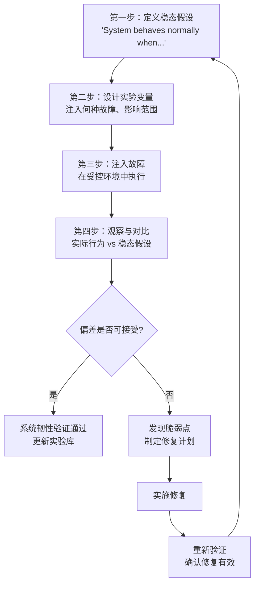
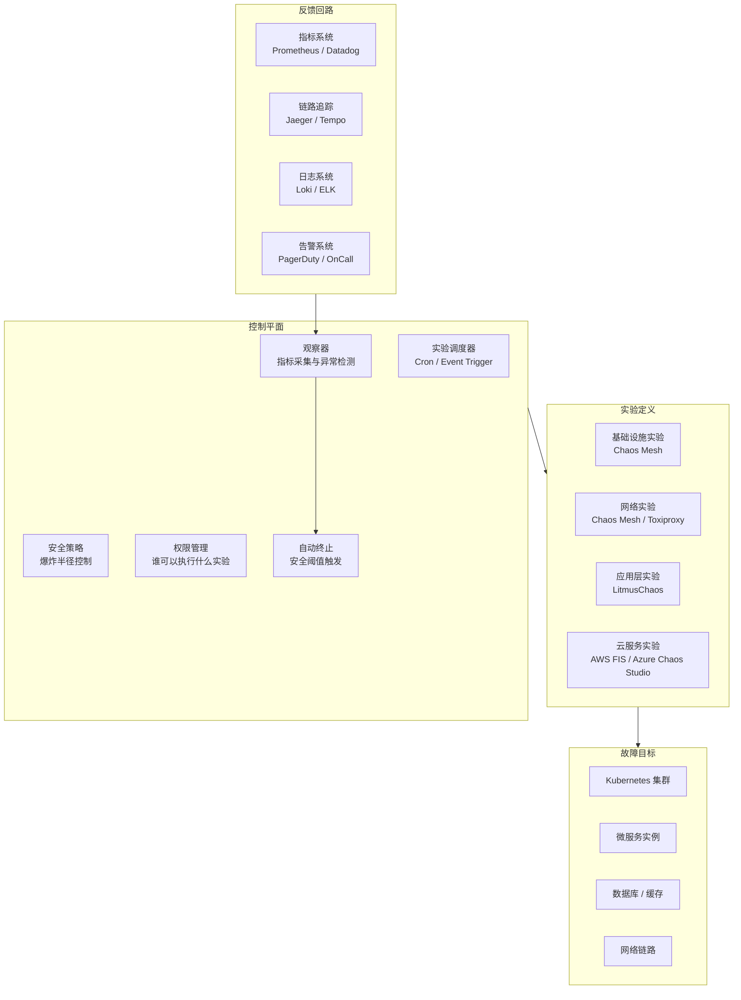

# 混沌工程与破坏性测试

## 背景与问题定义

分布式系统的复杂性增长已成为不可逆的趋势。微服务架构、容器编排、服务网格、多云部署——每一层抽象都在提升开发效率的同时，引入了新的故障模式。一个看似简单的请求，可能穿越数十个服务、数百个容器、多个可用区才完成处理。任何一个环节的异常，都可能导致端到端的不可用。

传统测试方法的局限在于：**它们验证的是系统在"正常"条件下的行为，而生产环境的故障往往是"非预期"的。** 单元测试无法覆盖网络分区，集成测试无法模拟整个可用区宕机，E2E 测试无法再现依赖服务超时引发的雪崩效应。

混沌工程（Chaos Engineering）正是为解决这一问题而生。它通过主动注入故障，验证系统在异常条件下的韧性，从而在真正的生产故障发生之前发现并修复脆弱点。

核心问题：**如何在受控条件下主动发现系统的脆弱点，而非等待生产事故暴露它们？**

## 核心概念

### 混沌工程的定义

Netflix 对混沌工程的定义被业界广泛采纳：

> 混沌工程是在分布式系统上进行实验的学科，旨在建立对系统抵御生产环境中 turbulent 条件能力的信心。

关键要素：
- **实验而非测试**：混沌工程不预设系统"应该"怎样，而是观察系统"实际"怎样
- **受控而非随机**：故障注入有明确假设、范围限制和终止条件
- **生产或类生产环境**：只有在真实环境中观察到的行为才有参考价值

### 混沌工程与破坏性测试的关系

| 维度 | 破坏性测试 | 混沌工程 |
|------|-----------|---------|
| 目标 | 验证系统在特定故障下是否正确处理 | 探索系统在非预期故障下的实际行为 |
| 方法 | 预设故障场景，断言行为 | 建立稳态假设，注入变量，观察偏差 |
| 范围 | 单一故障点 | 系统级复杂故障 |
| 结果 | Pass/Fail | 发现与学习 |
| 思维模式 | "我知道会出什么问题" | "我想知道会发生什么" |
| 成熟度 | 基础实践 | 进阶实践 |

破坏性测试是混沌工程的子集和前置步骤。组织应先掌握破坏性测试（验证已知故障模式），再进阶到混沌工程（探索未知故障模式）。

### 混沌实验的科学方法

混沌工程遵循科学实验的基本方法论：



### 混沌实验的分类

| 故障类型 | 典型实验 | 影响范围 |
|---------|---------|---------|
| 基础设施故障 | 节点宕机、磁盘故障、网络分区 | 计算层 |
| 网络故障 | 延迟注入、丢包、DNS 故障 | 通信层 |
| 应用层故障 | 进程 Kill、线程阻塞、内存泄漏 | 应用层 |
| 依赖故障 | 数据库不可用、下游服务超时 | 依赖层 |
| 资源耗尽 | CPU 满载、内存耗尽、连接池枯竭 | 资源层 |
| 安全故障 | 证书过期、凭证轮转失败 | 安全层 |

## 架构设计

### 混沌工程平台架构



### 安全策略设计

混沌工程的核心原则是**最小爆炸半径**：

| 策略 | 说明 | 示例 |
|------|------|------|
| 渐进式扩大 | 从小范围开始，逐步扩大影响范围 | 1% 流量 → 5% → 20% |
| 自动终止 | 当指标超出安全阈值时自动停止实验 | 错误率 > 5% 立即终止 |
| 时间窗口 | 限制实验执行时长 | 最长 30 分钟 |
| 维护窗口 | 仅在业务低峰期执行 | 凌晨 2:00-5:00 |
| 特征标记 | 使用 Feature Flag 控制实验生效范围 | 仅对内部用户生效 |
| 回滚预案 | 每个实验必须有明确的回滚方案 | 恢复网络配置、重启服务 |

## 实现方案

### 工具链选型

| 工具 | 类型 | 优势 | 适用场景 |
|------|------|------|---------|
| Chaos Mesh | 开源，Kubernetes 原生 | 丰富的故障类型、CRD 定义、Dashboard | K8s 环境首选 |
| LitmusChaos | 开源，CNCF 孵化 | ChaosHub 社区实验库、ChaosResult CRD | K8s 环境，社区生态 |
| Gremlin | 商业 | 企业级安全控制、多平台支持 | 企业级、需要支持合同 |
| AWS FIS | 云服务 | 原生集成 AWS、IAM 权限控制 | AWS 环境 |
| Toxiproxy | 开源，网络层 | 轻量级 TCP 代理、延迟/丢包注入 | 开发/测试环境网络故障模拟 |
| Pumba | 开源，容器级 | Docker 容器故障注入 | Docker 环境 |

### Chaos Mesh 实验示例

以下是一个使用 Chaos Mesh 注入 Pod 故障的完整实验定义：

```yaml
# 实验一：随机 Kill Pod，验证服务自愈能力
apiVersion: chaos-mesh.org/v1alpha1
kind: PodChaos
metadata:
  name: pod-kill-experiment
  namespace: chaos-testing
spec:
  action: pod-kill
  mode: one
  selector:
    namespaces:
      - production
    labelSelectors:
      app: orders-service
  scheduler:
    cron: "@every 300s"    # 每 5 分钟执行一次
  duration: "30s"
```

```yaml
# 实验二：网络延迟注入，验证服务降级策略
apiVersion: chaos-mesh.org/v1alpha1
kind: NetworkChaos
metadata:
  name: network-delay-experiment
  namespace: chaos-testing
spec:
  action: delay
  mode: all
  selector:
    namespaces:
      - production
    labelSelectors:
      app: orders-service
  delay:
    latency: "500ms"       # 注入 500ms 延迟
    correlation: "25"      # 25% 的相关性
    jitter: "100ms"        # ±100ms 抖动
  direction: to
  target:
    selector:
      namespaces:
        - production
      labelSelectors:
        app: payment-service
  duration: "5m"
```

```yaml
# 实验三：IO 故障注入，验证存储层容错
apiVersion: chaos-mesh.org/v1alpha1
kind: IOChaos
metadata:
  name: io-fault-experiment
  namespace: chaos-testing
spec:
  action: fault
  mode: one
  selector:
    namespaces:
      - production
    labelSelectors:
      app: orders-service
  volumePath: /data
  path: "/data/**"          # 影响所有数据文件操作
  errno: 5                  # I/O error
  percent: 50               # 50% 的 IO 操作失败
  duration: "2m"
```

### GitHub Actions 集成混沌实验

将混沌实验集成到 CI/CD 流水线中，实现持续的韧性验证：

```yaml
name: Chaos Engineering Validation

on:
  schedule:
    - cron: '0 2 * * *'    # 每天凌晨 2:00 执行
  workflow_dispatch:

jobs:
  chaos-experiment:
    runs-on: ubuntu-latest
    steps:
      - name: Checkout
        uses: actions/checkout@v4

      - name: Setup kubectl
        uses: azure/setup-kubectl@v3
        with:
          version: 'v1.29.0'

      - name: Connect to cluster
        run: |
          echo "${{ secrets.KUBE_CONFIG }}" | base64 -d > kubeconfig
          export KUBECONFIG=kubeconfig

      - name: Record baseline metrics
        id: baseline
        run: |
          # 记录实验前的关键指标基线
          ERROR_RATE=$(kubectl exec -n monitoring prometheus-0 -- \
            curl -s 'http://localhost:9090/api/v1/query?query=rate(http_requests_total{status=~"5.."}[5m])/rate(http_requests_total[5m])' | \
            jq -r '.data.result[0].value[1]')
          echo "error_rate=$ERROR_RATE" >> $GITHUB_OUTPUT
          echo "Baseline error rate: $ERROR_RATE"

      - name: Inject Pod Kill Chaos
        run: |
          kubectl apply -f chaos-experiments/pod-kill.yaml
          echo "Chaos experiment started, waiting for observation period..."
          sleep 120    # 观察 2 分钟

      - name: Observe system behavior
        id: observe
        run: |
          # 采集实验期间的关键指标
          PEAK_ERROR_RATE=$(kubectl exec -n monitoring prometheus-0 -- \
            curl -s 'http://localhost:9090/api/v1/query?query=rate(http_requests_total{status=~"5.."}[5m])/rate(http_requests_total[5m])' | \
            jq -r '.data.result[0].value[1]')
          echo "peak_error_rate=$PEAK_ERROR_RATE" >> $GITHUB_OUTPUT
          echo "Peak error rate during experiment: $PEAK_ERROR_RATE"

      - name: Cleanup experiment
        if: always()
        run: |
          kubectl delete -f chaos-experiments/pod-kill.yaml --ignore-not-found
          echo "Chaos experiment cleaned up"

      - name: Evaluate results
        run: |
          BASELINE=${{ steps.baseline.outputs.error_rate }}
          PEAK=${{ steps.observe.outputs.peak_error_rate }}
          THRESHOLD=0.05    # 5% 错误率阈值

          echo "Baseline: $BASELINE"
          echo "Peak during chaos: $PEAK"
          echo "Threshold: $THRESHOLD"

          if (( $(echo "$PEAK > $THRESHOLD" | bc -l) )); then
            echo "❌ RESILIENCE CHECK FAILED: Error rate exceeded threshold"
            echo "Action required: Investigate service degradation under Pod failure"
            exit 1
          else
            echo "✅ RESILIENCE CHECK PASSED: System maintained stability"
          fi
```

### 分步实施指南

**第一阶段：建立基础（Month 1-2）**

1. 在 Staging 环境部署 Chaos Mesh
2. 从最简单的实验开始（Kill 单个 Pod）
3. 验证自动恢复机制（Kubernetes 自愈、服务重试）
4. 记录实验结果和发现

**第二阶段：扩大范围（Month 3-4）**

1. 增加网络故障实验（延迟、丢包）
2. 增加依赖故障实验（数据库不可用、缓存失效）
3. 建立"混沌日历"——定期执行实验
4. 引入自动化指标对比

**第三阶段：进阶实践（Month 5-6）**

1. 在生产环境执行受控实验（Game Day）
2. 建立实验与 SLO 的关联
3. 引入自动化告警终止机制
4. 将混沌实验集成到 CI/CD

**第四阶段：文化嵌入（Ongoing）**

1. 混沌工程成为发布流程的标准环节
2. 每次重大架构变更都伴随韧性验证
3. 建立 Game Day 定期演练制度
4. 团队从"害怕故障"转向"主动发现故障"

## 最佳实践

### 业界推荐做法

1. **从最小爆炸半径开始**：先在 Staging 对非关键服务注入故障，验证安全机制后再扩大范围
2. **稳态假设先行**：在注入故障前，明确定义"系统正常"是什么样的——用可量化的指标描述
3. **自动化终止条件**：每个实验必须有自动终止机制，避免实验失控
4. **实验结果可复现**：实验定义以代码形式存储（CRD），可在不同环境中重复执行
5. **发现必须跟进**：混沌实验发现的脆弱点必须记录为 Issue 并排入修复计划，否则实验毫无意义

### Game Day 检查清单

Game Day 是组织级的混沌演练，以下是标准的检查清单：

```markdown
## Game Day 检查清单

### 准备阶段
- [ ] 确定演练目标和范围
- [ ] 获得管理层批准
- [ ] 通知所有相关团队（提前 48 小时）
- [ ] 确认监控和告警系统正常
- [ ] 准备回滚预案
- [ ] 指定演练指挥官（Commander）和观察员
- [ ] 建立沟通渠道（Slack 频道 / 电话会议）

### 执行阶段
- [ ] 记录基线指标
- [ ] 按计划注入故障
- [ ] 观察系统行为和团队响应
- [ ] 记录所有观察到的异常
- [ ] 如超出安全阈值，立即执行回滚

### 恢复阶段
- [ ] 停止所有故障注入
- [ ] 确认系统恢复至稳态
- [ ] 记录恢复时间和恢复步骤

### 复盘阶段
- [ ] 24 小时内完成复盘会议
- [ ] 记录发现的问题和脆弱点
- [ ] 制定改进计划并分配责任人
- [ ] 更新混沌实验库
- [ ] 分享学习成果
```

### 常见反模式与规避方法

| 反模式 | 表现 | 危害 | 规避方法 |
|--------|------|------|---------|
| 生产环境盲试 | 未经任何准备直接在生产环境做实验 | 可能导致真实业务影响 | 先 Staging 再 Production，渐进扩大 |
| 无终止条件 | 实验没有自动终止机制 | 故障可能失控 | 设置指标阈值自动终止 |
| 只做不复盘 | 做了大量实验但从不跟进修复 | 问题持续存在，实验无价值 | 每个发现必须有对应的 Issue |
| 一次性活动 | 混沌实验只做一次就停止 | 系统韧性会随架构变更退化 | 定期执行，集成到 CI/CD |
| 过于激进 | 一次性注入多个故障 | 无法定位问题根因 | 每次实验只改变一个变量 |

## 效果度量

### 混沌工程效能指标

| 指标 | 定义 | 采集方式 | 目标 |
|------|------|---------|------|
| 实验覆盖率 | 已验证的故障场景 / 总关键故障场景 | 实验库统计 | > 80% |
| 发现转化率 | 转化为修复的发现 / 总发现 | Issue 跟踪 | > 90% |
| 平均恢复时间（实验中） | 实验中系统恢复稳态的时间 | 监控系统 | 逐步缩短 |
| 实验导致的生产事故 | 因混沌实验导致的真实业务影响次数 | 事故系统 | 0 |
| Game Day 频率 | 单位时间内完成的 Game Day 次数 | 日历统计 | ≥ 1 次/季度 |

### 混沌工程成熟度模型

| 级别 | 特征 | 典型实践 |
|------|------|---------|
| L0 - 无意识 | 不做任何故障注入 | 依赖生产事故发现脆弱点 |
| L1 - 破坏性测试 | 验证已知故障模式的处理逻辑 | Kill Pod、手动断网测试 |
| L2 - 受控混沌 | 在 Staging 执行结构化混沌实验 | Chaos Mesh + 自动化实验 |
| L3 - 生产混沌 | 在生产环境执行受控实验 | Game Day + 自动终止 |
| L4 - 持续韧性 | 混沌工程嵌入 CI/CD 和发布流程 | 每次发布自动验证韧性 |

## 总结

### 核心要点

1. 混沌工程是主动发现系统脆弱点的科学方法，与传统测试互补而非替代
2. 核心方法论：稳态假设 → 注入变量 → 观察偏差 → 改进系统
3. 安全原则：最小爆炸半径、自动终止、渐进式扩大、回滚预案
4. 工具选择：Kubernetes 环境首选 Chaos Mesh，企业级可选 Gremlin
5. 文化建设：从"害怕故障"转向"主动发现故障"，Game Day 是关键的制度化实践

### 延伸阅读

- Casey Rosenthal, Nora Jones. *Chaos Engineering: System Resiliency in Practice*. O'Reilly, 2020
- Netflix. *Chaos Engineering Principles*. https://principlesofchaos.org/
- Chaos Mesh. *Official Documentation*. https://chaos-mesh.org/docs/
- LitmusChaos. *Official Documentation*. https://litmuschaos.github.io/litmus/
