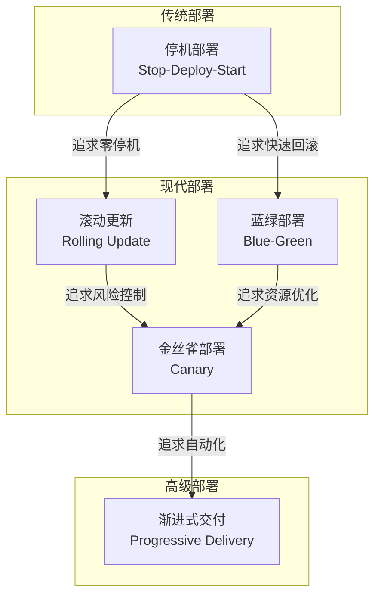
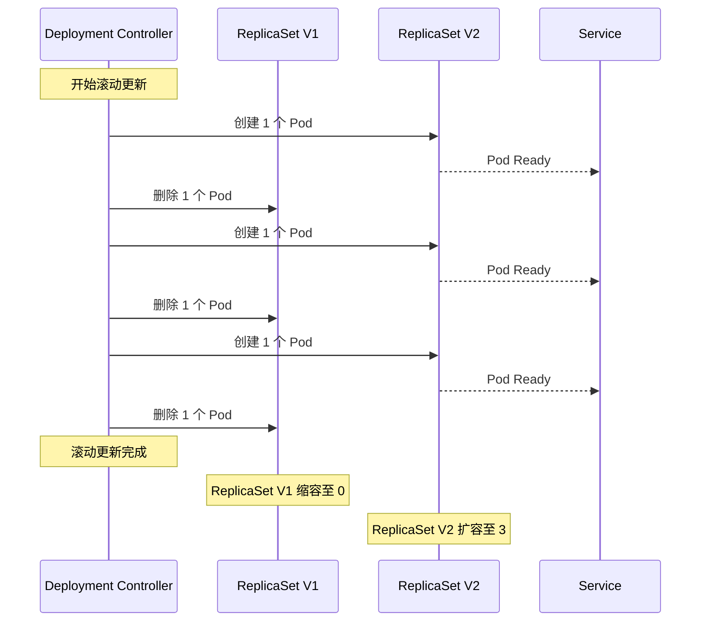
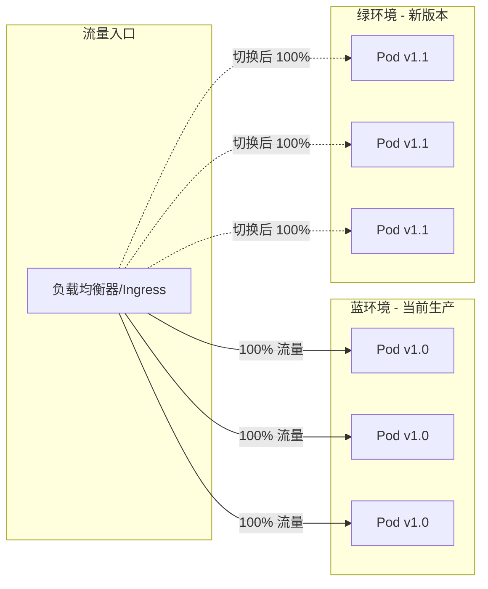
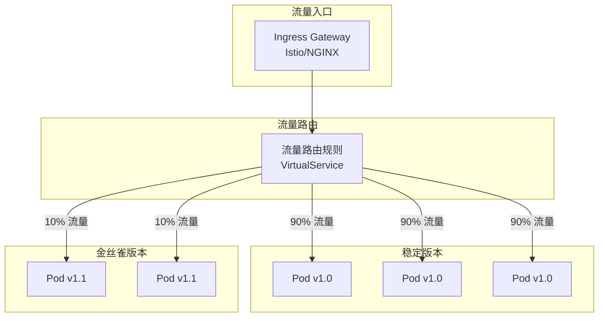
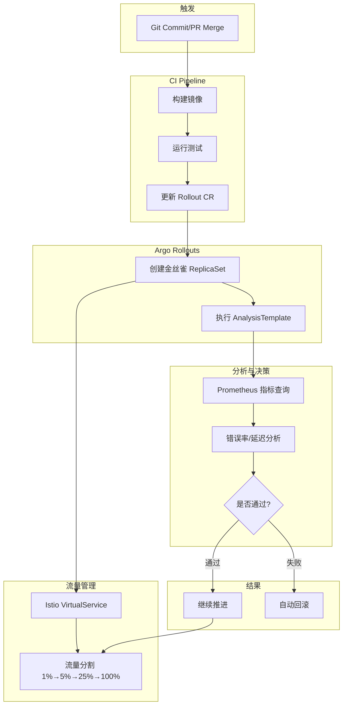

# 部署策略：蓝绿、金丝雀、渐进式交付

## 背景与问题定义

在软件交付的生命周期中，部署与发布是两个密切相关但本质不同的概念。理解这一区别是选择正确部署策略的前提。

**部署（Deployment）** 是一个技术动作，指将新版本的代码、配置或基础设施变更应用到生产环境的过程。部署关注的是"如何安全地将变更推送到目标环境"，属于工程实践的范畴。

**发布（Release）** 是一个业务决策，指将新功能或变更暴露给最终用户的过程。发布关注的是"何时、向谁、以何种方式展示新功能"，属于产品运营的范畴。

这种区分带来一个重要认知：部署可以频繁进行而不影响用户，发布则可以独立于部署而灵活控制。当部署与发布解耦后，团队获得了更大的灵活性——可以提前部署、分批发布、随时回滚。

### 为什么需要部署策略

传统的"大爆炸"式部署——直接停止旧版本、部署新版本、重启服务——存在严重问题：

1. **停机风险**：部署期间服务不可用，影响用户体验
2. **全量暴露**：所有用户同时面对新版本，问题影响面最大化
3. **回滚困难**：发现问题后需要重新部署旧版本，恢复时间长
4. **验证滞后**：生产环境问题只能在全量发布后发现

现代部署策略的目标是解决这些问题，实现：
- 零停机部署
- 渐进式暴露风险
- 快速回滚能力
- 生产环境验证

## 核心概念

### 部署策略分类

| 策略 | 描述 | 优点 | 缺点 | 适用场景 |
|------|------|------|------|----------|
| **滚动更新（Rolling Update）** | 逐步替换旧 Pod，新旧版本短暂共存 | 资源利用率高，无需额外环境 | 回滚较慢，新旧版本同时服务 | 资源受限环境，兼容性好的变更 |
| **蓝绿部署（Blue-Green）** | 维护两套完整环境，切换流量 | 零停机，秒级回滚 | 资源成本翻倍 | 关键服务，需要快速回滚能力 |
| **金丝雀部署（Canary）** | 先向小比例用户发布新版本 | 风险可控，真实用户验证 | 需要流量路由能力 | 风险较高的变更，需要生产验证 |
| **渐进式交付（Progressive Delivery）** | 结合金丝雀与自动化分析 | 自动化验证，智能决策 | 实现复杂度高 | 成熟团队，追求自动化运维 |

### 部署策略演进关系



## 架构设计

### 滚动更新架构

滚动更新是 Kubernetes Deployment 的默认策略。其核心思想是逐步替换 Pod，确保始终有足够数量的健康 Pod 提供服务。



关键参数配置：
- `maxSurge`：滚动过程中可以超出期望副本数的最大值（百分比或绝对数）
- `maxUnavailable`：滚动过程中不可用副本数的最大值
- `minReadySeconds`：Pod Ready 后等待多久才认为可用
- `progressDeadlineSeconds`：部署超时时间

### 蓝绿部署架构

蓝绿部署维护两套完全独立的环境（蓝环境和绿环境），通过流量切换实现零停机发布。



蓝绿部署的关键设计点：
1. **环境隔离**：蓝绿环境完全独立，避免相互影响
2. **数据同步**：数据库变更需要向前兼容，或使用双写策略
3. **快速切换**：通过 DNS、负载均衡器或 Service 切换实现秒级切换
4. **回滚机制**：切换回蓝环境即可回滚，蓝环境保留一段时间

### 金丝雀部署架构

金丝雀部署将新版本先暴露给小比例用户，验证无问题后逐步扩大范围。



金丝雀部署的关键设计点：
1. **流量分割**：精确控制流量比例（如 1%、5%、10%、25%、50%、100%）
2. **用户选择**：可基于用户 ID、Header、Cookie 等进行定向路由
3. **指标监控**：实时监控金丝雀版本的关键指标
4. **自动推进**：指标正常自动扩大流量，异常则自动回滚

### 渐进式交付架构

渐进式交付是金丝雀部署的进化版本，结合了自动化分析和智能决策。



## 实现方案

### Kubernetes 原生滚动更新

Kubernetes Deployment 提供了开箱即用的滚动更新能力。

```yaml
# deployment-rolling.yaml
apiVersion: apps/v1
kind: Deployment
metadata:
  name: webapp
  labels:
    app: webapp
spec:
  replicas: 3
  strategy:
    type: RollingUpdate
    rollingUpdate:
      maxSurge: 1          # 最多超出 1 个 Pod
      maxUnavailable: 0    # 不允许不可用 Pod
  selector:
    matchLabels:
      app: webapp
  template:
    metadata:
      labels:
        app: webapp
    spec:
      containers:
      - name: webapp
        image: webapp:v1.0
        ports:
        - containerPort: 8080
        readinessProbe:
          httpGet:
            path: /health
            port: 8080
          initialDelaySeconds: 5
          periodSeconds: 10
        livenessProbe:
          httpGet:
            path: /health
            port: 8080
          initialDelaySeconds: 15
          periodSeconds: 20
        resources:
          requests:
            cpu: 100m
            memory: 128Mi
          limits:
            cpu: 500m
            memory: 512Mi
```

部署和回滚命令：

```bash
# 部署新版本
kubectl set image deployment/webapp webapp=webapp:v1.1

# 查看部署状态
kubectl rollout status deployment/webapp

# 查看部署历史
kubectl rollout history deployment/webapp

# 回滚到上一版本
kubectl rollout undo deployment/webapp

# 回滚到指定版本
kubectl rollout undo deployment/webapp --to-revision=2
```

### Argo Rollouts 渐进式部署

Argo Rollouts 是 Kubernetes 上实现渐进式交付的核心工具，提供了比原生 Deployment 更强大的部署策略。

```yaml
# rollout-canary.yaml
apiVersion: argoproj.io/v1alpha1
kind: Rollout
metadata:
  name: webapp-rollout
spec:
  replicas: 5
  revisionHistoryLimit: 10
  selector:
    matchLabels:
      app: webapp
  template:
    metadata:
      labels:
        app: webapp
    spec:
      containers:
      - name: webapp
        image: webapp:v1.0
        ports:
        - containerPort: 8080
        readinessProbe:
          httpGet:
            path: /health
            port: 8080
          initialDelaySeconds: 5
          periodSeconds: 10

  # 金丝雀策略
  strategy:
    canary:
      # 金丝雀步骤
      steps:
      # 步骤 1: 1% 流量，暂停等待手动确认
      - setWeight: 1
      - pause:
          duration: 1m  # 自动继续，或使用 pause: {} 等待手动确认

      # 步骤 2: 5% 流量，运行分析
      - setWeight: 5
      - analysis:
          templates:
          - templateName: success-rate
          args:
          - name: service-name
            value: webapp-canary

      # 步骤 3: 25% 流量
      - setWeight: 25
      - pause:
          duration: 2m

      # 步骤 4: 50% 流量
      - setWeight: 50
      - analysis:
          templates:
          - templateName: success-rate

      # 步骤 5: 完全切换
      - setWeight: 100

      # 流量管理（配合 Istio）
      trafficRouting:
        istio:
          virtualService:
            name: webapp-vsvc
            routes:
            - primary

---
# AnalysisTemplate - 定义分析规则
apiVersion: argoproj.io/v1alpha1
kind: AnalysisTemplate
metadata:
  name: success-rate
spec:
  args:
  - name: service-name
  metrics:
  - name: success-rate
    interval: 60s
    count: 5
    successCondition: result[0] >= 0.99
    failureLimit: 3
    provider:
      prometheus:
        address: http://prometheus-server:9090
        query: |
          sum(rate(http_requests_total{service="{{args.service-name}}",status!~"5.."}[1m]))
          /
          sum(rate(http_requests_total{service="{{args.service-name}}"}[1m]))

  - name: latency-p99
    interval: 60s
    count: 5
    successCondition: result[0] <= 500
    failureLimit: 3
    provider:
      prometheus:
        address: http://prometheus-server:9090
        query: |
          histogram_quantile(0.99,
            sum(rate(http_request_duration_seconds_bucket{service="{{args.service-name}}"}[1m])) by (le)
          ) * 1000
```

### Istio VirtualService 金丝雀配置

配合 Argo Rollouts，Istio 提供了精细的流量路由能力。

```yaml
# virtualservice-canary.yaml
apiVersion: networking.istio.io/v1beta1
kind: VirtualService
metadata:
  name: webapp-vsvc
spec:
  hosts:
  - webapp.example.com
  gateways:
  - webapp-gateway
  http:
  - name: primary
    match:
    - uri:
        prefix: /
    route:
    - destination:
        host: webapp-stable
        port:
          number: 8080
      weight: 100
    - destination:
        host: webapp-canary
        port:
          number: 8080
      weight: 0
    # 故障注入测试（可选）
    fault:
      abort:
        percentage:
          value: 0
        httpStatus: 500

---
# 基于用户特征的金丝雀路由
apiVersion: networking.istio.io/v1beta1
kind: VirtualService
metadata:
  name: webapp-feature-based
spec:
  hosts:
  - webapp.example.com
  http:
  # 内部用户路由到金丝雀版本
  - name: internal-users
    match:
    - headers:
        x-user-type:
          exact: internal
    route:
    - destination:
        host: webapp-canary
        port:
          number: 8080

  # 特定用户 ID 路由到金丝雀版本
  - name: canary-users
    match:
    - headers:
        x-user-id:
          regex: "^(user-001|user-002|user-003)$"
    route:
    - destination:
        host: webapp-canary
        port:
          number: 8080

  # 其他用户路由到稳定版本
  - name: stable
    route:
    - destination:
        host: webapp-stable
        port:
          number: 8080
```

### 蓝绿部署实现

使用 Argo Rollouts 实现蓝绿部署。

```yaml
# rollout-bluegreen.yaml
apiVersion: argoproj.io/v1alpha1
kind: Rollout
metadata:
  name: webapp-bluegreen
spec:
  replicas: 3
  revisionHistoryLimit: 2
  selector:
    matchLabels:
      app: webapp
  template:
    metadata:
      labels:
        app: webapp
    spec:
      containers:
      - name: webapp
        image: webapp:v1.0
        ports:
        - containerPort: 8080
        readinessProbe:
          httpGet:
            path: /health
            port: 8080
          initialDelaySeconds: 5
          periodSeconds: 10

  strategy:
    blueGreen:
      # 活跃 Service（指向当前生产版本）
      activeService: webapp-active
      # 预览 Service（指向新版本，用于预览/测试）
      previewService: webapp-preview
      # 自动切换前的等待时间
      autoPromotionEnabled: true
      autoPromotionSeconds: 30
      # 缩容旧版本前的等待时间
      scaleDownDelaySeconds: 60
      # 延迟缩容期间保留的旧版本 ReplicaSet 数量
      scaleDownDelayRevisionLimit: 1

---
# Active Service
apiVersion: v1
kind: Service
metadata:
  name: webapp-active
spec:
  selector:
    app: webapp
  ports:
  - port: 80
    targetPort: 8080

---
# Preview Service
apiVersion: v1
kind: Service
metadata:
  name: webapp-preview
spec:
  selector:
    app: webapp
  ports:
  - port: 80
    targetPort: 8080
```

## 最佳实践

### 策略选择指南

选择部署策略时，需要综合考虑以下因素：

| 因素 | 滚动更新 | 蓝绿部署 | 金丝雀部署 | 渐进式交付 |
|------|----------|----------|------------|------------|
| **资源成本** | 低 | 高（2倍） | 中 | 中 |
| **回滚速度** | 分钟级 | 秒级 | 分钟级 | 分钟级 |
| **风险控制** | 弱 | 强 | 强 | 最强 |
| **实现复杂度** | 低 | 中 | 高 | 高 |
| **团队成熟度要求** | 初级 | 中级 | 高级 | 高级 |
| **适用变更类型** | 小型、低风险 | 关键服务 | 中大型变更 | 所有变更 |

**选择建议**：

1. **初创团队/小型服务**：从滚动更新开始，逐步引入金丝雀
2. **关键服务/金融系统**：蓝绿部署确保快速回滚能力
3. **大规模微服务**：渐进式交付实现自动化验证
4. **高风险变更**：金丝雀 + Feature Flag 双重保险

### 健康检查配置

健康检查是所有部署策略的基础，配置不当会导致故障扩散。

```yaml
# 最佳实践的健康检查配置
readinessProbe:
  httpGet:
    path: /health/ready  # 专门的就绪检查端点
    port: 8080
  initialDelaySeconds: 10  # 应用启动时间
  periodSeconds: 5         # 检查频率
  timeoutSeconds: 3        # 超时时间
  successThreshold: 1      # 成功次数阈值
  failureThreshold: 3      # 失败次数阈值

livenessProbe:
  httpGet:
    path: /health/live     # 存活检查端点
    port: 8080
  initialDelaySeconds: 30  # 给应用足够的启动时间
  periodSeconds: 10
  timeoutSeconds: 5
  failureThreshold: 3

startupProbe:
  httpGet:
    path: /health/startup  # 启动检查（慢启动应用）
    port: 8080
  initialDelaySeconds: 5
  periodSeconds: 10
  timeoutSeconds: 5
  failureThreshold: 30     # 允许最多 5 分钟启动
```

健康检查端点设计原则：

```go
// 健康检查端点最佳实践
package main

import (
    "net/http"
    "sync"
)

type HealthChecker struct {
    dbHealthy    bool
    cacheHealthy bool
    mu           sync.RWMutex
}

// /health/live - 存活检查，只检查进程是否存活
func (h *HealthChecker) Liveness(w http.ResponseWriter, r *http.Request) {
    w.WriteHeader(http.StatusOK)
    w.Write([]byte("OK"))
}

// /health/ready - 就绪检查，检查是否可以接收流量
func (h *HealthChecker) Readiness(w http.ResponseWriter, r *http.Request) {
    h.mu.RLock()
    defer h.mu.RUnlock()

    if !h.dbHealthy || !h.cacheHealthy {
        w.WriteHeader(http.StatusServiceUnavailable)
        w.Write([]byte("Not Ready"))
        return
    }

    w.WriteHeader(http.StatusOK)
    w.Write([]byte("Ready"))
}

// /health/startup - 启动检查，检查应用是否完成初始化
func (h *HealthChecker) Startup(w http.ResponseWriter, r *http.Request) {
    // 检查所有依赖是否初始化完成
    if !appInitialized {
        w.WriteHeader(http.StatusServiceUnavailable)
        return
    }
    w.WriteHeader(http.StatusOK)
}
```

### 数据库变更策略

部署策略的成功实施离不开数据库变更的配合。

**原则**：数据库变更必须向前兼容，确保新旧版本可以同时运行。

```sql
-- 错误示例：不兼容的变更
-- 直接删除列会导致旧版本报错
ALTER TABLE users DROP COLUMN old_field;

-- 正确示例：向前兼容的变更流程

-- 阶段 1: 添加新列（新旧版本兼容）
ALTER TABLE users ADD COLUMN new_field VARCHAR(255);

-- 阶段 2: 部署新版本代码（双写新旧字段）
-- 新版本同时写入 old_field 和 new_field

-- 阶段 3: 数据迁移
UPDATE users SET new_field = old_field WHERE new_field IS NULL;

-- 阶段 4: 验证数据一致性
-- 运行数据校验脚本

-- 阶段 5: 部署只使用新字段的版本

-- 阶段 6: 删除旧列（所有版本都已更新后）
ALTER TABLE users DROP COLUMN old_field;
```

### 自动化回滚配置

基于指标的自动回滚是渐进式交付的核心能力。

```yaml
# 自动回滚配置
apiVersion: argoproj.io/v1alpha1
kind: AnalysisTemplate
metadata:
  name: auto-rollback
spec:
  metrics:
  # 错误率检查
  - name: error-rate
    interval: 30s
    count: 10
    successCondition: result[0] < 0.01  # 错误率 < 1%
    failureLimit: 2
    provider:
      prometheus:
        address: http://prometheus-server:9090
        query: |
          sum(rate(http_requests_total{service="{{args.service-name}}",status=~"5.."}[2m]))
          /
          sum(rate(http_requests_total{service="{{args.service-name}}"}[2m]))

  # P99 延迟检查
  - name: latency-p99
    interval: 30s
    count: 10
    successCondition: result[0] < 1000  # P99 < 1000ms
    failureLimit: 2
    provider:
      prometheus:
        address: http://prometheus-server:9090
        query: |
          histogram_quantile(0.99,
            sum(rate(http_request_duration_seconds_bucket{service="{{args.service-name}}"}[2m])) by (le)
          ) * 1000

  # Pod 重启次数检查
  - name: pod-restarts
    interval: 60s
    count: 5
    successCondition: result[0] < 3  # 重启次数 < 3
    provider:
      prometheus:
        address: http://prometheus-server:9090
        query: |
          sum(kube_pod_container_status_restarts_total{pod=~"{{args.service-name}}-.*"})
```

## 效果度量

### 部署效率指标

| 指标 | 定义 | 目标值 | 测量方法 |
|------|------|--------|----------|
| **部署频率** | 单位时间内的部署次数 | 每天多次 | CI/CD Pipeline 统计 |
| **部署时长** | 从触发到完成的平均时间 | < 10 分钟 | Pipeline 耗时统计 |
| **部署成功率** | 成功部署占总部署的比例 | > 99% | Pipeline 结果统计 |
| **变更交付时间** | 从代码提交到生产发布的时间 | < 1 小时 | Git 提交时间到部署时间 |
| **平均恢复时间（MTTR）** | 从故障发生到恢复的时间 | < 5 分钟 | 监控系统告警时间差 |

### 风险控制指标

| 指标 | 定义 | 目标值 | 测量方法 |
|------|------|--------|----------|
| **变更失败率** | 导致故障的变更比例 | < 5% | 故障复盘统计 |
| **金丝雀检测率** | 金丝雀阶段发现问题的比例 | > 90% | 金丝雀回滚统计 |
| **回滚成功率** | 回滚操作成功的比例 | 100% | 回滚操作统计 |
| **用户影响面** | 单次故障影响的用户比例 | < 1% | 监控系统统计 |

### 监控仪表板配置

```yaml
# Grafana Dashboard 配置示例
apiVersion: v1
kind: ConfigMap
metadata:
  name: deployment-dashboard
data:
  dashboard.json: |
    {
      "dashboard": {
        "title": "Deployment Metrics",
        "panels": [
          {
            "title": "Deployment Frequency",
            "type": "graph",
            "targets": [
              {
                "expr": "sum(increase(argo_rollout_deployments_total[1d]))",
                "legendFormat": "Deployments/day"
              }
            ]
          },
          {
            "title": "Canary Success Rate",
            "type": "gauge",
            "targets": [
              {
                "expr": "sum(argo_rollout_canary_success_total) / sum(argo_rollout_canary_total) * 100",
                "legendFormat": "Success %"
              }
            ]
          },
          {
            "title": "Rollback Events",
            "type": "graph",
            "targets": [
              {
                "expr": "sum(increase(argo_rollout_rollbacks_total[1h]))",
                "legendFormat": "Rollbacks/hour"
              }
            ]
          },
          {
            "title": "Deployment Duration",
            "type": "heatmap",
            "targets": [
              {
                "expr": "histogram_quantile(0.95, sum(rate(argo_rollout_duration_seconds_bucket[1h])) by (le))",
                "legendFormat": "P95 Duration"
              }
            ]
          }
        ]
      }
    }
```

## 总结

部署策略的选择和实施是持续交付能力的核心体现。从滚动更新到蓝绿部署，从金丝雀到渐进式交付，每种策略都有其适用场景和权衡。

**核心认知**：

1. **部署 ≠ 发布**：理解这一区别是选择正确策略的前提
2. **没有银弹**：根据团队成熟度、服务重要性、变更风险选择策略
3. **健康检查是基础**：所有策略都依赖可靠的健康检查
4. **数据库变更是关键**：向前兼容的数据库变更策略是成功部署的保障
5. **自动化是目标**：从手动操作到自动化分析，持续提升部署能力

**实施路径**：

```
滚动更新 → 蓝绿部署 → 金丝雀部署 → 渐进式交付
   ↓           ↓           ↓              ↓
 零停机     快速回滚    风险控制      自动化验证
```

**下一步行动**：

1. 评估当前团队部署策略成熟度
2. 选择适合的部署策略并制定实施计划
3. 完善健康检查和监控体系
4. 引入 Argo Rollouts 等工具实现渐进式交付
5. 建立部署效率度量体系，持续改进

在下一篇文章中，我们将深入探讨 Feature Flag（功能开关）实践，学习如何通过功能开关实现部署与发布的完全解耦。
