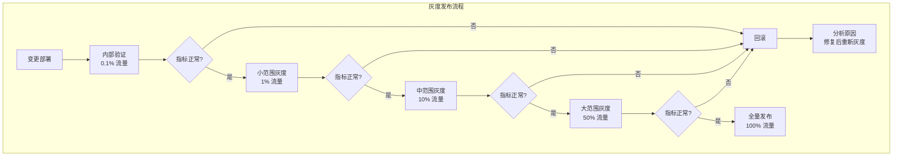
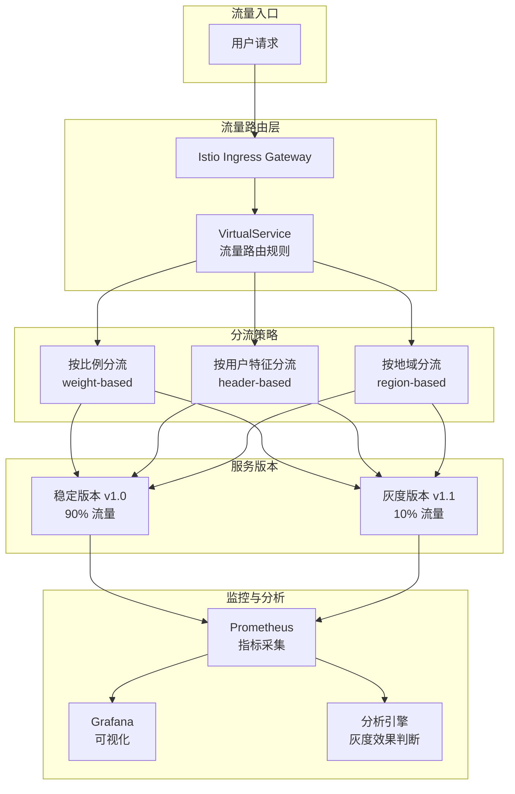
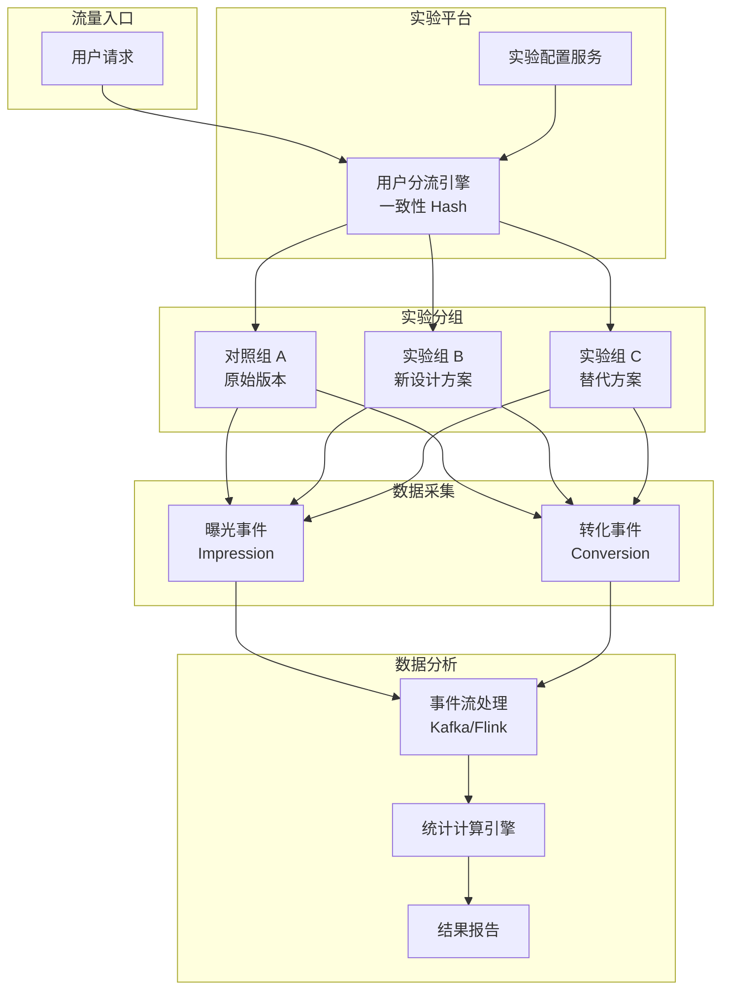

# 灰度发布与A/B测试

## 背景与问题定义

软件发布面临一个根本矛盾：团队需要快速迭代以响应市场需求，但每次变更都伴随着潜在风险。全量发布意味着所有用户同时面对变更带来的不确定性——如果出现问题，影响面最大化。

灰度发布和 A/B 测试是解决这一矛盾的两种重要手段，它们都通过渐进式暴露来降低风险，但关注点有本质区别：

- **灰度发布关注风险控制**：通过逐步扩大发布范围，在问题影响少量用户时及时发现和回滚
- **A/B 测试关注效果验证**：通过统计方法验证变更是否真正带来预期的业务效果

理解这一区别是正确应用这两种技术的前提。

### 灰度发布与 A/B 测试的区别

| 维度 | 灰度发布 | A/B 测试 |
|------|----------|----------|
| **核心目标** | 风险控制，确保变更安全 | 效果验证，确保变更有效 |
| **决策依据** | 技术指标（错误率、延迟） | 业务指标（转化率、留存率） |
| **用户分配** | 按比例随机或按特征定向 | 随机均匀分配到对照组和实验组 |
| **样本量要求** | 无严格要求，以发现问题为目的 | 需要足够的样本量保证统计显著性 |
| **终止条件** | 指标正常则全量，异常则回滚 | 达到统计显著性后做出决策 |
| **持续时间** | 短（小时到天） | 较长（天到周，取决于流量和效应量） |
| **结果判断** | 无异常即通过 | 需要统计检验确认效果 |

## 核心概念

### 灰度发布的本质

灰度发布的本质是通过渐进式暴露来验证变更的安全性。其核心思想是：让少量用户先接触新版本，如果出现问题，影响范围可控；如果一切正常，逐步扩大范围直到全量发布。



### 灰度维度

灰度发布可以通过多个维度进行用户分流：

| 维度 | 描述 | 适用场景 | 实现复杂度 |
|------|------|----------|------------|
| **用户比例** | 按流量百分比随机分配 | 通用场景 | 低 |
| **用户特征** | 按用户属性（VIP、注册时间等） | 需要定向验证 | 中 |
| **地域** | 按地理位置（城市、国家） | 本地化功能验证 | 中 |
| **设备类型** | 按设备（iOS、Android、Web） | 跨平台功能验证 | 中 |
| **用户 ID Hash** | 按用户 ID 取模分配 | 需要稳定分配 | 低 |
| **请求 Header** | 按 HTTP Header 路由 | 内部测试、灰度环境 | 低 |

### A/B 测试统计基础

A/B 测试的核心是统计假设检验。理解以下概念是正确实施 A/B 测试的基础：

**原假设（H0）**：新版本与旧版本没有差异
**备择假设（H1）**：新版本与旧版本有差异

**统计显著性（p-value）**：在原假设为真的情况下，观察到当前差异（或更大差异）的概率。通常要求 p < 0.05，即有 95% 的置信度认为差异是真实的。

**统计功效（Power）**：在备择假设为真的情况下，正确拒绝原假设的概率。通常要求 Power > 0.8。

**最小可检测效应（MDE）**：希望检测到的最小差异。MDE 越小，所需样本量越大。

**置信区间**：真实效应量所在的范围，提供比 p-value 更丰富的信息。

## 架构设计

### 灰度发布架构



### A/B 测试架构



## 实现方案

### Istio 流量路由灰度发布

Istio 提供了强大的流量路由能力，是实现灰度发布的核心基础设施。

**基于比例的灰度发布**：

```yaml
# canary-weight-based.yaml
apiVersion: networking.istio.io/v1beta1
kind: VirtualService
metadata:
  name: webapp-canary
spec:
  hosts:
  - webapp.example.com
  gateways:
  - webapp-gateway
  http:
  - route:
    - destination:
        host: webapp-stable
        port:
          number: 8080
      weight: 90
    - destination:
        host: webapp-canary
        port:
          number: 8080
      weight: 10
    retries:
      attempts: 3
      perTryTimeout: 2s
```

**基于用户特征的灰度发布**：

```yaml
# canary-header-based.yaml
apiVersion: networking.istio.io/v1beta1
kind: VirtualService
metadata:
  name: webapp-feature-canary
spec:
  hosts:
  - webapp.example.com
  http:
  # 规则 1: 内部员工路由到灰度版本
  - match:
    - headers:
        x-user-type:
          exact: "internal"
    route:
    - destination:
        host: webapp-canary
        port:
          number: 8080

  # 规则 2: Beta 用户路由到灰度版本
  - match:
    - headers:
        x-user-tier:
          exact: "beta"
    route:
    - destination:
        host: webapp-canary
        port:
          number: 8080

  # 规则 3: 特定地域路由到灰度版本
  - match:
    - headers:
        x-region:
          regex: "^(us-west|ap-east)$"
    route:
    - destination:
        host: webapp-canary
        port:
          number: 8080

  # 规则 4: 基于用户 ID 取模的灰度
  - match:
    - headers:
        x-user-id:
          regex: "^[0-9]*[0-3]$"  # 用户 ID 尾数 0-3（约 10%）
    route:
    - destination:
        host: webapp-canary
        port:
          number: 8080

  # 默认路由到稳定版本
  - route:
    - destination:
        host: webapp-stable
        port:
          number: 8080
```

**配合 DestinationRule 定义版本 Subset**：

```yaml
# destination-rule.yaml
apiVersion: networking.istio.io/v1beta1
kind: DestinationRule
metadata:
  name: webapp-dest
spec:
  host: webapp
  trafficPolicy:
    connectionPool:
      tcp:
        maxConnections: 100
      http:
        h2UpgradePolicy: DEFAULT
        http1MaxPendingRequests: 100
        http2MaxRequests: 100
    outlierDetection:
      consecutive5xxErrors: 5
      interval: 30s
      baseEjectionTime: 30s
      maxEjectionPercent: 50
  subsets:
  - name: stable
    labels:
      version: v1
    trafficPolicy:
      connectionPool:
        http:
          http1MaxPendingRequests: 200
  - name: canary
    labels:
      version: v2
    trafficPolicy:
      connectionPool:
        http:
          http1MaxPendingRequests: 50  # 灰度版本限制并发
```

### Argo Rollouts + Istio 灰度发布

Argo Rollouts 配合 Istio 实现自动化灰度发布。

```yaml
# rollout-canary-istio.yaml
apiVersion: argoproj.io/v1alpha1
kind: Rollout
metadata:
  name: webapp
spec:
  replicas: 10
  selector:
    matchLabels:
      app: webapp
  template:
    metadata:
      labels:
        app: webapp
    spec:
      containers:
      - name: webapp
        image: webapp:v2.0
        ports:
        - containerPort: 8080
        readinessProbe:
          httpGet:
            path: /health
            port: 8080
          initialDelaySeconds: 5
          periodSeconds: 10

  strategy:
    canary:
      steps:
      - setWeight: 5
      - pause: {duration: 5m}
      - setWeight: 10
      - pause: {duration: 5m}
      - analysis:
          templates:
          - templateName: canary-metrics-check
          args:
          - name: service-name
            value: webapp-canary
      - setWeight: 30
      - pause: {duration: 10m}
      - analysis:
          templates:
          - templateName: canary-metrics-check
      - setWeight: 50
      - pause: {duration: 10m}
      - setWeight: 100

      # Istio 流量管理
      trafficRouting:
        istio:
          virtualService:
            name: webapp-vsvc
            routes:
            - primary
          destinationRule:
            name: webapp-destrule
            canarySubsetName: canary
            stableSubsetName: stable

---
# AnalysisTemplate
apiVersion: argoproj.io/v1alpha1
kind: AnalysisTemplate
metadata:
  name: canary-metrics-check
spec:
  args:
  - name: service-name
  metrics:
  - name: error-rate
    interval: 60s
    count: 5
    successCondition: result[0] < 0.01
    failureLimit: 2
    provider:
      prometheus:
        address: http://prometheus-server:9090
        query: |
          sum(rate(http_requests_total{service="{{args.service-name}}",status=~"5.."}[2m]))
          /
          sum(rate(http_requests_total{service="{{args.service-name}}"}[2m]))

  - name: latency-p99
    interval: 60s
    count: 5
    successCondition: result[0] < 500
    failureLimit: 2
    provider:
      prometheus:
        address: http://prometheus-server:9090
        query: |
          histogram_quantile(0.99,
            sum(rate(http_request_duration_seconds_bucket{service="{{args.service-name}}"}[2m])) by (le)
          ) * 1000
```

### Feature Flag 灰度发布

通过 Feature Flag 实现灰度发布，无需服务网格基础设施。

```go
// Feature Flag 灰度发布实现
package main

import (
    "hash/fnv"
    "log"
    "net/http"
)

type CanaryRule struct {
    FlagName     string
    Percentage   int     // 0-100
    UserSegments []string // 允许的用户段
    Regions      []string // 允许的地域
}

type CanaryManager struct {
    rules  map[string]CanaryRule
    client FeatureFlagClient
}

// 一致性 Hash 分流：同一用户始终分配到同一版本
func (cm *CanaryManager) getVariant(userID string, rule CanaryRule) string {
    // 检查用户段
    if len(rule.UserSegments) > 0 {
        userSegment := getUserSegment(userID)
        for _, seg := range rule.UserSegments {
            if seg == userSegment {
                return "canary"
            }
        }
    }

    // 检查地域
    if len(rule.Regions) > 0 {
        userRegion := getUserRegion(userID)
        for _, reg := range rule.Regions {
            if reg == userRegion {
                return "canary"
            }
        }
    }

    // 按比例分流（一致性 Hash）
    h := fnv.New32a()
    h.Write([]byte(userID + ":" + rule.FlagName))
    hashValue := h.Sum32() % 100

    if hashValue < uint32(rule.Percentage) {
        return "canary"
    }
    return "stable"
}

// 灰度发布处理器
func (cm *CanaryManager) ServeHTTP(w http.ResponseWriter, r *http.Request) {
    userID := r.Header.Get("X-User-ID")
    flagName := r.URL.Query().Get("feature")

    rule, exists := cm.rules[flagName]
    if !exists {
        // Flag 不存在，使用稳定版本
        serveStable(w, r)
        return
    }

    variant := cm.getVariant(userID, rule)

    // 记录灰度事件
    log.Printf("canary: user=%s feature=%s variant=%s", userID, flagName, variant)

    switch variant {
    case "canary":
        serveCanary(w, r)
    default:
        serveStable(w, r)
    }
}
```

### A/B 测试数据分析

A/B 测试的数据分析是整个流程中最关键的环节。以下是一个完整的 A/B 测试分析实现。

```python
#!/usr/bin/env python3
"""
A/B 测试数据分析工具
支持: 统计显著性检验、样本量计算、置信区间估计
"""

import math
from dataclasses import dataclass
from typing import Tuple, Optional

from scipy import stats
import numpy as np


@dataclass
class ABTestResult:
    """A/B 测试结果"""
    control_conversions: int
    control_total: int
    treatment_conversions: int
    treatment_total: int
    control_rate: float
    treatment_rate: float
    lift: float
    p_value: float
    confidence_interval: Tuple[float, float]
    is_significant: bool
    power: float
    min_sample_size: int


def calculate_min_sample_size(
    baseline_rate: float,
    mde: float,
    alpha: float = 0.05,
    power: float = 0.8,
) -> int:
    """
    计算最小样本量

    Args:
        baseline_rate: 基线转化率
        mde: 最小可检测效应（相对变化量）
        alpha: 显著性水平
        power: 统计功效

    Returns:
        每组需要的最小样本量
    """
    p1 = baseline_rate
    p2 = baseline_rate * (1 + mde)

    # Z 值
    z_alpha = stats.norm.ppf(1 - alpha / 2)
    z_beta = stats.norm.ppf(power)

    # 样本量公式（双比例检验）
    p_avg = (p1 + p2) / 2
    n = ((z_alpha * math.sqrt(2 * p_avg * (1 - p_avg)) +
          z_beta * math.sqrt(p1 * (1 - p1) + p2 * (1 - p2))) ** 2) / \
        (p2 - p1) ** 2

    return math.ceil(n)


def analyze_ab_test(
    control_conversions: int,
    control_total: int,
    treatment_conversions: int,
    treatment_total: int,
    alpha: float = 0.05,
) -> ABTestResult:
    """
    分析 A/B 测试结果

    Args:
        control_conversions: 对照组转化数
        control_total: 对照组总人数
        treatment_conversions: 实验组转化数
        treatment_total: 实验组总人数
        alpha: 显著性水平

    Returns:
        ABTestResult 包含完整分析结果
    """
    # 转化率
    control_rate = control_conversions / control_total
    treatment_rate = treatment_conversions / treatment_total

    # 提升幅度
    lift = (treatment_rate - control_rate) / control_rate

    # Z 检验（双比例检验）
    p_pool = (control_conversions + treatment_conversions) / \
             (control_total + treatment_total)
    se = math.sqrt(p_pool * (1 - p_pool) * (1/control_total + 1/treatment_total))
    z_score = (treatment_rate - control_rate) / se
    p_value = 2 * (1 - stats.norm.cdf(abs(z_score)))

    # 置信区间（差异的置信区间）
    se_diff = math.sqrt(
        control_rate * (1 - control_rate) / control_total +
        treatment_rate * (1 - treatment_rate) / treatment_total
    )
    diff = treatment_rate - control_rate
    z_crit = stats.norm.ppf(1 - alpha / 2)
    ci_lower = diff - z_crit * se_diff
    ci_upper = diff + z_crit * se_diff

    # 统计功效（事后）
    p1, p2 = control_rate, treatment_rate
    z_alpha = stats.norm.ppf(1 - alpha / 2)
    h = 2 * math.asin(math.sqrt(p2)) - 2 * math.asin(math.sqrt(p1))
    n_per_group = min(control_total, treatment_total)
    power = stats.norm.cdf(math.sqrt(n_per_group) * abs(h) - z_alpha)

    # 最小样本量
    min_sample = calculate_min_sample_size(control_rate, abs(lift), alpha, 0.8)

    return ABTestResult(
        control_conversions=control_conversions,
        control_total=control_total,
        treatment_conversions=treatment_conversions,
        treatment_total=treatment_total,
        control_rate=control_rate,
        treatment_rate=treatment_rate,
        lift=lift,
        p_value=p_value,
        confidence_interval=(ci_lower, ci_upper),
        is_significant=p_value < alpha,
        power=power,
        min_sample_size=min_sample,
    )


def sequential_testing_check(
    daily_results: list,
    alpha: float = 0.05,
    num_peeks: int = 10,
) -> dict:
    """
    序贯检验（Sequential Testing）
    解决多次查看数据导致的 p-value 膨胀问题

    使用 Pocock 边界法调整显著性水平

    Args:
        daily_results: 每日数据列表 [(control_conv, control_total, treat_conv, treat_total)]
        alpha: 总体显著性水平
        num_peeks: 预期查看次数

    Returns:
        检验结果
    """
    # Pocock 边界调整
    alpha_spending = alpha / num_peeks * 2  # 简化的 Pocock 调整

    cumulative_control_conv = 0
    cumulative_control_total = 0
    cumulative_treat_conv = 0
    cumulative_treat_total = 0

    for day_idx, (cc, ct, tc, tt) in enumerate(daily_results):
        cumulative_control_conv += cc
        cumulative_control_total += ct
        cumulative_treat_conv += tc
        cumulative_treat_total += tt

        # 最小样本量检查
        if cumulative_control_total < 100 or cumulative_treat_total < 100:
            continue

        result = analyze_ab_test(
            cumulative_control_conv,
            cumulative_control_total,
            cumulative_treat_conv,
            cumulative_treat_total,
            alpha=alpha_spending,
        )

        if result.is_significant:
            return {
                "stop": True,
                "day": day_idx + 1,
                "reason": f"统计显著 (adjusted p={result.p_value:.4f} < {alpha_spending:.4f})",
                "result": result,
            }

    return {
        "stop": False,
        "day": len(daily_results),
        "reason": "未达到统计显著性，继续实验",
        "result": None,
    }


# 使用示例
if __name__ == "__main__":
    # 示例 1: 计算 A/B 测试所需样本量
    baseline = 0.05  # 基线转化率 5%
    mde = 0.20       # 希望检测 20% 的相对提升
    sample_size = calculate_min_sample_size(baseline, mde)
    print(f"基线转化率: {baseline*100}%")
    print(f"最小可检测效应: {mde*100}% 相对提升")
    print(f"每组最小样本量: {sample_size}")
    print()

    # 示例 2: 分析 A/B 测试结果
    result = analyze_ab_test(
        control_conversions=250,
        control_total=5000,
        treatment_conversions=310,
        treatment_total=5000,
    )
    print("A/B 测试分析结果:")
    print(f"  对照组转化率: {result.control_rate*100:.2f}%")
    print(f"  实验组转化率: {result.treatment_rate*100:.2f}%")
    print(f"  提升幅度: {result.lift*100:.2f}%")
    print(f"  P-value: {result.p_value:.4f}")
    print(f"  置信区间: ({result.confidence_interval[0]*100:.2f}%, {result.confidence_interval[1]*100:.2f}%)")
    print(f"  统计显著: {result.is_significant}")
    print(f"  统计功效: {result.power*100:.1f}%")
    print(f"  最小样本量: {result.min_sample_size}")
    print()

    # 示例 3: 序贯检验
    daily_data = [
        (50, 1000, 55, 1000),   # Day 1
        (100, 2000, 120, 2000),  # Day 2
        (150, 3000, 180, 3000),  # Day 3
        (200, 4000, 245, 4000),  # Day 4
        (250, 5000, 310, 5000),  # Day 5
    ]
    seq_result = sequential_testing_check(daily_data)
    print(f"序贯检验结果: stop={seq_result['stop']}, day={seq_result['day']}")
    if seq_result['result']:
        print(f"  原因: {seq_result['reason']}")
```

## 最佳实践

### 灰度发布最佳实践

**1. 灰度阶段设计**

| 阶段 | 流量比例 | 持续时间 | 关注指标 | 决策标准 |
|------|----------|----------|----------|----------|
| 内部验证 | 0.1% | 30 分钟 | 错误率、启动时间 | 无致命错误 |
| 小范围灰度 | 1% | 2 小时 | 错误率、P99 延迟 | 错误率 < 0.1%，延迟 < 基线 1.2 倍 |
| 中范围灰度 | 10% | 4-8 小时 | 错误率、延迟、业务指标 | 错误率 < 基线，业务指标无下降 |
| 大范围灰度 | 50% | 12-24 小时 | 全量指标 | 所有指标正常 |
| 全量发布 | 100% | 持续监控 | 全量指标 | 持续稳定 |

**2. 灰度用户选择策略**

```go
// 灰度用户选择策略
package canary

import (
    "hash/fnv"
    "sort"
)

// 策略 1: 一致性 Hash（推荐）
// 同一用户始终路由到同一版本，避免体验不一致
func ConsistentHash(userID string, flagName string, percentage int) bool {
    h := fnv.New32a()
    h.Write([]byte(userID + ":" + flagName))
    return h.Sum32()%100 < uint32(percentage)
}

// 策略 2: 分层实验
// 不同实验使用不同的 Hash 键，避免实验间干扰
func LayeredHash(userID string, experimentID string, flagName string, percentage int) bool {
    h := fnv.New32a()
    h.Write([]byte(userID + ":" + experimentID + ":" + flagName))
    return h.Sum32()%100 < uint32(percentage)
}

// 策略 3: 渐进式扩大
// 保持已灰度用户不变，新增用户进入灰度
type ProgressiveCanary struct {
    currentPercentage int
    includedUsers     map[string]bool
    excludedUsers     map[string]bool
}

func (pc *ProgressiveCanary) Expand(newPercentage int, allUserIDs []string) {
    // 计算需要新增的灰度用户数
    totalUsers := len(allUserIDs)
    targetCount := totalUsers * newPercentage / 100
    currentCount := len(pc.includedUsers)

    if targetCount <= currentCount {
        return // 不缩小灰度范围
    }

    // 找出未分配的用户
    var unassigned []string
    for _, uid := range allUserIDs {
        if !pc.includedUsers[uid] && !pc.excludedUsers[uid] {
            unassigned = append(unassigned, uid)
        }
    }

    // 随机选择新增用户
    sort.Slice(unassigned, func(i, j int) bool {
        hi := fnv.New32a()
        hi.Write([]byte(unassigned[i]))
        hj := fnv.New32a()
        hj.Write([]byte(unassigned[j]))
        return hi.Sum32() < hj.Sum32()
    })

    addCount := targetCount - currentCount
    for i := 0; i < addCount && i < len(unassigned); i++ {
        pc.includedUsers[unassigned[i]] = true
    }

    // 剩余用户标记为排除
    for _, uid := range unassigned[addCount:] {
        pc.excludedUsers[uid] = true
    }

    pc.currentPercentage = newPercentage
}
```

**3. 灰度监控指标**

```yaml
# 灰度监控仪表板
apiVersion: v1
kind: ConfigMap
metadata:
  name: canary-dashboard
data:
  dashboard.json: |
    {
      "dashboard": {
        "title": "Canary Release Metrics",
        "panels": [
          {
            "title": "Error Rate Comparison",
            "type": "graph",
            "targets": [
              {
                "expr": "sum(rate(http_requests_total{version='stable',status=~'5..'}[5m])) / sum(rate(http_requests_total{version='stable'}[5m]))",
                "legendFormat": "Stable Error Rate"
              },
              {
                "expr": "sum(rate(http_requests_total{version='canary',status=~'5..'}[5m])) / sum(rate(http_requests_total{version='canary'}[5m]))",
                "legendFormat": "Canary Error Rate"
              }
            ]
          },
          {
            "title": "P99 Latency Comparison",
            "type": "graph",
            "targets": [
              {
                "expr": "histogram_quantile(0.99, sum(rate(http_request_duration_seconds_bucket{version='stable'}[5m])) by (le)) * 1000",
                "legendFormat": "Stable P99"
              },
              {
                "expr": "histogram_quantile(0.99, sum(rate(http_request_duration_seconds_bucket{version='canary'}[5m])) by (le)) * 1000",
                "legendFormat": "Canary P99"
              }
            ]
          },
          {
            "title": "Traffic Split",
            "type": "pie",
            "targets": [
              {
                "expr": "sum(rate(http_requests_total{version='stable'}[5m]))",
                "legendFormat": "Stable"
              },
              {
                "expr": "sum(rate(http_requests_total{version='canary'}[5m]))",
                "legendFormat": "Canary"
              }
            ]
          }
        ]
      }
    }
```

### A/B 测试最佳实践

**1. 实验设计清单**

| 步骤 | 内容 | 关键问题 |
|------|------|----------|
| 假设定义 | 明确要验证什么 | 变更期望带来什么效果？ |
| 指标选择 | 定义主要指标和护栏指标 | 主要指标是什么？哪些指标不能变差？ |
| 样本量计算 | 确定实验持续时间 | 需要多少样本？实验要跑多久？ |
| 用户分流 | 确保随机均匀分配 | 分流是否一致？实验间是否互斥？ |
| 数据采集 | 曝光和转化事件 | 事件是否准确？是否有数据丢失？ |
| 结果分析 | 统计检验 | 结果是否显著？置信区间多大？ |
| 决策执行 | 基于数据做决策 | 效果是否足够大？是否值得上线？ |

**2. 常见陷阱与避免方法**

| 陷阱 | 描述 | 避免方法 |
|------|------|----------|
| **过早终止** | 看到早期显著结果就停止实验 | 使用序贯检验或坚持预定实验时长 |
| **窥视问题** | 多次查看 p-value 增加假阳性 | 使用 alpha 消耗函数或固定分析时间点 |
| **辛普森悖论** | 分组和汇总结果相反 | 分层分析，检查各子群体结果一致性 |
| **新奇效应** | 用户对新设计的新鲜感导致短期提升 | 实验足够长，观察长期效果 |
| **选择偏差** | 分流不均匀导致组间差异 | 验证分流平衡性，检查协变量分布 |
| **溢出效应** | 实验组和对照组互相影响 | 使用隔离实验设计或时间片轮转 |

**3. 样本量速查表**

以下为基线转化率 5%、显著性水平 0.05、统计功效 0.8 时，不同 MDE 对应的每组最小样本量（按上文 `calculate_min_sample_size` 双比例检验公式计算，四舍五入）：

| MDE（相对提升） | 每组样本量 | 日均 1000 用户所需天数* |
|-----------------|-----------|----------------------|
| 5% | 122,100 | 245 天 |
| 10% | 31,200 | 63 天 |
| 15% | 14,200 | 29 天 |
| 20% | 8,160 | 17 天 |
| 25% | 5,330 | 11 天 |
| 30% | 3,780 | 8 天 |
| 50% | 1,470 | 3 天 |

> \* 按日均 1000 用户、两五五分（每组约 500 人/天）估算。
>
> 注意：低流量场景下，A/B 测试需要很长时间才能达到统计显著性。此时应考虑提高 MDE、降低统计功效要求，或使用其他验证方法。

## 效果度量

### 灰度发布度量指标

| 指标 | 定义 | 目标值 | 测量方法 |
|------|------|--------|----------|
| **灰度检测率** | 灰度阶段发现问题的比例 | > 90% | 灰度回滚统计 |
| **灰度时长** | 从开始灰度到全量发布的平均时间 | < 24 小时 | 发布流程统计 |
| **灰度故障影响面** | 灰度期间问题影响的用户比例 | < 5% | 监控系统统计 |
| **灰度回滚率** | 灰度期间回滚的比例 | < 10% | 发布流程统计 |

### A/B 测试度量指标

| 指标 | 定义 | 目标值 | 测量方法 |
|------|------|--------|----------|
| **实验数量** | 单位时间内运行的实验数 | 持续增长 | 实验平台统计 |
| **实验完成率** | 达到统计显著性的实验比例 | > 70% | 实验平台统计 |
| **实验决策采纳率** | 实验结果被采纳的比例 | > 80% | 产品决策统计 |
| **实验时长** | 从开始到得出结论的平均时间 | 根据流量确定 | 实验平台统计 |
| **实验可信度** | 实验结果的可复现率 | > 95% | A/A 测试验证 |

## 总结

灰度发布和 A/B 测试是现代软件交付中不可或缺的两种技术，它们从不同角度解决了变更风险的问题。

**核心认知**：

1. **灰度关注安全，A/B 关注效果**：两者目标不同，不能互相替代
2. **灰度是防御机制，A/B 是进攻武器**：灰度防止坏变更上线，A/B 验证好变更有效
3. **统计显著性不是全部**：需要关注效应量的实际意义，不只是 p-value
4. **样本量决定实验可行性**：低流量场景下，A/B 测试可能不是最佳选择
5. **自动化是关键**：灰度发布需要自动化的指标监控和回滚机制

**实施路径**：

```
手工灰度 → 自动化灰度 → A/B 测试 → 实验平台
   ↓          ↓           ↓          ↓
 降低风险   提升效率    数据驱动    规模化实验
```

**下一步行动**：

1. 建立灰度发布的基础设施（Istio 或 Feature Flag）
2. 制定灰度发布的标准流程和指标阈值
3. 在高风险变更中强制执行灰度发布
4. 搭建 A/B 测试分析能力（样本量计算、显著性检验）
5. 逐步建设实验平台，支持规模化实验

在下一篇文章中，我们将深入探讨回滚策略与故障恢复，学习如何在故障发生时快速恢复服务。
