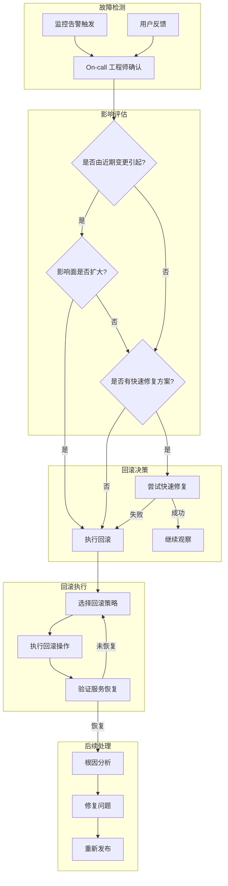
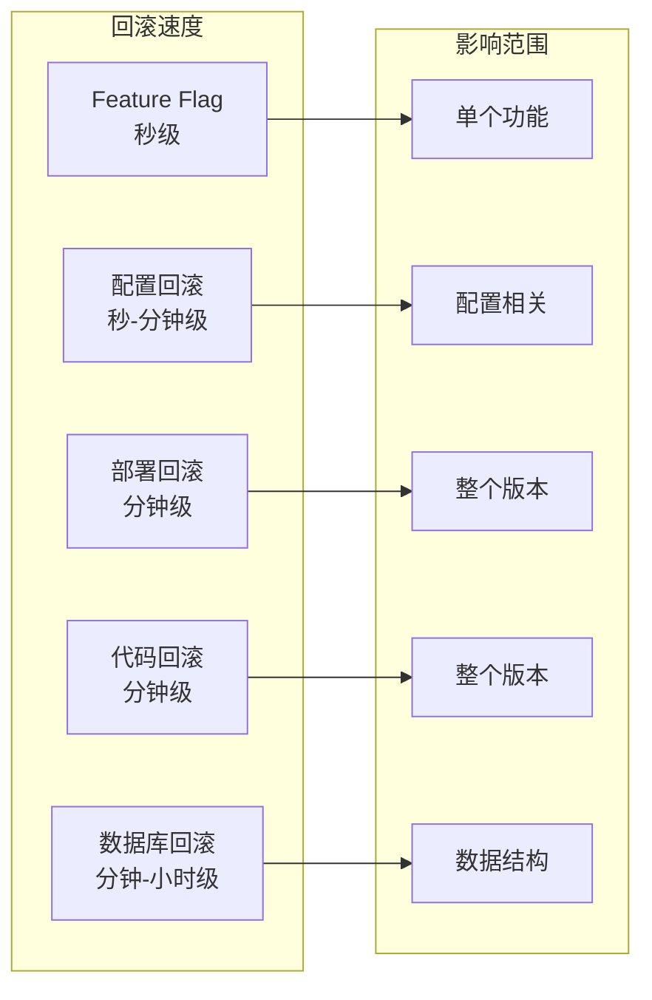
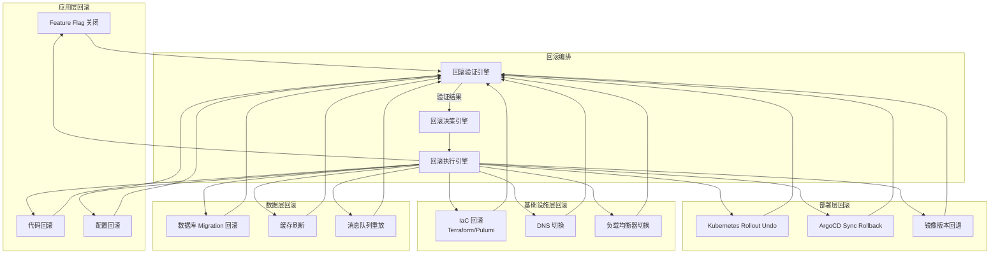
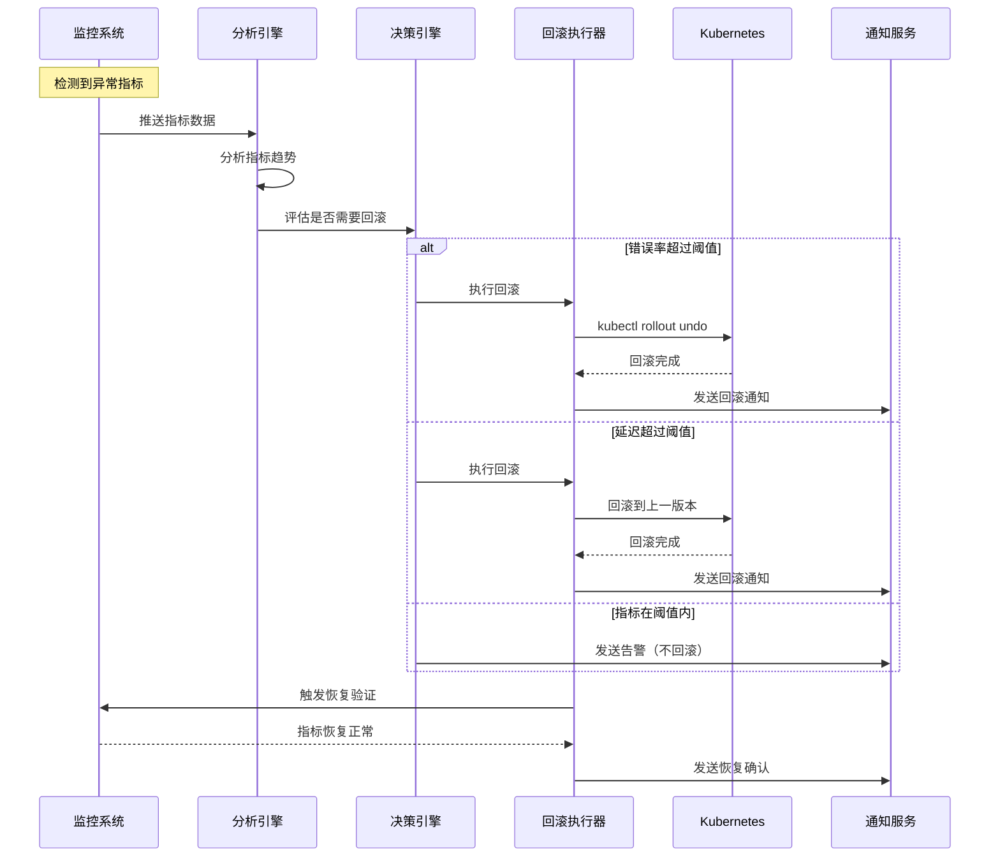
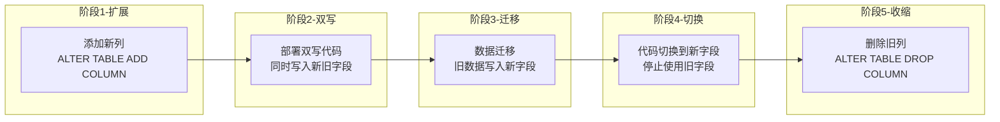

# 回滚策略与故障恢复

## 背景与问题定义

"3 分钟内可回滚 = 天下无敌。" 这句话揭示了故障恢复的核心真理：在生产环境中，回滚是最快、最有效的故障恢复手段。与其在故障现场艰难定位根因，不如先把系统恢复到已知的良好状态——MTTR 的第一优先级是恢复，而不是排查。

### 为什么回滚如此重要

| 恢复方式 | 恢复速度 | 可靠性 | 适用场景 |
|----------|----------|--------|----------|
| **回滚** | 分钟级 | 极高 | 变更引起的故障 |
| **热修复** | 小时级 | 中等 | 小范围代码修复 |
| **故障转移** | 秒级 | 高 | 基础设施故障 |
| **降级** | 秒级 | 高 | 依赖服务故障 |
| **重启** | 分钟级 | 低 | 临时性故障 |

回滚的独特优势在于：
1. **确定性**：回到已验证的状态，不需要理解故障原因
2. **快速性**：不需要编写和测试修复代码
3. **彻底性**：消除所有变更引入的问题，包括未预期的问题
4. **可验证性**：回滚后可以立即确认服务是否恢复

### 回滚策略分类

| 策略 | 描述 | 速度 | 适用场景 |
|------|------|------|----------|
| **代码回滚** | 回退代码到上一版本 | 分钟级 | 代码缺陷 |
| **部署回滚** | 重新部署上一版本的镜像 | 分钟级 | 构建或配置问题 |
| **Feature Flag 关闭** | 关闭功能开关 | 秒级 | Feature Flag 控制的功能 |
| **配置回滚** | 恢复上一版本的配置 | 秒级 | 配置变更引起的问题 |
| **数据库回滚** | 回退数据库变更 | 分钟-小时级 | 数据库 Migration 问题 |

## 核心概念

### 回滚决策流程

回滚不是技术问题，而是决策问题。什么时候回滚、回滚到哪个版本、回滚后做什么，都需要明确的流程。



### 回滚策略对比



## 架构设计

### 分层回滚架构

一个完善的回滚体系需要在不同层面建立回滚能力。



### 自动化回滚架构

基于指标的自动化回滚是实现快速恢复的关键。



## 实现方案

### Git 回滚实践

Git 回滚是代码层面的回滚操作，需要根据场景选择正确的策略。

| 操作 | 命令 | 影响范围 | 是否保留历史 | 适用场景 |
|------|------|----------|-------------|----------|
| `git revert` | `git revert <commit>` | 创建新提交 | 是 | 公共分支，安全回滚 |
| `git revert` (多提交) | `git revert HEAD~3..HEAD` | 创建多个新提交 | 是 | 回滚多个连续提交 |
| `git reset --hard` | `git reset --hard <commit>` | 重置分支指针 | 否 | 私有分支，强制回滚 |
| `git cherry-pick` | `git cherry-pick <commit>` | 选择性应用提交 | 是 | 选择性修复 |

```bash
#!/bin/bash
# git-rollback.sh - Git 回滚脚本
# 用于安全地回滚生产分支上的变更

set -euo pipefail

BRANCH="${1:?Usage: $0 <branch> <commit-range>}"
COMMIT_RANGE="${2:?Commit range required, e.g. HEAD~3..HEAD}"
DRY_RUN="${DRY_RUN:-true}"

echo "=== Git Rollback Script ==="
echo "Branch: $BRANCH"
echo "Commit Range: $COMMIT_RANGE"
echo "Dry Run: $DRY_RUN"
echo ""

# 切换到目标分支
git checkout "$BRANCH"
git pull origin "$BRANCH"

# 查看要回滚的提交
echo "=== Commits to Revert ==="
git log --oneline --reverse "$COMMIT_RANGE"
echo ""

# 确认操作
read -p "Continue with revert? (yes/no): " CONFIRM
if [[ "$CONFIRM" != "yes" ]]; then
    echo "Aborted."
    exit 0
fi

# 执行 revert（从旧到新逐个 revert，避免冲突）
COMMITS=$(git log --format="%H" --reverse "$COMMIT_RANGE")

REVERT_COUNT=0
for commit in $COMMITS; do
    echo "Reverting commit: $commit"
    if [[ "$DRY_RUN" == "false" ]]; then
        if git revert --no-edit "$commit"; then
            REVERT_COUNT=$((REVERT_COUNT + 1))
            echo "  Successfully reverted $commit"
        else
            echo "  Conflict detected on $commit"
            echo "  Please resolve conflicts manually"
            git revert --abort
            echo "  Aborted revert for $commit, continuing with next..."
        fi
    else
        echo "  [DRY RUN] Would revert $commit"
        REVERT_COUNT=$((REVERT_COUNT + 1))
    fi
done

echo ""
echo "=== Revert Summary ==="
echo "Total reverts: $REVERT_COUNT"

if [[ "$DRY_RUN" == "false" ]]; then
    echo ""
    echo "Reverted changes are in local branch."
    echo "Review and push when ready:"
    echo "  git push origin $BRANCH"
fi
```

**分支保护规则配置**：

```yaml
# GitHub 分支保护规则（通过 API 设置）
# 确保回滚操作也需要经过 CI 验证
branch_protection_rules:
  - pattern: "main"
    required_pull_request_reviews:
      required_approving_review_count: 2
      dismiss_stale_reviews: true
      require_code_owner_reviews: true
    required_status_checks:
      strict: true  # 要求分支是最新的
      contexts:
        - "ci/lint"
        - "ci/test"
        - "ci/build"
    enforce_admins: true  # 管理员也受保护
    restrictions: null
    required_linear_history: true  # 线性历史，便于回滚
    allow_force_pushes: false     # 禁止强制推送
    allow_deletions: false        # 禁止删除分支
```

### Kubernetes 回滚

Kubernetes 提供了原生的部署回滚能力。

```bash
#!/bin/bash
# k8s-rollback.sh - Kubernetes 回滚脚本

set -euo pipefail

DEPLOYMENT="${1:?Usage: $0 <deployment-name> [namespace]}"
NAMESPACE="${2:-default}"

echo "=== Kubernetes Rollback Script ==="
echo "Deployment: $DEPLOYMENT"
echo "Namespace: $NAMESPACE"
echo ""

# 查看部署历史
echo "=== Deployment History ==="
kubectl rollout history deployment/"$DEPLOYMENT" -n "$NAMESPACE"
echo ""

# 查看当前状态
echo "=== Current Status ==="
kubectl rollout status deployment/"$DEPLOYMENT" -n "$NAMESPACE"
echo ""

# 获取当前镜像版本
CURRENT_IMAGE=$(kubectl get deployment "$DEPLOYMENT" -n "$NAMESPACE" \
    -o jsonpath='{.spec.template.spec.containers[0].image}')
echo "Current image: $CURRENT_IMAGE"
echo ""

# 确认回滚
read -p "Rollback to previous revision? (yes/no): " CONFIRM
if [[ "$CONFIRM" != "yes" ]]; then
    echo "Aborted."
    exit 0
fi

# 执行回滚
echo "Rolling back..."
kubectl rollout undo deployment/"$DEPLOYMENT" -n "$NAMESPACE"

# 等待回滚完成
echo "Waiting for rollback to complete..."
kubectl rollout status deployment/"$DEPLOYMENT" -n "$NAMESPACE" --timeout=300s

# 验证回滚结果
NEW_IMAGE=$(kubectl get deployment "$DEPLOYMENT" -n "$NAMESPACE" \
    -o jsonpath='{.spec.template.spec.containers[0].image}')
echo ""
echo "=== Rollback Result ==="
echo "Previous image: $CURRENT_IMAGE"
echo "Current image:  $NEW_IMAGE"

# 检查 Pod 健康状态
echo ""
echo "=== Pod Status ==="
kubectl get pods -n "$NAMESPACE" -l "app=$DEPLOYMENT" -o wide

# 检查最近的事件
echo ""
echo "=== Recent Events ==="
kubectl get events -n "$NAMESPACE" --sort-by='.lastTimestamp' | tail -10
```

**Kubernetes 回滚到指定版本**：

```bash
# 查看部署历史（含详细信息）
kubectl rollout history deployment/webapp --revision=3

# 回滚到指定版本
kubectl rollout undo deployment/webapp --to-revision=3

# 暂停和恢复部署（用于紧急控制）
kubectl rollout pause deployment/webapp
kubectl rollout resume deployment/webapp

# 查看部署状态
kubectl rollout status deployment/webapp --timeout=120s

# 扩容以应对回滚期间的流量
kubectl scale deployment/webapp --replicas=5
```

### ArgoCD 回滚配置

ArgoCD 提供了声明式的回滚能力。

```yaml
# argocd-app.yaml - ArgoCD 应用配置
apiVersion: argoproj.io/v1alpha1
kind: Application
metadata:
  name: webapp
  namespace: argocd
  annotations:
    # 保留部署历史，支持回滚
    argocd.argoproj.io/sync-options: PrunePropagationPolicy=foreground
spec:
  project: default
  # 保留历史版本数量（供回滚使用，Argo CD 默认值为 10）
  revisionHistoryLimit: 10
  source:
    repoURL: https://github.com/org/webapp-manifests
    targetRevision: main
    path: overlays/production
  destination:
    server: https://kubernetes.default.svc
    namespace: production
  syncPolicy:
    automated:
      prune: false  # 不自动删除资源，保留回滚能力
      selfHeal: true # 自动修复配置漂移
      allowEmpty: false
    syncOptions:
    - CreateNamespace=true
    # 回滚重试策略
    retry:
      limit: 3
      backoff:
        duration: 5s
        factor: 2
        maxDuration: 3m

---
# ArgoCD 回滚操作（通过 CLI 或 API）
# 查看部署历史
# argocd app history webapp

# 回滚到指定版本
# argocd app rollback webapp <revision-id>

# 查看 Pod 日志
# argocd app logs webapp
```

**ArgoCD 自动同步回滚**：

```yaml
# argocd-sync-retry.yaml
apiVersion: argoproj.io/v1alpha1
kind: AppProject
metadata:
  name: production
  namespace: argocd
spec:
  description: Production environment
  sourceRepos:
  - '*'
  destinations:
  - namespace: production
    server: https://kubernetes.default.svc
  # 同步窗口（限制变更时间）
  syncWindows:
  - kind: allow
    schedule: '10 1 * * *'  # 每天 01:10 UTC 允许同步
    duration: 2h
    applications:
    - 'webapp-*'
    manualSync: true  # 窗口外需要手动同步

  # 角色和权限
  roles:
  - name: rollback-role
    description: Allow rollback operations
    policies:
    - p, proj:production:rollback-role, applications, rollback, production/*, allow
    - p, proj:production:rollback-role, applications, get, production/*, allow
```

### 数据库变更回滚

数据库变更回滚是最复杂的回滚场景，因为数据是有状态的，不能简单地"切换回旧版本"。

**核心原则：向前兼容 Migration（Expand-Contract 模式）**



**向前兼容 Migration 完整示例**：

```python
#!/usr/bin/env python3
"""
向前兼容数据库 Migration 示例
演示 Expand-Contract 模式的完整实现

场景：将用户的 full_name 字段拆分为 first_name 和 last_name
"""

# ============================================================
# 阶段 1: 扩展（Expand）- 添加新列
# ============================================================

MIGRATION_001_EXPAND = """
-- Migration 001: 添加新列（向前兼容）
-- 新旧版本代码都可以正常运行

ALTER TABLE users
    ADD COLUMN first_name VARCHAR(100),
    ADD COLUMN last_name VARCHAR(100);

-- 添加注释标记
COMMENT ON COLUMN users.first_name IS 'EXPAND: 阶段1 - 新增列，与 full_name 并存';
COMMENT ON COLUMN users.last_name IS 'EXPAND: 阶段1 - 新增列，与 full_name 并存';
"""

# ============================================================
# 阶段 2: 双写（Dual Write）- 同时写入新旧字段
# ============================================================

# 应用代码变更（伪代码）：
class UserService:
    """双写模式：同时写入新旧字段"""

    def create_user(self, full_name: str, email: str):
        # 解析 full_name
        parts = full_name.split(' ', 1)
        first_name = parts[0]
        last_name = parts[1] if len(parts) > 1 else ''

        # 双写：同时写入新旧字段
        query = """
            INSERT INTO users (full_name, first_name, last_name, email)
            VALUES (%s, %s, %s, %s)
        """
        self.db.execute(query, (full_name, first_name, last_name, email))

    def update_user(self, user_id: int, full_name: str = None,
                    first_name: str = None, last_name: str = None):
        # 优先使用新字段，同时更新旧字段
        if first_name is not None and last_name is not None:
            full_name = f"{first_name} {last_name}".strip()

        query = """
            UPDATE users
            SET full_name = COALESCE(%s, full_name),
                first_name = COALESCE(%s, first_name),
                last_name = COALESCE(%s, last_name)
            WHERE id = %s
        """
        self.db.execute(query, (full_name, first_name, last_name, user_id))

    def get_user(self, user_id: int):
        # 读取时优先使用新字段
        query = """
            SELECT id,
                   COALESCE(first_name, split_part(full_name, ' ', 1)) as first_name,
                   COALESCE(last_name,
                            CASE WHEN position(' ' in full_name) > 0
                                 THEN substring(full_name from position(' ' in full_name) + 1)
                                 ELSE ''
                            END) as last_name,
                   email
            FROM users
            WHERE id = %s
        """
        return self.db.fetch_one(query, (user_id,))


# ============================================================
# 阶段 3: 数据迁移（Migrate）- 回填历史数据
# ============================================================

MIGRATION_002_MIGRATE = """
-- Migration 002: 回填历史数据
-- 将 full_name 的值拆分并写入 first_name 和 last_name

-- 批量更新（避免锁表）
DO $$
DECLARE
    batch_size INT := 1000;
    updated_count INT := 1;
BEGIN
    WHILE updated_count > 0 LOOP
        UPDATE users
        SET first_name = split_part(full_name, ' ', 1),
            last_name = CASE
                WHEN position(' ' in full_name) > 0
                THEN substring(full_name from position(' ' in full_name) + 1)
                ELSE ''
            END
        WHERE id IN (
            SELECT id FROM users
            WHERE first_name IS NULL
            LIMIT batch_size
            FOR UPDATE SKIP LOCKED
        );

        GET DIAGNOSTICS updated_count = ROW_COUNT;
        COMMIT;

        -- 间隔 100ms 避免数据库压力
        PERFORM pg_sleep(0.1);
    END LOOP;
END $$;

COMMENT ON COLUMN users.first_name IS 'MIGRATE: 阶段3 - 数据迁移完成';
"""

# ============================================================
# 数据一致性验证
# ============================================================

def verify_data_consistency(db):
    """验证新旧字段数据一致性"""
    query = """
        SELECT COUNT(*) as inconsistent_count
        FROM users
        WHERE first_name IS NOT NULL
          AND full_name != CONCAT(first_name, ' ', last_name)
    """
    result = db.fetch_one(query)

    if result['inconsistent_count'] > 0:
        raise DataConsistencyError(
            f"Found {result['inconsistent_count']} inconsistent records"
        )

    # 抽样验证
    sample_query = """
        SELECT id, full_name, first_name, last_name
        FROM users
        WHERE first_name IS NOT NULL
        ORDER BY RANDOM()
        LIMIT 100
    """
    samples = db.fetch_all(sample_query)

    for row in samples:
        expected = f"{row['first_name']} {row['last_name']}".strip()
        if row['full_name'] != expected:
            raise DataConsistencyError(
                f"Inconsistent data for user {row['id']}: "
                f"full_name='{row['full_name']}' vs "
                f"first_name='{row['first_name']}' last_name='{row['last_name']}'"
            )

    print("Data consistency verification passed!")


# ============================================================
# 阶段 4: 切换（Switch）- 代码只使用新字段
# ============================================================

# 应用代码变更：
class UserServiceV2:
    """切换模式：只使用新字段"""

    def create_user(self, first_name: str, last_name: str, email: str):
        # 不再写入 full_name（但保持双写以防需要回滚）
        full_name = f"{first_name} {last_name}".strip()

        query = """
            INSERT INTO users (full_name, first_name, last_name, email)
            VALUES (%s, %s, %s, %s)
        """
        self.db.execute(query, (full_name, first_name, last_name, email))

    def get_user(self, user_id: int):
        # 只读取新字段
        query = """
            SELECT id, first_name, last_name, email
            FROM users
            WHERE id = %s
        """
        return self.db.fetch_one(query, (user_id,))


# ============================================================
# 阶段 5: 收缩（Contract）- 删除旧列
# ============================================================

MIGRATION_003_CONTRACT = """
-- Migration 003: 删除旧列
-- 所有版本都已切换到新字段后执行

-- 首先移除 full_name 的 NOT NULL 约束（如果有的话）
-- ALTER TABLE users ALTER COLUMN full_name DROP NOT NULL;

-- 最终删除旧列
-- 注意：确保所有代码都不再依赖此列
ALTER TABLE users DROP COLUMN full_name;

COMMENT ON COLUMN users.first_name IS 'CONTRACT: 阶段5 - 旧列已删除';
"""

# ============================================================
# 回滚策略（每个阶段的回滚方案）
# ============================================================

ROLLBACK_STRATEGIES = {
    "阶段1-扩展": {
        "操作": "删除新添加的列",
        "SQL": "ALTER TABLE users DROP COLUMN first_name, DROP COLUMN last_name;",
        "风险": "低 - 新列为空，删除不影响数据",
        "前提": "阶段2的双写代码还未部署",
    },
    "阶段2-双写": {
        "操作": "部署旧版本代码（单写 full_name）",
        "SQL": "无需数据库操作",
        "风险": "低 - 代码回滚即可",
        "前提": "新写入的 first_name/last_name 可以为空",
    },
    "阶段3-迁移": {
        "操作": "无需回滚 - 数据迁移是幂等的",
        "SQL": "无需数据库操作",
        "风险": "极低 - 数据只会更完整",
        "前提": "无",
    },
    "阶段4-切换": {
        "操作": "部署回旧版本代码（双写）",
        "SQL": "无需数据库操作",
        "风险": "低 - 双写代码仍可工作",
        "前提": "full_name 列仍然存在",
    },
    "阶段5-收缩": {
        "操作": "重新添加 full_name 列",
        "SQL": "ALTER TABLE users ADD COLUMN full_name VARCHAR(200);",
        "风险": "中 - 需要重新计算和回填 full_name",
        "前提": "可以从 first_name + last_name 重建 full_name",
    },
}
```

### 自动化回滚触发配置

基于指标的自动化回滚是实现快速恢复的关键。

```yaml
# auto-rollback-config.yaml
apiVersion: argoproj.io/v1alpha1
kind: Rollout
metadata:
  name: webapp
spec:
  replicas: 5
  selector:
    matchLabels:
      app: webapp
  template:
    metadata:
      labels:
        app: webapp
    spec:
      containers:
      - name: webapp
        image: webapp:v2.0
        ports:
        - containerPort: 8080
        readinessProbe:
          httpGet:
            path: /health
            port: 8080
          initialDelaySeconds: 5
          periodSeconds: 10

  strategy:
    canary:
      steps:
      - setWeight: 10
      - pause: {duration: 5m}
      - analysis:
          templates:
          - templateName: rollback-trigger
      - setWeight: 50
      - pause: {duration: 5m}
      - analysis:
          templates:
          - templateName: rollback-trigger
      - setWeight: 100

---
# 自动回滚触发条件
apiVersion: argoproj.io/v1alpha1
kind: AnalysisTemplate
metadata:
  name: rollback-trigger
spec:
  metrics:
  # 错误率阈值触发回滚
  - name: error-rate
    interval: 30s
    count: 6
    successCondition: result[0] < 0.01  # 错误率 < 1%
    failureLimit: 2
    provider:
      prometheus:
        address: http://prometheus-server:9090
        query: |
          sum(rate(http_requests_total{app="webapp",status=~"5.."}[2m]))
          /
          sum(rate(http_requests_total{app="webapp"}[2m]))

  # P99 延迟阈值触发回滚
  - name: latency-p99
    interval: 30s
    count: 6
    successCondition: result[0] < 500  # P99 < 500ms
    failureLimit: 2
    provider:
      prometheus:
        address: http://prometheus-server:9090
        query: |
          histogram_quantile(0.99,
            sum(rate(http_request_duration_seconds_bucket{app="webapp"}[2m])) by (le)
          ) * 1000

  # Pod 崩溃率触发回滚
  - name: pod-crash-rate
    interval: 30s
    count: 6
    successCondition: result[0] < 0.1  # 崩溃率 < 10%
    failureLimit: 1
    provider:
      prometheus:
        address: http://prometheus-server:9090
        query: |
          sum(rate(kube_pod_container_status_restarts_total{pod=~"webapp-.*"}[5m]))
          /
          sum(kube_pod_container_info{pod=~"webapp-.*"})
```

**Prometheus 回滚告警规则**：

```yaml
# prometheus-rollback-alerts.yaml
apiVersion: monitoring.coreos.com/v1
kind: PrometheusRule
metadata:
  name: rollback-alerts
  namespace: monitoring
spec:
  groups:
  - name: rollback.rules
    rules:
    # 错误率告警
    - alert: HighErrorRate
      expr: |
        sum(rate(http_requests_total{status=~"5.."}[5m]))
        /
        sum(rate(http_requests_total[5m]))
        > 0.05
      for: 2m
      labels:
        severity: critical
        action: rollback
      annotations:
        summary: "High error rate detected"
        description: "Error rate is {{ $value | humanizePercentage }} over the last 5 minutes"
        rollback_command: "kubectl rollout undo deployment/{{ $labels.deployment }}"

    # 延迟告警
    - alert: HighLatency
      expr: |
        histogram_quantile(0.99,
          sum(rate(http_request_duration_seconds_bucket[5m])) by (le)
        ) > 2.0
      for: 3m
      labels:
        severity: critical
        action: rollback
      annotations:
        summary: "High latency detected"
        description: "P99 latency is {{ $value }}s over the last 5 minutes"

    # Pod 重启告警
    - alert: FrequentPodRestarts
      expr: |
        sum(increase(kube_pod_container_status_restarts_total[10m])) by (pod)
        > 3
      for: 1m
      labels:
        severity: critical
        action: rollback
      annotations:
        summary: "Frequent pod restarts detected"
        description: "Pod {{ $labels.pod }} has restarted {{ $value }} times in the last 10 minutes"
```

### Feature Flag 紧急回滚

Feature Flag 回滚是最快的回滚方式，适用于 Feature Flag 控制的功能。

```go
// Feature Flag 紧急回滚中间件
package middleware

import (
    "context"
    "fmt"
    "log"
    "net/http"
    "time"
)

type EmergencyRollback struct {
    featureClient FeatureFlagClient
    alertService  AlertService
}

// 紧急回滚中间件：当错误率超过阈值时自动关闭 Feature Flag
func (er *EmergencyRollback) Middleware(next http.Handler) http.Handler {
    return http.HandlerFunc(func(w http.ResponseWriter, r *http.Request) {
        // 检查是否在紧急回滚状态
        if er.isEmergencyRollbackActive() {
            // 关闭所有非核心功能
            er.disableNonCriticalFlags()
        }

        next.ServeHTTP(w, r)
    })
}

// 基于错误率的自动回滚
func (er *EmergencyRollback) MonitorAndRollback(ctx context.Context) {
    ticker := time.NewTicker(30 * time.Second)
    defer ticker.Stop()

    for {
        select {
        case <-ctx.Done():
            return
        case <-ticker.C:
            errorRate := er.getErrorRate()
            if errorRate > 0.05 { // 错误率 > 5%
                log.Printf("EMERGENCY: Error rate %.2f%% exceeds threshold, triggering rollback", errorRate*100)
                er.triggerEmergencyRollback()
            }
        }
    }
}

func (er *EmergencyRollback) triggerEmergencyRollback() {
    // 1. 关闭最近开启的 Feature Flag
    recentlyEnabled := er.featureClient.GetRecentlyEnabledFlags(24 * time.Hour)
    for _, flag := range recentlyEnabled {
        log.Printf("Disabling flag: %s", flag.Name)
        er.featureClient.Disable(flag.Name)

        // 发送告警
        er.alertService.Send(Alert{
            Level:   "critical",
            Message: fmt.Sprintf("Emergency rollback: disabled flag %s", flag.Name),
            Flag:    flag.Name,
        })
    }

    // 2. 检查是否恢复
    time.Sleep(1 * time.Minute)
    errorRate := er.getErrorRate()
    if errorRate < 0.01 {
        log.Printf("Recovery confirmed: error rate back to %.2f%%", errorRate*100)
    } else {
        // 如果仍然异常，执行更激进的回滚
        log.Printf("Error rate still high (%.2f%%), considering deployment rollback", errorRate*100)
        er.alertService.Send(Alert{
            Level:   "critical",
            Message: "Feature flag rollback insufficient, manual intervention required",
        })
    }
}

// 一键回滚 API
func (er *EmergencyRollback) HandleEmergencyRollback(w http.ResponseWriter, r *http.Request) {
    flagName := r.URL.Query().Get("flag")
    if flagName == "" {
        http.Error(w, "flag parameter required", http.StatusBadRequest)
        return
    }

    // 关闭指定的 Feature Flag
    er.featureClient.Disable(flagName)

    // 记录操作日志
    log.Printf("Emergency rollback: flag %s disabled by %s",
        flagName, r.Header.Get("X-User"))

    // 发送通知
    er.alertService.Send(Alert{
        Level:   "warning",
        Message: fmt.Sprintf("Flag %s manually disabled via emergency rollback API", flagName),
        Flag:    flagName,
    })

    w.WriteHeader(http.StatusOK)
    w.Write([]byte(fmt.Sprintf(`{"status":"disabled","flag":"%s"}`, flagName)))
}
```

## 最佳实践

### 回滚决策框架

| 判断条件 | 推荐操作 | 优先级 |
|----------|----------|--------|
| 错误率 > 5% 且在 5 分钟内无下降趋势 | 自动回滚 | P0 |
| P99 延迟 > 基线 2 倍且持续 5 分钟 | 自动回滚 | P0 |
| 错误率 > 1% 且在 15 分钟内无下降趋势 | 人工确认后回滚 | P1 |
| 功能异常但错误率 < 1% | Feature Flag 关闭 | P1 |
| 性能轻微退化但功能正常 | 观察 + 计划修复 | P2 |
| 仅影响非核心功能 | Feature Flag 关闭或降级 | P2 |

### 回滚演练

定期进行回滚演练，确保回滚流程可靠。

```bash
#!/bin/bash
# rollback-drill.sh - 回滚演练脚本

set -euo pipefail

APP_NAME="${1:?Usage: $0 <app-name>}"
NAMESPACE="${2:-production}"
DRILL_ID="drill-$(date +%Y%m%d-%H%M%S)"

echo "=== Rollback Drill: $DRILL_ID ==="
echo "App: $APP_NAME"
echo "Namespace: $NAMESPACE"
echo ""

# 记录当前状态
BEFORE_IMAGE=$(kubectl get deployment "$APP_NAME" -n "$NAMESPACE" \
    -o jsonpath='{.spec.template.spec.containers[0].image}')
BEFORE_REPLICAS=$(kubectl get deployment "$APP_NAME" -n "$NAMESPACE" \
    -o jsonpath='{.spec.replicas}')

echo "Current state:"
echo "  Image: $BEFORE_IMAGE"
echo "  Replicas: $BEFORE_REPLICAS"
echo ""

# 步骤 1: 记录当前版本
CURRENT_REVISION=$(kubectl rollout history deployment/"$APP_NAME" -n "$NAMESPACE" | tail -1 | awk '{print $1}')
echo "Current revision: $CURRENT_REVISION"

# 步骤 2: 执行回滚
echo ""
echo "Executing rollback..."
START_TIME=$(date +%s)
kubectl rollout undo deployment/"$APP_NAME" -n "$NAMESPACE"

# 步骤 3: 等待回滚完成
kubectl rollout status deployment/"$APP_NAME" -n "$NAMESPACE" --timeout=120s
END_TIME=$(date +%s)

# 步骤 4: 记录回滚耗时
ROLLBACK_DURATION=$((END_TIME - START_TIME))
echo ""
echo "Rollback duration: ${ROLLBACK_DURATION}s"

# 步骤 5: 验证服务健康
echo "Verifying service health..."
sleep 10  # 等待流量切换

HTTP_STATUS=$(curl -s -o /dev/null -w "%{http_code}" "http://$APP_NAME/health")
if [[ "$HTTP_STATUS" == "200" ]]; then
    echo "Health check: PASSED (HTTP $HTTP_STATUS)"
else
    echo "Health check: FAILED (HTTP $HTTP_STATUS)"
fi

# 步骤 6: 恢复到演练前版本
echo ""
echo "Restoring to pre-drill version..."
kubectl set image deployment/"$APP_NAME" "app=$BEFORE_IMAGE" -n "$NAMESPACE"
kubectl rollout status deployment/"$APP_NAME" -n "$NAMESPACE" --timeout=120s

# 步骤 7: 生成报告
echo ""
echo "=== Drill Report ==="
echo "Drill ID: $DRILL_ID"
echo "Rollback duration: ${ROLLBACK_DURATION}s"
echo "Health check: HTTP $HTTP_STATUS"
echo "Target: < 180s (3 minutes)"
if [[ $ROLLBACK_DURATION -lt 180 ]]; then
    echo "Result: PASSED"
else
    echo "Result: FAILED - rollback too slow"
fi
```

### 数据库变更回滚策略对比

| 场景 | 回滚策略 | 前置条件 | 风险等级 |
|------|----------|----------|----------|
| 添加新列 | 删除新列 | 旧代码不依赖新列 | 低 |
| 删除旧列 | 重新添加列并回填数据 | 保留数据备份 | 中 |
| 修改列类型 | 恢复旧列类型 | 数据无损转换 | 高 |
| 重命名列 | 改回旧名称 | 使用 View 过渡 | 中 |
| 添加索引 | 删除索引 | 无 | 低 |
| 删除索引 | 重新创建索引 | 重建需要时间 | 低 |
| 数据变更 | 恢复数据备份 | 保留变更前备份 | 高 |

### 回滚检查清单

每次发布前，确保以下回滚准备已完成：

```yaml
# rollback-readiness-checklist.yaml
checklist:
  - category: "代码准备"
    items:
    - "回滚命令已文档化并经过测试"
    - "Feature Flag 已配置且关闭后功能可正常回退"
    - "代码兼容上一版本的数据库 Schema"

  - category: "部署准备"
    items:
    - "上一版本镜像可用且已验证"
    - "Kubernetes 部署历史保留足够版本"
    - "ArgoCD 同步历史可追溯"

  - category: "数据准备"
    items:
    - "数据库 Migration 向前兼容"
    - "数据备份已完成"
    - "数据回滚方案已验证"

  - category: "监控准备"
    items:
    - "关键指标告警已配置"
    - "自动回滚触发条件已设置"
    - "回滚后验证指标已定义"

  - category: "流程准备"
    items:
    - "回滚决策人已确定"
    - "回滚通知流程已建立"
    - "回滚后复盘流程已建立"
```

## 效果度量

### 回滚效率指标

| 指标 | 定义 | 目标值 | 测量方法 |
|------|------|--------|----------|
| **平均回滚时间（MTTR）** | 从故障发生到回滚完成的时间 | < 3 分钟 | 监控告警到回滚完成时间差 |
| **回滚成功率** | 回滚操作成功恢复服务的比例 | 100% | 回滚操作结果统计 |
| **回滚决策时间** | 从故障确认到决定回滚的时间 | < 5 分钟 | 告警确认到执行回滚时间差 |
| **回滚验证时间** | 从回滚完成到确认服务恢复的时间 | < 2 分钟 | 回滚完成到指标恢复时间差 |

### 回滚预防指标

| 指标 | 定义 | 目标值 | 测量方法 |
|------|------|--------|----------|
| **回滚频率** | 需要回滚的部署比例 | < 5% | 部署统计 |
| **灰度拦截率** | 灰度阶段发现并回滚的比例 | > 90% | 灰度回滚统计 |
| **回滚根因分类** | 回滚原因的分布 | 趋势下降 | 根因分析统计 |
| **重复回滚率** | 同一问题导致多次回滚的比例 | 0% | 回滚记录分析 |

### 回滚演练指标

| 指标 | 定义 | 目标值 | 测量方法 |
|------|------|--------|----------|
| **演练频率** | 回滚演练的频率 | 每月至少 1 次 | 演练记录 |
| **演练通过率** | 在目标时间内完成回滚的比例 | 100% | 演练结果 |
| **演练覆盖率** | 参与回滚演练的服务比例 | > 80% | 服务统计 |

## 总结

回滚是故障恢复最有效的手段。一个成熟的持续交付体系，不仅要能快速部署，更要能快速回滚。

**核心认知**：

1. **回滚优先于修复**：故障发生时，首要目标是恢复服务，不是定位根因
2. **3 分钟内可回滚 = 天下无敌**：快速回滚能力是系统韧性的基础
3. **分层回滚策略**：Feature Flag 秒级、部署回滚分钟级、数据库回滚需要精心设计
4. **数据库回滚是最复杂的**：向前兼容 Migration（Expand-Contract）是核心策略
5. **自动化是关键**：基于指标的自动回滚减少人工决策延迟

**实施路径**：

```
手动回滚 → 脚本回滚 → 自动回滚 → 自动化故障恢复
   ↓          ↓          ↓            ↓
 有回滚能力  标准化流程  快速响应    自愈系统
```

**下一步行动**：

1. 梳理现有服务的回滚能力和流程
2. 为每个服务建立回滚脚本和检查清单
3. 引入数据库向前兼容 Migration 实践
4. 配置基于指标的自动回滚
5. 建立定期回滚演练机制

本模块的四篇文章到此结束。从部署策略、Feature Flag、灰度发布到回滚恢复，我们构建了一个完整的部署与发布体系。核心思路是：通过合理的部署策略降低发布风险，通过 Feature Flag 解耦部署与发布，通过灰度发布和 A/B 测试验证变更效果，通过快速回滚保障系统韧性。
