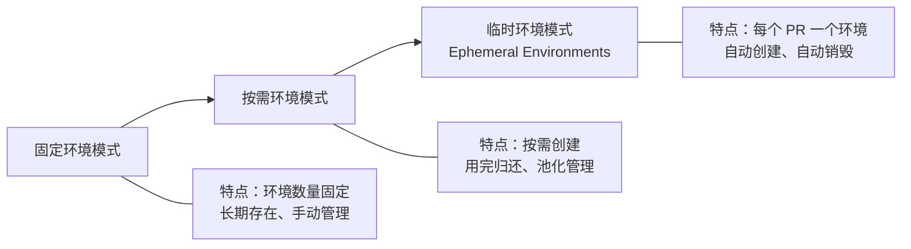
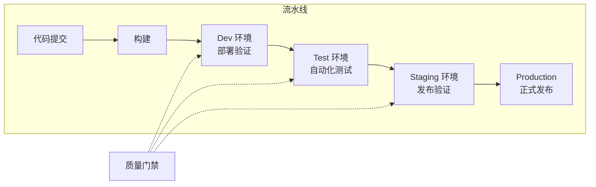
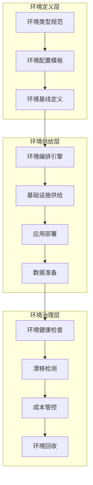

# 环境策略：开发、测试、预发布、生产

## 背景与问题定义

在软件交付的生命周期中，代码从开发者的工作站走向生产环境，需要经过一系列递进的环境验证。这一过程看似简单——"写完代码，部署上线"——但在工程实践中，环境管理是持续交付体系中最容易出问题的环节之一。

Puppet 在 2016 年发布的《State of DevOps》报告中给出了一组广为流传的数据：高效能 IT 组织的部署频率是低效能组织的 200 倍，变更失败率只有后者的三分之一。敢于高频部署的前提，正是把环境管好——环境策略的成熟度差异，是拉开这一差距的核心原因之一。

环境管理面临的典型问题包括：

- **环境不一致**：开发环境能跑通，测试环境报错，生产环境崩溃——经典的 "It works on my machine" 问题
- **环境争用**：多个团队共享有限的测试环境，导致排队等待、互相覆盖
- **环境漂移**：环境配置随时间偏离声明状态，无人知晓环境的真实面貌
- **成本失控**：环境数量无限膨胀，云资源账单持续攀升
- **安全风险**：生产数据流入非生产环境，或测试环境暴露在公网

这些问题的根源，在于缺乏系统性的环境策略。环境策略要回答的核心问题是：**我们需要哪些环境？每个环境的职责是什么？环境之间如何递进？如何以最低成本保障最高质量？**

## 核心概念

### 环境类型定义与职责

一个成熟的持续交付体系通常包含四类核心环境：

**Dev（开发环境）**

开发环境是开发者日常编码、调试的场所。它的核心特征是高灵活性、低稳定性要求。开发者需要频繁修改配置、重启服务、注入测试数据，因此环境的稳定性不是首要目标。

职责：
- 代码编写与单元测试
- 本地功能调试
- 开发期集成验证

关键约束：开发环境应尽量与目标部署环境保持技术栈一致，但不需要数据和生产环境完全对齐。

**Test/QA（测试环境）**

测试环境是质量验证的核心阵地。它承载着功能测试、集成测试、回归测试等质量门禁活动。测试环境需要足够的稳定性，以保证测试结果的可重复性。

职责：
- 功能测试与回归测试
- 集成测试（服务间交互验证）
- 性能测试基线建立
- 用户验收测试（UAT）

关键约束：测试环境的数据和配置应尽可能接近生产环境，以保证测试结果的有效性。

**Staging（预发布环境）**

预发布环境是生产环境的"影子"，是发布前的最后一道防线。它的核心价值在于：用与生产环境几乎一致的配置和数据，验证发布包的真实表现。

职责：
- 发布前全链路验证
- 生产数据脱敏后的真实场景测试
- 基础设施变更验证（数据库迁移、配置变更等）
- 灰度发布的前置验证

关键约束：预发布环境必须与生产环境保持架构一致、配置对等、数据同构。任何差异都是潜在的生产事故隐患。

**Production（生产环境）**

生产环境是面向最终用户的运行环境，是所有交付活动的终点。它的核心要求是高可用、高性能、高安全。

职责：
- 面向用户的服务交付
- 业务指标监控与告警
- 生产事件响应与处置

关键约束：生产环境的任何变更必须经过完整的环境递进验证，且必须具备回滚能力。

### 环境策略演进

环境策略并非一成不变，它随着组织规模和交付成熟度的提升而演进：



**阶段一：固定环境模式**

这是最传统的环境策略。组织维护固定数量的环境（如 dev、test、staging、prod），每个环境长期存在，由运维团队手动管理。

优点：简单直观，管理成本低。
缺点：环境争用严重，无法弹性扩展，配置漂移风险高。

**阶段二：按需环境模式**

随着云原生技术的普及，环境可以按需创建和销毁。团队在需要测试时申请环境，测试完成后归还资源池。

优点：资源利用率高，减少争用，支持并行测试。
缺点：环境创建/销毁需要时间，环境初始化复杂度增加。

**阶段三：临时环境模式（Ephemeral Environments）**

这是环境策略的最高级形态。每个 Pull Request 或 Feature Branch 自动创建一个独立的临时环境，代码合并后环境自动销毁。Vercel Preview、Heroku Review Apps、Kubernetes Namespace 隔离等都是这一模式的典型实现。

优点：完全消除环境争用，每个变更都能在独立环境中验证，环境与代码生命周期绑定。
缺点：基础设施复杂度高，成本管理挑战大，需要高度自动化的环境供给能力。

### 环境与流水线的关系

环境递进是发布流水线的核心约束。持续交付流水线的本质，就是制品在一系列环境中的递进验证过程：



每个环境之间的递进，都由质量门禁（Quality Gate）守护。质量门禁定义了从当前环境进入下一环境必须满足的条件：

| 递进路径 | 典型质量门禁 | 门禁类型 |
|---------|------------|---------|
| Dev → Test | 单元测试通过、代码审查批准 | 自动 + 人工 |
| Test → Staging | 集成测试通过、性能测试达标、安全扫描无高危 | 自动 |
| Staging → Prod | 发布验证通过、UAT 签收、运维审批 | 自动 + 人工 |
| Prod → Rollback | 错误率超阈值、P0 事件触发 | 自动 |

环境递进的关键原则是**单向性**：制品只能从低级别环境向高级别环境递进，绝不能反向。如果 Staging 环境发现问题，修复必须从代码层面重新开始，走完完整的递进流程。这保证了每个进入生产环境的制品都经过了完整的验证链路。

## 架构设计

### 环境策略架构

一个完整的环境策略架构需要覆盖环境定义、环境供给、环境治理三个层面：



**环境定义层**解决"环境应该是什么样"的问题。它通过环境类型规范、配置模板和基线定义，将环境的需求声明化。任何环境的创建都必须基于定义层的规范，而非临时拼凑。

**环境供给层**解决"如何创建环境"的问题。它将环境创建过程自动化，从基础设施供给到应用部署再到数据准备，形成一键式的环境供给能力。

**环境治理层**解决"环境运行后如何管理"的问题。它持续监控环境健康、检测配置漂移、管控资源成本，并在环境不再需要时自动回收。

### 环境对比表格

| 维度 | Dev | Test/QA | Staging | Production |
|------|-----|---------|---------|------------|
| **核心职责** | 编码调试 | 质量验证 | 发布预演 | 业务交付 |
| **稳定性要求** | 低 | 中 | 高 | 极高 |
| **数据来源** | 模拟数据 | 合成数据 | 脱敏生产数据 | 真实生产数据 |
| **配置管理** | 开发者自主 | 版本控制 | 与生产对齐 | 严格变更控制 |
| **访问控制** | 开发团队 | QA + 开发 | QA + 运维 | 运维 + SRE |
| **资源规模** | 最小化 | 中等 | 接近生产 | 完整生产规模 |
| **环境生命周期** | 长期/按需 | 按需/共享 | 长期 | 永久 |
| **监控级别** | 基础日志 | 测试报告 | 完整监控 | 全链路可观测 |
| **变更频率** | 极高 | 高 | 低 | 极低（受控） |
| **成本占比** | 5-10% | 10-15% | 15-25% | 50-70% |

### 环境成本与效率的平衡

环境管理始终在成本与效率之间寻找平衡点。以下是三种典型的平衡策略：

**策略一：环境共享**

多个团队共享同一套测试/预发布环境，通过时间窗口或特性开关隔离各自的测试场景。

- 适用场景：团队规模小、测试频率低
- 优势：成本低
- 劣势：争用严重、互相干扰、排队等待

**策略二：环境池化**

维护一组标准化的环境，团队按需申请、用完归还。类似数据库连接池的思路。

- 适用场景：团队规模中等、测试频率中等
- 优势：资源利用率高、减少争用
- 劣势：环境初始化耗时、需要自动化支持

**策略三：环境按需创建**

每个变更自动创建独立环境，用完即销毁。这是临时环境模式的核心实现。

- 适用场景：团队规模大、测试频率高、基础设施自动化成熟
- 优势：完全消除争用、最佳隔离性
- 劣势：成本最高、需要高度自动化

| 策略 | 成本 | 效率 | 隔离性 | 自动化要求 | 适用规模 |
|------|------|------|--------|-----------|---------|
| 环境共享 | 低 | 低 | 差 | 低 | 小型团队 |
| 环境池化 | 中 | 中 | 中 | 中 | 中型团队 |
| 按需创建 | 高 | 高 | 好 | 高 | 大型团队 |

### 环境管理成熟度模型

环境管理能力可以划分为五个成熟度等级：

| 等级 | 名称 | 特征 | 典型表现 |
|------|------|------|---------|
| L1 | 手动管理 | 环境手动创建、手动配置 | 运维工单创建环境，配置靠文档 |
| L2 | 脚本化 | 环境创建有脚本，但需手动触发 | Shell 脚本 + Runbook |
| L3 | 声明式 | 环境通过声明式配置管理，可自动创建 | IaC + CI/CD 集成 |
| L4 | 自服务 | 开发者可自助申请环境，自动供给 | 环境平台 + 审批流程 |
| L5 | 临时环境 | 环境与代码变更绑定，自动创建与销毁 | PR 环境自动创建 |

从 L1 到 L5 的跃迁，本质上是环境管理从"运维负担"到"开发者自服务"再到"自动化基础设施"的演进。每个等级的跃迁都需要前序能力的支撑——没有声明式配置（L3），就不可能实现自服务（L4）；没有自服务能力（L4），就不可能实现临时环境（L5）。

## 实现方案

### Kubernetes Namespace 环境隔离示例

以下是一个基于 Kubernetes Namespace 实现多环境隔离的完整示例，涵盖 Namespace 创建、ResourceQuota 配额、LimitRange 默认限制和网络策略：

```yaml
# ============================================================
# 开发环境 Namespace 及其资源配额
# ============================================================
apiVersion: v1
kind: Namespace
metadata:
  name: dev
  labels:
    env: dev
    team: platform
    cost-center: "cc-dev-001"

---
# 开发环境资源配额：限制总资源消耗
apiVersion: v1
kind: ResourceQuota
metadata:
  name: dev-quota
  namespace: dev
spec:
  hard:
    # 计算资源限制
    requests.cpu: "8"
    requests.memory: 16Gi
    limits.cpu: "16"
    limits.memory: 32Gi
    # 对象数量限制
    pods: "30"
    services: "10"
    persistentvolumeclaims: "10"
    # 存储限制
    requests.storage: 50Gi
  # 注意：Terminating 与 NotTerminating 是互斥 scope，不能同时指定，
  # 否则 API 服务器会以 "conflicting scopes" 拒绝该 ResourceQuota

---
# 开发环境默认资源限制
apiVersion: v1
kind: LimitRange
metadata:
  name: dev-limits
  namespace: dev
spec:
  limits:
  - type: Container
    default:          # 默认 limit（未指定时使用）
      cpu: "500m"
      memory: "512Mi"
    defaultRequest:   # 默认 request（未指定时使用）
      cpu: "100m"
      memory: "128Mi"
    max:              # 最大允许值
      cpu: "2"
      memory: "2Gi"
    min:              # 最小允许值
      cpu: "50m"
      memory: "64Mi"

---
# ============================================================
# 测试环境 Namespace 及其资源配额
# ============================================================
apiVersion: v1
kind: Namespace
metadata:
  name: test
  labels:
    env: test
    team: platform
    cost-center: "cc-test-001"

---
apiVersion: v1
kind: ResourceQuota
metadata:
  name: test-quota
  namespace: test
spec:
  hard:
    requests.cpu: "16"
    requests.memory: 32Gi
    limits.cpu: "32"
    limits.memory: 64Gi
    pods: "50"
    services: "20"
    persistentvolumeclaims: "20"
    requests.storage: 100Gi

---
# ============================================================
# 预发布环境 Namespace 及其资源配额
# ============================================================
apiVersion: v1
kind: Namespace
metadata:
  name: staging
  labels:
    env: staging
    team: platform
    cost-center: "cc-staging-001"

---
apiVersion: v1
kind: ResourceQuota
metadata:
  name: staging-quota
  namespace: staging
spec:
  hard:
    requests.cpu: "32"
    requests.memory: 64Gi
    limits.cpu: "64"
    limits.memory: 128Gi
    pods: "100"
    services: "30"
    persistentvolumeclaims: "30"
    requests.storage: 200Gi

---
# ============================================================
# 环境间网络隔离策略
# ============================================================
# 开发环境：允许内部通信，禁止访问 staging/prod
apiVersion: networking.k8s.io/v1
kind: NetworkPolicy
metadata:
  name: dev-isolation
  namespace: dev
spec:
  podSelector: {}  # 应用于命名空间内所有 Pod
  policyTypes:
  - Ingress
  - Egress
  ingress:
  - from:
    - namespaceSelector:
        matchLabels:
          env: dev  # 只允许来自 dev 命名空间的入站流量
  egress:
  - to:
    - namespaceSelector:
        matchLabels:
          env: dev  # 只允许访问 dev 命名空间
  - to:             # 允许访问外部 DNS
    - namespaceSelector:
        matchLabels:
          kubernetes.io/metadata.name: kube-system
    ports:
    - protocol: UDP
      port: 53
    - protocol: TCP
      port: 53

---
# 预发布环境：允许来自 test 的流量，禁止访问 prod
apiVersion: networking.k8s.io/v1
kind: NetworkPolicy
metadata:
  name: staging-isolation
  namespace: staging
spec:
  podSelector: {}
  policyTypes:
  - Ingress
  - Egress
  ingress:
  - from:
    - namespaceSelector:
        matchLabels:
          env: staging
    - namespaceSelector:
        matchLabels:
          env: test  # 允许测试环境访问预发布环境
  egress:
  - to:
    - namespaceSelector:
        matchLabels:
          env: staging
  - to:
    - namespaceSelector:
        matchLabels:
          env: test
  - to:
    - namespaceSelector:
        matchLabels:
          kubernetes.io/metadata.name: kube-system
    ports:
    - protocol: UDP
      port: 53
    - protocol: TCP
      port: 53
```

### 按需环境自动创建脚本

以下是一个基于 Kubernetes 实现按需环境创建的 Shell 脚本，支持从模板创建临时环境并设置自动回收：

```bash
#!/bin/bash
# ============================================================
# ephemeral-env.sh - 按需创建临时环境
# 用法: ./ephemeral-env.sh create <branch-name> <ttl-hours>
#       ./ephemeral-env.sh destroy <env-name>
#       ./ephemeral-env.sh list
# ============================================================

set -euo pipefail

CLUSTER="production-k8s"
BASE_DOMAIN="internal.example.com"
ENV_TEMPLATE_DIR="./env-templates"

# 创建临时环境
create_env() {
    local branch_name="$1"
    local ttl_hours="${2:-4}"  # 默认 4 小时后自动回收
    local env_name="pr-$(echo "$branch_name" | tr '[:upper:]' '[:lower:]' | sed 's/[^a-z0-9]/-/g' | cut -c1-40)"
    local namespace="ephemeral-${env_name}"

    echo "=== 创建临时环境: ${namespace} ==="
    echo "分支: ${branch_name}"
    echo "TTL: ${ttl_hours} 小时"

    # 检查环境是否已存在
    if kubectl get namespace "$namespace" &>/dev/null; then
        echo "环境 ${namespace} 已存在，跳过创建"
        return 0
    fi

    # 创建 Namespace
    kubectl create namespace "$namespace"

    # 添加环境标签
    kubectl label namespace "$namespace" \
        env=ephemeral \
        branch="$branch_name" \
        ttl-hours="$ttl_hours" \
        created-at="$(date -u +%Y-%m-%dT%H:%M:%SZ)" \
        created-by="$(whoami)"

    # 应用资源配额
    cat <<EOF | kubectl apply -f -
apiVersion: v1
kind: ResourceQuota
metadata:
  name: ephemeral-quota
  namespace: ${namespace}
spec:
  hard:
    requests.cpu: "4"
    requests.memory: 8Gi
    limits.cpu: "8"
    limits.memory: 16Gi
    pods: "20"
    services: "5"
    persistentvolumeclaims: "5"
    requests.storage: 20Gi
EOF

    # 应用默认资源限制
    cat <<EOF | kubectl apply -f -
apiVersion: v1
kind: LimitRange
metadata:
  name: ephemeral-limits
  namespace: ${namespace}
spec:
  limits:
  - type: Container
    default:
      cpu: "500m"
      memory: "512Mi"
    defaultRequest:
      cpu: "100m"
      memory: "128Mi"
    max:
      cpu: "1"
      memory: "1Gi"
EOF

    # 应用网络隔离策略
    cat <<EOF | kubectl apply -f -
apiVersion: networking.k8s.io/v1
kind: NetworkPolicy
metadata:
  name: ephemeral-isolation
  namespace: ${namespace}
spec:
  podSelector: {}
  policyTypes:
  - Ingress
  - Egress
  ingress:
  - from:
    - namespaceSelector:
        matchLabels:
          env: ephemeral
  egress:
  - to:
    - namespaceSelector:
        matchLabels:
          env: ephemeral
  - to:
    - namespaceSelector:
        matchLabels:
          kubernetes.io/metadata.name: kube-system
    ports:
    - protocol: UDP
      port: 53
    - protocol: TCP
      port: 53
EOF

    # 部署应用（使用 Helm 或 kustomize）
    if [ -d "${ENV_TEMPLATE_DIR}/base" ]; then
        kubectl apply -k "${ENV_TEMPLATE_DIR}/base" -n "$namespace"
    fi

    # 设置 TTL 标签用于自动回收
    local expire_at
    expire_at=$(date -u -v+${ttl_hours}H +%Y-%m-%dT%H:%M:%SZ 2>/dev/null || \
                date -u -d "+${ttl_hours} hours" +%Y-%m-%dT%H:%M:%SZ)
    kubectl label namespace "$namespace" expire-at="$expire_at" --overwrite

    echo ""
    echo "=== 临时环境创建完成 ==="
    echo "命名空间: ${namespace}"
    echo "访问地址: https://${env_name}.${BASE_DOMAIN}"
    echo "过期时间: ${expire_at}"
    echo ""
    echo "使用以下命令查看环境状态:"
    echo "  kubectl get all -n ${namespace}"
    echo ""
    echo "使用以下命令销毁环境:"
    echo "  ./ephemeral-env.sh destroy ${env_name}"
}

# 销毁临时环境
destroy_env() {
    local env_name="$1"
    local namespace="ephemeral-${env_name}"

    echo "=== 销毁临时环境: ${namespace} ==="

    if ! kubectl get namespace "$namespace" &>/dev/null; then
        echo "环境 ${namespace} 不存在"
        return 1
    fi

    # 删除 Namespace（级联删除所有资源）
    kubectl delete namespace "$namespace" --grace-period=30

    echo "临时环境 ${namespace} 已销毁"
}

# 列出所有临时环境
list_envs() {
    echo "=== 当前临时环境列表 ==="
    echo ""
    printf "%-40s %-20s %-10s %-25s\n" "NAMESPACE" "BRANCH" "TTL(h)" "EXPIRE-AT"
    echo "------------------------------------------------------------------------------------------------"

    kubectl get namespaces -l env=ephemeral -o json | \
        jq -r '.items[] | "\(.metadata.name)\t\(.metadata.labels.branch // "N/A")\t\(.metadata.labels.ttl-hours // "N/A")\t\(.metadata.labels.expire-at // "N/A")"' | \
        while IFS=$'\t' read -r ns branch ttl expire; do
            printf "%-40s %-20s %-10s %-25s\n" "$ns" "$branch" "$ttl" "$expire"
        done
}

# 主入口
case "${1:-}" in
    create)
        if [ -z "${2:-}" ]; then
            echo "用法: $0 create <branch-name> [ttl-hours]"
            exit 1
        fi
        create_env "$2" "${3:-4}"
        ;;
    destroy)
        if [ -z "${2:-}" ]; then
            echo "用法: $0 destroy <env-name>"
            exit 1
        fi
        destroy_env "$2"
        ;;
    list)
        list_envs
        ;;
    *)
        echo "用法: $0 {create|destroy|list}"
        echo "  create <branch-name> [ttl-hours]  - 创建临时环境"
        echo "  destroy <env-name>                - 销毁临时环境"
        echo "  list                              - 列出所有临时环境"
        exit 1
        ;;
esac
```

### 临时环境自动回收 CronJob

```yaml
# ============================================================
# 临时环境自动回收 CronJob
# 每小时检查一次，删除已过期的临时环境
# ============================================================
apiVersion: batch/v1
kind: CronJob
metadata:
  name: ephemeral-env-cleaner
  namespace: kube-system
spec:
  schedule: "0 * * * *"  # 每小时执行一次
  concurrencyPolicy: Forbid
  jobTemplate:
    spec:
      template:
        spec:
          serviceAccountName: env-cleaner
          containers:
          - name: cleaner
            image: registry.k8s.io/kubectl:v1.37.0
            command:
            - /bin/bash
            - -c
            - |
              #!/bin/bash
              set -euo pipefail

              NOW=$(date -u +%Y-%m-%dT%H:%M:%SZ)
              echo "=== 临时环境回收检查 - ${NOW} ==="

              # 获取所有临时环境
              EXPIRED_NS=$(kubectl get namespaces -l env=ephemeral -o json | \
                jq -r ".items[] | select(.metadata.labels.expire-at != null) | select(.metadata.labels.expire-at < \"${NOW}\") | .metadata.name")

              if [ -z "$EXPIRED_NS" ]; then
                echo "没有需要回收的临时环境"
                exit 0
              fi

              for ns in $EXPIRED_NS; do
                echo "回收过期环境: ${ns}"
                kubectl delete namespace "$ns" --grace-period=30
                echo "环境 ${ns} 已回收"
              done
          restartPolicy: OnFailure
---
# 清理器所需的 RBAC 权限
apiVersion: v1
kind: ServiceAccount
metadata:
  name: env-cleaner
  namespace: kube-system
---
apiVersion: rbac.authorization.k8s.io/v1
kind: ClusterRole
metadata:
  name: env-cleaner
rules:
- apiGroups: [""]
  resources: ["namespaces"]
  verbs: ["get", "list", "delete"]
---
apiVersion: rbac.authorization.k8s.io/v1
kind: ClusterRoleBinding
metadata:
  name: env-cleaner
roleRef:
  apiGroup: rbac.authorization.k8s.io
  kind: ClusterRole
  name: env-cleaner
subjects:
- kind: ServiceAccount
  name: env-cleaner
  namespace: kube-system
```

## 最佳实践

### 实践一：环境配置即代码

所有环境配置必须以声明式代码的形式存储在版本控制系统中。这包括：

- Namespace 定义和标签
- ResourceQuota 和 LimitRange 配置
- NetworkPolicy 网络策略
- 应用部署清单（Deployment、Service、ConfigMap 等）
- 数据初始化脚本

使用 Kustomize 的 Overlay 机制，可以优雅地管理多环境配置差异：

```
env-templates/
├── base/                    # 基础配置（所有环境共享）
│   ├── kustomization.yaml
│   ├── deployment.yaml
│   ├── service.yaml
│   └── configmap.yaml
├── overlays/
│   ├── dev/                 # 开发环境覆盖
│   │   ├── kustomization.yaml
│   │   └── patches/
│   │       └── resource-limits.yaml
│   ├── test/                # 测试环境覆盖
│   │   ├── kustomization.yaml
│   │   └── patches/
│   │       └── resource-limits.yaml
│   ├── staging/             # 预发布环境覆盖
│   │   ├── kustomization.yaml
│   │   └── patches/
│   │       └── resource-limits.yaml
│   └── production/          # 生产环境覆盖
│       ├── kustomization.yaml
│       └── patches/
│           ├── resource-limits.yaml
│           └── replicas.yaml
```

### 实践二：环境数据管理策略

不同环境对数据的要求差异巨大，需要制定明确的数据管理策略：

| 环境 | 数据策略 | 数据来源 | 数据脱敏 | 数据刷新频率 |
|------|---------|---------|---------|------------|
| Dev | 模拟数据 | 代码生成 / Mock 服务 | 不适用 | 随代码更新 |
| Test | 合成数据 | 数据工厂 / Faker | 不适用 | 每次测试运行 |
| Staging | 脱敏生产数据 | 生产数据脱敏管道 | 必须 | 每周 / 每次发布前 |
| Production | 真实数据 | 业务系统产生 | 不适用 | 实时 |

**关键原则**：生产数据绝不能未经脱敏直接流入非生产环境。脱敏管道应作为基础设施的一部分自动化运行，而非依赖人工操作。

### 实践三：环境准入与退出机制

每个环境都应有明确的准入（Entry Criteria）和退出（Exit Criteria）条件：

**Staging 环境准入条件**：
- 所有自动化测试通过（单元测试覆盖率 >= 80%，集成测试通过率 100%）
- 安全扫描无高危漏洞
- 代码审查已批准
- 制品已通过 Test 环境验证

**Staging 环境退出条件**（即进入 Production 的条件）：
- Staging 环境部署成功且运行稳定 >= 30 分钟
- 冒烟测试通过
- 性能指标在基线范围内
- UAT 签收通过
- 运维审批通过

### 实践四：环境容量规划

环境容量规划需要考虑以下因素：

1. **峰值负载**：环境应能承载预期峰值负载的 1.2-1.5 倍
2. **安全裕度**：预留 20-30% 的资源用于突发需求
3. **增长预期**：按未来 3-6 个月的业务增长规划容量
4. **成本预算**：非生产环境的总成本不应超过生产环境的 40-50%

### 实践五：环境文档化

每个环境都应有自动生成的文档，包含：
- 环境拓扑（服务列表、依赖关系）
- 当前部署版本（每个服务的镜像版本、配置版本）
- 资源配额与使用率
- 最近一次变更记录
- 环境负责人与联系方式

## 效果度量

环境策略的有效性需要通过量化指标来评估：

| 度量指标 | 定义 | 目标值 | 采集方式 |
|---------|------|--------|---------|
| 环境供给时间 | 从申请到环境可用的时间 | < 15 分钟（L4+） | 自动化平台记录 |
| 环境利用率 | 实际使用时间 / 总存在时间 | > 60% | 监控系统统计 |
| 环境一致性评分 | 配置漂移检测通过率 | > 95% | 漂移检测工具 |
| 环境争用率 | 因环境不可用导致的等待时间占比 | < 5% | 工单系统统计 |
| 环境成本效率 | 有效使用成本 / 总成本 | > 70% | 成本分析工具 |
| 环境相关缺陷率 | 因环境问题导致的生产缺陷占比 | < 2% | 缺陷追踪系统 |

**度量实施建议**：

1. 建立环境度量仪表盘，实时展示关键指标
2. 将环境度量纳入团队 KPI，驱动环境管理改进
3. 定期进行环境策略评审（建议每季度一次）
4. 对标行业基准，识别改进空间

## 总结

环境策略是持续交付体系的基石。一个成熟的环境策略需要回答四个核心问题：

1. **需要哪些环境**——根据组织规模和交付需求，定义合理的环境类型和数量
2. **环境如何递进**——建立环境间的质量门禁，确保制品经过充分验证
3. **环境如何供给**——从手动管理走向声明式自服务，最终实现临时环境
4. **环境如何治理**——通过漂移检测、成本管控、自动回收，保持环境的健康和高效

环境策略的演进不是一蹴而就的。组织应根据自身成熟度，选择合适的策略等级，逐步提升环境管理能力。关键不在于追求最高级的临时环境模式，而在于确保当前的环境策略能够支撑业务交付的需求，同时为未来的演进留出空间。

在下一部分中，我们将深入 Kubernetes 环境管理的具体技术实现，探讨如何利用 Kubernetes 的 Namespace、ResourceQuota、NetworkPolicy 等原生能力，构建高效、安全、可扩展的环境管理体系。
