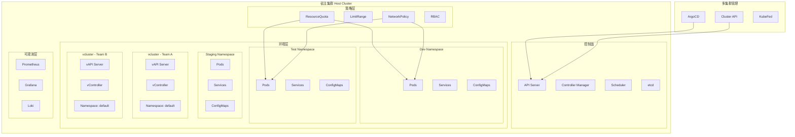
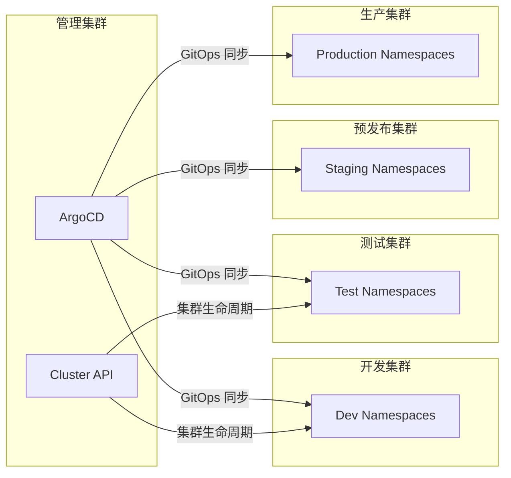

# Kubernetes环境管理

## 背景与问题定义

在上一讲中，我们从策略层面讨论了环境管理的核心问题——需要哪些环境、环境如何递进、环境如何供给与治理。这一讲把镜头拉近，聚焦技术实现：为什么 Kubernetes 能成为环境管理的事实标准，以及如何利用它的原生能力构建高效的环境管理体系。

在云原生时代之前，环境管理面临的核心痛点是：

- **环境创建慢**：创建一套测试环境需要数天甚至数周，涉及虚拟机申请、网络配置、中间件安装等繁琐步骤
- **环境不一致**：开发用 Docker Compose、测试用虚拟机、生产用物理机，技术栈差异导致问题难以复现
- **资源利用率低**：环境长期占用资源，但实际利用率往往不到 20%
- **环境治理难**：配置漂移、资源泄漏、安全隔离等问题缺乏系统性的解决方案

Kubernetes 之所以成为环境管理的事实标准，根本原因在于它提供了一套统一的、声明式的、可编程的基础设施抽象层。在 Kubernetes 之上，环境管理的核心对象——计算资源、网络策略、存储卷、配置项——都有了标准化的 API 定义和管理方式。

根据 CNCF 2023 年度调查，66% 的受访组织已在生产环境运行 Kubernetes，另有 18% 在评估中（合计 84%）。这意味着，以 Kubernetes 为核心构建环境管理体系，已经成为行业共识。

## 核心概念

### Kubernetes 作为环境管理的事实标准

Kubernetes 为环境管理提供了以下核心能力：

**声明式配置（Declarative Configuration）**

Kubernetes 的所有资源都通过 YAML/JSON 声明式定义。环境的需求被编码为代码，存储在版本控制系统中，实现了环境配置的可审计、可回滚、可复现。

**自愈能力（Self-Healing）**

Kubernetes 的控制器模式持续将实际状态收敛到声明状态。当 Pod 异常退出、Node 故障时，系统会自动重建或调度，保证环境的可用性。

**资源隔离（Resource Isolation）**

通过 Namespace、ResourceQuota、LimitRange、NetworkPolicy 等机制，Kubernetes 提供了多租户隔离的完整方案，使多个环境可以在同一集群内安全共存。

**可编程接口（Programmable API）**

Kubernetes 的 API 是完全可编程的，可以通过 Controller、Operator、CRD 等机制扩展环境管理能力，实现环境供给的自动化。

**生态成熟（Ecosystem Maturity）**

Helm、Kustomize、ArgoCD、Flux 等工具构成了完整的环境管理工具链，覆盖了从模板化、差异化到持续部署的全生命周期。

### Namespace 隔离 vs vcluster 虚拟集群

在 Kubernetes 中，环境隔离有两个层面的实现：Namespace 级别的软隔离和 vcluster 级别的硬隔离。

**Namespace 隔离**

Namespace 是 Kubernetes 原生的逻辑隔离机制。同一集群内的不同环境使用不同的 Namespace，通过 RBAC、ResourceQuota、NetworkPolicy 等策略实现隔离。

优势：
- 零额外成本，Kubernetes 原生支持
- 管理简单，不需要额外的基础设施
- 资源共享效率高，集群级资源统一调度

劣势：
- 隔离不彻底，集群级资源（CRD、PV、StorageClass）仍然共享
- 无法运行不同版本的 Kubernetes
- RBAC 配置复杂，权限泄漏风险
- 命名冲突（Service、Secret 等）

**vcluster 虚拟集群**

vcluster 是在 Kubernetes 集群内创建虚拟集群的技术。每个虚拟集群拥有独立的 API Server、Controller Manager、Scheduler，但实际的计算资源仍然运行在宿主集群的 Namespace 中。

优势：
- 接近真实集群的隔离体验
- 独立的 RBAC、CRD、API 资源
- 可以运行不同版本的 Kubernetes
- 租户自治，减少集群管理员负担

劣势：
- 额外的资源开销（API Server、etcd 等）
- 网络和存储配置更复杂
- 管理面增加，故障排查链路更长

| 维度 | Namespace 隔离 | vcluster 虚拟集群 |
|------|---------------|-----------------|
| 隔离级别 | 逻辑隔离 | 虚拟集群级隔离 |
| 资源开销 | 无额外开销 | 每个虚拟集群约 1-2 GB 内存 |
| 管理复杂度 | 低 | 中 |
| RBAC 独立性 | 共享集群级 RBAC | 独立 RBAC |
| CRD 共享 | 共享 | 独立 |
| K8s 版本 | 与宿主集群一致 | 可独立选择 |
| 适用场景 | 同团队多环境 | 多团队/多租户 |
| 网络隔离 | NetworkPolicy | NetworkPolicy + 额外配置 |
| 成熟度 | 生产就绪 | 快速成熟中 |

## 架构设计

### Kubernetes 环境管理架构



### 多集群环境架构

对于大规模组织，单一集群往往无法满足所有需求。多集群架构是环境管理的进阶形态：



多集群架构的优势在于：
- **物理隔离**：不同环境部署在不同集群，彻底消除环境间干扰
- **故障隔离**：一个集群的故障不会影响其他环境
- **合规要求**：生产环境可以部署在专用集群，满足监管要求
- **版本管理**：不同集群可以运行不同版本的 Kubernetes

多集群架构的挑战在于：
- **管理复杂度**：多个集群的升级、维护、监控成本倍增
- **网络互联**：跨集群的服务通信需要额外的网络方案
- **资源碎片**：集群间资源无法共享，可能导致浪费

### 环境管理工具对比

| 工具 | 定位 | 核心能力 | 适用场景 |
|------|------|---------|---------|
| ArgoCD | GitOps 持续部署 | 多集群同步、Application 管理 | 所有规模 |
| Flux | GitOps 持续部署 | 轻量级、Kubernetes 原生 | 中小规模 |
| Cluster API | 集群生命周期管理 | 声明式集群创建/删除 | 多集群管理 |
| KubeFed | 多集群联邦 | 跨集群资源分发 | 大规模多集群 |
| vcluster | 虚拟集群 | Namespace 内的独立集群 | 多租户隔离 |
| Kubectl + Kustomize | 命令行部署 | 模板化、差异化配置 | 小规模/脚本化 |
| Helm | 包管理 | 应用打包与发布 | 应用级部署 |

## 实现方案

### Namespace + ResourceQuota 配置示例

以下是一个完整的 Kubernetes 环境管理配置方案，从 Namespace 创建到资源配额、网络策略的全链路实现：

```yaml
# ============================================================
# 完整的环境管理配置方案
# 包含：Namespace、ResourceQuota、LimitRange、RBAC、NetworkPolicy
# ============================================================

# --- 开发环境 ---
apiVersion: v1
kind: Namespace
metadata:
  name: dev
  labels:
    env: dev
    pod-security.kubernetes.io/enforce: baseline
    pod-security.kubernetes.io/audit: restricted
    pod-security.kubernetes.io/warn: restricted
---
apiVersion: v1
kind: ResourceQuota
metadata:
  name: dev-compute-quota
  namespace: dev
spec:
  hard:
    requests.cpu: "8"
    requests.memory: 16Gi
    limits.cpu: "16"
    limits.memory: 32Gi
    pods: "30"
  scopeSelector:
    matchExpressions:
    - operator: In
      scopeName: PriorityClass
      values: ["low", "medium"]
---
apiVersion: v1
kind: ResourceQuota
metadata:
  name: dev-object-quota
  namespace: dev
spec:
  hard:
    services: "10"
    persistentvolumeclaims: "10"
    requests.storage: 50Gi
    configmaps: "20"
    secrets: "30"
    replicationcontrollers: "0"  # 禁止 RC，强制使用 Deployment
---
apiVersion: v1
kind: LimitRange
metadata:
  name: dev-limit-range
  namespace: dev
spec:
  limits:
  - type: Container
    default:
      cpu: "500m"
      memory: "512Mi"
    defaultRequest:
      cpu: "100m"
      memory: "128Mi"
    max:
      cpu: "2"
      memory: "2Gi"
    min:
      cpu: "50m"
      memory: "64Mi"
    maxLimitRequestRatio:
      cpu: "4"      # limit/request 比值不超过 4
      memory: "4"
  - type: Pod
    max:
      cpu: "4"
      memory: "4Gi"
  - type: PersistentVolumeClaim
    max:
      storage: 10Gi
    min:
      storage: 1Gi

# --- 测试环境 ---
apiVersion: v1
kind: Namespace
metadata:
  name: test
  labels:
    env: test
    pod-security.kubernetes.io/enforce: restricted
---
apiVersion: v1
kind: ResourceQuota
metadata:
  name: test-compute-quota
  namespace: test
spec:
  hard:
    requests.cpu: "16"
    requests.memory: 32Gi
    limits.cpu: "32"
    limits.memory: 64Gi
    pods: "60"
---
apiVersion: v1
kind: LimitRange
metadata:
  name: test-limit-range
  namespace: test
spec:
  limits:
  - type: Container
    default:
      cpu: "1000m"
      memory: "1Gi"
    defaultRequest:
      cpu: "200m"
      memory: "256Mi"
    max:
      cpu: "4"
      memory: "4Gi"
    min:
      cpu: "100m"
      memory: "128Mi"

# --- 预发布环境 ---
apiVersion: v1
kind: Namespace
metadata:
  name: staging
  labels:
    env: staging
    pod-security.kubernetes.io/enforce: restricted
---
apiVersion: v1
kind: ResourceQuota
metadata:
  name: staging-compute-quota
  namespace: staging
spec:
  hard:
    requests.cpu: "32"
    requests.memory: 64Gi
    limits.cpu: "64"
    limits.memory: 128Gi
    pods: "120"
---
apiVersion: v1
kind: LimitRange
metadata:
  name: staging-limit-range
  namespace: staging
spec:
  limits:
  - type: Container
    default:
      cpu: "1000m"
      memory: "1Gi"
    defaultRequest:
      cpu: "500m"
      memory: "512Mi"
    max:
      cpu: "8"
      memory: "8Gi"
    min:
      cpu: "200m"
      memory: "256Mi"
```

### RBAC 配置示例

```yaml
# ============================================================
# 环境级 RBAC 配置
# 原则：最小权限、环境隔离、角色分层
# ============================================================

# --- 开发者角色：只能操作 dev 命名空间 ---
apiVersion: rbac.authorization.k8s.io/v1
kind: Role
metadata:
  name: developer
  namespace: dev
rules:
- apiGroups: ["", "apps", "batch"]
  resources: ["pods", "deployments", "services", "configmaps", "jobs"]
  verbs: ["get", "list", "watch", "create", "update", "patch", "delete"]
- apiGroups: [""]
  resources: ["secrets"]
  verbs: ["get", "list"]  # 开发者只能查看 Secret，不能创建/修改
- apiGroups: ["apps"]
  resources: ["deployments"]
  verbs: ["rollback"]  # 允许回滚
- apiGroups: [""]
  resources: ["pods/log", "pods/exec"]
  verbs: ["get", "create"]  # 允许查看日志和进入容器
---
# 开发者绑定：将开发者角色绑定到开发组
apiVersion: rbac.authorization.k8s.io/v1
kind: RoleBinding
metadata:
  name: developer-binding
  namespace: dev
subjects:
- kind: Group
  name: dev-team
  apiGroup: rbac.authorization.k8s.io
roleRef:
  kind: Role
  name: developer
  apiGroup: rbac.authorization.k8s.io

---
# --- QA 角色：可以操作 dev 和 test 命名空间 ---
apiVersion: rbac.authorization.k8s.io/v1
kind: Role
metadata:
  name: qa-engineer
  namespace: test
rules:
- apiGroups: ["", "apps", "batch"]
  resources: ["pods", "deployments", "services", "configmaps", "jobs"]
  verbs: ["get", "list", "watch"]
- apiGroups: [""]
  resources: ["pods/log", "pods/exec"]
  verbs: ["get", "create"]
- apiGroups: ["batch"]
  resources: ["jobs"]
  verbs: ["create", "delete"]  # QA 可以创建/删除测试 Job
---
apiVersion: rbac.authorization.k8s.io/v1
kind: RoleBinding
metadata:
  name: qa-engineer-binding
  namespace: test
subjects:
- kind: Group
  name: qa-team
  apiGroup: rbac.authorization.k8s.io
roleRef:
  kind: Role
  name: qa-engineer
  apiGroup: rbac.authorization.k8s.io

---
# --- SRE 角色：可以操作 staging 和 production ---
apiVersion: rbac.authorization.k8s.io/v1
kind: Role
metadata:
  name: sre
  namespace: staging
rules:
- apiGroups: ["*"]
  resources: ["*"]
  verbs: ["get", "list", "watch"]
- apiGroups: ["", "apps", "batch"]
  resources: ["pods", "deployments", "services", "configmaps", "jobs", "horizontalpodautoscalers"]
  verbs: ["get", "list", "watch", "create", "update", "patch", "delete"]
- apiGroups: [""]
  resources: ["pods/log", "pods/exec", "pods/portforward"]
  verbs: ["get", "create"]
---
apiVersion: rbac.authorization.k8s.io/v1
kind: RoleBinding
metadata:
  name: sre-staging-binding
  namespace: staging
subjects:
- kind: Group
  name: sre-team
  apiGroup: rbac.authorization.k8s.io
roleRef:
  kind: Role
  name: sre
  apiGroup: rbac.authorization.k8s.io
```

### NetworkPolicy 环境隔离示例

```yaml
# ============================================================
# 网络策略：实现环境间的网络隔离
# 原则：默认拒绝，按需放行
# ============================================================

# --- 开发环境：默认拒绝所有入站和出站流量 ---
apiVersion: networking.k8s.io/v1
kind: NetworkPolicy
metadata:
  name: default-deny-all
  namespace: dev
spec:
  podSelector: {}  # 应用于所有 Pod
  policyTypes:
  - Ingress
  - Egress
---
# 开发环境：允许内部通信和必要的出站
apiVersion: networking.k8s.io/v1
kind: NetworkPolicy
metadata:
  name: dev-allow-internal
  namespace: dev
spec:
  podSelector: {}
  policyTypes:
  - Ingress
  - Egress
  ingress:
  - from:
    - namespaceSelector:
        matchLabels:
          env: dev  # 允许同环境内部通信
  egress:
  - to:
    - namespaceSelector:
        matchLabels:
          env: dev
  - to:  # 允许 DNS 解析
    - namespaceSelector:
        matchLabels:
          kubernetes.io/metadata.name: kube-system
    ports:
    - protocol: UDP
      port: 53
    - protocol: TCP
      port: 53
  - to:  # 允许访问公网（排除内网网段）
    - ipBlock:
        cidr: 0.0.0.0/0
        except:
          - 10.0.0.0/8      # 禁止访问内网
          - 172.16.0.0/12
          - 192.168.0.0/16
    ports:
    - protocol: TCP
      port: 443
    - protocol: TCP
      port: 80

---
# --- 测试环境：允许来自开发环境的流量（CI/CD 部署）---
apiVersion: networking.k8s.io/v1
kind: NetworkPolicy
metadata:
  name: test-allow-ci-cd
  namespace: test
spec:
  podSelector:
    matchLabels:
      app: deploy-target  # 只对部署目标 Pod 放行
  policyTypes:
  - Ingress
  ingress:
  - from:
    - namespaceSelector:
        matchLabels:
          env: dev  # CI/CD Runner 所在命名空间
    ports:
    - protocol: TCP
      port: 8080

---
# --- 预发布环境：严格隔离，只允许监控和 SRE 访问 ---
apiVersion: networking.k8s.io/v1
kind: NetworkPolicy
metadata:
  name: staging-strict-isolation
  namespace: staging
spec:
  podSelector: {}
  policyTypes:
  - Ingress
  - Egress
  ingress:
  - from:
    - namespaceSelector:
        matchLabels:
          env: staging
    - namespaceSelector:
        matchLabels:
          app: monitoring  # 允许 Prometheus 采集指标
  egress:
  - to:
    - namespaceSelector:
        matchLabels:
          env: staging
  - to:  # DNS
    - namespaceSelector:
        matchLabels:
          kubernetes.io/metadata.name: kube-system
    ports:
    - protocol: UDP
      port: 53
    - protocol: TCP
      port: 53
  - to:  # 允许访问外部依赖（支付网关等）
    - ipBlock:
        cidr: 0.0.0.0/0
        except:
          - 10.0.0.0/8
          - 172.16.0.0/12
          - 192.168.0.0/16
    ports:
    - protocol: TCP
      port: 443

---
# --- 生产环境：最严格的网络策略 ---
apiVersion: networking.k8s.io/v1
kind: NetworkPolicy
metadata:
  name: production-default-deny
  namespace: production
spec:
  podSelector: {}
  policyTypes:
  - Ingress
  - Egress
---
# 生产环境：只允许 Ingress Controller 访问
apiVersion: networking.k8s.io/v1
kind: NetworkPolicy
metadata:
  name: production-allow-ingress
  namespace: production
spec:
  podSelector:
    matchLabels:
      expose: external
  policyTypes:
  - Ingress
  ingress:
  - from:
    - namespaceSelector:
        matchLabels:
          app.kubernetes.io/name: ingress-11-Nginx基础概述
    ports:
    - protocol: TCP
      port: 8080
    - protocol: TCP
      port: 8443
---
# 生产环境：允许微服务间内部通信
apiVersion: networking.k8s.io/v1
kind: NetworkPolicy
metadata:
  name: production-allow-internal
  namespace: production
spec:
  podSelector: {}
  policyTypes:
  - Ingress
  - Egress
  ingress:
  - from:
    - namespaceSelector:
        matchLabels:
          env: production
  egress:
  - to:
    - namespaceSelector:
        matchLabels:
          env: production
  - to:
    - namespaceSelector:
        matchLabels:
          kubernetes.io/metadata.name: kube-system
    ports:
    - protocol: UDP
      port: 53
    - protocol: TCP
      port: 53
```

### ArgoCD 多集群环境管理配置

```yaml
# ============================================================
# ArgoCD Application：多环境 GitOps 部署
# ============================================================

# 开发环境应用
apiVersion: argoproj.io/v1alpha1
kind: Application
metadata:
  name: myapp-dev
  namespace: argocd
  labels:
    env: dev
    team: platform
  finalizers:
  - resources-finalizer.argocd.argoproj.io
spec:
  project: dev-project
  source:
    repoURL: https://github.com/org/myapp-manifests.git
    targetRevision: main
    path: overlays/dev
  destination:
    server: https://kubernetes.default.svc  # 同一集群
    namespace: dev
  syncPolicy:
    automated:
      prune: true
      selfHeal: true
      allowEmpty: false
    syncOptions:
    - CreateNamespace=false
    - PrunePropagationPolicy=foreground
    retry:
      limit: 3
      backoff:
        duration: 5s
        factor: 2
        maxDuration: 3m

---
# 预发布环境应用
apiVersion: argoproj.io/v1alpha1
kind: Application
metadata:
  name: myapp-staging
  namespace: argocd
  labels:
    env: staging
    team: platform
  finalizers:
  - resources-finalizer.argocd.argoproj.io
spec:
  project: staging-project
  source:
    repoURL: https://github.com/org/myapp-manifests.git
    targetRevision: main
    path: overlays/staging
  destination:
    server: https://staging-cluster.example.com  # 预发布集群
    namespace: staging
  syncPolicy:
    automated:
      prune: true
      selfHeal: false  # 预发布环境自动同步 Git 变更，但不自动纠正漂移
    syncOptions:
    - CreateNamespace=false

---
# 生产环境应用
apiVersion: argoproj.io/v1alpha1
kind: Application
metadata:
  name: myapp-production
  namespace: argocd
  labels:
    env: production
    team: platform
  finalizers:
  - resources-finalizer.argocd.argoproj.io
  annotations:
    notifications.argoproj.io/subscribe.on-deployed.slack: platform-alerts
    notifications.argoproj.io/subscribe.on-health-degraded.pagerduty: sre-oncall
spec:
  project: production-project
  source:
    repoURL: https://github.com/org/myapp-manifests.git
    targetRevision: v1.2.3  # 锁定版本标签，不允许跟踪 main
    path: overlays/production
  destination:
    server: https://production-cluster.example.com
    namespace: production
  syncPolicy:
    # 生产环境不启用 automated 自动同步，由人工审批后手动触发
    syncOptions:
    - CreateNamespace=false
    - PrunePropagationPolicy=background
  ignoreDifferences:
  - group: apps
    kind: Deployment
    jsonPointers:
    - /spec/replicas  # 忽略 HPA 导致的副本数差异

---
# ArgoCD Project：环境级别的项目隔离
apiVersion: argoproj.io/v1alpha1
kind: AppProject
metadata:
  name: production-project
  namespace: argocd
spec:
  description: Production environment deployments
  sourceRepos:
  - 'https://github.com/org/myapp-manifests.git'
  destinations:
  - namespace: production
    server: https://production-cluster.example.com
  clusterResourceWhitelist:
  - group: ''
    kind: Namespace
  namespaceResourceBlacklist:
  - group: ''
    kind: ResourceQuota  # 禁止通过 ArgoCD 修改 ResourceQuota
  - group: ''
    kind: LimitRange
  roles:
  - name: sre
    description: SRE team can sync and manage production apps
    policies:
    - p, proj:production-project:sre, applications, get, production-project/*, allow
    - p, proj:production-project:sre, applications, sync, production-project/*, allow
    - p, proj:production-project:sre, applications, update, production-project/*, allow
    groups:
    - sre-team
```

### Cluster API 集群生命周期管理

```yaml
# ============================================================
# Cluster API：声明式集群创建
# 在管理集群上应用此配置，自动创建新的工作负载集群
# ============================================================
apiVersion: cluster.x-k8s.io/v1beta1
kind: Cluster
metadata:
  name: test-cluster
  labels:
    env: test
    team: platform
spec:
  clusterNetwork:
    pods:
      cidrBlocks: ["192.168.0.0/16"]
    services:
      cidrBlocks: ["10.96.0.0/12"]
    serviceDomain: cluster.local
  infrastructureRef:
    apiVersion: infrastructure.cluster.x-k8s.io/v1beta1
    kind: AWSCluster
    name: test-cluster
  controlPlaneRef:
    apiVersion: controlplane.cluster.x-k8s.io/v1beta1
    kind: KubeadmControlPlane
    name: test-cluster-control-plane
---
apiVersion: infrastructure.cluster.x-k8s.io/v1beta1
kind: AWSCluster
metadata:
  name: test-cluster
spec:
  region: us-west-2
  sshKeyName: cluster-api
  network:
    vpc:
      id: vpc-0123456789abcdef0
  controlPlaneLoadBalancer:
    loadBalancerType: nlb
---
apiVersion: controlplane.cluster.x-k8s.io/v1beta1
kind: KubeadmControlPlane
metadata:
  name: test-cluster-control-plane
spec:
  replicas: 3
  machineTemplate:
    infrastructureRef:
      apiVersion: infrastructure.cluster.x-k8s.io/v1beta1
      kind: AWSMachineTemplate
      name: test-cluster-control-plane
  kubeadmConfigSpec:
    initConfiguration:
      nodeRegistration:
        kubeletExtraArgs:
          eviction-hard: nodefs.available<10%,memory.available<100Mi
    joinConfiguration:
      nodeRegistration:
        kubeletExtraArgs:
          eviction-hard: nodefs.available<10%,memory.available<100Mi
  version: v1.36.0
---
apiVersion: infrastructure.cluster.x-k8s.io/v1beta1
kind: AWSMachineTemplate
metadata:
  name: test-cluster-control-plane
spec:
  template:
    spec:
      instanceType: m5.xlarge
      iamInstanceProfile: nodes.cluster-api-provider-aws.sigs.k8s.io
      rootVolume:
        size: 100
        type: gp3
---
apiVersion: cluster.x-k8s.io/v1beta1
kind: MachineDeployment
metadata:
  name: test-cluster-md-0
  labels:
    env: test
    node-pool: general
spec:
  clusterName: test-cluster
  replicas: 5
  selector:
    matchLabels:
      env: test
      node-pool: general
  template:
    spec:
      clusterName: test-cluster
      version: v1.36.0
      bootstrap:
        configRef:
          apiVersion: bootstrap.cluster.x-k8s.io/v1beta1
          kind: KubeadmConfigTemplate
          name: test-cluster-md-0
      infrastructureRef:
        apiVersion: infrastructure.cluster.x-k8s.io/v1beta1
        kind: AWSMachineTemplate
        name: test-cluster-md-0
---
apiVersion: infrastructure.cluster.x-k8s.io/v1beta1
kind: AWSMachineTemplate
metadata:
  name: test-cluster-md-0
spec:
  template:
    spec:
      instanceType: m5.large
      iamInstanceProfile: nodes.cluster-api-provider-aws.sigs.k8s.io
      rootVolume:
        size: 50
        type: gp3
```

## 最佳实践

### 实践一：环境配置的 Kustomize 组织

使用 Kustomize 管理多环境配置差异，遵循 DRY（Don't Repeat Yourself）原则：

```
manifests/
├── base/                           # 所有环境共享的基础配置
│   ├── kustomization.yaml
│   ├── deployment.yaml
│   ├── service.yaml
│   └── hpa.yaml
└── overlays/
    ├── dev/
    │   ├── kustomization.yaml      # 引用 base + 覆盖
    │   ├── increase-replicas.yaml  # 开发环境只需 1 副本
    │   └── set-resources.yaml      # 开发环境资源限制较低
    ├── test/
    │   ├── kustomization.yaml
    │   └── set-resources.yaml
    ├── staging/
    │   ├── kustomization.yaml
    │   ├── set-resources.yaml
    │   └── production-replicas.yaml
    └── production/
        ├── kustomization.yaml
        ├── set-resources.yaml
        ├── production-replicas.yaml
        └── pod-disruption-budget.yaml
```

Kustomize 的优势在于：配置差异显式化、变更可审计、回滚简单。每个 overlay 只包含与 base 的差异，避免了配置的重复和遗漏。

### 实践二：环境准入控制（Admission Control）

通过 Kubernetes Admission Controller 对环境操作进行约束：

| 准入策略 | 实现方式 | 目标环境 | 说明 |
|---------|---------|---------|------|
| 禁止运行特权容器 | Pod Security Admission | 所有环境 | 安全基线 |
| 强制设置资源限制 | ValidatingWebhook | 所有环境 | 防止资源抢占 |
| 禁止 latest 标签 | ValidatingWebhook | staging/prod | 确保可追溯性 |
| 强制设置资源请求 | ValidatingWebhook | 所有环境 | 调度公平性 |
| 限制镜像来源 | OPA/Gatekeeper | staging/prod | 只允许私有仓库 |
| 禁止 NodePort | ValidatingWebhook | staging/prod | 统一入口管理 |
| 强制注入 Sidecar | MutatingWebhook | 所有环境 | 可观测性注入 |

### 实践三：GitOps 驱动的环境管理

GitOps 是 Kubernetes 环境管理的推荐实践。其核心原则是：

1. **声明式**：所有环境配置以声明式代码存储在 Git 中
2. **版本化**：Git 提供完整的变更历史和回滚能力
3. **自动同步**：ArgoCD/Flux 持续将 Git 状态同步到集群
4. **审计追踪**：所有变更通过 Git 提交记录，满足审计要求

GitOps 在不同环境中的实施策略：

| 环境 | 自动同步 | 审批要求 | 分支策略 |
|------|---------|---------|---------|
| Dev | 自动同步 | 无 | main 分支 |
| Test | 自动同步 | CI 通过 | main 分支 |
| Staging | 半自动 | 1 人审批 | release 分支 |
| Production | 手动触发 | 2 人审批 | tag 锁定 |

### 实践四：环境容量规划与弹性

Kubernetes 环境的容量规划应遵循以下原则：

1. **开发环境**：使用 Cluster Autoscaler + Spot 实例，降低成本
2. **测试环境**：按需伸缩，非工作时间缩容
3. **预发布环境**：保持与生产环境对等的计算能力，但可以适度缩容
4. **生产环境**：预留充足的资源缓冲，使用 On-Demand 实例保证稳定性

非生产环境的弹性策略：

```yaml
# 测试环境 CronHPA：工作时间扩容，非工作时间缩容
apiVersion: autoscaling.alibabacloud.com/v1alpha1
kind: CronHorizontalPodAutoscaler
metadata:
  name: test-env-scaler
  namespace: test
spec:
  scaleTargetRef:
    apiVersion: apps/v1
    kind: Deployment
    name: myapp
  jobs:
  - name: scale-up-morning
    schedule: "0 9 * * 1-5"    # 工作日 9:00 扩容
    targetSize: 3
  - name: scale-down-evening
    schedule: "0 20 * * 1-5"   # 工作日 20:00 缩容
    targetSize: 1
  - name: scale-down-weekend
    schedule: "0 18 * * 0,6"   # 周末 18:00 缩容
    targetSize: 1
```

## 效果度量

Kubernetes 环境管理的效果可以通过以下指标来度量：

| 度量指标 | 定义 | 目标值 | 采集方式 |
|---------|------|--------|---------|
| 环境创建时间 | 从申请到环境可用的时间 | < 10 分钟 | ArgoCD Sync 状态 |
| 配置漂移率 | 实际状态与声明状态的偏差比例 | < 1% | ArgoCD Health Status |
| 资源利用率 | 实际使用量 / 配额总量 | 40-70% | Prometheus + Kubecost |
| 环境可用性 | 环境正常运行时间 / 总时间 | > 99.9%（prod）| Uptime 监控 |
| 部署成功率 | 成功部署次数 / 总部署次数 | > 95% | ArgoCD Sync 历史 |
| 安全合规率 | 通过准入控制检查的资源比例 | 100% | OPA 审计日志 |
| 多集群同步延迟 | Git 提交到集群生效的时间 | < 5 分钟 | ArgoCD Sync 时间 |

**关键度量看板**：

```yaml
# Prometheus 规则：环境度量指标
apiVersion: monitoring.coreos.com/v1
kind: PrometheusRule
metadata:
  name: environment-metrics
  namespace: monitoring
spec:
  groups:
  - name: environment
    rules:
    # 资源利用率
    - record: env:resource_utilization:ratio
      expr: |
        sum(kube_pod_container_resource_requests{namespace=~"dev|test|staging|production"}) by (namespace)
        /
        sum(kube_resourcequota{type="hard", namespace=~"dev|test|staging|production", resource=~"requests.cpu|requests.memory"}) by (namespace)

    # 环境可用性
    - record: env:availability:ratio
      expr: |
        avg(up{job="kubelet", namespace=~"dev|test|staging|production"}) by (namespace)

    # 未设置资源限制的 Pod
    - alert: MissingResourceLimits
      expr: |
        kube_pod_container_resource_limits == 0
        and on (namespace, pod) kube_pod_status_phase{phase="Running"} == 1
      for: 10m
      labels:
        severity: warning
      annotations:
        summary: "Pod {{ $labels.namespace }}/{{ $labels.pod }} 缺少资源限制"
        description: "容器 {{ $labels.container }} 未设置资源限制，可能影响环境稳定性"
```

## 总结

Kubernetes 已经成为环境管理的事实标准，这并非偶然。其声明式配置、自愈能力、资源隔离和可编程 API，为环境管理提供了完美的技术基础。

本文的核心要点：

1. **Namespace 是基础隔离单元**：对于大多数场景，Namespace + ResourceQuota + NetworkPolicy + RBAC 已经能够满足环境隔离需求
2. **vcluster 是进阶选择**：当 Namespace 隔离不够时，vcluster 提供了虚拟集群级别的隔离，适用于多团队/多租户场景
3. **资源配额是安全网**：ResourceQuota 和 LimitRange 是防止资源抢占和环境干扰的最后防线，每个 Namespace 都必须配置
4. **网络策略是防火墙**：默认拒绝、按需放行的网络策略，是环境间安全隔离的基石
5. **多集群是终极方案**：对于合规要求高、故障隔离需求强的场景，多集群架构提供了物理级别的环境隔离
6. **GitOps 是管理范式**：ArgoCD/Flux + Git 实现了环境配置的版本化、自动化、可审计管理

在下一部分中，我们将深入环境隔离与资源配额的细节，探讨多租户策略的软隔离与硬隔离选择、成本归集与分摊、以及环境资源的弹性伸缩策略。
