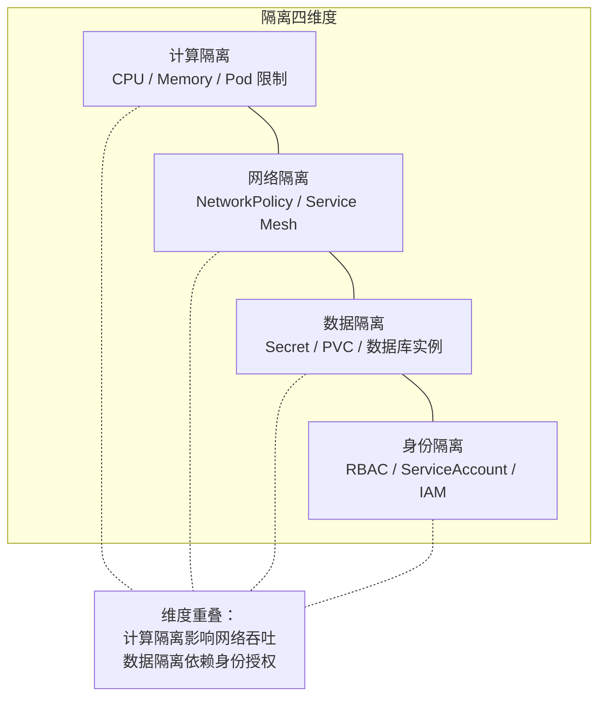
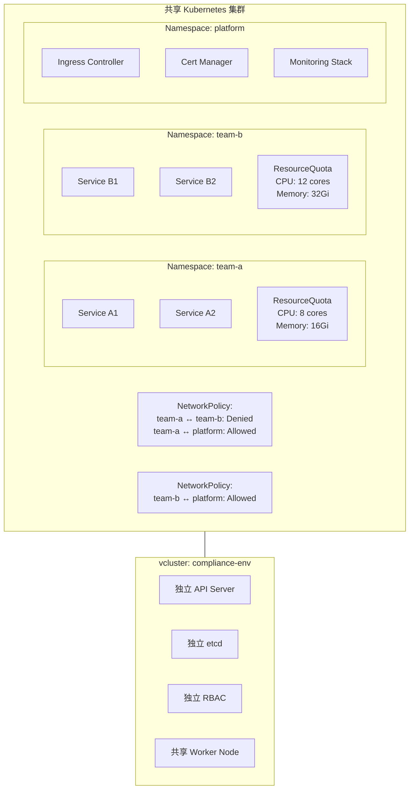
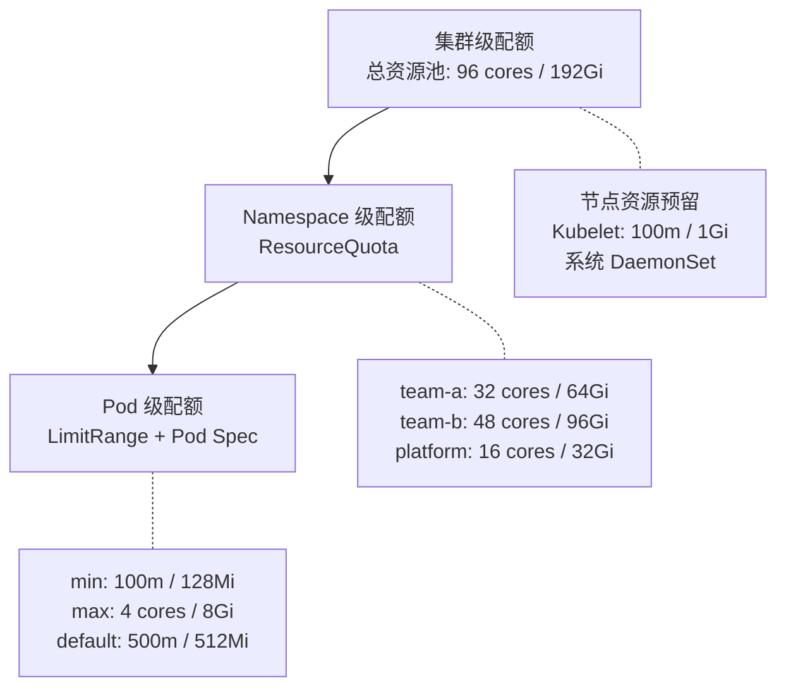

# 环境隔离与资源配额

## 背景与问题定义

在多团队共享基础设施的组织中，环境隔离与资源配额是一对相互制约的命题：隔离不足，团队之间就会互相干扰——一个团队的压测拖垮另一个团队的服务，一个团队的数据泄露到另一个团队的环境；配额过严，团队无法自助扩展——申请资源变成漫长流程，业务节奏被迫放缓。两者必须同时设计，缺一不可。

核心问题：**如何在保障团队间充分隔离的前提下，实现资源的弹性分配与高效利用？**

## 核心概念

### 隔离的四个维度

环境隔离不仅是"命名空间不同"，它涉及四个独立但相互关联的维度：



| 维度 | 隔离目标 | Kubernetes 实现 | 风险 |
|------|---------|----------------|------|
| 计算隔离 | 防止资源争抢 | ResourceQuota、LimitRange、PriorityClass | 资源饥饿、Pod 被驱逐 |
| 网络隔离 | 防止未授权通信 | NetworkPolicy、Istio AuthorizationPolicy | 误阻断合法流量 |
| 数据隔离 | 防止数据泄漏 | Namespace 级 Secret、独立 PVC、独立数据库 | 密钥泄露、数据串环境 |
| 身份隔离 | 防止越权操作 | RBAC、ServiceAccount、Namespace 绑定 | 权限过大、误操作 |

### 软隔离 vs 硬隔离

| 对比维度 | 软隔离（Namespace） | 硬隔离（vcluster / 独立集群） |
|---------|-------------------|--------------------------|
| 隔离强度 | 逻辑隔离，共享底层资源 | 物理或虚拟隔离，独立控制平面 |
| 成本 | 低——共享节点池 | 高——需要独立控制平面节点 |
| 管理复杂度 | 低——单一集群管理 | 高——多集群管理 |
| 灵活性 | 高——可动态调整配额 | 低——资源预分配 |
| 安全性 | 中——依赖 RBAC 和 NetworkPolicy | 高——独立的 API Server 和 etcd |
| 适用场景 | 同组织内团队隔离 | 跨组织、合规要求高、完全独立 |
| 故障影响 | 共享节点故障影响多个环境 | 独立集群故障只影响本环境 |

### 资源配额机制

Kubernetes 提供三级资源控制机制：

| 机制 | 作用范围 | 功能 |
|------|---------|------|
| ResourceQuota | Namespace 级 | 限制 Namespace 的总资源消耗（CPU/Memory/Pod 数量/存储等） |
| LimitRange | Namespace 级 | 限制单个 Pod/Container 的资源范围（min/max/default） |
| PriorityClass | 集群级 | 定义 Pod 优先级，高优先级 Pod 在资源紧张时优先调度 |

## 架构设计

### 多租户隔离架构



### 资源配额分层模型



## 实现方案

### ResourceQuota 配置示例

```yaml
# team-a Namespace 的资源配额
apiVersion: v1
kind: ResourceQuota
metadata:
  name: team-a-quota
  namespace: team-a
spec:
  hard:
    # 计算资源
    requests.cpu: "32"
    requests.memory: "64Gi"
    limits.cpu: "48"
    limits.memory: "96Gi"

    # 对象数量
    count/pods: "100"
    count/services: "50"
    count/deployments: "30"
    count/replicasets: "60"
    count/statefulsets: "10"
    count/jobs: "20"

    # 存储
    requests.storage: "500Gi"
    persistentvolumeclaims: "20"

    # 网络与安全
    count/ingresses: "10"
    count/secrets: "50"
    count/configmaps: "100"
---
# LimitRange: 定义 Pod 的资源范围
apiVersion: v1
kind: LimitRange
metadata:
  name: team-a-limits
  namespace: team-a
spec:
  limits:
    - type: Container
      default:
        cpu: "500m"
        memory: "512Mi"
      defaultRequest:
        cpu: "100m"
        memory: "128Mi"
      max:
        cpu: "4"
        memory: "8Gi"
      min:
        cpu: "50m"
        memory: "64Mi"
    - type: Pod
      max:
        cpu: "8"
        memory: "16Gi"
```

### NetworkPolicy 配置示例

```yaml
# team-a 的网络隔离策略
apiVersion: networking.k8s.io/v1
kind: NetworkPolicy
metadata:
  name: team-a-isolation
  namespace: team-a
spec:
  podSelector: {}    # 应用到 Namespace 内所有 Pod
  policyTypes:
    - Ingress
    - Egress
  ingress:
    # 允许同 Namespace 内的通信
    - from:
        - namespaceSelector:
            matchLabels:
              name: team-a
    # 允许 platform Namespace 的通信（Ingress、监控等）
    - from:
        - namespaceSelector:
            matchLabels:
              name: platform
    # 允许集群内 DNS 解析
    - from:
        - namespaceSelector:
            matchLabels:
              name: kube-system
        ports:
          - port: 53
            protocol: UDP
  egress:
    # 允许同 Namespace 内的通信
    - to:
        - namespaceSelector:
            matchLabels:
              name: team-a
    # 允许访问 platform Namespace
    - to:
        - namespaceSelector:
            matchLabels:
              name: platform
    # 允许 DNS 解析
    - to:
        - namespaceSelector:
            matchLabels:
              name: kube-system
        ports:
          - port: 53
            protocol: UDP
    # 允许访问外部服务（数据库、第三方 API）
    - to:
        - ipBlock:
            cidr: 0.0.0.0/0
            except:
              - 10.0.0.0/8      # 阻止访问其他 Namespace 的 Pod IP
```

### vcluster 配置示例

vcluster 提供轻量级虚拟集群，在共享物理集群内创建独立的 Kubernetes 控制平面：

以下为 vcluster 配置的示意结构（实际部署通过 Helm chart 的 values 文件完成，字段以 vcluster 官方文档为准）：

```yaml
# vcluster 配置示意
apiVersion: vcluster.example.com/v1
kind: VirtualCluster
metadata:
  name: compliance-env
  namespace: vcluster-system
spec:
  # 虚拟集群的控制平面资源
  apiServer:
    replicas: 1
    resources:
      requests:
        cpu: "500m"
        memory: "512Mi"
  controllerManager:
    replicas: 1
    resources:
      requests:
        cpu: "250m"
        memory: "256Mi"
  etcd:
    replicas: 1
    resources:
      requests:
        cpu: "500m"
        memory: "1Gi"
    storage:
      size: "5Gi"

  # 虚拟集群的配额限制
  limits:
    namespaces: 50
    pods: 200
    services: 100

  # 网络模式
  networking:
    mode: host    # 使用宿主集群的网络

  # 同步策略：哪些资源从虚拟集群同步到宿主集群
  sync:
    pods: enabled
    services: enabled
    ingresses: enabled
    configmaps: enabled
    secrets: enabled
    persistentvolumeclaims: enabled
```

### Kubecost 成本归集配置

Kubecost 是 Kubernetes 环境下成本可视化和归集的事实标准：

```yaml
# Kubecost 部署配置（Helm Values）
kubecost:
  # 成本归集标签
  productConfigs:
    labelMapping:
      # 将团队标签映射为成本归属维度
      team: "app.kubernetes.io/team"
      service: "app.kubernetes.io/name"
      environment: "app.kubernetes.io/environment"
      cost-center: "cost-center"

  # 云服务定价配置（AWS 示例）
  aws:
    spotLabel: "k8s-spot"
    spotLabelValue: "true"

  # 告警配置：预算超限告警
  alerts:
    enabled: true
    config:
      - name: Team Budget Alert
        type: budget
        threshold: 5000       # 月预算 $5000
        window: monthly
        ownerLabel: team
        ownerLabelValues:
          - team-a
          - team-b
        slackWebhookUrl: "${SLACK_WEBHOOK_URL}"

      - name: Spend Rate Alert
        type: spendRate
        threshold: 20         # 每小时超过 $20 告警
        window: hourly
```

### 分步实施指南

**第一步：建立 Namespace 规范（Week 1-2）**

制定 Namespace 命名规范和标签体系：

```yaml
# Namespace 规范示例
apiVersion: v1
kind: Namespace
metadata:
  name: team-a-staging
  labels:
    name: team-a-staging
    team: team-a
    environment: staging
    cost-center: "CC-001"
  annotations:
    owner: "team-a@example.com"
    purpose: "team-a staging environment for feature validation"
```

**第二步：配置 ResourceQuota（Week 3-4）**

基于历史数据设定初始配额，预留 20% 的缓冲空间。

**第三步：实施网络隔离（Week 5-6）**

先实施默认拒绝策略（deny-all），再逐步开放必要的通信路径。

**第四步：引入成本归集（Week 7-8）**

部署 Kubecost，建立各团队的成本仪表盘，设置预算告警。

**第五步：弹性伸缩（Week 9+）**

引入 HPA/VPA/KEDA，实现按负载自动伸缩：

```yaml
# KEDA 事件驱动伸缩示例
apiVersion: keda.sh/v1alpha1
kind: ScaledObject
metadata:
  name: orders-service-scaler
  namespace: team-a
spec:
  scaleTargetRef:
    name: orders-service
  minReplicaCount: 2
  maxReplicaCount: 20
  cooldownPeriod: 60
  triggers:
    - type: prometheus
      metadata:
        serverAddress: http://prometheus.monitoring:9090
        metricName: http_requests_per_second
        threshold: "100"
        query: "sum(rate(http_requests_total{service='orders-service'}[2m]))"
```

## 最佳实践

### 业界推荐做法

1. **默认拒绝**：NetworkPolicy 默认拒绝所有入站和出站流量，再逐一开放必要路径
2. **配额缓冲**：ResourceQuota 设置时预留 20% 缓冲，避免团队达到配额上限后被阻塞
3. **标签驱动**：所有资源必须携带团队、环境、服务标签，这是成本归集和策略匹配的基础
4. **分级配额**：Dev 环境配额最宽松，Staging 中等，Production 最严格但资源池最大
5. **Spot 实例优化**：非生产环境优先使用 Spot/Preemptible 实例，成本可降低 60%-80%

### 常见反模式与规避方法

| 反模式 | 表现 | 危害 | 规避方法 |
|--------|------|------|---------|
| 无配额限制 | 团队可以无限制使用集群资源 | 资源饥饿，关键服务被驱逐 | 所有 Namespace 设置 ResourceQuota |
| 过度隔离 | 禁止所有跨 Namespace 通信 | 服务间协作受阻 | 使用 Service Mesh 精细控制 |
| 静态配额 | 配额固定不变，无法随业务增长调整 | 团队增长后资源瓶颈 | 定期审查配额，建立调整流程 |
| 成本黑箱 | 团队不知道自己的资源消耗 | 缺乏成本意识，资源浪费 | Kubecost Dashboard + 预算告警 |
| 手动申请 | 所有资源变更需要提交工单 | 流动效率低，等待时间长 | Platform Engineering 自助服务 |

## 效果度量

### 隔离与配额效能指标

| 指标 | 定义 | 目标 |
|------|------|------|
| 隔离违规次数 | 跨 Namespace 的未授权访问次数 | 0 |
| 配额拒绝率 | 因 ResourceQuota 限制被拒绝的 Pod 创建比例 | < 5% |
| 成本偏差率 | 实际成本与预算的偏差 | ±10% |
| 资源利用率 | 已分配资源的实际使用率 | 60%-70%（过低浪费，过高有风险） |
| 配额调整响应时间 | 从申请配额调整到生效的时间 | < 1 小时（自助服务） |

### 成本优化效果对比

| 策略 | 成本降幅 | 适用环境 |
|------|---------|---------|
| Spot/Preemptible 实例 | 60%-80% | Dev/Test/Staging |
| Kubecost 识别闲置资源 | 10%-30% | 所有环境 |
| HPA 自动伸缩 | 20%-40% | Production |
| vcluster 替代独立集群 | 70%-90% | Compliance 需求环境 |
| Namespace 共享替代独立集群 | 50%-70% | 内部团队环境 |

## 总结

### 核心要点

1. 环境隔离涉及计算、网络、数据、身份四个维度，必须综合考虑
2. 软隔离（Namespace）成本低灵活性高，硬隔离（vcluster）安全性强，应根据场景选择
3. ResourceQuota + LimitRange + PriorityClass 构成 Kubernetes 三级资源控制体系
4. 网络隔离应遵循"默认拒绝、逐一开放"原则
5. 成本归集（Kubecost）是配额管理的基础——没有成本数据就无法做合理配额

### 延伸阅读

- Kubernetes. *Multi-tenancy (Concepts)*. https://kubernetes.io/docs/concepts/security/multi-tenancy/
- vcluster. *Official Documentation*. https://www.vcluster.com/docs/
- Kubecost. *Official Documentation*. https://docs.kubecost.com/
- KEDA. *Official Documentation*. https://keda.sh/docs/