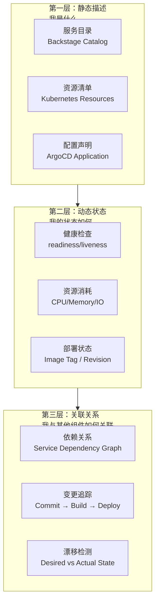
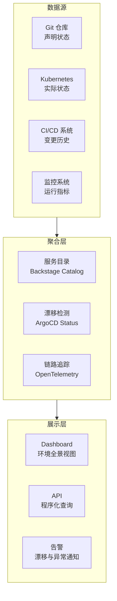
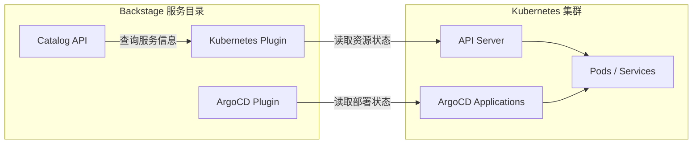

# 环境自描述与可观测性

## 背景与问题定义

"这个环境里跑了什么服务？数据库连的是哪个实例？上次部署是什么时候？为什么 Staging 和 Production 的行为不一致？"——这些问题在缺乏环境自描述能力的组织中几乎无法快速回答。运维人员只能依赖往往过时的文档、经常遗忘的口口相传，甚至逐个登录服务器排查，才能拼凑出环境的真实状态。

环境自描述（Environment Self-Description）是指：**环境能够主动表达"我是什么、我包含什么、我的状态如何"的能力。** 当环境具备自描述能力时，任何人在任何时刻都能通过标准化接口获取环境的完整画像，无需依赖人工维护的文档。

核心问题：**如何使环境具备自我描述和状态暴露能力，消除环境理解的认知负担？**

## 核心概念

### 环境自描述的三个层次



| 层次 | 核心问题 | 实现方式 | 示例 |
|------|---------|---------|------|
| 静态描述 | 环境中包含哪些服务？各自的角色是什么？ | Backstage Software Catalog、Kubernetes CRD | "orders-service v2.3.1，HTTP API，Go 语言" |
| 动态状态 | 各服务当前是否健康？资源使用如何？ | 健康检查、Prometheus 指标、ArgoCD Status | "orders-service 3/3 Ready，CPU 45%" |
| 关联关系 | 服务间依赖如何？最近变更是什么？ | OpenTelemetry 资源属性、Backstage Relations | "依赖 payment-service 和 redis-cache" |

### 环境标签体系

环境自描述的基础是一致的标签体系。每个部署到环境中的资源都应携带以下标准标签：

```yaml
# 标准标签体系
metadata:
  labels:
    # 身份标签
    app.kubernetes.io/name: orders-service
    app.kubernetes.io/version: "2.3.1"
    app.kubernetes.io/component: api
    app.kubernetes.io/part-of: ecommerce-platform

    # 归属标签
    app.kubernetes.io/team: team-a
    app.kubernetes.io/managed-by: argocd

    # 环境标签
    environment: staging
    cost-center: "CC-001"

    # 可观测性标签
    observability.enabled: "true"
    tracing.sampling-rate: "0.1"
```

### 环境漂移检测

环境漂移（Environment Drift）是指环境的实际状态偏离声明状态的现象。漂移的常见原因：

| 漂移类型 | 原因 | 危害 | 检测方式 |
|---------|------|------|---------|
| 配置漂移 | 手动修改 K8s 资源 | 行为不可复现 | ArgoCD Sync Status |
| 镜像漂移 | 镜像 Tag 被覆盖或 :latest 指向变化 | 部署版本不确定 | 镜像 Digest 校验 |
| 规模漂移 | HPA 扩缩导致副本数偏离声明 | 资源消耗不可预测 | 对比 replicas vs HPA range |
| 密钥漂移 | Secret 被手动更新但未同步到 Git | 配置不一致 | External Secrets Operator 同步状态 |

## 架构设计

### 环境自描述全景架构



### Backstage 与 Kubernetes 的集成架构

Backstage 通过 Kubernetes 插件实现服务目录与集群实际状态的关联：



## 实现方案

### Backstage catalog-info.yaml 示例

每个服务应在代码仓库中维护 `catalog-info.yaml`，声明服务的基本信息、归属和依赖关系：

```yaml
# catalog-info.yaml
apiVersion: backstage.io/v1alpha1
kind: Component
metadata:
  name: orders-service
  description: 订单管理微服务，处理订单创建、查询和状态流转
  annotations:
    # Kubernetes 集成
    backstage.io/kubernetes-id: orders-service
    backstage.io/kubernetes-namespace: team-a

    # ArgoCD 集成
    argocd/app-name: orders-service-staging

    # 文档集成
    backstage.io/techdocs-ref: dir:./docs

    # 监控集成
    grafana/dashboard-url: https://grafana.example.com/d/orders-service

    # 代码集成
    github.com/project-slug: team-a/orders-service
  tags:
    - go
    - microservice
    - api
  links:
    - url: https://orders-service.staging.example.com/health
      title: Health Check
      icon: health
    - url: https://orders-service.staging.example.com/swagger
      title: API Documentation
      icon: doc
    - url: https://grafana.example.com/d/orders-service
      title: Monitoring Dashboard
      icon: dashboard

spec:
  type: service
  lifecycle: production
  owner: team-a
  system: ecommerce-platform

  # 依赖关系声明
  dependsOn:
    - component:payment-service
    - component:inventory-service
    - resource:redis-cache
    - resource:orders-database

  # 提供的 API
  providesApis:
    - orders-api

  # 消费的 API
  consumesApis:
    - payment-api
    - inventory-api
```

### ArgoCD Application 状态检查

ArgoCD 的 Application CRD 天然具备声明状态与实际状态的对比能力：

```yaml
# ArgoCD Application: 同时包含声明与实际状态
apiVersion: argoproj.io/v1alpha1
kind: Application
metadata:
  name: orders-service-staging
  namespace: argocd
  labels:
    team: team-a
    environment: staging
  annotations:
    # 自定义通知：漂移检测
    notifications.argoproj.io/subscribe.on-sync-status-unknown.slack: team-a-alerts
    notifications.argoproj.io/subscribe.on-health-degraded.slack: team-a-alerts
spec:
  project: team-a

  source:
    repoURL: https://github.com/team-a/orders-service.git
    targetRevision: main
    path: k8s/overlays/staging

  destination:
    server: https://kubernetes.default.svc
    namespace: team-a-staging

  syncPolicy:
    automated:
      prune: true
      selfHeal: true      # 自动修复漂移
      allowEmpty: false
    syncOptions:
      - CreateNamespace=true
      - PrunePropagationPolicy=foreground
      - ServerSideApply=true

    # 状态检查与回滚
    retry:
      limit: 3
      backoff:
        duration: 5s
        factor: 2
        maxDuration: 3m
```

ArgoCD 提供的关键状态字段：

| 字段 | 含义 | 用途 |
|------|------|------|
| `status.sync.status` | Synced / OutOfSync / Unknown | 检测配置漂移 |
| `status.health.status` | Healthy / Degraded / Progressing / Suspended | 检测服务健康 |
| `status.operationState.phase` | Succeeded / Failed / Running | 检测部署状态 |
| `status.summary.images` | 当前运行的镜像列表 | 检测镜像版本 |

### OpenTelemetry 资源属性配置

OpenTelemetry 的资源属性（Resource Attributes）为每个遥测数据附加环境上下文，实现跨系统的环境可追踪性：

```yaml
# OpenTelemetry Collector 配置
apiVersion: opentelemetry.io/v1beta1
kind: OpenTelemetryCollector
metadata:
  name: otel-collector
  namespace: monitoring
spec:
  config:
    receivers:
      otlp:
        protocols:
          grpc:
            endpoint: 0.0.0.0:4317
          http:
            endpoint: 0.0.0.0:4318

    processors:
      # 资源属性注入：为所有遥测数据附加环境信息
      # 注：deployment.environment 自 semconv v1.29.0 起废弃，改用 deployment.environment.name
      resource:
        attributes:
          - key: deployment.environment.name
            value: staging
            action: upsert
          - key: service.namespace
            value: team-a
            action: upsert
          - key: k8s.cluster.name
            value: prod-cluster-01
            action: upsert

      # K8s 属性注入：自动从 Pod 元数据提取
      k8sattributes:
        extract:
          metadata:
            - k8s.namespace.name
            - k8s.pod.name
            - k8s.pod.uid
            - k8s.deployment.name
            - k8s.node.name
          labels:
            - key: app.kubernetes.io/name
              from: pod
            - key: app.kubernetes.io/version
              from: pod
            - key: environment
              from: pod
        passthrough: false

    exporters:
      otlp:
        endpoint: tempo.monitoring:4317
        tls:
          insecure: true
      prometheus:
        endpoint: 0.0.0.0:8889

    service:
      pipelines:
        traces:
          receivers: [otlp]
          processors: [resource, k8sattributes]
          exporters: [otlp]
        metrics:
          receivers: [otlp]
          processors: [resource, k8sattributes]
          exporters: [prometheus]
```

### 分步实施指南

**第一步：建立标签规范（Week 1-2）**

制定并强制执行 Kubernetes 资源标签规范，所有部署必须携带标准标签。可通过 Kyverno 策略强制：

```yaml
# Kyverno 策略：强制标准标签
apiVersion: kyverno.io/v1
kind: ClusterPolicy
metadata:
  name: require-standard-labels
spec:
  # Kyverno 1.13+ 使用 failurePolicy（旧字段 validationFailureAction 已废弃）
  failurePolicy: enforce
  rules:
    - name: check-standard-labels
      match:
        resources:
          kinds:
            - Pod
            - Deployment
            - Service
      validate:
        message: "资源必须包含 app.kubernetes.io/name 和 environment 标签"
        pattern:
          metadata:
            labels:
              app.kubernetes.io/name: "?*"
              environment: "?*"
```

**第二步：部署服务目录（Week 3-4）**

1. 部署 Backstage 实例
2. 为现有服务创建 catalog-info.yaml
3. 注册所有服务到目录
4. 启用 Kubernetes 插件，关联集群状态

**第三步：启用漂移检测（Week 5-6）**

1. 部署 ArgoCD，将所有服务纳入 GitOps 管理
2. 启用 selfHeal 自动修复漂移
3. 配置漂移告警通知

**第四步：环境可观测性（Week 7-8）**

1. 部署 OpenTelemetry Collector
2. 配置 K8s 属性自动注入
3. 在 Grafana 中建立环境全景 Dashboard

## 最佳实践

### 业界推荐做法

1. **代码即目录**：服务目录信息（catalog-info.yaml）由各服务团队在代码仓库中维护，而非平台团队手动录入
2. **标签即契约**：Kubernetes 标签是环境自描述的基础，必须强制且一致——通过 Kyverno/OPA 策略保证
3. **漂移即告警**：任何环境漂移（OutOfSync）都应触发告警，而非仅显示在 Dashboard 上
4. **自愈优先**：ArgoCD selfHeal 模式可以在检测到漂移时自动恢复，减少人工干预
5. **单一数据源**：Git 是环境声明的单一数据源，任何配置变更必须通过 Git 提交

### 常见反模式与规避方法

| 反模式 | 表现 | 危害 | 规避方法 |
|--------|------|------|---------|
| 手动维护目录 | 运维团队手动维护服务清单 | 信息过时，维护成本高 | 代码即目录，自动化注册 |
| 标签不一致 | 不同团队使用不同的标签命名 | 无法统一查询和过滤 | 强制标签策略 |
| 忽视漂移 | 配置漂移长期未修复 | Staging 与 Production 行为不一致 | selfHeal + 漂移告警 |
| 可观测性孤岛 | 每个服务独立的监控体系 | 无法关联分析 | OpenTelemetry 统一资源属性 |

## 效果度量

### 环境自描述成熟度模型

| 级别 | 特征 | 典型表现 |
|------|------|---------|
| L0 - 不可知 | 无法回答"环境中有什么" | 依赖人工文档 |
| L1 - 手动目录 | 有服务目录但手动维护 | 信息经常过时 |
| L2 - 自动目录 | 服务目录由代码驱动，自动注册 | 目录与实际同步 |
| L3 - 状态关联 | 目录与运行状态实时关联 | 可查看服务健康、部署状态 |
| L4 - 自描述闭环 | 漂移自动检测与修复 | 环境始终与声明一致 |

### 关键指标

| 指标 | 定义 | 目标 |
|------|------|------|
| 目录覆盖率 | 已注册到目录的服务 / 总服务数 | > 95% |
| 目录准确率 | 目录信息与实际状态一致的服务占比 | > 98% |
| 漂移检测延迟 | 从漂移发生到被检测的时间 | < 5 分钟 |
| 漂移修复时间 | 从检测到漂移到恢复声明状态的时间 | < 30 分钟 |
| 环境认知时间 | 新人了解环境组成所需的时间 | < 30 分钟 |

## 总结

### 核心要点

1. 环境自描述分三层：静态描述（我是什么）→ 动态状态（我的状态如何）→ 关联关系（我如何与其他组件关联）
2. Backstage 服务目录 + Kubernetes 标签 + ArgoCD 状态管理构成环境自描述的核心技术栈
3. 漂移检测是环境一致性的保障——ArgoCD selfHeal 实现自动修复
4. OpenTelemetry 资源属性为遥测数据附加环境上下文，实现跨系统的可追踪性
5. 代码即目录、标签即契约——环境自描述必须自动化，而非依赖人工维护

### 延伸阅读

- Backstage. *Software Catalog*. https://backstage.io/docs/features/software-catalog/
- ArgoCD. *Application CRD*. https://argo-cd.readthedocs.io/en/stable/operator-manual/application.yaml
- OpenTelemetry. *Resource Semantic Conventions*. https://opentelemetry.io/docs/specs/semconv/resource/
- Kyverno. *Policy Documentation*. https://kyverno.io/docs/