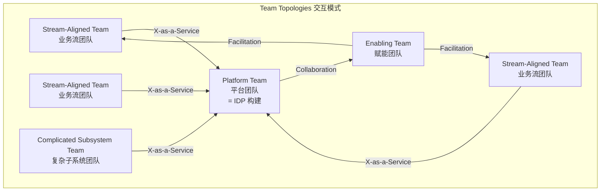
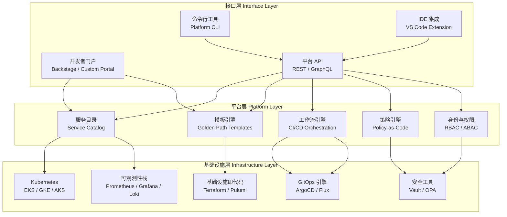

# 内部开发者平台（IDP）设计

## 背景与问题定义

微服务架构和云原生技术的普及，让企业基础设施的复杂度呈指数级增长：一个典型的微服务应用，背后是 Kubernetes 集群管理、服务网格配置、CI/CD 流水线编排、密钥管理、可观测性栈搭建等数十个技术领域。开发者在交付业务价值之前，必须先跨越基础设施的认知鸿沟。

这种现状带来了三个核心问题：

**认知负荷过重**：开发者需要理解基础设施的底层细节才能完成日常开发任务。DORA 的年度调研反复发现，开发者有大量时间耗在等待与环境配置等非编码事务上，直接挤压了业务逻辑开发的时间。

**一致性难以保证**：不同团队各自搭建基础设施，导致技术栈碎片化。A 团队用 Jenkins，B 团队用 GitHub Actions；A 团队的日志格式是 JSON，B 团队是纯文本。这种碎片化不仅增加了运维成本，更让跨团队协作变得困难。

**知识孤岛化**：基础设施的最佳实践分散在各个团队的 Wiki、Confluence 和个人经验中，缺乏标准化的沉淀和传播机制。当核心基础设施工程师离职时，知识随之流失。

内部开发者平台（Internal Developer Platform，IDP）正是为了解决这些问题而诞生的。IDP 的核心思想是将基础设施的复杂性封装在平台层之后，为开发者提供自助服务能力，让开发者专注于业务逻辑的交付。

## 核心概念

### IDP 的定义

内部开发者平台（IDP）是一个由平台团队构建和维护的集成化技术平台，它将基础设施能力抽象为开发者友好的自助服务接口，使开发团队能够在不依赖基础设施专家的情况下，独立完成服务的创建、配置、部署和运维。

IDP 不同于传统的基础设施管理平台，它的核心差异化在于：

| 维度 | 传统基础设施平台 | 内部开发者平台（IDP） |
|------|-----------------|---------------------|
| 用户画像 | 运维工程师 | 应用开发者 |
| 交互方式 | 提工单、等审批 | 自助服务、即时满足 |
| 抽象层级 | 基础设施原语（Pod、Ingress） | 业务语义（服务、环境、发布） |
| 核心目标 | 基础设施稳定性 | 开发者生产力 |
| 反馈循环 | 小时级/天级 | 秒级/分钟级 |
| 拓展方式 | 手动配置 | 黄金路径模板 |

### IDP 的三大核心能力

**自助服务（Self-Service）**：开发者无需提交工单或等待运维团队介入，即可独立完成基础设施操作。自助服务不是简单的 UI 包装，而是对基础设施能力的深度抽象和编排。

**黄金路径（Golden Path）**：黄金路径是平台团队定义的、经过验证的最佳实践路径。它不是强制约束，而是通过降低合规成本来引导开发者做出正确的选择。走黄金路径的成本远低于偏离路径的成本，开发者自然会倾向于遵循。

**抽象基础设施（Infrastructure Abstraction）**：将 Kubernetes、Terraform、ArgoCD 等底层工具的复杂性封装在平台层，开发者只需关心"我要部署一个服务"，而非"我要创建一个 Deployment 并配置 HPA、Service、Ingress"。

### Team Topologies 与平台团队

Team Topologies 理论由 Matthew Skelton 和 Manuel Pais 提出，定义了四种团队类型（流对齐团队、赋能团队、复杂子系统团队、平台团队）和三种交互模式。在该框架中，平台团队（Platform Team）以 X-as-a-Service 的方式向流对齐团队（Stream-Aligned Team）提供平台能力；赋能团队（Enabling Team）则是帮助其他团队补齐能力的另一种团队类型，二者角色不同。



平台团队与业务团队的交互遵循 X-as-a-Service 模式：业务团队通过自助服务接口消费平台能力，平台团队负责维护服务的可靠性和演进。这种模式的关键在于，平台团队必须将平台视为产品，以产品思维来运营。

## 架构设计

### IDP 参考架构

IDP 的架构设计遵循三层模型：接口层、平台层、基础设施层。



**接口层**是开发者与平台交互的入口。它提供多种访问方式以适配不同的使用场景：开发者门户适合浏览和可视化操作；CLI 适合脚本化和自动化场景；API 适合第三方系统集成；IDE 集成则将平台能力嵌入开发者的日常工作流。

**平台层**是 IDP 的核心，负责将基础设施能力抽象为开发者友好的服务。服务目录管理所有服务的元数据和依赖关系；模板引擎提供黄金路径模板；工作流引擎编排 CI/CD 流水线；策略引擎执行合规检查；身份与权限模块确保安全访问。

**基础设施层**是各种基础设施工具的集成层。平台层通过适配器模式与基础设施层交互，确保底层工具的替换不会影响接口层的稳定性。

### IDP 与 Platform Orchestrator

在 IDP 的架构中，Platform Orchestrator（平台编排器）扮演着关键角色。它负责将开发者的意图（Intent）转化为具体的基础设施操作。以 Humanitec 为代表的 Platform Orchestrator 采用了 Resource Graph 模型：

1. 开发者声明应用的需求（如"我需要一个 PostgreSQL 数据库"）
2. Platform Orchestrator 根据应用上下文和环境匹配，选择合适的资源实现
3. 在开发环境，可能匹配一个 Docker 容器化的 PostgreSQL
4. 在生产环境，可能匹配 AWS RDS 实例

这种意图驱动的模式让开发者只需描述"要什么"，而无需关心"怎么做"。

## 实现方案

### 基于 Backstage 构建 IDP

Backstage 是 Spotify 于 2020 年开源的开发者门户框架，目前是 CNCF 孵化项目，也是构建 IDP 接口层的事实标准。以下是基于 Backstage 的 IDP 实现方案。

#### 1. Backstage App 初始化与配置

```bash
# 安装 Backstage CLI
npx @backstage/create-app@latest

# 进入项目目录
cd my-idp-platform

# 项目结构
# ├── packages/
# │   ├── app/          # 前端应用
# │   └── backend/      # 后端服务
# ├── plugins/          # 自定义插件
# ├── app-config.yaml   # 主配置文件
# └── app-config.production.yaml  # 生产配置
```

#### 2. 核心配置：app-config.yaml

```yaml
# app-config.yaml - Backstage 核心配置
app:
  title: Internal Developer Platform
  baseUrl: http://localhost:3000

organization:
  name: Acme Corporation

backend:
  baseUrl: http://localhost:7007
  listen:
    port: 7007
  csp:
    connect-src: ["'self'", 'http:', 'https:']
  cors:
    origin: http://localhost:3000
    methods: [GET, HEAD, PATCH, POST, PUT, DELETE]
    credentials: true
  database:
    client: pg
    connection:
      host: ${POSTGRES_HOST}
      port: ${POSTGRES_PORT}
      user: ${POSTGRES_USER}
      password: ${POSTGRES_PASSWORD}
      database: backstage_plugin

auth:
  environment: development
  providers:
    github:
      development:
        clientId: ${GITHUB_CLIENT_ID}
        clientSecret: ${GITHUB_CLIENT_SECRET}

integrations:
  github:
    - host: github.com
      token: ${GITHUB_TOKEN}

catalog:
  rules:
    - allow: [Component, System, API, Resource, Location, Template]
  locations:
    # 组织级模板
    - type: url
      target: https://github.com/acme/idp-templates/blob/main/templates.yaml
    # 组织级文档
    - type: url
      target: https://github.com/acme/idp-docs/blob/main/catalog-info.yaml

kubernetes:
  serviceLocatorMethod:
    type: multiTenant
  clusterLocatorMethods:
    - type: config
      clusters:
        - name: production
          url: ${K8S_PROD_URL}
          authProvider: serviceAccount
          serviceAccountToken: ${K8S_PROD_TOKEN}
        - name: staging
          url: ${K8S_STAGING_URL}
          authProvider: serviceAccount
          serviceAccountToken: ${K8S_STAGING_TOKEN}

argocd:
  username: admin
  password: ${ARGOCD_PASSWORD}
  appLocatorMethods:
    - type: config
      instances:
        - name: production
          url: ${ARGOCD_PROD_URL}
          token: ${ARGOCD_PROD_TOKEN}
```

#### 3. 服务模板：创建微服务的黄金路径

```yaml
# templates/microservice/template.yaml
apiVersion: scaffolder.backstage.io/v1beta3
kind: Template
metadata:
  name: microservice-template
  title: Microservice Golden Path
  description: |
    创建一个标准的微服务项目，包含：
    - 标准化的项目结构
    - CI/CD 流水线配置
    - Kubernetes 部署清单
    - 可观测性配置（指标、日志、链路追踪）
    - 服务目录注册信息
  tags:
    - microservice
    - golden-path
spec:
  owner: platform-team
  type: service

  parameters:
    - title: 服务基本信息
      required:
        - name
        - owner
        - description
      properties:
        name:
          title: 服务名称
          type: string
          description: 服务的唯一标识，使用小写字母和连字符
          pattern: "^[a-z][a-z0-9-]*$"
          ui:autofocus: true
        owner:
          title: 负责团队
          type: string
          description: 负责该服务的团队
          ui:field: OwnerPicker
          ui:options:
            allowedKinds:
              - Group
        description:
          title: 服务描述
          type: string
          description: 一句话描述服务的业务功能
        language:
          title: 开发语言
          type: string
          default: go
          enum:
            - go
            - java
            - python
            - node
          enumNames:
            - Go
            - Java (Spring Boot)
            - Python (FastAPI)
            - Node.js (Express)

    - title: 基础设施配置
      required:
        - environment
      properties:
        environment:
          title: 部署环境
          type: string
          default: staging
          enum:
            - staging
            - production
            - staging-and-production
        replicas:
          title: 副本数
          type: number
          default: 2
          minimum: 1
          maximum: 10
        enableCanary:
          title: 启用金丝雀发布
          type: boolean
          default: true

  steps:
    - id: fetch-template
      name: 获取项目模板
      action: fetch:template
      input:
        url: ./skeleton
        values:
          name: ${{ parameters.name }}
          owner: ${{ parameters.owner }}
          description: ${{ parameters.description }}
          language: ${{ parameters.language }}
          environment: ${{ parameters.environment }}
          replicas: ${{ parameters.replicas }}
          enableCanary: ${{ parameters.enableCanary }}

    - id: publish-repo
      name: 创建代码仓库
      action: publish:github
      input:
        allowedHosts: ["github.com"]
        description: ${{ parameters.description }}
        repoUrl: github.com?owner=acme&repo=${{ parameters.name }}
        defaultBranch: main
        protectDefaultBranch: true
        repoVisibility: internal

    - id: register-catalog
      name: 注册服务目录
      action: catalog:register
      input:
        catalogInfoUrl: https://github.com/acme/${{ parameters.name }}/blob/main/catalog-info.yaml

    - id: create-argocd-app
      name: 创建 ArgoCD 应用
      action: argocd:create-app
      input:
        appName: ${{ parameters.name }}
        project: default
        sourceRepo: https://github.com/acme/${{ parameters.name }}.git
        sourcePath: k8s
        destinationCluster: https://kubernetes.default.svc
        destinationNamespace: ${{ parameters.name }}

  output:
    links:
      - title: 代码仓库
        url: https://github.com/acme/${{ parameters.name }}
      - title: 服务目录
        url: https://idp.acme.com/catalog/default/component/${{ parameters.name }}
      - title: ArgoCD 应用
        url: https://argocd.acme.com/applications/${{ parameters.name }}
```

#### 4. 服务目录注册信息

```yaml
# catalog-info.yaml - 服务目录元数据
apiVersion: backstage.io/v1alpha1
kind: Component
metadata:
  name: order-service
  description: 订单处理微服务
  annotations:
    backstage.io/source-location: url:https://github.com/acme/order-service
    backstage.io/techdocs-ref: dir:.
    argocd/app-name: order-service
    grafana/dashboard-selector: "order-service"
    prometheus.io/alert: "order-service-alerts"
    backstage.io/kubernetes-namespace: order-service
  tags:
    - go
    - microservice
    - order-domain
  links:
    - url: https://order-service.staging.acme.com/health
      title: 健康检查
      icon: cloud
    - url: https://grafana.acme.com/d/order-service
      title: 监控面板
      icon: dashboard
spec:
  type: service
  lifecycle: production
  owner: order-team
  system: order-system
  dependsOn:
    - component:payment-service
    - component:inventory-service
  providesApis:
    - order-api
---
apiVersion: backstage.io/v1alpha1
kind: API
metadata:
  name: order-api
  description: 订单服务 REST API
spec:
  type: openapi
  lifecycle: production
  owner: order-team
  system: order-system
  definition: |
    openapi: 3.0.0
    info:
      title: Order Service API
      version: "1.0"
    paths:
      /orders:
        get:
          summary: List orders
          responses:
            '200':
              description: A list of orders
```

### Platform CLI 实现

除了开发者门户，CLI 是 IDP 的重要补充接口。CLI 适合脚本化场景，支持 CI/CD 流水线集成。

```go
// cmd/platform/main.go - Platform CLI 示例
package main

import (
	"fmt"
	"os"

	"github.com/spf13/cobra"
)

var rootCmd = &cobra.Command{
	Use:   "platform",
	Short: "Internal Developer Platform CLI",
	Long:  "Platform CLI 提供自助服务命令，用于服务创建、部署和环境管理",
}

var createCmd = &cobra.Command{
	Use:   "create [service-name]",
	Short: "创建新服务",
	Args:  cobra.ExactArgs(1),
	Run: func(cmd *cobra.Command, args []string) {
		template, _ := cmd.Flags().GetString("template")
		language, _ := cmd.Flags().GetString("language")
		owner, _ := cmd.Flags().GetString("owner")

		fmt.Printf("Creating service '%s' with template '%s'\n", args[0], template)
		fmt.Printf("  Language: %s\n", language)
		fmt.Printf("  Owner: %s\n", owner)

		// 调用 Backstage Scaffolder API
		if err := createService(args[0], template, language, owner); err != nil {
			fmt.Fprintf(os.Stderr, "Error: %v\n", err)
			os.Exit(1)
		}
		fmt.Printf("Service '%s' created successfully!\n", args[0])
	},
}

var deployCmd = &cobra.Command{
	Use:   "deploy [service-name]",
	Short: "部署服务到指定环境",
	Args:  cobra.ExactArgs(1),
	Run: func(cmd *cobra.Command, args []string) {
		env, _ := cmd.Flags().GetString("env")
		version, _ := cmd.Flags().GetString("version")

		fmt.Printf("Deploying '%s' version '%s' to '%s'\n", args[0], version, env)

		// 触发 GitOps 发布流程
		if err := deployService(args[0], env, version); err != nil {
			fmt.Fprintf(os.Stderr, "Error: %v\n", err)
			os.Exit(1)
		}
		fmt.Printf("Deployment initiated for '%s'\n", args[0])
	},
}

func createService(name, template, language, owner string) error {
	// 调用 Backstage Scaffolder API 创建服务
	// POST /api/scaffolder/v2/tasks
	return nil
}

func deployService(name, env, version string) error {
	// 通过 GitOps 方式触发部署
	// 更新 ArgoCD Application 的目标版本
	return nil
}

func init() {
	createCmd.Flags().String("template", "microservice", "服务模板名称")
	createCmd.Flags().String("language", "go", "开发语言")
	createCmd.Flags().String("owner", "", "负责团队")

	deployCmd.Flags().String("env", "staging", "目标环境")
	deployCmd.Flags().String("version", "latest", "部署版本")

	rootCmd.AddCommand(createCmd)
	rootCmd.AddCommand(deployCmd)
}

func main() {
	if err := rootCmd.Execute(); err != nil {
		os.Exit(1)
	}
}
```

## 最佳实践

### 以产品思维运营平台

平台团队必须将 IDP 视为内部产品，以产品思维来运营。这意味着：

**用户研究**：定期与开发者进行用户访谈，了解他们的痛点和需求。不要假设你知道开发者需要什么——去问他们。

**产品路线图**：基于用户反馈和业务目标制定公开透明的路线图，让开发者知道平台正在朝什么方向演进。

**版本发布**：IDP 的功能更新也需要遵循版本发布的节奏，包括 Change Log、Migration Guide 和向后兼容性承诺。

**NPS 调研**：定期收集开发者净推荐值（NPS），量化平台满意度。NPS 的计算方式是推荐者百分比减去贬损者百分比。

### 黄金路径设计原则

黄金路径的设计需要遵循以下原则：

| 原则 | 说明 | 反模式 |
|------|------|--------|
| 路径清晰 | 黄金路径应该是显而易见的选择 | 提供过多选项导致决策瘫痪 |
| 逃逸成本高 | 偏离黄金路径需要额外工作 | 通过审批流程强制 |
| 持续优化 | 根据用户反馈不断改进路径 | 一次设计，永不更新 |
| 文档驱动 | 路径的每一步都有清晰的文档 | 依赖口头传承 |
| 渐进增强 | 允许开发者在路径基础上扩展 | 要么全有要么全无 |

### 平台能力分层

IDP 的能力建设应该分阶段推进，而不是一次性建设所有功能：

**第一阶段——基础自助服务**：服务创建模板、CI/CD 流水线、环境申请。目标是消除最常见的工单类型。

**第二阶段——可观测性集成**：服务目录、监控集成、日志查询、链路追踪。目标是让开发者能自助排查问题。

**第三阶段——高级能力**：金丝雀发布、混沌工程、成本管理、安全扫描。目标是提升发布质量和安全水平。

### 避免平台锁定

IDP 的一个重要设计原则是避免平台锁定。开发者应该能够绕过平台直接操作底层基础设施，虽然这会付出更多的时间成本。这种"紧急出口"的设计确保了：

1. 平台故障不会阻塞开发者的紧急操作
2. 开发者对底层基础设施保持理解和掌控
3. 平台团队有持续优化的动力（如果平台不好用，开发者会绕过它）

## 效果度量

IDP 的成功需要通过多维度的指标来度量。以下是 IDP 采纳度量的核心指标体系：

### 自助服务率

自助服务率衡量的是开发者通过自助服务完成操作的比例，而非提交工单等待人工处理。

```
自助服务率 = 自助完成操作数 / 总操作数 × 100%
```

目标值：大于 80%。低于 60% 说明平台的自助服务能力不足，开发者仍然依赖人工支持。

### 新服务上线时间

从开发者决定创建新服务到服务首次成功部署到生产环境的时间。

| 阶段 | 无 IDP | 有 IDP | 优化目标 |
|------|--------|--------|---------|
| 代码仓库创建 | 0.5 天 | 1 分钟 | 自动化 |
| CI/CD 配置 | 2 天 | 0 分钟（模板内置） | 模板化 |
| 基础设施配置 | 3 天 | 5 分钟 | 自助服务 |
| 环境申请与审批 | 2 天 | 10 分钟 | 自助服务 |
| 首次部署 | 1 天 | 5 分钟 | GitOps |
| 可观测性配置 | 1 天 | 0 分钟（模板内置） | 模板化 |
| **总计** | **9.5 天** | **21 分钟** | **< 30 分钟** |

### 开发者 NPS

开发者净推荐值（Net Promoter Score）衡量开发者对平台的满意度。

```
NPS = 推荐者百分比(9-10分) - 贬损者百分比(0-6分)
```

NPS 的参考基准：

| NPS 范围 | 评价 | 行动建议 |
|----------|------|---------|
| > 50 | 优秀 | 维持现状，持续优化 |
| 30 - 50 | 良好 | 关注贬损者反馈 |
| 0 - 30 | 一般 | 需要系统性改进 |
| < 0 | 较差 | 紧急改进，可能需要重新设计 |

### 其他关键指标

**认知负荷指数**：开发者完成一个任务需要参考的文档数量或咨询的人数。目标：完成常见任务不需要外部帮助。

**平台采纳率**：使用 IDP 的开发团队数 / 总开发团队数 × 100%。目标：大于 90%。

**工单减少率**：IDP 上线后基础设施相关工单的减少比例。目标：减少 70% 以上。

**首次部署成功率**：通过黄金路径模板创建的服务首次部署成功的比例。目标：大于 95%。

## 总结

内部开发者平台是持续交付体系的高级形态，它将基础设施的复杂性封装在平台层之后，让开发者能够通过自助服务完成从服务创建到生产部署的全流程。IDP 的设计需要遵循三层架构模型（接口层、平台层、基础设施层），以产品思维运营平台，通过黄金路径引导开发者遵循最佳实践。

IDP 的成功不仅取决于技术实现，更取决于组织文化的转变。平台团队需要从"基础设施管理者"转变为"产品团队"，将开发者视为客户，持续收集反馈、迭代改进。度量 IDP 效果的核心指标包括自助服务率、新服务上线时间、开发者 NPS 和平台采纳率，这些指标不仅反映平台的技术成熟度，更反映平台对开发者生产力的影响。

在接下来的文章中，我们将深入探讨 IDP 的关键组件——开发者门户与自助服务，以及如何通过 Backstage 构建一个功能完善的开发者门户。
