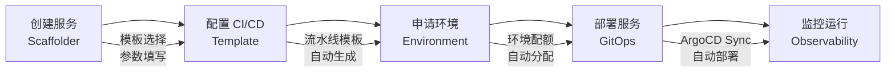
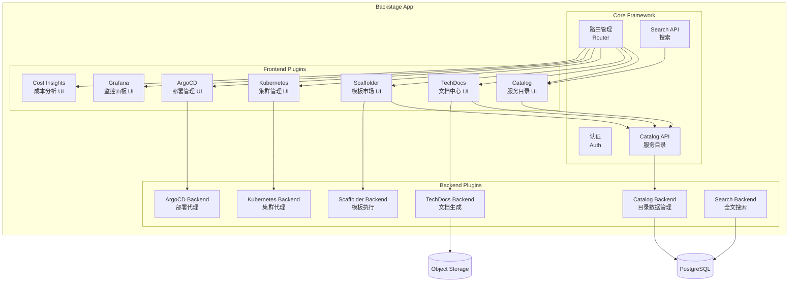

# 开发者门户与自助服务

## 背景与问题定义

上一篇文章讨论了内部开发者平台（IDP）的整体架构设计。IDP 的接口层是开发者与平台交互的窗口，开发者门户（Developer Portal）则是其中最核心的组件：它把平台能力以可视化、可发现、可操作的方式呈现给开发者，是实现自助服务的关键载体。

在缺乏开发者门户的环境中，开发者面临以下典型问题：

**信息碎片化**：服务文档散落在 Confluence、GitLab Wiki、Google Docs 等多个系统中，开发者需要花费大量时间寻找正确的信息。一个新加入团队的开发者平均需要 2-3 周才能了解团队的服务生态。

**操作割裂化**：创建一个服务需要在 GitHub 创建仓库、在 Jenkins 配置流水线、在 Kubernetes 创建命名空间、在 Grafana 配置监控——每个操作都在不同的系统中完成，缺乏统一的入口。

**知识隐性化**：团队的最佳实践和操作流程存在于资深工程师的脑海中，没有标准化的沉淀和传播机制。当这些工程师离职或休假时，知识断层立即显现。

开发者门户通过提供统一的服务目录、文档中心、模板市场和行动面板，将分散的信息和操作整合到一个入口，让开发者能够自助完成日常任务。

## 核心概念

### 开发者门户的四大核心功能

**服务目录（Service Catalog）**：服务目录是开发者门户的基石，它以结构化的方式组织和管理所有服务、系统、API 和资源的元数据。服务目录不仅是信息的索引，更是服务间依赖关系的可视化图谱。

**文档中心（TechDocs）**：文档中心提供"文档即代码"（Docs-as-Code）的能力，让文档与代码在同一个仓库中维护，确保文档与代码的同步更新。文档中心支持 Markdown 编写，自动生成和发布。

**模板市场（Template Marketplace）**：模板市场提供标准化的项目创建模板，即黄金路径的具体实现。开发者可以从模板市场选择合适的模板，一键创建包含完整基础设施配置的新项目。

**行动面板（Action Panel）**：行动面板将常见的运维操作封装为可点击的按钮或表单，如触发部署、回滚版本、扩缩容、查看日志等。开发者无需切换到其他工具即可完成操作。

### 自助服务工作流

自助服务的核心是将复杂的操作流程编排为开发者友好的工作流。一个典型的自助服务工作流如下：



每个步骤的设计原则是：开发者只需提供业务相关的决策（如服务名称、语言选择），技术细节由平台自动填充。

### 开发者体验（DevEx）度量

开发者体验（Developer Experience，DevEx）是评估开发者门户效果的核心框架。Abi Noda 和 Nicole Forsgren 提出的 DX 框架从三个维度度量开发者体验：

| 维度 | 定义 | 度量指标 | 改善方向 |
|------|------|---------|---------|
| 反馈速度（Feedback Speed） | 开发者执行操作后获得反馈的时间 | 构建时间、部署时间、测试执行时间、页面加载时间 | 并行化、缓存、增量构建 |
| 认知负荷（Cognitive Load） | 开发者完成任务所需的心智负担 | 文档查找时间、工具切换次数、配置项数量 | 抽象简化、文档优化、统一入口 |
| 流动效率（Flow Efficiency） | 开发者处于心流状态的时间占比 | 等待时间 vs 工作时间、上下文切换频率、中断次数 | 自助服务、异步协作、减少依赖 |

这三个维度相互关联：认知负荷高会导致流动效率低，反馈速度慢会打断心流状态。开发者门户的设计应该同时优化三个维度。

## 架构设计

### Backstage 插件架构

Backstage 采用了插件化架构，核心功能通过插件实现，第三方能力也通过插件集成。这种架构使得 Backstage 具有极强的可扩展性。



Backstage 的插件架构遵循以下设计原则：

**核心与插件分离**：Core Framework 提供路由、认证、数据访问等基础能力，所有业务功能通过插件实现。这种分离确保了核心框架的稳定性，同时允许插件独立迭代。

**前端与后端对应**：每个功能模块通常包含一个 Frontend Plugin（负责 UI 渲染）和一个 Backend Plugin（负责数据处理和外部 API 代理）。前后端通过 Backstage 的 API 层通信。

**统一数据模型**：Catalog API 提供统一的服务元数据模型，所有插件都可以通过 Catalog API 获取和更新服务信息，避免了数据孤岛。

### 服务目录数据模型

Backstage 的服务目录基于 Kubernetes 风格的 API 对象模型，核心实体包括：

| 实体类型 | 说明 | 关键字段 |
|----------|------|---------|
| Component | 可部署的软件组件 | type, lifecycle, owner, system |
| System | 由多个 Component 组成的业务系统 | owner, domain, components |
| API | 服务对外暴露的接口 | type, lifecycle, owner, definition |
| Resource | 物理或逻辑基础设施资源 | type, owner, system |
| Location | 实体定义的来源位置 | type, target |
| Template | 项目创建模板 | owner, type, spec.parameters |
| Group | 组织团队 | type, parent, children, members |
| User | 组织成员 | profile, memberOf |

实体之间的关系通过 `spec.dependsOn`、`spec.providesApis`、`spec.consumesApis` 等字段建立，形成服务依赖图谱。

## 实现方案

### Backstage Software Catalog 实践

#### 1. 组织模型定义

```yaml
# catalog-entities/groups.yaml
apiVersion: backstage.io/v1alpha1
kind: Group
metadata:
  name: order-domain
  description: 订单域团队
spec:
  type: business-domain
  parent: engineering
  children:
    - order-team
    - payment-team
---
apiVersion: backstage.io/v1alpha1
kind: Group
metadata:
  name: order-team
  description: 订单服务团队
spec:
  type: team
  parent: order-domain
  members:
    - zhang-san
    - li-si
    - wang-wu
---
apiVersion: backstage.io/v1alpha1
kind: User
metadata:
  name: zhang-san
spec:
  profile:
    displayName: 张三
    email: zhangsan@acme.com
  memberOf:
    - order-team
```

#### 2. 系统与组件定义

```yaml
# catalog-entities/order-system.yaml
apiVersion: backstage.io/v1alpha1
kind: System
metadata:
  name: order-system
  description: 订单处理系统
  tags:
    - order
    - core-business
spec:
  owner: order-domain
  domain: commerce
---
apiVersion: backstage.io/v1alpha1
kind: Component
metadata:
  name: order-service
  description: 订单核心服务
  annotations:
    backstage.io/source-location: url:https://github.com/acme/order-service/tree/main
    backstage.io/techdocs-ref: dir:.
    github.com/project-slug: acme/order-service
    argocd/app-name: order-service
    grafana/alert-label-selector: "service=order-service"
    grafana/dashboard-tag: order-service
    prometheus.io/alert: "order-service"
    backstage.io/kubernetes-namespace: order-service
    pagerduty.com/service-id: PXXXXXX
  tags:
    - go
    - microservice
    - grpc
  links:
    - url: https://order-service.staging.acme.com/swagger
      title: API 文档
      icon: api
    - url: https://grafana.acme.com/d/order-service-overview
      title: 监控面板
      icon: dashboard
    - url: https://opsgenie.acme.com/service/order-service
      title: On-Call
      icon: alert
spec:
  type: service
  lifecycle: production
  owner: order-team
  system: order-system
  dependsOn:
    - component:payment-service
    - component:inventory-service
    - resource:order-db
  providesApis:
    - order-api
---
apiVersion: backstage.io/v1alpha1
kind: API
metadata:
  name: order-api
  description: 订单服务 gRPC API
spec:
  type: grpc
  lifecycle: production
  owner: order-team
  system: order-system
  definition: |
    syntax = "proto3";
    package order.v1;

    service OrderService {
      rpc CreateOrder(CreateOrderRequest) returns (CreateOrderResponse);
      rpc GetOrder(GetOrderRequest) returns (GetOrderResponse);
      rpc ListOrders(ListOrdersRequest) returns (ListOrdersResponse);
    }
---
apiVersion: backstage.io/v1alpha1
kind: Resource
metadata:
  name: order-db
  description: 订单数据库
  annotations:
    amazon.com/aws-rds-cluster: order-db-cluster
spec:
  type: database
  lifecycle: production
  owner: order-team
  system: order-system
```

### Backstage TechDocs 实践

TechDocs 采用"文档即代码"模式，文档以 Markdown 格式存储在代码仓库中，与代码同步维护。

#### 1. 文档结构

```
order-service/
├── catalog-info.yaml          # 服务目录元数据
├── docs/
│   ├── index.md              # 文档首页
│   ├── architecture.md       # 架构设计
│   ├── api-reference.md      # API 参考
│   ├── runbook.md            # 运维手册
│   └── onboarding.md         # 新人上手指南
├── mkdocs.yml                # MkDocs 配置
└── src/
    └── ...                   # 服务源代码
```

#### 2. catalog-info.yaml 中的 TechDocs 配置

```yaml
# catalog-info.yaml - TechDocs 配置
apiVersion: backstage.io/v1alpha1
kind: Component
metadata:
  name: order-service
  annotations:
    backstage.io/techdocs-ref: dir:.    # 文档在当前仓库根目录
    # 或者指向另一个仓库
    # backstage.io/techdocs-ref: url:https://github.com/acme/order-service-docs
spec:
  type: service
  lifecycle: production
  owner: order-team
```

#### 3. mkdocs.yml 配置

```yaml
# mkdocs.yml - TechDocs 构建配置
site_name: Order Service Documentation

nav:
  - Home: index.md
  - Architecture: architecture.md
  - API Reference: api-reference.md
  - Runbook: runbook.md
  - Onboarding: onboarding.md

plugins:
  - techdocs-core

markdown_extensions:
  - admonition
  - codehilite
  - footnotes
  - meta
  - toc:
      permalink: true
  - pymdownx.tabbed
  - pymdownx.superfences:
      custom_fences:
        - name: mermaid
          class: mermaid
          format: !!python/name:pymdownx.superfences.fence_code_format
```

#### 4. 文档内容示例

```markdown
<!-- docs/runbook.md -->
# Order Service Runbook

## 告警响应

### High Error Rate

**告警条件**：5 分钟内错误率超过 1%

**排查步骤**：

1. 检查 Grafana 面板：[Order Service Dashboard](https://grafana.acme.com/d/order-service)
2. 查看最近部署：[ArgoCD Application](https://argocd.acme.com/applications/order-service)
3. 检查依赖服务状态：
   - Payment Service
   - Inventory Service
4. 查看日志：[Loki Log Explorer](https://grafana.acme.com/explore)

**缓解措施**：

- 如果是最近部署导致，执行回滚
- 如果是依赖服务问题，联系对应团队

### Database Connection Pool Exhausted

**告警条件**：连接池使用率超过 90%

**排查步骤**：

1. 检查数据库连接数：`SHOW PROCESSLIST`
2. 检查慢查询日志
3. 检查连接泄漏

**缓解措施**：

- 临时增加连接池大小
- 重启服务释放僵尸连接
```

### Backstage Scaffolder 实践

Scaffolder 是 Backstage 的模板执行引擎，它将项目创建流程编排为可重复执行的工作流。

#### 1. 模板定义

```yaml
# templates/create-microservice/template.yaml
apiVersion: scaffolder.backstage.io/v1beta3
kind: Template
metadata:
  name: create-microservice
  title: 创建微服务
  description: |
    通过黄金路径模板创建标准微服务项目。
    包含：项目骨架、CI/CD 流水线、K8s 部署清单、可观测性配置。
spec:
  owner: platform-team
  type: service

  parameters:
    - title: 基本信息
      required:
        - componentName
        - owner
      properties:
        componentName:
          title: 组件名称
          type: string
          description: 服务的唯一标识
          pattern: "^[a-z][a-z0-9-]*$"
          ui:autofocus: true
        owner:
          title: 负责团队
          type: string
          ui:field: OwnerPicker
          ui:options:
            allowedKinds:
              - Group
        description:
          title: 服务描述
          type: string
          ui:widget: textarea
        system:
          title: 所属系统
          type: string
          ui:field: EntityPicker
          ui:options:
            allowedKinds:
              - System

    - title: 技术选型
      required:
        - language
      properties:
        language:
          title: 开发语言
          type: string
          default: go
          enum:
            - go
            - java
            - python
            - node
        database:
          title: 数据库
          type: string
          default: none
          enum:
            - none
            - postgresql
            - mysql
            - mongodb
            - redis
        messaging:
          title: 消息队列
          type: string
          default: none
          enum:
            - none
            - kafka
            - rabbitmq

    - title: 基础设施
      required:
        - environment
      properties:
        environment:
          title: 初始部署环境
          type: string
          default: staging
          enum:
            - staging
            - production
        enableCanary:
          title: 启用金丝雀发布
          type: boolean
          default: true
        enableAutoscaling:
          title: 启用自动扩缩容
          type: boolean
          default: true

  steps:
    # Step 1: 从模板生成项目
    - id: fetch
      name: 生成项目骨架
      action: fetch:template
      input:
        url: ./skeleton
        values:
          componentName: ${{ parameters.componentName }}
          owner: ${{ parameters.owner }}
          description: ${{ parameters.description }}
          system: ${{ parameters.system }}
          language: ${{ parameters.language }}
          database: ${{ parameters.database }}
          messaging: ${{ parameters.messaging }}
          environment: ${{ parameters.environment }}
          enableCanary: ${{ parameters.enableCanary }}
          enableAutoscaling: ${{ parameters.enableAutoscaling }}

    # Step 2: 发布到 GitHub
    - id: publish
      name: 创建代码仓库
      action: publish:github
      input:
        allowedHosts: ["github.com"]
        repoUrl: github.com?owner=acme&repo=${{ parameters.componentName }}
        description: ${{ parameters.description }}
        defaultBranch: main
        protectDefaultBranch: true
        repoVisibility: internal

    # Step 3: 注册到服务目录
    - id: register
      name: 注册服务目录
      action: catalog:register
      input:
        catalogInfoUrl: https://github.com/acme/${{ parameters.componentName }}/blob/main/catalog-info.yaml

  output:
    links:
      - title: 代码仓库
        url: https://github.com/acme/${{ parameters.componentName }}
      - title: 服务详情
        url: https://idp.acme.com/catalog/default/component/${{ parameters.componentName }}
    text:
      title: 下一步
      content: |
        服务已创建成功！接下来你可以：

        1. 克隆代码仓库开始开发
        2. 推送代码触发首次 CI/CD 流水线
        3. 在服务详情页查看部署状态和监控信息
```

#### 2. 模板骨架目录结构

```
skeleton/
├── catalog-info.yaml.tmpl
├── README.md.tmpl
├── .github/
│   └── workflows/
│       └── ci.yaml.tmpl
├── k8s/
│   ├── base/
│   │   ├── deployment.yaml.tmpl
│   │   ├── service.yaml.tmpl
│   │   ├── hpa.yaml.tmpl
│   │   └── kustomization.yaml.tmpl
│   ├── overlays/
│   │   ├── staging/
│   │   │   └── kustomization.yaml.tmpl
│   │   └── production/
│   │       └── kustomization.yaml.tmpl
│   └── canary.yaml.tmpl
├── docs/
│   └── index.md.tmpl
├── mkdocs.yml
├── Dockerfile.tmpl
└── Makefile.tmpl
```

### Backstage Search 实践

Search 插件提供跨服务目录、文档和代码的全文搜索能力，是开发者快速定位信息的关键工具。

```yaml
# app-config.yaml - Search 配置
search:
  # 启用搜索能力
  collators:
    catalog:
      # 每小时重新索引服务目录
      schedule:
        frequency: { hours: 1 }
        timeout: { minutes: 5 }
    techdocs:
      # 每 30 分钟重新索引文档
      schedule:
        frequency: { minutes: 30 }
        timeout: { minutes: 5 }

  # 搜索引擎配置
  # 默认使用内置的 Lunr 引擎（内存索引，适合起步与中小规模）
  # 中大规模可切换 Elasticsearch / OpenSearch 引擎以获得更好的搜索性能
  engine:
    type: elasticsearch
    # Elasticsearch 连接配置放在 app-config 的 elasticsearch 段（node、auth 等）
```

### 自助服务行动面板实现

行动面板将常见运维操作封装为 Backstage 插件中的可操作组件。以下是一个自定义行动面板的实现示例：

```typescript
// plugins/order-service-actions/src/components/DeployAction.tsx
import React, { useState } from 'react';
import {
  Header,
  Page,
  Content,
  ContentHeader,
  SupportButton,
  InfoCard,
  Progress,
  Button,
  Select,
  Alert,
} from '@backstage/core-components';
import { useApi } from '@backstage/core-plugin-api';
import { catalogApiRef } from '@backstage/plugin-catalog-react';
import { argocdApiRef } from '@backstage/plugin-argocd';

export const DeployAction = ({ entity }: { entity: any }) => {
  const [environment, setEnvironment] = useState('staging');
  const [version, setVersion] = useState('');
  const [deploying, setDeploying] = useState(false);
  const [result, setResult] = useState<'success' | 'error' | null>(null);
  const argocdApi = useApi(argocdApiRef);

  const handleDeploy = async () => {
    setDeploying(true);
    setResult(null);
    try {
      // 通过 ArgoCD API 触发同步
      await argocdApi.sync({
        appName: entity.metadata.annotations?.['argocd/app-name'],
        namespace: entity.metadata.name,
        revision: version || 'HEAD',
      });
      setResult('success');
    } catch (err) {
      setResult('error');
    } finally {
      setDeploying(false);
    }
  };

  return (
    <InfoCard title="部署操作">
      <Select
        label="目标环境"
        items={[
          { value: 'staging', label: 'Staging' },
          { value: 'production', label: 'Production' },
        ]}
        onChange={setEnvironment}
        value={environment}
      />
      <br />
      <Button
        variant="contained"
        color="primary"
        onClick={handleDeploy}
        disabled={deploying}
      >
        {deploying ? '部署中...' : `部署到 ${environment}`}
      </Button>
      {deploying && <Progress />}
      {result === 'success' && (
        <Alert severity="success">部署已触发，请查看 ArgoCD 面板</Alert>
      )}
      {result === 'error' && (
        <Alert severity="error">部署触发失败，请检查配置</Alert>
      )}
    </InfoCard>
  );
};
```

## 最佳实践

### 服务目录治理

服务目录的数据质量直接影响开发者门户的可用性。以下是服务目录治理的关键实践：

**自动发现优先**：通过 Git 仓库扫描、Kubernetes 集群发现等方式自动注册服务，减少手动维护的工作量。Backstage 支持通过 `Location` 实体自动发现和注册。

**元数据校验**：对 `catalog-info.yaml` 进行 Schema 校验，确保必填字段完整、格式正确。可以在 CI 流水线中集成校验步骤。

```yaml
# .github/workflows/catalog-validate.yaml
name: Validate Catalog Info
on:
  pull_request:
    paths:
      - 'catalog-info.yaml'
jobs:
  validate:
    runs-on: ubuntu-latest
    steps:
      - uses: actions/checkout@v4
      - name: Validate catalog-info.yaml
        run: |
          npx @backstage/cli catalog:validate catalog-info.yaml
```

**定期清理**：对已下线的服务进行标记和归档，避免服务目录中出现大量无效条目。可以设置 `lifecycle: deprecated` 标记。

### 文档即代码实践

**文档与代码同仓库**：将文档放在代码仓库的 `docs/` 目录下，确保文档与代码同步更新。代码变更的 PR 应该同时包含相关文档的更新。

**文档模板化**：为不同类型的服务提供标准化的文档模板，确保文档结构的统一性。模板应包含：架构设计、API 参考、运维手册、新人上手指南。

**文档质量门禁**：在 CI 流水线中检查文档的完整性，如是否包含必需的章节、链接是否有效、代码示例是否可运行。

### 自助服务边界

自助服务不是无限制的放权，需要明确自助服务的边界：

| 操作类型 | 自助服务 | 需要审批 | 说明 |
|----------|---------|---------|------|
| 创建开发/测试环境 | 是 | 否 | 开发环境资源配额有限，风险可控 |
| 创建生产环境 | 否 | 是 | 生产环境需要安全审查 |
| 部署到 Staging | 是 | 否 | Staging 环境用于验证，风险可控 |
| 部署到 Production | 部分 | 首次需要审批 | 首次部署需要确认，后续可自助 |
| 扩缩容（范围内） | 是 | 否 | 在预设配额范围内自助操作 |
| 扩缩容（超配额） | 否 | 是 | 超出配额需要成本审批 |
| 回滚 | 是 | 否 | 回滚是紧急操作，应自助完成 |
| 数据库 Schema 变更 | 否 | 是 | Schema 变更影响面大，需审查 |

### 开发者体验优化

**减少认知负荷**：开发者门户的导航结构应该直观，新用户能在 5 分钟内找到所需功能。使用标签（Tags）和分类（Categories）组织服务，支持全文搜索。

**加速反馈循环**：门户中的操作应该提供即时反馈。例如，创建服务后立即显示仓库链接和下一步指引；部署操作后实时显示部署进度。

**保持流动效率**：减少开发者在不同工具间切换的次数。将常用操作（查看日志、触发部署、查看监控）集成到服务详情页，实现"一站式"操作。

## 效果度量

### DX 框架度量指标

基于 DX 框架的三维度，开发者门户的效果可以从以下指标度量：

**反馈速度指标**：

| 指标 | 度量方法 | 目标值 |
|------|---------|--------|
| 页面加载时间 | 前端性能监控 | P95 < 2 秒 |
| 搜索响应时间 | 后端 API 监控 | P95 < 500ms |
| 模板执行时间 | Scaffolder 执行日志 | < 3 分钟 |
| 部署触发到完成 | ArgoCD 同步时间 | Staging < 5 分钟 |

**认知负荷指标**：

| 指标 | 度量方法 | 目标值 |
|------|---------|--------|
| 新人上手时间 | 新员工调研 | < 3 天 |
| 文档查找时间 | 用户行为分析 | < 2 分钟 |
| 工具切换次数 | 用户行为分析 | 减少 50% |
| 常见操作步骤数 | 任务分析 | < 5 步 |

**流动效率指标**：

| 指标 | 度量方法 | 目标值 |
|------|---------|--------|
| 自助服务完成率 | 操作日志分析 | > 85% |
| 等待时间占比 | 时间跟踪 | < 15% |
| 上下文切换频率 | 开发者调研 | 减少 40% |
| 心流中断次数 | 开发者调研 | 减少 50% |

### 定性度量

除了定量指标，定性的开发者反馈同样重要：

**开发者满意度调研**：每季度进行一次匿名调研，收集开发者对门户功能、易用性和缺失能力的反馈。

**用户访谈**：每月与 3-5 名开发者进行深度访谈，了解他们的工作流程和痛点。

**功能请求分析**：跟踪功能请求的数量和类型，识别开发者最迫切的需求。

## 总结

开发者门户是内部开发者平台面向开发者的核心接口，它通过服务目录、文档中心、模板市场和行动面板四大功能，将分散的信息和操作整合为统一的自助服务体验。Backstage 作为开发者门户的事实标准，提供了插件化的架构和丰富的核心功能，使企业能够快速构建定制化的开发者门户。

自助服务的设计需要平衡自由度与管控，通过黄金路径引导开发者做出正确选择，同时保留紧急出口以应对特殊情况。开发者体验的度量应该从反馈速度、认知负荷和流动效率三个维度系统化进行，既关注定量指标，也重视定性反馈。

在下一篇文章中，我们将从组织视角探讨平台工程团队的建设，包括团队定位、组织模式、能力模型和与业务团队的交互方式。
