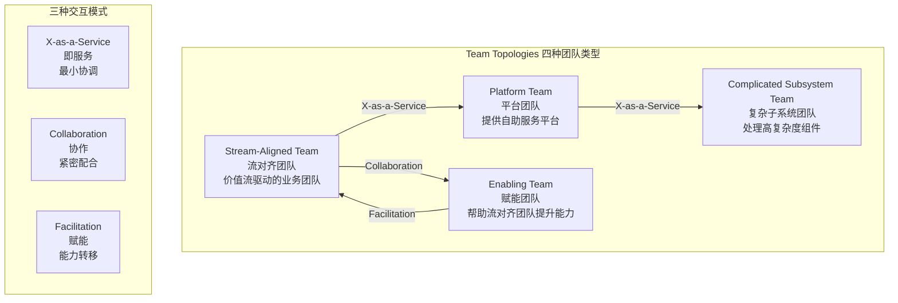
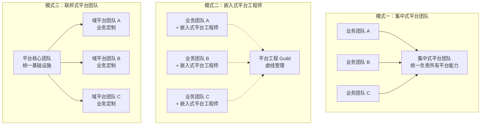
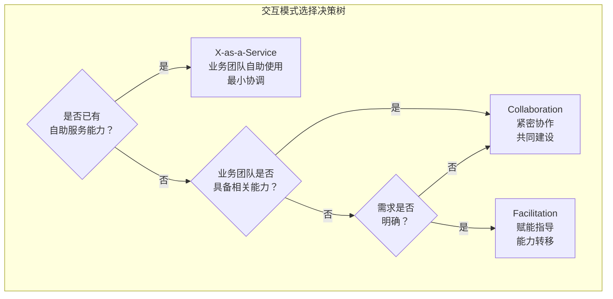

# 平台工程团队建设

## 背景与问题定义

平台工程的成败，一半在技术，一半在组织。一个技术架构优秀的平台，如果没有合适的团队来建设和运营，最终会沦为无人使用的"技术象牙塔"；相反，一个组织设计合理的平台团队，即使技术方案不够完美，也能通过持续迭代和用户反馈逐步进化出优秀的平台产品。

在企业实践中，平台团队建设面临的核心问题包括：

**定位模糊**：平台团队常常被定位为"基础设施运维团队"或"工具链团队"，缺乏清晰的职责边界和价值定义。这导致平台团队要么成为被动的工单处理者，要么成为脱离业务需求的技术理想主义者。

**组织模式摇摆**：在集中式与嵌入式之间反复切换，每次组织调整都带来平台能力的碎片化和开发者信任的流失。

**度量缺失**：缺乏有效的度量体系来评估平台团队的工作效果，导致平台团队的价值无法被组织认可，进而影响资源投入和团队士气。

**用户关系错位**：平台团队将开发者视为"需要被管理"的对象，而非"需要被服务"的客户，导致平台能力与开发者需求脱节。

## 核心概念

### Team Topologies 与平台团队定位

Team Topologies 是由 Matthew Skelton 和 Manuel Pais 提出的团队设计框架，定义了四种团队类型和三种交互模式。在该框架中，平台团队（**Platform Team**）是独立的团队类型，其核心职责是构建自助服务平台，以 X-as-a-Service 模式服务 Stream-Aligned Team（流对齐团队），而非直接承担业务交付工作。



### 四种团队类型详解

| 团队类型 | 核心职责 | 典型团队 | 团队规模 | 关键特征 |
|----------|---------|---------|---------|---------|
| Stream-Aligned Team | 向最终用户交付价值 | 订单团队、支付团队、用户团队 | 5-9 人 | 端到端负责，从需求到运维 |
| Enabling Team | 帮助流对齐团队提升能力 | 平台赋能团队、SRE 赋能团队 | 5-8 人 | 临时性介入，目标是让自己不被需要 |
| Platform Team | 提供自助服务能力平台 | 基础设施平台团队、开发者工具团队 | 8-12 人 | 以产品思维运营平台 |
| Complicated Subsystem Team | 处理高复杂度子系统 | 算法团队、数据库内核团队 | 5-8 人 | 深度专业化，降低其他团队认知负荷 |

### 三种交互模式详解

| 交互模式 | 协调强度 | 典型场景 | 通信方式 | 认知负荷影响 |
|----------|---------|---------|---------|-------------|
| X-as-a-Service | 低 | 消费平台能力 | API 文档、自助服务 | 降低消费方认知负荷 |
| Collaboration | 高 | 探索新领域 | 结对编程、共同设计 | 短期增加双方认知负荷 |
| Facilitation | 中 | 能力提升 | 培训、Workshop、Code Review | 降低消费方长期认知负荷 |

平台团队的核心交互模式是 **X-as-a-Service**：业务团队通过自助服务接口消费平台能力，不需要与平台团队进行紧密协调。这种模式的关键是平台必须足够易用，开发者能够在没有平台团队介入的情况下完成操作。

### 平台团队的双重角色

在实践中，平台团队往往同时承担 Enabling Team 和 Platform Team 的双重角色：

**作为 Platform Team**：构建和维护内部开发者平台，提供自助服务能力。这是平台团队的长期职责，通过 X-as-a-Service 交互模式服务业务团队。

**作为 Enabling Team**：在业务团队遇到能力差距时，通过 Facilitation 交互模式提供临时性的帮助和指导。赋能的最终目标是让业务团队独立完成操作，使平台团队的介入变得不再必要。

## 架构设计

### 平台团队的组织模式



### 三种组织模式对比

| 维度 | 集中式 | 嵌入式 | 联邦式 |
|------|--------|--------|--------|
| 组织结构 | 一个统一平台团队服务所有业务线 | 平台工程师嵌入各业务团队 | 核心团队 + 域平台团队 |
| 一致性 | 高——统一标准 | 低——各团队各自为政 | 中——核心统一，域层定制 |
| 响应速度 | 慢——排期等待 | 快——嵌入团队即时响应 | 中——核心慢，域层快 |
| 知识共享 | 好——集中积累 | 差——知识分散 | 好——Guild 机制 |
| 规模适用性 | 中小型组织（< 20 业务团队） | 任何规模 | 大型组织（> 20 业务团队） |
| 团队规模 | 8-15 人 | 每个业务团队 1-2 人 | 核心 5-8 人 + 域 3-5 人 |
| 职业发展 | 好——专业路径清晰 | 差——容易边缘化 | 好——核心与域各有路径 |
| 典型问题 | 瓶颈效应 | 标准碎片化 | 核心与域的职责划分 |

#### 集中式平台团队

集中式平台团队将所有平台能力集中在一个团队中，统一负责基础设施、CI/CD、可观测性、安全等所有平台能力的建设和维护。

**适用场景**：组织规模较小（< 20 个业务团队），业务领域相对统一，平台需求差异不大。

**优势**：
- 标准一致：所有业务团队消费同一套平台能力，技术栈和最佳实践高度统一
- 知识集中：平台能力建设经验集中沉淀，避免重复造轮子
- 治理简单：决策链路短，变更协调成本低

**劣势**：
- 瓶颈效应：平台团队成为所有业务团队的依赖瓶颈，排期等待时间长
- 距离业务远：平台团队对业务场景理解不足，可能做出脱离实际的决策
- 扩展性差：业务团队数量增长后，平台团队难以承受需求压力

#### 嵌入式平台工程师

嵌入式模式将平台工程师派驻到各业务团队中，直接参与业务团队的日常工作。

**适用场景**：业务领域差异大，各团队的平台需求高度定制化。

**优势**：
- 响应迅速：平台工程师与业务团队同频工作，即时响应需求
- 业务理解深：直接参与业务团队工作，对业务场景有深刻理解
- 信任建立快：面对面协作，信任关系建立更加迅速

**劣势**：
- 标准碎片化：各团队的平台实现缺乏统一标准，维护成本高
- 知识分散：平台经验分散在各团队，难以形成组织级沉淀
- 职业发展受限：嵌入式工程师容易被视为"运维支持"，职业发展路径不清晰
- 双重汇报冲突：业务团队和平台 Guild 的优先级可能冲突

#### 联邦式平台团队

联邦式模式在集中式和嵌入式之间取平衡：核心团队负责统一的基础设施和标准，域平台团队负责业务定制。

**适用场景**：大型组织（> 20 个业务团队），业务领域多元，既有统一需求也有定制需求。

**优势**：
- 兼顾一致性和灵活性：核心层保证标准统一，域层允许业务定制
- 清晰的分层职责：核心团队专注基础设施，域团队专注业务场景
- 可扩展：新的业务域可以快速组建域平台团队

**劣势**：
- 治理复杂：核心与域之间的职责边界需要持续维护
- 通信开销：核心与域之间的协调需要额外的沟通成本
- 建设周期长：需要先建立核心能力，再逐步扩展域层

### 推荐的演进路径

对于大多数组织，建议采用渐进式的演进路径：

```
阶段 1：集中式（0-6 个月）
    → 建立核心平台能力
    → 证明平台价值

阶段 2：集中式 + Guild（6-12 个月）
    → 引入平台工程 Guild
    → 开始知识共享

阶段 3：联邦式（12+ 个月）
    → 拆分域平台团队
    → 核心团队聚焦基础设施
```

## 实现方案

### 平台团队能力模型

平台团队需要覆盖五大能力域，每个能力域对应具体的技术栈和职责。

```yaml
# platform-team-capabilities.yaml - 平台团队能力模型
apiVersion: platform.acme.com/v1
kind: PlatformTeamCapability
metadata:
  name: platform-team-capabilities
spec:
  capabilityDomains:

    - name: 基础设施
      description: 计算、存储、网络等基础设施管理
      skills:
        - Kubernetes 管理（EKS/GKE/AKS）
        - Terraform / Pulumi 基础设施即代码
        - 网络与安全（VPC、防火墙、mTLS）
        - 成本管理与优化
      responsibilities:
        - 集群生命周期管理
        - 节点自动扩缩容
        - 基础设施变更审批
        - 成本预算与告警
      maturityLevel: 3  # 1-5 级

    - name: CI/CD
      description: 持续集成与持续交付流水线
      skills:
        - GitHub Actions / GitLab CI
        - ArgoCD / Flux GitOps
        - 容器镜像构建与扫描
        - 制品管理与版本控制
      responsibilities:
        - 流水线模板维护
        - GitOps 配置管理
        - 发布策略（蓝绿、金丝雀、滚动）
        - 制品仓库运维
      maturityLevel: 4

    - name: 可观测性
      description: 日志、指标、链路追踪
      skills:
        - Prometheus + Grafana
        - Loki / Elasticsearch
        - Jaeger / Tempo
        - OpenTelemetry
      responsibilities:
        - 可观测性栈部署与维护
        - 仪表盘模板管理
        - 告警规则治理
        - SLO 框架建设
      maturityLevel: 3

    - name: 安全
      description: 安全策略与合规
      skills:
        - Vault 密钥管理
        - OPA/Gatekeeper 策略引擎
        - SAST/DAST 安全扫描
        - 证书管理（cert-manager）
      responsibilities:
        - 密钥轮转与分发
        - 安全策略定义与执行
        - 漏洞扫描与修复追踪
        - 合规审计支持
      maturityLevel: 2

    - name: 开发者体验
      description: 开发者门户与自助服务
      skills:
        - Backstage 开发者门户
        - 开发环境（DevSpace / Tilt）
        - CLI 工具开发
        - 文档与培训
      responsibilities:
        - 开发者门户维护与迭代
        - 黄金路径模板管理
        - 开发者反馈收集与响应
        - 平台文档与培训
      maturityLevel: 3
```

### Platform as Product 实践

将平台视为产品是平台工程的核心原则。这意味着平台团队需要采用产品管理的实践来运营平台。

#### 1. 用户研究

```python
# scripts/developer_survey.py - 开发者调研自动化
import datetime
import json
from dataclasses import dataclass, field
from typing import List, Optional

@dataclass
class SurveyResponse:
    """开发者调研响应"""
    developer_id: str
    team: str
    nps_score: int  # 0-10
    cognitive_load: int  # 1-5，认知负荷
    feedback_speed: int  # 1-5，反馈速度
    flow_efficiency: int  # 1-5，流动效率
    pain_points: List[str] = field(default_factory=list)
    feature_requests: List[str] = field(default_factory=list)
    free_text: Optional[str] = None
    timestamp: str = field(
        default_factory=lambda: datetime.datetime.now().isoformat()
    )


class PlatformNPS:
    """平台 NPS 计算器"""

    def __init__(self, responses: List[SurveyResponse]):
        self.responses = responses

    def calculate_nps(self) -> dict:
        """计算 NPS 及各维度得分"""
        if not self.responses:
            return {"error": "No responses"}

        # NPS 分类
        promoters = [r for r in self.responses if r.nps_score >= 9]
        passives = [r for r in self.responses if 7 <= r.nps_score <= 8]
        detractors = [r for r in self.responses if r.nps_score <= 6]

        total = len(self.responses)
        nps = (len(promoters) - len(detractors)) / total * 100

        # 各维度平均分
        avg_cognitive_load = sum(
            r.cognitive_load for r in self.responses
        ) / total
        avg_feedback_speed = sum(
            r.feedback_speed for r in self.responses
        ) / total
        avg_flow_efficiency = sum(
            r.flow_efficiency for r in self.responses
        ) / total

        # 痛点统计
        pain_point_counts = {}
        for r in self.responses:
            for pp in r.pain_points:
                pain_point_counts[pp] = pain_point_counts.get(pp, 0) + 1

        # 功能请求统计
        feature_request_counts = {}
        for r in self.responses:
            for fr in r.feature_requests:
                feature_request_counts[fr] = (
                    feature_request_counts.get(fr, 0) + 1
                )

        return {
            "nps": round(nps, 1),
            "total_responses": total,
            "promoters": len(promoters),
            "passives": len(passives),
            "detractors": len(detractors),
            "avg_cognitive_load": round(avg_cognitive_load, 2),
            "avg_feedback_speed": round(avg_feedback_speed, 2),
            "avg_flow_efficiency": round(avg_flow_efficiency, 2),
            "top_pain_points": sorted(
                pain_point_counts.items(),
                key=lambda x: x[1],
                reverse=True,
            )[:5],
            "top_feature_requests": sorted(
                feature_request_counts.items(),
                key=lambda x: x[1],
                reverse=True,
            )[:5],
        }


# 使用示例
if __name__ == "__main__":
    responses = [
        SurveyResponse(
            developer_id="dev-001",
            team="order-team",
            nps_score=9,
            cognitive_load=2,
            feedback_speed=4,
            flow_efficiency=3,
            pain_points=["部署等待时间过长"],
            feature_requests=["支持金丝雀发布自助配置"],
        ),
        SurveyResponse(
            developer_id="dev-002",
            team="payment-team",
            nps_score=7,
            cognitive_load=3,
            feedback_speed=3,
            flow_efficiency=3,
            pain_points=[
                "文档不完整",
                "环境配置复杂",
            ],
            feature_requests=["更好的文档搜索", "环境一键克隆"],
        ),
        SurveyResponse(
            developer_id="dev-003",
            team="user-team",
            nps_score=6,
            cognitive_load=4,
            feedback_speed=2,
            flow_efficiency=2,
            pain_points=[
                "CI 流水线太慢",
                "调试困难",
                "环境不稳定",
            ],
            feature_requests=["增量构建", "远程调试支持"],
        ),
    ]

    calculator = PlatformNPS(responses)
    result = calculator.calculate_nps()
    print(json.dumps(result, indent=2, ensure_ascii=False))
```

#### 2. 产品路线图

平台团队的产品路线图应该公开透明，让开发者了解平台的演进方向。路线图的制定应该基于用户反馈和业务优先级。

```yaml
# platform-roadmap.yaml - 平台产品路线图
apiVersion: platform.acme.com/v1
kind: PlatformRoadmap
metadata:
  name: idp-roadmap-2024
spec:
  quarters:

    - quarter: Q1
      theme: 基础自助服务
      objectives:
        - name: 服务创建自助化
          metric: 新服务上线时间从 5 天缩短到 30 分钟
          status: completed
        - name: CI/CD 模板化
          metric: 80% 的服务使用标准流水线模板
          status: completed
        - name: 环境自助申请
          metric: 环境申请工单减少 70%
          status: completed

    - quarter: Q2
      theme: 可观测性集成
      objectives:
        - name: 统一监控面板
          metric: 所有服务拥有标准化监控面板
          status: in-progress
        - name: 日志自助查询
          metric: 日志查询不再依赖运维团队
          status: in-progress
        - name: 链路追踪集成
          metric: 关键链路追踪覆盖率 > 80%
          status: pending

    - quarter: Q3
      theme: 发布质量保障
      objectives:
        - name: 金丝雀发布自助化
          metric: 金丝雀发布不再需要 SRE 介入
          status: pending
        - name: 发布质量门禁
          metric: 发布回滚率降低 50%
          status: pending
        - name: 发布监控仪表盘
          metric: 发布过程可视化
          status: pending

    - quarter: Q4
      theme: 开发者体验升级
      objectives:
        - name: 开发环境云化
          metric: 本地环境配置时间减少 80%
          status: pending
        - name: 平台 NPS 提升
          metric: NPS 从 35 提升到 55
          status: pending
```

#### 3. 迭代发布

平台功能的发布应该遵循迭代节奏，避免大爆炸式发布。每次发布应该包含：

- Release Notes：清晰描述变更内容和影响范围
- Migration Guide：如果存在破坏性变更，提供迁移指南
- 回滚方案：确保每次发布都可以安全回滚

```yaml
# platform-release.yaml - 平台发布记录
apiVersion: platform.acme.com/v1
kind: PlatformRelease
metadata:
  name: idp-v2.3.0
  date: 2024-03-15
spec:
  version: 2.3.0
  releaseNotes: |
    ## 新功能
    - Scaffolder 支持自定义步骤插件
    - 服务目录支持依赖关系可视化图谱
    - 新增成本分析插件（Cost Insights）

    ## 改进
    - 搜索性能优化，响应时间降低 40%
    - TechDocs 支持 Mermaid 图表渲染
    - Kubernetes 插件支持多集群视图

    ## 修复
    - 修复 SSO 登录偶发失败的问题
    - 修复服务目录实体缓存不一致的问题

  breakingChanges: []
  migrationGuide: |
    本次发布无破坏性变更，直接升级即可。

  rollbackPlan: |
    1. 回滚 Helm Chart 版本到 v2.2.1
    2. 回滚数据库 Migration（如有）
    3. 验证核心功能正常
```

### 平台团队与业务团队的交互模式

平台团队与业务团队的交互需要根据场景选择合适的模式：



**X-as-a-Service 场景**：当平台已具备自助服务能力时，业务团队通过自助服务接口消费平台能力，无需与平台团队协调。这是最高效的交互模式，也是平台团队应该追求的目标。

**Collaboration 场景**：当平台缺少某项能力且需求不明确时，平台团队与业务团队紧密协作，共同探索解决方案。这种模式适用于新能力的早期探索阶段，通常持续 2-4 周。

**Facilitation 场景**：当业务团队缺乏特定能力（如可观测性最佳实践）时，平台团队通过培训、Workshop、Code Review 等方式提供赋能。赋能的目标是让业务团队独立掌握能力，使平台团队的介入变得不再必要。

## 最佳实践

### 平台团队组建原则

**以用户为中心招聘**：平台团队的招聘应该优先考虑对开发者体验有热情的工程师，而非纯粹的技术专家。一个好的平台工程师需要同时具备技术深度和用户同理心。

**保持适度规模**：平台团队的规模应该与业务团队的数量成比例。经验法则是平台团队人数占工程组织总人数的 5%-10%。过多会导致官僚化，过少会导致瓶颈。

**建立轮值机制**：平台团队应该建立轮值机制，确保有人负责日常运维和工单响应，同时其他人可以专注于长期项目。轮值周期通常为 1 周。

### 避免"功能工厂"陷阱

平台团队容易陷入"功能工厂"的陷阱：不断响应业务团队的功能需求，却忽视了平台的整体架构和开发者体验。避免这个陷阱的方法：

**产品路线图驱动**：功能开发应该基于产品路线图，而非个别团队的紧急需求。紧急需求通过 Facilitation 或 Collaboration 交互模式临时解决。

**定期 NPS 调研**：NPS 是检验平台是否真正服务好开发者的关键指标。如果 NPS 持续下降，说明平台方向可能偏离了开发者需求。

**设置平台架构师角色**：平台团队应该有专人负责整体架构和技术方向的把控，确保各功能模块之间的一致性和连贯性。

### 知识传递与赋能

平台团队的最终目标是让业务团队独立完成操作，减少对平台团队的依赖。实现这个目标需要系统化的知识传递：

**文档先行**：每个平台能力必须有完整的使用文档和最佳实践指南。文档应该是开发者自助服务的第一入口。

**Office Hours**：每周设置固定的 Office Hours 时间，开发者可以带着问题与平台工程师面对面交流。

**内部技术分享**：定期组织技术分享会，介绍平台新功能和最佳实践。分享内容应该录屏并归档，方便无法参加的开发者回看。

**嵌入式培训**：对于复杂的平台能力（如可观测性、安全策略），可以安排平台工程师短期嵌入业务团队，进行一对一的培训和实践指导。

## 效果度量

### 平台团队效能指标

| 指标类别 | 指标名称 | 计算方式 | 目标值 | 度量频率 |
|----------|---------|---------|--------|---------|
| 采纳度 | 平台采纳率 | 使用 IDP 的团队数 / 总团队数 | > 90% | 月度 |
| 采纳度 | 自助服务率 | 自助完成操作数 / 总操作数 | > 80% | 月度 |
| 生产力 | 新服务上线时间 | 从创建到首次部署的时间 | < 30 分钟 | 每次创建 |
| 生产力 | 工单解决时间 | 工单从创建到关闭的时间 | < 4 小时 | 周度 |
| 满意度 | 开发者 NPS | 推荐者% - 贬损者% | > 50 | 季度 |
| 满意度 | 文档满意度 | 调研评分（1-5） | > 4.0 | 季度 |
| 稳定性 | 平台可用性 | 平台正常运行时间占比 | > 99.9% | 月度 |
| 稳定性 | 事件响应时间 | 平台事件从发现到响应的时间 | < 15 分钟 | 每次事件 |
| 效率 | 工单减少率 | 平台上线前后工单减少比例 | > 70% | 季度 |
| 效率 | 基础设施成本优化 | 平台优化带来的成本节省 | > 20% | 季度 |

### 交互模式健康度

平台团队还需要度量与业务团队的交互模式是否健康：

**X-as-a-Service 占比**：理想情况下，80% 以上的交互应该是 X-as-a-Service 模式。如果 Collaboration 或 Facilitation 占比过高，说明平台的自助服务能力不足。

**Facilitation 衰减率**：对于同一业务团队，Facilitation 交互的频率应该随时间递减。如果没有衰减，说明赋能没有真正转移到业务团队。

**工单类型分布**：分析工单的类型分布，识别反复出现的问题。如果某类工单反复出现，说明需要将解决方案产品化为自助服务能力。

## 总结

平台工程团队的建设是平台工程成功的组织保障。在 Team Topologies 框架中，平台团队是独立的团队类型，其核心职责是通过自助服务平台帮助业务团队降低认知负荷、提升交付效率。平台团队与业务团队的交互应该以 X-as-a-Service 为主，Collaboration 和 Facilitation 为辅，逐步提升自助服务的覆盖面。

平台团队的组织模式需要根据组织规模和业务特点选择：集中式适合小型组织，嵌入式适合高度定制化的场景，联邦式适合大型组织。无论选择哪种模式，平台团队都应该以产品思维运营平台，将开发者视为客户，通过用户研究、产品路线图、迭代发布和 NPS 调研来持续改进平台。

在下一篇文章中，我们将深入 Backstage 的实践细节，包括架构原理、核心插件、自定义插件开发和部署方案。
