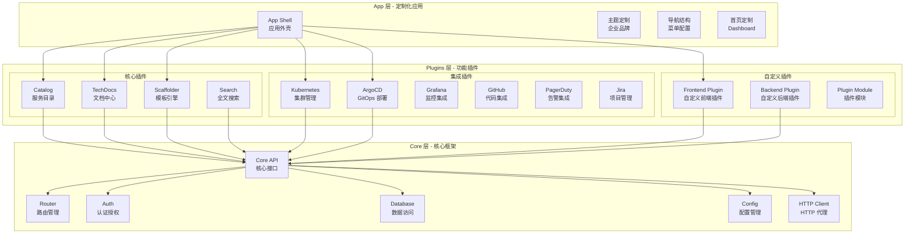

# Backstage实践指南

## 背景与问题定义

在前三篇文章中，我们讨论了 IDP 的整体架构设计、开发者门户与自助服务、以及平台工程团队建设。Backstage 作为构建内部开发者平台的事实标准，值得用一整篇文章来深入探讨其实践细节。

Backstage 起源于 Spotify 内部的开发者门户项目，2020 年开源并捐赠给 CNCF，目前是 CNCF 孵化项目。它的核心理念是插件化：把分散的开发者工具和基础设施能力整合到统一的门户中，以此消除信息孤岛、提升开发者体验。

选择 Backstage 作为 IDP 的基础框架，需要深入理解其架构原理、核心插件、扩展机制和部署方案。本文将从这些维度出发，提供一份系统化的 Backstage 实践指南。

## 核心概念

### Backstage 架构：Core → Plugins → App

Backstage 的架构遵循三层模型：Core（核心框架）、Plugins（插件层）、App（应用层）。



**Core 层**提供了插件运行的基础设施，包括路由管理、认证授权、数据访问、配置管理和 HTTP 代理。Core 层的设计原则是"薄而稳"——提供必要的基座能力，但不做业务决策。

**Plugins 层**是 Backstage 的核心价值所在。所有业务功能通过插件实现，包括核心插件（Catalog、TechDocs、Scaffolder、Search）、集成插件（Kubernetes、ArgoCD、Grafana 等）和自定义插件。

**App 层**是对 Core 和 Plugins 的组装和定制，包括主题、导航、首页布局等。每个企业的 Backstage 实例都是一个独立的 App，具有独特的品牌和功能组合。

### Backstage 生态概览

| 维度 | 数据 |
|------|------|
| 社区插件数量 | 200+ |
| GitHub Stars | 28k+ |
| 贡献者 | 1200+ |
| CNCF 状态 | Incubating |
| 主要采纳者 | Spotify、Expedia、American Airlines、NASA、Netflix、Epic Games |
| 支持的集成 | GitHub、GitLab、Bitbucket、Jira、PagerDuty、ArgoCD、Kubernetes、Grafana、Datadog 等 |

## 架构设计

### 核心插件详解

#### Catalog — 服务目录

Catalog 是 Backstage 的核心插件，管理所有服务、系统、API 和资源的元数据。Catalog 的数据模型基于 Kubernetes 风格的 API 对象，支持自定义 Kind 和 Annotation。

**Catalog 的工作流程**：

1. **注册（Registration）**：通过 `Location` 实体声明实体定义的来源（Git 仓库 URL）
2. **摄入（Ingestion）**：Catalog Backend 定期从 Location 拉取实体定义并解析
3. **存储（Storage）**：实体数据存储在 PostgreSQL 数据库中
4. **查询（Query）**：Frontend 通过 Catalog API 查询和展示实体信息

```yaml
# Catalog 实体生命周期
# location → entity (refreshed) → database → API → UI
apiVersion: backstage.io/v1alpha1
kind: Location
metadata:
  name: order-service-location
spec:
  type: url
  target: https://github.com/acme/order-service/blob/main/catalog-info.yaml
```

#### TechDocs — 文档中心

TechDocs 采用"文档即代码"模式，使用 MkDocs 构建，支持 Markdown 编写和自动发布。

**TechDocs 的工作流程**：

1. 开发者在代码仓库的 `docs/` 目录中编写 Markdown 文档
2. TechDocs Backend 检测到文档变更，触发 MkDocs 构建
3. 构建产物（静态 HTML）上传到对象存储（S3/GCS）
4. Frontend 从对象存储加载文档并渲染

#### Scaffolder — 模板引擎

Scaffolder 是 Backstage 的项目创建引擎，基于 YAML 定义的工作流执行项目初始化。

**Scaffolder 的工作流程**：

1. 开发者从模板市场选择模板
2. 填写模板参数（服务名称、语言、环境等）
3. Scaffolder 按步骤执行工作流（fetch → publish → register）
4. 创建完成后展示结果链接

#### Kubernetes — 集群管理

Kubernetes 插件将集群资源信息集成到服务详情页，开发者无需切换到 kubectl 或 Kubernetes Dashboard 即可查看 Pod 状态、日志和事件。

#### ArgoCD — GitOps 部署

ArgoCD 插件将部署状态集成到服务详情页，展示应用的同步状态、健康状态和部署历史。

## 实现方案

### 自定义 Frontend Plugin 开发

以下示例开发一个自定义前端插件，用于展示服务的成本分析信息。

```typescript
// plugins/cost-insights/src/plugin.ts
import {
  createPlugin,
  createRoutableExtension,
  createComponentExtension,
} from '@backstage/core-plugin-api';
import { rootRouteRef } from './routes';

export const costInsightsPlugin = createPlugin({
  id: 'cost-insights',
  routes: {
    root: rootRouteRef,
  },
});

export const CostInsightsPage = costInsightsPlugin.provide(
  createRoutableExtension({
    name: 'CostInsightsPage',
    component: () =>
      import('./components/CostInsightsPage').then(
        (m) => m.CostInsightsPage,
      ),
    mountPoint: rootRouteRef,
  }),
);

export const EntityCostCard = costInsightsPlugin.provide(
  createComponentExtension({
    name: 'EntityCostCard',
    component: {
      lazy: () =>
        import('./components/EntityCostCard').then(
          (m) => m.EntityCostCard,
        ),
    },
  }),
);
```

```typescript
// plugins/cost-insights/src/components/CostInsightsPage.tsx
import React, { useState, useEffect } from 'react';
import {
  Header,
  Page,
  Content,
  ContentHeader,
  InfoCard,
  Progress,
  WarningPanel,
  Table,
  TableColumn,
  StructuredMetadataTable,
} from '@backstage/core-components';
import { useApi } from '@backstage/core-plugin-api';
import { costInsightsApiRef, CostData } from '../api';

export const CostInsightsPage = () => {
  const [costData, setCostData] = useState<CostData[]>([]);
  const [loading, setLoading] = useState(true);
  const [error, setError] = useState<string | null>(null);
  const costApi = useApi(costInsightsApiRef);

  useEffect(() => {
    const fetchCostData = async () => {
      try {
        setLoading(true);
        const data = await costApi.getCostInsights();
        setCostData(data);
      } catch (err) {
        setError(err instanceof Error ? err.message : 'Unknown error');
      } finally {
        setLoading(false);
      }
    };
    fetchCostData();
  }, [costApi]);

  if (loading) return <Progress />;
  if (error) {
    return (
      <WarningPanel severity="error" title="Failed to load cost data">
        {error}
      </WarningPanel>
    );
  }

  const columns: TableColumn<CostData>[] = [
    {
      title: '服务',
      field: 'serviceName',
    },
    {
      title: '团队',
      field: 'team',
    },
    {
      title: '月度成本',
      field: 'monthlyCost',
      render: (row) => `$${row.monthlyCost.toLocaleString()}`,
    },
    {
      title: '环比变化',
      field: 'changeRate',
      render: (row) => {
        const color = row.changeRate > 0 ? '#d32f2f' : '#2e7d32';
        return (
          <span style={{ color }}>
            {row.changeRate > 0 ? '+' : ''}
            {row.changeRate.toFixed(1)}%
          </span>
        );
      },
    },
    {
      title: '优化建议',
      field: 'recommendation',
    },
  ];

  const totalCost = costData.reduce((sum, d) => sum + d.monthlyCost, 0);
  const totalChange =
    costData.reduce((sum, d) => sum + d.changeRate, 0) / costData.length;

  return (
    <Page themeId="tool">
      <Header title="成本分析" subtitle="服务基础设施成本概览" />
      <Content>
        <ContentHeader title="成本总览">
          {/* 可以添加操作按钮 */}
        </ContentHeader>
        <InfoCard title="成本摘要">
          <StructuredMetadataTable
            metadata={{
              '月度总成本': `$${totalCost.toLocaleString()}`,
              '服务数量': costData.length,
              '平均环比变化': `${totalChange > 0 ? '+' : ''}${totalChange.toFixed(1)}%`,
              '可优化成本': `$${costData
                .filter((d) => d.recommendation)
                .reduce((sum, d) => sum + d.monthlyCost * 0.2, 0)
                .toLocaleString()}`,
            }}
          />
        </InfoCard>
        <Table
          title="服务成本明细"
          columns={columns}
          data={costData}
          options={{
            paging: true,
            pageSize: 20,
            filtering: true,
            sorting: true,
          }}
        />
      </Content>
    </Page>
  );
};
```

```typescript
// plugins/cost-insights/src/components/EntityCostCard.tsx
import React from 'react';
import { InfoCard, StructuredMetadataTable } from '@backstage/core-components';
import { useEntity } from '@backstage/plugin-catalog-react';
import { useApi } from '@backstage/core-plugin-api';
import { costInsightsApiRef } from '../api';

export const EntityCostCard = () => {
  const { entity } = useEntity();
  const costApi = useApi(costInsightsApiRef);

  // 在实际应用中，这里应该从 API 获取数据
  // 此处为简化示例
  const serviceName = entity.metadata.name;

  return (
    <InfoCard title="成本信息">
      <StructuredMetadataTable
        metadata={{
          服务: serviceName,
          月度成本: 'Loading...',
          环比变化: 'Loading...',
        }}
      />
    </InfoCard>
  );
};
```

### 自定义 Backend Plugin 开发

以下示例开发一个自定义后端插件，提供成本分析 API。

```typescript
// plugins/cost-insights-backend/src/plugin.ts
import {
  createBackendPlugin,
  coreServices,
} from '@backstage/backend-plugin-api';
import { createRouter } from './router';

export const costInsightsBackendPlugin = createBackendPlugin({
  pluginId: 'cost-insights',
  register(env) {
    env.registerInit({
      deps: {
        logger: coreServices.logger,
        config: coreServices.rootConfig,
        httpRouter: coreServices.httpRouter,
        discovery: coreServices.discovery,
      },
      async init({ logger, config, httpRouter, discovery }) {
        const router = await createRouter({
          logger,
          config,
          discovery,
        });
        httpRouter.use(router);
        logger.info('Cost Insights backend plugin initialized');
      },
    });
  },
});
```

```typescript
// plugins/cost-insights-backend/src/router.ts
import express from 'express';
import Router from 'express-promise-router';
import { LoggerService } from '@backstage/backend-plugin-api';
import { Config } from '@backstage/config';
import { DiscoveryService } from '@backstage/backend-plugin-api';

export interface RouterOptions {
  logger: LoggerService;
  config: Config;
  discovery: DiscoveryService;
}

export async function createRouter(
  options: RouterOptions,
): Promise<express.Router> {
  const { logger, config } = options;
  const router = Router();
  router.use(express.json());

  // 获取所有服务的成本数据
  router.get('/insights', async (_req, res) => {
    logger.info('Fetching cost insights');

    // 在实际应用中，这里应该调用云厂商的 Cost API
    // 此处为简化示例
    const costData = [
      {
        serviceName: 'order-service',
        team: 'order-team',
        monthlyCost: 2500,
        changeRate: 5.2,
        recommendation: '考虑使用 Reserved Instances',
      },
      {
        serviceName: 'payment-service',
        team: 'payment-team',
        monthlyCost: 1800,
        changeRate: -2.1,
        recommendation: null,
      },
      {
        serviceName: 'user-service',
        team: 'user-team',
        monthlyCost: 1200,
        changeRate: 12.5,
        recommendation: 'HPA 配置过激进，建议调整',
      },
    ];

    res.json(costData);
  });

  // 获取单个服务的成本数据
  router.get('/insights/:serviceName', async (req, res) => {
    const { serviceName } = req.params;
    logger.info(`Fetching cost insights for ${serviceName}`);

    // 简化示例
    res.json({
      serviceName,
      monthlyCost: 2000,
      changeRate: 3.5,
      breakdown: {
        compute: 1200,
        storage: 400,
        network: 200,
        other: 200,
      },
    });
  });

  // 获取成本优化建议
  router.get('/recommendations', async (_req, res) => {
    logger.info('Fetching cost recommendations');

    res.json([
      {
        id: 'rec-001',
        type: 'reserved-instance',
        serviceName: 'order-service',
        potentialSaving: 500,
        description: '将 3 个 On-Demand 实例转为 Reserved Instances',
        priority: 'high',
      },
      {
        id: 'rec-002',
        type: 'right-sizing',
        serviceName: 'user-service',
        potentialSaving: 300,
        description: 'CPU 利用率持续低于 30%，建议降低实例规格',
        priority: 'medium',
      },
    ]);
  });

  // 健康检查
  router.get('/health', async (_req, res) => {
    res.json({ status: 'ok' });
  });

  return router;
}
```

### Backstage 部署方案

Backstage 的生产部署通常使用 Helm Chart，以下是完整的部署配置。

#### 1. Helm Chart 部署配置

```yaml
# helm-values.yaml - Backstage Helm 部署配置
# helm repo add backstage https://backstage.github.io/charts
# helm install backstage backstage/backstage -f helm-values.yaml

backstage:
  appConfig:
    app:
      title: "Acme Developer Platform"
      baseUrl: https://idp.acme.com

    organization:
      name: "Acme Corporation"

    backend:
      baseUrl: https://idp.acme.com
      listen:
        port: 7007
      csp:
        connect-src: ["'self'", 'http:', 'https:']
        # 允许从任何来源加载（生产环境应限制）
        img-src: ["'self'", 'data:', 'https:']
      cors:
        origin: https://idp.acme.com
        methods: [GET, HEAD, PATCH, POST, PUT, DELETE]
        credentials: true
      database:
        client: pg
        connection:
          host: ${POSTGRES_HOST}
          port: '5432'
          user: ${POSTGRES_USER}
          password: ${POSTGRES_PASSWORD}
          database: backstage
          ssl:
            ca: ${POSTGRES_CA_CERT}
            rejectUnauthorized: true

    auth:
      environment: production
      providers:
        github:
          production:
            clientId: ${GITHUB_CLIENT_ID}
            clientSecret: ${GITHUB_CLIENT_SECRET}
        oidc:
          production:
            clientId: ${OIDC_CLIENT_ID}
            clientSecret: ${OIDC_CLIENT_SECRET}
            issuer: ${OIDC_ISSUER}
            callbackUrl: https://idp.acme.com/api/auth/oidc/handler/frame

    integrations:
      github:
        - host: github.com
          token: ${GITHUB_TOKEN}
          apps:
            - appId: ${GITHUB_APP_ID}
              webhookUrl: https://idp.acme.com/api/github/webhook
              privateKey: |
                ${GITHUB_APP_PRIVATE_KEY}
              clientId: ${GITHUB_APP_CLIENT_ID}
              clientSecret: ${GITHUB_APP_CLIENT_SECRET}

    catalog:
      rules:
        - allow: [Component, System, API, Resource, Location, Template, Group, User]
      locations:
        - type: url
          target: https://github.com/acme/idp-catalog/blob/main/catalog.yaml
        - type: url
          target: https://github.com/acme/idp-templates/blob/main/templates.yaml
      providers:
        githubOrg:
          id: acme
          githubUrl: https://github.com
          orgs: [acme]
          schedule:
            frequency: { hours: 1 }
            timeout: { minutes: 5 }

    techdocs:
      builder: 'local'  # 或 'external' 使用外部 CI 构建
      generator:
        runIn: 'docker'  # 安全隔离
      publisher:
        type: 'awsS3'
        awsS3:
          bucketName: ${TECHDOCS_BUCKET}
          region: ${AWS_REGION}
          endpoint: https://s3.${AWS_REGION}.amazonaws.com

    kubernetes:
      serviceLocatorMethod:
        type: multiTenant
      clusterLocatorMethods:
        - type: config
          clusters:
            - name: production
              url: ${K8S_PROD_URL}
              authProvider: serviceAccount
              serviceAccountToken: ${K8S_PROD_TOKEN}
              namespace: backstage
            - name: staging
              url: ${K8S_STAGING_URL}
              authProvider: serviceAccount
              serviceAccountToken: ${K8S_STAGING_TOKEN}
              namespace: backstage

    argocd:
      appLocatorMethods:
        - type: config
          instances:
            - name: production
              url: ${ARGOCD_PROD_URL}
              token: ${ARGOCD_PROD_TOKEN}
            - name: staging
              url: ${ARGOCD_STAGING_URL}
              token: ${ARGOCD_STAGING_TOKEN}

    grafana:
      domain: ${GRAFANA_URL}
      unifiedAlerting: true

  # 容器镜像配置
  image:
    registry: ghcr.io
    repository: acme/backstage
    tag: "2.3.0"
    pullPolicy: IfNotPresent

  # 资源配置
  resources:
    requests:
      cpu: 500m
      memory: 512Mi
    limits:
      cpu: "2"
      memory: 2Gi

  # 副本数
  replicas: 3

  # 亲和性配置（跨可用区部署）
  affinity:
    podAntiAffinity:
      preferredDuringSchedulingIgnoredDuringExecution:
        - weight: 100
          podAffinityTerm:
            labelSelector:
              matchExpressions:
                - key: app.kubernetes.io/name
                  operator: In
                  values:
                    - backstage
            topologyKey: topology.kubernetes.io/zone

# PostgreSQL 数据库配置
postgresql:
  enabled: false  # 使用外部 PostgreSQL

# Ingress 配置
ingress:
  enabled: true
  className: 11-Nginx基础概述
  annotations:
    cert-manager.io/cluster-issuer: letsencrypt-prod
    11-Nginx基础概述.ingress.kubernetes.io/ssl-redirect: "true"
    11-Nginx基础概述.ingress.kubernetes.io/proxy-body-size: "50m"
  hosts:
    - host: idp.acme.com
      paths:
        - path: /
          pathType: Prefix
  tls:
    - secretName: backstage-tls
      hosts:
        - idp.acme.com

# Service Monitor（Prometheus 监控）
serviceMonitor:
  enabled: true
  interval: 30s
  path: /metrics
```

#### 2. 认证集成

Backstage 支持多种认证提供者，生产环境通常使用企业 SSO：

| 认证提供者 | 适用场景 | 配置复杂度 | 说明 |
|-----------|---------|-----------|------|
| GitHub OAuth | GitHub 组织 | 低 | 最简单的认证方式 |
| OIDC（Okta/Auth0） | 企业 SSO | 中 | 支持企业级 SSO |
| SAML | 大型企业 | 高 | 兼容遗留系统 |
| LDAP | 内网环境 | 高 | 兼容传统基础设施 |
| Guest | 开发环境 | 最低 | 仅用于本地开发 |

#### 3. 权限模型

Backstage 支持基于角色的访问控制（RBAC），从 v1.21 开始提供正式的权限框架：

```typescript
// packages/backend/src/plugins/permission.ts
// 注意：权限名以各插件实际注册的 Permission ID 为准，以下为示意
import {
  PermissionPolicy,
  PolicyDecision,
  isResourcePermission,
} from '@backstage/plugin-permission-common';
import {
  BackstageIdentityResponse,
  IdentityClient,
} from '@backstage/plugin-auth-node';

export class DefaultPermissionPolicy implements PermissionPolicy {
  async handle(
    request: any,
    identity?: BackstageIdentityResponse,
  ): Promise<PolicyDecision> {
    // 管理员拥有所有权限
    if (identity?.identity.ownershipEntityRefs.includes('group:admin')) {
      return { result: 'ALLOW' };
    }

    // 只读权限：所有认证用户都可以查看
    if (request.permission.name === 'catalog.entity.read') {
      return { result: 'ALLOW' };
    }

    // 写入权限：只有实体所有者可以修改
    if (
      isResourcePermission(request.permission) &&
      request.permission.name === 'catalog.entity.update'
    ) {
      // 检查请求者是否是实体所有者
      if (identity) {
        const entityOwner = request.resourceRef;
        if (
          identity.identity.ownershipEntityRefs.some(
            (ref) => ref === entityOwner,
          )
        ) {
          return { result: 'ALLOW' };
        }
      }
      return { result: 'DENY' };
    }

    // Scaffolder 模板执行权限
    if (request.permission.name === 'scaffolder.template.execute') {
      return { result: 'ALLOW' };
    }

    // 默认拒绝
    return { result: 'DENY' };
  }
}
```

### Backstage 与 CI/CD 集成

```yaml
# .github/workflows/backstage-deploy.yaml
name: Deploy Backstage

on:
  push:
    branches: [main]
    paths:
      - 'packages/**'
      - 'plugins/**'
      - 'app-config.*.yaml'
      - 'helm-values.yaml'

jobs:
  build:
    runs-on: ubuntu-latest
    steps:
      - uses: actions/checkout@v4

      - name: Setup Node.js
        uses: actions/setup-node@v4
        with:
          node-version: '20'
          cache: 'yarn'

      - name: Install dependencies
        run: yarn install --frozen-lockfile

      - name: Run tests
        run: yarn test:all

      - name: Build backend
        run: yarn workspace backend build

      - name: Build and push Docker image
        uses: docker/build-push-action@v5
        with:
          context: .
          push: true
          tags: |
            ghcr.io/acme/backstage:${{ github.sha }}
            ghcr.io/acme/backstage:latest

      - name: Deploy to Kubernetes
        run: |
          helm upgrade backstage backstage/backstage \
            --namespace backstage \
            -f helm-values.yaml \
            --set backstage.image.tag=${{ github.sha }} \
            --wait --timeout 5m
```

## 最佳实践

### 插件开发规范

**命名规范**：插件 ID 使用 kebab-case（如 `cost-insights`），NPM 包名使用 `@acme/backstage-plugin-cost-insights`。

**前后端分离**：每个功能模块应该拆分为独立的 Frontend Plugin 和 Backend Plugin，遵循 Backstage 的插件架构。

**API 设计**：Backend Plugin 的 API 应该遵循 RESTful 风格，使用 OpenAPI 规范定义接口。API 版本化以支持向后兼容。

**错误处理**：Frontend Plugin 应该优雅地处理 API 错误，展示用户友好的错误信息而非技术堆栈。

**测试要求**：每个插件必须包含单元测试和集成测试。单元测试覆盖率不低于 80%。

### 配置管理

**环境隔离**：使用 `app-config.yaml`（基础配置）+ `app-config.production.yaml`（生产覆盖）+ 环境变量（敏感信息）的三层配置管理策略。

**密钥管理**：所有密钥（数据库密码、API Token 等）通过环境变量注入，不存储在配置文件中。生产环境推荐使用 Vault 或 Kubernetes Secrets。

**配置校验**：在 CI 流水线中校验配置文件的语法和完整性，防止配置错误导致生产事故。

### 性能优化

**数据库连接池**：配置合理的 PostgreSQL 连接池大小，避免连接泄漏。建议连接池大小为 CPU 核心数 * 2 + 磁盘数。

**缓存策略**：Catalog 实体数据可以使用内存缓存减少数据库查询。缓存 TTL 设置为 30 秒到 5 分钟，根据数据变更频率调整。

**前端性能**：使用 Code Splitting 减少首屏加载时间。每个 Frontend Plugin 独立打包，按需加载。

**TechDocs 构建**：对于大型组织，TechDocs 应该使用外部 CI 构建（`builder: external`），避免在 Backstage 进程内执行 MkDocs 构建影响性能。

## 效果度量

### Backstage 平台运营指标

| 指标 | 度量方式 | 目标值 | 说明 |
|------|---------|--------|------|
| 页面加载时间（P95） | 前端性能监控 | < 2 秒 | 首屏加载时间 |
| API 响应时间（P95） | 后端性能监控 | < 500ms | 核心 API 响应 |
| 可用性 | 正常运行时间 | > 99.9% | 平台可用性 |
| 服务目录覆盖率 | 已注册服务 / 总服务 | > 95% | 服务目录完整性 |
| 文档覆盖率 | 有文档的服务 / 总服务 | > 80% | 文档完整性 |
| 模板使用率 | 通过模板创建的服务 / 新服务 | > 90% | 黄金路径采纳率 |
| 搜索使用率 | 日均搜索次数 / 日活用户 | > 2 | 搜索功能价值 |

### 插件生态指标

| 指标 | 度量方式 | 目标值 |
|------|---------|--------|
| 已安装插件数 | 配置统计 | 持续增长 |
| 自定义插件数 | 代码仓库统计 | > 3 |
| 插件可用性 | 监控面板 | > 99.5% |
| 插件用户满意度 | NPS 调研 | > 40 |

## 总结

Backstage 是构建内部开发者平台的最佳实践框架，其插件化架构、丰富的核心功能和活跃的社区生态使其成为行业事实标准。本文从架构原理、核心插件、自定义插件开发和部署方案四个维度，系统化地介绍了 Backstage 的实践方法。

Backstage 的三层架构（Core → Plugins → App）确保了框架的稳定性和扩展性：Core 层提供基座能力，Plugins 层实现业务功能，App 层负责定制化。自定义插件的开发需要遵循前后端分离的原则，Frontend Plugin 负责 UI 渲染，Backend Plugin 负责数据处理和外部 API 代理。生产部署推荐使用 Helm Chart，配置管理采用三层策略（基础配置 + 环境覆盖 + 环境变量）。

在接下来的模块中，我们将进入可观测性与监控领域，探讨日志、指标、链路追踪三大支柱，以及 SLO/SLI/SLA 实践、告警策略与 On-Call 管理等关键主题。
