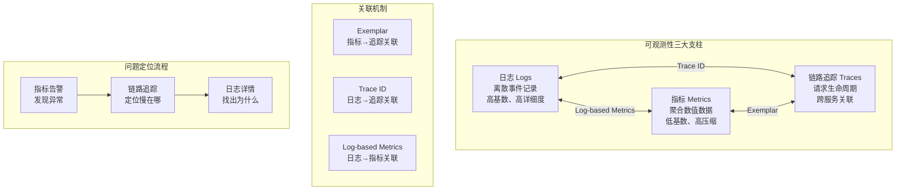
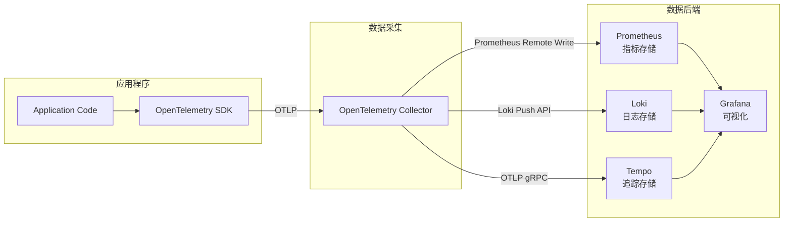
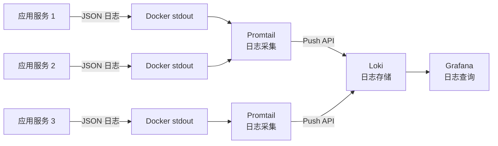

# 三大支柱：日志、指标、链路追踪

## 背景与问题定义

在现代分布式系统中，一个用户请求可能经过网关、认证服务、业务服务、缓存、数据库、消息队列等多个组件。当系统出现故障时，如果缺乏系统化的可观测性能力，排查问题就如同在暗室中寻找一根针。

"可观测性（Observability）"一词源自控制论，指通过系统的外部输出推断其内部状态的能力。落到软件工程领域，它指的是团队借助遥测数据（日志、指标、链路追踪）理解系统行为、定位问题的能力。

可观测性区别于传统监控的关键在于：监控回答"我知道哪里出了问题"，而可观测性回答"我为什么出了问题"。监控是已知的已知（Known Knowns），可观测性是未知的未知（Unknown Unknowns）。

企业实践中，可观测性建设面临的核心问题包括：

**数据碎片化**：日志、指标、链路追踪数据分散在不同系统中，缺乏统一的关联机制。开发者在排查问题时需要在 Grafana、Kibana、Jaeger 之间反复切换，效率低下。

**标准不统一**：不同团队使用不同的日志格式、指标命名规范和追踪上下文传播协议，导致数据难以聚合和对比。

**成本失控**：可观测性数据的存储成本随业务增长而快速膨胀，缺乏有效的数据治理和降采样策略。

## 核心概念

### 可观测性三大支柱的定义与关系



三大支柱各有其独特的数据特征和使用场景：

| 维度 | 日志（Logs） | 指标（Metrics） | 链路追踪（Traces） |
|------|-------------|----------------|-------------------|
| 数据模型 | 离散事件 | 时序数值 | 有向无环图（DAG） |
| 基数 | 高（每条日志唯一） | 低（标签组合有限） | 中（每个请求唯一） |
| 数据量 | 大 | 小 | 中 |
| 查询模式 | 全文搜索、关键字过滤 | 聚合计算、趋势分析 | 路径分析、延迟分解 |
| 适用场景 | 错误排查、审计追踪 | 容量规划、告警触发 | 性能分析、依赖梳理 |
| 典型工具 | Loki、Elasticsearch | Prometheus、Thanos | Jaeger、Tempo |
| 存储成本 | 高 | 低 | 中 |
| 保留周期 | 7-30 天 | 1-2 年 | 7-30 天 |

### 三大支柱的协同工作

在实际的问题定位中，三大支柱协同工作，形成"指标发现问题 → 追踪定位范围 → 日志确认原因"的排查闭环：

1. **指标告警**：Prometheus 检测到 P99 延迟异常升高，触发告警
2. **链路追踪**：在 Jaeger 中查询对应时间段的慢请求，定位到具体的服务和操作
3. **日志详情**：在 Loki 中通过 Trace ID 查询该请求的详细日志，确认错误原因

### OpenTelemetry：统一可观测性框架

OpenTelemetry（OTel）是 CNCF 的孵化项目，由 OpenTracing 和 OpenCensus 合并而来，目标是提供统一的可观测性数据采集和传播标准。

OpenTelemetry 的核心价值：

**统一 API**：提供日志、指标、链路追踪的统一采集 API，应用程序只需接入 OTel SDK，即可同时生成三种遥测数据。

**统一传播协议**：通过 W3C Trace Context 标准，统一了跨服务的追踪上下文传播协议，解决了不同追踪系统之间的互操作性问题。

**厂商中立**：OTel 只负责数据采集和传播，不涉及数据存储和可视化。后端可以灵活选择 Prometheus、Jaeger、Loki 等任何系统。



## 架构设计

### 日志：结构化日志与日志聚合

#### 结构化日志

结构化日志是将日志内容以结构化格式（通常为 JSON）输出的实践，相比传统的非结构化文本日志，结构化日志具有以下优势：

| 维度 | 非结构化日志 | 结构化日志 |
|------|-------------|-----------|
| 可解析性 | 低——需要正则提取 | 高——直接 JSON 解析 |
| 可查询性 | 低——全文搜索 | 高——字段精确查询 |
| 可聚合性 | 低——难以统计 | 高——按字段聚合 |
| 关联性 | 低——缺乏 Trace ID | 高——内置 Trace ID |
| 典型输出 | `2024-01-15 ERROR: Connection timeout` | `{"ts":"2024-01-15T10:00:00Z","level":"error","msg":"Connection timeout","trace_id":"abc123"}` |

#### 日志聚合架构

以 Loki 为核心的日志聚合架构（注：图中的 Promtail 已被 Grafana 官方弃用，新部署推荐迁移到 Grafana Alloy，传统架构仍可作为理解采集模型的参考）：



### 指标：Prometheus 与时序数据模型

#### Prometheus 时序数据模型

Prometheus 的时序数据模型由指标名称和一组键值对标签（Labels）组成：

```
metric_name{label1="value1", label2="value2"} value timestamp
```

例如：

```
http_request_duration_seconds{method="GET", path="/api/orders", status="200", le="0.5"} 120
```

#### 指标类型

| 指标类型 | 说明 | 适用场景 | 示例 |
|----------|------|---------|------|
| Counter | 单调递增计数器 | 请求总数、错误总数 | `http_requests_total` |
| Gauge | 可增减的瞬时值 | 当前连接数、队列深度 | `http_connections_active` |
| Histogram | 对观测值采样并统计分布 | 请求延迟、响应大小 | `http_request_duration_seconds` |
| Summary | 类似 Histogram，客户端计算分位数 | 需要精确分位数的场景 | `http_request_duration_seconds_summary` |

Histogram 和 Summary 的选择：在大多数场景下推荐使用 Histogram，因为它支持在服务端通过 PromQL 聚合计算分位数，而 Summary 的分位数只能在客户端计算，无法跨实例聚合。

### 链路追踪：分布式追踪与 W3C Trace Context

#### 分布式追踪核心概念

**Trace**：代表一个完整的请求生命周期，由多个 Span 组成。

**Span**：代表一次具体操作，包含操作名称、开始时间、持续时间、标签和日志。

**Span Context**：Span 的上下文信息，包括 Trace ID、Span ID 和追踪标志，通过 HTTP Header 或消息元数据在服务间传播。

#### W3C Trace Context 标准

W3C Trace Context 定义了两个 HTTP Header：

- `traceparent`：包含 Trace ID、Span ID 和追踪标志
- `tracestate`：可选的厂商特定追踪信息

格式：

```
traceparent: 00-4bf92f3577b34da6a3ce929d0e0e4736-00f067aa0ba902b7-01
             ^  ^^^^^^^^^^^^^^^^^^^^^^^^^^^^  ^^^^^^^^^^^^^^^^ ^^
             |  Trace ID                      Span ID          Flags
          Version
```

## 实现方案

### OpenTelemetry Collector 配置

OpenTelemetry Collector 是可观测性数据管道的核心组件，负责接收、处理和导出遥测数据。

```yaml
# otel-collector-config.yaml - OpenTelemetry Collector 配置
receivers:
  # 接收 OTLP 数据（来自应用程序）
  otlp:
    protocols:
      grpc:
        endpoint: 0.0.0.0:4317
      http:
        endpoint: 0.0.0.0:4318

  # 接收 Prometheus 格式的指标
  prometheus:
    config:
      scrape_configs:
        - job_name: 'otel-collector'
          scrape_interval: 15s
          static_configs:
            - targets: ['localhost:8888']

processors:
  # 批处理：将数据批量发送，减少网络开销
  batch:
    send_batch_size: 1024
    send_batch_max_size: 2048
    timeout: 5s

  # 内存限制：防止 OOM
  memory_limiter:
    check_interval: 1s
    limit_mib: 512
    spike_limit_mib: 128

  # 资源属性：添加集群和环境信息
  resource:
    attributes:
      - key: cluster
        value: production
        action: upsert
      - key: environment
        value: prod
        action: upsert

  # 过滤：移除不需要的数据
  filter:
    error_mode: ignore
    traces:
      span:
        - 'attributes["http.route"] == "/health"'
        - 'attributes["http.route"] == "/metrics"'
    metrics:
      metric:
        - 'name == "process.runtime.go.gc.pause_ns"'

  # 属性处理：规范化标签名
  transform:
    error_mode: ignore
    metric_statements:
      - context: metric
        statements:
          - set(description, "") where name == "http.server.duration"
          - set(name, "http.server.request.duration") where name == "http.server.duration"

exporters:
  # 导出到 Prometheus（指标）
  prometheusremotewrite:
    endpoint: http://prometheus:9090/api/v1/write
    resource_to_telemetry_conversion:
      enabled: true

  # 导出到 Loki（日志）
  # 注意：loki exporter 已在 Collector contrib v0.87 移除，
  # Loki 3.x 原生支持 OTLP（HTTP 端点为 /otlp）
  otlphttp/loki:
    endpoint: http://loki:3100/otlp

  # 导出到 Tempo（追踪）
  otlphttp:
    endpoint: http://tempo:4318

  # 调试输出（开发环境）
  debug:
    verbosity: detailed

service:
  pipelines:
    # 指标管线
    metrics:
      receivers: [otlp, prometheus]
      processors: [memory_limiter, transform, filter, batch, resource]
      exporters: [prometheusremotewrite]

    # 日志管线
    logs:
      receivers: [otlp]
      processors: [memory_limiter, batch, resource]
      exporters: [otlphttp/loki]

    # 追踪管线
    traces:
      receivers: [otlp]
      processors: [memory_limiter, filter, batch, resource]
      exporters: [otlphttp]

  # 扩展
  extensions: [health_check, pprof]

extensions:
  health_check:
    endpoint: 0.0.0.0:13133
  pprof:
    endpoint: 0.0.0.0:1777
```

### Prometheus 指标暴露代码示例

以下是 Go 语言中使用 OpenTelemetry SDK 暴露 Prometheus 指标的完整示例：

```go
// cmd/server/main.go - 带可观测性的 HTTP 服务
package main

import (
	"context"
	"fmt"
	"log"
	"net/http"
	"os"
	"os/signal"
	"syscall"
	"time"

	"github.com/prometheus/client_golang/prometheus/promhttp"
	"go.opentelemetry.io/otel"
	"go.opentelemetry.io/otel/attribute"
	"go.opentelemetry.io/otel/codes"
	"go.opentelemetry.io/otel/exporters/prometheus"
	"go.opentelemetry.io/otel/exporters/otlp/otlptrace/otlptracegrpc"
	"go.opentelemetry.io/otel/metric"
	sdkmetric "go.opentelemetry.io/otel/sdk/metric"
	"go.opentelemetry.io/otel/sdk/resource"
	sdktrace "go.opentelemetry.io/otel/sdk/trace"
	semconv "go.opentelemetry.io/otel/semconv/v1.24.0"
	"go.opentelemetry.io/otel/trace"
	"go.uber.org/zap"
)

// Application 结构体持有所有依赖
type Application struct {
	httpClient    *http.Client
	logger        *zap.Logger
	tracer        trace.Tracer
	httpCounter   metric.Int64Counter
	httpHistogram metric.Float64Histogram
}

func main() {
	// 初始化结构化日志
	logger, _ := zap.NewProduction()
	defer logger.Sync()

	ctx := context.Background()

	// 创建资源（服务元数据）
	res, err := resource.New(ctx,
		resource.WithAttributes(
			semconv.ServiceNameKey.String("order-service"),
			semconv.ServiceVersionKey.String("1.0.0"),
			semconv.DeploymentEnvironmentKey.String("production"),
		),
	)
	if err != nil {
		log.Fatalf("Failed to create resource: %v", err)
	}

	// 初始化 Prometheus 指标导出器
	promExporter, err := prometheus.New()
	if err != nil {
		log.Fatalf("Failed to create Prometheus exporter: %v", err)
	}

	// 初始化 Meter Provider
	meterProvider := sdkmetric.NewMeterProvider(
		sdkmetric.WithResource(res),
		sdkmetric.WithReader(promExporter),
	)
	defer meterProvider.Shutdown(ctx)

	otel.SetMeterProvider(meterProvider)

	// 初始化 OTLP Trace 导出器
	traceExporter, err := otlptracegrpc.New(ctx,
		otlptracegrpc.WithEndpoint("otel-collector:4317"),
		otlptracegrpc.WithInsecure(),
	)
	if err != nil {
		log.Fatalf("Failed to create trace exporter: %v", err)
	}

	// 初始化 Tracer Provider
	traceProvider := sdktrace.NewTracerProvider(
		sdktrace.WithResource(res),
		sdktrace.WithBatcher(traceExporter),
		sdktrace.WithSampler(sdktrace.ParentBased(
			sdktrace.TraceIDRatioBased(0.1), // 10% 采样率
		)),
	)
	defer traceProvider.Shutdown(ctx)

	otel.SetTracerProvider(traceProvider)

	// 创建指标
	meter := meterProvider.Meter("order-service")
	httpCounter, _ := meter.Int64Counter(
		"http.server.request.total",
		metric.WithDescription("Total number of HTTP requests"),
	)
	httpHistogram, _ := meter.Float64Histogram(
		"http.server.request.duration",
		metric.WithDescription("HTTP request duration in seconds"),
		metric.WithUnit("s"),
	)

	app := &Application{
		httpClient:    &http.Client{Timeout: 10 * time.Second},
		logger:        logger,
		tracer:        traceProvider.Tracer("order-service"),
		httpCounter:   httpCounter,
		httpHistogram: httpHistogram,
	}

	// 创建 HTTP 路由
	mux := http.NewServeMux()

	// 业务端点
	mux.HandleFunc("/api/orders", app.handleOrders)

	// Prometheus 指标端点（Prometheus exporter 会注册到默认 Registry，
	// 通过 promhttp.Handler() 暴露采集端点）
	mux.Handle("/metrics", promhttp.Handler())

	// 健康检查
	mux.HandleFunc("/health", func(w http.ResponseWriter, r *http.Request) {
		w.WriteHeader(http.StatusOK)
		fmt.Fprint(w, "ok")
	})

	server := &http.Server{
		Addr:    ":8080",
		Handler: mux,
	}

	// 优雅关闭
	go func() {
		sigCh := make(chan os.Signal, 1)
		signal.Notify(sigCh, syscall.SIGINT, syscall.SIGTERM)
		<-sigCh
		ctx, cancel := context.WithTimeout(ctx, 10*time.Second)
		defer cancel()
		server.Shutdown(ctx)
	}()

	logger.Info("Starting server on :8080")
	if err := server.ListenAndServe(); err != http.ErrServerClosed {
		log.Fatalf("Server error: %v", err)
	}
}

func (app *Application) handleOrders(w http.ResponseWriter, r *http.Request) {
	startTime := time.Now()
	ctx := r.Context()

	// 创建 Span
	ctx, span := app.tracer.Start(ctx, "handleOrders",
		trace.WithAttributes(
			attribute.String("http.method", r.Method),
			attribute.String("http.route", "/api/orders"),
		),
	)
	defer span.End()

	// 从请求头提取 Trace ID，用于日志关联
	spanCtx := span.SpanContext()
	traceID := spanCtx.TraceID().String()

	// 结构化日志，包含 Trace ID
	app.logger.Info("Processing order request",
		zap.String("trace_id", traceID),
		zap.String("method", r.Method),
		zap.String("path", r.URL.Path),
	)

	// 业务逻辑（模拟）
	if r.Method == http.MethodGet {
		app.processGetOrders(ctx, traceID)
	} else if r.Method == http.MethodPost {
		app.processCreateOrder(ctx, traceID)
	}

	// 记录指标
	duration := time.Since(startTime).Seconds()
	attrs := []attribute.KeyValue{
		attribute.String("method", r.Method),
		attribute.String("path", "/api/orders"),
		attribute.Int("status", http.StatusOK),
	}
	app.httpCounter.Add(ctx, 1, metric.WithAttributes(attrs...))
	app.httpHistogram.Record(ctx, duration, metric.WithAttributes(attrs...))

	// 补充请求属性到 Span（Exemplar 由 SDK 在导出指标时自动关联 Trace ID）
	span.SetAttributes(
		attribute.String("http.status_code", "200"),
	)

	w.Header().Set("Content-Type", "application/json")
	fmt.Fprint(w, `{"status":"ok"}`)
}

func (app *Application) processGetOrders(ctx context.Context, traceID string) {
	ctx, span := app.tracer.Start(ctx, "processGetOrders")
	defer span.End()

	app.logger.Info("Fetching orders from database",
		zap.String("trace_id", traceID),
	)

	// 模拟数据库查询
	time.Sleep(50 * time.Millisecond)
}

func (app *Application) processCreateOrder(ctx context.Context, traceID string) {
	ctx, span := app.tracer.Start(ctx, "processCreateOrder")
	defer span.End()

	app.logger.Info("Creating new order",
		zap.String("trace_id", traceID),
	)

	// 模拟业务处理
	time.Sleep(100 * time.Millisecond)

	// 模拟调用下游服务
	app.callPaymentService(ctx, traceID)
}

func (app *Application) callPaymentService(ctx context.Context, traceID string) {
	ctx, span := app.tracer.Start(ctx, "callPaymentService")
	defer span.End()

	app.logger.Info("Calling payment service",
		zap.String("trace_id", traceID),
	)

	// 模拟网络调用
	time.Sleep(30 * time.Millisecond)

	// 模拟错误
	if false {
		span.SetStatus(codes.Error, "payment service timeout")
		span.RecordError(fmt.Errorf("payment service timeout"))
		app.logger.Error("Payment service call failed",
			zap.String("trace_id", traceID),
			zap.String("error", "timeout"),
		)
	}
}
```

### 日志采集配置

> 注：Promtail 已于 2025 年被 Grafana 官方宣布弃用（仅做安全维护），官方推荐使用 Grafana Alloy 承接日志采集（Promtail 配置可通过 Alloy 内置转换器迁移）。以下配置保留为传统采集架构的示例。

```yaml
# promtail-config.yaml - Promtail 日志采集配置
server:
  http_listen_port: 9080
  grpc_listen_port: 0

positions:
  filename: /tmp/positions.yaml

clients:
  - url: http://loki:3100/loki/api/v1/push

scrape_configs:
  # 采集 Kubernetes Pod 日志
  - job_name: kubernetes-pods
    kubernetes_sd_configs:
      - role: pod
    pipeline_stages:
      # 解析 JSON 日志
      - json:
          expressions:
            level: level
            msg: msg
            trace_id: trace_id
            span_id: span_id
            service: service
            timestamp: ts

      # 设置日志时间戳
      - timestamp:
          source: timestamp
          format: RFC3339

      # 设置日志级别标签
      - labels:
          level:
          service:

      # 设置 Trace ID 标签（用于日志与追踪关联）
      - labels:
          trace_id:

      # 过滤健康检查日志
      - match:
          selector: '{http_route="/health"}'
          action: drop

      # 过滤指标端点日志
      - match:
          selector: '{http_route="/metrics"}'
          action: drop

    relabel_configs:
      # 只采集带有注解的 Pod
      - source_labels:
          - __meta_kubernetes_pod_annotation_prometheus_io_scrape
        action: keep
        regex: true
      # 使用 Pod 名称作为 job 标签
      - source_labels:
          - __meta_kubernetes_pod_label_app
        target_label: job
```

### Prometheus 常用 PromQL 查询

```promql
# HTTP 请求 P99 延迟（5 分钟窗口）
histogram_quantile(0.99,
  sum(rate(http_server_request_duration_seconds_bucket[5m])) by (le, method, path)
)

# HTTP 请求错误率（5xx 占比）
sum(rate(http_server_request_total{status=~"5.."}[5m]))
/
sum(rate(http_server_request_total[5m]))

# 服务 QPS（每秒请求数）
sum(rate(http_server_request_total[5m])) by (service)

# Pod 内存使用率
container_memory_working_set_bytes{container!="",pod!=""}
/
container_spec_memory_limit_bytes{container!="",pod!=""}

# CPU 使用率（基于 request）
sum(rate(container_cpu_usage_seconds_total{container!="",pod!=""}[5m])) by (pod)
/
sum(container_spec_cpu_quota{container!="",pod!=""}/container_spec_cpu_period{container!="",pod!=""}) by (pod)

# 请求延迟 Top 10 服务
topk(10,
  histogram_quantile(0.99,
    sum(rate(http_server_request_duration_seconds_bucket[5m])) by (le, service)
  )
)

# 通过 Trace ID 关联查询（Exemplar）
# 在 Grafana 中，指标面板支持展示 Exemplar，
# 点击数据点可以跳转到对应的 Trace
```

## 最佳实践

### 日志最佳实践

**结构化优先**：所有日志必须以 JSON 格式输出，包含 `level`、`msg`、`trace_id`、`span_id`、`timestamp` 等标准字段。

**日志级别规范**：

| 级别 | 使用场景 | 生产环境频率 |
|------|---------|-------------|
| ERROR | 需要人工介入的错误 | 低 |
| WARN | 可恢复的异常，需要关注 | 中 |
| INFO | 业务关键事件（请求处理、状态变更） | 中 |
| DEBUG | 调试信息，默认关闭 | 低 |

**日志降采样**：对于高频日志（如健康检查、指标端点），在采集阶段（Promtail）过滤掉，避免存储浪费。

**日志关联**：所有日志必须包含 Trace ID，确保可以通过 Trace ID 在 Loki 中查询某个请求的完整日志链路。

### 指标最佳实践

**命名规范**：遵循 Prometheus 命名规范，使用小写字母和下划线，指标名称以应用域为前缀。

```
# 好的命名
http_server_request_duration_seconds
http_server_request_total
order_created_total

# 差的命名
httpLatency
http_requests
orders
```

**标签设计**：标签的基数（Cardinality）必须可控。避免使用用户 ID、请求 ID 等高基数值作为标签，否则会导致指标爆炸。

```
# 好的标签设计
http_server_request_duration_seconds{method="GET", path="/api/orders", status="200"}

# 差的标签设计（user_id 基数可能达到数百万）
http_server_request_duration_seconds{method="GET", user_id="12345"}
```

**RED 方法**：对于 HTTP 服务，暴露 Request rate（请求速率）、Error rate（错误率）、Duration（延迟）三类指标，即 RED 方法。

**USE 方法**：对于基础设施资源，暴露 Utilization（利用率）、Saturation（饱和度）、Errors（错误数）三类指标，即 USE 方法。

### 链路追踪最佳实践

**采样策略**：在生产环境中，不可能对所有请求都进行追踪。推荐采样策略：

| 采样策略 | 适用场景 | 采样率 |
|----------|---------|--------|
| 概率采样 | 通用场景 | 1%-10% |
| 自适应采样 | 按流量动态调整 | 可变 |
| 优先采样 | 错误请求优先 | 错误 100%，正常 1% |
| 尾部采样 | 延迟异常的请求 | 可变 |

**Span 命名**：使用 `<操作类型> <资源>` 的命名格式，如 `GET /api/orders`、`INSERT orders`、`publish order-events`。

**上下文传播**：确保所有出站请求（HTTP、gRPC、消息队列）都传播 W3C Trace Context Header，否则追踪链路会断裂。

## 效果度量

### 可观测性成熟度模型

| 级别 | 特征 | 典型能力 |
|------|------|---------|
| L1 - 基础 | 有日志，无指标和追踪 | 应用日志、错误日志 |
| L2 - 标准化 | 日志+指标，结构化日志 | Prometheus 指标、JSON 日志 |
| L3 - 关联 | 三大支柱关联 | Trace ID 关联日志和追踪 |
| L4 - 主动 | SLO 驱动、异常检测 | SLO 告警、智能基线 |
| L5 - 预测 | AI 辅助、容量预测 | 根因分析、容量规划 |

### 可观测性 ROI 指标

| 指标 | 度量方式 | 目标值 |
|------|---------|--------|
| MTTR（平均修复时间） | 事故从发现到修复的时间 | < 30 分钟 |
| MTTD（平均检测时间） | 问题从发生到被发现的时间 | < 5 分钟 |
| 排查时间 | 定位根因所需的时间 | < 15 分钟 |
| 可观测性覆盖率 | 有完整可观测性的服务占比 | > 95% |
| 追踪覆盖率 | 有链路追踪的服务占比 | > 80% |
| 日志关联率 | 包含 Trace ID 的日志占比 | > 90% |

## 总结

可观测性三大支柱——日志、指标、链路追踪——是现代分布式系统稳定运行的基石。日志提供详细的离散事件记录，指标提供高效的聚合数值数据，链路追踪提供跨服务的请求生命周期视图。三者通过 Trace ID 和 Exemplar 相互关联，形成"指标发现问题 → 追踪定位范围 → 日志确认原因"的排查闭环。

OpenTelemetry 作为统一可观测性框架，通过标准化的 API 和传播协议，解决了可观测性数据采集的碎片化问题。OpenTelemetry Collector 作为数据管道的核心，支持接收、处理和导出多种格式的遥测数据，为后端系统的选择提供了灵活性。

在实践中，结构化日志、指标命名规范、合理的标签设计、采样策略选择是可观测性建设的关键决策。可观测性的效果应该通过 MTTR、MTTF、排查时间等业务指标来度量，而非仅仅关注技术覆盖率。

在下一篇文章中，我们将深入 SLO/SLI/SLA 实践，探讨如何基于可观测性数据定义服务质量目标，并利用错误预算指导发布决策。
