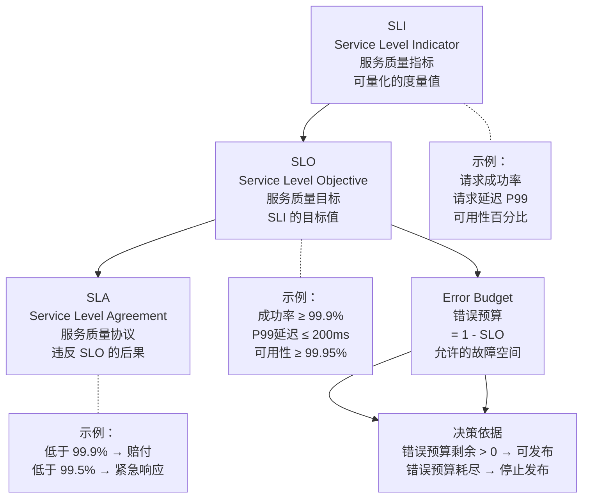
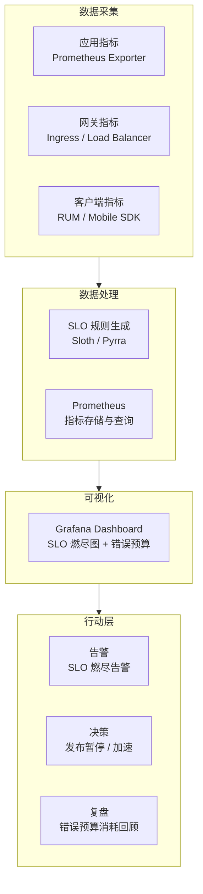

# SLO/SLI/SLA实践

## 背景与问题定义

"系统可用率 99.9%"——这是许多组织的 SLA 承诺。但这个数字在实际运行中意味着什么？可用率在月初是 99.99%、月末骤降到 99.1%，平均值仍是 99.9%，月末的用户体验却已严重劣化。更关键的是：当可用率从 99.9% 跌到 99.8% 时，应该采取什么行动？是紧急响应，还是可以等待自然恢复？

SLO/SLI/SLA 体系为这些问题提供了结构化的回答框架。它将模糊的"系统稳定性"拆解为可量化的指标（SLI）、可执行的目标（SLO）和有约束力的承诺（SLA），并通过错误预算（Error Budget）机制将稳定性与发布速度连接起来。

核心问题：**如何将系统稳定性从模糊的感知转化为可量化、可执行、可持续改进的工程实践？**

## 核心概念

### SLO、SLI、SLA 的定义与关系



| 概念 | 定义 | 作用 | 示例 |
|------|------|------|------|
| SLI | 衡量服务质量的具体指标 | 提供客观数据 | 请求成功率 = 成功请求 / 总请求 |
| SLO | SLI 要达到的目标值 | 定义可接受的质量水平 | 请求成功率 ≥ 99.9%（30 天窗口） |
| SLA | 违反 SLO 后的正式承诺 | 对外部用户的法律约束 | 可用率低于 99.9% 时赔付月费 10% |
| Error Budget | 1 - SLO = 允许的故障比例 | 连接稳定性与发布速度 | 99.9% SLO → 0.1% Error Budget → 月允许 43.2 分钟故障 |

### SLI 的分类与选择

选择正确的 SLI 是 SLO 实践的基础。Google 的 SRE 方法论将 SLI 分为三类：

| SLI 类型 | 定义 | 采集方式 | 适用场景 |
|---------|------|---------|---------|
| 可用性（Availability） | 成功请求的比例 | HTTP 状态码统计 | 所有面向用户的服务 |
| 延迟（Latency） | 请求响应时间的分布 | 请求计时统计 | 交互型服务 |
| 正确性（Correctness） | 返回结果的准确性 | 业务校验 / 用户反馈 | 数据处理型服务 |

**SLI 选择原则**：
1. **面向用户**：SLI 应衡量用户实际体验，而非内部系统指标（如 CPU 利用率）
2. **可量化**：SLI 必须是可精确计算的数值，而非主观评价
3. **可归因**：SLI 的变化应可追溯到具体的系统变更或外部因素
4. **可操作**：当 SLI 低于 SLO 时，团队应能采取明确的改进行动

### 错误预算的决策机制

错误预算是 SLO 实践中最具变革性的概念——它将稳定性与发布速度从对立关系变为互补关系：

| 状态 | 错误预算剩余 | 决策 | 行动 |
|------|-------------|------|------|
| 充裕 | > 50% | 可承担风险 | 加速发布、推进实验性变更 |
| 正常 | 10%-50% | 正常节奏 | 标准发布流程 |
| 紧张 | 1%-10% | 谨慎行事 | 降低发布频率、加强测试 |
| 耗尽 | 0% | 停止发布 | 全面转向稳定性修复 |

**计算示例**：

以月度 30 天窗口、99.9% SLO 为例：

```
总请求时间窗口 = 30 × 24 × 60 × 60 = 2,592,000 秒
允许的不可用时间 = 2,592,000 × 0.1% = 2,592 秒 ≈ 43.2 分钟
```

这意味着在一个月内，累计 43.2 分钟的服务不可用是被允许的——这就是错误预算。

## 架构设计

### SLO 监控架构



### SLO 燃尽图

SLO 燃尽图是错误预算消耗的可视化工具，展示预算从满额到消耗的过程：

```
错误预算消耗趋势（30天窗口）

100% |████████████████████████████████| 月初：预算满额
 80% |████████████████████████████    | 正常消耗
 60% |████████████████████████        | 正常消耗
 40% |████████████████                | 一次故障消耗 20%
 20% |████████                        | ⚠️ 警告：预算紧张
  5% |██                              | 🔴 紧急：预算即将耗尽
  0% |                                 | 🚫 停止发布，全力修复
```

## 实现方案

### 工具链选型

| 工具 | 类型 | 优势 | 适用场景 |
|------|------|------|---------|
| Sloth | 开源 | 自动生成 Prometheus SLO 规则 | Prometheus 用户首选 |
| Pyrra | 开源 | CRD 定义 SLO + Grafana Dashboard 生成 | Kubernetes 环境 |
| Nobl9 | 商业 | 多数据源、高级告警 | 企业级 SLO 管理 |
| Google Cloud SLO | 云服务 | 原生 GCP 集成 | GCP 用户 |
| Datadog SLO | 商业 | 统一监控 + SLO | Datadog 用户 |

### Sloth SLO 配置示例

Sloth 是 Prometheus SLO 规则生成器，通过简化的 YAML 定义 SLO，自动生成复杂的 Prometheus recording rules 和 alerting rules：

```yaml
# Sloth SLO 定义文件
version: "prometheus/v1"
service: "orders-service"
slos:
  # SLO 1：请求成功率
  - name: "availability-success-rate"
    description: "订单服务的请求成功率 SLO"
    target: 0.999     # 99.9%
    window: 30d       # 30 天滚动窗口
    sli:
      events:
        error_query:
          expr: sum(rate(http_requests_total{job="orders-service",code=~"5.."}[{{.window}}]))
        total_query:
          expr: sum(rate(http_requests_total{job="orders-service"}[{{.window}}]))
    alerting:
      name: OrdersServiceAvailabilitySLOBurnRate
      labels:
        team: team-a
        service: orders-service
        slo: availability
      annotations:
        summary: "Orders service availability SLO is burning too fast"
        runbook_url: "https://runbooks.example.com/orders-availability"
      page_alert:
        labels:
          severity: critical
      ticket_alert:
        labels:
          severity: warning

  # SLO 2：请求延迟
  - name: "latency-p99"
    description: "订单服务 P99 延迟 SLO"
    target: 0.99     # 99% 的请求延迟 < 200ms
    window: 30d
    sli:
      events:
        error_query:
          expr: sum(rate(http_request_duration_seconds_bucket{job="orders-service",le="0.2"}[{{.window}}]))
        total_query:
          expr: sum(rate(http_request_duration_seconds_count{job="orders-service"}[{{.window}}]))
    alerting:
      name: OrdersServiceLatencySLOBurnRate
      labels:
        team: team-a
        service: orders-service
        slo: latency
      annotations:
        summary: "Orders service latency SLO is burning too fast"
      page_alert:
        labels:
          severity: critical
      ticket_alert:
        labels:
          severity: warning
```

### Pyrra SLO CRD 示例

Pyrra 使用 Kubernetes CRD 定义 SLO，更适合 GitOps 管理：

```yaml
apiVersion: pyrra.dev/v1alpha1
kind: ServiceLevelObjective
metadata:
  name: orders-service-availability
  namespace: monitoring
  labels:
    team: team-a
    service: orders-service
spec:
  target: "99.9"
  window: 30d
  serviceLevelIndicator:
    prometheus:
      errorQuery: sum(rate(http_requests_total{job="orders-service",code=~"5.."}[{{window}}]))
      totalQuery: sum(rate(http_requests_total{job="orders-service"}[{{window}}]))
  alerting:
    name: OrdersServiceAvailabilityBurnRate
```

### 错误预算决策集成

将错误预算状态集成到 CI/CD 流水线中，实现自动化的发布暂停：

```yaml
name: Error Budget Check

on:
  workflow_call:
    inputs:
      service:
        required: true
        type: string

jobs:
  check-budget:
    runs-on: ubuntu-latest
    outputs:
      budget_remaining: ${{ steps.check.outputs.budget_remaining }}
      can_deploy: ${{ steps.check.outputs.can_deploy }}
    steps:
      - name: Query error budget
        id: check
        run: |
          # 从 Prometheus 查询错误预算剩余
          BUDGET=$(curl -s "${{ secrets.PROMETHEUS_URL }}/api/v1/query" \
            --data-urlencode "query=1 - (sum(rate(http_requests_total{job=\"${{ inputs.service }}\",code=~\"5..\"}[30d])) / sum(rate(http_requests_total{job=\"${{ inputs.service }}\"}[30d])))" \
            | jq -r '.data.result[0].value[1]')

          echo "budget_remaining=$BUDGET" >> $GITHUB_OUTPUT

          # 错误预算 > 0 才允许发布
          if (( $(echo "$BUDGET > 0" | bc -l) )); then
            echo "can_deploy=true" >> $GITHUB_OUTPUT
            echo "✅ Error budget: ${BUDGET}% remaining — deployment allowed"
          else
            echo "can_deploy=false" >> $GITHUB_OUTPUT
            echo "🚫 Error budget exhausted — deployment blocked"
          fi

  deploy:
    needs: check-budget
    if: needs.check-budget.outputs.can_deploy == 'true'
    runs-on: ubuntu-latest
    steps:
      - name: Deploy
        run: echo "Deploying ${SERVICE} with ${BUDGET}% error budget remaining"
        env:
          SERVICE: ${{ inputs.service }}
          BUDGET: ${{ needs.check-budget.outputs.budget_remaining }}
```

### 分步实施指南

**第一步：识别关键 SLI（Week 1）**

1. 从用户旅程出发，识别最关键的用户交互路径
2. 为每条关键路径定义 SLI（可用性、延迟）
3. 确定数据采集方式

**第二步：设定初始 SLO（Week 2-3）**

1. 基于过去 3-6 个月的性能数据设定初始 SLO
2. 初始 SLO 应略高于当前实际表现，留有改进空间但不过激进
3. 与业务方确认 SLO 是否满足业务需求

| 步骤 | 方法 | 输出 |
|------|------|------|
| 分析历史数据 | 查询 Prometheus 过去 90 天的指标 | 当前实际 SLI 值 |
| 设定目标 | 在实际值基础上 +0.5%-1% | 初始 SLO 值 |
| 业务确认 | 与产品经理确认是否满足业务需求 | 确认的 SLO |

**第三步：建立监控与告警（Week 4-5）**

1. 使用 Sloth/Pyrra 生成 SLO 规则
2. 配置多燃烧率告警（1h/6h/3d 窗口）
3. 建立 Grafana Dashboard 展示错误预算

**第四步：错误预算驱动决策（Week 6+）**

1. 在 CI/CD 流水线中集成错误预算检查
2. 建立"错误预算耗尽 → 停止发布"的自动化机制
3. 定期（每月）回顾 SLO 达成情况和错误预算消耗

## 最佳实践

### 业界推荐做法

1. **从用户旅程出发选择 SLI**：不是"服务器的 CPU 利用率"，而是"用户能否成功下单"
2. **初始 SLO 保守设定**：略高于当前实际表现，避免过激目标导致频繁预算耗尽
3. **30 天滚动窗口**：避免固定月窗口的"月初放纵、月末紧缩"问题
4. **多燃烧率告警**：短窗口（1h/6h）用于紧急告警，长窗口（3d）用于趋势预警
5. **错误预算是开发团队的权利**：预算充裕时可以承担风险（发布新功能），预算耗尽时必须收敛风险（修复稳定性）

### 常见反模式与规避方法

| 反模式 | 表现 | 危害 | 规避方法 |
|--------|------|------|---------|
| SLA 混淆 | 将 SLA（商业承诺）当作 SLO（内部目标） | 过高的内部目标浪费资源 | SLO 是内部目标，SLA 是外部承诺，两者可以不同 |
| 内部指标做 SLI | 用 CPU 利用率而非请求成功率做 SLI | 无法反映用户实际体验 | SLI 必须面向用户 |
| 100% SLO | 设定 100% 可用性目标 | 错误预算为零，任何故障都触发紧急响应 | SLO ≤ 99.99%，留有预算空间 |
| 固定窗口 | 使用固定月窗口而非滚动窗口 | 月末可用性下降但窗口重置 | 使用 30 天滚动窗口 |
| 告警不分级别 | 所有 SLO 偏离都发紧急告警 | 告警疲劳 | 多燃烧率分级告警 |

## 效果度量

### SLO 实践效能指标

| 指标 | 定义 | 目标 |
|------|------|------|
| SLO 覆盖率 | 已定义 SLO 的关键服务 / 总关键服务 | > 90% |
| SLO 达成率 | 月度 SLO 达成的比例 | > 95% |
| 错误预算利用率 | 实际消耗的错误预算 / 总错误预算 | 30%-70%（过低浪费，过高风险） |
| SLO 偏离响应时间 | 从 SLO 偏离告警到开始响应的时间 | < 15 分钟 |
| 发布暂停频率 | 因错误预算耗尽而暂停发布的次数 | < 2 次/季度 |

### SLO 实践成熟度模型

| 级别 | 特征 | 典型表现 |
|------|------|---------|
| L0 - 无 SLO | 不定义服务质量目标 | 依赖主观感受判断稳定性 |
| L1 - SLA 驱动 | 仅对外承诺 SLA，内部无 SLO | SLA 达标但用户体验差 |
| L2 - SLO 定义 | 已定义关键服务的 SLO，但缺乏告警 | Dashboard 可查看但不驱动决策 |
| L3 - 预算驱动 | 错误预算驱动发布决策 | 预算耗尽自动暂停发布 |
| L4 - 持续优化 | SLO 目标定期调整，与业务增长匹配 | SLO 随业务演进 |

## 总结

### 核心要点

1. SLI 是可量化的服务质量指标，SLO 是 SLI 的目标值，SLA 是违反 SLO 的后果——三者层次递进
2. 错误预算（1 - SLO）是连接稳定性与发布速度的桥梁——预算充裕可加速，预算耗尽须收敛
3. SLI 必须面向用户体验（请求成功率、延迟），而非内部指标（CPU、内存）
4. 30 天滚动窗口优于固定月窗口，避免"月末冲刺"现象
5. 多燃烧率告警（1h/6h/3d）实现分级响应，避免告警疲劳

### 延伸阅读

- Google SRE Team. *Site Reliability Workbook*. O'Reilly, 2018
- Sloth. *Official Documentation*. https://sloth.dev/
- Pyrra. *Official Documentation*. https://pyrra.dev/
- Nobl9. *SLO Platform*. https://nobl9.com/