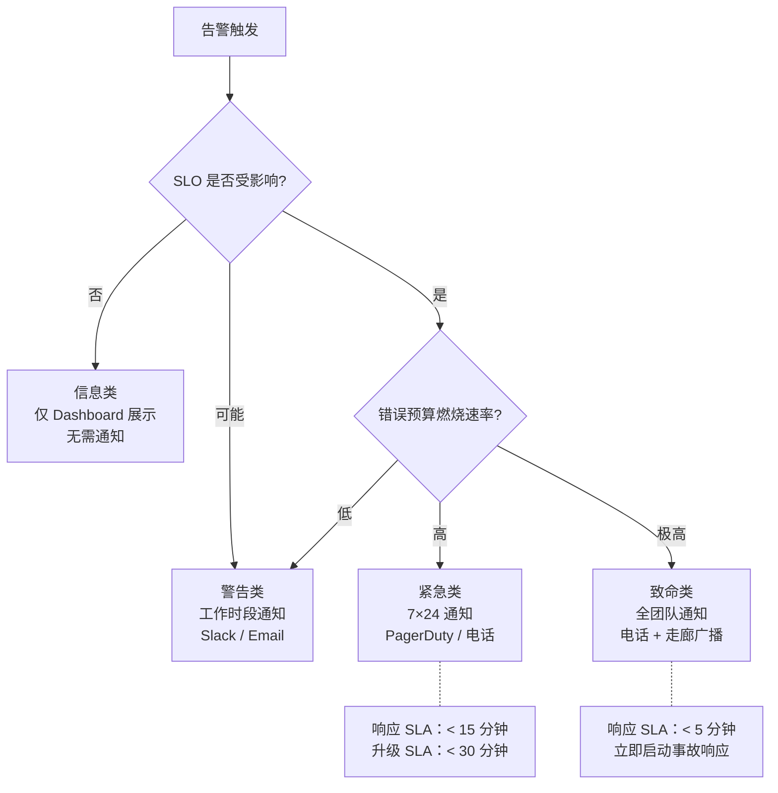
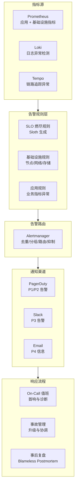

# 告警策略与On-Call管理

## 背景与问题定义

告警疲劳（Alert Fatigue）是运维团队面临的最普遍问题之一。在许多大型组织中，超过一半的告警是误报或无需处理的噪声，运维人员每天要面对大量通知。当真正的紧急故障发生时，关键告警往往被淹没在噪声中，导致响应延迟。

On-Call（值班）管理的不规范进一步加剧了这一问题：轮值不透明、响应流程不清晰、事后复盘缺失、团队士气下降——最终导致 On-Call 成为"惩罚"而非"责任"。

核心问题：**如何设计高信噪比的告警策略，并建立可持续的 On-Call 管理体系，确保真正的故障被快速响应？**

## 核心概念

### 告警设计的核心原则

| 原则 | 说明 | 反模式 |
|------|------|--------|
| 可操作性 | 每条告警必须有明确的处理动作；无法采取行动的告警不应存在 | 告警"CPU > 80%"但无后续操作指引 |
| 高信噪比 | 告警数量应控制在可处理范围内；每条告警都应有价值 | 任何指标波动都触发告警 |
| 分级处理 | 不同严重程度的告警对应不同的响应级别和通知渠道 | 所有告警都发 PagerDuty |
| 根因驱动 | 告警应指向问题的根因，而非现象 | 告警"服务慢"而非"数据库连接池耗尽" |
| SLO 对齐 | 告警应基于 SLO 燃尽率，而非原始指标阈值 | CPU > 90% 触发告警但不影响用户 |

### 告警分级模型



| 级别 | 通知方式 | 响应 SLA | 升级 SLA | 示例 |
|------|---------|---------|---------|------|
| P4 - 信息 | Dashboard | 无 | 无 | 部署完成通知 |
| P3 - 警告 | Slack/Email | 工作时段内 | 无 | 磁盘使用 > 70% |
| P2 - 紧急 | PagerDuty | 15 分钟 | 30 分钟 | SLO 燃烧率 6h 窗口超阈值 |
| P1 - 致命 | 电话 + PagerDuty | 5 分钟 | 15 分钟 | SLO 燃烧率 1h 窗口超阈值，服务不可用 |

### 多燃烧率告警策略

基于 SLO 的告警使用多窗口多燃烧率（Multi-Window Multi-Burn-Rate）策略，在快速检测与告警准确性之间取得平衡：

| 窗口 | 燃烧率 | 检测能力 | 通知级别 |
|------|--------|---------|---------|
| 1h 窗口 | 14.4x | 快速检测严重故障 | P1 - 电话 |
| 6h 窗口 | 6x | 检测中等故障 | P2 - PagerDuty |
| 1d 窗口 | 3x | 检测缓慢恶化 | P3 - Slack |
| 3d 窗口 | 1x | 长期趋势预警 | P4 - Dashboard |

> 燃烧率（Burn Rate）= 实际错误率 / SLO 允许的错误率。燃烧率 14.4x 意味着错误率是 SLO 允许值的 14.4 倍，将在约 2 小时内耗尽 30 天的错误预算。

## 架构设计

### 告警系统架构



## 实现方案

### Prometheus 告警规则示例

以下是基于 SLO 燃尽率的 Prometheus 告警规则，由 Sloth 自动生成：

```yaml
# SLO 燃尽率告警规则（由 Sloth 生成）
groups:
  # 快速检测：1h 窗口 + 6h 窗口，燃烧率 > 14.4x
  - name: orders-service-availability-slo-burn-rate-fast
    rules:
      - alert: OrdersServiceAvailabilitySLOBurnRateFast
        expr: |
          (
            sum(rate(http_requests_total{job="orders-service",code=~"5.."}[1h]))
            /
            sum(rate(http_requests_total{job="orders-service"}[1h]))
          ) > (14.4 * (1 - 0.999))
          and
          (
            sum(rate(http_requests_total{job="orders-service",code=~"5.."}[6h]))
            /
            sum(rate(http_requests_total{job="orders-service"}[6h]))
          ) > (14.4 * (1 - 0.999))
        for: 2m
        labels:
          severity: critical
          team: team-a
          slo: availability
        annotations:
          summary: "Orders service availability SLO is burning very fast"
          description: "The 1h and 6h error rates are 14.4x above the SLO target. Error budget will be exhausted in ~2h."
          runbook: "https://runbooks.example.com/orders-availability"

  # 慢速检测：6h 窗口 + 3d 窗口，燃烧率 > 6x
  - name: orders-service-availability-slo-burn-rate-slow
    rules:
      - alert: OrdersServiceAvailabilitySLOBurnRateSlow
        expr: |
          (
            sum(rate(http_requests_total{job="orders-service",code=~"5.."}[6h]))
            /
            sum(rate(http_requests_total{job="orders-service"}[6h]))
          ) > (6 * (1 - 0.999))
          and
          (
            sum(rate(http_requests_total{job="orders-service",code=~"5.."}[3d]))
            /
            sum(rate(http_requests_total{job="orders-service"}[3d]))
          ) > (6 * (1 - 0.999))
        for: 15m
        labels:
          severity: warning
          team: team-a
          slo: availability
        annotations:
          summary: "Orders service availability SLO is burning slowly"
          description: "The 6h and 3d error rates are 6x above the SLO target. Error budget will be exhausted in ~5d."
```

### Alertmanager 路由配置

```yaml
# Alertmanager 配置：去重、分组、路由、抑制
global:
  resolve_timeout: 5m
  slack_api_url: "https://hooks.slack.com/services/xxx"

route:
  receiver: "slack-default"
  group_by: ["alertname", "team", "service"]
  group_wait: 30s
  group_interval: 5m
  repeat_interval: 4h

  routes:
    # P1/P2 告警路由到 PagerDuty
    - matchers:
        - severity="critical"
      receiver: pagerduty-critical
      group_wait: 10s
      repeat_interval: 1h

    - matchers:
        - severity="warning"
      receiver: slack-warning
      group_wait: 30s
      repeat_interval: 4h

    # 按团队路由（team-a 的告警分流到团队专属接收器）
    - matchers:
        - team="team-a"
      routes:
        - matchers:
            - severity="critical"
          receiver: pagerduty-team-a
        - matchers:
            - severity="warning"
          receiver: slack-team-a

inhibit_rules:
  # 当 critical 告警存在时，抑制同一服务的 warning 告警
  - source_matchers:
      - severity="critical"
    target_matchers:
      - severity="warning"
    equal: ["alertname", "team", "service"]

receivers:
  - name: slack-default
    slack_configs:
      - channel: "#alerts-general"
        title: "[{{ .Status }}] {{ .CommonLabels.alertname }}"
        text: "{{ range .Alerts }}{{ .Annotations.description }}{{ end }}"

  - name: pagerduty-critical
    pagerduty_configs:
      - service_key: "${PAGERDUTY_SERVICE_KEY}"
        severity: critical

  - name: pagerduty-team-a
    pagerduty_configs:
      - service_key: "${PAGERDUTY_TEAM_A_KEY}"

  - name: slack-warning
    slack_configs:
      - channel: "#team-a-alerts"
```

### On-Call 轮值配置

使用 Grafana OnCall 或 PagerDuty 配置轮值：

```yaml
# Grafana OnCall 轮值配置（Terraform 资源 grafana_oncall_schedule 的字段示意）
resource: grafana_oncall_schedule
name: team-a-primary
type: rolling
time_zone: Asia/Shanghai
shifts:
  - name: "Weekday Primary"
    type: rolling_users
    rolling_users:
      - user_id: user-1
      - user_id: user-2
      - user_id: user-3
    rotation:
      start: "2024-01-01T09:00:00+08:00"
      duration: 24h        # 每人值班 24 小时
      handoff: "09:00"     # 每天 9:00 交接

  - name: "Weekend Primary"
    type: rolling_users
    rolling_users:
      - user_id: user-4
      - user_id: user-5
    rotation:
      start: "2024-01-06T09:00:00+08:00"
      duration: 168h       # 每人值班一周
```

### Blameless Postmortem 模板

```markdown
## 事故复盘报告

### 基本信息
- **事故时间**: YYYY-MM-DD HH:MM - HH:MM (持续 XX 分钟)
- **影响范围**: 受影响的服务/用户
- **严重级别**: P1/P2/P3
- **On-Call 响应**: 响应时间、诊断时间、恢复时间
- **错误预算消耗**: 本次事故消耗了多少错误预算

### 时间线
| 时间 | 事件 |
|------|------|
| HH:MM | 告警触发 |
| HH:MM | On-Call 确认并开始诊断 |
| HH:MM | 定位根因 |
| HH:MM | 执行修复 |
| HH:MM | 服务恢复 |

### 根因分析
- **直接原因**: 什么触发了故障
- **贡献因素**: 哪些条件使故障影响扩大
- **系统性原因**: 流程或系统中哪些缺陷允许故障发生

### 行动项
| 优先级 | 行动项 | 负责人 | 完成日期 |
|--------|--------|--------|---------|
| P0 | 修复 XX 问题 | @engineer-1 | YYYY-MM-DD |
| P1 | 增加告警规则 | @engineer-2 | YYYY-MM-DD |
| P2 | 更新 Runbook | @engineer-3 | YYYY-MM-DD |

### 经验教训
- **什么有效**: 哪些机制在事故中发挥了正面作用
- **什么无效**: 哪些机制需要改进
- **如果重来会怎么做**: 改进建议

### 无责声明
本复盘的目的是改进系统，而非追究个人责任。所有参与者应坦诚分享观察和想法。
```

## 最佳实践

### 业界推荐做法

1. **告警必须可操作**：每条告警都应有对应的 Runbook，明确"收到这个告警后应该做什么"
2. **SLO 驱动告警**：告警应基于 SLO 燃尽率而非原始指标阈值——用户不受影响就不应触发告警
3. **去重与抑制**：Alertmanager 的 group_by 和 inhibit_rules 避免同一问题产生多条告警
4. **On-Call 轮值透明**：提前一周公布轮值表，On-Call 期间减少非紧急工作
5. **复盘必须无责**：Blameless Postmortem 的核心是"改进系统"而非"追究个人"

### 常见反模式与规避方法

| 反模式 | 表现 | 危害 | 规避方法 |
|--------|------|------|---------|
| 告警太多 | 每天 100+ 条告警 | 告警疲劳，关键告警被忽视 | 告警审查：删/合/降/调 |
| 阈值告警 | 仅基于 CPU/内存等阈值 | 无法反映用户实际影响 | SLO 燃尽率告警 |
| 无 Runbook | 收到告警但不知道怎么做 | 诊断时间拉长 | 每条告警附带 Runbook 链接 |
| 不做复盘 | 事故修复后不回顾 | 同类事故反复发生 | 强制 48 小时内完成复盘 |
| On-Call 单人 | 同一人长期值班 | 职业倦怠、知识垄断 | 轮值制度 + On-Call 补偿 |

## 效果度量

### 告警质量指标

| 指标 | 定义 | 目标 |
|------|------|------|
| 告警信噪比 | 需要采取行动的告警 / 总告警 | > 60% |
| 平均响应时间 | 从告警触发到 On-Call 开始诊断的时间 | < 15 分钟 |
| 平均恢复时间 | 从故障发生到服务恢复的时间 | < 1 小时（DORA Elite） |
| 复盘完成率 | 48 小时内完成复盘的 P1/P2 事故占比 | 100% |
| 行动项完成率 | 复盘行动项按时完成的比例 | > 80% |

## 总结

### 核心要点

1. 告警设计的核心原则是可操作性和高信噪比——无法采取行动的告警不应存在
2. 基于 SLO 燃尽率的多窗口多燃烧率告警策略，优于简单的阈值告警
3. 告警分级（P1-P4）对应不同的通知渠道和响应 SLA
4. On-Call 管理需要透明的轮值制度、清晰的响应流程和补偿机制
5. Blameless Postmortem 是从事故中学习的核心实践——改进系统而非追究个人

### 延伸阅读

- Google SRE Team. *Site Reliability Engineering*. O'Reilly, 2016. Chapter 6-7
- PagerDuty. *Incident Response Guide*. https://response.pagerduty.com/
- Grafana OnCall. *Official Documentation*. https://grafana.com/docs/oncall/
- Alertmanager. *Official Documentation*. https://prometheus.io/docs/alerting/latest/alertmanager/