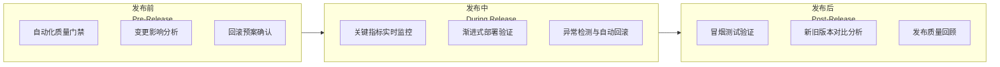
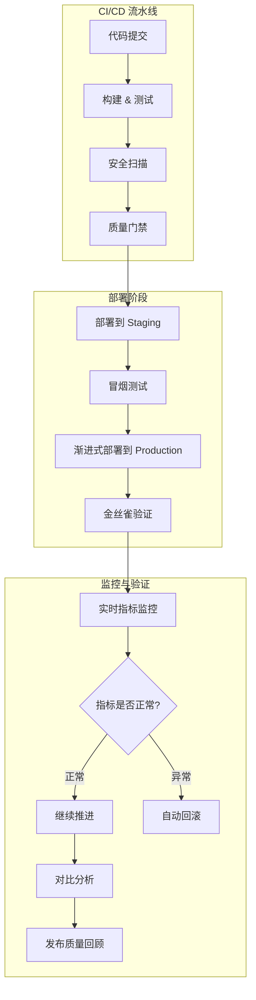

# 发布质量保障

## 背景与问题定义

发布是持续交付的最后一公里，也是风险最高的环节。一次失败的发布可能导致服务中断、用户流失、品牌受损，其影响远超构建失败、测试不通过等早期环节的问题。但许多组织的发布质量保障，仍停留在"部署后看一眼 Dashboard"的阶段，发布前检查、发布中监控、发布后验证都缺乏结构化的流程。

核心问题：**如何建立从发布前、发布中到发布后的全链路质量保障体系，确保每次发布的风险可控、结果可验证？**

## 核心概念

### 发布质量保障的三个维度



| 维度 | 核心活动 | 目标 |
|------|---------|------|
| 发布前 | 自动化质量门禁、变更影响分析、回滚预案 | 确保变更具备发布条件 |
| 发布中 | 实时指标监控、渐进式部署、异常检测 | 确保发布过程安全可控 |
| 发布后 | 冒烟测试、对比分析、质量回顾 | 确认发布结果符合预期 |

### 自动化质量门禁（Quality Gate）

质量门禁是发布前的一组自动化检查项，只有全部通过才允许发布推进：

| 门禁类型 | 检查内容 | 通过条件 | 失败动作 |
|---------|---------|---------|---------|
| 测试门禁 | 单元测试覆盖率 | ≥ 80% | 阻止发布 |
| 安全门禁 | 代码扫描、依赖扫描 | 0 Critical/High | 阻止发布 |
| 构建门禁 | 构建成功率 | 100% | 阻止发布 |
| 合规门禁 | SLO 错误预算检查 | 预算 > 0 | 阻止发布 |
| 审批门禁 | 人工审批 | 指定角色批准 | 阻止发布 |
| 变更门禁 | 变更影响范围评估 | Low/Medium 自动通过，High 需审批 | 阻止或升级审批 |

### 新旧版本对比分析

对比分析（Comparison Analysis）是发布后验证的关键方法——通过对比新旧版本的关键指标，确认发布是否引入了退化：

| 对比维度 | 指标 | 分析方法 | 退化判断 |
|---------|------|---------|---------|
| 功能性 | 请求成功率 | 新版本 vs 旧版本错误率 | 成功率下降 > 0.5% |
| 性能 | P50/P95/P99 延迟 | 新版本 vs 旧版本延迟分布 | P99 延迟增长 > 20% |
| 稳定性 | 服务可用率 | 新版本 vs 旧版本可用率 | 可用率下降 > 0.1% |
| 资源消耗 | CPU/Memory | 新版本 vs 旧版本资源占用 | 内存增长 > 30% |

## 架构设计

### 发布质量保障全景架构



## 实现方案

### ArgoCD PreSync/PostSync Hook 示例

ArgoCD 的 Resource Hooks 可以在部署的不同阶段执行自动化检查：

```yaml
# PreSync Hook：部署前质量门禁检查
apiVersion: batch/v1
kind: Job
metadata:
  name: pre-release-quality-gate
  namespace: team-a
  annotations:
    argocd.argoproj.io/hook: PreSync
    argocd.argoproj.io/hook-delete-policy: HookSucceeded
spec:
  template:
    spec:
      containers:
        - name: quality-gate
          image: quality-gate-checker:v1
          env:
            - name: SERVICE
              value: orders-service
            - name: ENVIRONMENT
              value: staging
          command:
            - /bin/sh
            - -c
            - |
              echo "=== 质量门禁检查 ==="

              # 1. 检查测试覆盖率
              COVERAGE=$(curl -s "https://codecov.example.com/api/repos/team-a/orders-service/commits/${ARGOCD_REVISION}/coverage")
              if [ "$COVERAGE" -lt 80 ]; then
                echo "❌ 测试覆盖率 ${COVERAGE}% < 80%，发布被阻止"
                exit 1
              fi
              echo "✅ 测试覆盖率: ${COVERAGE}%"

              # 2. 检查安全扫描结果
              VULNS=$(curl -s "https://security-scanner.example.com/api/results?service=orders-service&severity=critical")
              if [ "$VULNS" -gt 0 ]; then
                echo "❌ 发现 ${VULNS} 个 Critical 安全漏洞，发布被阻止"
                exit 1
              fi
              echo "✅ 安全扫描: 0 Critical 漏洞"

              # 3. 检查错误预算
              BUDGET=$(curl -s "${PROMETHEUS_URL}/api/v1/query?query=remaining_error_budget{service='orders-service'}" | jq -r '.data.result[0].value[1]')
              if [ "$(echo "$BUDGET < 0" | bc)" -eq 1 ]; then
                echo "❌ 错误预算耗尽，发布被阻止"
                exit 1
              fi
              echo "✅ 错误预算剩余: ${BUDGET}%"

              echo "=== 所有质量门禁检查通过 ==="
      restartPolicy: Never
---
# PostSync Hook：部署后冒烟测试
apiVersion: batch/v1
kind: Job
metadata:
  name: post-release-smoke-test
  namespace: team-a
  annotations:
    argocd.argoproj.io/hook: PostSync
    argocd.argoproj.io/hook-delete-policy: HookSucceeded
spec:
  template:
    spec:
      containers:
        - name: smoke-test
          image: smoke-test-runner:v1
          env:
            - name: SERVICE_URL
              value: "https://orders-service.staging.example.com"
          command:
            - /bin/sh
            - -c
            - |
              echo "=== 冒烟测试 ==="

              # 1. 健康检查
              HEALTH=$(curl -s "${SERVICE_URL}/health" | jq -r '.status')
              if [ "$HEALTH" != "healthy" ]; then
                echo "❌ 健康检查失败: ${HEALTH}"
                exit 1
              fi
              echo "✅ 健康检查: ${HEALTH}"

              # 2. API 可达性测试
              STATUS=$(curl -s -o /dev/null -w "%{http_code}" "${SERVICE_URL}/api/v1/orders")
              if [ "$STATUS" -ne 200 ]; then
                echo "❌ API 返回状态码: ${STATUS}"
                exit 1
              fi
              echo "✅ API 可达性: HTTP ${STATUS}"

              # 3. 关键业务流程测试
              CREATE_RESULT=$(curl -s -X POST "${SERVICE_URL}/api/v1/orders" \
                -H "Content-Type: application/json" \
                -d '{"product_id":"test-001","quantity":1}' | jq -r '.id')
              if [ -z "$CREATE_RESULT" ]; then
                echo "❌ 创建订单失败"
                exit 1
              fi
              echo "✅ 创建订单成功: ${CREATE_RESULT}"

              echo "=== 所有冒烟测试通过 ==="
      restartPolicy: Never
---
# SyncFail Hook：部署失败时的回滚操作
apiVersion: batch/v1
kind: Job
metadata:
  name: rollback-on-failure
  namespace: team-a
  annotations:
    argocd.argoproj.io/hook: SyncFail
    argocd.argoproj.io/hook-delete-policy: HookSucceeded
spec:
  template:
    spec:
      containers:
        - name: rollback
          image: rollback-handler:v1
          command:
            - /bin/sh
            - -c
            - |
              echo "⚠️ 部署失败，执行回滚操作"
              # 通知团队
              curl -X POST "${SLACK_WEBHOOK}" \
                -H "Content-Type: application/json" \
                -d '{"text":"🚨 orders-service 部署失败，正在回滚。请 On-Call 团队关注。"}'

              # 回滚执行：按回滚预案操作，或通过 Git revert 触发 GitOps 自动回退
              echo "已通知团队，请按回滚预案执行回滚"
      restartPolicy: Never
```

### 发布监控 Dashboard 配置

Grafana Dashboard 用于发布期间的实时指标监控：

```json
{
  "dashboard": {
    "title": "Release Quality Dashboard - Orders Service",
    "tags": ["release", "orders-service"],
    "panels": [
      {
        "title": "Error Rate (Real-time)",
        "type": "stat",
        "gridPos": { "h": 4, "w": 6, "x": 0, "y": 0 },
        "targets": [
          {
            "expr": "sum(rate(http_requests_total{service='orders-service',code=~'5..'}[5m])) / sum(rate(http_requests_total{service='orders-service'}[5m]))",
            "legendFormat": "Error Rate"
          }
        ],
        "thresholds": [
          { "value": 0.001, "color": "green" },
          { "value": 0.005, "color": "yellow" },
          { "value": 0.01, "color": "red" }
        ]
      },
      {
        "title": "P99 Latency (Real-time)",
        "type": "stat",
        "gridPos": { "h": 4, "w": 6, "x": 6, "y": 0 },
        "targets": [
          {
            "expr": "histogram_quantile(0.99, sum(rate(http_request_duration_seconds_bucket{service='orders-service'}[5m])) by (le))",
            "legendFormat": "P99 Latency"
          }
        ]
      },
      {
        "title": "Request Rate Comparison (Old vs New)",
        "type": "timeseries",
        "gridPos": { "h": 8, "w": 12, "x": 0, "y": 4 },
        "targets": [
          {
            "expr": "sum(rate(http_requests_total{service='orders-service',version='v2.3.0'}[5m]))",
            "legendFormat": "New Version"
          },
          {
            "expr": "sum(rate(http_requests_total{service='orders-service',version='v2.2.0'}[5m]))",
            "legendFormat": "Old Version"
          }
        ]
      },
      {
        "title": "Error Rate Comparison (Old vs New)",
        "type": "timeseries",
        "gridPos": { "h": 8, "w": 12, "x": 12, "y": 4 },
        "targets": [
          {
            "expr": "sum(rate(http_requests_total{service='orders-service',version='v2.3.0',code=~'5..'}[5m])) / sum(rate(http_requests_total{service='orders-service',version='v2.3.0'}[5m]))",
            "legendFormat": "New Version Error Rate"
          },
          {
            "expr": "sum(rate(http_requests_total{service='orders-service',version='v2.2.0',code=~'5..'}[5m])) / sum(rate(http_requests_total{service='orders-service',version='v2.2.0'}[5m]))",
            "legendFormat": "Old Version Error Rate"
          }
        ]
      }
    ]
  }
}
```

### 分步实施指南

**第一步：定义质量门禁清单（Week 1-2）**

制定发布前必须通过的质量门禁清单：

```markdown
## 发布质量门禁清单

### 必须通过（阻止发布）
- [ ] 所有单元测试通过，覆盖率 ≥ 80%
- [ ] 代码静态扫描无 Critical/High 问题
- [ ] 依赖扫描无已知高危漏洞
- [ ] 容器镜像扫描无 Critical 漏洞
- [ ] Staging 环境冒烟测试通过
- [ ] SLO 错误预算 > 0

### 建议通过（警告但允许）
- [ ] E2E 测试通过
- [ ] 性能测试无明显退化
- [ ] 回滚预案已确认（回滚步骤 + 数据库兼容性）
- [ ] 变更影响评估为 Low/Medium
```

**第二步：自动化门禁检查（Week 3-4）**

将质量门禁清单转化为 CI/CD 流水线中的自动化检查环节。

**第三步：配置 ArgoCD Hooks（Week 5-6）**

在 ArgoCD Application 中添加 PreSync/PostSync/SyncFail Hook。

**第四步：建立对比分析（Week 7-8）**

在 Grafana 中建立发布对比 Dashboard，包含新旧版本的指标对比。

**第五步：发布质量回顾（Ongoing）**

每次发布后进行质量回顾，记录发布数据：

| 发布编号 | 服务 | 版本 | 门禁结果 | 部署策略 | 是否回滚 | 发布耗时 | 对比分析结果 |
|---------|------|------|---------|---------|---------|---------|------------|
| #123 | orders | v2.3.1 | 全部通过 | 金丝雀 | 否 | 45min | 无退化 |
| #124 | payment | v1.5.0 | 安全扫描警告 | 蓝绿 | 否 | 30min | P99 延迟 +15% |

## 最佳实践

### 业界推荐做法

1. **门禁自动化**：质量门禁应是自动化检查而非人工审批——自动化才能保证一致性和速度
2. **冒烟测试必做**：每次部署到新环境后必须执行冒烟测试，验证基本功能可用
3. **对比分析优于绝对阈值**：对比新旧版本的指标变化比绝对阈值更能发现退化
4. **回滚预案先行**：发布前必须确认回滚方案（包括数据库兼容性），而非发布后临时想
5. **小批量频繁发布**：每次发布的变更越小，质量保障越容易，回滚越简单

### 常见反模式与规避方法

| 反模式 | 表现 | 危害 | 规避方法 |
|--------|------|------|---------|
| 人工门禁 | 发布前人工检查清单 | 检查不一致、流程慢 | 自动化门禁检查 |
| 不做冒烟测试 | 部署后直接上线 | 功能不可用才被发现 | PreSync/PostSync Hook |
| 无对比分析 | 仅看绝对指标 | 微小退化被忽视 | 新旧版本指标对比 |
| 无回滚预案 | 发布后发现问题时无法回滚 | 故障持续 | 发布前确认回滚方案 |
| 大批量发布 | 一次发布包含大量变更 | 难以定位问题 | 小批量频繁发布 |

## 效果度量

### 发布质量指标

| 指标 | 定义 | 目标 |
|------|------|------|
| 发布成功率 | 成功完成（无回滚）的发布占比 | > 95% |
| 发布回滚率 | 需要回滚的发布占比 | < 5% |
| 发布导致事故率 | 发布后 24 小时内产生 P1/P2 事故的比例 | < 2% |
| 发布门禁阻止率 | 被质量门禁阻止的发布占比 | 5%-15%（过低说明门禁太松，过高说明质量差） |
| 发布耗时 | 从启动发布到完成部署的时间 | < 30 分钟 |

## 总结

### 核心要点

1. 发布质量保障覆盖三个阶段：发布前（质量门禁）、发布中（实时监控）、发布后（对比验证）
2. 自动化质量门禁替代人工审批，确保一致性和速度
3. ArgoCD PreSync/PostSync/SyncFail Hook 实现部署全流程的自动化检查
4. 对比分析（新旧版本指标对比）比绝对阈值更能发现微小退化
5. 回滚预案必须在发布前确认，而非发布后临时准备

### 延伸阅读

- ArgoCD. *Resource Hooks*. https://argo-cd.readthedocs.io/en/stable/user-guide/resource_hooks/
- Google SRE Team. *Managing Incidents*. https://sre.google/sre-book/managing-incidents/
- GitHub. *Deployment Safety Checks*. https://docs.github.com/en/actions/deployment/deploying-with-github-actions