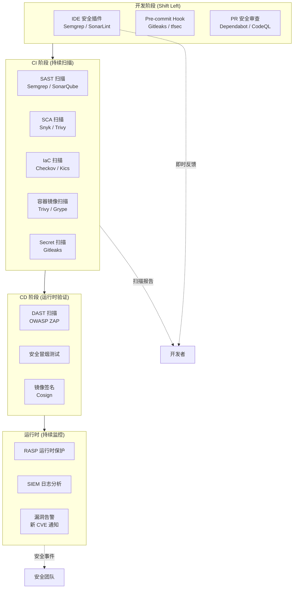

# DevSecOps：安全左移

## 背景与问题定义

在传统的软件开发模式中，安全一直被视为"最后一步"——开发团队完成功能开发，测试团队完成功能验证，然后在发布前由安全团队进行渗透测试或代码审计。这种模式带来了三个核心问题：

**问题一：修复成本指数级增长。** 据业界广为引用的 IBM Systems Sciences Institute 估算，在需求阶段发现一个安全缺陷的修复成本约为 1x，编码阶段约 6.5x，测试阶段约 15x，而到生产环境才发现则高达 100x。缺陷越晚被发现，修复涉及的团队越多、影响范围越大、回归测试越复杂。

**问题二：安全成为交付瓶颈。** 当安全检查仅在发布前执行时，安全团队成为整个交付流水线的瓶颈。大量代码积累等待安全审查，发布节奏被迫放缓，DevOps 追求的快速反馈环被打破。

**问题三：安全团队规模与代码增长不成比例。** 据 Gartner 统计，全球安全专业人员的缺口持续扩大，而代码量以每年 20%+ 的速度增长。仅靠安全团队人工审查根本无法覆盖所有代码变更。

DevSecOps 正是在这一背景下提出的——它不是一个工具或一个阶段，而是一种将安全能力内建于 DevOps 流程的文化和实践体系。

## 核心概念

### DevSecOps 的定义

DevSecOps 是 DevOps 的自然演进，其核心主张是：**安全是每个人的责任，而非仅安全团队的专属领域**。它将安全实践深度融入软件开发生命周期（SDLC）的每一个阶段，使安全检查从"门禁"变为"护栏"。

传统 DevOps 与 DevSecOps 的关键差异在于安全活动的时机和执行者：

| 维度 | 传统 DevOps | DevSecOps |
|------|-------------|-----------|
| 安全介入时机 | 发布前（晚期） | 编码阶段（早期） |
| 安全执行者 | 安全团队 | 全体工程师 |
| 安全检查方式 | 人工审查 + 渗透测试 | 自动化扫描 + 持续监控 |
| 安全目标 | 合规通过 | 风险持续降低 |
| 发现缺陷后 | 阻断发布 | 即时反馈 + 自动修复建议 |
| 文化导向 | 安全是"守门人" | 安全是"赋能者" |

### 安全左移的核心理念

安全左移（Shift Left Security）源自测试左移的思想，其核心逻辑是：**在缺陷产生的那一刻就发现它，而不是等到缺陷传播到下游才捕获**。

安全左移并非简单地将安全活动提前，而是要实现三个转变：

1. **从集中式到分布式**：安全能力从安全团队集中管控，变为嵌入到每个开发者的工作流中
2. **从间歇式到持续式**：安全检查从里程碑式的审查，变为每次代码提交的持续扫描
3. **从阻断式到引导式**：安全反馈从"你不能发布"，变为"这里有风险，建议这样修复"

### 安全扫描层级

DevSecOps 的技术实现建立在多层级安全扫描体系之上，每一层覆盖不同的安全维度：

| 扫描类型 | 全称 | 扫描对象 | 扫描时机 | 典型工具 |
|----------|------|----------|----------|----------|
| SAST | Static Application Security Testing | 源代码 / 字节码 | 编码阶段（IDE / CI） | SonarQube、Semgrep、Checkmarx |
| DAST | Dynamic Application Security Testing | 运行中的应用 | 测试 / Staging 阶段 | OWASP ZAP、Burp Suite |
| SCA | Software Composition Analysis | 第三方依赖 | 编码阶段（CI） | Snyk、Dependabot、Trivy |
| 容器扫描 | Container Image Scanning | 容器镜像 | 构建阶段（CI） | Trivy、Grype、Clair |
| IaC 扫描 | Infrastructure as Code Scanning | 基础设施代码 | 编码阶段（CI） | Checkov、tfsec、Kics |
| Secret 扫描 | Secret Detection | 代码仓库 | 提交阶段（Pre-commit / CI） | Gitleaks、TruffleHog |

**SAST（静态应用安全测试）** 在不运行代码的情况下，通过词法分析、数据流分析、污点分析等技术发现源代码中的安全缺陷。它的优势在于能够精确定位到代码行，缺点是误报率较高，且无法发现运行时问题。

**DAST（动态应用安全测试）** 在应用运行时模拟攻击者的行为，向应用发送构造的恶意请求来发现漏洞。它的优势在于能发现运行时漏洞（如认证绕过、配置错误），缺点是无法定位到具体代码行，且需要部署完整的应用环境。

**SCA（软件成分分析）** 扫描项目依赖的开源组件，与已知漏洞数据库（CVE、NVD）比对，识别存在安全风险的依赖。SCA 是投入产出比最高的安全扫描类型——据 Synopsys 报告，97% 的商业应用包含开源组件，而开源组件漏洞是最常见的外部攻击面之一。

**容器扫描** 检查容器镜像中的操作系统包漏洞、应用依赖漏洞以及镜像配置问题（如以 root 运行、暴露敏感端口）。

## 架构设计

DevSecOps 的架构设计核心原则是：**安全能力作为 Pipeline 的一等公民，与构建、测试、部署同等重要**。



架构设计的三个关键决策点：

**决策一：安全门禁策略。** 安全扫描发现问题时，是阻断流水线还是仅告警？推荐采用分级策略：

| 严重级别 | 处理策略 | 示例 |
|----------|----------|------|
| Critical | 阻断流水线，必须修复 | SQL 注入、远程代码执行 |
| High | 阻断流水线，可申请例外 | XSS、认证绕过 |
| Medium | 告警，不阻断，记录技术债 | CSRF、信息泄露 |
| Low | 记录，定期回顾 | 弱加密算法、日志级别 |

**决策二：扫描频率与范围。** 全量扫描耗时长，增量扫描覆盖不足。推荐策略是 PR 触发增量扫描 + 主分支定时全量扫描 + 依赖变更触发 SCA 全量扫描。

**决策三：误报管理。** 安全工具的误报是开发者最大的抱怨来源。需要建立误报标记流程，将确认的误报加入白名单并定期复审，同时向工具厂商反馈以改进检测规则。

## 实现方案

### 1. Semgrep 规则配置

Semgrep 是一款轻量级 SAST 工具，支持多语言，规则可读性强，适合团队自定义安全规则。

```yaml
# .semgrep.yml - Semgrep 规则配置
rules:
  # 检测硬编码密钥
  - id: hardcoded-secret
    patterns:
      - pattern: |
          $VAR = "..."
      - metavariable-regex:
          metavariable: $VAR
          regex: "(?i)(password|secret|api_key|token|private_key)"
    message: "检测到硬编码的敏感信息，请使用环境变量或密钥管理服务"
    severity: ERROR
    languages: [python, javascript, typescript, java, go]

  # 检测 SQL 注入风险
  - id: sql-injection-string-format
    patterns:
      - pattern-either:
          - pattern: |
              $CURSOR.execute("..." + $VAR)
          - pattern: |
              $CURSOR.execute(f"...{$VAR}...")
          - pattern: |
              $CURSOR.execute("...%s..." % $VAR)
    message: "检测到 SQL 拼接，存在 SQL 注入风险，请使用参数化查询"
    severity: ERROR
    languages: [python]

  # 检测不安全的反序列化
  - id: unsafe-deserialization
    patterns:
      - pattern: pickle.loads(...)
      - pattern-not: pickle.loads(b"...")
    message: "pickle.loads 处理不可信数据可能导致远程代码执行，请使用 json 或 protobuf"
    severity: WARNING
    languages: [python]

  # 检测不安全的 CORS 配置
  - id: cors-wildcard
    patterns:
      - pattern: |
          {"Access-Control-Allow-Origin": "*"}
      - pattern-not-inside: |
          {"Access-Control-Allow-Origin": "*", "Access-Control-Allow-Credentials": ...}
    message: "CORS 配置为通配符，请确认是否需要限制来源域名"
    severity: WARNING
    languages: [python, javascript, typescript]
```

### 2. GitHub Actions 安全扫描工作流

以下是一个完整的 DevSecOps CI 工作流，集成 SAST、SCA、Secret 扫描和容器扫描：

```yaml
# .github/workflows/security-scan.yml
name: DevSecOps Security Pipeline

on:
  pull_request:
    branches: [main, develop]
  push:
    branches: [main]
  schedule:
    - cron: '0 2 * * 1'  # 每周一凌晨全量扫描

permissions:
  security-events: write
  contents: read

jobs:
  # 1. Secret 扫描 - 检测代码中的敏感信息泄露
  secret-scan:
    name: Secret Detection
    runs-on: ubuntu-latest
    steps:
      - uses: actions/checkout@v4
        with:
          fetch-depth: 0  # 获取完整历史用于扫描

      - name: Gitleaks Secret Scan
        uses: gitleaks/gitleaks-action@v2
        env:
          GITHUB_TOKEN: ${{ secrets.GITHUB_TOKEN }}
          GITLEAKS_LICENSE: ${{ secrets.GITLEAKS_LICENSE }}

  # 2. SAST 扫描 - 静态代码安全分析
  # 注意：returntocorp/semgrep-action 已废弃，官方推荐直接使用 semgrep CLI
  sast-scan:
    name: SAST Analysis
    runs-on: ubuntu-latest
    container:
      image: semgrep/semgrep
    steps:
      - uses: actions/checkout@v4

      - name: Semgrep SAST Scan
        run: |
          semgrep scan \
            --config p/owasp-top-ten \
            --config p/cwe-top-25 \
            --config p/javascript \
            --config p/python \
            --config .semgrep.yml \
            --sarif --output semgrep.sarif

      - name: Upload SARIF Results
        if: always()
        uses: github/codeql-action/upload-sarif@v3
        with:
          sarif_file: semgrep.sarif

  # 3. SCA 扫描 - 依赖漏洞检查
  sca-scan:
    name: Dependency Vulnerability Scan
    runs-on: ubuntu-latest
    steps:
      - uses: actions/checkout@v4

      - name: Run Trivy SCA Scan
        uses: aquasecurity/trivy-action@master
        with:
          scan-type: 'fs'
          scan-ref: '.'
          format: 'sarif'
          output: 'trivy-results.sarif'
          severity: 'CRITICAL,HIGH'
          exit-code: '1'  # Critical/High 漏洞阻断流水线

      - name: Upload Trivy SARIF
        if: always()
        uses: github/codeql-action/upload-sarif@v3
        with:
          sarif_file: 'trivy-results.sarif'

  # 4. 容器镜像扫描
  container-scan:
    name: Container Image Scan
    runs-on: ubuntu-latest
    needs: [sast-scan, sca-scan]  # 依赖前置扫描通过
    steps:
      - uses: actions/checkout@v4

      - name: Build Docker Image
        run: docker build -t myapp:${{ github.sha }} .

      - name: Trivy Container Scan
        uses: aquasecurity/trivy-action@master
        with:
          image-ref: 'myapp:${{ github.sha }}'
          format: 'table'
          severity: 'CRITICAL,HIGH'
          exit-code: '1'
          ignore-unfixed: true

  # 5. IaC 扫描 - 基础设施代码安全检查
  iac-scan:
    name: IaC Security Scan
    runs-on: ubuntu-latest
    steps:
      - uses: actions/checkout@v4

      - name: Checkov IaC Scan
        uses: bridgecrewio/checkov-action@master
        with:
          directory: 'infra/'
          framework: 'terraform,kubernetes,dockerfile'
          output_format: 'sarif'
          output_file_path: 'checkov-results.sarif'
          soft_fail: false  # 检查失败时阻断

      - name: Upload Checkov SARIF
        if: always()
        uses: github/codeql-action/upload-sarif@v3
        with:
          sarif_file: 'checkov-results.sarif'

  # 6. DAST 扫描 - 动态安全测试（仅对 Staging 环境）
  dast-scan:
    name: DAST Scan (Staging)
    runs-on: ubuntu-latest
    if: github.ref == 'refs/heads/main'
    needs: [container-scan]
    steps:
      - uses: actions/checkout@v4

      - name: OWASP ZAP Baseline Scan
        uses: zaproxy/action-baseline@v0.12.0
        with:
          target: 'https://staging.myapp.example.com'
          rules_file_name: 'zap-rules.tsv'
          cmd_options: '-a -j'
          issue_title: 'ZAP Baseline Scan Report'
          fail_action: false  # DAST 初期不阻断，避免误报影响交付
```

### 3. DAST 规则配置（ZAP 规则文件）

```
# zap-rules.tsv - OWASP ZAP 扫描规则配置
# 格式: 规则ID	动作	URL正则	参数	说明
# IGNORE: 忽略  WARN: 警告  FAIL: 失败（阻断流水线）

10038	IGNORE	.*		Directories - 暂不需要检查目录枚举
10040	IGNORE	.*		Source Code Disclosure - 误报率高
10171	IGNORE	.*		Authentication Request - 登录接口不检查
40012	WARN	.*		X-Frame-Options Header
40018	WARN	.*		X-Content-Type-Options Header
10202	FAIL	.*		Absence of Anti-CSRF Tokens
40014	FAIL	.*		Cross Site Scripting (Reflected)
40019	FAIL	.*		Cross Site Scripting (Persistent)
90019	FAIL	.*		Server Side Request Forgery
90020	FAIL	.*		Remote Code Execution
```

### 4. 安全质量门禁配置

以下是 SonarQube 安全质量门禁（Quality Gate）的条件配置示例：

```json
{
  "name": "DevSecOps Security Gate",
  "conditions": [
    {
      "metric": "security_rating",
      "operator": "GREATER_THAN",
      "value": "1",
      "errorThreshold": "1"
    },
    {
      "metric": "security_hotspots_reviewed",
      "operator": "LESS_THAN",
      "value": "100",
      "errorThreshold": "100"
    },
    {
      "metric": "vulnerabilities",
      "operator": "GREATER_THAN",
      "value": "0",
      "errorThreshold": "0"
    },
    {
      "metric": "security_remediation_effort",
      "operator": "GREATER_THAN",
      "value": "0",
      "errorThreshold": "0"
    }
  ]
}
```

## 最佳实践

### 实践一：安全扫描的渐进式落地

不要试图一次性上线所有安全扫描工具。推荐分四个阶段渐进落地：

| 阶段 | 目标 | 上线工具 | 时间 |
|------|------|----------|------|
| Phase 1 | 低阻力启动 | Dependabot + Gitleaks | 第 1-2 周 |
| Phase 2 | SAST 集成 | Semgrep + SonarQube | 第 3-4 周 |
| Phase 3 | 容器与 IaC | Trivy + Checkov | 第 5-6 周 |
| Phase 4 | 运行时安全 | OWASP ZAP + RASP | 第 7-8 周 |

每个阶段的关键成功指标是开发者采纳率——如果开发者频繁绕过安全工具，说明工具配置需要调整。

### 实践二：安全即文档

将安全策略以代码形式存储在代码仓库中（如 `.semgrep.yml`、`zap-rules.tsv`、`.gitleaks.toml`），使安全规则与应用代码同版本管理、同审查流程。这带来三个好处：

1. 安全策略变更有迹可循
2. 安全规则调整需要经过 PR 审查
3. 不同项目可以继承和定制安全基线

### 实践三：安全发现的可操作性

安全扫描报告必须是可操作的。每一条安全发现应该包含：

- **What**：发现什么问题（如"检测到 SQL 拼接"）
- **Why**：为什么是问题（如"攻击者可注入恶意 SQL"）
- **Where**：精确代码位置（文件名 + 行号）
- **How**：如何修复（修复代码示例或文档链接）
- **Severity**：严重程度及依据（对应 CWE / OWASP 分类）

### 实践四：安全例外管理

不是所有安全发现都需要立即修复。建立安全例外流程：

```
1. 发现者提交安全例外请求（Security Exception Request）
2. 说明：漏洞详情、不修复理由、补偿控制措施、风险接受者
3. 安全团队评审，给出风险等级和补偿控制建议
4. 风险接受者（通常是工程总监或 CTO）签字确认
5. 例外有效期最长 90 天，到期自动重新评估
6. 所有例外记录在安全例外注册表中
```

### 实践五：安全 Champion 网络

在每个开发团队中培养一位 Security Champion——不是安全专家，而是对安全有额外兴趣的开发者。Security Champion 的职责：

- 作为安全团队与开发团队的桥梁
- 审查本团队的安全扫描结果，过滤明显误报
- 推动本团队安全修复的优先级
- 参与安全工具规则的制定和调优

## 效果度量

DevSecOps 的效果需要通过多维度指标持续度量：

### 过程指标

| 指标 | 定义 | 目标 | 度量方式 |
|------|------|------|----------|
| 安全扫描覆盖率 | 经过安全扫描的代码变更比例 | > 95% | CI/CD Pipeline 统计 |
| 平均安全发现时间（MTTD） | 从代码提交到发现安全缺陷的时间 | < 24 小时 | 安全工具时间戳 |
| 平均安全修复时间（MTTR） | 从发现到修复安全缺陷的时间 | Critical < 7 天 | Issue Tracker |
| 安全例外数量 | 未修复但被接受的安全缺陷数量 | 持续减少 | 安全例外注册表 |
| 误报率 | 安全扫描结果中误报的比例 | < 20% | 人工标记统计 |

### 结果指标

| 指标 | 定义 | 目标 | 度量方式 |
|------|------|------|----------|
| 生产安全事件数 | 逃逸到生产环境的安全缺陷 | 趋近于 0 | 事件管理系统 |
| 安全缺陷逃逸率 | 生产环境发现缺陷 / 总缺陷数 | < 5% | 缺陷追踪 |
| 安全债务总量 | 未修复的安全缺陷加权总分 | 持续下降 | SonarQube |
| 开发者满意度 | 开发者对安全工具的满意度评分 | > 3.5/5 | 季度调查 |

### 度量仪表板示例

建议使用 Grafana 构建安全度量仪表板，核心视图包含：

1. **安全扫描趋势图**：每日扫描次数、发现数、修复数的时间序列
2. **漏洞分布热力图**：按严重程度和组件维度的漏洞分布
3. **MTTD/MTTR 趋势**：安全发现和修复的时间趋势
4. **安全债务燃烧图**：安全缺陷总量的累计与消除趋势

## 总结

DevSecOps 的本质不是在 DevOps 流程中"加"安全工具，而是重新定义安全在软件交付中的角色——从"守门人"变为"赋能者"，从"事后审计"变为"持续保障"，从"安全团队的事"变为"每个人的责任"。

安全左移的三个关键转变——集中式到分布式、间歇式到持续式、阻断式到引导式——构成了 DevSecOps 的核心逻辑。技术上，通过 SAST、DAST、SCA、容器扫描、IaC 扫描、Secret 扫描六层防护体系，在 SDLC 的每个阶段嵌入相应的安全能力。

落地 DevSecOps 时，最重要的原则是**渐进式推进**：先从低阻力的 SCA 和 Secret 扫描开始，建立开发者对安全工具的信任，再逐步引入 SAST、容器扫描和 DAST。切忌一次性上线所有工具导致开发者抵触。

最终，DevSecOps 的成功不仅取决于工具链的完整性，更取决于安全文化的建设——当每个开发者在编写代码时自然地思考安全性，DevSecOps 才真正实现了其目标。
