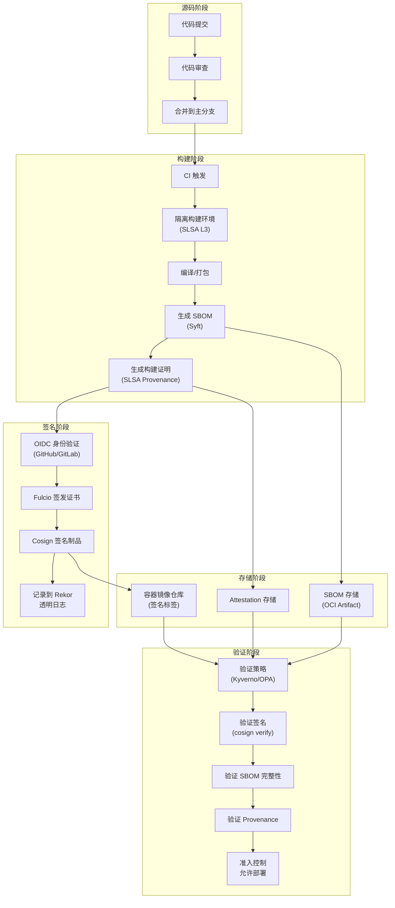

# 供应链安全：SBOM、签名、验证

## 背景与问题定义

软件供应链攻击已成为当前最具威胁性的攻击向量之一。与直接攻击目标应用不同，供应链攻击通过入侵软件的上游组件——开源库、构建工具、分发渠道——来间接攻击最终目标。由于上游组件被大量下游共享，这类攻击具有"一次入侵，广泛传播"的特性，影响范围远超传统攻击。

### 典型供应链攻击案例

| 事件 | 时间 | 攻击方式 | 影响范围 |
|------|------|----------|----------|
| SolarWinds | 2020 | 入侵构建系统，植入后门到 Orion 更新包 | 18,000+ 组织，包括美国政府机构 |
| Codecov | 2021 | 篡改 Bash Uploader 脚本，窃取 CI 环境变量 | 数千家企业的 CI 流水线 |
| log4shell | 2021 | log4j 远程代码执行漏洞（CVE-2021-44228） | 全球数百万应用受影响 |
| ua-parser-js | 2021 | NPM 包被劫持，植入挖矿和密码窃取代码 | 数百万下载量 |
| 3CX | 2023 | 供应链攻击链：交易监控库 → 3CX 桌面客户端 | 全球 35 万+ 企业用户 |

这些案例揭示了一个共同模式：攻击者不再直接攻击目标企业，而是攻击其信任的上游组件。由于现代软件平均包含 500+ 个直接和间接依赖，攻击面呈指数级扩大。

### 供应链安全的核心挑战

**挑战一：依赖可见性缺失。** 大多数企业无法准确回答"我们的生产环境运行着哪些软件组件"这一基本问题。据 Sonatype 历年报告，现代应用代码的绝大部分由开源组件构成，但维护完整依赖清单的企业仍是少数。

**挑战二：来源验证缺失。** 代码从源码仓库到最终部署，经过编译、打包、分发等多个环节，每个环节都可能被篡改。传统软件分发缺乏端到端的完整性验证机制。

**挑战三：漏洞响应滞后。** 当上游组件披露漏洞时，下游用户往往无法快速判断是否受影响、影响范围多大、如何修复。log4shell 事件中，许多企业花费数周才完成受影响系统的排查。

## 核心概念

### SLSA Framework

SLSA（Supply-chain Levels for Software Artifacts，软件制品供应链等级）是 Google 于 2021 年提出、2023 年发布 v1.0 的供应链安全框架。注意：早期 v0.9 的四级模型已被废弃，v1.0 起改为按"轨道"（Track）组织——软件制品走构建轨道 Build L1–L3，v1.1（2025）又引入了源码轨道 Source S1–S3（草案）。构建轨道的三个等级：

| 等级 | 描述 | 核心要求 | 典型实现 |
|------|------|----------|----------|
| Build L1 | Provenance 存在 | 构建完全自动化，生成签名 provenance | GitHub Actions + Provenance 生成器 |
| Build L2 | 托管构建 | 构建在托管服务上执行，provenance 由平台签发、用户不可伪造 | GitHub Actions（托管 Runner） |
| Build L3 | 强化构建 | 构建环境隔离加固，provenance 不可伪造 | SLSA GitHub Generator / Google Cloud Build |

SLSA 的核心理念是：**通过构建证明（Provenance）建立软件制品与源代码之间的可信绑定**。Provenance 是一个加密签名的元数据文件，记录了"谁、在什么环境、用什么输入、构建了什么制品"。

### SBOM 标准

SBOM（Software Bill of Materials，软件物料清单）是软件组件的完整清单，类似于制造业的物料清单。SBOM 使组织能够准确了解软件的组成，快速响应上游漏洞。

目前主流的 SBOM 标准有两个：

| 标准 | 制定方 | 标准化状态 | 特点 |
|------|--------|------------|------|
| SPDX | Linux Foundation | ISO/IEC 5962:2021 | 国际标准，支持多格式，许可证合规强 |
| CycloneDX | OWASP | OWASP 项目 | 安全导向，轻量级，漏洞关联强 |

一个完整的 SBOM 应包含以下核心字段：

```
组件名称 (Component Name)
组件版本 (Component Version)
供应商 (Supplier)
唯一标识符 (Unique Identifier) - 如 PURL、CPE、SWHID
依赖关系 (Dependencies)
许可证 (License)
哈希值 (Hash) - SHA-256、SHA-512
来源信息 (Origin) - 下载地址、仓库地址
```

### Sigstore

Sigstore 是一个开源的软件供应链安全平台，由 Google、Red Hat、GitHub 等联合发起。它提供了一套完整的签名和验证基础设施，使开发者能够轻松地为软件制品签名，用户能够验证制品的来源和完整性。

Sigstore 由三个核心组件构成：

| 组件 | 功能 | 类比 |
|------|------|------|
| Cosign | 容器镜像签名和验证工具 | GPG for Containers |
| Fulcio | 免费的证书颁发机构（CA），基于 OIDC 身份签发短期证书 | Let's Encrypt for Code Signing |
| Rekor | 不可篡改的透明日志（Transparency Log），记录所有签名活动 | Certificate Transparency Log |

Sigstore 的创新之处在于：**开发者无需管理长期密钥，通过 OIDC 身份（如 GitHub 账号）即可完成签名**。这解决了传统代码签名中密钥管理的痛点——密钥泄露、密钥轮换、密钥分发。

### in-toto

in-toto 是一个供应链完整性证明框架，由 CNCF 托管。它允许定义软件供应链的完整流程，并为每个步骤生成加密签名的证明（Attestation），确保供应链的每一步都按预期执行。

in-toto 的核心概念：

- **Layout**：定义供应链的预期流程，包括步骤、执行者、预期产物
- **Link**：每个步骤执行后生成的签名证明，记录输入、输出、执行者
- **Attestation**：符合 in-toto Attestation 规范的结构化证明文件

## 架构设计

供应链安全架构的核心目标是建立**端到端的信任链**：从源代码提交到最终部署，每个环节都有可验证的完整性证明。



架构设计的关键决策：

**决策一：签名粒度。** 应该对什么进行签名？推荐策略：

| 制品类型 | 签名内容 | 签名工具 |
|----------|----------|----------|
| 容器镜像 | 镜像 Manifest Digest | cosign |
| SBOM | SBOM 文件哈希 | cosign (OCI Artifact) |
| 构建证明 | Provenance JSON | cosign (Attestation) |
| 二进制文件 | 文件哈希 | sigstore/cosign (blob) |

**决策二：验证策略。** 在什么环节验证签名？推荐多层验证：

1. **CI 阶段**：验证基础镜像签名
2. **CD 阶段**：验证应用镜像签名和 SBOM
3. **部署阶段**：Kubernetes Admission Controller 验证
4. **运行时**：定期重新验证已部署镜像

**决策三：SBOM 存储策略。** SBOM 应该存储在哪里？

| 方案 | 优点 | 缺点 |
|------|------|------|
| OCI Artifact（推荐） | 与镜像同仓库，原子更新 | 需要支持 OCI Artifact 的仓库 |
| 独立存储服务 | 灵活查询，集中管理 | 与镜像分离，一致性风险 |
| 嵌入镜像 Label | 简单，无需额外存储 | 大小受限，查询不便 |

## 实现方案

### 1. Syft SBOM 生成

Syft 是 Anchore 开源的 SBOM 生成工具，支持容器镜像、文件系统、多种 SBOM 格式。

```bash
# 安装 Syft
curl -sSfL https://raw.githubusercontent.com/anchore/syft/main/install.sh | sh

# 从容器镜像生成 SPDX 格式 SBOM
syft myapp:v1.0.0 -o spdx-json > sbom.spdx.json

# 从容器镜像生成 CycloneDX 格式 SBOM
syft myapp:v1.0.0 -o cyclonedx-json > sbom.cdx.json

# 从文件系统目录生成 SBOM
syft dir:./dist -o cyclonedx-json > sbom.cdx.json

# 将 SBOM 作为 OCI Artifact 推送到镜像仓库
syft myapp:v1.0.0 -o spdx-json | \
  cosign attach sbom --sbom - myapp:v1.0.0
```

生成的 CycloneDX SBOM 示例：

```json
{
  "bomFormat": "CycloneDX",
  "specVersion": "1.5",
  "serialNumber": "urn:uuid:3e671687-395b-41f5-a30f-a58921a69b79",
  "version": 1,
  "metadata": {
    "timestamp": "2024-01-15T10:30:00Z",
    "component": {
      "type": "container",
      "name": "myapp",
      "version": "v1.0.0",
      "purl": "pkg:oci/myapp@sha256:abc123?tag=v1.0.0"
    },
    "tools": [
      {
        "vendor": "anchore",
        "name": "syft",
        "version": "1.0.0"
      }
    ]
  },
  "components": [
    {
      "bom-ref": "pkg:npm/express@4.18.2",
      "type": "library",
      "name": "express",
      "version": "4.18.2",
      "purl": "pkg:npm/express@4.18.2",
      "supplier": {
        "name": "Express.js"
      },
      "licenses": [
        {
          "license": {
            "id": "MIT"
          }
        }
      ],
      "hashes": [
        {
          "alg": "SHA-512",
          "content": "abc123..."
        }
      ]
    }
  ],
  "dependencies": [
    {
      "ref": "pkg:npm/express@4.18.2",
      "dependsOn": [
        "pkg:npm/body-parser@1.20.1",
        "pkg:npm/cookie@0.5.0"
      ]
    }
  ]
}
```

### 2. Cosign 签名与验证

Cosign 是 Sigstore 的核心工具，用于容器镜像签名和验证。

```bash
# 安装 Cosign
brew install cosign  # macOS
# 或
go install github.com/sigstore/cosign/v2/cmd/cosign@latest

# ====== Keyless 签名（推荐）======
# 使用 OIDC 身份签名（无需管理密钥）
cosign sign --yes myregistry.io/myapp:v1.0.0

# 签名时附加注解
cosign sign --yes \
  --annotations "commit=abc123" \
  --annotations "workflow=build-123" \
  myregistry.io/myapp:v1.0.0

# ====== 密钥对签名（传统方式）======
# 生成密钥对
cosign generate-key-pair

# 使用私钥签名
COSIGN_PASSWORD=your-password cosign sign \
  --key cosign.key \
  myregistry.io/myapp:v1.0.0

# ====== 验证签名 ======
# Keyless 验证（验证签名存在且有效）
cosign verify myregistry.io/myapp:v1.0.0

# 验证特定身份签发的签名
cosign verify \
  --certificate-identity="github-actions[bot]" \
  --certificate-oidc-issuer="https://token.actions.githubusercontent.com" \
  myregistry.io/myapp:v1.0.0

# 验证特定注解
cosign verify \
  --certificate-identity="github-actions[bot]" \
  --certificate-oidc-issuer="https://token.actions.githubusercontent.com" \
  --annotations="commit=abc123" \
  myregistry.io/myapp:v1.0.0

# 使用公钥验证
cosign verify \
  --key cosign.pub \
  myregistry.io/myapp:v1.0.0

# ====== SBOM 关联与验证 ======
# 注意：attach / sign --attachment 在 cosign v2 中已标记废弃，
# 推荐改用 cosign attest 以 attestation 形式附加 SBOM
# 附加 SBOM 到镜像
cosign attach sbom --sbom sbom.cdx.json myregistry.io/myapp:v1.0.0

# 对 SBOM 签名
cosign sign --attachment sbom --yes myregistry.io/myapp:v1.0.0

# 验证 SBOM 签名
cosign verify --attachment sbom myregistry.io/myapp:v1.0.0

# ====== Attestation（证明）======
# 创建 SLSA Provenance Attestation
cosign attest --yes \
  --predicate provenance.json \
  --type slsaprovenance \
  myregistry.io/myapp:v1.0.0

# 验证 Attestation
cosign verify-attestation \
  --type slsaprovenance \
  myregistry.io/myapp:v1.0.0
```

### 3. GitHub Actions 供应链安全工作流

以下是一个完整的供应链安全 CI 工作流，实现 SLSA L3 级别的构建和签名：

```yaml
# .github/workflows/supply-chain-security.yml
name: Supply Chain Security Pipeline

on:
  push:
    branches: [main]
  pull_request:
    branches: [main]

permissions:
  id-token: write  # OIDC token for Sigstore
  contents: read
  packages: write
  attestations: write

env:
  REGISTRY: ghcr.io
  IMAGE_NAME: ${{ github.repository }}

jobs:
  build-and-sign:
    name: Build, SBOM, Sign
    runs-on: ubuntu-latest
    outputs:
      digest: ${{ steps.build.outputs.digest }}

    steps:
      - name: Checkout
        uses: actions/checkout@v4

      - name: Set up Docker Buildx
        uses: docker/setup-buildx-action@v3

      - name: Login to Registry
        uses: docker/login-action@v3
        with:
          registry: ${{ env.REGISTRY }}
          username: ${{ github.actor }}
          password: ${{ secrets.GITHUB_TOKEN }}

      - name: Extract Metadata
        id: meta
        uses: docker/metadata-action@v5
        with:
          images: ${{ env.REGISTRY }}/${{ env.IMAGE_NAME }}
          tags: |
            type=sha
            type=ref,event=branch
            type=semver,pattern={{version}}

      # Step 1: 构建容器镜像
      - name: Build Container Image
        id: build
        uses: docker/build-push-action@v5
        with:
          context: .
          push: true
          tags: ${{ steps.meta.outputs.tags }}
          labels: ${{ steps.meta.outputs.labels }}
          sbom: true
          provenance: true
          cache-from: type=gha
          cache-to: type=gha,mode=max

      # Step 2: 生成 SBOM
      - name: Generate SBOM
        uses: anchore/sbom-action@v0
        with:
          image: ${{ env.REGISTRY }}/${{ env.IMAGE_NAME }}@${{ steps.build.outputs.digest }}
          format: cyclonedx-json
          output-file: sbom.cdx.json
          artifact-name: sbom.cdx.json

      # Step 3: 使用 Sigstore 签名镜像
      - name: Sign Image with Cosign
        uses: sigstore/cosign-installer@v3
      - run: |
          cosign sign --yes \
            --annotations "commit=${{ github.sha }}" \
            --annotations "workflow=${{ github.run_id }}" \
            --annotations "ref=${{ github.ref }}" \
            ${{ env.REGISTRY }}/${{ env.IMAGE_NAME }}@${{ steps.build.outputs.digest }}

      # Step 4: 签名 SBOM
      - name: Sign SBOM
        run: |
          cosign sign --yes \
            --attachment sbom \
            ${{ env.REGISTRY }}/${{ env.IMAGE_NAME }}@${{ steps.build.outputs.digest }}

      # Step 5: 生成 SLSA Provenance（GitHub Artifact Attestations，
      # 生成 SLSA v1.0 格式 provenance 并推送到镜像仓库）
      - name: Generate SLSA Provenance
        uses: actions/attest-build-provenance@v1
        with:
          subject-name: ${{ env.REGISTRY }}/${{ env.IMAGE_NAME }}
          subject-digest: ${{ steps.build.outputs.digest }}
          push-to-registry: true

      # Step 6: 漏洞扫描（基于 SBOM）
      - name: Scan SBOM for Vulnerabilities
        uses: anchore/scan-action@v3
        with:
          sbom: sbom.cdx.json
          fail-build: true
          severity-cutoff: high

  verify:
    name: Verify Signatures
    runs-on: ubuntu-latest
    needs: build-and-sign

    steps:
      - name: Install Cosign
        uses: sigstore/cosign-installer@v3

      - name: Verify Image Signature
        run: |
          cosign verify \
            --certificate-identity="https://github.com/${{ github.repository }}/.github/workflows/supply-chain-security.yml@refs/heads/main" \
            --certificate-oidc-issuer="https://token.actions.githubusercontent.com" \
            ${{ env.REGISTRY }}/${{ env.IMAGE_NAME }}@${{ needs.build-and-sign.outputs.digest }}

      - name: Verify SBOM Signature
        run: |
          cosign verify --attachment sbom \
            --certificate-identity="https://github.com/${{ github.repository }}/.github/workflows/supply-chain-security.yml@refs/heads/main" \
            --certificate-oidc-issuer="https://token.actions.githubusercontent.com" \
            ${{ env.REGISTRY }}/${{ env.IMAGE_NAME }}@${{ needs.build-and-sign.outputs.digest }}

      - name: Verify SLSA Provenance
        env:
          GH_TOKEN: ${{ github.token }}
        run: |
          gh attestation verify \
            oci://${{ env.REGISTRY }}/${{ env.IMAGE_NAME }}@${{ needs.build-and-sign.outputs.digest }} \
            -R ${{ github.repository }}
```

### 4. Kubernetes 部署验证策略

使用 Kyverno 在 Kubernetes 集群中强制验证镜像签名：

```yaml
# kyverno-verify-image-signature.yaml
apiVersion: kyverno.io/v1
kind: ClusterPolicy
metadata:
  name: verify-image-signature
  annotations:
    policies.kyverno.io/title: Verify Image Signature
    policies.kyverno.io/description: |
      验证容器镜像是否由可信身份签名
spec:
  # Kyverno 1.13+ 使用 failurePolicy（旧字段 validationFailureAction 已废弃）
  failurePolicy: enforce  # 强制执行，拒绝未签名镜像
  background: true
  rules:
    - name: verify-ghcr-signature
      match:
        any:
          - resources:
              kinds:
                - Pod
              namespaces:
                - production
                - staging
      verifyImages:
        - imageReferences:
            - "ghcr.io/myorg/*"
          attestors:
            - entries:
                - keyless:
                    subject: "https://github.com/myorg/*"
                    issuer: "https://token.actions.githubusercontent.com"
          required: true

    - name: verify-sbom-attestation
      match:
        any:
          - resources:
              kinds:
                - Pod
      verifyImages:
        - imageReferences:
            - "ghcr.io/myorg/*"
          attestations:
            - predicateType: "https://cyclonedx.org/bom"
              attestors:
                - entries:
                    - keyless:
                        subject: "https://github.com/myorg/*"
                        issuer: "https://token.actions.githubusercontent.com"
              required: true
```

### 5. 依赖固定策略

供应链安全的第一道防线是固定依赖版本，避免"依赖漂移"：

```dockerfile
# Dockerfile - 固定基础镜像版本（使用 digest）
FROM node:20.11.0-alpine3.19@sha256:abc123...def456

# 固定包管理器版本
RUN npm install -g pnpm@8.15.1

# 使用 lockfile 确保依赖版本固定
COPY pnpm-lock.yaml ./
RUN pnpm install --frozen-lockfile
```

以下是 package.json 使用精确版本号（避免 `^` 或 `~` 前缀）的示例：

```json
{
  "dependencies": {
    "express": "4.18.2",
    "lodash": "4.17.21",
    "axios": "1.6.5"
  },
  "devDependencies": {
    "typescript": "5.3.3"
  }
}
```

```yaml
# .github/dependabot.yml - 配置 Dependabot 自动更新
version: 2
updates:
  - package-ecosystem: "npm"
    directory: "/"
    schedule:
      interval: "weekly"
    open-pull-requests-limit: 10
    versioning-strategy: "increase-if-necessary"
    groups:
      production-dependencies:
        dependency-type: "production"
      development-dependencies:
        dependency-type: "development"

  - package-ecosystem: "docker"
    directory: "/"
    schedule:
      interval: "weekly"
```

## 最佳实践

### 实践一：依赖准入控制

建立依赖准入流程，在引入新依赖前进行安全评估：

```
依赖准入检查清单：
□ 是否有活跃维护？（最近 6 个月有更新）
□ 是否有安全漏洞历史？（查询 Snyk Vulnerability DB）
□ 许可证是否合规？（使用 SPDX 标识符）
□ 是否有替代方案？（优先选择更成熟的库）
□ 是否必需？（避免引入不必要的依赖）
```

### 实践二：最小化基础镜像

选择最小化的基础镜像，减少攻击面：

| 基础镜像 | 大小 | 安全性 | 适用场景 |
|----------|------|--------|----------|
| ubuntu:22.04 | ~77MB | 中等 | 需要完整工具链 |
| debian:bookworm-slim | ~74MB | 中等 | 需要部分工具 |
| alpine:3.19 | ~5MB | 高 | 静态编译应用 |
| distroless/base | ~2MB | 最高 | 仅运行时 |
| scratch | 0 | 最高 | 静态链接二进制 |

### 实践三：SBOM 持续审计

建立 SBOM 持续审计机制：

1. **每日扫描**：对生产环境 SBOM 进行漏洞扫描
2. **变更告警**：SBOM 内容变化时触发告警
3. **合规报告**：定期生成许可证合规报告
4. **漏洞响应**：新 CVE 披露时快速评估影响范围

### 实践四：签名验证强制化

在 CI/CD 和部署环节强制签名验证：

| 环节 | 验证内容 | 验证失败处理 |
|------|----------|--------------|
| CI 构建 | 基础镜像签名 | 阻断构建 |
| CI 测试 | 应用镜像签名 | 阻断测试 |
| CD 部署 | 应用镜像 + SBOM 签名 | 阻断部署 |
| K8s 准入 | 所有签名 + Provenance | 拒绝 Pod 创建 |

### 实践五：透明日志监控

监控 Rekor 透明日志，检测异常签名活动：

```bash
# 查询特定镜像的签名记录
cosign triangulate myregistry.io/myapp:v1.0.0

# 从 Rekor 获取签名详情
rekor-cli get --uuid <uuid> --rekor_server https://rekor.sigstore.dev

# 监控特定身份的签名活动
rekor-cli search --email "ci-bot@example.com" \
  --rekor_server https://rekor.sigstore.dev
```

## 效果度量

供应链安全的效果度量应关注以下指标：

| 指标 | 定义 | 目标 | 度量方式 |
|------|------|------|----------|
| SBOM 覆盖率 | 有 SBOM 的生产镜像比例 | 100% | 镜像仓库统计 |
| 签名覆盖率 | 有有效签名的生产镜像比例 | 100% | Cosign 验证统计 |
| 漏洞响应时间 | 从 CVE 披露到评估完成的时间 | < 4 小时 | 事件追踪 |
| 依赖更新周期 | 依赖版本落后上游的时间 | < 30 天 | Dependabot 报告 |
| 供应链攻击阻断 | 被签名验证阻止的恶意镜像数 | 持续监控 | 准入控制日志 |

## 总结

软件供应链安全是当前安全领域最紧迫的挑战之一。SolarWinds、log4shell 等事件表明，攻击者正在从直接攻击转向供应链攻击，因为后者具有更高的投资回报率。

构建供应链安全体系需要三个核心能力：

1. **可见性**：通过 SBOM 准确了解软件的组成，快速响应上游漏洞
2. **完整性**：通过 Sigstore 签名和验证，确保软件制品从构建到部署的完整性
3. **可追溯性**：通过 SLSA Provenance 和 in-toto，建立源代码到制品的可信绑定

落地供应链安全时，建议从以下步骤开始：

1. **Phase 1（第 1-2 周）**：为所有生产镜像生成 SBOM，建立依赖可见性
2. **Phase 2（第 3-4 周）**：使用 Cosign Keyless 签名所有镜像，无需管理密钥
3. **Phase 3（第 5-6 周）**：在 Kubernetes 集群部署签名验证策略
4. **Phase 4（第 7-8 周）**：生成 SLSA Provenance，达到 SLSA L3 级别

最终，供应链安全的目标是建立"零信任"的软件分发体系——不信任任何未经验证的制品，无论其来源如何。
