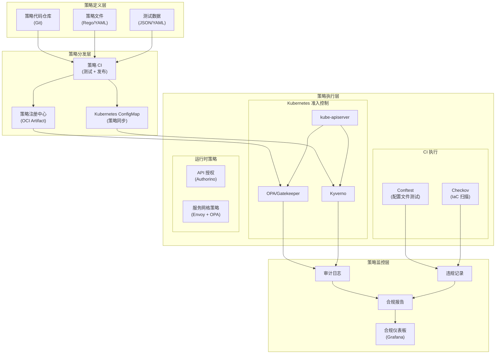

# 合规自动化：Policy as Code

## 背景与问题定义

随着数字化转型的深入，企业面临的合规要求持续增长。从数据保护（GDPR、CCPA）到信息安全（ISO 27001、SOC 2），从行业监管（HIPAA、PCI DSS）到云安全（CIS Benchmarks），合规框架的数量和复杂度都在快速上升。

### 传统合规模式的困境

**困境一：合规成本高昂。** 传统的合规审计是周期性的（通常每年一次），需要大量人工准备证据、填写问卷、接受访谈。业界经验显示，人工准备 SOC 2 审计动辄数百人时，ISO 27001 初次认证的咨询与认证费用也相当可观。

**困境二：合规状态不可见。** 在两次审计之间，企业无法准确知道自己的合规状态。合规问题往往在下次审计时才被发现，此时可能已经违规数月甚至数年。

**困境三：合规与交付冲突。** 合规要求往往被视为"阻碍交付的负担"，开发团队为了赶进度可能绕过合规流程，导致合规与速度的矛盾。

**困境四：多云环境合规复杂。** 当企业使用多个云平台（AWS、Azure、GCP）和 Kubernetes 集群时，合规配置需要在多个环境中保持一致，人工管理几乎不可能。

### Policy as Code 的定义

Policy as Code（策略即代码）是一种将合规策略编码为可执行、可验证的策略文件的方法论。其核心主张是：**合规策略应该像应用代码一样被版本管理、测试、自动化执行**。

Policy as Code 带来的三个根本性转变：

| 维度 | 传统合规 | Policy as Code |
|------|----------|----------------|
| 策略表达 | 文档（Word/PDF） | 代码（Rego/Rego-like DSL） |
| 策略执行 | 人工审查 | 自动化引擎 |
| 合规状态 | 周期性审计 | 持续验证 |
| 证据收集 | 手动准备 | 自动生成 |
| 策略变更 | 文档更新 + 培训 | 代码提交 + PR 审查 |

## 核心概念

### 策略引擎

策略引擎是 Policy as Code 的核心组件，负责解析策略文件、评估输入数据、输出合规决策。主流策略引擎包括：

| 引擎 | 开发方 | 策略语言 | 适用场景 | CNCF 状态 |
|------|--------|----------|----------|-----------|
| OPA (Open Policy Agent) | Styra | Rego | 通用策略引擎，Kubernetes 准入控制 | Graduated |
| Kyverno | Nirmata | YAML（声明式） | Kubernetes 原生策略管理 | Incubating |
| Datree | Datree | YAML（声明式） | Kubernetes 配置检查 | - |
| Checkov | Bridgecrew | Python | IaC 安全与合规检查 | - |
| Conftest | OPA 团队 | Rego | 配置文件测试 | - |

**OPA (Open Policy Agent)** 是最通用的策略引擎，采用 Rego 语言编写策略。OPA 的设计理念是"策略即数据"——策略评估就是查询数据。OPA 可以集成到 API 网关、Kubernetes、Terraform、CI/CD 等多种场景。

**Kyverno** 是专为 Kubernetes 设计的策略引擎，采用 YAML 声明式语法。相比 OPA，Kyverno 的学习曲线更低，但灵活性也相对受限。Kyverno 原生支持 generate、mutate、validate 三种策略动作。

### 策略执行模式

Policy as Code 支持三种执行模式：

| 模式 | 执行时机 | 典型场景 | 优势 | 劣势 |
|------|----------|----------|------|------|
| Pre-commit | 代码提交前 | IDE 插件、Git Hook | 最早反馈 | 可被绕过 |
| CI/CD | 流水线中 | PR 检查、构建验证 | 强制执行 | 反馈延迟 |
| Admission Control | 资源创建时 | Kubernetes 准入控制 | 无法绕过 | 运行时开销 |
| Continuous Audit | 定期扫描 | 合规报告、漂移检测 | 覆盖存量资源 | 非实时 |

### 合规框架映射

Policy as Code 的核心价值在于将抽象的合规要求映射为具体的策略规则：

| 合规框架 | 核心要求 | 对应策略示例 |
|----------|----------|--------------|
| CIS Kubernetes Benchmark | 容器不以 root 运行 | `securityContext.runAsNonRoot: true` |
| PCI DSS | 禁止明文传输敏感数据 | `enforce HTTPS, reject HTTP` |
| GDPR | 数据加密存储 | `encryption at rest required` |
| SOC 2 | 访问日志审计 | `audit logging enabled` |
| HIPAA | 最小权限原则 | `RBAC restrictions` |

## 架构设计

Policy as Code 的架构设计需要考虑策略的定义、分发、执行和监控四个环节。



架构设计的关键决策：

**决策一：策略存储位置。** 策略应该存储在哪里？

| 方案 | 优点 | 缺点 | 适用场景 |
|------|------|------|----------|
| 独立 Git 仓库 | 策略集中管理，独立版本 | 与应用代码分离 | 企业级集中管控 |
| 应用代码仓库 | 策略与代码同版本 | 策略分散，难以统一 | 团队自治模式 |
| OCI Artifact | 与镜像同分发，原子更新 | 需要额外工具支持 | Kubernetes 环境 |

**决策二：策略引擎选择。** OPA 还是 Kyverno？

| 维度 | OPA/Gatekeeper | Kyverno |
|------|----------------|---------|
| 学习曲线 | 陡峭（Rego 语言） | 平缓（YAML 声明式） |
| 灵活性 | 高（通用策略引擎） | 中（Kubernetes 专用） |
| 性能 | 高（编译执行） | 中（解释执行） |
| 生态 | 成熟（多场景） | 成长中（K8s 为主） |
| 复杂策略 | 支持 | 有限支持 |

**决策三：策略执行模式组合。** 推荐多层防御策略：

1. **CI 阶段**：Conftest/Checkov 检查 IaC 和配置文件
2. **准入控制**：Kyverno/OPA 验证 Kubernetes 资源
3. **持续审计**：定期扫描存量资源，检测漂移

## 实现方案

### 1. OPA Rego 策略示例

Rego 是 OPA 的策略语言，灵感来自 Datalog，适合表达复杂的策略逻辑。

```rego
# policies/kubernetes/container_security.rego
# 采用 Rego v1 语法（OPA 1.0 起默认；import rego.v1 兼容 0.x 旧版本）
package kubernetes.admission.container

import rego.v1

# 默认拒绝，除非明确允许
default allow := false

# 允许来自可信命名空间的资源
allow if {
    input.request.namespace in ["kube-system", "kyverno", "gatekeeper-system"]
}

# 检查容器安全配置
deny contains msg if {
    # 遍历所有容器（包括 initContainers）
    container := input.request.object.spec.containers[_]

    # 规则 1：禁止以 root 用户运行
    not container.securityContext.runAsNonRoot
    msg := sprintf("容器 %v 必须设置 securityContext.runAsNonRoot: true", [container.name])
}

deny contains msg if {
    container := input.request.object.spec.containers[_]

    # 规则 2：禁止特权容器
    container.securityContext.privileged == true
    msg := sprintf("容器 %v 不允许设置为特权容器", [container.name])
}

deny contains msg if {
    container := input.request.object.spec.containers[_]

    # 规则 3：禁止挂载宿主机敏感路径
    volume := input.request.object.spec.volumes[_]
    sensitive_paths := ["/etc", "/var/run/docker.sock", "/proc", "/sys"]
    volume.hostPath.path in sensitive_paths
    msg := sprintf("容器 %v 挂载了敏感宿主机路径: %v", [container.name, volume.hostPath.path])
}

deny contains msg if {
    container := input.request.object.spec.containers[_]

    # 规则 4：资源限制必须设置
    not container.resources.limits.memory
    msg := sprintf("容器 %v 必须设置内存限制", [container.name])
}

deny contains msg if {
    container := input.request.object.spec.containers[_]

    # 规则 5：镜像必须来自可信仓库
    trusted_registries := ["gcr.io/myorg", "ghcr.io/myorg"]
    not startswith(container.image, trusted_registries[_])
    msg := sprintf("容器 %v 的镜像 %v 不来自可信仓库", [container.name, container.image])
}

# 警告（不阻断，仅记录）
warn contains msg if {
    container := input.request.object.spec.containers[_]

    # 规则：建议设置只读根文件系统
    not container.securityContext.readOnlyRootFilesystem
    msg := sprintf("建议容器 %v 设置 readOnlyRootFilesystem: true", [container.name])
}
```

### 2. Kyverno 策略配置

Kyverno 使用 YAML 声明式语法，更易于上手：

```yaml
# kyverno-policies/require-resource-limits.yaml
apiVersion: kyverno.io/v1
kind: ClusterPolicy
metadata:
  name: require-resource-limits
  annotations:
    policies.kyverno.io/title: Require Resource Limits
    policies.kyverno.io/category: Best Practices
    policies.kyverno.io/severity: medium
    policies.kyverno.io/description: |
      要求所有容器设置资源限制（CPU 和内存），
      防止资源耗尽攻击和资源争抢。
spec:
  # Kyverno 1.13+ 使用 failurePolicy（旧字段 validationFailureAction 已废弃）
  failurePolicy: enforce  # enforce: 阻断; audit: 仅记录
  background: true  # 对存量资源也进行检查
  rules:
    - name: validate-memory-limit
      match:
        any:
          - resources:
              kinds:
                - Pod
      validate:
        message: "容器必须设置内存限制"
        pattern:
          spec:
            containers:
              - resources:
                  limits:
                    memory: "?*"  # ?* 表示必须存在且非空

    - name: validate-cpu-limit
      match:
        any:
          - resources:
              kinds:
                - Pod
      validate:
        message: "容器必须设置 CPU 限制"
        pattern:
          spec:
            containers:
              - resources:
                  limits:
                    cpu: "?*"

---
# kyverno-policies/disallow-privileged-containers.yaml
apiVersion: kyverno.io/v1
kind: ClusterPolicy
metadata:
  name: disallow-privileged-containers
  annotations:
    policies.kyverno.io/title: Disallow Privileged Containers
    policies.kyverno.io/category: Pod Security Standards (Restricted)
    policies.kyverno.io/severity: high
spec:
  failurePolicy: enforce
  background: true
  rules:
    - name: check-privileged
      match:
        any:
          - resources:
              kinds:
                - Pod
      validate:
        message: "禁止创建特权容器"
        pattern:
          spec:
            containers:
              - securityContext:
                  privileged: false

---
# kyverno-policies/require-image-signature.yaml
apiVersion: kyverno.io/v1
kind: ClusterPolicy
metadata:
  name: require-image-signature
  annotations:
    policies.kyverno.io/title: Require Signed Images
spec:
  failurePolicy: enforce
  background: false  # 签名验证需要实时进行
  rules:
    - name: verify-signature
      match:
        any:
          - resources:
              kinds:
                - Pod
      verifyImages:
        - imageReferences:
            - "ghcr.io/myorg/*"
          attestors:
            - entries:
                - keyless:
                    subject: "https://github.com/myorg/*"
                    issuer: "https://token.actions.githubusercontent.com"
```

### 3. Conftest 配置文件测试

Conftest 使用 OPA/Rego 测试任何配置文件（Kubernetes YAML、Terraform、Dockerfile 等）：

```bash
# 安装 Conftest
brew install conftest  # macOS
# 或
go install github.com/open-policy-agent/conftest@latest

# 测试 Kubernetes 配置文件
conftest test deployment.yaml --policy ./policies/

# 测试 Terraform 配置
conftest test main.tf --policy ./policies/

# 输出 JUnit 格式（用于 CI）
conftest test deployment.yaml --policy ./policies/ --output junit

# 测试目录下所有文件
conftest test ./manifests/ --policy ./policies/ --recursive
```

Conftest 策略示例（检查 Kubernetes Deployment）：

```rego
# policies/kubernetes/deployment.rego
package kubernetes.admission

import rego.v1

# 禁止使用 latest 标签
deny contains msg if {
    input.kind == "Deployment"
    container := input.spec.template.spec.containers[_]
    endswith(container.image, ":latest")
    msg := sprintf("Deployment %v 的容器 %v 使用了 latest 标签，必须指定明确版本", [input.metadata.name, container.name])
}

# 要求设置副本数
deny contains msg if {
    input.kind == "Deployment"
    not input.spec.replicas
    msg := sprintf("Deployment %v 必须明确设置 replicas", [input.metadata.name])
}

# 要求设置健康检查
warn contains msg if {
    input.kind == "Deployment"
    container := input.spec.template.spec.containers[_]
    not container.livenessProbe
    msg := sprintf("Deployment %v 的容器 %v 建议设置 livenessProbe", [input.metadata.name, container.name])
}

warn contains msg if {
    input.kind == "Deployment"
    container := input.spec.template.spec.containers[_]
    not container.readinessProbe
    msg := sprintf("Deployment %v 的容器 %v 建议设置 readinessProbe", [input.metadata.name, container.name])
}
```

### 4. GitHub Actions Policy as Code 工作流

```yaml
# .github/workflows/policy-check.yml
name: Policy as Code Check

on:
  pull_request:
    branches: [main]
  push:
    branches: [main]

jobs:
  # 1. IaC 策略检查
  iac-policy-check:
    name: IaC Policy Check
    runs-on: ubuntu-latest
    steps:
      - uses: actions/checkout@v4

      - name: Checkov IaC Scan
        uses: bridgecrewio/checkov-action@master
        with:
          directory: 'infra/'
          framework: 'terraform,kubernetes,dockerfile'
          output_format: 'sarif'
          output_file_path: 'checkov-results.sarif'
          soft_fail: false
          skip_check: 'CKV_K8S_21'  # 跳过特定检查

      - name: Upload SARIF Results
        if: always()
        uses: github/codeql-action/upload-sarif@v3
        with:
          sarif_file: 'checkov-results.sarif'

  # 2. Kubernetes 配置策略检查
  k8s-policy-check:
    name: Kubernetes Policy Check
    runs-on: ubuntu-latest
    steps:
      - uses: actions/checkout@v4

      - name: Install Conftest
        run: |
          curl -LO https://github.com/open-policy-agent/conftest/releases/download/v0.47.0/conftest_0.47.0_Linux_x86_64.tar.gz
          tar -xzf conftest_0.47.0_Linux_x86_64.tar.gz
          sudo mv conftest /usr/local/bin/

      - name: Run Conftest
        run: |
          conftest test ./manifests/**/*.yaml \
            --policy ./policies/kubernetes/ \
            --output junit \
            --all-namespaces

  # 3. Kyverno 策略测试
  kyverno-policy-test:
    name: Kyverno Policy Test
    runs-on: ubuntu-latest
    steps:
      - uses: actions/checkout@v4

      - name: Install Kyverno CLI
        run: |
          # 通过 krew 安装官方 kubectl-kyverno 插件（避免硬编码版本号）
          kubectl krew install kyverno

      - name: Test Kyverno Policies
        run: |
          kubectl kyverno test ./kyverno-policies/ --manifests ./test-manifests/

  # 4. OPA 策略测试
  opa-policy-test:
    name: OPA Policy Test
    runs-on: ubuntu-latest
    steps:
      - uses: actions/checkout@v4

      - name: Install OPA
        run: |
          curl -LO https://openpolicyagent.org/downloads/v1.0.0/opa_linux_amd64_static
          chmod +x opa_linux_amd64_static
          sudo mv opa_linux_amd64_static /usr/local/bin/opa

      - name: Run OPA Tests
        run: |
          opa test ./policies/ -v

      - name: OPA Coverage Report
        run: |
          opa test ./policies/ --coverage --format json > coverage.json
          echo "Policy coverage: $(jq '.coverage' coverage.json)%"
```

### 5. CIS Kubernetes Benchmark 检查

使用 kube-bench 自动检查 CIS Kubernetes Benchmark 合规性：

```yaml
# kube-bench-job.yaml
apiVersion: batch/v1
kind: Job
metadata:
  name: kube-bench
  namespace: security
spec:
  template:
    spec:
      hostPID: true
      containers:
        - name: kube-bench
          image: aquasec/kube-bench:v0.6.19
          command: ["kube-bench", "run", "--targets", "node", "--json"]
          volumeMounts:
            - name: var-lib-etcd
              mountPath: /var/lib/etcd
            - name: var-lib-kubelet
              mountPath: /var/lib/kubelet
            - name: etc-systemd
              mountPath: /etc/systemd
            - name: etc-kubernetes
              mountPath: /etc/kubernetes
      volumes:
        - name: var-lib-etcd
          hostPath:
            path: /var/lib/etcd
        - name: var-lib-kubelet
          hostPath:
            path: /var/lib/kubelet
        - name: etc-systemd
          hostPath:
            path: /etc/systemd
        - name: etc-kubernetes
          hostPath:
            path: /etc/kubernetes
      restartPolicy: Never
```

## 最佳实践

### 实践一：策略分层管理

将策略按层次组织，便于管理和复用：

```
policies/
├── base/                    # 基础策略（所有环境适用）
│   ├── container-security.rego
│   └── resource-limits.rego
├── environments/            # 环境特定策略
│   ├── production/
│   │   ├── strict-security.rego
│   │   └── network-policy.rego
│   └── development/
│       └── relaxed-limits.rego
├── compliance/              # 合规框架映射
│   ├── cis-benchmark/
│   ├── pci-dss/
│   └── gdpr/
└── tests/                   # 策略测试
    ├── container-security_test.rego
    └── test-data/
```

### 实践二：策略测试驱动开发

像写应用代码一样写策略测试：

```rego
# policies/tests/container_security_test.rego
package kubernetes.admission.container

import rego.v1

# 测试：应该拒绝特权容器
test_deny_privileged_container if {
    input := {
        "request": {
            "namespace": "default",
            "object": {
                "spec": {
                    "containers": [{
                        "name": "test",
                        "image": "11-Nginx基础概述",
                        "securityContext": {"privileged": true}
                    }]
                }
            }
        }
    }

    some msg
    deny[msg] with input as input
    msg == "容器 test 不允许设置为特权容器"
}

# 测试：应该允许非特权容器（镜像来自可信仓库、资源配置完整）
test_allow_non_privileged_container if {
    input := {
        "request": {
            "namespace": "default",
            "object": {
                "spec": {
                    "containers": [{
                        "name": "test",
                        "image": "ghcr.io/myorg/app:1.0.0",
                        "securityContext": {
                            "runAsNonRoot": true,
                            "privileged": false
                        },
                        "resources": {
                            "limits": {"memory": "256Mi", "cpu": "100m"}
                        }
                    }]
                }
            }
        }
    }

    not deny with input as input
}
```

### 实践三：合规报告自动化

定期生成合规报告，支持审计需求：

```yaml
# .github/workflows/compliance-report.yml
name: Compliance Report

on:
  schedule:
    - cron: '0 6 * * 1'  # 每周一早上 6 点
  workflow_dispatch:

jobs:
  generate-report:
    runs-on: ubuntu-latest
    steps:
      - uses: actions/checkout@v4

      - name: Run Policy Scan
        id: scan
        run: |
          # 扫描所有 Kubernetes 配置
          conftest test ./manifests/**/*.yaml \
            --policy ./policies/ \
            --output json \
            > policy-results.json

          # 统计违规数并写入 step output
          VIOLATIONS=$(jq '[.[].failures | length] | add // 0' policy-results.json)
          echo "violations=${VIOLATIONS}" >> $GITHUB_OUTPUT

      - name: Generate Compliance Report
        uses: jamesives/github-pages-deploy-action@v4
        with:
          folder: reports
          target-folder: compliance-reports

      - name: Notify on Violations
        if: steps.scan.outputs.violations > 0
        uses: slackapi/slack-github-action@v1
        with:
          channel-id: 'security-alerts'
          slack-message: |
            :warning: 合规扫描发现 ${{ steps.scan.outputs.violations }} 个违规项
            查看详情: ${{ github.server_url }}/${{ github.repository }}/actions/runs/${{ github.run_id }}
```

### 实践四：策略例外管理

建立策略例外流程，避免"一刀切"：

```yaml
# policy-exceptions.yaml
apiVersion: kyverno.io/v2alpha1
kind: PolicyException
metadata:
  name: allow-privileged-monitoring
  namespace: monitoring
spec:
  exceptions:
    - policyName: disallow-privileged-containers
      ruleNames:
        - check-privileged
      resources:
        - kind: Pod
          names:
            - node-exporter-*
          namespaces:
            - monitoring
  match:
    any:
      - resources:
          kinds:
            - Pod
          namespaces:
            - monitoring
  conditions:
    all:
      - key: "{{ request.object.metadata.labels.app }}"
        operator: Equals
        value: node-exporter
```

### 实践五：策略变更审计

所有策略变更必须经过 PR 审查，并记录变更原因：

```yaml
# .github/pull_request_template.md
## 策略变更说明

### 变更类型
- [ ] 新增策略
- [ ] 修改策略
- [ ] 删除策略
- [ ] 策略例外

### 变更原因
<!-- 说明为什么需要这个变更 -->

### 影响评估
- 影响的命名空间：
- 影响的工作负载：
- 预期阻断数量：

### 合规映射
- [ ] CIS Benchmark: CIS-X.XX
- [ ] PCI DSS: Requirement X.X
- [ ] SOC 2: CC-X.X
- [ ] 其他：

### 测试验证
- [ ] 已添加/更新策略测试
- [ ] 已在测试环境验证
- [ ] 已评估对生产环境的影响
```

## 效果度量

Policy as Code 的效果度量应关注以下指标：

| 指标 | 定义 | 目标 | 度量方式 |
|------|------|------|----------|
| 策略覆盖率 | 被策略覆盖的合规要求比例 | > 90% | 合规框架映射统计 |
| 策略执行率 | 实际执行的策略比例 | 100% | 策略引擎日志 |
| 违规阻断率 | 被策略阻断的不合规资源比例 | > 95% | 准入控制日志 |
| 误报率 | 策略告警中误报的比例 | < 10% | 人工标记统计 |
| 合规审计时间 | 准备合规审计的时间 | < 8 小时 | 审计流程记录 |
| 策略变更周期 | 策略从提出到上线的时间 | < 1 周 | PR 统计 |

## 总结

Policy as Code 将合规从"周期性审计"转变为"持续验证"，从"人工审查"转变为"自动化执行"，从根本上改变了合规的工作方式。

Policy as Code 的三个核心价值：

1. **自动化**：策略自动执行，无需人工干预，确保合规要求始终被遵守
2. **可追溯**：策略变更通过 Git 管理，每一次变更都有记录和审查
3. **可测试**：策略像代码一样被测试，确保策略逻辑正确

落地 Policy as Code 时，建议从以下步骤开始：

1. **Phase 1（第 1-2 周）**：选择策略引擎（Kyverno 或 OPA），部署到测试环境
2. **Phase 2（第 3-4 周）**：实现 CIS Kubernetes Benchmark 基础策略
3. **Phase 3（第 5-6 周）**：集成到 CI/CD，实现 PR 检查
4. **Phase 4（第 7-8 周）**：启用准入控制，实现强制执行
5. **Phase 5（持续）**：扩展合规框架覆盖，持续优化策略

最终，Policy as Code 的目标是让合规成为"默认安全"——开发者无需关心合规细节，策略引擎自动确保所有资源符合合规要求。
