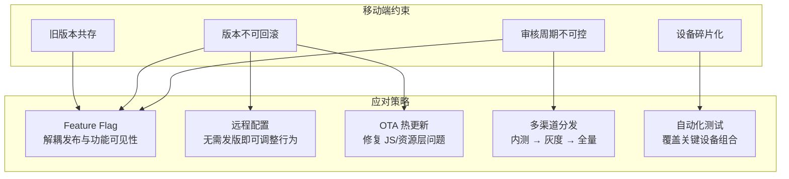
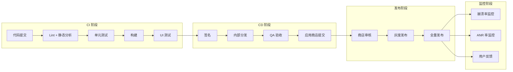
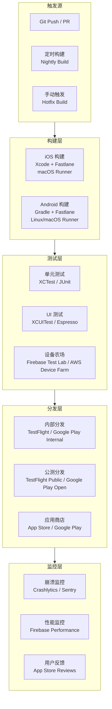

# 移动App持续交付

## 背景与问题定义

移动端持续交付面临一系列与 Web 后端截然不同的挑战：应用商店审核周期不可控（Apple 官方口径为 90% 的提交在 24 小时内完成审核，但复杂提交仍可能拖延数天）、已发布版本无法强制回滚（用户必须手动更新）、设备碎片化严重（iOS/Android 各有海量设备组合）、二进制体积受限于应用商店规则。这些约束使得 Web 端"频繁部署、快速回滚"的持续交付模式无法直接移植到移动端。

核心问题：**在应用商店审核、版本不可回滚、设备碎片化等移动端特有约束下，如何实现高质量的持续交付？**

## 核心概念

### 移动端 vs Web 端持续交付对比

| 维度 | Web 端 | 移动端 | 影响 |
|------|--------|--------|------|
| 部署方式 | 直接推送至服务器 | 提交至应用商店审核 | 部署节奏不可控 |
| 回滚能力 | 即时回滚到上一版本 | 无法强制用户回滚 | 必须发新版本修复 |
| 更新机制 | 用户刷新即获取最新版 | 需用户主动更新 | 旧版本长期共存 |
| 设备环境 | 浏览器兼容性 | OS 版本 + 硬件 + 屏幕尺寸 | 测试矩阵庞大 |
| 发布频率 | 按需，多次/天 | 1-2 周/次（受审核限制） | 反馈周期长 |
| 二进制限制 | 无 | 商店下载体积策略限制（如 Google Play AAB 基础模块 200MB 上限） | 体积控制严格 |

### 移动端持续交付的核心策略

针对移动端的特殊约束，业界发展出一系列应对策略：



### 移动端 CI/CD 流水线



## 架构设计

### 移动端 CI/CD 平台架构



## 实现方案

### 工具链选型

| 环节 | iOS 工具 | Android 工具 | 跨平台工具 |
|------|---------|-------------|-----------|
| CI 引擎 | GitHub Actions (macOS Runner) | GitHub Actions | Bitrise, Codemagic |
| 构建 | xcodebuild + Fastlane | Gradle + Fastlane | Fastlane |
| 单元测试 | XCTest | JUnit / Robolectric | Flutter test, Detox |
| UI 测试 | XCUITest | Espresso | Appium, Detox |
| 设备农场 | AWS Device Farm | Firebase Test Lab | BrowserStack, Sauce Labs |
| 签名 | Fastlane match | Gradle signingConfig | Fastlane |
| 内测分发 | TestFlight | Google Play Internal Testing | Firebase App Distribution |
| 崩溃监控 | Crashlytics | Crashlytics | Sentry |
| 性能监控 | Firebase Performance | Firebase Performance | Datadog RUM |

### Fastlane 配置示例

Fastlane 是移动端 CI/CD 自动化的事实标准：

```ruby
# Fastfile — Fastlane 配置
default_platform(:ios)

platform :ios do
  desc "执行完整 CI 流水线"
  lane :ci do
    # 1. 代码检查
    swiftlint(
      mode: :lint,
      strict: true,
      reporter: "json"
    )

    # 2. 单元测试
    run_tests(
      scheme: "OrdersApp",
      devices: ["iPhone 16"],
      result_bundle: true,
      output_directory: "./test-results"
    )

    # 3. 构建
    build_app(
      workspace: "OrdersApp.xcworkspace",
      scheme: "OrdersApp",
      export_method: "app-store",
      output_directory: "./build",
      include_bitcode: false,
      xcargs: "-skipPackagePluginValidation -skipMacroValidation"
    )

    # 4. 上传到 TestFlight
    upload_to_testflight(
      skip_waiting_for_build_processing: true,
      distribute_external: false,
      groups: ["internal-qa"],
      changelog: changelog_from_git_commits(
        commits_count: 10,
        pretty: "- %s"
      )
    )
  end

  desc "发布到 App Store"
  lane :release do
    # 确认版本号
    ensure_git_branch(branch: "main")
    ensure_git_status_clean

    # 构建 + 上传
    build_app(
      workspace: "OrdersApp.xcworkspace",
      scheme: "OrdersApp",
      export_method: "app-store"
    )

    upload_to_app_store(
      force: true,
      submit_for_review: true,
      automatic_release: false,  # 手动发布，支持灰度
      phased_release: true       # 启用分阶段发布
    )
  end

  desc "紧急热修复"
  lane :hotfix do
    # 快速构建 + 上传
    build_app(
      workspace: "OrdersApp.xcworkspace",
      scheme: "OrdersApp",
      export_method: "app-store"
    )

    upload_to_app_store(
      force: true,
      submit_for_review: true,
      automatic_release: true,   # 审核通过后自动发布
      phased_release: false      # 紧急修复不做灰度
    )
  end
end
```

### GitHub Actions iOS 构建工作流

```yaml
name: iOS CI/CD

on:
  push:
    branches: [main]
  pull_request:
    branches: [main]

jobs:
  test:
    runs-on: macos-15
    steps:
      - name: Checkout
        uses: actions/checkout@v4

      - name: Setup Xcode
        uses: maxim-lobanov/setup-xcode@v1
        with:
          xcode-version: '16.4'

      - name: Cache CocoaPods
        uses: actions/cache@v4
        with:
          path: Pods
          key: ${{ runner.os }}-pods-${{ hashFiles('**/Podfile.lock') }}

      - name: Install dependencies
        run: pod install

      - name: Run unit tests
        run: |
          set -o pipefail
          xcodebuild test \
            -workspace OrdersApp.xcworkspace \
            -scheme OrdersApp \
            -destination 'platform=iOS Simulator,name=iPhone 16,OS=18.4' \
            -resultBundlePath TestResults \
            | xcpretty --color --report junit --output TestResults/report.xml

      - name: Upload test results
        uses: actions/upload-artifact@v4
        if: always()
        with:
          name: test-results
          path: TestResults

  build-and-deploy:
    needs: test
    runs-on: macos-15
    if: github.ref == 'refs/heads/main' && github.event_name == 'push'
    steps:
      - name: Checkout
        uses: actions/checkout@v4

      - name: Setup Ruby
        uses: ruby/setup-ruby@v1
        with:
          ruby-version: '3.2'
          bundler-cache: true

      - name: Install Fastlane
        run: bundle install

      - name: Deploy to TestFlight
        env:
          MATCH_PASSWORD: ${{ secrets.MATCH_PASSWORD }}
          APP_STORE_CONNECT_API_KEY_ID: ${{ secrets.API_KEY_ID }}
          APP_STORE_CONNECT_ISSUER_ID: ${{ secrets.ISSUER_ID }}
          APP_STORE_CONNECT_PRIVATE_KEY: ${{ secrets.PRIVATE_KEY }}
        run: bundle exec fastlane ci
```

### 移动端 Feature Flag 实践

Feature Flag 是移动端持续交付的关键使能技术——它将"发版"与"功能上线"解耦：

```swift
// iOS Feature Flag 实现（Swift）
class FeatureFlagManager {
    static let shared = FeatureFlagManager()

    private var flags: [String: Any] = [:]

    init() {
        // 从远程配置服务加载 Feature Flag
        RemoteConfigService.shared.fetch { [weak self] config in
            self?.flags = config
        }
    }

    func isEnabled(_ feature: Feature) -> Bool {
        return flags[feature.rawValue] as? Bool ?? feature.defaultValue
    }
}

enum Feature: String {
    case newCheckoutFlow = "new_checkout_flow"
    case darkMode = "dark_mode"
    case paymentV2 = "payment_v2"

    var defaultValue: Bool {
        switch self {
        case .newCheckoutFlow: return false
        case .darkMode: return true
        case .paymentV2: return false
        }
    }
}

// 使用示例
if FeatureFlagManager.shared.isEnabled(.newCheckoutFlow) {
    showNewCheckoutView()
} else {
    showLegacyCheckoutView()
}
```

### 分步实施指南

**第一阶段：建立 CI 基础（Month 1-2）**

1. 配置 GitHub Actions / Bitrise 的 macOS Runner
2. 实现自动化构建和单元测试
3. 配置代码签名（Fastlane match）
4. 建立构建产物归档

**第二阶段：自动化分发（Month 3-4）**

1. 配置 Fastlane 自动上传到 TestFlight / Google Play
2. 建立内测分发流程（内部 QA 团队）
3. 实现每日构建（Nightly Build）
4. 引入 Firebase App Distribution 管理测试版本

**第三阶段：质量保障（Month 5-6）**

1. 引入 UI 自动化测试（XCUITest / Espresso）
2. 配置设备农场（Firebase Test Lab）
3. 集成崩溃监控（Crashlytics / Sentry）
4. 建立发布前质量检查清单

**第四阶段：发布优化（Month 7+）**

1. 实现 Feature Flag 系统
2. 建立灰度发布流程（App Store Phased Release）
3. 实现远程配置（Firebase Remote Config）
4. 建立崩溃率与发布版本的关联分析

## 最佳实践

### 业界推荐做法

1. **Feature Flag 必备**：移动端无法即时回滚，Feature Flag 是解耦发布与功能上线的核心手段
2. **每日构建**：即使不发版，也应保持每日构建和自动化测试运行，及时发现集成问题
3. **分阶段发布**：iOS App Store 的 Phased Release 和 Google Play 的 Staged Rollout 是灰度发布的原生支持
4. **崩溃率红线**：定义发布质量红线（如崩溃率 > 0.5% 立即发布修复版本）
5. **版本管理策略**：使用语义化版本号，区分 Major/Minor/Patch，不同类型走不同的发布流程

### 常见反模式与规避方法

| 反模式 | 表现 | 危害 | 规避方法 |
|--------|------|------|---------|
| 不做自动化测试 | 依赖手工测试 | 发布周期长，质量不可控 | 建立单元测试 + UI 测试 |
| 一次性全量发布 | 审核通过后全量推送 | 问题影响所有用户 | 分阶段发布 |
| 不监控崩溃率 | 发布后不看崩溃数据 | 问题发现晚 | Crashlytics + 崩溃率告警 |
| 硬编码功能开关 | 用编译宏控制功能 | 无法远程控制 | Feature Flag + 远程配置 |
| 忽视旧版本兼容 | API 不兼容旧版本客户端 | 用户无法使用 | API 版本化 + 优雅降级 |

## 效果度量

### 移动端发布质量指标

| 指标 | 定义 | 目标 |
|------|------|------|
| 构建成功率 | CI 构建成功的比例 | > 95% |
| 测试覆盖率 | 单元测试代码覆盖率 | > 70% |
| 崩溃率 | 每次会话的崩溃比例 | < 0.1% |
| ANR 率（Android） | 应用无响应的比例 | < 0.5% |
| 发布频率 | 单位时间内发版次数 | ≥ 1 次/2 周 |
| 审核通过率 | 一次审核通过的比例 | > 90% |
| 用户更新率 | 发布后 7 天内更新到新版本的用户比例 | > 50% |

## 总结

### 核心要点

1. 移动端持续交付面临审核周期、版本不可回滚、设备碎片化三大特有约束
2. Feature Flag 是移动端的核心使能技术——将"发版"与"功能上线"解耦
3. Fastlane 是移动端 CI/CD 自动化的事实标准，GitHub Actions 提供 macOS Runner
4. 分阶段发布（Phased Release / Staged Rollout）是移动端灰度发布的原生方式
5. 崩溃率是移动端发布质量的黄金指标，必须建立红线和告警

### 延伸阅读

- Fastlane. *Official Documentation*. https://docs.fastlane.tools/
- GitHub Actions. *Building and testing iOS apps*. https://docs.github.com/en/actions/use-cases-and-examples/building-and-testing/building-and-testing-ios-apps
- Firebase. *App Distribution*. https://firebase.google.com/docs/app-distribution
- Apple. *Phased Release*. https://developer.apple.com/help/app-store-connect/update-your-app/release-a-version-update