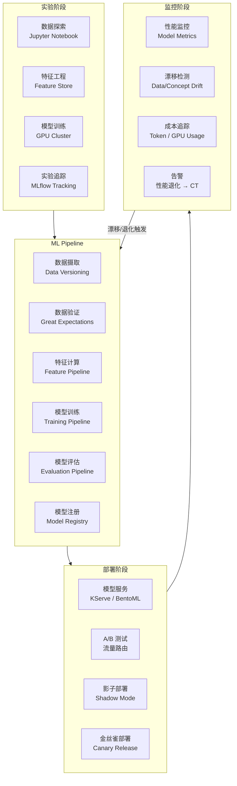
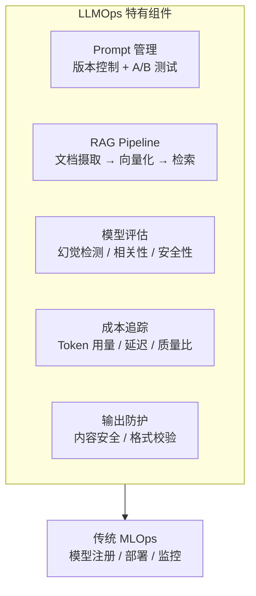

# MLOps：机器学习模型交付

## 背景与问题定义

机器学习模型的交付与传统软件交付存在本质差异。传统软件交付的是代码，行为由逻辑确定；ML 模型交付的却是"代码 + 数据 + 模型"，行为由数据分布决定——一旦数据分布发生变化（数据漂移），模型性能会不可预测地退化，必须重新训练和部署。叠加 ML 实验的不可复现性、训练与推理环境的差异、模型版本与数据版本的关联等问题，传统 CI/CD 流水线已无法直接覆盖 ML 交付全流程。

MLOps（Machine Learning Operations）正是为解决这些问题而生的实践体系。它将 DevOps 的理念扩展到 ML 领域，实现模型从实验、训练、评估到部署、监控、再训练的端到端自动化。

核心问题：**如何将 ML 模型从实验阶段安全、可复现、可持续地交付到生产环境，并应对数据漂移等 ML 特有的挑战？**

## 核心概念

### MLOps 与传统持续交付的差异

| 维度 | 传统持续交付 | MLOps |
|------|------------|-------|
| 交付对象 | 代码 | 代码 + 数据 + 模型 |
| 行为决定因素 | 代码逻辑 | 数据分布 + 模型权重 |
| 质量度量 | 测试通过率、代码覆盖率 | 模型精度、F1 Score、AUC |
| 退化原因 | 代码 Bug | 数据漂移（Data Drift）、概念漂移（Concept Drift） |
| 回滚方式 | 代码回滚 | 模型回滚 + 数据回滚 |
| 测试方法 | 单元/集成/E2E 测试 | 模型评估、A/B 测试、影子部署 |
| 环境一致性 | 构建环境 → 生产环境 | 训练环境 → 推理环境（GPU 差异） |
| 版本管理 | Git（代码版本） | Git + DVC（数据版本）+ Model Registry（模型版本） |

### MLOps 成熟度模型

```mermaid
flowchart LR
    L0["Level 0\n手动流程\nNotebook 驱动"] --> L1["Level 1\nML Pipeline\n自动化训练"]
    L1 --> L2["Level 2\nCI/CD/CT\n自动化部署"]
    L2 --> L3["Level 3\nFull MLOps\n自动化再训练 + 监控"]

    L0 -.- D0["特征：\n- 手动训练和部署\n- 无版本控制\n- 脚本化实验\n- 实验不可复现"]
    L1 -.- D1["特征：\n- Pipeline 编排\n- 实验追踪\n- 模型注册\n- 数据版本化"]
    L2 -.- D2["特征：\n- CI/CD 自动化\n- 模型 A/B 测试\n- 影子部署\n- 自动化部署"]
    L3 -.- D3["特征：\n- 漂移检测触发再训练\n- 自动化特征工程\n- 模型性能监控\n- 持续训练（CT）"]

    L1 fill:#fff3e0
```

### 持续训练（Continuous Training）

CT 是 MLOps 独有的概念——当检测到数据漂移或性能退化时，自动触发模型重新训练：

| 触发方式 | 场景 | 实现方法 |
|---------|------|---------|
| 定时触发 | 定期更新模型（如每日/每周） | Cron / Airflow / Kubeflow Pipeline |
| 数据漂移触发 | 数据分布显著变化 | 监控统计指标（PSI、KL 散度） |
| 性能退化触发 | 模型精度低于阈值 | 监控模型评估指标 |
| 人工触发 | 业务需求变化 | 手动启动 Pipeline |

## 架构设计

### MLOps 端到端架构



### LLMOps 架构

大语言模型（LLM）的交付引入了新的挑战，LLMOps 在 MLOps 基础上增加了 Prompt 管理、RAG Pipeline 和 Token 成本追踪：



## 实现方案

### 工具链选型

| 环节 | 推荐工具 | 备选 | 说明 |
|------|---------|------|------|
| 实验追踪 | MLflow | Weights & Biases, Comet ML | MLflow 开源且功能全面 |
| 数据版本化 | DVC | LakeFS, Delta Lake | DVC 与 Git 集成，轻量级 |
| ML Pipeline | Kubeflow Pipelines | Airflow, Prefect, Dagster | Kubeflow 原生 K8s |
| 模型注册 | MLflow Model Registry | Vertex AI, SageMaker | 与实验追踪统一 |
| 模型服务 | KServe / BentoML | TensorFlow Serving, Triton | KServe 是 K8s 原生 |
| 特征存储 | Feast | Tecton, Hopsworks | Feast 开源 |
| 数据验证 | Great Expectations | Pandera, Soda | Great Expectations 功能最全面 |
| 漂移检测 | Evidently AI | NannyML, Alibi Detect | Evidently 开源且可视化 |

### MLflow 实验追踪配置

```python
# MLflow 实验追踪示例
import mlflow
import mlflow.sklearn
from sklearn.ensemble import RandomForestClassifier
from sklearn.metrics import accuracy_score, f1_score, precision_score, recall_score

# 设置 MLflow Tracking Server
mlflow.set_tracking_uri("http://mlflow.example.com:5000")
mlflow.set_experiment("orders-delay-prediction")

# 定义可复现的训练过程
def train_model(X_train, y_train, X_test, y_test, params):
    with mlflow.start_run(run_name=f"rf-{params['n_estimators']}") as run:
        # 记录参数
        mlflow.log_params(params)

        # 训练模型
        model = RandomForestClassifier(
            n_estimators=params["n_estimators"],
            max_depth=params["max_depth"],
            random_state=42
        )
        model.fit(X_train, y_train)

        # 评估
        y_pred = model.predict(X_test)
        metrics = {
            "accuracy": accuracy_score(y_test, y_pred),
            "f1_score": f1_score(y_test, y_pred, average="weighted"),
            "precision": precision_score(y_test, y_pred, average="weighted"),
            "recall": recall_score(y_test, y_pred, average="weighted")
        }
        mlflow.log_metrics(metrics)

        # 记录模型
        mlflow.sklearn.log_model(
            model,
            "model",
            registered_model_name="orders-delay-prediction"
        )

        # 记录数据版本
        mlflow.log_param("data_version", params.get("data_version", "unknown"))

        return run.info.run_id, metrics

# 执行训练
params = {
    "n_estimators": 100,
    "max_depth": 10,
    "data_version": "dvc://datasets/orders/v3"
}
run_id, metrics = train_model(X_train, y_train, X_test, y_test, params)
print(f"Run ID: {run_id}, Metrics: {metrics}")
```

### Kubeflow Pipeline 定义示例

```python
# Kubeflow Pipeline 定义
from kfp import dsl
from kfp.dsl import component, Output, Model, Metrics

@component(base_image="python:3.11")
def data_ingestion(data_path: str, output_data: Output[dsl.Dataset]):
    import pandas as pd
    df = pd.read_csv(data_path)
    df.to_csv(output_data.path, index=False)

@component(base_image="python:3.11")
def data_validation(input_data: dsl.Dataset, validation_result: Output[Metrics]):
    import pandas as pd
    df = pd.read_csv(input_data.path)
    # 数据质量检查
    null_ratio = df.isnull().sum().sum() / (df.shape[0] * df.shape[1])
    validation_result.log_metric("null_ratio", null_ratio)
    validation_result.log_metric("row_count", len(df))
    validation_result.log_metric("column_count", len(df.columns))

@component(base_image="python:3.11")
def train_model(
    input_data: dsl.Dataset,
    n_estimators: int,
    output_model: Output[Model],
    output_metrics: Output[Metrics]
):
    import pandas as pd
    import pickle
    from sklearn.ensemble import RandomForestClassifier
    from sklearn.model_selection import train_test_split
    from sklearn.metrics import accuracy_score, f1_score

    df = pd.read_csv(input_data.path)
    X = df.drop("target", axis=1)
    y = df["target"]
    X_train, X_test, y_train, y_test = train_test_split(X, y, test_size=0.2)

    model = RandomForestClassifier(n_estimators=n_estimators, random_state=42)
    model.fit(X_train, y_train)

    y_pred = model.predict(X_test)
    output_metrics.log_metric("accuracy", accuracy_score(y_test, y_pred))
    output_metrics.log_metric("f1_score", f1_score(y_test, y_pred, average="weighted"))

    with open(output_model.path, "wb") as f:
        pickle.dump(model, f)

@dsl.pipeline(name="ml-training-pipeline")
def training_pipeline(
    data_path: str = "gs://ml-data/orders/v3/train.csv",
    n_estimators: int = 100
):
    ingest = data_ingestion(data_path=data_path)
    validate = data_validation(input_data=ingest.outputs["output_data"])
    train = train_model(
        input_data=ingest.outputs["output_data"],
        n_estimators=n_estimators
    )
    # 先完成数据验证，再进行训练
    train.after(validate)
```

### 分步实施指南

**第一阶段：实验规范化（Month 1-2）**

1. 部署 MLflow Tracking Server
2. 将所有 Notebook 实验迁移到 MLflow 追踪
3. 建立实验命名规范和标签体系
4. 引入 DVC 管理数据版本

**第二阶段：Pipeline 编排（Month 3-4）**

1. 将训练流程封装为 Kubeflow Pipeline
2. 实现数据摄取 → 验证 → 特征计算 → 训练 → 评估的自动化流水线
3. 建立模型注册中心（Model Registry）
4. 引入模型评估门禁（精度低于阈值则阻止部署）

**第三阶段：自动化部署（Month 5-6）**

1. 使用 KServe / BentoML 部署模型推理服务
2. 实现模型 A/B 测试和影子部署
3. 建立模型性能监控（推理延迟、精度退化）
4. 引入漂移检测（Evidently AI）

**第四阶段：持续训练（Month 7+）**

1. 实现漂移检测触发自动再训练
2. 建立模型版本与数据版本的关联
3. 引入 LLMOps 实践（Prompt 版本管理、RAG Pipeline）
4. 建立模型成本追踪（Token 用量、GPU 消耗）

## 最佳实践

### 业界推荐做法

1. **版本一切**：代码（Git）、数据（DVC）、模型（Model Registry）、Prompt（版本控制）——ML 交付的不可复现性问题源于缺乏版本管理
2. **实验追踪先行**：在建立 Pipeline 之前先实现实验追踪（MLflow），否则无法复现任何实验结果
3. **评估门禁**：模型部署前必须通过自动化评估——精度低于阈值或延迟超过阈值则阻止部署
4. **影子部署**：新模型先以影子模式运行（接收流量但不返回结果），对比与旧模型的输出差异
5. **漂移检测 + CT**：监控数据漂移和性能退化，自动触发再训练——这是 ML 系统与软件系统的本质区别

### 常见反模式与规避方法

| 反模式 | 表现 | 危害 | 规避方法 |
|--------|------|------|---------|
| Notebook 即生产 | 直接在 Jupyter Notebook 中运行推理 | 不可扩展、不可复现 | Pipeline 化 + 模型服务化 |
| 不追踪实验 | 模型训练不记录参数和指标 | 无法复现、无法对比 | MLflow 实验追踪 |
| 不验证数据 | 训练前不检查数据质量 | 垃圾进垃圾出 | Great Expectations 数据验证 |
| 忽视漂移 | 部署后不监控数据分布变化 | 模型逐渐失效 | Evidently AI 漂移检测 |
| 模型无版本 | 部署时直接覆盖旧模型 | 无法回滚 | Model Registry + 模型版本化 |

## 效果度量

### MLOps 成熟度指标

| 指标 | Level 0 | Level 1 | Level 2 | Level 3 |
|------|---------|---------|---------|---------|
| 实验可复现率 | < 10% | > 70% | > 90% | > 95% |
| 模型部署自动化率 | 0% | 30% | 80% | 95% |
| 数据版本覆盖率 | 0% | > 50% | > 80% | > 95% |
| 漂移检测延迟 | 无 | 天级 | 小时级 | 分钟级 |
| 模型上线时间 | 周 | 天 | 小时 | 分钟 |

### ML 系统质量指标

| 指标 | 定义 | 目标 |
|------|------|------|
| 模型精度 | 在生产数据上的评估指标（AUC/F1/MAE） | ≥ 离线评估的 95% |
| 推理延迟 P99 | 模型推理的 P99 响应时间 | < 业务 SLA |
| 数据漂移率 | PSI > 阈值的数据特征比例 | < 10% |
| 模型退化时间 | 从部署到精度低于阈值的时间 | > 30 天 |
| 再训练成功率 | 自动再训练 Pipeline 成功运行的比例 | > 90% |

## 总结

### 核心要点

1. MLOps 将 DevOps 理念扩展到 ML 领域，核心差异在于交付对象是"代码 + 数据 + 模型"，行为由数据分布决定
2. 持续训练（CT）是 MLOps 独有的概念——漂移检测触发自动再训练
3. 版本一切（代码、数据、模型、Prompt）是解决 ML 不可复现性的基础
4. MLflow 是实验追踪和模型注册的事实标准，Kubeflow 是 ML Pipeline 编排的首选
5. LLMOps 在 MLOps 基础上增加了 Prompt 管理、RAG Pipeline 和 Token 成本追踪

### 延伸阅读

- MLflow. *Official Documentation*. https://mlflow.org/docs/latest/index.html
- Kubeflow. *Official Documentation*. https://www.kubeflow.org/docs/
- DVC. *Official Documentation*. https://dvc.org/doc
- Evidently AI. *Official Documentation*. https://docs.evidentlyai.com/
- BentoML. *Official Documentation*. https://docs.bentoml.com/